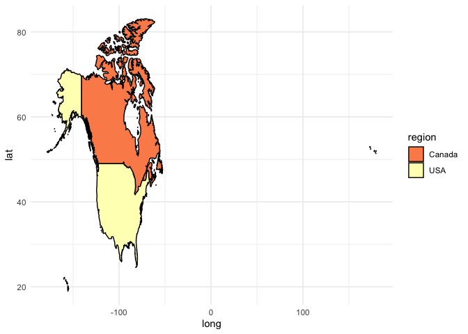
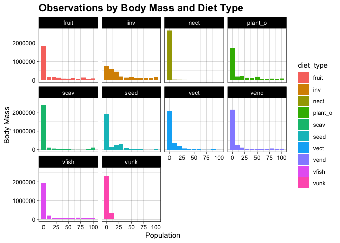
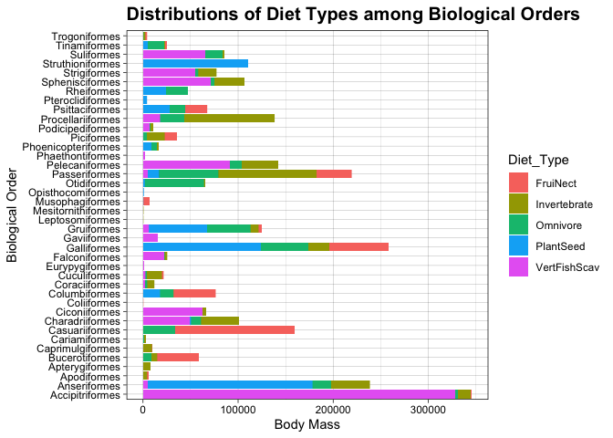
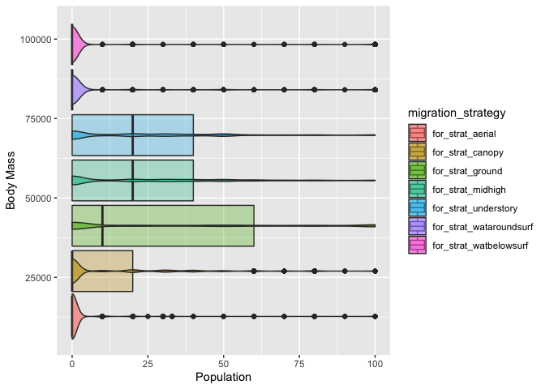

## R Markdown

This is an R Markdown document. Markdown is a simple formatting syntax for authoring HTML, PDF, and MS Word documents. For more details on using R Markdown see <http://rmarkdown.rstudio.com>.

When you click the **Knit** button a document will be generated that includes both content as well as the output of any embedded R code chunks within the document. You can embed an R code chunk like this:

#libraries that will be used

```r
library(here)
```

```
## here() starts at /Users/lisayuan/Desktop/bis15lgroupproject
```

```r
library(readr)
library(tidyverse)
```

```
## ── Attaching packages ─────────────────────────────────────── tidyverse 1.3.1 ──
```

```
## ✓ ggplot2 3.3.5     ✓ dplyr   1.0.8
## ✓ tibble  3.1.6     ✓ stringr 1.4.0
## ✓ tidyr   1.2.0     ✓ forcats 0.5.1
## ✓ purrr   0.3.4
```

```
## ── Conflicts ────────────────────────────────────────── tidyverse_conflicts() ──
## x dplyr::filter() masks stats::filter()
## x dplyr::lag()    masks stats::lag()
```

```r
library(janitor)
```

```
## 
## Attaching package: 'janitor'
```

```
## The following objects are masked from 'package:stats':
## 
##     chisq.test, fisher.test
```

```r
library(shiny)
library(shinydashboard)
```

```
## 
## Attaching package: 'shinydashboard'
```

```
## The following object is masked from 'package:graphics':
## 
##     box
```

#load the data set

```r
bird<-read_csv(here("BirdFuncDat.csv"))
```

```
## Warning: One or more parsing issues, see `problems()` for details
```

```
## Rows: 9995 Columns: 40
## ── Column specification ────────────────────────────────────────────────────────
## Delimiter: ","
## chr (15): PassNonPass, IOCOrder, BLFamilyLatin, BLFamilyEnglish, Taxo, Scien...
## dbl (24): SpecID, BLFamSequID, Diet-Inv, Diet-Vend, Diet-Vect, Diet-Vfish, D...
## lgl  (1): Record-Comment
## 
## ℹ Use `spec()` to retrieve the full column specification for this data.
## ℹ Specify the column types or set `show_col_types = FALSE` to quiet this message.
```


#have an overview for the data set,know how NAs are represented

```r
glimpse(bird)
```

```
## Rows: 9,995
## Columns: 40
## $ SpecID                   <dbl> 28, 37, 38, 45, 46, 47, 48, 55, 57, 58, 65, 6…
## $ PassNonPass              <chr> "Nonpasseriformes", "Nonpasseriformes", "Nonp…
## $ IOCOrder                 <chr> "Struthioniformes", "Rheiformes", "Rheiformes…
## $ BLFamilyLatin            <chr> "Struthionidae", "Rheidae", "Rheidae", "Casua…
## $ BLFamilyEnglish          <chr> "Ostriches", "Rheas", "Rheas", "Cassowaries",…
## $ BLFamSequID              <dbl> 2, 3, 3, 4, 4, 4, 5, 6, 6, 6, 1, 1, 1, 1, 1, …
## $ Taxo                     <chr> "BL3", "BL3", "BL3", "BL3", "BL3", "BL3", "BL…
## $ Scientific               <chr> "Struthio camelus", "Rhea americana", "Rhea p…
## $ English                  <chr> "Ostrich", "Greater Rhea", "Lesser Rhea", "So…
## $ `Diet-Inv`               <dbl> 10, 20, 20, 10, 10, 20, 20, 80, 80, 100, 10, …
## $ `Diet-Vend`              <dbl> 0, 10, 0, 0, 0, 0, 0, 0, 0, 0, 0, 0, 0, 0, 0,…
## $ `Diet-Vect`              <dbl> 0, 10, 0, 0, 0, 0, 0, 0, 0, 0, 0, 0, 0, 10, 0…
## $ `Diet-Vfish`             <dbl> 0, 0, 0, 0, 0, 0, 0, 0, 0, 0, 0, 0, 0, 0, 0, …
## $ `Diet-Vunk`              <dbl> 10, 0, 10, 10, 10, 10, 0, 0, 0, 0, 0, 0, 0, 0…
## $ `Diet-Scav`              <dbl> 0, 0, 0, 0, 0, 0, 0, 0, 0, 0, 0, 0, 0, 0, 0, …
## $ `Diet-Fruit`             <dbl> 0, 20, 0, 80, 80, 60, 30, 10, 10, 0, 40, 40, …
## $ `Diet-Nect`              <dbl> 0, 0, 0, 0, 0, 0, 0, 0, 0, 0, 0, 0, 0, 0, 0, …
## $ `Diet-Seed`              <dbl> 30, 20, 30, 0, 0, 0, 30, 0, 0, 0, 30, 20, 40,…
## $ `Diet-PlantO`            <dbl> 50, 20, 40, 0, 0, 10, 20, 10, 10, 0, 20, 20, …
## $ `Diet-5Cat`              <chr> "PlantSeed", "Omnivore", "PlantSeed", "FruiNe…
## $ `Diet-Source`            <chr> "Ref_1", "Ref_1", "Ref_1", "Ref_1", "Ref_1", …
## $ `Diet-Certainty`         <chr> "A", "A", "A", "A", "B", "A", "A", "A", "A", …
## $ `Diet-EnteredBy`         <chr> "Jennifer", "Jennifer", "Jennifer", "Jennifer…
## $ `ForStrat-watbelowsurf`  <dbl> 0, 0, 0, 0, 0, 0, 0, 0, 0, 0, 0, 0, 0, 0, 0, …
## $ `ForStrat-wataroundsurf` <dbl> 0, 0, 0, 0, 0, 0, 0, 0, 0, 0, 0, 0, 0, 0, 0, …
## $ `ForStrat-ground`        <dbl> 100, 100, 100, 80, 80, 80, 20, 100, 80, 80, 1…
## $ `ForStrat-understory`    <dbl> 0, 0, 0, 20, 20, 20, 80, 0, 20, 20, 0, 0, 0, …
## $ `ForStrat-midhigh`       <dbl> 0, 0, 0, 0, 0, 0, 0, 0, 0, 0, 0, 0, 0, 0, 0, …
## $ `ForStrat-canopy`        <dbl> 0, 0, 0, 0, 0, 0, 0, 0, 0, 0, 0, 0, 0, 0, 0, …
## $ `ForStrat-aerial`        <dbl> 0, 0, 0, 0, 0, 0, 0, 0, 0, 0, 0, 0, 0, 0, 0, …
## $ PelagicSpecialist        <dbl> 0, 0, 0, 0, 0, 0, 0, 0, 0, 0, 0, 0, 0, 0, 0, …
## $ `ForStrat-Source`        <chr> "Ref_1", "Ref_1", "Ref_1", "Ref_1", "Ref_1", …
## $ `ForStrat-SpecLevel`     <dbl> 1, 1, 1, 1, 1, 1, 1, 1, 1, 1, 1, 1, 0, 1, 1, …
## $ `ForStrat-EnteredBy`     <chr> "Jessica", "Jessica", "Jessica", "Jessica", "…
## $ Nocturnal                <dbl> 0, 0, 0, 0, 0, 0, 0, 1, 1, 1, 0, 0, 0, 0, 0, …
## $ `BodyMass-Value`         <dbl> 111000.00, 23000.00, 23900.00, 44000.00, 3499…
## $ `BodyMass-Source`        <chr> "Dunning08", "Dunning08", "Dunning08", "Dunni…
## $ `BodyMass-SpecLevel`     <dbl> 1, 1, 1, 1, 1, 1, 1, 1, 1, 1, 1, 1, 1, 1, 1, …
## $ `BodyMass-Comment`       <chr> NA, NA, NA, NA, NA, NA, NA, NA, NA, NA, NA, N…
## $ `Record-Comment`         <lgl> NA, NA, NA, NA, NA, NA, NA, NA, NA, NA, NA, N…
```


```r
names(bird)
```

```
##  [1] "SpecID"                 "PassNonPass"            "IOCOrder"              
##  [4] "BLFamilyLatin"          "BLFamilyEnglish"        "BLFamSequID"           
##  [7] "Taxo"                   "Scientific"             "English"               
## [10] "Diet-Inv"               "Diet-Vend"              "Diet-Vect"             
## [13] "Diet-Vfish"             "Diet-Vunk"              "Diet-Scav"             
## [16] "Diet-Fruit"             "Diet-Nect"              "Diet-Seed"             
## [19] "Diet-PlantO"            "Diet-5Cat"              "Diet-Source"           
## [22] "Diet-Certainty"         "Diet-EnteredBy"         "ForStrat-watbelowsurf" 
## [25] "ForStrat-wataroundsurf" "ForStrat-ground"        "ForStrat-understory"   
## [28] "ForStrat-midhigh"       "ForStrat-canopy"        "ForStrat-aerial"       
## [31] "PelagicSpecialist"      "ForStrat-Source"        "ForStrat-SpecLevel"    
## [34] "ForStrat-EnteredBy"     "Nocturnal"              "BodyMass-Value"        
## [37] "BodyMass-Source"        "BodyMass-SpecLevel"     "BodyMass-Comment"      
## [40] "Record-Comment"
```

#clean the names using janitor

```r
bird<-clean_names(bird)
```


```r
names(bird)
```

```
##  [1] "spec_id"                 "pass_non_pass"          
##  [3] "ioc_order"               "bl_family_latin"        
##  [5] "bl_family_english"       "bl_fam_sequ_id"         
##  [7] "taxo"                    "scientific"             
##  [9] "english"                 "diet_inv"               
## [11] "diet_vend"               "diet_vect"              
## [13] "diet_vfish"              "diet_vunk"              
## [15] "diet_scav"               "diet_fruit"             
## [17] "diet_nect"               "diet_seed"              
## [19] "diet_plant_o"            "diet_5cat"              
## [21] "diet_source"             "diet_certainty"         
## [23] "diet_entered_by"         "for_strat_watbelowsurf" 
## [25] "for_strat_wataroundsurf" "for_strat_ground"       
## [27] "for_strat_understory"    "for_strat_midhigh"      
## [29] "for_strat_canopy"        "for_strat_aerial"       
## [31] "pelagic_specialist"      "for_strat_source"       
## [33] "for_strat_spec_level"    "for_strat_entered_by"   
## [35] "nocturnal"               "body_mass_value"        
## [37] "body_mass_source"        "body_mass_spec_level"   
## [39] "body_mass_comment"       "record_comment"
```

#creat new data set with only useful info and data

```r
bird_new<-bird%>%
  select(ioc_order,bl_family_english,scientific,english,diet_inv,diet_vend,diet_vect,diet_vfish,diet_vunk,diet_scav,diet_fruit,diet_nect,diet_seed,diet_plant_o,diet_5cat,for_strat_watbelowsurf,for_strat_wataroundsurf,for_strat_ground,for_strat_understory,for_strat_midhigh,for_strat_canopy,for_strat_aerial,nocturnal,body_mass_value)
bird_new
```

```
## # A tibble: 9,995 × 24
##    ioc_order    bl_family_engli… scientific english diet_inv diet_vend diet_vect
##    <chr>        <chr>            <chr>      <chr>      <dbl>     <dbl>     <dbl>
##  1 Struthionif… Ostriches        Struthio … Ostrich       10         0         0
##  2 Rheiformes   Rheas            Rhea amer… Greate…       20        10        10
##  3 Rheiformes   Rheas            Rhea penn… Lesser…       20         0         0
##  4 Casuariifor… Cassowaries      Casuarius… Southe…       10         0         0
##  5 Casuariifor… Cassowaries      Casuarius… Dwarf …       10         0         0
##  6 Casuariifor… Cassowaries      Casuarius… Northe…       20         0         0
##  7 Casuariifor… Emus             Dromaius … Emu           20         0         0
##  8 Apterygifor… Kiwis            Apteryx a… Southe…       80         0         0
##  9 Apterygifor… Kiwis            Apteryx o… Little…       80         0         0
## 10 Apterygifor… Kiwis            Apteryx h… Great …      100         0         0
## # … with 9,985 more rows, and 17 more variables: diet_vfish <dbl>,
## #   diet_vunk <dbl>, diet_scav <dbl>, diet_fruit <dbl>, diet_nect <dbl>,
## #   diet_seed <dbl>, diet_plant_o <dbl>, diet_5cat <chr>,
## #   for_strat_watbelowsurf <dbl>, for_strat_wataroundsurf <dbl>,
## #   for_strat_ground <dbl>, for_strat_understory <dbl>,
## #   for_strat_midhigh <dbl>, for_strat_canopy <dbl>, for_strat_aerial <dbl>,
## #   nocturnal <dbl>, body_mass_value <dbl>
```

#new data set overview

```r
glimpse(bird_new)
```

```
## Rows: 9,995
## Columns: 24
## $ ioc_order               <chr> "Struthioniformes", "Rheiformes", "Rheiformes"…
## $ bl_family_english       <chr> "Ostriches", "Rheas", "Rheas", "Cassowaries", …
## $ scientific              <chr> "Struthio camelus", "Rhea americana", "Rhea pe…
## $ english                 <chr> "Ostrich", "Greater Rhea", "Lesser Rhea", "Sou…
## $ diet_inv                <dbl> 10, 20, 20, 10, 10, 20, 20, 80, 80, 100, 10, 2…
## $ diet_vend               <dbl> 0, 10, 0, 0, 0, 0, 0, 0, 0, 0, 0, 0, 0, 0, 0, …
## $ diet_vect               <dbl> 0, 10, 0, 0, 0, 0, 0, 0, 0, 0, 0, 0, 0, 10, 0,…
## $ diet_vfish              <dbl> 0, 0, 0, 0, 0, 0, 0, 0, 0, 0, 0, 0, 0, 0, 0, 0…
## $ diet_vunk               <dbl> 10, 0, 10, 10, 10, 10, 0, 0, 0, 0, 0, 0, 0, 0,…
## $ diet_scav               <dbl> 0, 0, 0, 0, 0, 0, 0, 0, 0, 0, 0, 0, 0, 0, 0, 0…
## $ diet_fruit              <dbl> 0, 20, 0, 80, 80, 60, 30, 10, 10, 0, 40, 40, 5…
## $ diet_nect               <dbl> 0, 0, 0, 0, 0, 0, 0, 0, 0, 0, 0, 0, 0, 0, 0, 0…
## $ diet_seed               <dbl> 30, 20, 30, 0, 0, 0, 30, 0, 0, 0, 30, 20, 40, …
## $ diet_plant_o            <dbl> 50, 20, 40, 0, 0, 10, 20, 10, 10, 0, 20, 20, 1…
## $ diet_5cat               <chr> "PlantSeed", "Omnivore", "PlantSeed", "FruiNec…
## $ for_strat_watbelowsurf  <dbl> 0, 0, 0, 0, 0, 0, 0, 0, 0, 0, 0, 0, 0, 0, 0, 0…
## $ for_strat_wataroundsurf <dbl> 0, 0, 0, 0, 0, 0, 0, 0, 0, 0, 0, 0, 0, 0, 0, 0…
## $ for_strat_ground        <dbl> 100, 100, 100, 80, 80, 80, 20, 100, 80, 80, 10…
## $ for_strat_understory    <dbl> 0, 0, 0, 20, 20, 20, 80, 0, 20, 20, 0, 0, 0, 0…
## $ for_strat_midhigh       <dbl> 0, 0, 0, 0, 0, 0, 0, 0, 0, 0, 0, 0, 0, 0, 0, 0…
## $ for_strat_canopy        <dbl> 0, 0, 0, 0, 0, 0, 0, 0, 0, 0, 0, 0, 0, 0, 0, 0…
## $ for_strat_aerial        <dbl> 0, 0, 0, 0, 0, 0, 0, 0, 0, 0, 0, 0, 0, 0, 0, 0…
## $ nocturnal               <dbl> 0, 0, 0, 0, 0, 0, 0, 1, 1, 1, 0, 0, 0, 0, 0, 0…
## $ body_mass_value         <dbl> 111000.00, 23000.00, 23900.00, 44000.00, 34999…
```

#NAs are represented as NAs in this data

```r
anyNA(bird_new)
```

```
## [1] TRUE
```

#export the new data

```r
write.csv(bird_new, file = "bird_tidy.csv", row.names = FALSE)
```

#load the new data

```r
bird_new<-read_csv(here("bird_tidy.csv"))
```

```
## Rows: 9995 Columns: 24
## ── Column specification ────────────────────────────────────────────────────────
## Delimiter: ","
## chr  (5): ioc_order, bl_family_english, scientific, english, diet_5cat
## dbl (19): diet_inv, diet_vend, diet_vect, diet_vfish, diet_vunk, diet_scav, ...
## 
## ℹ Use `spec()` to retrieve the full column specification for this data.
## ℹ Specify the column types or set `show_col_types = FALSE` to quiet this message.
```


## Including Plots


#remove scientific notion/symbol

```r
options(scipen=999)
```

#start analyzing data

```r
bird_new%>%
  count(ioc_order)
```

```
## # A tibble: 41 × 2
##    ioc_order            n
##    <chr>            <int>
##  1 Accipitriformes    251
##  2 Anseriformes       160
##  3 Apodiformes        450
##  4 Apterygiformes       4
##  5 Bucerotiformes      66
##  6 Caprimulgiformes   114
##  7 Cariamiformes        2
##  8 Casuariiformes       4
##  9 Charadriiformes    369
## 10 Ciconiiformes       19
## # … with 31 more rows
```

```r
bird_new%>%
  filter(ioc_order=="Accipitriformes")%>%
  select(ioc_order,body_mass_value)%>%
  summarise(avg_aci=mean(body_mass_value))
```

```
## # A tibble: 1 × 1
##   avg_aci
##     <dbl>
## 1   1378.
```
#average body mass for each order

```r
avg_bodymass<-bird_new%>%
  group_by(ioc_order)%>%
  select(ioc_order,body_mass_value)%>%
  summarize_each(funs(mean_bodymass=mean(.,na.rm=T)))%>%
  na.exclude()%>%
  arrange(desc(mean_bodymass))
```

```
## Warning: `summarise_each_()` was deprecated in dplyr 0.7.0.
## Please use `across()` instead.
## This warning is displayed once every 8 hours.
## Call `lifecycle::last_lifecycle_warnings()` to see where this warning was generated.
```

```
## Warning: `funs()` was deprecated in dplyr 0.8.0.
## Please use a list of either functions or lambdas: 
## 
##   # Simple named list: 
##   list(mean = mean, median = median)
## 
##   # Auto named with `tibble::lst()`: 
##   tibble::lst(mean, median)
## 
##   # Using lambdas
##   list(~ mean(., trim = .2), ~ median(., na.rm = TRUE))
## This warning is displayed once every 8 hours.
## Call `lifecycle::last_lifecycle_warnings()` to see where this warning was generated.
```

```r
avg_bodymass
```

```
## # A tibble: 40 × 2
##    ioc_order           mean_bodymass
##    <chr>                       <dbl>
##  1 Struthioniformes          111000 
##  2 Casuariiformes             39792.
##  3 Rheiformes                 23450 
##  4 Sphenisciformes             5911.
##  5 Ciconiiformes               3484.
##  6 Gaviiformes                 3178.
##  7 Phoenicopteriformes         2790.
##  8 Otidiformes                 2628.
##  9 Apterygiformes              1975.
## 10 Suliformes                  1654.
## # … with 30 more rows
```
#library for drawing map

```r
library(ggmap)
```

```
## Google's Terms of Service: https://cloud.google.com/maps-platform/terms/.
```

```
## Please cite ggmap if you use it! See citation("ggmap") for details.
```
#new package for map

```r
#install.packages("maps")
#install.packages("mapdata")
```

```r
help(package="maps")
```


```r
library(maps)
```

```
## 
## Attaching package: 'maps'
```

```
## The following object is masked from 'package:purrr':
## 
##     map
```

```r
library(mapdata)
```

#know how the names are represented in the data set

```r
world_map<-map_data("world")
sort(unique(world_map$region))
```

```
##   [1] "Afghanistan"                        
##   [2] "Albania"                            
##   [3] "Algeria"                            
##   [4] "American Samoa"                     
##   [5] "Andorra"                            
##   [6] "Angola"                             
##   [7] "Anguilla"                           
##   [8] "Antarctica"                         
##   [9] "Antigua"                            
##  [10] "Argentina"                          
##  [11] "Armenia"                            
##  [12] "Aruba"                              
##  [13] "Ascension Island"                   
##  [14] "Australia"                          
##  [15] "Austria"                            
##  [16] "Azerbaijan"                         
##  [17] "Azores"                             
##  [18] "Bahamas"                            
##  [19] "Bahrain"                            
##  [20] "Bangladesh"                         
##  [21] "Barbados"                           
##  [22] "Barbuda"                            
##  [23] "Belarus"                            
##  [24] "Belgium"                            
##  [25] "Belize"                             
##  [26] "Benin"                              
##  [27] "Bermuda"                            
##  [28] "Bhutan"                             
##  [29] "Bolivia"                            
##  [30] "Bonaire"                            
##  [31] "Bosnia and Herzegovina"             
##  [32] "Botswana"                           
##  [33] "Brazil"                             
##  [34] "Brunei"                             
##  [35] "Bulgaria"                           
##  [36] "Burkina Faso"                       
##  [37] "Burundi"                            
##  [38] "Cambodia"                           
##  [39] "Cameroon"                           
##  [40] "Canada"                             
##  [41] "Canary Islands"                     
##  [42] "Cape Verde"                         
##  [43] "Cayman Islands"                     
##  [44] "Central African Republic"           
##  [45] "Chad"                               
##  [46] "Chagos Archipelago"                 
##  [47] "Chile"                              
##  [48] "China"                              
##  [49] "Christmas Island"                   
##  [50] "Cocos Islands"                      
##  [51] "Colombia"                           
##  [52] "Comoros"                            
##  [53] "Cook Islands"                       
##  [54] "Costa Rica"                         
##  [55] "Croatia"                            
##  [56] "Cuba"                               
##  [57] "Curacao"                            
##  [58] "Cyprus"                             
##  [59] "Czech Republic"                     
##  [60] "Democratic Republic of the Congo"   
##  [61] "Denmark"                            
##  [62] "Djibouti"                           
##  [63] "Dominica"                           
##  [64] "Dominican Republic"                 
##  [65] "Ecuador"                            
##  [66] "Egypt"                              
##  [67] "El Salvador"                        
##  [68] "Equatorial Guinea"                  
##  [69] "Eritrea"                            
##  [70] "Estonia"                            
##  [71] "Ethiopia"                           
##  [72] "Falkland Islands"                   
##  [73] "Faroe Islands"                      
##  [74] "Fiji"                               
##  [75] "Finland"                            
##  [76] "France"                             
##  [77] "French Guiana"                      
##  [78] "French Polynesia"                   
##  [79] "French Southern and Antarctic Lands"
##  [80] "Gabon"                              
##  [81] "Gambia"                             
##  [82] "Georgia"                            
##  [83] "Germany"                            
##  [84] "Ghana"                              
##  [85] "Greece"                             
##  [86] "Greenland"                          
##  [87] "Grenada"                            
##  [88] "Grenadines"                         
##  [89] "Guadeloupe"                         
##  [90] "Guam"                               
##  [91] "Guatemala"                          
##  [92] "Guernsey"                           
##  [93] "Guinea"                             
##  [94] "Guinea-Bissau"                      
##  [95] "Guyana"                             
##  [96] "Haiti"                              
##  [97] "Heard Island"                       
##  [98] "Honduras"                           
##  [99] "Hungary"                            
## [100] "Iceland"                            
## [101] "India"                              
## [102] "Indonesia"                          
## [103] "Iran"                               
## [104] "Iraq"                               
## [105] "Ireland"                            
## [106] "Isle of Man"                        
## [107] "Israel"                             
## [108] "Italy"                              
## [109] "Ivory Coast"                        
## [110] "Jamaica"                            
## [111] "Japan"                              
## [112] "Jersey"                             
## [113] "Jordan"                             
## [114] "Kazakhstan"                         
## [115] "Kenya"                              
## [116] "Kiribati"                           
## [117] "Kosovo"                             
## [118] "Kuwait"                             
## [119] "Kyrgyzstan"                         
## [120] "Laos"                               
## [121] "Latvia"                             
## [122] "Lebanon"                            
## [123] "Lesotho"                            
## [124] "Liberia"                            
## [125] "Libya"                              
## [126] "Liechtenstein"                      
## [127] "Lithuania"                          
## [128] "Luxembourg"                         
## [129] "Madagascar"                         
## [130] "Madeira Islands"                    
## [131] "Malawi"                             
## [132] "Malaysia"                           
## [133] "Maldives"                           
## [134] "Mali"                               
## [135] "Malta"                              
## [136] "Marshall Islands"                   
## [137] "Martinique"                         
## [138] "Mauritania"                         
## [139] "Mauritius"                          
## [140] "Mayotte"                            
## [141] "Mexico"                             
## [142] "Micronesia"                         
## [143] "Moldova"                            
## [144] "Monaco"                             
## [145] "Mongolia"                           
## [146] "Montenegro"                         
## [147] "Montserrat"                         
## [148] "Morocco"                            
## [149] "Mozambique"                         
## [150] "Myanmar"                            
## [151] "Namibia"                            
## [152] "Nauru"                              
## [153] "Nepal"                              
## [154] "Netherlands"                        
## [155] "Nevis"                              
## [156] "New Caledonia"                      
## [157] "New Zealand"                        
## [158] "Nicaragua"                          
## [159] "Niger"                              
## [160] "Nigeria"                            
## [161] "Niue"                               
## [162] "Norfolk Island"                     
## [163] "North Korea"                        
## [164] "North Macedonia"                    
## [165] "Northern Mariana Islands"           
## [166] "Norway"                             
## [167] "Oman"                               
## [168] "Pakistan"                           
## [169] "Palau"                              
## [170] "Palestine"                          
## [171] "Panama"                             
## [172] "Papua New Guinea"                   
## [173] "Paraguay"                           
## [174] "Peru"                               
## [175] "Philippines"                        
## [176] "Pitcairn Islands"                   
## [177] "Poland"                             
## [178] "Portugal"                           
## [179] "Puerto Rico"                        
## [180] "Qatar"                              
## [181] "Republic of Congo"                  
## [182] "Reunion"                            
## [183] "Romania"                            
## [184] "Russia"                             
## [185] "Rwanda"                             
## [186] "Saba"                               
## [187] "Saint Barthelemy"                   
## [188] "Saint Helena"                       
## [189] "Saint Kitts"                        
## [190] "Saint Lucia"                        
## [191] "Saint Martin"                       
## [192] "Saint Pierre and Miquelon"          
## [193] "Saint Vincent"                      
## [194] "Samoa"                              
## [195] "San Marino"                         
## [196] "Sao Tome and Principe"              
## [197] "Saudi Arabia"                       
## [198] "Senegal"                            
## [199] "Serbia"                             
## [200] "Seychelles"                         
## [201] "Siachen Glacier"                    
## [202] "Sierra Leone"                       
## [203] "Singapore"                          
## [204] "Sint Eustatius"                     
## [205] "Sint Maarten"                       
## [206] "Slovakia"                           
## [207] "Slovenia"                           
## [208] "Solomon Islands"                    
## [209] "Somalia"                            
## [210] "South Africa"                       
## [211] "South Georgia"                      
## [212] "South Korea"                        
## [213] "South Sandwich Islands"             
## [214] "South Sudan"                        
## [215] "Spain"                              
## [216] "Sri Lanka"                          
## [217] "Sudan"                              
## [218] "Suriname"                           
## [219] "Swaziland"                          
## [220] "Sweden"                             
## [221] "Switzerland"                        
## [222] "Syria"                              
## [223] "Taiwan"                             
## [224] "Tajikistan"                         
## [225] "Tanzania"                           
## [226] "Thailand"                           
## [227] "Timor-Leste"                        
## [228] "Tobago"                             
## [229] "Togo"                               
## [230] "Tonga"                              
## [231] "Trinidad"                           
## [232] "Tunisia"                            
## [233] "Turkey"                             
## [234] "Turkmenistan"                       
## [235] "Turks and Caicos Islands"           
## [236] "Uganda"                             
## [237] "UK"                                 
## [238] "Ukraine"                            
## [239] "United Arab Emirates"               
## [240] "Uruguay"                            
## [241] "USA"                                
## [242] "Uzbekistan"                         
## [243] "Vanuatu"                            
## [244] "Vatican"                            
## [245] "Venezuela"                          
## [246] "Vietnam"                            
## [247] "Virgin Islands"                     
## [248] "Wallis and Futuna"                  
## [249] "Western Sahara"                     
## [250] "Yemen"                              
## [251] "Zambia"                             
## [252] "Zimbabwe"
```


#have an overview for the region map data

```r
world_map%>%
  filter(region=="USA"|region=="Canada")
```

```
##             long      lat group order region                         subregion
## 1      -59.78760 43.93960   245 14759 Canada                      Sable Island
## 2      -59.92227 43.90391   245 14760 Canada                      Sable Island
## 3      -60.03775 43.90664   245 14761 Canada                      Sable Island
## 4      -60.11426 43.93911   245 14762 Canada                      Sable Island
## 5      -60.11748 43.95337   245 14763 Canada                      Sable Island
## 6      -59.93604 43.93960   245 14764 Canada                      Sable Island
## 7      -59.86636 43.94717   245 14765 Canada                      Sable Island
## 8      -59.72715 44.00283   245 14766 Canada                      Sable Island
## 9      -59.78760 43.93960   245 14767 Canada                      Sable Island
## 10     -66.27377 44.29229   246 14769 Canada                                 5
## 11     -66.32412 44.25732   246 14770 Canada                                 5
## 12     -66.31191 44.29160   246 14771 Canada                                 5
## 13     -66.25049 44.37901   246 14772 Canada                                 5
## 14     -66.21035 44.39204   246 14773 Canada                                 5
## 15     -66.27377 44.29229   246 14774 Canada                                 5
## 16     -66.76250 44.68179   247 14776 Canada                Grand Manan Island
## 17     -66.89707 44.62891   247 14777 Canada                Grand Manan Island
## 18     -66.84473 44.76392   247 14778 Canada                Grand Manan Island
## 19     -66.80215 44.80537   247 14779 Canada                Grand Manan Island
## 20     -66.74541 44.79141   247 14780 Canada                Grand Manan Island
## 21     -66.75337 44.70981   247 14781 Canada                Grand Manan Island
## 22     -66.76250 44.68179   247 14782 Canada                Grand Manan Island
## 23     -60.96157 45.48994   248 14784 Canada                                 9
## 24     -61.00288 45.48174   248 14785 Canada                                 9
## 25     -61.01250 45.49604   248 14786 Canada                                 9
## 26     -61.07617 45.53730   248 14787 Canada                                 9
## 27     -61.08174 45.55781   248 14788 Canada                                 9
## 28     -61.02598 45.57734   248 14789 Canada                                 9
## 29     -60.91245 45.56729   248 14790 Canada                                 9
## 30     -60.95303 45.51553   248 14791 Canada                                 9
## 31     -60.96157 45.48994   248 14792 Canada                                 9
## 32     -73.69531 45.58550   249 14794 Canada                                10
## 33     -73.81592 45.56489   249 14795 Canada                                10
## 34     -73.85772 45.57358   249 14796 Canada                                10
## 35     -73.72466 45.67183   249 14797 Canada                                10
## 36     -73.57236 45.69448   249 14798 Canada                                10
## 37     -73.69531 45.58550   249 14799 Canada                                10
## 38     -73.56651 45.46909   250 14801 Canada                                11
## 39     -73.64355 45.44912   250 14802 Canada                                11
## 40     -73.77534 45.46763   250 14803 Canada                                11
## 41     -73.92021 45.44194   250 14804 Canada                                11
## 42     -73.96055 45.44141   250 14805 Canada                                11
## 43     -73.85293 45.51572   250 14806 Canada                                11
## 44     -73.68745 45.56142   250 14807 Canada                                11
## 45     -73.52246 45.70117   250 14808 Canada                                11
## 46     -73.47607 45.70474   250 14809 Canada                                11
## 47     -73.53886 45.54644   250 14810 Canada                                11
## 48     -73.55166 45.48985   250 14811 Canada                                11
## 49     -73.56651 45.46909   250 14812 Canada                                11
## 50     -71.02573 46.87295   251 14814 Canada                                15
## 51     -71.11665 46.86485   251 14815 Canada                                15
## 52     -71.09497 46.89956   251 14816 Canada                                15
## 53     -70.97085 46.96143   251 14817 Canada                                15
## 54     -70.87964 46.99609   251 14818 Canada                                15
## 55     -70.82578 46.99536   251 14819 Canada                                15
## 56     -70.91348 46.91953   251 14820 Canada                                15
## 57     -71.02573 46.87295   251 14821 Canada                                15
## 58     -61.10518 45.94473   252 14823 Canada                Cape Breton Island
## 59     -61.07134 45.93711   252 14824 Canada                Cape Breton Island
## 60     -60.93657 45.98555   252 14825 Canada                Cape Breton Island
## 61     -60.86524 45.98350   252 14826 Canada                Cape Breton Island
## 62     -60.86840 45.94863   252 14827 Canada                Cape Breton Island
## 63     -60.98428 45.91069   252 14828 Canada                Cape Breton Island
## 64     -61.03755 45.88223   252 14829 Canada                Cape Breton Island
## 65     -60.97060 45.85581   252 14830 Canada                Cape Breton Island
## 66     -60.97153 45.83799   252 14831 Canada                Cape Breton Island
## 67     -61.05195 45.79502   252 14832 Canada                Cape Breton Island
## 68     -61.09209 45.74839   252 14833 Canada                Cape Breton Island
## 69     -61.05904 45.70337   252 14834 Canada                Cape Breton Island
## 70     -60.93037 45.74771   252 14835 Canada                Cape Breton Island
## 71     -60.87759 45.74810   252 14836 Canada                Cape Breton Island
## 72     -60.80610 45.73809   252 14837 Canada                Cape Breton Island
## 73     -60.73789 45.75142   252 14838 Canada                Cape Breton Island
## 74     -60.69907 45.77334   252 14839 Canada                Cape Breton Island
## 75     -60.47236 45.94653   252 14840 Canada                Cape Breton Island
## 76     -60.46059 45.96870   252 14841 Canada                Cape Breton Island
## 77     -60.70488 45.93291   252 14842 Canada                Cape Breton Island
## 78     -60.73330 45.95659   252 14843 Canada                Cape Breton Island
## 79     -60.57319 46.06143   252 14844 Canada                Cape Breton Island
## 80     -60.58575 46.11665   252 14845 Canada                Cape Breton Island
## 81     -60.50493 46.20386   252 14846 Canada                Cape Breton Island
## 82     -60.43086 46.25562   252 14847 Canada                Cape Breton Island
## 83     -60.37651 46.28457   252 14848 Canada                Cape Breton Island
## 84     -60.29795 46.31123   252 14849 Canada                Cape Breton Island
## 85     -60.24385 46.27011   252 14850 Canada                Cape Breton Island
## 86     -60.22646 46.19556   252 14851 Canada                Cape Breton Island
## 87     -60.09248 46.20601   252 14852 Canada                Cape Breton Island
## 88     -59.96143 46.19097   252 14853 Canada                Cape Breton Island
## 89     -59.86504 46.15952   252 14854 Canada                Cape Breton Island
## 90     -59.85000 46.14141   252 14855 Canada                Cape Breton Island
## 91     -59.84878 46.11294   252 14856 Canada                Cape Breton Island
## 92     -59.88091 46.06162   252 14857 Canada                Cape Breton Island
## 93     -59.93404 46.01944   252 14858 Canada                Cape Breton Island
## 94     -59.82803 45.96514   252 14859 Canada                Cape Breton Island
## 95     -59.84219 45.94155   252 14860 Canada                Cape Breton Island
## 96     -60.01582 45.88047   252 14861 Canada                Cape Breton Island
## 97     -60.11446 45.81890   252 14862 Canada                Cape Breton Island
## 98     -60.20508 45.74302   252 14863 Canada                Cape Breton Island
## 99     -60.38609 45.65464   252 14864 Canada                Cape Breton Island
## 100    -60.67295 45.59082   252 14865 Canada                Cape Breton Island
## 101    -60.76372 45.59082   252 14866 Canada                Cape Breton Island
## 102    -60.87158 45.61069   252 14867 Canada                Cape Breton Island
## 103    -60.97861 45.60615   252 14868 Canada                Cape Breton Island
## 104    -61.08369 45.58237   252 14869 Canada                Cape Breton Island
## 105    -61.18642 45.58501   252 14870 Canada                Cape Breton Island
## 106    -61.23633 45.57251   252 14871 Canada                Cape Breton Island
## 107    -61.28369 45.57388   252 14872 Canada                Cape Breton Island
## 108    -61.32344 45.59849   252 14873 Canada                Cape Breton Island
## 109    -61.40835 45.66909   252 14874 Canada                Cape Breton Island
## 110    -61.44981 45.71621   252 14875 Canada                Cape Breton Island
## 111    -61.49532 45.94146   252 14876 Canada                Cape Breton Island
## 112    -61.48062 46.05976   252 14877 Canada                Cape Breton Island
## 113    -61.40864 46.17036   252 14878 Canada                Cape Breton Island
## 114    -61.30220 46.24385   252 14879 Canada                Cape Breton Island
## 115    -61.24053 46.30254   252 14880 Canada                Cape Breton Island
## 116    -60.98252 46.65049   252 14881 Canada                Cape Breton Island
## 117    -60.93198 46.72944   252 14882 Canada                Cape Breton Island
## 118    -60.87017 46.79678   252 14883 Canada                Cape Breton Island
## 119    -60.75967 46.86338   252 14884 Canada                Cape Breton Island
## 120    -60.61665 46.97578   252 14885 Canada                Cape Breton Island
## 121    -60.57104 46.99883   252 14886 Canada                Cape Breton Island
## 122    -60.48906 47.00972   252 14887 Canada                Cape Breton Island
## 123    -60.40820 47.00351   252 14888 Canada                Cape Breton Island
## 124    -60.43135 46.96294   252 14889 Canada                Cape Breton Island
## 125    -60.42544 46.92319   252 14890 Canada                Cape Breton Island
## 126    -60.33174 46.76782   252 14891 Canada                Cape Breton Island
## 127    -60.33291 46.73701   252 14892 Canada                Cape Breton Island
## 128    -60.38408 46.61333   252 14893 Canada                Cape Breton Island
## 129    -60.48243 46.41352   252 14894 Canada                Cape Breton Island
## 130    -60.50772 46.30337   252 14895 Canada                Cape Breton Island
## 131    -60.49453 46.27026   252 14896 Canada                Cape Breton Island
## 132    -60.53442 46.21455   252 14897 Canada                Cape Breton Island
## 133    -60.57686 46.17217   252 14898 Canada                Cape Breton Island
## 134    -60.74483 46.09267   252 14899 Canada                Cape Breton Island
## 135    -60.83057 46.07412   252 14900 Canada                Cape Breton Island
## 136    -60.91221 46.04458   252 14901 Canada                Cape Breton Island
## 137    -61.10518 45.94473   252 14902 Canada                Cape Breton Island
## 138    -63.81128 46.46870   253 14904 Canada              Prince Edward Island
## 139    -63.78423 46.45464   253 14905 Canada              Prince Edward Island
## 140    -63.73701 46.48052   253 14906 Canada              Prince Edward Island
## 141    -63.68145 46.56192   253 14907 Canada              Prince Edward Island
## 142    -63.53437 46.54063   253 14908 Canada              Prince Edward Island
## 143    -63.45649 46.50391   253 14909 Canada              Prince Edward Island
## 144    -63.41314 46.51201   253 14910 Canada              Prince Edward Island
## 145    -63.36865 46.50826   253 14911 Canada              Prince Edward Island
## 146    -63.28608 46.46021   253 14912 Canada              Prince Edward Island
## 147    -63.12939 46.42222   253 14913 Canada              Prince Edward Island
## 148    -62.96402 46.42773   253 14914 Canada              Prince Edward Island
## 149    -62.71201 46.45029   253 14915 Canada              Prince Edward Island
## 150    -62.68193 46.45942   253 14916 Canada              Prince Edward Island
## 151    -62.42309 46.47827   253 14917 Canada              Prince Edward Island
## 152    -62.16357 46.48721   253 14918 Canada              Prince Edward Island
## 153    -62.07427 46.46572   253 14919 Canada              Prince Edward Island
## 154    -62.04087 46.44570   253 14920 Canada              Prince Edward Island
## 155    -62.02373 46.42158   253 14921 Canada              Prince Edward Island
## 156    -62.17178 46.35537   253 14922 Canada              Prince Edward Island
## 157    -62.31997 46.27832   253 14923 Canada              Prince Edward Island
## 158    -62.52607 46.20288   253 14924 Canada              Prince Edward Island
## 159    -62.55200 46.16592   253 14925 Canada              Prince Edward Island
## 160    -62.53921 46.09795   253 14926 Canada              Prince Edward Island
## 161    -62.54326 46.02866   253 14927 Canada              Prince Edward Island
## 162    -62.50259 46.02295   253 14928 Canada              Prince Edward Island
## 163    -62.47808 45.99971   253 14929 Canada              Prince Edward Island
## 164    -62.53135 45.97729   253 14930 Canada              Prince Edward Island
## 165    -62.74316 45.96689   253 14931 Canada              Prince Edward Island
## 166    -62.80488 45.97319   253 14932 Canada              Prince Edward Island
## 167    -62.87836 46.00137   253 14933 Canada              Prince Edward Island
## 168    -62.90351 46.06826   253 14934 Canada              Prince Edward Island
## 169    -62.99463 46.05845   253 14935 Canada              Prince Edward Island
## 170    -63.02207 46.06660   253 14936 Canada              Prince Edward Island
## 171    -62.89454 46.12358   253 14937 Canada              Prince Edward Island
## 172    -62.95264 46.19516   253 14938 Canada              Prince Edward Island
## 173    -63.01504 46.18994   253 14939 Canada              Prince Edward Island
## 174    -63.05635 46.22393   253 14940 Canada              Prince Edward Island
## 175    -63.05293 46.26982   253 14941 Canada              Prince Edward Island
## 176    -62.99511 46.29214   253 14942 Canada              Prince Edward Island
## 177    -62.97847 46.31636   253 14943 Canada              Prince Edward Island
## 178    -63.05689 46.29536   253 14944 Canada              Prince Edward Island
## 179    -63.11699 46.25283   253 14945 Canada              Prince Edward Island
## 180    -63.19473 46.23672   253 14946 Canada              Prince Edward Island
## 181    -63.27080 46.20000   253 14947 Canada              Prince Edward Island
## 182    -63.15278 46.18833   253 14948 Canada              Prince Edward Island
## 183    -63.21347 46.15986   253 14949 Canada              Prince Edward Island
## 184    -63.27662 46.15327   253 14950 Canada              Prince Edward Island
## 185    -63.56890 46.20923   253 14951 Canada              Prince Edward Island
## 186    -63.64102 46.23047   253 14952 Canada              Prince Edward Island
## 187    -63.73178 46.28906   253 14953 Canada              Prince Edward Island
## 188    -63.80054 46.36733   253 14954 Canada              Prince Edward Island
## 189    -63.76323 46.37036   253 14955 Canada              Prince Edward Island
## 190    -63.75053 46.38438   253 14956 Canada              Prince Edward Island
## 191    -63.75864 46.39761   253 14957 Canada              Prince Edward Island
## 192    -63.86055 46.40815   253 14958 Canada              Prince Edward Island
## 193    -64.01972 46.40483   253 14959 Canada              Prince Edward Island
## 194    -64.11084 46.42544   253 14960 Canada              Prince Edward Island
## 195    -64.10654 46.56211   253 14961 Canada              Prince Edward Island
## 196    -64.13604 46.59971   253 14962 Canada              Prince Edward Island
## 197    -64.23564 46.63145   253 14963 Canada              Prince Edward Island
## 198    -64.38804 46.64087   253 14964 Canada              Prince Edward Island
## 199    -64.40312 46.69160   253 14965 Canada              Prince Edward Island
## 200    -64.35459 46.76924   253 14966 Canada              Prince Edward Island
## 201    -64.27998 46.83574   253 14967 Canada              Prince Edward Island
## 202    -64.22324 46.90127   253 14968 Canada              Prince Edward Island
## 203    -64.15694 46.95488   253 14969 Canada              Prince Edward Island
## 204    -63.99355 47.06157   253 14970 Canada              Prince Edward Island
## 205    -63.99727 46.98174   253 14971 Canada              Prince Edward Island
## 206    -63.98149 46.91299   253 14972 Canada              Prince Edward Island
## 207    -64.08789 46.77544   253 14973 Canada              Prince Edward Island
## 208    -63.90302 46.63911   253 14974 Canada              Prince Edward Island
## 209    -63.87930 46.60899   253 14975 Canada              Prince Edward Island
## 210    -63.86372 46.57236   253 14976 Canada              Prince Edward Island
## 211    -63.87564 46.53867   253 14977 Canada              Prince Edward Island
## 212    -63.90557 46.50879   253 14978 Canada              Prince Edward Island
## 213    -63.83360 46.49390   253 14979 Canada              Prince Edward Island
## 214    -63.81128 46.46870   253 14980 Canada              Prince Edward Island
## 215    -61.91412 47.28452   254 14982 Canada              Ile du Cap aux Meule
## 216    -61.87871 47.26553   254 14983 Canada              Ile du Cap aux Meule
## 217    -61.81548 47.26758   254 14984 Canada              Ile du Cap aux Meule
## 218    -61.77256 47.25982   254 14985 Canada              Ile du Cap aux Meule
## 219    -61.83374 47.22261   254 14986 Canada              Ile du Cap aux Meule
## 220    -61.95083 47.21899   254 14987 Canada              Ile du Cap aux Meule
## 221    -62.00830 47.23428   254 14988 Canada              Ile du Cap aux Meule
## 222    -61.92471 47.42514   254 14989 Canada              Ile du Cap aux Meule
## 223    -61.82730 47.46909   254 14990 Canada              Ile du Cap aux Meule
## 224    -61.62783 47.59385   254 14991 Canada              Ile du Cap aux Meule
## 225    -61.54805 47.63179   254 14992 Canada              Ile du Cap aux Meule
## 226    -61.47407 47.64678   254 14993 Canada              Ile du Cap aux Meule
## 227    -61.39550 47.63765   254 14994 Canada              Ile du Cap aux Meule
## 228    -61.47553 47.56396   254 14995 Canada              Ile du Cap aux Meule
## 229    -61.58223 47.56001   254 14996 Canada              Ile du Cap aux Meule
## 230    -61.68408 47.49873   254 14997 Canada              Ile du Cap aux Meule
## 231    -61.75088 47.43081   254 14998 Canada              Ile du Cap aux Meule
## 232    -61.83125 47.39204   254 14999 Canada              Ile du Cap aux Meule
## 233    -61.88662 47.34463   254 15000 Canada              Ile du Cap aux Meule
## 234    -61.91412 47.28452   254 15001 Canada              Ile du Cap aux Meule
## 235    -54.22715 47.44136   255 15003 Canada                  Merasheen Island
## 236    -54.27607 47.40654   255 15004 Canada                  Merasheen Island
## 237    -54.32598 47.40810   255 15005 Canada                  Merasheen Island
## 238    -54.32011 47.43853   255 15006 Canada                  Merasheen Island
## 239    -54.25869 47.49766   255 15007 Canada                  Merasheen Island
## 240    -54.22739 47.53999   255 15008 Canada                  Merasheen Island
## 241    -54.22627 47.56553   255 15009 Canada                  Merasheen Island
## 242    -54.21494 47.58511   255 15010 Canada                  Merasheen Island
## 243    -54.16836 47.60708   255 15011 Canada                  Merasheen Island
## 244    -54.12817 47.64683   255 15012 Canada                  Merasheen Island
## 245    -54.14756 47.57310   255 15013 Canada                  Merasheen Island
## 246    -54.22715 47.44136   255 15014 Canada                  Merasheen Island
## 247    -64.50860 47.88672   256 15016 Canada                       Ile Lameque
## 248    -64.53389 47.81377   256 15017 Canada                       Ile Lameque
## 249    -64.62128 47.75190   256 15018 Canada                       Ile Lameque
## 250    -64.66464 47.74761   256 15019 Canada                       Ile Lameque
## 251    -64.68457 47.75361   256 15020 Canada                       Ile Lameque
## 252    -64.66050 47.79356   256 15021 Canada                       Ile Lameque
## 253    -64.66328 47.86304   256 15022 Canada                       Ile Lameque
## 254    -64.59111 47.87246   256 15023 Canada                       Ile Lameque
## 255    -64.56484 47.86626   256 15024 Canada                       Ile Lameque
## 256    -64.50860 47.88672   256 15025 Canada                       Ile Lameque
## 257    -64.47607 47.95889   257 15027 Canada                                22
## 258    -64.59131 47.90723   257 15028 Canada                                22
## 259    -64.54073 47.98496   257 15029 Canada                                22
## 260    -64.51958 48.00508   257 15030 Canada                                22
## 261    -64.50020 48.01377   257 15031 Canada                                22
## 262    -64.48125 48.00694   257 15032 Canada                                22
## 263    -64.47607 47.95889   257 15033 Canada                                22
## 264   -123.43539 48.75444   258 15035 Canada                 Saltspring Island
## 265   -123.47725 48.72876   258 15036 Canada                 Saltspring Island
## 266   -123.49961 48.73218   258 15037 Canada                 Saltspring Island
## 267   -123.51752 48.75015   258 15038 Canada                 Saltspring Island
## 268   -123.58233 48.92578   258 15039 Canada                 Saltspring Island
## 269   -123.55470 48.92207   258 15040 Canada                 Saltspring Island
## 270   -123.46786 48.86739   258 15041 Canada                 Saltspring Island
## 271   -123.48755 48.84570   258 15042 Canada                 Saltspring Island
## 272   -123.42274 48.79336   258 15043 Canada                 Saltspring Island
## 273   -123.40679 48.75605   258 15044 Canada                 Saltspring Island
## 274   -123.43539 48.75444   258 15045 Canada                 Saltspring Island
## 275   -123.37237 48.88613   259 15047 Canada                    Galiano Island
## 276   -123.38481 48.87519   259 15048 Canada                    Galiano Island
## 277   -123.54102 48.94595   259 15049 Canada                    Galiano Island
## 278   -123.64560 49.03862   259 15050 Canada                    Galiano Island
## 279   -123.68926 49.09512   259 15051 Canada                    Galiano Island
## 280   -123.48232 48.95469   259 15052 Canada                    Galiano Island
## 281   -123.37793 48.90825   259 15053 Canada                    Galiano Island
## 282   -123.37237 48.88613   259 15054 Canada                    Galiano Island
## 283    -74.70889 45.00386   260 15056 Canada                                27
## 284    -74.56631 45.04160   260 15057 Canada                                27
## 285    -74.26904 45.18828   260 15058 Canada                                27
## 286    -74.04980 45.24141   260 15059 Canada                                27
## 287    -73.76465 45.39546   260 15060 Canada                                27
## 288    -73.55811 45.42510   260 15061 Canada                                27
## 289    -73.51880 45.45898   260 15062 Canada                                27
## 290    -73.48418 45.58677   260 15063 Canada                                27
## 291    -73.46529 45.63232   260 15064 Canada                                27
## 292    -73.36885 45.75781   260 15065 Canada                                27
## 293    -73.25303 45.86367   260 15066 Canada                                27
## 294    -73.15957 46.01006   260 15067 Canada                                27
## 295    -72.98994 46.10361   260 15068 Canada                                27
## 296    -72.73345 46.18184   260 15069 Canada                                27
## 297    -72.49619 46.35269   260 15070 Canada                                27
## 298    -72.36617 46.40479   260 15071 Canada                                27
## 299    -72.24014 46.44209   260 15072 Canada                                27
## 300    -72.18720 46.51152   260 15073 Canada                                27
## 301    -72.10928 46.55122   260 15074 Canada                                27
## 302    -71.90093 46.63194   260 15075 Canada                                27
## 303    -71.67129 46.65376   260 15076 Canada                                27
## 304    -71.43921 46.72075   260 15077 Canada                                27
## 305    -71.26118 46.75625   260 15078 Canada                                27
## 306    -71.15200 46.81909   260 15079 Canada                                27
## 307    -70.99326 46.85220   260 15080 Canada                                27
## 308    -70.51949 47.03252   260 15081 Canada                                27
## 309    -70.38808 47.11694   260 15082 Canada                                27
## 310    -70.21777 47.28984   260 15083 Canada                                27
## 311    -70.06958 47.37778   260 15084 Canada                                27
## 312    -70.01714 47.47144   260 15085 Canada                                27
## 313    -69.80225 47.62344   260 15086 Canada                                27
## 314    -69.58105 47.82368   260 15087 Canada                                27
## 315    -69.47104 47.96729   260 15088 Canada                                27
## 316    -69.30634 48.04702   260 15089 Canada                                27
## 317    -68.98706 48.27500   260 15090 Canada                                27
## 318    -68.81567 48.36601   260 15091 Canada                                27
## 319    -68.74605 48.37642   260 15092 Canada                                27
## 320    -68.55200 48.45732   260 15093 Canada                                27
## 321    -68.43150 48.54170   260 15094 Canada                                27
## 322    -68.23819 48.62642   260 15095 Canada                                27
## 323    -67.88902 48.73091   260 15096 Canada                                27
## 324    -67.56089 48.85596   260 15097 Canada                                27
## 325    -67.11749 48.96416   260 15098 Canada                                27
## 326    -66.59809 49.12637   260 15099 Canada                                27
## 327    -66.17818 49.21313   260 15100 Canada                                27
## 328    -65.88281 49.22568   260 15101 Canada                                27
## 329    -65.52339 49.26616   260 15102 Canada                                27
## 330    -65.39614 49.26206   260 15103 Canada                                27
## 331    -64.83633 49.19175   260 15104 Canada                                27
## 332    -64.56773 49.10479   260 15105 Canada                                27
## 333    -64.26182 48.92188   260 15106 Canada                                27
## 334    -64.21621 48.87363   260 15107 Canada                                27
## 335    -64.20879 48.80620   260 15108 Canada                                27
## 336    -64.37075 48.83896   260 15109 Canada                                27
## 337    -64.51372 48.84111   260 15110 Canada                                27
## 338    -64.41455 48.80362   260 15111 Canada                                27
## 339    -64.24609 48.69111   260 15112 Canada                                27
## 340    -64.25376 48.55039   260 15113 Canada                                27
## 341    -64.34883 48.42319   260 15114 Canada                                27
## 342    -64.63315 48.36050   260 15115 Canada                                27
## 343    -64.70576 48.31060   260 15116 Canada                                27
## 344    -64.76450 48.22807   260 15117 Canada                                27
## 345    -64.82207 48.19648   260 15118 Canada                                27
## 346    -64.95992 48.15986   260 15119 Canada                                27
## 347    -65.03609 48.10625   260 15120 Canada                                27
## 348    -65.25942 48.02124   260 15121 Canada                                27
## 349    -65.36002 48.01114   260 15122 Canada                                27
## 350    -65.47588 48.03149   260 15123 Canada                                27
## 351    -65.75469 48.11167   260 15124 Canada                                27
## 352    -65.92670 48.18887   260 15125 Canada                                27
## 353    -66.01255 48.14668   260 15126 Canada                                27
## 354    -66.08311 48.10269   260 15127 Canada                                27
## 355    -66.24863 48.11733   260 15128 Canada                                27
## 356    -66.32426 48.09790   260 15129 Canada                                27
## 357    -66.44897 48.11963   260 15130 Canada                                27
## 358    -66.70439 48.02246   260 15131 Canada                                27
## 359    -66.63154 48.01108   260 15132 Canada                                27
## 360    -66.42881 48.06694   260 15133 Canada                                27
## 361    -66.35962 48.06064   260 15134 Canada                                27
## 362    -66.21021 47.98857   260 15135 Canada                                27
## 363    -65.84942 47.91103   260 15136 Canada                                27
## 364    -65.75571 47.85977   260 15137 Canada                                27
## 365    -65.66646 47.69614   260 15138 Canada                                27
## 366    -65.60722 47.67002   260 15139 Canada                                27
## 367    -65.48350 47.68701   260 15140 Canada                                27
## 368    -65.34395 47.76792   260 15141 Canada                                27
## 369    -65.22818 47.81128   260 15142 Canada                                27
## 370    -65.00166 47.84683   260 15143 Canada                                27
## 371    -65.04639 47.79302   260 15144 Canada                                27
## 372    -64.87398 47.79722   260 15145 Canada                                27
## 373    -64.70322 47.72485   260 15146 Canada                                27
## 374    -64.76630 47.67349   260 15147 Canada                                27
## 375    -64.85215 47.56987   260 15148 Canada                                27
## 376    -64.91221 47.36865   260 15149 Canada                                27
## 377    -65.08613 47.23379   260 15150 Canada                                27
## 378    -65.31889 47.10122   260 15151 Canada                                27
## 379    -65.26020 47.06924   260 15152 Canada                                27
## 380    -65.19209 47.04956   260 15153 Canada                                27
## 381    -65.04238 47.08882   260 15154 Canada                                27
## 382    -64.94243 47.08618   260 15155 Canada                                27
## 383    -64.83140 47.06079   260 15156 Canada                                27
## 384    -64.86587 46.95781   260 15157 Canada                                27
## 385    -64.90576 46.88794   260 15158 Canada                                27
## 386    -64.88252 46.82285   260 15159 Canada                                27
## 387    -64.81670 46.69868   260 15160 Canada                                27
## 388    -64.72588 46.67144   260 15161 Canada                                27
## 389    -64.68950 46.51230   260 15162 Canada                                27
## 390    -64.64136 46.42558   260 15163 Canada                                27
## 391    -64.64785 46.35596   260 15164 Canada                                27
## 392    -64.55684 46.31142   260 15165 Canada                                27
## 393    -64.54150 46.24033   260 15166 Canada                                27
## 394    -64.21181 46.22021   260 15167 Canada                                27
## 395    -64.14502 46.19287   260 15168 Canada                                27
## 396    -63.91592 46.16582   260 15169 Canada                                27
## 397    -63.87266 46.14619   260 15170 Canada                                27
## 398    -63.83194 46.10718   260 15171 Canada                                27
## 399    -64.05640 46.02134   260 15172 Canada                                27
## 400    -63.87471 45.95923   260 15173 Canada                                27
## 401    -63.70288 45.85801   260 15174 Canada                                27
## 402    -63.56768 45.87793   260 15175 Canada                                27
## 403    -63.50923 45.87471   260 15176 Canada                                27
## 404    -63.35801 45.81128   260 15177 Canada                                27
## 405    -63.31591 45.77988   260 15178 Canada                                27
## 406    -63.29277 45.75195   260 15179 Canada                                27
## 407    -63.21689 45.75796   260 15180 Canada                                27
## 408    -63.10791 45.78242   260 15181 Canada                                27
## 409    -62.91079 45.77637   260 15182 Canada                                27
## 410    -62.70069 45.74057   260 15183 Canada                                27
## 411    -62.71836 45.68599   260 15184 Canada                                27
## 412    -62.75010 45.64824   260 15185 Canada                                27
## 413    -62.58564 45.66069   260 15186 Canada                                27
## 414    -62.48306 45.62183   260 15187 Canada                                27
## 415    -62.44727 45.64053   260 15188 Canada                                27
## 416    -62.42188 45.66465   260 15189 Canada                                27
## 417    -62.21772 45.73086   260 15190 Canada                                27
## 418    -61.95552 45.86816   260 15191 Canada                                27
## 419    -61.92358 45.85117   260 15192 Canada                                27
## 420    -61.91162 45.79912   260 15193 Canada                                27
## 421    -61.87725 45.71421   260 15194 Canada                                27
## 422    -61.77651 45.65561   260 15195 Canada                                27
## 423    -61.65688 45.64219   260 15196 Canada                                27
## 424    -61.49228 45.68701   260 15197 Canada                                27
## 425    -61.42764 45.64829   260 15198 Canada                                27
## 426    -61.35049 45.57368   260 15199 Canada                                27
## 427    -61.27705 45.47602   260 15200 Canada                                27
## 428    -61.28198 45.44106   260 15201 Canada                                27
## 429    -61.37612 45.41059   260 15202 Canada                                27
## 430    -61.46099 45.36670   260 15203 Canada                                27
## 431    -61.10674 45.34863   260 15204 Canada                                27
## 432    -61.07080 45.33018   260 15205 Canada                                27
## 433    -61.03154 45.29175   260 15206 Canada                                27
## 434    -61.06768 45.25283   260 15207 Canada                                27
## 435    -61.10107 45.23345   260 15208 Canada                                27
## 436    -61.16533 45.25610   260 15209 Canada                                27
## 437    -61.28379 45.23550   260 15210 Canada                                27
## 438    -61.38725 45.18506   260 15211 Canada                                27
## 439    -61.49790 45.15703   260 15212 Canada                                27
## 440    -61.56875 45.15381   260 15213 Canada                                27
## 441    -61.64741 45.13052   260 15214 Canada                                27
## 442    -61.71923 45.09448   260 15215 Canada                                27
## 443    -61.79390 45.08442   260 15216 Canada                                27
## 444    -62.02681 44.99448   260 15217 Canada                                27
## 445    -62.26499 44.93647   260 15218 Canada                                27
## 446    -62.51402 44.84365   260 15219 Canada                                27
## 447    -62.76807 44.78511   260 15220 Canada                                27
## 448    -63.03183 44.71480   260 15221 Canada                                27
## 449    -63.08921 44.70854   260 15222 Canada                                27
## 450    -63.15571 44.71133   260 15223 Canada                                27
## 451    -63.30630 44.64258   260 15224 Canada                                27
## 452    -63.38081 44.65191   260 15225 Canada                                27
## 453    -63.45684 44.63994   260 15226 Canada                                27
## 454    -63.54434 44.65508   260 15227 Canada                                27
## 455    -63.60400 44.68320   260 15228 Canada                                27
## 456    -63.55825 44.61060   260 15229 Canada                                27
## 457    -63.54482 44.54375   260 15230 Canada                                27
## 458    -63.56768 44.51445   260 15231 Canada                                27
## 459    -63.60976 44.47998   260 15232 Canada                                27
## 460    -63.76114 44.48643   260 15233 Canada                                27
## 461    -63.82065 44.51065   260 15234 Canada                                27
## 462    -63.89131 44.54634   260 15235 Canada                                27
## 463    -63.92368 44.60386   260 15236 Canada                                27
## 464    -63.99971 44.64492   260 15237 Canada                                27
## 465    -64.04492 44.58789   260 15238 Canada                                27
## 466    -64.04462 44.54541   260 15239 Canada                                27
## 467    -64.10088 44.48745   260 15240 Canada                                27
## 468    -64.16699 44.58667   260 15241 Canada                                27
## 469    -64.28608 44.55034   260 15242 Canada                                27
## 470    -64.33852 44.44487   260 15243 Canada                                27
## 471    -64.31226 44.41475   260 15244 Canada                                27
## 472    -64.27569 44.33408   260 15245 Canada                                27
## 473    -64.33457 44.29199   260 15246 Canada                                27
## 474    -64.37822 44.30357   260 15247 Canada                                27
## 475    -64.46880 44.18516   260 15248 Canada                                27
## 476    -64.57847 44.14204   260 15249 Canada                                27
## 477    -64.69160 44.02134   260 15250 Canada                                27
## 478    -64.82563 43.92934   260 15251 Canada                                27
## 479    -64.86235 43.86787   260 15252 Canada                                27
## 480    -65.08682 43.72720   260 15253 Canada                                27
## 481    -65.17207 43.73140   260 15254 Canada                                27
## 482    -65.23491 43.72676   260 15255 Canada                                27
## 483    -65.32959 43.66811   260 15256 Canada                                27
## 484    -65.34429 43.54961   260 15257 Canada                                27
## 485    -65.38609 43.56528   260 15258 Canada                                27
## 486    -65.42851 43.56143   260 15259 Canada                                27
## 487    -65.45044 43.52422   260 15260 Canada                                27
## 488    -65.48169 43.51807   260 15261 Canada                                27
## 489    -65.56445 43.55327   260 15262 Canada                                27
## 490    -65.66191 43.53403   260 15263 Canada                                27
## 491    -65.73813 43.56075   260 15264 Canada                                27
## 492    -65.83530 43.73438   260 15265 Canada                                27
## 493    -65.88692 43.79522   260 15266 Canada                                27
## 494    -65.97842 43.81484   260 15267 Canada                                27
## 495    -66.00214 43.77813   260 15268 Canada                                27
## 496    -66.03764 43.74219   260 15269 Canada                                27
## 497    -66.12573 43.81382   260 15270 Canada                                27
## 498    -66.19253 44.07969   260 15271 Canada                                27
## 499    -66.19306 44.14385   260 15272 Canada                                27
## 500    -66.09956 44.36748   260 15273 Canada                                27
## 501    -65.86801 44.56880   260 15274 Canada                                27
## 502    -65.94195 44.57553   260 15275 Canada                                27
## 503    -66.14639 44.43594   260 15276 Canada                                27
## 504    -66.12530 44.46973   260 15277 Canada                                27
## 505    -66.09062 44.50493   260 15278 Canada                                27
## 506    -66.02168 44.56172   260 15279 Canada                                27
## 507    -65.91705 44.61509   260 15280 Canada                                27
## 508    -65.77769 44.64619   260 15281 Canada                                27
## 509    -65.68184 44.65093   260 15282 Canada                                27
## 510    -65.61577 44.68042   260 15283 Canada                                27
## 511    -65.52002 44.73267   260 15284 Canada                                27
## 512    -65.50224 44.76040   260 15285 Canada                                27
## 513    -65.58716 44.72852   260 15286 Canada                                27
## 514    -65.72822 44.69712   260 15287 Canada                                27
## 515    -65.69204 44.73828   260 15288 Canada                                27
## 516    -65.65674 44.76030   260 15289 Canada                                27
## 517    -64.90293 45.12080   260 15290 Canada                                27
## 518    -64.75127 45.18023   260 15291 Canada                                27
## 519    -64.44882 45.25605   260 15292 Canada                                27
## 520    -64.40689 45.30571   260 15293 Canada                                27
## 521    -64.44814 45.33745   260 15294 Canada                                27
## 522    -64.33076 45.30933   260 15295 Canada                                27
## 523    -64.34043 45.26821   260 15296 Canada                                27
## 524    -64.35884 45.23823   260 15297 Canada                                27
## 525    -64.36572 45.18726   260 15298 Canada                                27
## 526    -64.35425 45.13823   260 15299 Canada                                27
## 527    -64.23502 45.11431   260 15300 Canada                                27
## 528    -64.13550 45.02304   260 15301 Canada                                27
## 529    -64.18272 45.14702   260 15302 Canada                                27
## 530    -64.09316 45.21709   260 15303 Canada                                27
## 531    -63.74834 45.31089   260 15304 Canada                                27
## 532    -63.46025 45.32109   260 15305 Canada                                27
## 533    -63.36802 45.36480   260 15306 Canada                                27
## 534    -63.61446 45.39414   260 15307 Canada                                27
## 535    -63.90644 45.37817   260 15308 Canada                                27
## 536    -64.08716 45.41089   260 15309 Canada                                27
## 537    -64.33643 45.38955   260 15310 Canada                                27
## 538    -64.60020 45.41006   260 15311 Canada                                27
## 539    -64.68111 45.38296   260 15312 Canada                                27
## 540    -64.74668 45.32436   260 15313 Canada                                27
## 541    -64.83193 45.35024   260 15314 Canada                                27
## 542    -64.87315 45.35459   260 15315 Canada                                27
## 543    -64.91289 45.37481   260 15316 Canada                                27
## 544    -64.82739 45.47554   260 15317 Canada                                27
## 545    -64.56006 45.62549   260 15318 Canada                                27
## 546    -64.39707 45.75586   260 15319 Canada                                27
## 547    -64.35113 45.78320   260 15320 Canada                                27
## 548    -64.31464 45.83569   260 15321 Canada                                27
## 549    -64.40405 45.82690   260 15322 Canada                                27
## 550    -64.48222 45.80635   260 15323 Canada                                27
## 551    -64.53632 45.86660   260 15324 Canada                                27
## 552    -64.63271 45.94663   260 15325 Canada                                27
## 553    -64.64204 45.91333   260 15326 Canada                                27
## 554    -64.59365 45.81367   260 15327 Canada                                27
## 555    -64.77852 45.63843   260 15328 Canada                                27
## 556    -64.89790 45.62598   260 15329 Canada                                27
## 557    -65.05728 45.54424   260 15330 Canada                                27
## 558    -65.28233 45.47309   260 15331 Canada                                27
## 559    -65.54502 45.33730   260 15332 Canada                                27
## 560    -65.88447 45.22290   260 15333 Canada                                27
## 561    -65.95561 45.22246   260 15334 Canada                                27
## 562    -66.10976 45.31660   260 15335 Canada                                27
## 563    -66.06665 45.35947   260 15336 Canada                                27
## 564    -66.02657 45.41758   260 15337 Canada                                27
## 565    -66.06490 45.40083   260 15338 Canada                                27
## 566    -66.08974 45.37563   260 15339 Canada                                27
## 567    -66.18272 45.33521   260 15340 Canada                                27
## 568    -66.10732 45.25693   260 15341 Canada                                27
## 569    -66.14375 45.22758   260 15342 Canada                                27
## 570    -66.25156 45.18901   260 15343 Canada                                27
## 571    -66.35195 45.13321   260 15344 Canada                                27
## 572    -66.43984 45.09590   260 15345 Canada                                27
## 573    -66.51094 45.14336   260 15346 Canada                                27
## 574    -66.70718 45.08340   260 15347 Canada                                27
## 575    -66.87246 45.06728   260 15348 Canada                                27
## 576    -66.90820 45.09766   260 15349 Canada                                27
## 577    -66.91870 45.14561   260 15350 Canada                                27
## 578    -66.97656 45.15718   260 15351 Canada                                27
## 579    -67.08408 45.14394   260 15352 Canada                                27
## 580    -67.12486 45.16943   260 15353 Canada                                27
## 581    -67.17100 45.18198   260 15354 Canada                                27
## 582    -67.21323 45.19253   260 15355 Canada                                27
## 583    -67.24961 45.20078   260 15356 Canada                                27
## 584    -67.27071 45.18672   260 15357 Canada                                27
## 585    -67.29067 45.16792   260 15358 Canada                                27
## 586    -67.31528 45.15381   260 15359 Canada                                27
## 587    -67.36694 45.17378   260 15360 Canada                                27
## 588    -67.39981 45.21016   260 15361 Canada                                27
## 589    -67.45258 45.24766   260 15362 Canada                                27
## 590    -67.47256 45.27588   260 15363 Canada                                27
## 591    -67.46196 45.30869   260 15364 Canada                                27
## 592    -67.43853 45.34038   260 15365 Canada                                27
## 593    -67.42793 45.37793   260 15366 Canada                                27
## 594    -67.45376 45.42124   260 15367 Canada                                27
## 595    -67.47725 45.44590   260 15368 Canada                                27
## 596    -67.49365 45.47407   260 15369 Canada                                27
## 597    -67.48779 45.50103   260 15370 Canada                                27
## 598    -67.45493 45.51397   260 15371 Canada                                27
## 599    -67.42442 45.53042   260 15372 Canada                                27
## 600    -67.41386 45.56557   260 15373 Canada                                27
## 601    -67.43267 45.60312   260 15374 Canada                                27
## 602    -67.48662 45.61841   260 15375 Canada                                27
## 603    -67.53120 45.61255   260 15376 Canada                                27
## 604    -67.59575 45.62075   260 15377 Canada                                27
## 605    -67.65791 45.64419   260 15378 Canada                                27
## 606    -67.69897 45.67119   260 15379 Canada                                27
## 607    -67.73066 45.68648   260 15380 Canada                                27
## 608    -67.75532 45.68648   260 15381 Canada                                27
## 609    -67.78467 45.70171   260 15382 Canada                                27
## 610    -67.80225 45.72754   260 15383 Canada                                27
## 611    -67.79990 45.76978   260 15384 Canada                                27
## 612    -67.79169 45.79556   260 15385 Canada                                27
## 613    -67.77529 45.81787   260 15386 Canada                                27
## 614    -67.77412 45.84253   260 15387 Canada                                27
## 615    -67.78115 45.86016   260 15388 Canada                                27
## 616    -67.78228 45.87417   260 15389 Canada                                27
## 617    -67.77763 45.89180   260 15390 Canada                                27
## 618    -67.76704 45.92700   260 15391 Canada                                27
## 619    -67.78467 45.95278   260 15392 Canada                                27
## 620    -67.78647 46.04214   260 15393 Canada                                27
## 621    -67.78994 46.20933   260 15394 Canada                                27
## 622    -67.79253 46.33740   260 15395 Canada                                27
## 623    -67.79580 46.49839   260 15396 Canada                                27
## 624    -67.79771 46.61562   260 15397 Canada                                27
## 625    -67.80035 46.77988   260 15398 Canada                                27
## 626    -67.80283 46.93574   260 15399 Canada                                27
## 627    -67.80679 47.08281   260 15400 Canada                                27
## 628    -67.93487 47.16763   260 15401 Canada                                27
## 629    -68.09677 47.27485   260 15402 Canada                                27
## 630    -68.23550 47.34595   260 15403 Canada                                27
## 631    -68.31089 47.35449   260 15404 Canada                                27
## 632    -68.35801 47.34453   260 15405 Canada                                27
## 633    -68.37690 47.31616   260 15406 Canada                                27
## 634    -68.48037 47.28579   260 15407 Canada                                27
## 635    -68.66856 47.25347   260 15408 Canada                                27
## 636    -68.82871 47.20332   260 15409 Canada                                27
## 637    -68.88741 47.20283   260 15410 Canada                                27
## 638    -68.93721 47.21123   260 15411 Canada                                27
## 639    -69.00313 47.23643   260 15412 Canada                                27
## 640    -69.04858 47.27363   260 15413 Canada                                27
## 641    -69.06425 47.33813   260 15414 Canada                                27
## 642    -69.05019 47.42661   260 15415 Canada                                27
## 643    -69.14629 47.44477   260 15416 Canada                                27
## 644    -69.24287 47.46299   260 15417 Canada                                27
## 645    -69.30215 47.40200   260 15418 Canada                                27
## 646    -69.35889 47.35064   260 15419 Canada                                27
## 647    -69.47149 47.23867   260 15420 Canada                                27
## 648    -69.62978 47.08135   260 15421 Canada                                27
## 649    -69.71753 46.99487   260 15422 Canada                                27
## 650    -69.87173 46.84292   260 15423 Canada                                27
## 651    -70.00772 46.70893   260 15424 Canada                                27
## 652    -70.03824 46.57144   260 15425 Canada                                27
## 653    -70.06718 46.44107   260 15426 Canada                                27
## 654    -70.17969 46.34185   260 15427 Canada                                27
## 655    -70.24829 46.25088   260 15428 Canada                                27
## 656    -70.27890 46.15000   260 15429 Canada                                27
## 657    -70.30449 46.05737   260 15430 Canada                                27
## 658    -70.30644 45.97983   260 15431 Canada                                27
## 659    -70.28716 45.93916   260 15432 Canada                                27
## 660    -70.29624 45.90611   260 15433 Canada                                27
## 661    -70.33345 45.86807   260 15434 Canada                                27
## 662    -70.40787 45.80190   260 15435 Canada                                27
## 663    -70.42110 45.73823   260 15436 Canada                                27
## 664    -70.46661 45.70684   260 15437 Canada                                27
## 665    -70.59638 45.64399   260 15438 Canada                                27
## 666    -70.70225 45.55137   260 15439 Canada                                27
## 667    -70.70742 45.49892   260 15440 Canada                                27
## 668    -70.69214 45.45537   260 15441 Canada                                27
## 669    -70.68980 45.42832   260 15442 Canada                                27
## 670    -70.71094 45.40947   260 15443 Canada                                27
## 671    -70.75332 45.41069   260 15444 Canada                                27
## 672    -70.79917 45.40479   260 15445 Canada                                27
## 673    -70.83779 45.36616   260 15446 Canada                                27
## 674    -70.83681 45.31069   260 15447 Canada                                27
## 675    -70.86504 45.27070   260 15448 Canada                                27
## 676    -70.89799 45.26245   260 15449 Canada                                27
## 677    -70.92622 45.29072   260 15450 Canada                                27
## 678    -70.96015 45.33311   260 15451 Canada                                27
## 679    -70.99991 45.33726   260 15452 Canada                                27
## 680    -71.06026 45.30913   260 15453 Canada                                27
## 681    -71.13467 45.26284   260 15454 Canada                                27
## 682    -71.20161 45.26035   260 15455 Canada                                27
## 683    -71.32729 45.29008   260 15456 Canada                                27
## 684    -71.41904 45.20034   260 15457 Canada                                27
## 685    -71.51753 45.00757   260 15458 Canada                                27
## 686    -71.93364 45.00708   260 15459 Canada                                27
## 687    -72.34975 45.00659   260 15460 Canada                                27
## 688    -72.76592 45.00610   260 15461 Canada                                27
## 689    -73.18204 45.00562   260 15462 Canada                                27
## 690    -73.59814 45.00518   260 15463 Canada                                27
## 691    -74.01426 45.00469   260 15464 Canada                                27
## 692    -74.43037 45.00420   260 15465 Canada                                27
## 693    -74.66323 45.00391   260 15466 Canada                                27
## 694    -74.70889 45.00386   260 15467 Canada                                27
## 695   -126.09209 49.35400   261 15469 Canada                     Flores Island
## 696   -126.06401 49.26362   261 15470 Canada                     Flores Island
## 697   -126.18681 49.27813   261 15471 Canada                     Flores Island
## 698   -126.22964 49.29565   261 15472 Canada                     Flores Island
## 699   -126.23145 49.33906   261 15473 Canada                     Flores Island
## 700   -126.20855 49.37978   261 15474 Canada                     Flores Island
## 701   -126.11528 49.36504   261 15475 Canada                     Flores Island
## 702   -126.09209 49.35400   261 15476 Canada                     Flores Island
## 703    -54.55439 49.58887   262 15478 Canada                  New World Island
## 704    -54.70869 49.53066   262 15479 Canada                  New World Island
## 705    -54.74385 49.50776   262 15480 Canada                  New World Island
## 706    -54.78653 49.49614   262 15481 Canada                  New World Island
## 707    -54.81851 49.51445   262 15482 Canada                  New World Island
## 708    -54.86357 49.57607   262 15483 Canada                  New World Island
## 709    -54.85542 49.59658   262 15484 Canada                  New World Island
## 710    -54.81308 49.59937   262 15485 Canada                  New World Island
## 711    -54.78877 49.59121   262 15486 Canada                  New World Island
## 712    -54.78262 49.57207   262 15487 Canada                  New World Island
## 713    -54.76406 49.56235   262 15488 Canada                  New World Island
## 714    -54.73310 49.56216   262 15489 Canada                  New World Island
## 715    -54.61875 49.62207   262 15490 Canada                  New World Island
## 716    -54.55918 49.63149   262 15491 Canada                  New World Island
## 717    -54.53769 49.61997   262 15492 Canada                  New World Island
## 718    -54.55439 49.58887   262 15493 Canada                  New World Island
## 719    -54.09370 49.74443   263 15495 Canada                       Fogo Island
## 720    -54.01992 49.67949   263 15496 Canada                       Fogo Island
## 721    -53.98067 49.66196   263 15497 Canada                       Fogo Island
## 722    -54.23838 49.59165   263 15498 Canada                       Fogo Island
## 723    -54.26924 49.58701   263 15499 Canada                       Fogo Island
## 724    -54.28613 49.59536   263 15500 Canada                       Fogo Island
## 725    -54.28877 49.66084   263 15501 Canada                       Fogo Island
## 726    -54.27763 49.71148   263 15502 Canada                       Fogo Island
## 727    -54.25898 49.71899   263 15503 Canada                       Fogo Island
## 728    -54.19936 49.68853   263 15504 Canada                       Fogo Island
## 729    -54.13770 49.75117   263 15505 Canada                       Fogo Island
## 730    -54.09370 49.74443   263 15506 Canada                       Fogo Island
## 731   -124.15366 49.53115   264 15508 Canada                     Texada Island
## 732   -124.13979 49.51035   264 15509 Canada                     Texada Island
## 733   -124.36231 49.58818   264 15510 Canada                     Texada Island
## 734   -124.45722 49.63423   264 15511 Canada                     Texada Island
## 735   -124.49394 49.66748   264 15512 Canada                     Texada Island
## 736   -124.51781 49.68633   264 15513 Canada                     Texada Island
## 737   -124.63095 49.73569   264 15514 Canada                     Texada Island
## 738   -124.64986 49.75835   264 15515 Canada                     Texada Island
## 739   -124.62329 49.77510   264 15516 Canada                     Texada Island
## 740   -124.54717 49.76494   264 15517 Canada                     Texada Island
## 741   -124.42149 49.72778   264 15518 Canada                     Texada Island
## 742   -124.30913 49.66729   264 15519 Canada                     Texada Island
## 743   -124.15366 49.53115   264 15520 Canada                     Texada Island
## 744   -126.64121 49.60581   265 15522 Canada                     Nootka Island
## 745   -126.68042 49.60137   265 15523 Canada                     Nootka Island
## 746   -126.74341 49.61348   265 15524 Canada                     Nootka Island
## 747   -126.81421 49.64209   265 15525 Canada                     Nootka Island
## 748   -126.93858 49.71846   265 15526 Canada                     Nootka Island
## 749   -126.95126 49.73569   265 15527 Canada                     Nootka Island
## 750   -126.94003 49.75049   265 15528 Canada                     Nootka Island
## 751   -126.90488 49.76279   265 15529 Canada                     Nootka Island
## 752   -126.89687 49.78291   265 15530 Canada                     Nootka Island
## 753   -126.92583 49.83775   265 15531 Canada                     Nootka Island
## 754   -126.82608 49.87236   265 15532 Canada                     Nootka Island
## 755   -126.73814 49.84365   265 15533 Canada                     Nootka Island
## 756   -126.69815 49.80849   265 15534 Canada                     Nootka Island
## 757   -126.64990 49.74580   265 15535 Canada                     Nootka Island
## 758   -126.62817 49.67515   265 15536 Canada                     Nootka Island
## 759   -126.62578 49.62680   265 15537 Canada                     Nootka Island
## 760   -126.64121 49.60581   265 15538 Canada                     Nootka Island
## 761    -61.80112 49.09390   266 15540 Canada                  Anticosti Island
## 762    -62.21953 49.07910   266 15541 Canada                  Anticosti Island
## 763    -62.55264 49.14087   266 15542 Canada                  Anticosti Island
## 764    -62.79961 49.17070   266 15543 Canada                  Anticosti Island
## 765    -63.04150 49.22495   266 15544 Canada                  Anticosti Island
## 766    -63.56586 49.39931   266 15545 Canada                  Anticosti Island
## 767    -63.62588 49.45992   266 15546 Canada                  Anticosti Island
## 768    -63.67622 49.53432   266 15547 Canada                  Anticosti Island
## 769    -63.77661 49.60200   266 15548 Canada                  Anticosti Island
## 770    -63.88491 49.65771   266 15549 Canada                  Anticosti Island
## 771    -64.44004 49.82773   266 15550 Canada                  Anticosti Island
## 772    -64.48520 49.88696   266 15551 Canada                  Anticosti Island
## 773    -64.37295 49.92593   266 15552 Canada                  Anticosti Island
## 774    -64.24375 49.94439   266 15553 Canada                  Anticosti Island
## 775    -64.13145 49.94165   266 15554 Canada                  Anticosti Island
## 776    -63.76016 49.87524   266 15555 Canada                  Anticosti Island
## 777    -63.29199 49.81684   266 15556 Canada                  Anticosti Island
## 778    -63.08882 49.77271   266 15557 Canada                  Anticosti Island
## 779    -62.85854 49.70547   266 15558 Canada                  Anticosti Island
## 780    -62.63345 49.62393   266 15559 Canada                  Anticosti Island
## 781    -62.13301 49.40708   266 15560 Canada                  Anticosti Island
## 782    -62.04307 49.38979   266 15561 Canada                  Anticosti Island
## 783    -61.81714 49.28354   266 15562 Canada                  Anticosti Island
## 784    -61.73584 49.20376   266 15563 Canada                  Anticosti Island
## 785    -61.69614 49.13902   266 15564 Canada                  Anticosti Island
## 786    -61.74551 49.10576   266 15565 Canada                  Anticosti Island
## 787    -61.80112 49.09390   266 15566 Canada                  Anticosti Island
## 788   -124.97774 50.02959   267 15568 Canada                    Redonda Island
## 789   -125.00156 50.02075   267 15569 Canada                    Redonda Island
## 790   -125.02597 50.13408   267 15570 Canada                    Redonda Island
## 791   -124.99566 50.17519   267 15571 Canada                    Redonda Island
## 792   -124.98701 50.19585   267 15572 Canada                    Redonda Island
## 793   -124.99082 50.21714   267 15573 Canada                    Redonda Island
## 794   -124.93785 50.16592   267 15574 Canada                    Redonda Island
## 795   -124.91640 50.13154   267 15575 Canada                    Redonda Island
## 796   -124.90747 50.08398   267 15576 Canada                    Redonda Island
## 797   -124.90845 50.07129   267 15577 Canada                    Redonda Island
## 798   -124.97774 50.02959   267 15578 Canada                    Redonda Island
## 799   -125.18413 50.09712   268 15580 Canada                     Quadra Island
## 800   -125.19511 50.04433   268 15581 Canada                     Quadra Island
## 801   -125.25957 50.13003   268 15582 Canada                     Quadra Island
## 802   -125.35845 50.31152   268 15583 Canada                     Quadra Island
## 803   -125.34531 50.35395   268 15584 Canada                     Quadra Island
## 804   -125.30117 50.41406   268 15585 Canada                     Quadra Island
## 805   -125.26094 50.41782   268 15586 Canada                     Quadra Island
## 806   -125.19600 50.38974   268 15587 Canada                     Quadra Island
## 807   -125.13950 50.33969   268 15588 Canada                     Quadra Island
## 808   -125.12647 50.32026   268 15589 Canada                     Quadra Island
## 809   -125.09140 50.26777   268 15590 Canada                     Quadra Island
## 810   -125.07403 50.22065   268 15591 Canada                     Quadra Island
## 811   -125.11298 50.16348   268 15592 Canada                     Quadra Island
## 812   -125.18413 50.09712   268 15593 Canada                     Quadra Island
## 813    -55.53613 50.71968   269 15595 Canada                       Bell Island
## 814    -55.56968 50.70869   269 15596 Canada                       Bell Island
## 815    -55.60078 50.70903   269 15597 Canada                       Bell Island
## 816    -55.62934 50.72080   269 15598 Canada                       Bell Island
## 817    -55.63388 50.74018   269 15599 Canada                       Bell Island
## 818    -55.60449 50.78072   269 15600 Canada                       Bell Island
## 819    -55.52720 50.80122   269 15601 Canada                       Bell Island
## 820    -55.46929 50.79639   269 15602 Canada                       Bell Island
## 821    -55.47276 50.77593   269 15603 Canada                       Bell Island
## 822    -55.50381 50.74214   269 15604 Canada                       Bell Island
## 823    -55.53613 50.71968   269 15605 Canada                       Bell Island
## 824   -127.19731 50.64038   270 15607 Canada                  Vancouver Island
## 825   -126.70093 50.51553   270 15608 Canada                  Vancouver Island
## 826   -126.20387 50.45386   270 15609 Canada                  Vancouver Island
## 827   -125.83916 50.38081   270 15610 Canada                  Vancouver Island
## 828   -125.61524 50.35854   270 15611 Canada                  Vancouver Island
## 829   -125.53432 50.34248   270 15612 Canada                  Vancouver Island
## 830   -125.48208 50.31680   270 15613 Canada                  Vancouver Island
## 831   -125.42046 50.25464   270 15614 Canada                  Vancouver Island
## 832   -125.31396 50.10669   270 15615 Canada                  Vancouver Island
## 833   -125.23320 50.01221   270 15616 Canada                  Vancouver Island
## 834   -125.06641 49.84819   270 15617 Canada                  Vancouver Island
## 835   -124.93466 49.73164   270 15618 Canada                  Vancouver Island
## 836   -124.90464 49.68535   270 15619 Canada                  Vancouver Island
## 837   -124.93243 49.67046   270 15620 Canada                  Vancouver Island
## 838   -124.93066 49.64317   270 15621 Canada                  Vancouver Island
## 839   -124.83061 49.53008   270 15622 Canada                  Vancouver Island
## 840   -124.64287 49.42866   270 15623 Canada                  Vancouver Island
## 841   -124.49595 49.38027   270 15624 Canada                  Vancouver Island
## 842   -124.18588 49.30059   270 15625 Canada                  Vancouver Island
## 843   -123.99580 49.22402   270 15626 Canada                  Vancouver Island
## 844   -123.93716 49.17080   270 15627 Canada                  Vancouver Island
## 845   -123.85450 49.11919   270 15628 Canada                  Vancouver Island
## 846   -123.82002 49.08350   270 15629 Canada                  Vancouver Island
## 847   -123.75229 48.95122   270 15630 Canada                  Vancouver Island
## 848   -123.62656 48.82402   270 15631 Canada                  Vancouver Island
## 849   -123.49702 48.58208   270 15632 Canada                  Vancouver Island
## 850   -123.47285 48.60229   270 15633 Canada                  Vancouver Island
## 851   -123.45796 48.67442   270 15634 Canada                  Vancouver Island
## 852   -123.44306 48.69048   270 15635 Canada                  Vancouver Island
## 853   -123.41548 48.69819   270 15636 Canada                  Vancouver Island
## 854   -123.38989 48.67021   270 15637 Canada                  Vancouver Island
## 855   -123.36630 48.60645   270 15638 Canada                  Vancouver Island
## 856   -123.28379 48.45517   270 15639 Canada                  Vancouver Island
## 857   -123.31065 48.41103   270 15640 Canada                  Vancouver Island
## 858   -123.33452 48.40649   270 15641 Canada                  Vancouver Island
## 859   -123.44590 48.42725   270 15642 Canada                  Vancouver Island
## 860   -123.48457 48.40010   270 15643 Canada                  Vancouver Island
## 861   -123.53647 48.34497   270 15644 Canada                  Vancouver Island
## 862   -123.57315 48.32280   270 15645 Canada                  Vancouver Island
## 863   -123.59462 48.33354   270 15646 Canada                  Vancouver Island
## 864   -123.91694 48.38657   270 15647 Canada                  Vancouver Island
## 865   -124.11523 48.43643   270 15648 Canada                  Vancouver Island
## 866   -124.37621 48.51523   270 15649 Canada                  Vancouver Island
## 867   -124.68941 48.59732   270 15650 Canada                  Vancouver Island
## 868   -124.86826 48.65361   270 15651 Canada                  Vancouver Island
## 869   -125.01724 48.71148   270 15652 Canada                  Vancouver Island
## 870   -125.12070 48.76079   270 15653 Canada                  Vancouver Island
## 871   -125.14028 48.80264   270 15654 Canada                  Vancouver Island
## 872   -125.13569 48.82241   270 15655 Canada                  Vancouver Island
## 873   -124.93476 48.95635   270 15656 Canada                  Vancouver Island
## 874   -124.84966 49.02827   270 15657 Canada                  Vancouver Island
## 875   -124.81703 49.08330   270 15658 Canada                  Vancouver Island
## 876   -124.80025 49.14155   270 15659 Canada                  Vancouver Island
## 877   -124.81265 49.21265   270 15660 Canada                  Vancouver Island
## 878   -124.82075 49.20713   270 15661 Canada                  Vancouver Island
## 879   -124.83871 49.13906   270 15662 Canada                  Vancouver Island
## 880   -124.86832 49.07851   270 15663 Canada                  Vancouver Island
## 881   -124.90445 49.03101   270 15664 Canada                  Vancouver Island
## 882   -124.92735 49.01421   270 15665 Canada                  Vancouver Island
## 883   -125.16821 48.99102   270 15666 Canada                  Vancouver Island
## 884   -125.36274 48.99824   270 15667 Canada                  Vancouver Island
## 885   -125.46030 48.94106   270 15668 Canada                  Vancouver Island
## 886   -125.48946 48.93379   270 15669 Canada                  Vancouver Island
## 887   -125.54311 48.95284   270 15670 Canada                  Vancouver Island
## 888   -125.66049 49.02915   270 15671 Canada                  Vancouver Island
## 889   -125.82852 49.09185   270 15672 Canada                  Vancouver Island
## 890   -125.81196 49.10723   270 15673 Canada                  Vancouver Island
## 891   -125.70229 49.13921   270 15674 Canada                  Vancouver Island
## 892   -125.64424 49.18579   270 15675 Canada                  Vancouver Island
## 893   -125.65463 49.19321   270 15676 Canada                  Vancouver Island
## 894   -125.69370 49.19038   270 15677 Canada                  Vancouver Island
## 895   -125.72803 49.19985   270 15678 Canada                  Vancouver Island
## 896   -125.79639 49.26020   270 15679 Canada                  Vancouver Island
## 897   -125.83544 49.27666   270 15680 Canada                  Vancouver Island
## 898   -125.91837 49.24951   270 15681 Canada                  Vancouver Island
## 899   -125.95167 49.24805   270 15682 Canada                  Vancouver Island
## 900   -125.98383 49.28789   270 15683 Canada                  Vancouver Island
## 901   -125.93769 49.37978   270 15684 Canada                  Vancouver Island
## 902   -125.93539 49.40146   270 15685 Canada                  Vancouver Island
## 903   -126.02031 49.36802   270 15686 Canada                  Vancouver Island
## 904   -126.04834 49.37900   270 15687 Canada                  Vancouver Island
## 905   -126.07490 49.40879   270 15688 Canada                  Vancouver Island
## 906   -126.09985 49.42129   270 15689 Canada                  Vancouver Island
## 907   -126.16885 49.41518   270 15690 Canada                  Vancouver Island
## 908   -126.24360 49.44267   270 15691 Canada                  Vancouver Island
## 909   -126.26972 49.43188   270 15692 Canada                  Vancouver Island
## 910   -126.27964 49.39219   270 15693 Canada                  Vancouver Island
## 911   -126.30449 49.38203   270 15694 Canada                  Vancouver Island
## 912   -126.41860 49.44902   270 15695 Canada                  Vancouver Island
## 913   -126.44453 49.45112   270 15696 Canada                  Vancouver Island
## 914   -126.49986 49.39995   270 15697 Canada                  Vancouver Island
## 915   -126.51914 49.39678   270 15698 Canada                  Vancouver Island
## 916   -126.54853 49.41895   270 15699 Canada                  Vancouver Island
## 917   -126.56372 49.54326   270 15700 Canada                  Vancouver Island
## 918   -126.55748 49.57861   270 15701 Canada                  Vancouver Island
## 919   -126.54189 49.59048   270 15702 Canada                  Vancouver Island
## 920   -126.44277 49.61929   270 15703 Canada                  Vancouver Island
## 921   -126.15781 49.65015   270 15704 Canada                  Vancouver Island
## 922   -126.13409 49.67231   270 15705 Canada                  Vancouver Island
## 923   -126.34756 49.66084   270 15706 Canada                  Vancouver Island
## 924   -126.40317 49.67773   270 15707 Canada                  Vancouver Island
## 925   -126.46280 49.72021   270 15708 Canada                  Vancouver Island
## 926   -126.52524 49.71958   270 15709 Canada                  Vancouver Island
## 927   -126.55826 49.73340   270 15710 Canada                  Vancouver Island
## 928   -126.59287 49.76411   270 15711 Canada                  Vancouver Island
## 929   -126.68311 49.87646   270 15712 Canada                  Vancouver Island
## 930   -126.74462 49.90493   270 15713 Canada                  Vancouver Island
## 931   -126.84937 49.92280   270 15714 Canada                  Vancouver Island
## 932   -126.90332 49.94414   270 15715 Canada                  Vancouver Island
## 933   -126.92607 49.93472   270 15716 Canada                  Vancouver Island
## 934   -126.94794 49.90269   270 15717 Canada                  Vancouver Island
## 935   -126.97710 49.88281   270 15718 Canada                  Vancouver Island
## 936   -127.04873 49.87154   270 15719 Canada                  Vancouver Island
## 937   -127.11430 49.87974   270 15720 Canada                  Vancouver Island
## 938   -127.16553 49.91045   270 15721 Canada                  Vancouver Island
## 939   -127.19589 49.94917   270 15722 Canada                  Vancouver Island
## 940   -127.20752 49.99243   270 15723 Canada                  Vancouver Island
## 941   -127.17911 50.05029   270 15724 Canada                  Vancouver Island
## 942   -127.17964 50.07314   270 15725 Canada                  Vancouver Island
## 943   -127.19233 50.09990   270 15726 Canada                  Vancouver Island
## 944   -127.21568 50.12149   270 15727 Canada                  Vancouver Island
## 945   -127.24980 50.13799   270 15728 Canada                  Vancouver Island
## 946   -127.26840 50.12935   270 15729 Canada                  Vancouver Island
## 947   -127.27153 50.09556   270 15730 Canada                  Vancouver Island
## 948   -127.29004 50.07085   270 15731 Canada                  Vancouver Island
## 949   -127.34941 50.05195   270 15732 Canada                  Vancouver Island
## 950   -127.39790 50.08501   270 15733 Canada                  Vancouver Island
## 951   -127.42979 50.13086   270 15734 Canada                  Vancouver Island
## 952   -127.46713 50.16343   270 15735 Canada                  Vancouver Island
## 953   -127.67486 50.16333   270 15736 Canada                  Vancouver Island
## 954   -127.77046 50.12114   270 15737 Canada                  Vancouver Island
## 955   -127.81631 50.11773   270 15738 Canada                  Vancouver Island
## 956   -127.86391 50.12774   270 15739 Canada                  Vancouver Island
## 957   -127.87300 50.15010   270 15740 Canada                  Vancouver Island
## 958   -127.82818 50.21143   270 15741 Canada                  Vancouver Island
## 959   -127.83916 50.29321   270 15742 Canada                  Vancouver Island
## 960   -127.85083 50.31372   270 15743 Canada                  Vancouver Island
## 961   -127.94669 50.32622   270 15744 Canada                  Vancouver Island
## 962   -127.96294 50.34600   270 15745 Canada                  Vancouver Island
## 963   -127.90587 50.44522   270 15746 Canada                  Vancouver Island
## 964   -127.87402 50.46397   270 15747 Canada                  Vancouver Island
## 965   -127.83154 50.47104   270 15748 Canada                  Vancouver Island
## 966   -127.64140 50.47910   270 15749 Canada                  Vancouver Island
## 967   -127.57812 50.46494   270 15750 Canada                  Vancouver Island
## 968   -127.48652 50.40464   270 15751 Canada                  Vancouver Island
## 969   -127.48936 50.42735   270 15752 Canada                  Vancouver Island
## 970   -127.52402 50.49575   270 15753 Canada                  Vancouver Island
## 971   -127.52900 50.53677   270 15754 Canada                  Vancouver Island
## 972   -127.46592 50.58311   270 15755 Canada                  Vancouver Island
## 973   -127.52621 50.59668   270 15756 Canada                  Vancouver Island
## 974   -127.75146 50.60738   270 15757 Canada                  Vancouver Island
## 975   -127.74971 50.57774   270 15758 Canada                  Vancouver Island
## 976   -127.73115 50.53574   270 15759 Canada                  Vancouver Island
## 977   -127.86469 50.49888   270 15760 Canada                  Vancouver Island
## 978   -127.96368 50.49263   270 15761 Canada                  Vancouver Island
## 979   -128.05835 50.49849   270 15762 Canada                  Vancouver Island
## 980   -128.13565 50.52056   270 15763 Canada                  Vancouver Island
## 981   -128.26743 50.60928   270 15764 Canada                  Vancouver Island
## 982   -128.34990 50.69658   270 15765 Canada                  Vancouver Island
## 983   -128.34604 50.74424   270 15766 Canada                  Vancouver Island
## 984   -128.30083 50.79414   270 15767 Canada                  Vancouver Island
## 985   -128.24156 50.82817   270 15768 Canada                  Vancouver Island
## 986   -128.10132 50.85776   270 15769 Canada                  Vancouver Island
## 987   -127.91806 50.86055   270 15770 Canada                  Vancouver Island
## 988   -127.71304 50.82076   270 15771 Canada                  Vancouver Island
## 989   -127.19731 50.64038   270 15772 Canada                  Vancouver Island
## 990    -55.45874 51.53652   271 15774 Canada                      Newfoundland
## 991    -55.53242 51.43696   271 15775 Canada                      Newfoundland
## 992    -55.58340 51.38857   271 15776 Canada                      Newfoundland
## 993    -55.63076 51.37290   271 15777 Canada                      Newfoundland
## 994    -55.73071 51.35869   271 15778 Canada                      Newfoundland
## 995    -55.94116 51.34302   271 15779 Canada                      Newfoundland
## 996    -56.03111 51.32837   271 15780 Canada                      Newfoundland
## 997    -56.04395 51.26186   271 15781 Canada                      Newfoundland
## 998    -56.03067 51.22690   271 15782 Canada                      Newfoundland
## 999    -55.99990 51.19927   271 15783 Canada                      Newfoundland
## 1000   -55.96084 51.19141   271 15784 Canada                      Newfoundland
## 1001   -55.87354 51.20791   271 15785 Canada                      Newfoundland
## 1002   -55.84111 51.20508   271 15786 Canada                      Newfoundland
## 1003   -55.81509 51.19116   271 15787 Canada                      Newfoundland
## 1004   -55.79551 51.16616   271 15788 Canada                      Newfoundland
## 1005   -55.78535 51.13145   271 15789 Canada                      Newfoundland
## 1006   -55.78472 51.08706   271 15790 Canada                      Newfoundland
## 1007   -55.80000 51.03330   271 15791 Canada                      Newfoundland
## 1008   -55.87139 50.90738   271 15792 Canada                      Newfoundland
## 1009   -55.96201 50.83770   271 15793 Canada                      Newfoundland
## 1010   -56.07812 50.78096   271 15794 Canada                      Newfoundland
## 1011   -56.10654 50.75928   271 15795 Canada                      Newfoundland
## 1012   -56.12119 50.73379   271 15796 Canada                      Newfoundland
## 1013   -56.13564 50.65097   271 15797 Canada                      Newfoundland
## 1014   -56.19576 50.58477   271 15798 Canada                      Newfoundland
## 1015   -56.38242 50.41699   271 15799 Canada                      Newfoundland
## 1016   -56.45435 50.38003   271 15800 Canada                      Newfoundland
## 1017   -56.45478 50.35049   271 15801 Canada                      Newfoundland
## 1018   -56.48394 50.27085   271 15802 Canada                      Newfoundland
## 1019   -56.53936 50.20674   271 15803 Canada                      Newfoundland
## 1020   -56.69400 50.05967   271 15804 Canada                      Newfoundland
## 1021   -56.73232 50.00771   271 15805 Canada                      Newfoundland
## 1022   -56.74956 49.96655   271 15806 Canada                      Newfoundland
## 1023   -56.74717 49.90850   271 15807 Canada                      Newfoundland
## 1024   -56.75410 49.88291   271 15808 Canada                      Newfoundland
## 1025   -56.78950 49.83374   271 15809 Canada                      Newfoundland
## 1026   -56.83887 49.78775   271 15810 Canada                      Newfoundland
## 1027   -56.84863 49.76533   271 15811 Canada                      Newfoundland
## 1028   -56.82920 49.72461   271 15812 Canada                      Newfoundland
## 1029   -56.80923 49.71040   271 15813 Canada                      Newfoundland
## 1030   -56.80688 49.67334   271 15814 Canada                      Newfoundland
## 1031   -56.82217 49.61348   271 15815 Canada                      Newfoundland
## 1032   -56.75679 49.65161   271 15816 Canada                      Newfoundland
## 1033   -56.61064 49.78769   271 15817 Canada                      Newfoundland
## 1034   -56.50093 49.86963   271 15818 Canada                      Newfoundland
## 1035   -56.42759 49.89741   271 15819 Canada                      Newfoundland
## 1036   -56.37642 49.93369   271 15820 Canada                      Newfoundland
## 1037   -56.32183 50.01377   271 15821 Canada                      Newfoundland
## 1038   -56.24707 50.09009   271 15822 Canada                      Newfoundland
## 1039   -56.17939 50.11499   271 15823 Canada                      Newfoundland
## 1040   -56.14839 50.10034   271 15824 Canada                      Newfoundland
## 1041   -56.12217 50.06284   271 15825 Canada                      Newfoundland
## 1042   -56.12744 50.01514   271 15826 Canada                      Newfoundland
## 1043   -56.16416 49.95728   271 15827 Canada                      Newfoundland
## 1044   -56.16128 49.94014   271 15828 Canada                      Newfoundland
## 1045   -56.07500 49.98262   271 15829 Canada                      Newfoundland
## 1046   -55.92700 50.01777   271 15830 Canada                      Newfoundland
## 1047   -55.87334 50.01313   271 15831 Canada                      Newfoundland
## 1048   -55.76474 49.96045   271 15832 Canada                      Newfoundland
## 1049   -55.67447 49.96655   271 15833 Canada                      Newfoundland
## 1050   -55.53003 49.99717   271 15834 Canada                      Newfoundland
## 1051   -55.50293 49.98315   271 15835 Canada                      Newfoundland
## 1052   -55.52700 49.93677   271 15836 Canada                      Newfoundland
## 1053   -55.58369 49.89238   271 15837 Canada                      Newfoundland
## 1054   -55.71763 49.82900   271 15838 Canada                      Newfoundland
## 1055   -56.03999 49.70469   271 15839 Canada                      Newfoundland
## 1056   -56.14019 49.61914   271 15840 Canada                      Newfoundland
## 1057   -56.12119 49.62173   271 15841 Canada                      Newfoundland
## 1058   -56.05161 49.65840   271 15842 Canada                      Newfoundland
## 1059   -55.97852 49.67812   271 15843 Canada                      Newfoundland
## 1060   -55.90186 49.68086   271 15844 Canada                      Newfoundland
## 1061   -55.86982 49.67017   271 15845 Canada                      Newfoundland
## 1062   -55.88232 49.64595   271 15846 Canada                      Newfoundland
## 1063   -55.89204 49.58028   271 15847 Canada                      Newfoundland
## 1064   -56.08730 49.45195   271 15848 Canada                      Newfoundland
## 1065   -56.04121 49.45684   271 15849 Canada                      Newfoundland
## 1066   -55.81524 49.51528   271 15850 Canada                      Newfoundland
## 1067   -55.67812 49.43462   271 15851 Canada                      Newfoundland
## 1068   -55.48975 49.46250   271 15852 Canada                      Newfoundland
## 1069   -55.37593 49.48975   271 15853 Canada                      Newfoundland
## 1070   -55.37915 49.47290   271 15854 Canada                      Newfoundland
## 1071   -55.35449 49.43769   271 15855 Canada                      Newfoundland
## 1072   -55.35537 49.38086   271 15856 Canada                      Newfoundland
## 1073   -55.34385 49.37290   271 15857 Canada                      Newfoundland
## 1074   -55.28994 49.39194   271 15858 Canada                      Newfoundland
## 1075   -55.28018 49.41274   271 15859 Canada                      Newfoundland
## 1076   -55.28301 49.51382   271 15860 Canada                      Newfoundland
## 1077   -55.26636 49.52393   271 15861 Canada                      Newfoundland
## 1078   -55.22954 49.50816   271 15862 Canada                      Newfoundland
## 1079   -55.20703 49.48203   271 15863 Canada                      Newfoundland
## 1080   -55.20029 49.40850   271 15864 Canada                      Newfoundland
## 1081   -55.22500 49.33467   271 15865 Canada                      Newfoundland
## 1082   -55.25932 49.26699   271 15866 Canada                      Newfoundland
## 1083   -55.34248 49.16811   271 15867 Canada                      Newfoundland
## 1084   -55.33193 49.12559   271 15868 Canada                      Newfoundland
## 1085   -55.35318 49.07944   271 15869 Canada                      Newfoundland
## 1086   -55.33476 49.07788   271 15870 Canada                      Newfoundland
## 1087   -55.25234 49.12090   271 15871 Canada                      Newfoundland
## 1088   -55.24736 49.13857   271 15872 Canada                      Newfoundland
## 1089   -55.25381 49.17964   271 15873 Canada                      Newfoundland
## 1090   -55.24453 49.19981   271 15874 Canada                      Newfoundland
## 1091   -55.17612 49.24443   271 15875 Canada                      Newfoundland
## 1092   -55.06318 49.29736   271 15876 Canada                      Newfoundland
## 1093   -55.02617 49.30537   271 15877 Canada                      Newfoundland
## 1094   -55.01040 49.29302   271 15878 Canada                      Newfoundland
## 1095   -55.01592 49.26035   271 15879 Canada                      Newfoundland
## 1096   -54.98262 49.26812   271 15880 Canada                      Newfoundland
## 1097   -54.91055 49.31626   271 15881 Canada                      Newfoundland
## 1098   -54.84365 49.34541   271 15882 Canada                      Newfoundland
## 1099   -54.78188 49.35547   271 15883 Canada                      Newfoundland
## 1100   -54.71762 49.38858   271 15884 Canada                      Newfoundland
## 1101   -54.65088 49.44453   271 15885 Canada                      Newfoundland
## 1102   -54.57905 49.49082   271 15886 Canada                      Newfoundland
## 1103   -54.50220 49.52734   271 15887 Canada                      Newfoundland
## 1104   -54.46919 49.52979   271 15888 Canada                      Newfoundland
## 1105   -54.48061 49.46933   271 15889 Canada                      Newfoundland
## 1106   -54.46543 49.40054   271 15890 Canada                      Newfoundland
## 1107   -54.46348 49.34175   271 15891 Canada                      Newfoundland
## 1108   -54.44824 49.32944   271 15892 Canada                      Newfoundland
## 1109   -54.38906 49.39214   271 15893 Canada                      Newfoundland
## 1110   -54.35615 49.41504   271 15894 Canada                      Newfoundland
## 1111   -54.31675 49.42412   271 15895 Canada                      Newfoundland
## 1112   -54.27080 49.41929   271 15896 Canada                      Newfoundland
## 1113   -53.95771 49.44185   271 15897 Canada                      Newfoundland
## 1114   -53.86245 49.42632   271 15898 Canada                      Newfoundland
## 1115   -53.75498 49.38530   271 15899 Canada                      Newfoundland
## 1116   -53.61943 49.32163   271 15900 Canada                      Newfoundland
## 1117   -53.56958 49.26416   271 15901 Canada                      Newfoundland
## 1118   -53.56006 49.19170   271 15902 Canada                      Newfoundland
## 1119   -53.57344 49.14121   271 15903 Canada                      Newfoundland
## 1120   -53.67114 49.07754   271 15904 Canada                      Newfoundland
## 1121   -53.75806 49.03540   271 15905 Canada                      Newfoundland
## 1122   -53.80933 48.99341   271 15906 Canada                      Newfoundland
## 1123   -53.82490 48.95137   271 15907 Canada                      Newfoundland
## 1124   -53.84521 48.92544   271 15908 Canada                      Newfoundland
## 1125   -53.90322 48.88916   271 15909 Canada                      Newfoundland
## 1126   -54.16128 48.78770   271 15910 Canada                      Newfoundland
## 1127   -54.09951 48.78477   271 15911 Canada                      Newfoundland
## 1128   -53.95068 48.80679   271 15912 Canada                      Newfoundland
## 1129   -53.85288 48.81133   271 15913 Canada                      Newfoundland
## 1130   -53.84775 48.79668   271 15914 Canada                      Newfoundland
## 1131   -53.88681 48.76782   271 15915 Canada                      Newfoundland
## 1132   -53.96152 48.73887   271 15916 Canada                      Newfoundland
## 1133   -53.96958 48.72490   271 15917 Canada                      Newfoundland
## 1134   -53.96601 48.70669   271 15918 Canada                      Newfoundland
## 1135   -53.88613 48.68467   271 15919 Canada                      Newfoundland
## 1136   -53.78408 48.69541   271 15920 Canada                      Newfoundland
## 1137   -53.69804 48.67983   271 15921 Canada                      Newfoundland
## 1138   -53.70635 48.65552   271 15922 Canada                      Newfoundland
## 1139   -53.77461 48.57632   271 15923 Canada                      Newfoundland
## 1140   -53.79463 48.52637   271 15924 Canada                      Newfoundland
## 1141   -53.88555 48.48457   271 15925 Canada                      Newfoundland
## 1142   -54.06778 48.41885   271 15926 Canada                      Newfoundland
## 1143   -54.11445 48.39360   271 15927 Canada                      Newfoundland
## 1144   -54.10425 48.38838   271 15928 Canada                      Newfoundland
## 1145   -53.93701 48.43662   271 15929 Canada                      Newfoundland
## 1146   -53.85274 48.44883   271 15930 Canada                      Newfoundland
## 1147   -53.79932 48.44922   271 15931 Canada                      Newfoundland
## 1148   -53.73886 48.49580   271 15932 Canada                      Newfoundland
## 1149   -53.64443 48.51123   271 15933 Canada                      Newfoundland
## 1150   -53.55205 48.48178   271 15934 Canada                      Newfoundland
## 1151   -53.41133 48.56216   271 15935 Canada                      Newfoundland
## 1152   -53.36108 48.57261   271 15936 Canada                      Newfoundland
## 1153   -53.27544 48.56333   271 15937 Canada                      Newfoundland
## 1154   -53.22026 48.57788   271 15938 Canada                      Newfoundland
## 1155   -53.12734 48.63257   271 15939 Canada                      Newfoundland
## 1156   -53.05727 48.65903   271 15940 Canada                      Newfoundland
## 1157   -53.04268 48.65664   271 15941 Canada                      Newfoundland
## 1158   -53.02759 48.63472   271 15942 Canada                      Newfoundland
## 1159   -53.02075 48.57163   271 15943 Canada                      Newfoundland
## 1160   -53.03730 48.51587   271 15944 Canada                      Newfoundland
## 1161   -53.06020 48.48032   271 15945 Canada                      Newfoundland
## 1162   -53.13574 48.40186   271 15946 Canada                      Newfoundland
## 1163   -53.18213 48.37436   271 15947 Canada                      Newfoundland
## 1164   -53.22510 48.36401   271 15948 Canada                      Newfoundland
## 1165   -53.30117 48.36816   271 15949 Canada                      Newfoundland
## 1166   -53.33433 48.35596   271 15950 Canada                      Newfoundland
## 1167   -53.40552 48.29433   271 15951 Canada                      Newfoundland
## 1168   -53.53120 48.23189   271 15952 Canada                      Newfoundland
## 1169   -53.60976 48.20771   271 15953 Canada                      Newfoundland
## 1170   -53.56021 48.17383   271 15954 Canada                      Newfoundland
## 1171   -53.54185 48.10845   271 15955 Canada                      Newfoundland
## 1172   -53.56943 48.08809   271 15956 Canada                      Newfoundland
## 1173   -53.70430 48.06792   271 15957 Canada                      Newfoundland
## 1174   -53.71016 48.05684   271 15958 Canada                      Newfoundland
## 1175   -53.75820 48.04238   271 15959 Canada                      Newfoundland
## 1176   -53.86958 48.01968   271 15960 Canada                      Newfoundland
## 1177   -53.79356 48.00972   271 15961 Canada                      Newfoundland
## 1178   -53.65303 48.02573   271 15962 Canada                      Newfoundland
## 1179   -53.63823 48.01465   271 15963 Canada                      Newfoundland
## 1180   -53.65762 47.96865   271 15964 Canada                      Newfoundland
## 1181   -53.69502 47.92119   271 15965 Canada                      Newfoundland
## 1182   -53.86167 47.79927   271 15966 Canada                      Newfoundland
## 1183   -53.86367 47.78701   271 15967 Canada                      Newfoundland
## 1184   -53.83774 47.72725   271 15968 Canada                      Newfoundland
## 1185   -53.80537 47.68203   271 15969 Canada                      Newfoundland
## 1186   -53.76514 47.65010   271 15970 Canada                      Newfoundland
## 1187   -53.67236 47.64824   271 15971 Canada                      Newfoundland
## 1188   -53.60376 47.66231   271 15972 Canada                      Newfoundland
## 1189   -53.50376 47.74385   271 15973 Canada                      Newfoundland
## 1190   -53.28271 47.99785   271 15974 Canada                      Newfoundland
## 1191   -53.08545 48.06850   271 15975 Canada                      Newfoundland
## 1192   -52.92099 48.14707   271 15976 Canada                      Newfoundland
## 1193   -52.88330 48.13115   271 15977 Canada                      Newfoundland
## 1194   -52.86602 48.11299   271 15978 Canada                      Newfoundland
## 1195   -52.87202 48.09395   271 15979 Canada                      Newfoundland
## 1196   -52.95498 48.02930   271 15980 Canada                      Newfoundland
## 1197   -52.99824 47.97593   271 15981 Canada                      Newfoundland
## 1198   -53.11084 47.81192   271 15982 Canada                      Newfoundland
## 1199   -53.15386 47.73457   271 15983 Canada                      Newfoundland
## 1200   -53.17554 47.65298   271 15984 Canada                      Newfoundland
## 1201   -53.16983 47.51211   271 15985 Canada                      Newfoundland
## 1202   -53.15767 47.48779   271 15986 Canada                      Newfoundland
## 1203   -53.12246 47.45513   271 15987 Canada                      Newfoundland
## 1204   -53.05684 47.48310   271 15988 Canada                      Newfoundland
## 1205   -52.94502 47.55283   271 15989 Canada                      Newfoundland
## 1206   -52.87320 47.61943   271 15990 Canada                      Newfoundland
## 1207   -52.81694 47.72788   271 15991 Canada                      Newfoundland
## 1208   -52.78242 47.76944   271 15992 Canada                      Newfoundland
## 1209   -52.74492 47.76895   271 15993 Canada                      Newfoundland
## 1210   -52.71143 47.74532   271 15994 Canada                      Newfoundland
## 1211   -52.70327 47.69302   271 15995 Canada                      Newfoundland
## 1212   -52.67217 47.62178   271 15996 Canada                      Newfoundland
## 1213   -52.65366 47.54942   271 15997 Canada                      Newfoundland
## 1214   -52.66851 47.46983   271 15998 Canada                      Newfoundland
## 1215   -52.68364 47.42632   271 15999 Canada                      Newfoundland
## 1216   -52.91240 47.10322   271 16000 Canada                      Newfoundland
## 1217   -52.88813 47.04585   271 16001 Canada                      Newfoundland
## 1218   -52.88208 47.01109   271 16002 Canada                      Newfoundland
## 1219   -52.88921 46.97412   271 16003 Canada                      Newfoundland
## 1220   -52.96172 46.81944   271 16004 Canada                      Newfoundland
## 1221   -53.03194 46.72275   271 16005 Canada                      Newfoundland
## 1222   -53.06977 46.68125   271 16006 Canada                      Newfoundland
## 1223   -53.11484 46.65581   271 16007 Canada                      Newfoundland
## 1224   -53.16699 46.64648   271 16008 Canada                      Newfoundland
## 1225   -53.21367 46.66050   271 16009 Canada                      Newfoundland
## 1226   -53.25488 46.69771   271 16010 Canada                      Newfoundland
## 1227   -53.29131 46.71704   271 16011 Canada                      Newfoundland
## 1228   -53.32305 46.71836   271 16012 Canada                      Newfoundland
## 1229   -53.38174 46.71143   271 16013 Canada                      Newfoundland
## 1230   -53.53613 46.63252   271 16014 Canada                      Newfoundland
## 1231   -53.56777 46.62827   271 16015 Canada                      Newfoundland
## 1232   -53.58979 46.63887   271 16016 Canada                      Newfoundland
## 1233   -53.61636 46.68027   271 16017 Canada                      Newfoundland
## 1234   -53.59517 46.88848   271 16018 Canada                      Newfoundland
## 1235   -53.58135 46.95728   271 16019 Canada                      Newfoundland
## 1236   -53.61216 47.01035   271 16020 Canada                      Newfoundland
## 1237   -53.57964 47.09941   271 16021 Canada                      Newfoundland
## 1238   -53.57846 47.13325   271 16022 Canada                      Newfoundland
## 1239   -53.59736 47.14600   271 16023 Canada                      Newfoundland
## 1240   -53.63638 47.13770   271 16024 Canada                      Newfoundland
## 1241   -53.69536 47.09292   271 16025 Canada                      Newfoundland
## 1242   -53.77431 47.01182   271 16026 Canada                      Newfoundland
## 1243   -53.86001 46.93945   271 16027 Canada                      Newfoundland
## 1244   -54.00957 46.83960   271 16028 Canada                      Newfoundland
## 1245   -54.07602 46.81997   271 16029 Canada                      Newfoundland
## 1246   -54.10239 46.82490   271 16030 Canada                      Newfoundland
## 1247   -54.13281 46.83858   271 16031 Canada                      Newfoundland
## 1248   -54.17373 46.88037   271 16032 Canada                      Newfoundland
## 1249   -54.17329 46.91719   271 16033 Canada                      Newfoundland
## 1250   -54.15522 46.96748   271 16034 Canada                      Newfoundland
## 1251   -54.09268 47.08623   271 16035 Canada                      Newfoundland
## 1252   -53.97051 47.26196   271 16036 Canada                      Newfoundland
## 1253   -53.86909 47.38701   271 16037 Canada                      Newfoundland
## 1254   -53.84951 47.44033   271 16038 Canada                      Newfoundland
## 1255   -53.87788 47.46357   271 16039 Canada                      Newfoundland
## 1256   -53.90083 47.50933   271 16040 Canada                      Newfoundland
## 1257   -53.93975 47.64468   271 16041 Canada                      Newfoundland
## 1258   -53.98901 47.75620   271 16042 Canada                      Newfoundland
## 1259   -54.04727 47.80561   271 16043 Canada                      Newfoundland
## 1260   -54.19184 47.85981   271 16044 Canada                      Newfoundland
## 1261   -54.21841 47.84673   271 16045 Canada                      Newfoundland
## 1262   -54.23389 47.77168   271 16046 Canada                      Newfoundland
## 1263   -54.40469 47.55591   271 16047 Canada                      Newfoundland
## 1264   -54.43447 47.46230   271 16048 Canada                      Newfoundland
## 1265   -54.45591 47.42759   271 16049 Canada                      Newfoundland
## 1266   -54.48814 47.40386   271 16050 Canada                      Newfoundland
## 1267   -54.56255 47.37519   271 16051 Canada                      Newfoundland
## 1268   -54.54239 47.42510   271 16052 Canada                      Newfoundland
## 1269   -54.46323 47.53623   271 16053 Canada                      Newfoundland
## 1270   -54.47392 47.54707   271 16054 Canada                      Newfoundland
## 1271   -54.57451 47.45776   271 16055 Canada                      Newfoundland
## 1272   -54.65117 47.40820   271 16056 Canada                      Newfoundland
## 1273   -54.74467 47.39546   271 16057 Canada                      Newfoundland
## 1274   -54.80151 47.39863   271 16058 Canada                      Newfoundland
## 1275   -54.85664 47.38501   271 16059 Canada                      Newfoundland
## 1276   -55.09043 47.17393   271 16060 Canada                      Newfoundland
## 1277   -55.09922 47.10356   271 16061 Canada                      Newfoundland
## 1278   -55.13965 47.04595   271 16062 Canada                      Newfoundland
## 1279   -55.25493 46.94175   271 16063 Canada                      Newfoundland
## 1280   -55.31572 46.90571   271 16064 Canada                      Newfoundland
## 1281   -55.40127 46.89927   271 16065 Canada                      Newfoundland
## 1282   -55.47930 46.91729   271 16066 Canada                      Newfoundland
## 1283   -55.53071 46.91402   271 16067 Canada                      Newfoundland
## 1284   -55.65234 46.88145   271 16068 Canada                      Newfoundland
## 1285   -55.78852 46.86723   271 16069 Canada                      Newfoundland
## 1286   -55.84473 46.87383   271 16070 Canada                      Newfoundland
## 1287   -55.88062 46.88721   271 16071 Canada                      Newfoundland
## 1288   -55.94990 46.92768   271 16072 Canada                      Newfoundland
## 1289   -55.95820 46.95640   271 16073 Canada                      Newfoundland
## 1290   -55.95449 46.97324   271 16074 Canada                      Newfoundland
## 1291   -55.91924 47.01690   271 16075 Canada                      Newfoundland
## 1292   -55.83838 47.07163   271 16076 Canada                      Newfoundland
## 1293   -55.77183 47.09209   271 16077 Canada                      Newfoundland
## 1294   -55.61006 47.11963   271 16078 Canada                      Newfoundland
## 1295   -55.49150 47.16064   271 16079 Canada                      Newfoundland
## 1296   -55.40122 47.22148   271 16080 Canada                      Newfoundland
## 1297   -55.36089 47.25859   271 16081 Canada                      Newfoundland
## 1298   -55.19082 47.44897   271 16082 Canada                      Newfoundland
## 1299   -54.97564 47.51616   271 16083 Canada                      Newfoundland
## 1300   -54.86953 47.57090   271 16084 Canada                      Newfoundland
## 1301   -54.79536 47.64033   271 16085 Canada                      Newfoundland
## 1302   -54.78462 47.66475   271 16086 Canada                      Newfoundland
## 1303   -54.89102 47.62949   271 16087 Canada                      Newfoundland
## 1304   -54.94595 47.62085   271 16088 Canada                      Newfoundland
## 1305   -55.03501 47.63388   271 16089 Canada                      Newfoundland
## 1306   -55.07456 47.65757   271 16090 Canada                      Newfoundland
## 1307   -55.19658 47.65005   271 16091 Canada                      Newfoundland
## 1308   -55.36631 47.66108   271 16092 Canada                      Newfoundland
## 1309   -55.39077 47.64287   271 16093 Canada                      Newfoundland
## 1310   -55.41270 47.55039   271 16094 Canada                      Newfoundland
## 1311   -55.43467 47.50127   271 16095 Canada                      Newfoundland
## 1312   -55.46064 47.48477   271 16096 Canada                      Newfoundland
## 1313   -55.49863 47.47505   271 16097 Canada                      Newfoundland
## 1314   -55.57612 47.46524   271 16098 Canada                      Newfoundland
## 1315   -55.77471 47.49829   271 16099 Canada                      Newfoundland
## 1316   -55.81138 47.51636   271 16100 Canada                      Newfoundland
## 1317   -55.86206 47.53008   271 16101 Canada                      Newfoundland
## 1318   -56.08135 47.49995   271 16102 Canada                      Newfoundland
## 1319   -56.12725 47.50283   271 16103 Canada                      Newfoundland
## 1320   -56.08369 47.52451   271 16104 Canada                      Newfoundland
## 1321   -55.86709 47.59233   271 16105 Canada                      Newfoundland
## 1322   -55.84438 47.78784   271 16106 Canada                      Newfoundland
## 1323   -55.85791 47.81919   271 16107 Canada                      Newfoundland
## 1324   -55.91846 47.79190   271 16108 Canada                      Newfoundland
## 1325   -56.02012 47.76372   271 16109 Canada                      Newfoundland
## 1326   -56.08965 47.77188   271 16110 Canada                      Newfoundland
## 1327   -56.12143 47.78916   271 16111 Canada                      Newfoundland
## 1328   -56.15059 47.77451   271 16112 Canada                      Newfoundland
## 1329   -56.22129 47.67139   271 16113 Canada                      Newfoundland
## 1330   -56.26299 47.65845   271 16114 Canada                      Newfoundland
## 1331   -56.32578 47.65449   271 16115 Canada                      Newfoundland
## 1332   -56.45957 47.61694   271 16116 Canada                      Newfoundland
## 1333   -56.72231 47.59229   271 16117 Canada                      Newfoundland
## 1334   -56.77412 47.56499   271 16118 Canada                      Newfoundland
## 1335   -56.95249 47.57446   271 16119 Canada                      Newfoundland
## 1336   -57.47344 47.63110   271 16120 Canada                      Newfoundland
## 1337   -57.65982 47.62539   271 16121 Canada                      Newfoundland
## 1338   -57.88408 47.66001   271 16122 Canada                      Newfoundland
## 1339   -57.92554 47.67490   271 16123 Canada                      Newfoundland
## 1340   -58.23931 47.66885   271 16124 Canada                      Newfoundland
## 1341   -58.33320 47.67685   271 16125 Canada                      Newfoundland
## 1342   -58.32695 47.71987   271 16126 Canada                      Newfoundland
## 1343   -58.33686 47.73086   271 16127 Canada                      Newfoundland
## 1344   -58.42803 47.68340   271 16128 Canada                      Newfoundland
## 1345   -58.50889 47.65259   271 16129 Canada                      Newfoundland
## 1346   -58.61313 47.62622   271 16130 Canada                      Newfoundland
## 1347   -58.94117 47.58047   271 16131 Canada                      Newfoundland
## 1348   -59.11695 47.57070   271 16132 Canada                      Newfoundland
## 1349   -59.21928 47.60254   271 16133 Canada                      Newfoundland
## 1350   -59.25977 47.63418   271 16134 Canada                      Newfoundland
## 1351   -59.32066 47.73691   271 16135 Canada                      Newfoundland
## 1352   -59.36240 47.86568   271 16136 Canada                      Newfoundland
## 1353   -59.36206 47.88897   271 16137 Canada                      Newfoundland
## 1354   -59.34087 47.93364   271 16138 Canada                      Newfoundland
## 1355   -59.27207 47.99556   271 16139 Canada                      Newfoundland
## 1356   -58.96084 48.15937   271 16140 Canada                      Newfoundland
## 1357   -58.71060 48.32505   271 16141 Canada                      Newfoundland
## 1358   -58.60498 48.41133   271 16142 Canada                      Newfoundland
## 1359   -58.50264 48.44204   271 16143 Canada                      Newfoundland
## 1360   -58.33554 48.51367   271 16144 Canada                      Newfoundland
## 1361   -58.33023 48.52212   271 16145 Canada                      Newfoundland
## 1362   -58.49224 48.51304   271 16146 Canada                      Newfoundland
## 1363   -58.60615 48.53286   271 16147 Canada                      Newfoundland
## 1364   -58.72256 48.54072   271 16148 Canada                      Newfoundland
## 1365   -58.94380 48.52178   271 16149 Canada                      Newfoundland
## 1366   -59.16679 48.52178   271 16150 Canada                      Newfoundland
## 1367   -59.16768 48.55849   271 16151 Canada                      Newfoundland
## 1368   -59.06343 48.62769   271 16152 Canada                      Newfoundland
## 1369   -58.84180 48.74643   271 16153 Canada                      Newfoundland
## 1370   -58.81919 48.74683   271 16154 Canada                      Newfoundland
## 1371   -58.88711 48.69155   271 16155 Canada                      Newfoundland
## 1372   -58.90645 48.65020   271 16156 Canada                      Newfoundland
## 1373   -58.87725 48.62271   271 16157 Canada                      Newfoundland
## 1374   -58.84341 48.60532   271 16158 Canada                      Newfoundland
## 1375   -58.71645 48.59805   271 16159 Canada                      Newfoundland
## 1376   -58.68736 48.62207   271 16160 Canada                      Newfoundland
## 1377   -58.64160 48.74941   271 16161 Canada                      Newfoundland
## 1378   -58.54561 48.89687   271 16162 Canada                      Newfoundland
## 1379   -58.49375 49.00322   271 16163 Canada                      Newfoundland
## 1380   -58.40366 49.08432   271 16164 Canada                      Newfoundland
## 1381   -58.35869 49.09653   271 16165 Canada                      Newfoundland
## 1382   -58.31875 49.08135   271 16166 Canada                      Newfoundland
## 1383   -58.18613 49.06192   271 16167 Canada                      Newfoundland
## 1384   -58.04966 48.98755   271 16168 Canada                      Newfoundland
## 1385   -58.00557 48.98125   271 16169 Canada                      Newfoundland
## 1386   -57.99052 48.98794   271 16170 Canada                      Newfoundland
## 1387   -58.04058 49.00977   271 16171 Canada                      Newfoundland
## 1388   -58.08184 49.04473   271 16172 Canada                      Newfoundland
## 1389   -58.09893 49.07744   271 16173 Canada                      Newfoundland
## 1390   -58.04908 49.17998   271 16174 Canada                      Newfoundland
## 1391   -57.99068 49.20947   271 16175 Canada                      Newfoundland
## 1392   -57.98008 49.22964   271 16176 Canada                      Newfoundland
## 1393   -58.09687 49.23008   271 16177 Canada                      Newfoundland
## 1394   -58.19092 49.25874   271 16178 Canada                      Newfoundland
## 1395   -58.21889 49.30513   271 16179 Canada                      Newfoundland
## 1396   -58.21338 49.38667   271 16180 Canada                      Newfoundland
## 1397   -58.18271 49.43540   271 16181 Canada                      Newfoundland
## 1398   -58.10743 49.49971   271 16182 Canada                      Newfoundland
## 1399   -58.01582 49.54248   271 16183 Canada                      Newfoundland
## 1400   -57.96123 49.53154   271 16184 Canada                      Newfoundland
## 1401   -57.85605 49.47383   271 16185 Canada                      Newfoundland
## 1402   -57.79131 49.48999   271 16186 Canada                      Newfoundland
## 1403   -57.79883 49.50854   271 16187 Canada                      Newfoundland
## 1404   -57.89746 49.60039   271 16188 Canada                      Newfoundland
## 1405   -57.92905 49.66841   271 16189 Canada                      Newfoundland
## 1406   -57.92617 49.70083   271 16190 Canada                      Newfoundland
## 1407   -57.71250 50.02490   271 16191 Canada                      Newfoundland
## 1408   -57.60796 50.19878   271 16192 Canada                      Newfoundland
## 1409   -57.46553 50.46367   271 16193 Canada                      Newfoundland
## 1410   -57.43262 50.50581   271 16194 Canada                      Newfoundland
## 1411   -57.36045 50.58393   271 16195 Canada                      Newfoundland
## 1412   -57.33057 50.60518   271 16196 Canada                      Newfoundland
## 1413   -57.23740 50.60537   271 16197 Canada                      Newfoundland
## 1414   -57.17959 50.61485   271 16198 Canada                      Newfoundland
## 1415   -57.26416 50.64937   271 16199 Canada                      Newfoundland
## 1416   -57.29443 50.67339   271 16200 Canada                      Newfoundland
## 1417   -57.29800 50.69873   271 16201 Canada                      Newfoundland
## 1418   -57.27490 50.72530   271 16202 Canada                      Newfoundland
## 1419   -57.24214 50.74492   271 16203 Canada                      Newfoundland
## 1420   -57.13164 50.78740   271 16204 Canada                      Newfoundland
## 1421   -57.05327 50.85733   271 16205 Canada                      Newfoundland
## 1422   -57.00566 50.93965   271 16206 Canada                      Newfoundland
## 1423   -57.01274 50.96772   271 16207 Canada                      Newfoundland
## 1424   -57.03730 50.99566   271 16208 Canada                      Newfoundland
## 1425   -57.03594 51.01084   271 16209 Canada                      Newfoundland
## 1426   -56.97636 51.02798   271 16210 Canada                      Newfoundland
## 1427   -56.82515 51.12573   271 16211 Canada                      Newfoundland
## 1428   -56.80547 51.14449   271 16212 Canada                      Newfoundland
## 1429   -56.75019 51.27490   271 16213 Canada                      Newfoundland
## 1430   -56.68242 51.33276   271 16214 Canada                      Newfoundland
## 1431   -56.61905 51.36245   271 16215 Canada                      Newfoundland
## 1432   -56.51797 51.39931   271 16216 Canada                      Newfoundland
## 1433   -56.20737 51.48862   271 16217 Canada                      Newfoundland
## 1434   -56.02559 51.56836   271 16218 Canada                      Newfoundland
## 1435   -55.90210 51.56392   271 16219 Canada                      Newfoundland
## 1436   -55.86582 51.50830   271 16220 Canada                      Newfoundland
## 1437   -55.69043 51.47134   271 16221 Canada                      Newfoundland
## 1438   -55.65957 51.51104   271 16222 Canada                      Newfoundland
## 1439   -55.70063 51.55943   271 16223 Canada                      Newfoundland
## 1440   -55.66641 51.57891   271 16224 Canada                      Newfoundland
## 1441   -55.52163 51.59639   271 16225 Canada                      Newfoundland
## 1442   -55.49643 51.58984   271 16226 Canada                      Newfoundland
## 1443   -55.45322 51.56231   271 16227 Canada                      Newfoundland
## 1444   -55.45874 51.53652   271 16228 Canada                      Newfoundland
## 1445  -127.92466 51.47388   272 16230 Canada                    Calvert Island
## 1446  -127.94126 51.45718   272 16231 Canada                    Calvert Island
## 1447  -127.98125 51.45723   272 16232 Canada                    Calvert Island
## 1448  -128.04453 51.47402   272 16233 Canada                    Calvert Island
## 1449  -128.09180 51.51113   272 16234 Canada                    Calvert Island
## 1450  -128.14877 51.62671   272 16235 Canada                    Calvert Island
## 1451  -128.14238 51.64658   272 16236 Canada                    Calvert Island
## 1452  -128.12276 51.66679   272 16237 Canada                    Calvert Island
## 1453  -128.03174 51.70840   272 16238 Canada                    Calvert Island
## 1454  -127.99869 51.70381   272 16239 Canada                    Calvert Island
## 1455  -127.98682 51.67358   272 16240 Canada                    Calvert Island
## 1456  -127.93252 51.60547   272 16241 Canada                    Calvert Island
## 1457  -127.91636 51.58545   272 16242 Canada                    Calvert Island
## 1458  -127.91631 51.50620   272 16243 Canada                    Calvert Island
## 1459  -127.92466 51.47388   272 16244 Canada                    Calvert Island
## 1460   -55.36123 51.88965   273 16246 Canada                                40
## 1461   -55.40889 51.88882   273 16247 Canada                                40
## 1462   -55.41963 51.90005   273 16248 Canada                                40
## 1463   -55.39980 51.93848   273 16249 Canada                                40
## 1464   -55.34649 51.98286   273 16250 Canada                                40
## 1465   -55.27407 51.99517   273 16251 Canada                                40
## 1466   -55.29355 51.92998   273 16252 Canada                                40
## 1467   -55.36123 51.88965   273 16253 Canada                                40
## 1468   -79.38428 51.95195   274 16255 Canada                   Charlton Island
## 1469   -79.42558 51.94487   274 16256 Canada                   Charlton Island
## 1470   -79.52061 51.95293   274 16257 Canada                   Charlton Island
## 1471   -79.59687 51.97803   274 16258 Canada                   Charlton Island
## 1472   -79.64375 52.01006   274 16259 Canada                   Charlton Island
## 1473   -79.33486 52.09814   274 16260 Canada                   Charlton Island
## 1474   -79.27129 52.08682   274 16261 Canada                   Charlton Island
## 1475   -79.27021 52.07109   274 16262 Canada                   Charlton Island
## 1476   -79.31660 52.02393   274 16263 Canada                   Charlton Island
## 1477   -79.32895 51.99228   274 16264 Canada                   Charlton Island
## 1478   -79.35151 51.96831   274 16265 Canada                   Charlton Island
## 1479   -79.38428 51.95195   274 16266 Canada                   Charlton Island
## 1480  -131.02930 51.96162   275 16268 Canada                                42
## 1481  -131.04726 51.95972   275 16269 Canada                                42
## 1482  -131.08052 51.98042   275 16270 Canada                                42
## 1483  -131.10342 52.01387   275 16271 Canada                                42
## 1484  -131.11734 52.10102   275 16272 Canada                                42
## 1485  -131.10713 52.13657   275 16273 Canada                                42
## 1486  -131.09808 52.15063   275 16274 Canada                                42
## 1487  -131.01065 52.09526   275 16275 Canada                                42
## 1488  -131.02930 51.96162   275 16276 Canada                                42
## 1489  -128.36874 52.40088   276 16278 Canada                                43
## 1490  -128.44540 52.38750   276 16279 Canada                                43
## 1491  -128.41988 52.44111   276 16280 Canada                                43
## 1492  -128.41251 52.47285   276 16281 Canada                                43
## 1493  -128.42627 52.50274   276 16282 Canada                                43
## 1494  -128.43594 52.56035   276 16283 Canada                                43
## 1495  -128.43979 52.69639   276 16284 Canada                                43
## 1496  -128.36490 52.78188   276 16285 Canada                                43
## 1497  -128.24727 52.78437   276 16286 Canada                                43
## 1498  -128.24844 52.74121   276 16287 Canada                                43
## 1499  -128.29816 52.54824   276 16288 Canada                                43
## 1500  -128.32378 52.45898   276 16289 Canada                                43
## 1501  -128.34355 52.42607   276 16290 Canada                                43
## 1502  -128.36874 52.40088   276 16291 Canada                                43
## 1503  -128.93687 52.51001   277 16293 Canada                Aristazabal Island
## 1504  -128.96870 52.46426   277 16294 Canada                Aristazabal Island
## 1505  -129.10234 52.57437   277 16295 Canada                Aristazabal Island
## 1506  -129.15102 52.60532   277 16296 Canada                Aristazabal Island
## 1507  -129.25049 52.72217   277 16297 Canada                Aristazabal Island
## 1508  -129.26778 52.77237   277 16298 Canada                Aristazabal Island
## 1509  -129.26353 52.80078   277 16299 Canada                Aristazabal Island
## 1510  -129.24594 52.81123   277 16300 Canada                Aristazabal Island
## 1511  -129.21504 52.80386   277 16301 Canada                Aristazabal Island
## 1512  -129.18619 52.79126   277 16302 Canada                Aristazabal Island
## 1513  -128.99400 52.66172   277 16303 Canada                Aristazabal Island
## 1514  -128.94034 52.60073   277 16304 Canada                Aristazabal Island
## 1515  -128.93687 52.51001   277 16305 Canada                Aristazabal Island
## 1516  -129.31372 52.99219   278 16307 Canada                                45
## 1517  -129.32872 52.98423   278 16308 Canada                                45
## 1518  -129.37003 52.99761   278 16309 Canada                                45
## 1519  -129.40973 53.02373   278 16310 Canada                                45
## 1520  -129.47778 53.09776   278 16311 Canada                                45
## 1521  -129.50014 53.12891   278 16312 Canada                                45
## 1522  -129.51474 53.17939   278 16313 Canada                                45
## 1523  -129.50107 53.18833   278 16314 Canada                                45
## 1524  -129.47144 53.18301   278 16315 Canada                                45
## 1525  -129.45073 53.17471   278 16316 Canada                                45
## 1526  -129.34351 53.05278   278 16317 Canada                                45
## 1527  -129.31372 52.99219   278 16318 Canada                                45
## 1528   -80.73169 52.74726   279 16320 Canada                                46
## 1529   -80.80235 52.73399   279 16321 Canada                                46
## 1530   -81.00986 52.76064   279 16322 Canada                                46
## 1531   -81.09659 52.77988   279 16323 Canada                                46
## 1532   -81.35225 52.85200   279 16324 Canada                                46
## 1533   -81.83906 52.95791   279 16325 Canada                                46
## 1534   -82.00503 53.01050   279 16326 Canada                                46
## 1535   -82.03926 53.04990   279 16327 Canada                                46
## 1536   -81.95113 53.13223   279 16328 Canada                                46
## 1537   -81.90137 53.16557   279 16329 Canada                                46
## 1538   -81.84731 53.18628   279 16330 Canada                                46
## 1539   -81.33536 53.22427   279 16331 Canada                                46
## 1540   -81.13560 53.20581   279 16332 Canada                                46
## 1541   -80.90039 53.03716   279 16333 Canada                                46
## 1542   -80.76534 52.92324   279 16334 Canada                                46
## 1543   -80.71045 52.83159   279 16335 Canada                                46
## 1544   -80.70953 52.78740   279 16336 Canada                                46
## 1545   -80.73169 52.74726   279 16337 Canada                                46
## 1546  -131.75371 53.19556   280 16339 Canada                    Moresby Island
## 1547  -131.65234 53.10298   280 16340 Canada                    Moresby Island
## 1548  -131.62218 53.02007   280 16341 Canada                    Moresby Island
## 1549  -131.63467 52.92217   280 16342 Canada                    Moresby Island
## 1550  -131.79526 52.88506   280 16343 Canada                    Moresby Island
## 1551  -131.87968 52.91465   280 16344 Canada                    Moresby Island
## 1552  -131.91637 52.90913   280 16345 Canada                    Moresby Island
## 1553  -131.97179 52.87983   280 16346 Canada                    Moresby Island
## 1554  -131.90439 52.86670   280 16347 Canada                    Moresby Island
## 1555  -131.81006 52.81870   280 16348 Canada                    Moresby Island
## 1556  -131.72729 52.75639   280 16349 Canada                    Moresby Island
## 1557  -131.61060 52.74521   280 16350 Canada                    Moresby Island
## 1558  -131.45523 52.70171   280 16351 Canada                    Moresby Island
## 1559  -131.57280 52.62334   280 16352 Canada                    Moresby Island
## 1560  -131.59058 52.57822   280 16353 Canada                    Moresby Island
## 1561  -131.44391 52.45332   280 16354 Canada                    Moresby Island
## 1562  -131.42998 52.42212   280 16355 Canada                    Moresby Island
## 1563  -131.38301 52.41572   280 16356 Canada                    Moresby Island
## 1564  -131.27362 52.42583   280 16357 Canada                    Moresby Island
## 1565  -131.25972 52.41592   280 16358 Canada                    Moresby Island
## 1566  -131.25996 52.39004   280 16359 Canada                    Moresby Island
## 1567  -131.32706 52.31753   280 16360 Canada                    Moresby Island
## 1568  -131.31992 52.30307   280 16361 Canada                    Moresby Island
## 1569  -131.25917 52.29165   280 16362 Canada                    Moresby Island
## 1570  -131.14262 52.29111   280 16363 Canada                    Moresby Island
## 1571  -131.11617 52.21909   280 16364 Canada                    Moresby Island
## 1572  -131.22154 52.15361   280 16365 Canada                    Moresby Island
## 1573  -131.42188 52.23799   280 16366 Canada                    Moresby Island
## 1574  -131.51112 52.32207   280 16367 Canada                    Moresby Island
## 1575  -131.56207 52.39995   280 16368 Canada                    Moresby Island
## 1576  -131.62369 52.44400   280 16369 Canada                    Moresby Island
## 1577  -131.80968 52.54170   280 16370 Canada                    Moresby Island
## 1578  -132.09224 52.75278   280 16371 Canada                    Moresby Island
## 1579  -132.16508 52.78330   280 16372 Canada                    Moresby Island
## 1580  -132.23857 52.86680   280 16373 Canada                    Moresby Island
## 1581  -132.25996 52.90698   280 16374 Canada                    Moresby Island
## 1582  -132.25810 52.93389   280 16375 Canada                    Moresby Island
## 1583  -132.22954 52.94809   280 16376 Canada                    Moresby Island
## 1584  -132.14493 52.95747   280 16377 Canada                    Moresby Island
## 1585  -132.14375 52.99932   280 16378 Canada                    Moresby Island
## 1586  -132.46870 53.07187   280 16379 Canada                    Moresby Island
## 1587  -132.50484 53.08672   280 16380 Canada                    Moresby Island
## 1588  -132.54677 53.13750   280 16381 Canada                    Moresby Island
## 1589  -132.52422 53.14492   280 16382 Canada                    Moresby Island
## 1590  -132.34541 53.13609   280 16383 Canada                    Moresby Island
## 1591  -132.15390 53.16050   280 16384 Canada                    Moresby Island
## 1592  -132.03595 53.17915   280 16385 Canada                    Moresby Island
## 1593  -131.98950 53.20195   280 16386 Canada                    Moresby Island
## 1594  -131.89311 53.23145   280 16387 Canada                    Moresby Island
## 1595  -131.85347 53.22974   280 16388 Canada                    Moresby Island
## 1596  -131.75371 53.19556   280 16389 Canada                    Moresby Island
## 1597  -128.55244 52.93974   281 16391 Canada             Princess Royal Island
## 1598  -128.50655 52.62070   281 16392 Canada             Princess Royal Island
## 1599  -128.50992 52.51860   281 16393 Canada             Princess Royal Island
## 1600  -128.57681 52.45181   281 16394 Canada             Princess Royal Island
## 1601  -128.62402 52.33989   281 16395 Canada             Princess Royal Island
## 1602  -128.67896 52.28965   281 16396 Canada             Princess Royal Island
## 1603  -128.73091 52.35654   281 16397 Canada             Princess Royal Island
## 1604  -128.73553 52.46772   281 16398 Canada             Princess Royal Island
## 1605  -128.74942 52.55606   281 16399 Canada             Princess Royal Island
## 1606  -128.76645 52.59839   281 16400 Canada             Princess Royal Island
## 1607  -128.74634 52.76338   281 16401 Canada             Princess Royal Island
## 1608  -128.76962 52.75122   281 16402 Canada             Princess Royal Island
## 1609  -128.83121 52.67881   281 16403 Canada             Princess Royal Island
## 1610  -128.89981 52.67383   281 16404 Canada             Princess Royal Island
## 1611  -129.02284 52.75596   281 16405 Canada             Princess Royal Island
## 1612  -129.08472 52.82246   281 16406 Canada             Princess Royal Island
## 1613  -129.09488 52.89185   281 16407 Canada             Princess Royal Island
## 1614  -129.17592 52.96494   281 16408 Canada             Princess Royal Island
## 1615  -129.18433 52.99067   281 16409 Canada             Princess Royal Island
## 1616  -129.17769 53.01792   281 16410 Canada             Princess Royal Island
## 1617  -129.11108 53.09068   281 16411 Canada             Princess Royal Island
## 1618  -129.08409 53.13970   281 16412 Canada             Princess Royal Island
## 1619  -129.06035 53.24062   281 16413 Canada             Princess Royal Island
## 1620  -129.03325 53.27993   281 16414 Canada             Princess Royal Island
## 1621  -128.97021 53.27436   281 16415 Canada             Princess Royal Island
## 1622  -128.85773 53.22857   281 16416 Canada             Princess Royal Island
## 1623  -128.74037 53.17886   281 16417 Canada             Princess Royal Island
## 1624  -128.63266 53.11250   281 16418 Canada             Princess Royal Island
## 1625  -128.55244 52.93974   281 16419 Canada             Princess Royal Island
## 1626  -129.16772 53.11787   282 16421 Canada                                49
## 1627  -129.17325 53.11074   282 16422 Canada                                49
## 1628  -129.27686 53.11094   282 16423 Canada                                49
## 1629  -129.30571 53.12114   282 16424 Canada                                49
## 1630  -129.32388 53.14214   282 16425 Canada                                49
## 1631  -129.33124 53.17398   282 16426 Canada                                49
## 1632  -129.31436 53.21230   282 16427 Canada                                49
## 1633  -129.25308 53.28550   282 16428 Canada                                49
## 1634  -129.25116 53.31670   282 16429 Canada                                49
## 1635  -129.23819 53.33008   282 16430 Canada                                49
## 1636  -129.19522 53.29321   282 16431 Canada                                49
## 1637  -129.17700 53.25913   282 16432 Canada                                49
## 1638  -129.16772 53.11787   282 16433 Canada                                49
## 1639   -79.93823 53.30415   283 16435 Canada                                50
## 1640   -79.93931 53.27427   283 16436 Canada                                50
## 1641   -80.00410 53.28008   283 16437 Canada                                50
## 1642   -80.03935 53.29717   283 16438 Canada                                50
## 1643   -80.06787 53.32407   283 16439 Canada                                50
## 1644   -80.07402 53.34429   283 16440 Canada                                50
## 1645   -80.04971 53.36445   283 16441 Canada                                50
## 1646   -79.97456 53.35225   283 16442 Canada                                50
## 1647   -79.93823 53.30415   283 16443 Canada                                50
## 1648  -129.84859 53.16792   284 16445 Canada                                BC
## 1649  -129.86856 53.16450   284 16446 Canada                                BC
## 1650  -129.93437 53.17666   284 16447 Canada                                BC
## 1651  -130.15141 53.34570   284 16448 Canada                                BC
## 1652  -130.30566 53.40737   284 16449 Canada                                BC
## 1653  -130.41074 53.49082   284 16450 Canada                                BC
## 1654  -130.51758 53.54424   284 16451 Canada                                BC
## 1655  -130.45200 53.63115   284 16452 Canada                                BC
## 1656  -130.39482 53.62041   284 16453 Canada                                BC
## 1657  -130.19502 53.54966   284 16454 Canada                                BC
## 1658  -130.03540 53.48110   284 16455 Canada                                BC
## 1659  -129.94473 53.43638   284 16456 Canada                                BC
## 1660  -129.75484 53.24477   284 16457 Canada                                BC
## 1661  -129.76895 53.21729   284 16458 Canada                                BC
## 1662  -129.84859 53.16792   284 16459 Canada                                BC
## 1663  -130.23628 53.95855   285 16461 Canada                    Porcher Island
## 1664  -130.26724 53.92261   285 16462 Canada                    Porcher Island
## 1665  -130.33755 53.86626   285 16463 Canada                    Porcher Island
## 1666  -130.38423 53.84394   285 16464 Canada                    Porcher Island
## 1667  -130.40723 53.85552   285 16465 Canada                    Porcher Island
## 1668  -130.47026 53.86177   285 16466 Canada                    Porcher Island
## 1669  -130.53749 53.91787   285 16467 Canada                    Porcher Island
## 1670  -130.58984 53.94028   285 16468 Canada                    Porcher Island
## 1671  -130.62460 53.94141   285 16469 Canada                    Porcher Island
## 1672  -130.64185 53.92114   285 16470 Canada                    Porcher Island
## 1673  -130.64629 53.89404   285 16471 Canada                    Porcher Island
## 1674  -130.63789 53.86001   285 16472 Canada                    Porcher Island
## 1675  -130.64371 53.84453   285 16473 Canada                    Porcher Island
## 1676  -130.66357 53.84756   285 16474 Canada                    Porcher Island
## 1677  -130.68344 53.86348   285 16475 Canada                    Porcher Island
## 1678  -130.70317 53.89224   285 16476 Canada                    Porcher Island
## 1679  -130.70728 53.92149   285 16477 Canada                    Porcher Island
## 1680  -130.69569 53.95127   285 16478 Canada                    Porcher Island
## 1681  -130.64693 53.99126   285 16479 Canada                    Porcher Island
## 1682  -130.49463 54.07417   285 16480 Canada                    Porcher Island
## 1683  -130.44800 54.08901   285 16481 Canada                    Porcher Island
## 1684  -130.39731 54.08569   285 16482 Canada                    Porcher Island
## 1685  -130.31587 54.04692   285 16483 Canada                    Porcher Island
## 1686  -130.29848 54.03564   285 16484 Canada                    Porcher Island
## 1687  -130.23628 53.95855   285 16485 Canada                    Porcher Island
## 1688  -132.65552 54.12749   286 16487 Canada                     Graham Island
## 1689  -132.56407 54.06865   286 16488 Canada                     Graham Island
## 1690  -132.34444 54.10605   286 16489 Canada                     Graham Island
## 1691  -132.30338 54.09888   286 16490 Canada                     Graham Island
## 1692  -132.26163 54.07632   286 16491 Canada                     Graham Island
## 1693  -132.21593 54.02842   286 16492 Canada                     Graham Island
## 1694  -132.16611 53.95523   286 16493 Canada                     Graham Island
## 1695  -132.15514 53.87519   286 16494 Canada                     Graham Island
## 1696  -132.17511 53.84653   286 16495 Canada                     Graham Island
## 1697  -132.21449 53.81475   286 16496 Canada                     Graham Island
## 1698  -132.56488 53.68764   286 16497 Canada                     Graham Island
## 1699  -132.57413 53.67539   286 16498 Canada                     Graham Island
## 1700  -132.56714 53.66397   286 16499 Canada                     Graham Island
## 1701  -132.53467 53.65171   286 16500 Canada                     Graham Island
## 1702  -132.46440 53.65332   286 16501 Canada                     Graham Island
## 1703  -132.18697 53.68481   286 16502 Canada                     Graham Island
## 1704  -132.17168 53.70684   286 16503 Canada                     Graham Island
## 1705  -132.15225 53.80698   286 16504 Canada                     Graham Island
## 1706  -132.11401 53.86016   286 16505 Canada                     Graham Island
## 1707  -132.11060 53.90030   286 16506 Canada                     Graham Island
## 1708  -132.13588 53.99585   286 16507 Canada                     Graham Island
## 1709  -132.13441 54.03428   286 16508 Canada                     Graham Island
## 1710  -131.94083 54.04199   286 16509 Canada                     Graham Island
## 1711  -131.81963 54.07734   286 16510 Canada                     Graham Island
## 1712  -131.69595 54.14317   286 16511 Canada                     Graham Island
## 1713  -131.66763 54.14136   286 16512 Canada                     Graham Island
## 1714  -131.68541 54.02280   286 16513 Canada                     Graham Island
## 1715  -131.70253 53.98638   286 16514 Canada                     Graham Island
## 1716  -131.82115 53.84150   286 16515 Canada                     Graham Island
## 1717  -131.88916 53.71396   286 16516 Canada                     Graham Island
## 1718  -131.92232 53.58789   286 16517 Canada                     Graham Island
## 1719  -131.92809 53.37920   286 16518 Canada                     Graham Island
## 1720  -131.95743 53.30869   286 16519 Canada                     Graham Island
## 1721  -132.01132 53.26519   286 16520 Canada                     Graham Island
## 1722  -132.34726 53.18921   286 16521 Canada                     Graham Island
## 1723  -132.52046 53.19404   286 16522 Canada                     Graham Island
## 1724  -132.67480 53.26318   286 16523 Canada                     Graham Island
## 1725  -132.74751 53.31050   286 16524 Canada                     Graham Island
## 1726  -132.69258 53.36787   286 16525 Canada                     Graham Island
## 1727  -132.65479 53.37056   286 16526 Canada                     Graham Island
## 1728  -132.54623 53.35928   286 16527 Canada                     Graham Island
## 1729  -132.46240 53.33789   286 16528 Canada                     Graham Island
## 1730  -132.42500 53.33696   286 16529 Canada                     Graham Island
## 1731  -132.43135 53.35044   286 16530 Canada                     Graham Island
## 1732  -132.67017 53.45859   286 16531 Canada                     Graham Island
## 1733  -132.84502 53.50772   286 16532 Canada                     Graham Island
## 1734  -132.89799 53.56269   286 16533 Canada                     Graham Island
## 1735  -132.89957 53.60537   286 16534 Canada                     Graham Island
## 1736  -132.91338 53.62920   286 16535 Canada                     Graham Island
## 1737  -133.05225 53.77813   286 16536 Canada                     Graham Island
## 1738  -133.07948 53.83701   286 16537 Canada                     Graham Island
## 1739  -133.09766 53.92026   286 16538 Canada                     Graham Island
## 1740  -133.09795 54.00562   286 16539 Canada                     Graham Island
## 1741  -133.06387 54.14404   286 16540 Canada                     Graham Island
## 1742  -133.04839 54.15894   286 16541 Canada                     Graham Island
## 1743  -132.99146 54.15781   286 16542 Canada                     Graham Island
## 1744  -132.89307 54.14077   286 16543 Canada                     Graham Island
## 1745  -132.65552 54.12749   286 16544 Canada                     Graham Island
## 1746  -130.92714 54.47905   287 16546 Canada                                54
## 1747  -130.95030 54.47778   287 16547 Canada                                54
## 1748  -130.95903 54.49868   287 16548 Canada                                54
## 1749  -130.95348 54.54185   287 16549 Canada                                54
## 1750  -130.92178 54.61489   287 16550 Canada                                54
## 1751  -130.90683 54.63179   287 16551 Canada                                54
## 1752  -130.77704 54.61890   287 16552 Canada                                54
## 1753  -130.75800 54.61377   287 16553 Canada                                54
## 1754  -130.75342 54.59970   287 16554 Canada                                54
## 1755  -130.76338 54.57671   287 16555 Canada                                54
## 1756  -130.80513 54.54380   287 16556 Canada                                54
## 1757  -130.92714 54.47905   287 16557 Canada                                54
## 1758  -130.57533 54.76968   288 16559 Canada                                55
## 1759  -130.49327 54.83418   288 16560 Canada                                55
## 1760  -130.31255 54.94595   288 16561 Canada                                55
## 1761  -130.21407 55.02588   288 16562 Canada                                55
## 1762  -130.20390 54.94702   288 16563 Canada                                55
## 1763  -130.34943 54.81455   288 16564 Canada                                55
## 1764  -130.53551 54.74873   288 16565 Canada                                55
## 1765  -130.57533 54.76968   288 16566 Canada                                55
## 1766   -60.99448 56.03931   289 16568 Canada                                56
## 1767   -60.98272 56.01514   289 16569 Canada                                56
## 1768   -61.13701 56.03257   289 16570 Canada                                56
## 1769   -61.19131 56.04785   289 16571 Canada                                56
## 1770   -61.19585 56.06392   289 16572 Canada                                56
## 1771   -61.18818 56.08896   289 16573 Canada                                56
## 1772   -61.15757 56.11836   289 16574 Canada                                56
## 1773   -61.08692 56.14082   289 16575 Canada                                56
## 1774   -61.04854 56.12925   289 16576 Canada                                56
## 1775   -60.96640 56.09883   289 16577 Canada                                56
## 1776   -60.95537 56.08042   289 16578 Canada                                56
## 1777   -60.99448 56.03931   289 16579 Canada                                56
## 1778   -78.82652 56.14531   290 16581 Canada                    Tukarak Island
## 1779   -78.87729 56.13144   290 16582 Canada                    Tukarak Island
## 1780   -78.91382 56.13281   290 16583 Canada                    Tukarak Island
## 1781   -78.90703 56.16636   290 16584 Canada                    Tukarak Island
## 1782   -78.85688 56.23208   290 16585 Canada                    Tukarak Island
## 1783   -78.82841 56.28984   290 16586 Canada                    Tukarak Island
## 1784   -78.82159 56.33965   290 16587 Canada                    Tukarak Island
## 1785   -78.79942 56.38330   290 16588 Canada                    Tukarak Island
## 1786   -78.76186 56.42070   290 16589 Canada                    Tukarak Island
## 1787   -78.72452 56.43921   290 16590 Canada                    Tukarak Island
## 1788   -78.66875 56.43862   290 16591 Canada                    Tukarak Island
## 1789   -78.65717 56.31738   290 16592 Canada                    Tukarak Island
## 1790   -78.67281 56.26050   290 16593 Canada                    Tukarak Island
## 1791   -78.71016 56.21289   290 16594 Canada                    Tukarak Island
## 1792   -78.76138 56.17451   290 16595 Canada                    Tukarak Island
## 1793   -78.82652 56.14531   290 16596 Canada                    Tukarak Island
## 1794   -79.97758 56.20703   291 16598 Canada                                58
## 1795   -80.02862 56.19941   291 16599 Canada                                58
## 1796   -80.08887 56.21387   291 16600 Canada                                58
## 1797   -80.05747 56.28735   291 16601 Canada                                58
## 1798   -80.00508 56.31792   291 16602 Canada                                58
## 1799   -79.87447 56.34843   291 16603 Canada                                58
## 1800   -79.85215 56.36719   291 16604 Canada                                58
## 1801   -79.81040 56.37651   291 16605 Canada                                58
## 1802   -79.74918 56.37651   291 16606 Canada                                58
## 1803   -79.68101 56.40395   291 16607 Canada                                58
## 1804   -79.60586 56.45884   291 16608 Canada                                58
## 1805   -79.57973 56.46636   291 16609 Canada                                58
## 1806   -79.63257 56.38652   291 16610 Canada                                58
## 1807   -79.68794 56.32681   291 16611 Canada                                58
## 1808   -79.97758 56.20703   291 16612 Canada                                58
## 1809   -78.93559 56.26606   292 16614 Canada                    Belcher Island
## 1810   -79.01797 56.16499   292 16615 Canada                    Belcher Island
## 1811   -79.08389 56.06787   292 16616 Canada                    Belcher Island
## 1812   -79.17549 55.88506   292 16617 Canada                    Belcher Island
## 1813   -79.22783 55.87852   292 16618 Canada                    Belcher Island
## 1814   -79.27364 55.92246   292 16619 Canada                    Belcher Island
## 1815   -79.14228 56.13643   292 16620 Canada                    Belcher Island
## 1816   -79.13608 56.16026   292 16621 Canada                    Belcher Island
## 1817   -79.14228 56.18071   292 16622 Canada                    Belcher Island
## 1818   -79.18213 56.21216   292 16623 Canada                    Belcher Island
## 1819   -79.22182 56.17598   292 16624 Canada                    Belcher Island
## 1820   -79.40742 55.93486   292 16625 Canada                    Belcher Island
## 1821   -79.45532 55.89619   292 16626 Canada                    Belcher Island
## 1822   -79.49512 55.87476   292 16627 Canada                    Belcher Island
## 1823   -79.52676 55.87066   292 16628 Canada                    Belcher Island
## 1824   -79.60571 55.87568   292 16629 Canada                    Belcher Island
## 1825   -79.76475 55.80679   292 16630 Canada                    Belcher Island
## 1826   -79.49746 56.09316   292 16631 Canada                    Belcher Island
## 1827   -79.49468 56.11499   292 16632 Canada                    Belcher Island
## 1828   -79.54472 56.12837   292 16633 Canada                    Belcher Island
## 1829   -79.56455 56.12094   292 16634 Canada                    Belcher Island
## 1830   -79.78111 55.94058   292 16635 Canada                    Belcher Island
## 1831   -79.90459 55.87105   292 16636 Canada                    Belcher Island
## 1832   -79.98750 55.89214   292 16637 Canada                    Belcher Island
## 1833   -80.00826 55.91103   292 16638 Canada                    Belcher Island
## 1834   -80.00079 55.93208   292 16639 Canada                    Belcher Island
## 1835   -79.79004 56.11416   292 16640 Canada                    Belcher Island
## 1836   -79.59634 56.24448   292 16641 Canada                    Belcher Island
## 1837   -79.51529 56.32652   292 16642 Canada                    Belcher Island
## 1838   -79.48237 56.40381   292 16643 Canada                    Belcher Island
## 1839   -79.46792 56.46035   292 16644 Canada                    Belcher Island
## 1840   -79.46894 56.52261   292 16645 Canada                    Belcher Island
## 1841   -79.45889 56.53975   292 16646 Canada                    Belcher Island
## 1842   -79.44765 56.53657   292 16647 Canada                    Belcher Island
## 1843   -79.43530 56.51303   292 16648 Canada                    Belcher Island
## 1844   -79.43203 56.44746   292 16649 Canada                    Belcher Island
## 1845   -79.47627 56.31284   292 16650 Canada                    Belcher Island
## 1846   -79.51182 56.24658   292 16651 Canada                    Belcher Island
## 1847   -79.55420 56.19199   292 16652 Canada                    Belcher Island
## 1848   -79.53633 56.18008   292 16653 Canada                    Belcher Island
## 1849   -79.45831 56.21108   292 16654 Canada                    Belcher Island
## 1850   -79.39263 56.27647   292 16655 Canada                    Belcher Island
## 1851   -79.33936 56.37632   292 16656 Canada                    Belcher Island
## 1852   -79.30532 56.46309   292 16657 Canada                    Belcher Island
## 1853   -79.27242 56.60044   292 16658 Canada                    Belcher Island
## 1854   -79.26114 56.59565   292 16659 Canada                    Belcher Island
## 1855   -79.24575 56.56826   292 16660 Canada                    Belcher Island
## 1856   -79.21045 56.54893   292 16661 Canada                    Belcher Island
## 1857   -79.15518 56.53760   292 16662 Canada                    Belcher Island
## 1858   -79.12354 56.51997   292 16663 Canada                    Belcher Island
## 1859   -79.10024 56.47393   292 16664 Canada                    Belcher Island
## 1860   -79.07774 56.45361   292 16665 Canada                    Belcher Island
## 1861   -78.99497 56.43642   292 16666 Canada                    Belcher Island
## 1862   -78.96318 56.42173   292 16667 Canada                    Belcher Island
## 1863   -78.94034 56.37144   292 16668 Canada                    Belcher Island
## 1864   -78.94243 56.34492   292 16669 Canada                    Belcher Island
## 1865   -78.93121 56.32793   292 16670 Canada                    Belcher Island
## 1866   -78.90664 56.32041   292 16671 Canada                    Belcher Island
## 1867   -78.93559 56.26606   292 16672 Canada                    Belcher Island
## 1868   -79.51817 56.65669   293 16674 Canada                                60
## 1869   -79.55347 56.64385   293 16675 Canada                                60
## 1870   -79.57739 56.64492   293 16676 Canada                                60
## 1871   -79.55074 56.73349   293 16677 Canada                                60
## 1872   -79.58173 56.76485   293 16678 Canada                                60
## 1873   -79.58355 56.78096   293 16679 Canada                                60
## 1874   -79.57012 56.79570   293 16680 Canada                                60
## 1875   -79.55288 56.79873   293 16681 Canada                                60
## 1876   -79.51123 56.77143   293 16682 Canada                                60
## 1877   -79.49107 56.74268   293 16683 Canada                                60
## 1878   -79.48218 56.71441   293 16684 Canada                                60
## 1879   -79.48457 56.68652   293 16685 Canada                                60
## 1880   -79.49653 56.66729   293 16686 Canada                                60
## 1881   -79.51817 56.65669   293 16687 Canada                                60
## 1882   -79.86700 56.77456   294 16689 Canada                                61
## 1883   -79.89449 56.75713   294 16690 Canada                                61
## 1884   -79.94366 56.77676   294 16691 Canada                                61
## 1885   -79.94570 56.82690   294 16692 Canada                                61
## 1886   -79.89815 56.86528   294 16693 Canada                                61
## 1887   -79.86054 56.86353   294 16694 Canada                                61
## 1888   -79.82666 56.84312   294 16695 Canada                                61
## 1889   -79.83501 56.81602   294 16696 Canada                                61
## 1890   -79.86700 56.77456   294 16697 Canada                                61
## 1891   -61.74361 57.55459   295 16699 Canada                                62
## 1892   -61.65952 57.52495   295 16700 Canada                                62
## 1893   -61.63750 57.41607   295 16701 Canada                                62
## 1894   -61.79526 57.42246   295 16702 Canada                                62
## 1895   -61.97549 57.49541   295 16703 Canada                                62
## 1896   -62.01123 57.54849   295 16704 Canada                                62
## 1897   -62.00723 57.55761   295 16705 Canada                                62
## 1898   -61.98330 57.56675   295 16706 Canada                                62
## 1899   -61.93750 57.55410   295 16707 Canada                                62
## 1900   -61.89306 57.57315   295 16708 Canada                                62
## 1901   -61.84834 57.57935   295 16709 Canada                                62
## 1902   -61.74361 57.55459   295 16710 Canada                                62
## 1903   -79.71651 57.51553   296 16712 Canada                                63
## 1904   -79.73222 57.50752   296 16713 Canada                                63
## 1905   -79.77519 57.51445   296 16714 Canada                                63
## 1906   -79.79204 57.44859   296 16715 Canada                                63
## 1907   -79.80845 57.44243   296 16716 Canada                                63
## 1908   -79.83823 57.48301   296 16717 Canada                                63
## 1909   -79.81592 57.51773   296 16718 Canada                                63
## 1910   -79.81914 57.54160   296 16719 Canada                                63
## 1911   -79.81084 57.55927   296 16720 Canada                                63
## 1912   -79.76788 57.59873   296 16721 Canada                                63
## 1913   -79.74258 57.60796   296 16722 Canada                                63
## 1914   -79.72671 57.60459   296 16723 Canada                                63
## 1915   -79.71348 57.55503   296 16724 Canada                                63
## 1916   -79.71651 57.51553   296 16725 Canada                                63
## 1917   -69.16006 59.04024   297 16727 Canada                                64
## 1918   -69.22086 58.96758   297 16728 Canada                                64
## 1919   -69.30171 58.97661   297 16729 Canada                                64
## 1920   -69.33081 58.96162   297 16730 Canada                                64
## 1921   -69.35283 58.96074   297 16731 Canada                                64
## 1922   -69.31631 59.02895   297 16732 Canada                                64
## 1923   -69.31152 59.07481   297 16733 Canada                                64
## 1924   -69.32998 59.12124   297 16734 Canada                                64
## 1925   -69.30322 59.14487   297 16735 Canada                                64
## 1926   -69.19517 59.14614   297 16736 Canada                                64
## 1927   -69.19380 59.09277   297 16737 Canada                                64
## 1928   -69.18066 59.07271   297 16738 Canada                                64
## 1929   -69.15517 59.06358   297 16739 Canada                                64
## 1930   -69.16006 59.04024   297 16740 Canada                                64
## 1931   -80.28526 59.62412   298 16742 Canada                                65
## 1932   -80.31724 59.62104   298 16743 Canada                                65
## 1933   -80.32465 59.63320   298 16744 Canada                                65
## 1934   -80.29897 59.67417   298 16745 Canada                                65
## 1935   -80.25665 59.67915   298 16746 Canada                                65
## 1936   -80.20996 59.72461   298 16747 Canada                                65
## 1937   -80.16724 59.70889   298 16748 Canada                                65
## 1938   -80.18305 59.68350   298 16749 Canada                                65
## 1939   -80.24053 59.64492   298 16750 Canada                                65
## 1940   -80.28526 59.62412   298 16751 Canada                                65
## 1941   -80.06421 59.77080   299 16753 Canada                                66
## 1942   -80.16709 59.76387   299 16754 Canada                                66
## 1943   -80.12222 59.82320   299 16755 Canada                                66
## 1944   -80.08364 59.85186   299 16756 Canada                                66
## 1945   -80.04116 59.87017   299 16757 Canada                                66
## 1946   -79.95586 59.87696   299 16758 Canada                                66
## 1947   -79.89863 59.85313   299 16759 Canada                                66
## 1948   -79.94961 59.80991   299 16760 Canada                                66
## 1949   -80.06421 59.77080   299 16761 Canada                                66
## 1950   -64.40703 60.36709   300 16763 Canada                                67
## 1951   -64.44194 60.29785   300 16764 Canada                                67
## 1952   -64.55820 60.32324   300 16765 Canada                                67
## 1953   -64.73794 60.37563   300 16766 Canada                                67
## 1954   -64.80899 60.41040   300 16767 Canada                                67
## 1955   -64.83379 60.44844   300 16768 Canada                                67
## 1956   -64.83643 60.50102   300 16769 Canada                                67
## 1957   -64.78257 60.50962   300 16770 Canada                                67
## 1958   -64.64629 60.51460   300 16771 Canada                                67
## 1959   -64.53252 60.44140   300 16772 Canada                                67
## 1960   -64.49980 60.43022   300 16773 Canada                                67
## 1961   -64.40703 60.36709   300 16774 Canada                                67
## 1962   -68.23379 60.24092   301 16776 Canada                    Akpatok Island
## 1963   -68.32413 60.23291   301 16777 Canada                    Akpatok Island
## 1964   -68.36523 60.25405   301 16778 Canada                    Akpatok Island
## 1965   -68.36787 60.31474   301 16779 Canada                    Akpatok Island
## 1966   -68.33828 60.36060   301 16780 Canada                    Akpatok Island
## 1967   -68.23476 60.45557   301 16781 Canada                    Akpatok Island
## 1968   -68.14189 60.56201   301 16782 Canada                    Akpatok Island
## 1969   -68.08759 60.58784   301 16783 Canada                    Akpatok Island
## 1970   -67.97803 60.57041   301 16784 Canada                    Akpatok Island
## 1971   -67.91421 60.53984   301 16785 Canada                    Akpatok Island
## 1972   -67.84756 60.48882   301 16786 Canada                    Akpatok Island
## 1973   -67.81885 60.44951   301 16787 Canada                    Akpatok Island
## 1974   -67.84424 60.39165   301 16788 Canada                    Akpatok Island
## 1975   -67.92232 60.33989   301 16789 Canada                    Akpatok Island
## 1976   -68.01231 60.30464   301 16790 Canada                    Akpatok Island
## 1977   -68.23379 60.24092   301 16791 Canada                    Akpatok Island
## 1978   -78.53165 60.72857   302 16793 Canada                      Smith Island
## 1979   -78.66890 60.71689   302 16794 Canada                      Smith Island
## 1980   -78.66910 60.73135   302 16795 Canada                      Smith Island
## 1981   -78.61201 60.77231   302 16796 Canada                      Smith Island
## 1982   -78.39956 60.80811   302 16797 Canada                      Smith Island
## 1983   -78.24170 60.81865   302 16798 Canada                      Smith Island
## 1984   -78.27886 60.78389   302 16799 Canada                      Smith Island
## 1985   -78.37246 60.75640   302 16800 Canada                      Smith Island
## 1986   -78.53165 60.72857   302 16801 Canada                      Smith Island
## 1987   -64.83262 61.36607   303 16803 Canada                 Resolution Island
## 1988   -64.85683 61.35444   303 16804 Canada                 Resolution Island
## 1989   -64.87978 61.35708   303 16805 Canada                 Resolution Island
## 1990   -64.95425 61.41040   303 16806 Canada                 Resolution Island
## 1991   -65.05440 61.43203   303 16807 Canada                 Resolution Island
## 1992   -65.09151 61.45298   303 16808 Canada                 Resolution Island
## 1993   -65.39390 61.56284   303 16809 Canada                 Resolution Island
## 1994   -65.42680 61.61104   303 16810 Canada                 Resolution Island
## 1995   -65.43213 61.64951   303 16811 Canada                 Resolution Island
## 1996   -65.33164 61.66826   303 16812 Canada                 Resolution Island
## 1997   -65.12979 61.68569   303 16813 Canada                 Resolution Island
## 1998   -64.95444 61.68510   303 16814 Canada                 Resolution Island
## 1999   -64.78965 61.66221   303 16815 Canada                 Resolution Island
## 2000   -64.75635 61.63765   303 16816 Canada                 Resolution Island
## 2001   -64.66959 61.59302   303 16817 Canada                 Resolution Island
## 2002   -64.69097 61.53936   303 16818 Canada                 Resolution Island
## 2003   -64.69639 61.47149   303 16819 Canada                 Resolution Island
## 2004   -64.73232 61.43843   303 16820 Canada                 Resolution Island
## 2005   -64.78760 61.41328   303 16821 Canada                 Resolution Island
## 2006   -64.83262 61.36607   303 16822 Canada                 Resolution Island
## 2007   -93.04395 61.84409   304 16824 Canada                                71
## 2008   -93.08482 61.84170   304 16825 Canada                                71
## 2009   -93.17656 61.89272   304 16826 Canada                                71
## 2010   -93.19668 61.91855   304 16827 Canada                                71
## 2011   -93.07578 61.93501   304 16828 Canada                                71
## 2012   -92.99302 61.88970   304 16829 Canada                                71
## 2013   -92.99995 61.86748   304 16830 Canada                                71
## 2014   -93.04395 61.84409   304 16831 Canada                                71
## 2015   -65.03056 61.87906   305 16833 Canada                     Edgell Island
## 2016   -65.00806 61.87027   305 16834 Canada                     Edgell Island
## 2017   -64.98106 61.88061   305 16835 Canada                     Edgell Island
## 2018   -64.96055 61.87168   305 16836 Canada                     Edgell Island
## 2019   -64.94668 61.84336   305 16837 Canada                     Edgell Island
## 2020   -64.92354 61.82373   305 16838 Canada                     Edgell Island
## 2021   -64.86514 61.79815   305 16839 Canada                     Edgell Island
## 2022   -64.84551 61.77988   305 16840 Canada                     Edgell Island
## 2023   -64.84708 61.76152   305 16841 Canada                     Edgell Island
## 2024   -64.89658 61.73330   305 16842 Canada                     Edgell Island
## 2025   -64.92773 61.73252   305 16843 Canada                     Edgell Island
## 2026   -65.16592 61.79765   305 16844 Canada                     Edgell Island
## 2027   -65.23027 61.86401   305 16845 Canada                     Edgell Island
## 2028   -65.23535 61.89771   305 16846 Canada                     Edgell Island
## 2029   -65.21055 61.92837   305 16847 Canada                     Edgell Island
## 2030   -65.17393 61.94321   305 16848 Canada                     Edgell Island
## 2031   -65.12563 61.94223   305 16849 Canada                     Edgell Island
## 2032   -65.06836 61.92603   305 16850 Canada                     Edgell Island
## 2033   -65.03056 61.87906   305 16851 Canada                     Edgell Island
## 2034   -79.54531 62.41172   306 16853 Canada                     Mansel Island
## 2035   -79.46621 62.38452   306 16854 Canada                     Mansel Island
## 2036   -79.33604 62.29370   306 16855 Canada                     Mansel Island
## 2037   -79.28648 62.24765   306 16856 Canada                     Mansel Island
## 2038   -79.27203 62.18598   306 16857 Canada                     Mansel Island
## 2039   -79.30645 62.10352   306 16858 Canada                     Mansel Island
## 2040   -79.32393 62.02607   306 16859 Canada                     Mansel Island
## 2041   -79.37226 61.96777   306 16860 Canada                     Mansel Island
## 2042   -79.46216 61.89410   306 16861 Canada                     Mansel Island
## 2043   -79.54185 61.80801   306 16862 Canada                     Mansel Island
## 2044   -79.61133 61.70962   306 16863 Canada                     Mansel Island
## 2045   -79.66875 61.64443   306 16864 Canada                     Mansel Island
## 2046   -79.71426 61.61255   306 16865 Canada                     Mansel Island
## 2047   -79.76333 61.59595   306 16866 Canada                     Mansel Island
## 2048   -79.81612 61.59463   306 16867 Canada                     Mansel Island
## 2049   -79.89634 61.63013   306 16868 Canada                     Mansel Island
## 2050   -80.00415 61.70253   306 16869 Canada                     Mansel Island
## 2051   -80.09200 61.74683   306 16870 Canada                     Mansel Island
## 2052   -80.20493 61.77724   306 16871 Canada                     Mansel Island
## 2053   -80.26519 61.81821   306 16872 Canada                     Mansel Island
## 2054   -80.27617 61.85859   306 16873 Canada                     Mansel Island
## 2055   -80.27984 61.98950   306 16874 Canada                     Mansel Island
## 2056   -80.27510 62.05464   306 16875 Canada                     Mansel Island
## 2057   -80.26006 62.10904   306 16876 Canada                     Mansel Island
## 2058   -80.23467 62.15269   306 16877 Canada                     Mansel Island
## 2059   -80.17857 62.21279   306 16878 Canada                     Mansel Island
## 2060   -80.02158 62.34297   306 16879 Canada                     Mansel Island
## 2061   -79.92676 62.39287   306 16880 Canada                     Mansel Island
## 2062   -79.86806 62.40434   306 16881 Canada                     Mansel Island
## 2063   -79.71255 62.39502   306 16882 Canada                     Mansel Island
## 2064   -79.64956 62.39829   306 16883 Canada                     Mansel Island
## 2065   -79.59766 62.41323   306 16884 Canada                     Mansel Island
## 2066   -79.54531 62.41172   306 16885 Canada                     Mansel Island
## 2067   -64.82383 62.55874   307 16887 Canada                  Loks Land Island
## 2068   -64.63184 62.54800   307 16888 Canada                  Loks Land Island
## 2069   -64.51533 62.55181   307 16889 Canada                  Loks Land Island
## 2070   -64.46504 62.53593   307 16890 Canada                  Loks Land Island
## 2071   -64.41807 62.48740   307 16891 Canada                  Loks Land Island
## 2072   -64.47832 62.41787   307 16892 Canada                  Loks Land Island
## 2073   -64.54649 62.39141   307 16893 Canada                  Loks Land Island
## 2074   -64.65742 62.38359   307 16894 Canada                  Loks Land Island
## 2075   -64.83730 62.40625   307 16895 Canada                  Loks Land Island
## 2076   -64.90122 62.42104   307 16896 Canada                  Loks Land Island
## 2077   -64.95649 62.45835   307 16897 Canada                  Loks Land Island
## 2078   -64.93076 62.48501   307 16898 Canada                  Loks Land Island
## 2079   -64.84194 62.49414   307 16899 Canada                  Loks Land Island
## 2080   -64.82710 62.50498   307 16900 Canada                  Loks Land Island
## 2081   -64.84985 62.52544   307 16901 Canada                  Loks Land Island
## 2082   -64.84878 62.54331   307 16902 Canada                  Loks Land Island
## 2083   -64.82383 62.55874   307 16903 Canada                  Loks Land Island
## 2084   -74.00044 62.61841   308 16905 Canada                    Charles Island
## 2085   -74.05357 62.60966   308 16906 Canada                    Charles Island
## 2086   -74.25352 62.62197   308 16907 Canada                    Charles Island
## 2087   -74.49951 62.66880   308 16908 Canada                    Charles Island
## 2088   -74.62646 62.71274   308 16909 Canada                    Charles Island
## 2089   -74.61997 62.72632   308 16910 Canada                    Charles Island
## 2090   -74.56421 62.73330   308 16911 Canada                    Charles Island
## 2091   -74.50093 62.72651   308 16912 Canada                    Charles Island
## 2092   -74.39478 62.69580   308 16913 Canada                    Charles Island
## 2093   -74.10893 62.68032   308 16914 Canada                    Charles Island
## 2094   -74.01680 62.66270   308 16915 Canada                    Charles Island
## 2095   -73.98818 62.63609   308 16916 Canada                    Charles Island
## 2096   -74.00044 62.61841   308 16917 Canada                    Charles Island
## 2097   -70.33706 62.54873   309 16919 Canada                        Big Island
## 2098   -70.40635 62.54482   309 16920 Canada                        Big Island
## 2099   -70.54150 62.55234   309 16921 Canada                        Big Island
## 2100   -70.68657 62.57319   309 16922 Canada                        Big Island
## 2101   -70.76607 62.59687   309 16923 Canada                        Big Island
## 2102   -70.83755 62.64809   309 16924 Canada                        Big Island
## 2103   -70.85126 62.70435   309 16925 Canada                        Big Island
## 2104   -70.98614 62.78779   309 16926 Canada                        Big Island
## 2105   -71.13691 62.81592   309 16927 Canada                        Big Island
## 2106   -71.22012 62.87393   309 16928 Canada                        Big Island
## 2107   -71.13486 62.87798   309 16929 Canada                        Big Island
## 2108   -71.01367 62.86533   309 16930 Canada                        Big Island
## 2109   -70.83463 62.84009   309 16931 Canada                        Big Island
## 2110   -70.67432 62.80703   309 16932 Canada                        Big Island
## 2111   -70.44263 62.73379   309 16933 Canada                        Big Island
## 2112   -70.36679 62.66582   309 16934 Canada                        Big Island
## 2113   -70.29150 62.61596   309 16935 Canada                        Big Island
## 2114   -70.26885 62.57808   309 16936 Canada                        Big Island
## 2115   -70.28857 62.56158   309 16937 Canada                        Big Island
## 2116   -70.33706 62.54873   309 16938 Canada                        Big Island
## 2117   -82.00049 62.95420   310 16940 Canada                      Coats Island
## 2118   -81.96055 62.92622   310 16941 Canada                      Coats Island
## 2119   -81.94859 62.88404   310 16942 Canada                      Coats Island
## 2120   -81.96440 62.82764   310 16943 Canada                      Coats Island
## 2121   -81.99019 62.77632   310 16944 Canada                      Coats Island
## 2122   -82.02583 62.73008   310 16945 Canada                      Coats Island
## 2123   -82.11372 62.65224   310 16946 Canada                      Coats Island
## 2124   -82.38804 62.51914   310 16947 Canada                      Coats Island
## 2125   -82.49097 62.44658   310 16948 Canada                      Coats Island
## 2126   -82.56826 62.40322   310 16949 Canada                      Coats Island
## 2127   -83.01582 62.20991   310 16950 Canada                      Coats Island
## 2128   -83.07138 62.20039   310 16951 Canada                      Coats Island
## 2129   -83.12968 62.20411   310 16952 Canada                      Coats Island
## 2130   -83.25239 62.23296   310 16953 Canada                      Coats Island
## 2131   -83.37681 62.23813   310 16954 Canada                      Coats Island
## 2132   -83.69888 62.16026   310 16955 Canada                      Coats Island
## 2133   -83.71440 62.17359   310 16956 Canada                      Coats Island
## 2134   -83.72861 62.25718   310 16957 Canada                      Coats Island
## 2135   -83.76094 62.30352   310 16958 Canada                      Coats Island
## 2136   -83.90312 62.40249   310 16959 Canada                      Coats Island
## 2137   -83.91241 62.42554   310 16960 Canada                      Coats Island
## 2138   -83.91050 62.45415   310 16961 Canada                      Coats Island
## 2139   -83.89927 62.47646   310 16962 Canada                      Coats Island
## 2140   -83.73906 62.56885   310 16963 Canada                      Coats Island
## 2141   -83.37641 62.90493   310 16964 Canada                      Coats Island
## 2142   -83.28945 62.92158   310 16965 Canada                      Coats Island
## 2143   -83.11094 62.88413   310 16966 Canada                      Coats Island
## 2144   -83.02627 62.87207   310 16967 Canada                      Coats Island
## 2145   -82.96577 62.87393   310 16968 Canada                      Coats Island
## 2146   -82.70644 62.94453   310 16969 Canada                      Coats Island
## 2147   -82.45972 62.93618   310 16970 Canada                      Coats Island
## 2148   -82.23476 62.97744   310 16971 Canada                      Coats Island
## 2149   -82.12925 62.97768   310 16972 Canada                      Coats Island
## 2150   -82.04761 62.97056   310 16973 Canada                      Coats Island
## 2151   -82.00049 62.95420   310 16974 Canada                      Coats Island
## 2152   -77.87671 63.47056   311 16976 Canada                 Nottingham Island
## 2153   -77.79209 63.42783   311 16977 Canada                 Nottingham Island
## 2154   -77.70370 63.43086   311 16978 Canada                 Nottingham Island
## 2155   -77.65479 63.39600   311 16979 Canada                 Nottingham Island
## 2156   -77.53848 63.28706   311 16980 Canada                 Nottingham Island
## 2157   -77.52730 63.26894   311 16981 Canada                 Nottingham Island
## 2158   -77.53271 63.23365   311 16982 Canada                 Nottingham Island
## 2159   -77.59390 63.18843   311 16983 Canada                 Nottingham Island
## 2160   -77.65767 63.16460   311 16984 Canada                 Nottingham Island
## 2161   -77.79146 63.12959   311 16985 Canada                 Nottingham Island
## 2162   -77.94243 63.11440   311 16986 Canada                 Nottingham Island
## 2163   -78.02441 63.13887   311 16987 Canada                 Nottingham Island
## 2164   -78.25596 63.23984   311 16988 Canada                 Nottingham Island
## 2165   -78.46875 63.35791   311 16989 Canada                 Nottingham Island
## 2166   -78.53677 63.42373   311 16990 Canada                 Nottingham Island
## 2167   -78.50732 63.45113   311 16991 Canada                 Nottingham Island
## 2168   -78.41728 63.46997   311 16992 Canada                 Nottingham Island
## 2169   -78.23491 63.48955   311 16993 Canada                 Nottingham Island
## 2170   -77.93394 63.47895   311 16994 Canada                 Nottingham Island
## 2171   -77.87671 63.47056   311 16995 Canada                 Nottingham Island
## 2172   -76.67759 63.39394   312 16997 Canada                  Salisbury Island
## 2173   -76.78316 63.38403   312 16998 Canada                  Salisbury Island
## 2174   -76.92188 63.40635   312 16999 Canada                  Salisbury Island
## 2175   -77.05723 63.44975   312 17000 Canada                  Salisbury Island
## 2176   -77.36475 63.58833   312 17001 Canada                  Salisbury Island
## 2177   -77.13369 63.68203   312 17002 Canada                  Salisbury Island
## 2178   -76.76362 63.57359   312 17003 Canada                  Salisbury Island
## 2179   -76.65244 63.50357   312 17004 Canada                  Salisbury Island
## 2180   -76.67759 63.39394   312 17005 Canada                  Salisbury Island
## 2181   -77.64209 63.99189   313 17007 Canada                       Mill Island
## 2182   -77.71407 63.94571   313 17008 Canada                       Mill Island
## 2183   -77.92881 63.96201   313 17009 Canada                       Mill Island
## 2184   -77.95791 63.97602   313 17010 Canada                       Mill Island
## 2185   -77.96597 63.99292   313 17011 Canada                       Mill Island
## 2186   -77.93134 64.01479   313 17012 Canada                       Mill Island
## 2187   -77.71079 64.03564   313 17013 Canada                       Mill Island
## 2188   -77.61729 64.03721   313 17014 Canada                       Mill Island
## 2189   -77.56939 64.03042   313 17015 Canada                       Mill Island
## 2190   -77.56362 64.02206   313 17016 Canada                       Mill Island
## 2191   -77.64209 63.99189   313 17017 Canada                       Mill Island
## 2192   -84.91962 65.26109   314 17019 Canada                Southampton Island
## 2193   -84.88511 65.24898   314 17020 Canada                Southampton Island
## 2194   -84.84209 65.25591   314 17021 Canada                Southampton Island
## 2195   -84.77129 65.30527   314 17022 Canada                Southampton Island
## 2196   -84.61250 65.44732   314 17023 Canada                Southampton Island
## 2197   -84.56792 65.46064   314 17024 Canada                Southampton Island
## 2198   -84.50113 65.45845   314 17025 Canada                Southampton Island
## 2199   -84.26641 65.36724   314 17026 Canada                Southampton Island
## 2200   -84.17998 65.31631   314 17027 Canada                Southampton Island
## 2201   -84.13350 65.24546   314 17028 Canada                Southampton Island
## 2202   -84.08486 65.21782   314 17029 Canada                Southampton Island
## 2203   -83.90010 65.18124   314 17030 Canada                Southampton Island
## 2204   -83.72256 65.16899   314 17031 Canada                Southampton Island
## 2205   -83.49077 65.13179   314 17032 Canada                Southampton Island
## 2206   -83.40713 65.10390   314 17033 Canada                Southampton Island
## 2207   -83.22227 64.96796   314 17034 Canada                Southampton Island
## 2208   -83.20098 64.95967   314 17035 Canada                Southampton Island
## 2209   -82.99058 64.90411   314 17036 Canada                Southampton Island
## 2210   -82.66763 64.78032   314 17037 Canada                Southampton Island
## 2211   -82.58579 64.76192   314 17038 Canada                Southampton Island
## 2212   -82.27168 64.72115   314 17039 Canada                Southampton Island
## 2213   -82.15888 64.69067   314 17040 Canada                Southampton Island
## 2214   -82.05000 64.64429   314 17041 Canada                Southampton Island
## 2215   -81.92890 64.55943   314 17042 Canada                Southampton Island
## 2216   -81.78721 64.42598   314 17043 Canada                Southampton Island
## 2217   -81.67612 64.21265   314 17044 Canada                Southampton Island
## 2218   -81.66738 64.17051   314 17045 Canada                Southampton Island
## 2219   -81.68091 64.14556   314 17046 Canada                Southampton Island
## 2220   -81.72095 64.11890   314 17047 Canada                Southampton Island
## 2221   -81.90263 64.03125   314 17048 Canada                Southampton Island
## 2222   -81.88711 64.01640   314 17049 Canada                Southampton Island
## 2223   -81.71611 64.02187   314 17050 Canada                Southampton Island
## 2224   -81.33565 64.07578   314 17051 Canada                Southampton Island
## 2225   -81.10405 64.03711   314 17052 Canada                Southampton Island
## 2226   -81.02358 64.03106   314 17053 Canada                Southampton Island
## 2227   -81.00503 64.03330   314 17054 Canada                Southampton Island
## 2228   -80.92114 64.10049   314 17055 Canada                Southampton Island
## 2229   -80.82896 64.08994   314 17056 Canada                Southampton Island
## 2230   -80.69429 64.02476   314 17057 Canada                Southampton Island
## 2231   -80.60757 63.97207   314 17058 Canada                Southampton Island
## 2232   -80.56885 63.93194   314 17059 Canada                Southampton Island
## 2233   -80.57920 63.90923   314 17060 Canada                Southampton Island
## 2234   -80.66827 63.90147   314 17061 Canada                Southampton Island
## 2235   -80.45058 63.86294   314 17062 Canada                Southampton Island
## 2236   -80.26133 63.80195   314 17063 Canada                Southampton Island
## 2237   -80.30205 63.76221   314 17064 Canada                Southampton Island
## 2238   -80.50405 63.67378   314 17065 Canada                Southampton Island
## 2239   -80.71176 63.59639   314 17066 Canada                Southampton Island
## 2240   -80.95351 63.48028   314 17067 Canada                Southampton Island
## 2241   -81.01386 63.46255   314 17068 Canada                Southampton Island
## 2242   -81.04639 63.46157   314 17069 Canada                Southampton Island
## 2243   -81.17969 63.48320   314 17070 Canada                Southampton Island
## 2244   -81.37173 63.53809   314 17071 Canada                Southampton Island
## 2245   -81.96333 63.66445   314 17072 Canada                Southampton Island
## 2246   -82.14600 63.69116   314 17073 Canada                Southampton Island
## 2247   -82.37813 63.70679   314 17074 Canada                Southampton Island
## 2248   -82.41172 63.73653   314 17075 Canada                Southampton Island
## 2249   -82.46709 63.92695   314 17076 Canada                Southampton Island
## 2250   -82.57148 63.96069   314 17077 Canada                Southampton Island
## 2251   -82.92969 64.00043   314 17078 Canada                Southampton Island
## 2252   -83.03388 64.02324   314 17079 Canada                Southampton Island
## 2253   -83.03867 64.06142   314 17080 Canada                Southampton Island
## 2254   -83.01616 64.12700   314 17081 Canada                Southampton Island
## 2255   -83.06513 64.15903   314 17082 Canada                Southampton Island
## 2256   -83.18555 64.15752   314 17083 Canada                Southampton Island
## 2257   -83.30396 64.14380   314 17084 Canada                Southampton Island
## 2258   -83.49434 64.09922   314 17085 Canada                Southampton Island
## 2259   -83.58360 64.05811   314 17086 Canada                Southampton Island
## 2260   -83.61709 64.01343   314 17087 Canada                Southampton Island
## 2261   -83.63799 63.91782   314 17088 Canada                Southampton Island
## 2262   -83.66162 63.87261   314 17089 Canada                Southampton Island
## 2263   -83.72827 63.81338   314 17090 Canada                Southampton Island
## 2264   -84.02212 63.65986   314 17091 Canada                Southampton Island
## 2265   -84.14160 63.61372   314 17092 Canada                Southampton Island
## 2266   -84.26045 63.60049   314 17093 Canada                Southampton Island
## 2267   -84.30762 63.58579   314 17094 Canada                Southampton Island
## 2268   -84.38750 63.52910   314 17095 Canada                Southampton Island
## 2269   -84.50620 63.39004   314 17096 Canada                Southampton Island
## 2270   -84.55460 63.35000   314 17097 Canada                Southampton Island
## 2271   -84.63291 63.30923   314 17098 Canada                Southampton Island
## 2272   -84.79556 63.24692   314 17099 Canada                Southampton Island
## 2273   -84.96152 63.19722   314 17100 Canada                Southampton Island
## 2274   -85.23814 63.13931   314 17101 Canada                Southampton Island
## 2275   -85.39263 63.11968   314 17102 Canada                Southampton Island
## 2276   -85.49551 63.13911   314 17103 Canada                Southampton Island
## 2277   -85.56611 63.27090   314 17104 Canada                Southampton Island
## 2278   -85.71416 63.65796   314 17105 Canada                Southampton Island
## 2279   -85.73872 63.68413   314 17106 Canada                Southampton Island
## 2280   -85.76894 63.70034   314 17107 Canada                Southampton Island
## 2281   -85.80469 63.70654   314 17108 Canada                Southampton Island
## 2282   -86.30157 63.65679   314 17109 Canada                Southampton Island
## 2283   -86.57568 63.66231   314 17110 Canada                Southampton Island
## 2284   -86.84687 63.57529   314 17111 Canada                Southampton Island
## 2285   -86.91524 63.56899   314 17112 Canada                Southampton Island
## 2286   -87.05293 63.57178   314 17113 Canada                Southampton Island
## 2287   -87.15190 63.58565   314 17114 Canada                Southampton Island
## 2288   -87.17715 63.59512   314 17115 Canada                Southampton Island
## 2289   -87.19385 63.63282   314 17116 Canada                Southampton Island
## 2290   -87.18891 63.67227   314 17117 Canada                Southampton Island
## 2291   -87.15440 63.71489   314 17118 Canada                Southampton Island
## 2292   -87.03194 63.83042   314 17119 Canada                Southampton Island
## 2293   -86.93203 63.90166   314 17120 Canada                Southampton Island
## 2294   -86.88604 63.92373   314 17121 Canada                Southampton Island
## 2295   -86.42173 64.05156   314 17122 Canada                Southampton Island
## 2296   -86.30859 64.09366   314 17123 Canada                Southampton Island
## 2297   -86.25210 64.13686   314 17124 Canada                Southampton Island
## 2298   -86.25220 64.18125   314 17125 Canada                Southampton Island
## 2299   -86.27417 64.23804   314 17126 Canada                Southampton Island
## 2300   -86.35449 64.37651   314 17127 Canada                Southampton Island
## 2301   -86.37490 64.50298   314 17128 Canada                Southampton Island
## 2302   -86.37427 64.56582   314 17129 Canada                Southampton Island
## 2303   -86.34385 64.66235   314 17130 Canada                Southampton Island
## 2304   -86.22763 64.89634   314 17131 Canada                Southampton Island
## 2305   -86.18828 65.01030   314 17132 Canada                Southampton Island
## 2306   -86.11421 65.41728   314 17133 Canada                Southampton Island
## 2307   -86.07461 65.53384   314 17134 Canada                Southampton Island
## 2308   -86.01709 65.64028   314 17135 Canada                Southampton Island
## 2309   -85.96167 65.70425   314 17136 Canada                Southampton Island
## 2310   -85.81396 65.83193   314 17137 Canada                Southampton Island
## 2311   -85.69907 65.88315   314 17138 Canada                Southampton Island
## 2312   -85.55469 65.91866   314 17139 Canada                Southampton Island
## 2313   -85.52305 65.91455   314 17140 Canada                Southampton Island
## 2314   -85.49551 65.89970   314 17141 Canada                Southampton Island
## 2315   -85.44243 65.84556   314 17142 Canada                Southampton Island
## 2316   -85.24112 65.79551   314 17143 Canada                Southampton Island
## 2317   -85.17622 65.74687   314 17144 Canada                Southampton Island
## 2318   -85.13037 65.69292   314 17145 Canada                Southampton Island
## 2319   -85.10537 65.62270   314 17146 Canada                Southampton Island
## 2320   -85.13033 65.59209   314 17147 Canada                Southampton Island
## 2321   -85.22632 65.54575   314 17148 Canada                Southampton Island
## 2322   -85.24277 65.52622   314 17149 Canada                Southampton Island
## 2323   -85.23994 65.51031   314 17150 Canada                Southampton Island
## 2324   -85.05605 65.43740   314 17151 Canada                Southampton Island
## 2325   -84.91962 65.26109   314 17152 Canada                Southampton Island
## 2326   -84.67476 65.57500   315 17154 Canada                      White Island
## 2327   -84.72700 65.56372   315 17155 Canada                      White Island
## 2328   -84.78291 65.57007   315 17156 Canada                      White Island
## 2329   -84.83028 65.59898   315 17157 Canada                      White Island
## 2330   -84.86894 65.65054   315 17158 Canada                      White Island
## 2331   -84.93115 65.68916   315 17159 Canada                      White Island
## 2332   -85.07198 65.73735   315 17160 Canada                      White Island
## 2333   -85.09634 65.75620   315 17161 Canada                      White Island
## 2334   -85.13628 65.82085   315 17162 Canada                      White Island
## 2335   -85.14404 65.88535   315 17163 Canada                      White Island
## 2336   -85.17416 65.94375   315 17164 Canada                      White Island
## 2337   -85.17568 65.97241   315 17165 Canada                      White Island
## 2338   -85.14961 66.01538   315 17166 Canada                      White Island
## 2339   -85.03139 66.02548   315 17167 Canada                      White Island
## 2340   -84.93858 66.00854   315 17168 Canada                      White Island
## 2341   -84.91982 65.99702   315 17169 Canada                      White Island
## 2342   -84.88945 65.97208   315 17170 Canada                      White Island
## 2343   -84.86953 65.94150   315 17171 Canada                      White Island
## 2344   -84.75738 65.85894   315 17172 Canada                      White Island
## 2345   -84.69175 65.79316   315 17173 Canada                      White Island
## 2346   -84.60264 65.65737   315 17174 Canada                      White Island
## 2347   -84.60225 65.63149   315 17175 Canada                      White Island
## 2348   -84.62627 65.60406   315 17176 Canada                      White Island
## 2349   -84.67476 65.57500   315 17177 Canada                      White Island
## 2350   -83.72598 65.79673   316 17179 Canada                 Vansittart Island
## 2351   -83.59751 65.75747   316 17180 Canada                 Vansittart Island
## 2352   -83.46944 65.73520   316 17181 Canada                 Vansittart Island
## 2353   -83.26318 65.72329   316 17182 Canada                 Vansittart Island
## 2354   -83.23373 65.71504   316 17183 Canada                 Vansittart Island
## 2355   -83.23393 65.69659   316 17184 Canada                 Vansittart Island
## 2356   -83.26367 65.66782   316 17185 Canada                 Vansittart Island
## 2357   -83.33242 65.63106   316 17186 Canada                 Vansittart Island
## 2358   -83.38145 65.62998   316 17187 Canada                 Vansittart Island
## 2359   -83.49541 65.65596   316 17188 Canada                 Vansittart Island
## 2360   -83.53711 65.66919   316 17189 Canada                 Vansittart Island
## 2361   -83.58321 65.69863   316 17190 Canada                 Vansittart Island
## 2362   -83.60654 65.70136   316 17191 Canada                 Vansittart Island
## 2363   -83.63638 65.69151   316 17192 Canada                 Vansittart Island
## 2364   -83.64438 65.67852   316 17193 Canada                 Vansittart Island
## 2365   -83.63067 65.66235   316 17194 Canada                 Vansittart Island
## 2366   -83.64951 65.65776   316 17195 Canada                 Vansittart Island
## 2367   -83.78755 65.66889   316 17196 Canada                 Vansittart Island
## 2368   -83.80923 65.67832   316 17197 Canada                 Vansittart Island
## 2369   -83.79819 65.71001   316 17198 Canada                 Vansittart Island
## 2370   -83.70190 65.75620   316 17199 Canada                 Vansittart Island
## 2371   -83.78652 65.77041   316 17200 Canada                 Vansittart Island
## 2372   -83.81358 65.78750   316 17201 Canada                 Vansittart Island
## 2373   -83.93896 65.75845   316 17202 Canada                 Vansittart Island
## 2374   -84.00850 65.75151   316 17203 Canada                 Vansittart Island
## 2375   -84.11826 65.77177   316 17204 Canada                 Vansittart Island
## 2376   -84.12994 65.87744   316 17205 Canada                 Vansittart Island
## 2377   -84.14321 65.91597   316 17206 Canada                 Vansittart Island
## 2378   -84.19321 65.94214   316 17207 Canada                 Vansittart Island
## 2379   -84.22295 65.96978   316 17208 Canada                 Vansittart Island
## 2380   -84.27090 65.99062   316 17209 Canada                 Vansittart Island
## 2381   -84.37012 66.01182   316 17210 Canada                 Vansittart Island
## 2382   -84.45058 66.06441   316 17211 Canada                 Vansittart Island
## 2383   -84.46738 66.08828   316 17212 Canada                 Vansittart Island
## 2384   -84.45634 66.10625   316 17213 Canada                 Vansittart Island
## 2385   -84.40718 66.13100   316 17214 Canada                 Vansittart Island
## 2386   -84.12226 66.07784   316 17215 Canada                 Vansittart Island
## 2387   -83.95039 66.02750   316 17216 Canada                 Vansittart Island
## 2388   -83.78696 65.96577   316 17217 Canada                 Vansittart Island
## 2389   -83.70136 65.92011   316 17218 Canada                 Vansittart Island
## 2390   -83.69366 65.89038   316 17219 Canada                 Vansittart Island
## 2391   -83.71489 65.86074   316 17220 Canada                 Vansittart Island
## 2392   -83.76514 65.83115   316 17221 Canada                 Vansittart Island
## 2393   -83.72598 65.79673   316 17222 Canada                 Vansittart Island
## 2394   -83.12348 66.28281   317 17224 Canada                     Winter Island
## 2395   -83.02388 66.27065   317 17225 Canada                     Winter Island
## 2396   -82.94814 66.27193   317 17226 Canada                     Winter Island
## 2397   -82.93135 66.25732   317 17227 Canada                     Winter Island
## 2398   -83.01084 66.20844   317 17228 Canada                     Winter Island
## 2399   -83.05986 66.19926   317 17229 Canada                     Winter Island
## 2400   -83.14790 66.23423   317 17230 Canada                     Winter Island
## 2401   -83.21391 66.27705   317 17231 Canada                     Winter Island
## 2402   -83.23257 66.30298   317 17232 Canada                     Winter Island
## 2403   -83.23784 66.33154   317 17233 Canada                     Winter Island
## 2404   -83.22227 66.33648   317 17234 Canada                     Winter Island
## 2405   -83.12348 66.28281   317 17235 Canada                     Winter Island
## 2406  -108.09272 67.00517   318 17237 Canada                                85
## 2407  -107.96645 66.99726   318 17238 Canada                                85
## 2408  -107.80552 66.99858   318 17239 Canada                                85
## 2409  -107.83334 66.92134   318 17240 Canada                                85
## 2410  -107.89516 66.87187   318 17241 Canada                                85
## 2411  -107.94395 66.85781   318 17242 Canada                                85
## 2412  -107.96513 66.88486   318 17243 Canada                                85
## 2413  -108.05972 66.94688   318 17244 Canada                                85
## 2414  -108.09272 67.00517   318 17245 Canada                                85
## 2415   -62.68154 67.05630   319 17247 Canada                                86
## 2416   -62.80542 67.02881   319 17248 Canada                                86
## 2417   -62.87163 67.06259   319 17249 Canada                                86
## 2418   -62.82510 67.07211   319 17250 Canada                                86
## 2419   -62.75698 67.11255   319 17251 Canada                                86
## 2420   -62.66440 67.14824   319 17252 Canada                                86
## 2421   -62.62529 67.17696   319 17253 Canada                                86
## 2422   -62.46973 67.19004   319 17254 Canada                                86
## 2423   -62.41680 67.18848   319 17255 Canada                                86
## 2424   -62.39634 67.17832   319 17256 Canada                                86
## 2425   -62.48462 67.13423   319 17257 Canada                                86
## 2426   -62.68154 67.05630   319 17258 Canada                                86
## 2427  -107.89985 67.40181   320 17260 Canada                                87
## 2428  -107.95025 67.31821   320 17261 Canada                                87
## 2429  -107.96954 67.32603   320 17262 Canada                                87
## 2430  -108.00396 67.36591   320 17263 Canada                                87
## 2431  -108.07334 67.38506   320 17264 Canada                                87
## 2432  -108.15224 67.42944   320 17265 Canada                                87
## 2433  -108.15112 67.52481   320 17266 Canada                                87
## 2434  -108.12085 67.56817   320 17267 Canada                                87
## 2435  -108.12753 67.62856   320 17268 Canada                                87
## 2436  -108.04897 67.66489   320 17269 Canada                                87
## 2437  -107.99087 67.62212   320 17270 Canada                                87
## 2438  -107.97490 67.54936   320 17271 Canada                                87
## 2439  -107.98936 67.51357   320 17272 Canada                                87
## 2440  -107.93179 67.47646   320 17273 Canada                                87
## 2441  -107.90517 67.46704   320 17274 Canada                                87
## 2442  -107.89097 67.43721   320 17275 Canada                                87
## 2443  -107.89985 67.40181   320 17276 Canada                                87
## 2444  -109.16640 67.98238   321 17278 Canada              Chapman Lewes Island
## 2445  -109.05391 67.97188   321 17279 Canada              Chapman Lewes Island
## 2446  -108.97050 67.97974   321 17280 Canada              Chapman Lewes Island
## 2447  -108.90962 67.93941   321 17281 Canada              Chapman Lewes Island
## 2448  -108.88603 67.89854   321 17282 Canada              Chapman Lewes Island
## 2449  -108.89385 67.88447   321 17283 Canada              Chapman Lewes Island
## 2450  -108.92017 67.87881   321 17284 Canada              Chapman Lewes Island
## 2451  -109.09624 67.92403   321 17285 Canada              Chapman Lewes Island
## 2452  -109.16152 67.95171   321 17286 Canada              Chapman Lewes Island
## 2453  -109.18359 67.97500   321 17287 Canada              Chapman Lewes Island
## 2454  -109.16640 67.98238   321 17288 Canada              Chapman Lewes Island
## 2455   -73.62173 67.78384   322 17290 Canada                  Air Force Island
## 2456   -74.10909 67.78252   322 17291 Canada                  Air Force Island
## 2457   -74.37408 67.78960   322 17292 Canada                  Air Force Island
## 2458   -74.48071 67.80488   322 17293 Canada                  Air Force Island
## 2459   -74.57339 67.82866   322 17294 Canada                  Air Force Island
## 2460   -74.67861 67.90556   322 17295 Canada                  Air Force Island
## 2461   -74.74599 67.98482   322 17296 Canada                  Air Force Island
## 2462   -74.74927 68.01846   322 17297 Canada                  Air Force Island
## 2463   -74.73145 68.04878   322 17298 Canada                  Air Force Island
## 2464   -74.70654 68.06709   322 17299 Canada                  Air Force Island
## 2465   -74.37939 68.09345   322 17300 Canada                  Air Force Island
## 2466   -74.11137 68.06059   322 17301 Canada                  Air Force Island
## 2467   -73.88071 68.02192   322 17302 Canada                  Air Force Island
## 2468   -73.58403 68.01533   322 17303 Canada                  Air Force Island
## 2469   -73.49375 68.00063   322 17304 Canada                  Air Force Island
## 2470   -73.45923 67.98990   322 17305 Canada                  Air Force Island
## 2471   -73.43526 67.97002   322 17306 Canada                  Air Force Island
## 2472   -73.40157 67.87872   322 17307 Canada                  Air Force Island
## 2473   -73.39819 67.82993   322 17308 Canada                  Air Force Island
## 2474   -73.40718 67.79306   322 17309 Canada                  Air Force Island
## 2475   -73.62173 67.78384   322 17310 Canada                  Air Force Island
## 2476  -109.32315 67.99088   323 17312 Canada                                90
## 2477  -109.36084 67.98760   323 17313 Canada                                90
## 2478  -109.49796 68.04702   323 17314 Canada                                90
## 2479  -109.46914 68.09800   323 17315 Canada                                90
## 2480  -109.34170 68.04585   323 17316 Canada                                90
## 2481  -109.32354 68.01333   323 17317 Canada                                90
## 2482  -109.32315 67.99088   323 17318 Canada                                90
## 2483   -86.59556 67.73594   324 17320 Canada                      Wales Island
## 2484   -86.63818 67.73486   324 17321 Canada                      Wales Island
## 2485   -86.70596 67.75015   324 17322 Canada                      Wales Island
## 2486   -86.86108 67.81050   324 17323 Canada                      Wales Island
## 2487   -86.89252 67.83657   324 17324 Canada                      Wales Island
## 2488   -86.90830 67.86704   324 17325 Canada                      Wales Island
## 2489   -86.90845 67.90195   324 17326 Canada                      Wales Island
## 2490   -86.89458 67.93809   324 17327 Canada                      Wales Island
## 2491   -86.84707 68.01025   324 17328 Canada                      Wales Island
## 2492   -86.93774 68.06757   324 17329 Canada                      Wales Island
## 2493   -86.95982 68.10024   324 17330 Canada                      Wales Island
## 2494   -86.94917 68.11870   324 17331 Canada                      Wales Island
## 2495   -86.89868 68.16289   324 17332 Canada                      Wales Island
## 2496   -86.88486 68.19053   324 17333 Canada                      Wales Island
## 2497   -86.83398 68.22969   324 17334 Canada                      Wales Island
## 2498   -86.70210 68.30561   324 17335 Canada                      Wales Island
## 2499   -86.56992 68.28770   324 17336 Canada                      Wales Island
## 2500   -86.45195 68.22549   324 17337 Canada                      Wales Island
## 2501   -86.42114 68.18345   324 17338 Canada                      Wales Island
## 2502   -86.43032 68.13872   324 17339 Canada                      Wales Island
## 2503   -86.42002 68.07393   324 17340 Canada                      Wales Island
## 2504   -86.39033 67.98892   324 17341 Canada                      Wales Island
## 2505   -86.38242 67.92730   324 17342 Canada                      Wales Island
## 2506   -86.39644 67.88897   324 17343 Canada                      Wales Island
## 2507   -86.44692 67.81699   324 17344 Canada                      Wales Island
## 2508   -86.48965 67.78360   324 17345 Canada                      Wales Island
## 2509   -86.54604 67.75220   324 17346 Canada                      Wales Island
## 2510   -86.59556 67.73594   324 17347 Canada                      Wales Island
## 2511   -75.67588 68.32251   325 17349 Canada             Prince Charles Island
## 2512   -75.15381 68.23403   325 17350 Canada             Prince Charles Island
## 2513   -75.10313 68.20190   325 17351 Canada             Prince Charles Island
## 2514   -75.07812 68.17314   325 17352 Canada             Prince Charles Island
## 2515   -75.06348 68.14121   325 17353 Canada             Prince Charles Island
## 2516   -75.06236 68.07539   325 17354 Canada             Prince Charles Island
## 2517   -75.07285 68.04903   325 17355 Canada             Prince Charles Island
## 2518   -75.12388 67.98525   325 17356 Canada             Prince Charles Island
## 2519   -75.12734 67.96523   325 17357 Canada             Prince Charles Island
## 2520   -75.08638 67.75141   325 17358 Canada             Prince Charles Island
## 2521   -75.09052 67.63477   325 17359 Canada             Prince Charles Island
## 2522   -75.12730 67.53731   325 17360 Canada             Prince Charles Island
## 2523   -75.20195 67.45918   325 17361 Canada             Prince Charles Island
## 2524   -75.31450 67.40044   325 17362 Canada             Prince Charles Island
## 2525   -75.40010 67.36670   325 17363 Canada             Prince Charles Island
## 2526   -75.78008 67.28355   325 17364 Canada             Prince Charles Island
## 2527   -76.04897 67.26201   325 17365 Canada             Prince Charles Island
## 2528   -76.33276 67.25810   325 17366 Canada             Prince Charles Island
## 2529   -76.69395 67.23584   325 17367 Canada             Prince Charles Island
## 2530   -76.85883 67.24048   325 17368 Canada             Prince Charles Island
## 2531   -76.94419 67.25030   325 17369 Canada             Prince Charles Island
## 2532   -77.00488 67.26694   325 17370 Canada             Prince Charles Island
## 2533   -77.07593 67.31963   325 17371 Canada             Prince Charles Island
## 2534   -77.15708 67.40836   325 17372 Canada             Prince Charles Island
## 2535   -77.22421 67.50820   325 17373 Canada             Prince Charles Island
## 2536   -77.30440 67.68510   325 17374 Canada             Prince Charles Island
## 2537   -77.30591 67.70610   325 17375 Canada             Prince Charles Island
## 2538   -77.22857 67.85010   325 17376 Canada             Prince Charles Island
## 2539   -77.12589 67.94707   325 17377 Canada             Prince Charles Island
## 2540   -76.94473 68.09097   325 17378 Canada             Prince Charles Island
## 2541   -76.74023 68.23125   325 17379 Canada             Prince Charles Island
## 2542   -76.68823 68.25439   325 17380 Canada             Prince Charles Island
## 2543   -76.59580 68.27895   325 17381 Canada             Prince Charles Island
## 2544   -76.36445 68.31870   325 17382 Canada             Prince Charles Island
## 2545   -76.17281 68.30879   325 17383 Canada             Prince Charles Island
## 2546   -76.08828 68.31382   325 17384 Canada             Prince Charles Island
## 2547   -75.98276 68.33233   325 17385 Canada             Prince Charles Island
## 2548   -75.86650 68.33681   325 17386 Canada             Prince Charles Island
## 2549   -75.67588 68.32251   325 17387 Canada             Prince Charles Island
## 2550   -78.98272 68.19282   326 17389 Canada                                93
## 2551   -79.06406 68.18179   326 17390 Canada                                93
## 2552   -79.17403 68.23496   326 17391 Canada                                93
## 2553   -79.17475 68.26446   326 17392 Canada                                93
## 2554   -79.15347 68.33526   326 17393 Canada                                93
## 2555   -78.95259 68.35303   326 17394 Canada                                93
## 2556   -78.86870 68.31030   326 17395 Canada                                93
## 2557   -78.82851 68.26817   326 17396 Canada                                93
## 2558   -78.98272 68.19282   326 17397 Canada                                93
## 2559  -104.54067 68.40591   327 17399 Canada                  Melbourne Island
## 2560  -104.59599 68.40220   327 17400 Canada                  Melbourne Island
## 2561  -104.69946 68.41827   327 17401 Canada                  Melbourne Island
## 2562  -104.85112 68.45395   327 17402 Canada                  Melbourne Island
## 2563  -104.96523 68.49175   327 17403 Canada                  Melbourne Island
## 2564  -105.04175 68.53154   327 17404 Canada                  Melbourne Island
## 2565  -105.05137 68.55904   327 17405 Canada                  Melbourne Island
## 2566  -104.99400 68.57422   327 17406 Canada                  Melbourne Island
## 2567  -104.90727 68.58179   327 17407 Canada                  Melbourne Island
## 2568  -104.70039 68.57671   327 17408 Canada                  Melbourne Island
## 2569  -104.60201 68.56152   327 17409 Canada                  Melbourne Island
## 2570  -104.47212 68.50352   327 17410 Canada                  Melbourne Island
## 2571  -104.44453 68.47070   327 17411 Canada                  Melbourne Island
## 2572  -104.44048 68.44952   327 17412 Canada                  Melbourne Island
## 2573  -104.45713 68.43115   327 17413 Canada                  Melbourne Island
## 2574  -104.54067 68.40591   327 17414 Canada                  Melbourne Island
## 2575   -74.88086 68.34868   328 17416 Canada                      Foley Island
## 2576   -74.95933 68.34224   328 17417 Canada                      Foley Island
## 2577   -75.07251 68.40415   328 17418 Canada                      Foley Island
## 2578   -75.31016 68.47446   328 17419 Canada                      Foley Island
## 2579   -75.40024 68.52548   328 17420 Canada                      Foley Island
## 2580   -75.40342 68.55015   328 17421 Canada                      Foley Island
## 2581   -75.39619 68.58882   328 17422 Canada                      Foley Island
## 2582   -75.37017 68.63609   328 17423 Canada                      Foley Island
## 2583   -75.28740 68.68774   328 17424 Canada                      Foley Island
## 2584   -75.19975 68.69610   328 17425 Canada                      Foley Island
## 2585   -75.07471 68.68472   328 17426 Canada                      Foley Island
## 2586   -74.98364 68.64761   328 17427 Canada                      Foley Island
## 2587   -74.88477 68.54463   328 17428 Canada                      Foley Island
## 2588   -74.81895 68.49444   328 17429 Canada                      Foley Island
## 2589   -74.79824 68.45796   328 17430 Canada                      Foley Island
## 2590   -74.83096 68.44072   328 17431 Canada                      Foley Island
## 2591   -74.82793 68.42377   328 17432 Canada                      Foley Island
## 2592   -74.81289 68.41333   328 17433 Canada                      Foley Island
## 2593   -74.81856 68.39409   328 17434 Canada                      Foley Island
## 2594   -74.84497 68.36597   328 17435 Canada                      Foley Island
## 2595   -74.88086 68.34868   328 17436 Canada                      Foley Island
## 2596  -101.84590 68.58633   329 17438 Canada                 Jenny Lind Island
## 2597  -101.88721 68.58496   329 17439 Canada                 Jenny Lind Island
## 2598  -101.94463 68.60283   329 17440 Canada                 Jenny Lind Island
## 2599  -102.26636 68.66367   329 17441 Canada                 Jenny Lind Island
## 2600  -102.30815 68.68198   329 17442 Canada                 Jenny Lind Island
## 2601  -102.27051 68.70757   329 17443 Canada                 Jenny Lind Island
## 2602  -102.15332 68.74048   329 17444 Canada                 Jenny Lind Island
## 2603  -102.07436 68.77402   329 17445 Canada                 Jenny Lind Island
## 2604  -102.01337 68.82539   329 17446 Canada                 Jenny Lind Island
## 2605  -101.82837 68.79897   329 17447 Canada                 Jenny Lind Island
## 2606  -101.75933 68.77461   329 17448 Canada                 Jenny Lind Island
## 2607  -101.73296 68.75342   329 17449 Canada                 Jenny Lind Island
## 2608  -101.72163 68.72412   329 17450 Canada                 Jenny Lind Island
## 2609  -101.73203 68.65215   329 17451 Canada                 Jenny Lind Island
## 2610  -101.79428 68.63686   329 17452 Canada                 Jenny Lind Island
## 2611  -101.84590 68.58633   329 17453 Canada                 Jenny Lind Island
## 2612  -100.21723 68.80669   330 17455 Canada Royal Geographical Society Island
## 2613  -100.24878 68.77505   330 17456 Canada Royal Geographical Society Island
## 2614  -100.28794 68.76607   330 17457 Canada Royal Geographical Society Island
## 2615  -100.36572 68.72881   330 17458 Canada Royal Geographical Society Island
## 2616  -100.39732 68.72382   330 17459 Canada Royal Geographical Society Island
## 2617  -100.44257 68.74756   330 17460 Canada Royal Geographical Society Island
## 2618  -100.48066 68.78618   330 17461 Canada Royal Geographical Society Island
## 2619  -100.49693 68.79224   330 17462 Canada Royal Geographical Society Island
## 2620  -100.52104 68.79067   330 17463 Canada Royal Geographical Society Island
## 2621  -100.57339 68.76607   330 17464 Canada Royal Geographical Society Island
## 2622  -100.59653 68.76640   330 17465 Canada Royal Geographical Society Island
## 2623  -100.61597 68.78291   330 17466 Canada Royal Geographical Society Island
## 2624  -100.62540 68.81592   330 17467 Canada Royal Geographical Society Island
## 2625  -100.62466 68.86528   330 17468 Canada Royal Geographical Society Island
## 2626  -100.59990 68.94135   330 17469 Canada Royal Geographical Society Island
## 2627  -100.59834 68.96909   330 17470 Canada Royal Geographical Society Island
## 2628  -100.61157 68.99018   330 17471 Canada Royal Geographical Society Island
## 2629  -100.60063 69.00942   330 17472 Canada Royal Geographical Society Island
## 2630  -100.56548 69.02681   330 17473 Canada Royal Geographical Society Island
## 2631  -100.52031 69.03506   330 17474 Canada Royal Geographical Society Island
## 2632  -100.41396 69.02808   330 17475 Canada Royal Geographical Society Island
## 2633  -100.32993 68.99756   330 17476 Canada Royal Geographical Society Island
## 2634  -100.28896 68.95766   330 17477 Canada Royal Geographical Society Island
## 2635  -100.20689 68.92617   330 17478 Canada Royal Geographical Society Island
## 2636  -100.17847 68.90391   330 17479 Canada Royal Geographical Society Island
## 2637  -100.21723 68.80669   330 17480 Canada Royal Geographical Society Island
## 2638   -99.99468 69.01352   331 17482 Canada Royal Geographical Society Island
## 2639  -100.01802 68.95400   331 17483 Canada Royal Geographical Society Island
## 2640  -100.14131 68.96992   331 17484 Canada Royal Geographical Society Island
## 2641  -100.19571 68.99146   331 17485 Canada Royal Geographical Society Island
## 2642  -100.24200 69.04038   331 17486 Canada Royal Geographical Society Island
## 2643  -100.24736 69.05278   331 17487 Canada Royal Geographical Society Island
## 2644  -100.23706 69.07148   331 17488 Canada Royal Geographical Society Island
## 2645  -100.18697 69.11401   331 17489 Canada Royal Geographical Society Island
## 2646  -100.15313 69.12949   331 17490 Canada Royal Geographical Society Island
## 2647  -100.07280 69.11147   331 17491 Canada Royal Geographical Society Island
## 2648  -100.03535 69.08657   331 17492 Canada Royal Geographical Society Island
## 2649  -100.00562 69.04712   331 17493 Canada Royal Geographical Society Island
## 2650   -99.99468 69.01352   331 17494 Canada Royal Geographical Society Island
## 2651   -90.49258 69.22109   332 17496 Canada                                99
## 2652   -90.57442 69.20943   332 17497 Canada                                99
## 2653   -90.62579 69.25092   332 17498 Canada                                99
## 2654   -90.66743 69.25947   332 17499 Canada                                99
## 2655   -90.68589 69.28716   332 17500 Canada                                99
## 2656   -90.77158 69.29258   332 17501 Canada                                99
## 2657   -90.76567 69.33599   332 17502 Canada                                99
## 2658   -90.74239 69.35733   332 17503 Canada                                99
## 2659   -90.66279 69.37417   332 17504 Canada                                99
## 2660   -90.59971 69.36783   332 17505 Canada                                99
## 2661   -90.53985 69.32461   332 17506 Canada                                99
## 2662   -90.51065 69.29043   332 17507 Canada                                99
## 2663   -90.48535 69.24663   332 17508 Canada                                99
## 2664   -90.49258 69.22109   332 17509 Canada                                99
## 2665   -79.21065 68.84546   333 17511 Canada                               100
## 2666   -79.27973 68.83872   333 17512 Canada                               100
## 2667   -79.36137 68.85767   333 17513 Canada                               100
## 2668   -79.39048 68.89018   333 17514 Canada                               100
## 2669   -79.40576 68.92305   333 17515 Canada                               100
## 2670   -79.39116 68.93994   333 17516 Canada                               100
## 2671   -79.35474 68.95591   333 17517 Canada                               100
## 2672   -79.30522 68.99233   333 17518 Canada                               100
## 2673   -79.24268 69.04926   333 17519 Canada                               100
## 2674   -79.14497 69.08746   333 17520 Canada                               100
## 2675   -78.93047 69.12290   333 17521 Canada                               100
## 2676   -78.90000 69.13540   333 17522 Canada                               100
## 2677   -78.80410 69.23511   333 17523 Canada                               100
## 2678   -78.77183 69.25220   333 17524 Canada                               100
## 2679   -78.66201 69.26235   333 17525 Canada                               100
## 2680   -78.65019 69.27519   333 17526 Canada                               100
## 2681   -78.68906 69.29975   333 17527 Canada                               100
## 2682   -78.68906 69.32510   333 17528 Canada                               100
## 2683   -78.65019 69.35122   333 17529 Canada                               100
## 2684   -78.59668 69.37061   333 17530 Canada                               100
## 2685   -78.45791 69.38950   333 17531 Canada                               100
## 2686   -78.33257 69.38603   333 17532 Canada                               100
## 2687   -78.30049 69.37872   333 17533 Canada                               100
## 2688   -78.27246 69.36124   333 17534 Canada                               100
## 2689   -78.23408 69.31460   333 17535 Canada                               100
## 2690   -78.22896 69.30400   333 17536 Canada                               100
## 2691   -78.28701 69.26270   333 17537 Canada                               100
## 2692   -78.43896 69.19917   333 17538 Canada                               100
## 2693   -78.53291 69.14604   333 17539 Canada                               100
## 2694   -78.55176 69.12866   333 17540 Canada                               100
## 2695   -78.56030 69.10625   333 17541 Canada                               100
## 2696   -78.59566 69.07905   333 17542 Canada                               100
## 2697   -78.70537 69.01367   333 17543 Canada                               100
## 2698   -78.77920 68.95049   333 17544 Canada                               100
## 2699   -78.85268 68.91567   333 17545 Canada                               100
## 2700   -79.05361 68.88291   333 17546 Canada                               100
## 2701   -79.21065 68.84546   333 17547 Canada                               100
## 2702   -90.19981 69.41909   334 17549 Canada                   Harrison Island
## 2703   -90.17739 69.35708   334 17550 Canada                   Harrison Island
## 2704   -90.26729 69.27290   334 17551 Canada                   Harrison Island
## 2705   -90.29546 69.25781   334 17552 Canada                   Harrison Island
## 2706   -90.33028 69.25220   334 17553 Canada                   Harrison Island
## 2707   -90.36407 69.26260   334 17554 Canada                   Harrison Island
## 2708   -90.46469 69.32870   334 17555 Canada                   Harrison Island
## 2709   -90.49204 69.36987   334 17556 Canada                   Harrison Island
## 2710   -90.45512 69.39048   334 17557 Canada                   Harrison Island
## 2711   -90.37725 69.41621   334 17558 Canada                   Harrison Island
## 2712   -90.32207 69.42871   334 17559 Canada                   Harrison Island
## 2713   -90.25283 69.41792   334 17560 Canada                   Harrison Island
## 2714   -90.22856 69.43604   334 17561 Canada                   Harrison Island
## 2715   -90.19981 69.41909   334 17562 Canada                   Harrison Island
## 2716   -76.99536 69.14375   335 17564 Canada                       Bray Island
## 2717   -77.12164 69.13213   335 17565 Canada                       Bray Island
## 2718   -77.21503 69.13808   335 17566 Canada                       Bray Island
## 2719   -77.27559 69.16167   335 17567 Canada                       Bray Island
## 2720   -77.32192 69.19360   335 17568 Canada                       Bray Island
## 2721   -77.37939 69.27402   335 17569 Canada                       Bray Island
## 2722   -77.35806 69.31152   335 17570 Canada                       Bray Island
## 2723   -77.35152 69.37866   335 17571 Canada                       Bray Island
## 2724   -77.34092 69.40386   335 17572 Canada                       Bray Island
## 2725   -77.31870 69.41631   335 17573 Canada                       Bray Island
## 2726   -77.18755 69.44009   335 17574 Canada                       Bray Island
## 2727   -77.10918 69.43740   335 17575 Canada                       Bray Island
## 2728   -76.99409 69.41177   335 17576 Canada                       Bray Island
## 2729   -76.74570 69.40401   335 17577 Canada                       Bray Island
## 2730   -76.68408 69.38042   335 17578 Canada                       Bray Island
## 2731   -76.66885 69.36617   335 17579 Canada                       Bray Island
## 2732   -76.67002 69.34859   335 17580 Canada                       Bray Island
## 2733   -76.68745 69.32768   335 17581 Canada                       Bray Island
## 2734   -76.81030 69.26675   335 17582 Canada                       Bray Island
## 2735   -76.86934 69.22485   335 17583 Canada                       Bray Island
## 2736   -76.91123 69.17466   335 17584 Canada                       Bray Island
## 2737   -76.99536 69.14375   335 17585 Canada                       Bray Island
## 2738  -101.17173 69.39707   336 17587 Canada                               103
## 2739  -101.25352 69.38848   336 17588 Canada                               103
## 2740  -101.26850 69.39058   336 17589 Canada                               103
## 2741  -101.26152 69.41782   336 17590 Canada                               103
## 2742  -101.26763 69.43150   336 17591 Canada                               103
## 2743  -101.28950 69.44126   336 17592 Canada                               103
## 2744  -101.21777 69.46294   336 17593 Canada                               103
## 2745  -101.20733 69.47984   336 17594 Canada                               103
## 2746  -101.23013 69.49282   336 17595 Canada                               103
## 2747  -101.32847 69.51743   336 17596 Canada                               103
## 2748  -101.35650 69.53970   336 17597 Canada                               103
## 2749  -101.35132 69.55923   336 17598 Canada                               103
## 2750  -101.31289 69.57608   336 17599 Canada                               103
## 2751  -101.24487 69.57354   336 17600 Canada                               103
## 2752  -101.09834 69.54077   336 17601 Canada                               103
## 2753  -101.03115 69.49546   336 17602 Canada                               103
## 2754  -101.00063 69.46191   336 17603 Canada                               103
## 2755  -101.04917 69.45693   336 17604 Canada                               103
## 2756  -101.08687 69.44336   336 17605 Canada                               103
## 2757  -101.12695 69.41470   336 17606 Canada                               103
## 2758  -101.17173 69.39707   336 17607 Canada                               103
## 2759   -95.51367 69.57363   337 17609 Canada                      Matty Island
## 2760   -95.38091 69.50659   337 17610 Canada                      Matty Island
## 2761   -95.38208 69.47408   337 17611 Canada                      Matty Island
## 2762   -95.39941 69.41978   337 17612 Canada                      Matty Island
## 2763   -95.43745 69.37846   337 17613 Canada                      Matty Island
## 2764   -95.49624 69.35010   337 17614 Canada                      Matty Island
## 2765   -95.57852 69.33584   337 17615 Canada                      Matty Island
## 2766   -95.68437 69.33569   337 17616 Canada                      Matty Island
## 2767   -95.73013 69.34756   337 17617 Canada                      Matty Island
## 2768   -95.69589 69.38955   337 17618 Canada                      Matty Island
## 2769   -95.67017 69.40200   337 17619 Canada                      Matty Island
## 2770   -95.66582 69.43896   337 17620 Canada                      Matty Island
## 2771   -95.68282 69.50029   337 17621 Canada                      Matty Island
## 2772   -95.70410 69.53804   337 17622 Canada                      Matty Island
## 2773   -95.76363 69.55962   337 17623 Canada                      Matty Island
## 2774   -95.80621 69.56050   337 17624 Canada                      Matty Island
## 2775   -95.81777 69.54057   337 17625 Canada                      Matty Island
## 2776   -95.79834 69.49980   337 17626 Canada                      Matty Island
## 2777   -95.81182 69.44702   337 17627 Canada                      Matty Island
## 2778   -95.85820 69.38223   337 17628 Canada                      Matty Island
## 2779   -95.89346 69.35176   337 17629 Canada                      Matty Island
## 2780   -95.95605 69.36714   337 17630 Canada                      Matty Island
## 2781   -95.98594 69.39189   337 17631 Canada                      Matty Island
## 2782   -95.97793 69.43271   337 17632 Canada                      Matty Island
## 2783   -95.99477 69.46967   337 17633 Canada                      Matty Island
## 2784   -95.97886 69.50884   337 17634 Canada                      Matty Island
## 2785   -95.93623 69.56704   337 17635 Canada                      Matty Island
## 2786   -95.87583 69.60601   337 17636 Canada                      Matty Island
## 2787   -95.79775 69.62573   337 17637 Canada                      Matty Island
## 2788   -95.70664 69.62432   337 17638 Canada                      Matty Island
## 2789   -95.60249 69.60181   337 17639 Canada                      Matty Island
## 2790   -95.51367 69.57363   337 17640 Canada                      Matty Island
## 2791  -139.04312 69.57690   338 17642 Canada                   Herschel Island
## 2792  -139.12573 69.53931   338 17643 Canada                   Herschel Island
## 2793  -139.25699 69.57856   338 17644 Canada                   Herschel Island
## 2794  -139.29141 69.59785   338 17645 Canada                   Herschel Island
## 2795  -139.13960 69.64961   338 17646 Canada                   Herschel Island
## 2796  -139.07265 69.64766   338 17647 Canada                   Herschel Island
## 2797  -138.93153 69.61694   338 17648 Canada                   Herschel Island
## 2798  -138.87885 69.58970   338 17649 Canada                   Herschel Island
## 2799  -139.04312 69.57690   338 17650 Canada                   Herschel Island
## 2800   -67.91470 69.54097   339 17652 Canada                               106
## 2801   -67.94028 69.53487   339 17653 Canada                               106
## 2802   -68.20234 69.58042   339 17654 Canada                               106
## 2803   -68.22138 69.61675   339 17655 Canada                               106
## 2804   -68.09326 69.65703   339 17656 Canada                               106
## 2805   -67.98911 69.67876   339 17657 Canada                               106
## 2806   -67.90884 69.68184   339 17658 Canada                               106
## 2807   -67.82910 69.67500   339 17659 Canada                               106
## 2808   -67.75459 69.63144   339 17660 Canada                               106
## 2809   -67.84492 69.59174   339 17661 Canada                               106
## 2810   -67.91470 69.54097   339 17662 Canada                               106
## 2811   -78.02910 69.71490   340 17664 Canada                       Koch Island
## 2812   -77.97783 69.66489   340 17665 Canada                       Koch Island
## 2813   -77.96915 69.63896   340 17666 Canada                       Koch Island
## 2814   -78.03999 69.60840   340 17667 Canada                       Koch Island
## 2815   -78.30722 69.55181   340 17668 Canada                       Koch Island
## 2816   -78.47007 69.50253   340 17669 Canada                       Koch Island
## 2817   -78.55239 69.49155   340 17670 Canada                       Koch Island
## 2818   -78.66206 69.50264   340 17671 Canada                       Koch Island
## 2819   -78.79531 69.47974   340 17672 Canada                       Koch Island
## 2820   -78.84820 69.48281   340 17673 Canada                       Koch Island
## 2821   -78.78931 69.52314   340 17674 Canada                       Koch Island
## 2822   -78.57857 69.63882   340 17675 Canada                       Koch Island
## 2823   -78.40186 69.65063   340 17676 Canada                       Koch Island
## 2824   -78.34419 69.67480   340 17677 Canada                       Koch Island
## 2825   -78.29551 69.66714   340 17678 Canada                       Koch Island
## 2826   -78.26733 69.68716   340 17679 Canada                       Koch Island
## 2827   -78.26245 69.71685   340 17680 Canada                       Koch Island
## 2828   -78.20074 69.73950   340 17681 Canada                       Koch Island
## 2829   -78.14521 69.73921   340 17682 Canada                       Koch Island
## 2830   -78.02910 69.71490   340 17683 Canada                       Koch Island
## 2831   -79.43066 69.78780   341 17685 Canada                  Jens Munk Island
## 2832   -79.39028 69.73042   341 17686 Canada                  Jens Munk Island
## 2833   -79.36499 69.71236   341 17687 Canada                  Jens Munk Island
## 2834   -79.40244 69.68516   341 17688 Canada                  Jens Munk Island
## 2835   -79.55283 69.63086   341 17689 Canada                  Jens Munk Island
## 2836   -79.88169 69.60869   341 17690 Canada                  Jens Munk Island
## 2837   -80.04751 69.63432   341 17691 Canada                  Jens Munk Island
## 2838   -79.97114 69.55634   341 17692 Canada                  Jens Munk Island
## 2839   -79.95450 69.52348   341 17693 Canada                  Jens Munk Island
## 2840   -79.97784 69.50967   341 17694 Canada                  Jens Munk Island
## 2841   -80.04688 69.51387   341 17695 Canada                  Jens Munk Island
## 2842   -80.16148 69.53593   341 17696 Canada                  Jens Munk Island
## 2843   -80.22734 69.56240   341 17697 Canada                  Jens Munk Island
## 2844   -80.24448 69.59316   341 17698 Canada                  Jens Munk Island
## 2845   -80.26865 69.60001   341 17699 Canada                  Jens Munk Island
## 2846   -80.29971 69.58286   341 17700 Canada                  Jens Munk Island
## 2847   -80.32959 69.58677   341 17701 Canada                  Jens Munk Island
## 2848   -80.39785 69.63261   341 17702 Canada                  Jens Munk Island
## 2849   -80.44804 69.64970   341 17703 Canada                  Jens Munk Island
## 2850   -80.77822 69.67700   341 17704 Canada                  Jens Munk Island
## 2851   -80.79477 69.68926   341 17705 Canada                  Jens Munk Island
## 2852   -80.77754 69.71035   341 17706 Canada                  Jens Munk Island
## 2853   -80.72662 69.74043   341 17707 Canada                  Jens Munk Island
## 2854   -80.65254 69.75059   341 17708 Canada                  Jens Munk Island
## 2855   -80.46592 69.73711   341 17709 Canada                  Jens Munk Island
## 2856   -80.45068 69.74477   341 17710 Canada                  Jens Munk Island
## 2857   -80.43833 69.78271   341 17711 Canada                  Jens Munk Island
## 2858   -80.42422 69.79761   341 17712 Canada                  Jens Munk Island
## 2859   -80.29492 69.79379   341 17713 Canada                  Jens Munk Island
## 2860   -80.21368 69.80195   341 17714 Canada                  Jens Munk Island
## 2861   -80.16885 69.78242   341 17715 Canada                  Jens Munk Island
## 2862   -80.12461 69.73726   341 17716 Canada                  Jens Munk Island
## 2863   -80.06177 69.74551   341 17717 Canada                  Jens Munk Island
## 2864   -79.97085 69.73896   341 17718 Canada                  Jens Munk Island
## 2865   -79.86958 69.75552   341 17719 Canada                  Jens Munk Island
## 2866   -79.71484 69.79570   341 17720 Canada                  Jens Munk Island
## 2867   -79.59399 69.81049   341 17721 Canada                  Jens Munk Island
## 2868   -79.43066 69.78780   341 17722 Canada                  Jens Munk Island
## 2869   -97.43945 69.64268   342 17724 Canada               King William Island
## 2870   -97.40864 69.63076   342 17725 Canada               King William Island
## 2871   -97.35069 69.64087   342 17726 Canada               King William Island
## 2872   -97.30576 69.67349   342 17727 Canada               King William Island
## 2873   -97.27847 69.67963   342 17728 Canada               King William Island
## 2874   -97.23608 69.67349   342 17729 Canada               King William Island
## 2875   -97.09634 69.61499   342 17730 Canada               King William Island
## 2876   -96.98906 69.55361   342 17731 Canada               King William Island
## 2877   -96.87520 69.51001   342 17732 Canada               King William Island
## 2878   -96.69453 69.47109   342 17733 Canada               King William Island
## 2879   -96.29995 69.34438   342 17734 Canada               King William Island
## 2880   -96.18374 69.25869   342 17735 Canada               King William Island
## 2881   -96.06099 69.12544   342 17736 Canada               King William Island
## 2882   -95.95136 69.02374   342 17737 Canada               King William Island
## 2883   -95.85488 68.95357   342 17738 Canada               King William Island
## 2884   -95.75137 68.89765   342 17739 Canada               King William Island
## 2885   -95.58550 68.83511   342 17740 Canada               King William Island
## 2886   -95.43755 68.88062   342 17741 Canada               King William Island
## 2887   -95.37418 68.89214   342 17742 Canada               King William Island
## 2888   -95.31953 68.87320   342 17743 Canada               King William Island
## 2889   -95.26777 68.82607   342 17744 Canada               King William Island
## 2890   -95.29517 68.80503   342 17745 Canada               King William Island
## 2891   -95.35947 68.77837   342 17746 Canada               King William Island
## 2892   -95.46558 68.74727   342 17747 Canada               King William Island
## 2893   -95.61420 68.74502   342 17748 Canada               King William Island
## 2894   -95.68565 68.73584   342 17749 Canada               King William Island
## 2895   -95.80215 68.68647   342 17750 Canada               King William Island
## 2896   -95.89462 68.62725   342 17751 Canada               King William Island
## 2897   -96.02402 68.60728   342 17752 Canada               King William Island
## 2898   -96.26763 68.50791   342 17753 Canada               King William Island
## 2899   -96.40157 68.47070   342 17754 Canada               King William Island
## 2900   -96.59882 68.46084   342 17755 Canada               King William Island
## 2901   -97.00840 68.53867   342 17756 Canada               King William Island
## 2902   -97.26367 68.52773   342 17757 Canada               King William Island
## 2903   -97.47202 68.54370   342 17758 Canada               King William Island
## 2904   -97.70478 68.62593   342 17759 Canada               King William Island
## 2905   -97.88535 68.67246   342 17760 Canada               King William Island
## 2906   -98.23506 68.73936   342 17761 Canada               King William Island
## 2907   -98.25796 68.74927   342 17762 Canada               King William Island
## 2908   -98.27305 68.77187   342 17763 Canada               King William Island
## 2909   -98.28018 68.80717   342 17764 Canada               King William Island
## 2910   -98.29604 68.83076   342 17765 Canada               King William Island
## 2911   -98.32056 68.84273   342 17766 Canada               King William Island
## 2912   -98.37558 68.84171   342 17767 Canada               King William Island
## 2913   -98.43184 68.81836   342 17768 Canada               King William Island
## 2914   -98.53965 68.79824   342 17769 Canada               King William Island
## 2915   -98.70381 68.80278   342 17770 Canada               King William Island
## 2916   -98.77525 68.81674   342 17771 Canada               King William Island
## 2917   -98.82964 68.83862   342 17772 Canada               King William Island
## 2918   -98.85913 68.86436   342 17773 Canada               King William Island
## 2919   -98.86372 68.89380   342 17774 Canada               King William Island
## 2920   -98.87886 68.91646   342 17775 Canada               King William Island
## 2921   -98.90450 68.93242   342 17776 Canada               King William Island
## 2922   -98.96401 68.93286   342 17777 Canada               King William Island
## 2923   -99.05737 68.91767   342 17778 Canada               King William Island
## 2924   -99.09385 68.89888   342 17779 Canada               King William Island
## 2925   -99.07339 68.87656   342 17780 Canada               King William Island
## 2926   -99.09062 68.86333   342 17781 Canada               King William Island
## 2927   -99.25400 68.86318   342 17782 Canada               King William Island
## 2928   -99.31797 68.87627   342 17783 Canada               King William Island
## 2929   -99.44086 68.91767   342 17784 Canada               King William Island
## 2930   -99.49467 68.95957   342 17785 Canada               King William Island
## 2931   -99.56406 69.03413   342 17786 Canada               King William Island
## 2932   -99.55737 69.05430   342 17787 Canada               King William Island
## 2933   -99.51328 69.09961   342 17788 Canada               King William Island
## 2934   -99.45571 69.13120   342 17789 Canada               King William Island
## 2935   -99.08545 69.14976   342 17790 Canada               King William Island
## 2936   -98.91220 69.16758   342 17791 Canada               King William Island
## 2937   -98.72363 69.21914   342 17792 Canada               King William Island
## 2938   -98.50351 69.30830   342 17793 Canada               King William Island
## 2939   -98.45596 69.33467   342 17794 Canada               King William Island
## 2940   -98.45039 69.35406   342 17795 Canada               King William Island
## 2941   -98.46661 69.37500   342 17796 Canada               King William Island
## 2942   -98.53535 69.42632   342 17797 Canada               King William Island
## 2943   -98.55854 69.46143   342 17798 Canada               King William Island
## 2944   -98.53672 69.47803   342 17799 Canada               King William Island
## 2945   -98.44839 69.47954   342 17800 Canada               King William Island
## 2946   -98.49487 69.49937   342 17801 Canada               King William Island
## 2947   -98.53437 69.52744   342 17802 Canada               King William Island
## 2948   -98.54824 69.54498   342 17803 Canada               King William Island
## 2949   -98.54600 69.57290   342 17804 Canada               King William Island
## 2950   -98.47583 69.57906   342 17805 Canada               King William Island
## 2951   -98.38935 69.56504   342 17806 Canada               King William Island
## 2952   -98.22231 69.48452   342 17807 Canada               King William Island
## 2953   -98.15576 69.46885   342 17808 Canada               King William Island
## 2954   -98.04135 69.45663   342 17809 Canada               King William Island
## 2955   -98.16299 69.51221   342 17810 Canada               King William Island
## 2956   -98.28882 69.62901   342 17811 Canada               King William Island
## 2957   -98.30450 69.66929   342 17812 Canada               King William Island
## 2958   -98.30122 69.69170   342 17813 Canada               King William Island
## 2959   -98.26821 69.75444   342 17814 Canada               King William Island
## 2960   -98.23867 69.78003   342 17815 Canada               King William Island
## 2961   -98.20049 69.79697   342 17816 Canada               King William Island
## 2962   -98.08076 69.83305   342 17817 Canada               King William Island
## 2963   -97.88897 69.85825   342 17818 Canada               King William Island
## 2964   -97.79072 69.86162   342 17819 Canada               King William Island
## 2965   -97.69122 69.84126   342 17820 Canada               King William Island
## 2966   -97.60435 69.80220   342 17821 Canada               King William Island
## 2967   -97.41138 69.73848   342 17822 Canada               King William Island
## 2968   -97.38257 69.71240   342 17823 Canada               King William Island
## 2969   -97.38569 69.70024   342 17824 Canada               King William Island
## 2970   -97.46015 69.68272   342 17825 Canada               King William Island
## 2971   -97.46944 69.66679   342 17826 Canada               King William Island
## 2972   -97.43945 69.64268   342 17827 Canada               King William Island
## 2973   -86.91304 70.11323   343 17829 Canada                               110
## 2974   -86.79878 70.10527   343 17830 Canada                               110
## 2975   -86.69122 70.11504   343 17831 Canada                               110
## 2976   -86.61274 70.10571   343 17832 Canada                               110
## 2977   -86.56338 70.07725   343 17833 Canada                               110
## 2978   -86.53091 70.04765   343 17834 Canada                               110
## 2979   -86.51524 70.01704   343 17835 Canada                               110
## 2980   -86.55767 69.99532   343 17836 Canada                               110
## 2981   -86.73432 69.97632   343 17837 Canada                               110
## 2982   -86.85493 69.98575   343 17838 Canada                               110
## 2983   -86.98399 70.01113   343 17839 Canada                               110
## 2984   -87.04380 69.99986   343 17840 Canada                               110
## 2985   -87.19082 70.01855   343 17841 Canada                               110
## 2986   -87.26392 70.04395   343 17842 Canada                               110
## 2987   -87.32324 70.08012   343 17843 Canada                               110
## 2988   -87.32314 70.10225   343 17844 Canada                               110
## 2989   -87.16811 70.12724   343 17845 Canada                               110
## 2990   -87.10728 70.14668   343 17846 Canada                               110
## 2991   -86.91304 70.11323   343 17847 Canada                               110
## 2992  -100.30835 70.49580   344 17849 Canada                  Gateshead Island
## 2993  -100.32124 70.48769   344 17850 Canada                  Gateshead Island
## 2994  -100.53725 70.52500   344 17851 Canada                  Gateshead Island
## 2995  -100.62065 70.54693   344 17852 Canada                  Gateshead Island
## 2996  -100.64776 70.56313   344 17853 Canada                  Gateshead Island
## 2997  -100.66694 70.59624   344 17854 Canada                  Gateshead Island
## 2998  -100.67832 70.64619   344 17855 Canada                  Gateshead Island
## 2999  -100.63531 70.67031   344 17856 Canada                  Gateshead Island
## 3000  -100.53794 70.66861   344 17857 Canada                  Gateshead Island
## 3001  -100.43394 70.64941   344 17858 Canada                  Gateshead Island
## 3002  -100.27612 70.59463   344 17859 Canada                  Gateshead Island
## 3003  -100.32110 70.57837   344 17860 Canada                  Gateshead Island
## 3004  -100.32324 70.54243   344 17861 Canada                  Gateshead Island
## 3005  -100.30551 70.50840   344 17862 Canada                  Gateshead Island
## 3006  -100.30835 70.49580   344 17863 Canada                  Gateshead Island
## 3007   -74.70889 45.00386   345 17865 Canada                              <NA>
## 3008   -74.76245 44.99907   345 17866 Canada                              <NA>
## 3009   -74.85664 45.00391   345 17867 Canada                              <NA>
## 3010   -74.99614 44.97012   345 17868 Canada                              <NA>
## 3011   -75.17939 44.89936   345 17869 Canada                              <NA>
## 3012   -75.40128 44.77227   345 17870 Canada                              <NA>
## 3013   -75.79195 44.49707   345 17871 Canada                              <NA>
## 3014   -75.81934 44.46802   345 17872 Canada                              <NA>
## 3015   -75.87593 44.41699   345 17873 Canada                              <NA>
## 3016   -76.02022 44.36260   345 17874 Canada                              <NA>
## 3017   -76.15117 44.30396   345 17875 Canada                              <NA>
## 3018   -76.18579 44.24224   345 17876 Canada                              <NA>
## 3019   -76.24854 44.21411   345 17877 Canada                              <NA>
## 3020   -76.46460 44.05762   345 17878 Canada                              <NA>
## 3021   -76.58614 43.92432   345 17879 Canada                              <NA>
## 3022   -76.69649 43.78482   345 17880 Canada                              <NA>
## 3023   -76.81997 43.62881   345 17881 Canada                              <NA>
## 3024   -77.07333 43.62686   345 17882 Canada                              <NA>
## 3025   -77.26670 43.62749   345 17883 Canada                              <NA>
## 3026   -77.59653 43.62861   345 17884 Canada                              <NA>
## 3027   -77.87925 43.62954   345 17885 Canada                              <NA>
## 3028   -78.21480 43.63066   345 17886 Canada                              <NA>
## 3029   -78.45825 43.63149   345 17887 Canada                              <NA>
## 3030   -78.72041 43.62495   345 17888 Canada                              <NA>
## 3031   -78.84556 43.58335   345 17889 Canada                              <NA>
## 3032   -79.00249 43.52715   345 17890 Canada                              <NA>
## 3033   -79.17188 43.46655   345 17891 Canada                              <NA>
## 3034   -79.08306 43.33140   345 17892 Canada                              <NA>
## 3035   -79.05923 43.27808   345 17893 Canada                              <NA>
## 3036   -79.06606 43.10610   345 17894 Canada                              <NA>
## 3037   -79.04800 43.08731   345 17895 Canada                              <NA>
## 3038   -79.02905 43.06177   345 17896 Canada                              <NA>
## 3039   -79.02617 43.01733   345 17897 Canada                              <NA>
## 3040   -79.01167 42.99702   345 17898 Canada                              <NA>
## 3041   -78.98077 42.98061   345 17899 Canada                              <NA>
## 3042   -78.94600 42.96133   345 17900 Canada                              <NA>
## 3043   -78.92085 42.93520   345 17901 Canada                              <NA>
## 3044   -78.91509 42.90913   345 17902 Canada                              <NA>
## 3045   -78.93925 42.86372   345 17903 Canada                              <NA>
## 3046   -79.03671 42.80235   345 17904 Canada                              <NA>
## 3047   -79.17373 42.74854   345 17905 Canada                              <NA>
## 3048   -79.44624 42.65147   345 17906 Canada                              <NA>
## 3049   -79.76202 42.53896   345 17907 Canada                              <NA>
## 3050   -80.03574 42.44145   345 17908 Canada                              <NA>
## 3051   -80.24756 42.36601   345 17909 Canada                              <NA>
## 3052   -80.68262 42.29976   345 17910 Canada                              <NA>
## 3053   -81.02822 42.24717   345 17911 Canada                              <NA>
## 3054   -81.27764 42.20918   345 17912 Canada                              <NA>
## 3055   -81.50732 42.10347   345 17913 Canada                              <NA>
## 3056   -81.76093 41.98682   345 17914 Canada                              <NA>
## 3057   -81.97417 41.88872   345 17915 Canada                              <NA>
## 3058   -82.21333 41.77871   345 17916 Canada                              <NA>
## 3059   -82.43906 41.67485   345 17917 Canada                              <NA>
## 3060   -82.69004 41.67519   345 17918 Canada                              <NA>
## 3061   -82.86621 41.75303   345 17919 Canada                              <NA>
## 3062   -83.02998 41.83296   345 17920 Canada                              <NA>
## 3063   -83.14194 41.97588   345 17921 Canada                              <NA>
## 3064   -83.14966 42.14194   345 17922 Canada                              <NA>
## 3065   -83.10952 42.25068   345 17923 Canada                              <NA>
## 3066   -83.07314 42.30029   345 17924 Canada                              <NA>
## 3067   -83.00371 42.33174   345 17925 Canada                              <NA>
## 3068   -82.86777 42.38520   345 17926 Canada                              <NA>
## 3069   -82.74419 42.49346   345 17927 Canada                              <NA>
## 3070   -82.64512 42.55806   345 17928 Canada                              <NA>
## 3071   -82.54532 42.62471   345 17929 Canada                              <NA>
## 3072   -82.48833 42.73950   345 17930 Canada                              <NA>
## 3073   -82.41724 43.01738   345 17931 Canada                              <NA>
## 3074   -82.40820 43.07265   345 17932 Canada                              <NA>
## 3075   -82.30479 43.26323   345 17933 Canada                              <NA>
## 3076   -82.19038 43.47407   345 17934 Canada                              <NA>
## 3077   -82.13784 43.57090   345 17935 Canada                              <NA>
## 3078   -82.19658 43.82222   345 17936 Canada                              <NA>
## 3079   -82.24077 44.01534   345 17937 Canada                              <NA>
## 3080   -82.28125 44.19223   345 17938 Canada                              <NA>
## 3081   -82.32681 44.39156   345 17939 Canada                              <NA>
## 3082   -82.36826 44.57300   345 17940 Canada                              <NA>
## 3083   -82.40737 44.74395   345 17941 Canada                              <NA>
## 3084   -82.44659 44.91553   345 17942 Canada                              <NA>
## 3085   -82.48506 45.08374   345 17943 Canada                              <NA>
## 3086   -82.51524 45.20440   345 17944 Canada                              <NA>
## 3087   -82.55107 45.34736   345 17945 Canada                              <NA>
## 3088   -82.76040 45.44771   345 17946 Canada                              <NA>
## 3089   -82.91933 45.51797   345 17947 Canada                              <NA>
## 3090   -83.17929 45.63276   345 17948 Canada                              <NA>
## 3091   -83.39732 45.72905   345 17949 Canada                              <NA>
## 3092   -83.59267 45.81714   345 17950 Canada                              <NA>
## 3093   -83.46948 45.99468   345 17951 Canada                              <NA>
## 3094   -83.48013 46.02373   345 17952 Canada                              <NA>
## 3095   -83.52476 46.05869   345 17953 Canada                              <NA>
## 3096   -83.61597 46.11685   345 17954 Canada                              <NA>
## 3097   -83.66928 46.12275   345 17955 Canada                              <NA>
## 3098   -83.76318 46.10908   345 17956 Canada                              <NA>
## 3099   -83.91303 46.07290   345 17957 Canada                              <NA>
## 3100   -83.97778 46.08491   345 17958 Canada                              <NA>
## 3101   -84.02920 46.14702   345 17959 Canada                              <NA>
## 3102   -84.08838 46.22652   345 17960 Canada                              <NA>
## 3103   -84.10777 46.28862   345 17961 Canada                              <NA>
## 3104   -84.11519 46.37080   345 17962 Canada                              <NA>
## 3105   -84.15048 46.44477   345 17963 Canada                              <NA>
## 3106   -84.12812 46.48359   345 17964 Canada                              <NA>
## 3107   -84.12319 46.50293   345 17965 Canada                              <NA>
## 3108   -84.12519 46.52724   345 17966 Canada                              <NA>
## 3109   -84.14946 46.54277   345 17967 Canada                              <NA>
## 3110   -84.19219 46.54956   345 17968 Canada                              <NA>
## 3111   -84.33672 46.51851   345 17969 Canada                              <NA>
## 3112   -84.40170 46.51562   345 17970 Canada                              <NA>
## 3113   -84.44048 46.49815   345 17971 Canada                              <NA>
## 3114   -84.50156 46.46187   345 17972 Canada                              <NA>
## 3115   -84.56177 46.45737   345 17973 Canada                              <NA>
## 3116   -84.66577 46.54326   345 17974 Canada                              <NA>
## 3117   -84.77940 46.63730   345 17975 Canada                              <NA>
## 3118   -84.82705 46.76685   345 17976 Canada                              <NA>
## 3119   -84.87598 46.89990   345 17977 Canada                              <NA>
## 3120   -85.07007 46.97993   345 17978 Canada                              <NA>
## 3121   -85.26411 47.05996   345 17979 Canada                              <NA>
## 3122   -85.45820 47.13994   345 17980 Canada                              <NA>
## 3123   -85.65224 47.21997   345 17981 Canada                              <NA>
## 3124   -85.84634 47.30000   345 17982 Canada                              <NA>
## 3125   -86.04037 47.38003   345 17983 Canada                              <NA>
## 3126   -86.23447 47.46006   345 17984 Canada                              <NA>
## 3127   -86.42857 47.54009   345 17985 Canada                              <NA>
## 3128   -86.49555 47.56660   345 17986 Canada                              <NA>
## 3129   -86.67217 47.63643   345 17987 Canada                              <NA>
## 3130   -86.92183 47.73521   345 17988 Canada                              <NA>
## 3131   -87.20801 47.84849   345 17989 Canada                              <NA>
## 3132   -87.49424 47.96177   345 17990 Canada                              <NA>
## 3133   -87.74390 48.06055   345 17991 Canada                              <NA>
## 3134   -87.92051 48.13037   345 17992 Canada                              <NA>
## 3135   -87.98745 48.15688   345 17993 Canada                              <NA>
## 3136   -88.16064 48.22539   345 17994 Canada                              <NA>
## 3137   -88.37817 48.30308   345 17995 Canada                              <NA>
## 3138   -88.61176 48.26401   345 17996 Canada                              <NA>
## 3139   -88.89868 48.15571   345 17997 Canada                              <NA>
## 3140   -89.06260 48.09380   345 17998 Canada                              <NA>
## 3141   -89.18565 48.04741   345 17999 Canada                              <NA>
## 3142   -89.27319 48.01997   345 18000 Canada                              <NA>
## 3143   -89.45567 47.99624   345 18001 Canada                              <NA>
## 3144   -89.55058 47.99990   345 18002 Canada                              <NA>
## 3145   -89.77539 48.01533   345 18003 Canada                              <NA>
## 3146   -89.90102 47.99546   345 18004 Canada                              <NA>
## 3147   -89.99365 48.01533   345 18005 Canada                              <NA>
## 3148   -90.03994 48.07817   345 18006 Canada                              <NA>
## 3149   -90.09180 48.11811   345 18007 Canada                              <NA>
## 3150   -90.32012 48.09917   345 18008 Canada                              <NA>
## 3151   -90.60708 48.11260   345 18009 Canada                              <NA>
## 3152   -90.74438 48.10459   345 18010 Canada                              <NA>
## 3153   -90.79732 48.13105   345 18011 Canada                              <NA>
## 3154   -90.84033 48.20053   345 18012 Canada                              <NA>
## 3155   -90.91607 48.20913   345 18013 Canada                              <NA>
## 3156   -91.04346 48.19370   345 18014 Canada                              <NA>
## 3157   -91.22065 48.10459   345 18015 Canada                              <NA>
## 3158   -91.38721 48.05855   345 18016 Canada                              <NA>
## 3159   -91.51831 48.05830   345 18017 Canada                              <NA>
## 3160   -91.64732 48.10459   345 18018 Canada                              <NA>
## 3161   -91.85840 48.19756   345 18019 Canada                              <NA>
## 3162   -92.00517 48.30185   345 18020 Canada                              <NA>
## 3163   -92.17178 48.33838   345 18021 Canada                              <NA>
## 3164   -92.29868 48.32891   345 18022 Canada                              <NA>
## 3165   -92.34844 48.27661   345 18023 Canada                              <NA>
## 3166   -92.41460 48.27661   345 18024 Canada                              <NA>
## 3167   -92.46088 48.36587   345 18025 Canada                              <NA>
## 3168   -92.50058 48.43535   345 18026 Canada                              <NA>
## 3169   -92.58325 48.46509   345 18027 Canada                              <NA>
## 3170   -92.73267 48.53184   345 18028 Canada                              <NA>
## 3171   -92.83672 48.56778   345 18029 Canada                              <NA>
## 3172   -92.99625 48.61182   345 18030 Canada                              <NA>
## 3173   -93.05171 48.61987   345 18031 Canada                              <NA>
## 3174   -93.15522 48.62534   345 18032 Canada                              <NA>
## 3175   -93.25797 48.62886   345 18033 Canada                              <NA>
## 3176   -93.37788 48.61655   345 18034 Canada                              <NA>
## 3177   -93.46362 48.56128   345 18035 Canada                              <NA>
## 3178   -93.56425 48.53691   345 18036 Canada                              <NA>
## 3179   -93.70772 48.52544   345 18037 Canada                              <NA>
## 3180   -93.80357 48.54893   345 18038 Canada                              <NA>
## 3181   -93.85162 48.60728   345 18039 Canada                              <NA>
## 3182   -94.05518 48.65903   345 18040 Canada                              <NA>
## 3183   -94.41416 48.70410   345 18041 Canada                              <NA>
## 3184   -94.62090 48.74263   345 18042 Canada                              <NA>
## 3185   -94.67534 48.77441   345 18043 Canada                              <NA>
## 3186   -94.70508 48.80850   345 18044 Canada                              <NA>
## 3187   -94.71255 48.86299   345 18045 Canada                              <NA>
## 3188   -94.71279 48.86343   345 18046 Canada                              <NA>
## 3189   -94.80347 49.00293   345 18047 Canada                              <NA>
## 3190   -94.84258 49.11919   345 18048 Canada                              <NA>
## 3191   -94.86040 49.25859   345 18049 Canada                              <NA>
## 3192   -94.85435 49.30459   345 18050 Canada                              <NA>
## 3193   -94.87480 49.31904   345 18051 Canada                              <NA>
## 3194   -94.93935 49.34941   345 18052 Canada                              <NA>
## 3195   -95.15527 49.36967   345 18053 Canada                              <NA>
## 3196   -95.15825 49.20308   345 18054 Canada                              <NA>
## 3197   -95.16206 48.99175   345 18055 Canada                              <NA>
## 3198   -95.39790 48.99316   345 18056 Canada                              <NA>
## 3199   -95.82432 48.99316   345 18057 Canada                              <NA>
## 3200   -96.25069 48.99316   345 18058 Canada                              <NA>
## 3201   -96.67706 48.99316   345 18059 Canada                              <NA>
## 3202   -97.10347 48.99316   345 18060 Canada                              <NA>
## 3203   -97.52984 48.99316   345 18061 Canada                              <NA>
## 3204   -97.95620 48.99316   345 18062 Canada                              <NA>
## 3205   -98.38262 48.99316   345 18063 Canada                              <NA>
## 3206   -98.80898 48.99316   345 18064 Canada                              <NA>
## 3207   -99.23535 48.99311   345 18065 Canada                              <NA>
## 3208   -99.66172 48.99311   345 18066 Canada                              <NA>
## 3209  -100.08813 48.99311   345 18067 Canada                              <NA>
## 3210  -100.51450 48.99311   345 18068 Canada                              <NA>
## 3211  -100.94087 48.99311   345 18069 Canada                              <NA>
## 3212  -101.36729 48.99311   345 18070 Canada                              <NA>
## 3213  -101.79365 48.99311   345 18071 Canada                              <NA>
## 3214  -102.22002 48.99311   345 18072 Canada                              <NA>
## 3215  -102.64643 48.99311   345 18073 Canada                              <NA>
## 3216  -103.07280 48.99311   345 18074 Canada                              <NA>
## 3217  -103.49917 48.99311   345 18075 Canada                              <NA>
## 3218  -103.92558 48.99311   345 18076 Canada                              <NA>
## 3219  -104.35195 48.99311   345 18077 Canada                              <NA>
## 3220  -104.77832 48.99311   345 18078 Canada                              <NA>
## 3221  -105.20469 48.99311   345 18079 Canada                              <NA>
## 3222  -105.63110 48.99311   345 18080 Canada                              <NA>
## 3223  -106.05747 48.99311   345 18081 Canada                              <NA>
## 3224  -106.48384 48.99311   345 18082 Canada                              <NA>
## 3225  -106.91026 48.99311   345 18083 Canada                              <NA>
## 3226  -107.33662 48.99311   345 18084 Canada                              <NA>
## 3227  -107.76299 48.99311   345 18085 Canada                              <NA>
## 3228  -108.18941 48.99311   345 18086 Canada                              <NA>
## 3229  -108.61577 48.99311   345 18087 Canada                              <NA>
## 3230  -109.04214 48.99311   345 18088 Canada                              <NA>
## 3231  -109.46855 48.99306   345 18089 Canada                              <NA>
## 3232  -109.89492 48.99306   345 18090 Canada                              <NA>
## 3233  -110.32129 48.99306   345 18091 Canada                              <NA>
## 3234  -110.74766 48.99306   345 18092 Canada                              <NA>
## 3235  -111.17407 48.99306   345 18093 Canada                              <NA>
## 3236  -111.60044 48.99306   345 18094 Canada                              <NA>
## 3237  -112.02681 48.99306   345 18095 Canada                              <NA>
## 3238  -112.45322 48.99306   345 18096 Canada                              <NA>
## 3239  -112.87959 48.99306   345 18097 Canada                              <NA>
## 3240  -113.30595 48.99306   345 18098 Canada                              <NA>
## 3241  -113.73238 48.99306   345 18099 Canada                              <NA>
## 3242  -114.15874 48.99306   345 18100 Canada                              <NA>
## 3243  -114.58511 48.99306   345 18101 Canada                              <NA>
## 3244  -115.01152 48.99306   345 18102 Canada                              <NA>
## 3245  -115.43789 48.99306   345 18103 Canada                              <NA>
## 3246  -115.86426 48.99306   345 18104 Canada                              <NA>
## 3247  -116.29063 48.99306   345 18105 Canada                              <NA>
## 3248  -116.71705 48.99306   345 18106 Canada                              <NA>
## 3249  -117.14341 48.99306   345 18107 Canada                              <NA>
## 3250  -117.56978 48.99306   345 18108 Canada                              <NA>
## 3251  -117.99619 48.99306   345 18109 Canada                              <NA>
## 3252  -118.42255 48.99306   345 18110 Canada                              <NA>
## 3253  -118.84892 48.99306   345 18111 Canada                              <NA>
## 3254  -119.27534 48.99306   345 18112 Canada                              <NA>
## 3255  -119.70171 48.99302   345 18113 Canada                              <NA>
## 3256  -120.12807 48.99302   345 18114 Canada                              <NA>
## 3257  -120.55449 48.99302   345 18115 Canada                              <NA>
## 3258  -120.98086 48.99302   345 18116 Canada                              <NA>
## 3259  -121.40723 48.99302   345 18117 Canada                              <NA>
## 3260  -121.83360 48.99302   345 18118 Canada                              <NA>
## 3261  -122.26000 48.99302   345 18119 Canada                              <NA>
## 3262  -122.68637 48.99302   345 18120 Canada                              <NA>
## 3263  -122.78877 48.99302   345 18121 Canada                              <NA>
## 3264  -122.82671 49.02842   345 18122 Canada                              <NA>
## 3265  -122.92417 49.07466   345 18123 Canada                              <NA>
## 3266  -122.96269 49.07461   345 18124 Canada                              <NA>
## 3267  -123.00230 49.06089   345 18125 Canada                              <NA>
## 3268  -123.02725 49.03852   345 18126 Canada                              <NA>
## 3269  -123.04922 48.99302   345 18127 Canada                              <NA>
## 3270  -123.06328 48.97774   345 18128 Canada                              <NA>
## 3271  -123.07729 48.98022   345 18129 Canada                              <NA>
## 3272  -123.08643 48.99302   345 18130 Canada                              <NA>
## 3273  -123.11763 49.05635   345 18131 Canada                              <NA>
## 3274  -123.10932 49.08462   345 18132 Canada                              <NA>
## 3275  -123.07729 49.11836   345 18133 Canada                              <NA>
## 3276  -123.07954 49.13062   345 18134 Canada                              <NA>
## 3277  -123.15014 49.12104   345 18135 Canada                              <NA>
## 3278  -123.18188 49.12949   345 18136 Canada                              <NA>
## 3279  -123.19634 49.14771   345 18137 Canada                              <NA>
## 3280  -123.19107 49.21953   345 18138 Canada                              <NA>
## 3281  -123.22944 49.26050   345 18139 Canada                              <NA>
## 3282  -123.18394 49.27774   345 18140 Canada                              <NA>
## 3283  -123.06729 49.29155   345 18141 Canada                              <NA>
## 3284  -122.94765 49.29326   345 18142 Canada                              <NA>
## 3285  -122.91299 49.32319   345 18143 Canada                              <NA>
## 3286  -122.87910 49.39893   345 18144 Canada                              <NA>
## 3287  -122.96445 49.32935   345 18145 Canada                              <NA>
## 3288  -123.01553 49.32217   345 18146 Canada                              <NA>
## 3289  -123.17426 49.34819   345 18147 Canada                              <NA>
## 3290  -123.27676 49.34395   345 18148 Canada                              <NA>
## 3291  -123.29053 49.35947   345 18149 Canada                              <NA>
## 3292  -123.28628 49.37495   345 18150 Canada                              <NA>
## 3293  -123.26407 49.39048   345 18151 Canada                              <NA>
## 3294  -123.24770 49.44302   345 18152 Canada                              <NA>
## 3295  -123.22299 49.59048   345 18153 Canada                              <NA>
## 3296  -123.19067 49.64429   345 18154 Canada                              <NA>
## 3297  -123.17960 49.67353   345 18155 Canada                              <NA>
## 3298  -123.18750 49.68032   345 18156 Canada                              <NA>
## 3299  -123.32500 49.57769   345 18157 Canada                              <NA>
## 3300  -123.33667 49.54512   345 18158 Canada                              <NA>
## 3301  -123.32241 49.51699   345 18159 Canada                              <NA>
## 3302  -123.33565 49.45918   345 18160 Canada                              <NA>
## 3303  -123.39898 49.44189   345 18161 Canada                              <NA>
## 3304  -123.43697 49.45132   345 18162 Canada                              <NA>
## 3305  -123.50821 49.40244   345 18163 Canada                              <NA>
## 3306  -123.53057 49.39732   345 18164 Canada                              <NA>
## 3307  -123.85894 49.48286   345 18165 Canada                              <NA>
## 3308  -123.89185 49.49473   345 18166 Canada                              <NA>
## 3309  -123.94839 49.53472   345 18167 Canada                              <NA>
## 3310  -124.02861 49.60288   345 18168 Canada                              <NA>
## 3311  -124.05380 49.66172   345 18169 Canada                              <NA>
## 3312  -124.02402 49.71133   345 18170 Canada                              <NA>
## 3313  -123.99263 49.73618   345 18171 Canada                              <NA>
## 3314  -123.95952 49.73618   345 18172 Canada                              <NA>
## 3315  -123.92276 49.71753   345 18173 Canada                              <NA>
## 3316  -123.84712 49.63667   345 18174 Canada                              <NA>
## 3317  -123.81719 49.58657   345 18175 Canada                              <NA>
## 3318  -123.73907 49.59356   345 18176 Canada                              <NA>
## 3319  -123.61275 49.65757   345 18177 Canada                              <NA>
## 3320  -123.58247 49.68125   345 18178 Canada                              <NA>
## 3321  -123.70831 49.65693   345 18179 Canada                              <NA>
## 3322  -123.76270 49.65850   345 18180 Canada                              <NA>
## 3323  -123.81801 49.68515   345 18181 Canada                              <NA>
## 3324  -123.87441 49.73682   345 18182 Canada                              <NA>
## 3325  -123.90381 49.79546   345 18183 Canada                              <NA>
## 3326  -123.90425 49.98115   345 18184 Canada                              <NA>
## 3327  -123.88496 50.01704   345 18185 Canada                              <NA>
## 3328  -123.82383 50.04370   345 18186 Canada                              <NA>
## 3329  -123.78467 50.08799   345 18187 Canada                              <NA>
## 3330  -123.78770 50.10674   345 18188 Canada                              <NA>
## 3331  -123.82544 50.14424   345 18189 Canada                              <NA>
## 3332  -123.88013 50.17363   345 18190 Canada                              <NA>
## 3333  -123.93359 50.18828   345 18191 Canada                              <NA>
## 3334  -123.94590 50.18394   345 18192 Canada                              <NA>
## 3335  -123.86304 50.10258   345 18193 Canada                              <NA>
## 3336  -123.86573 50.07207   345 18194 Canada                              <NA>
## 3337  -123.95741 49.99277   345 18195 Canada                              <NA>
## 3338  -123.97139 49.96953   345 18196 Canada                              <NA>
## 3339  -123.97211 49.89204   345 18197 Canada                              <NA>
## 3340  -123.98492 49.87558   345 18198 Canada                              <NA>
## 3341  -124.05879 49.85366   345 18199 Canada                              <NA>
## 3342  -124.14160 49.79268   345 18200 Canada                              <NA>
## 3343  -124.28125 49.77212   345 18201 Canada                              <NA>
## 3344  -124.41259 49.77813   345 18202 Canada                              <NA>
## 3345  -124.48326 49.80820   345 18203 Canada                              <NA>
## 3346  -124.70229 49.95767   345 18204 Canada                              <NA>
## 3347  -124.78238 50.02012   345 18205 Canada                              <NA>
## 3348  -124.78428 50.07280   345 18206 Canada                              <NA>
## 3349  -124.93417 50.25806   345 18207 Canada                              <NA>
## 3350  -124.93335 50.29790   345 18208 Canada                              <NA>
## 3351  -124.98559 50.35561   345 18209 Canada                              <NA>
## 3352  -125.04361 50.36377   345 18210 Canada                              <NA>
## 3353  -125.05669 50.41865   345 18211 Canada                              <NA>
## 3354  -124.93681 50.53740   345 18212 Canada                              <NA>
## 3355  -124.86265 50.63731   345 18213 Canada                              <NA>
## 3356  -124.85425 50.66865   345 18214 Canada                              <NA>
## 3357  -124.85752 50.71733   345 18215 Canada                              <NA>
## 3358  -124.87543 50.82563   345 18216 Canada                              <NA>
## 3359  -124.85986 50.87241   345 18217 Canada                              <NA>
## 3360  -124.93360 50.81060   345 18218 Canada                              <NA>
## 3361  -124.94926 50.76470   345 18219 Canada                              <NA>
## 3362  -124.93106 50.71841   345 18220 Canada                              <NA>
## 3363  -124.94254 50.66567   345 18221 Canada                              <NA>
## 3364  -124.98540 50.59194   345 18222 Canada                              <NA>
## 3365  -125.05878 50.51387   345 18223 Canada                              <NA>
## 3366  -125.20987 50.47632   345 18224 Canada                              <NA>
## 3367  -125.47631 50.49717   345 18225 Canada                              <NA>
## 3368  -125.50717 50.50727   345 18226 Canada                              <NA>
## 3369  -125.52598 50.53413   345 18227 Canada                              <NA>
## 3370  -125.53935 50.64902   345 18228 Canada                              <NA>
## 3371  -125.55557 50.63486   345 18229 Canada                              <NA>
## 3372  -125.58584 50.57364   345 18230 Canada                              <NA>
## 3373  -125.61015 50.48604   345 18231 Canada                              <NA>
## 3374  -125.64130 50.46621   345 18232 Canada                              <NA>
## 3375  -125.69756 50.46455   345 18233 Canada                              <NA>
## 3376  -125.74121 50.47857   345 18234 Canada                              <NA>
## 3377  -125.77242 50.50821   345 18235 Canada                              <NA>
## 3378  -125.83960 50.51065   345 18236 Canada                              <NA>
## 3379  -125.96504 50.48735   345 18237 Canada                              <NA>
## 3380  -126.02412 50.49673   345 18238 Canada                              <NA>
## 3381  -126.09434 50.49761   345 18239 Canada                              <NA>
## 3382  -126.23656 50.52329   345 18240 Canada                              <NA>
## 3383  -126.40450 50.52988   345 18241 Canada                              <NA>
## 3384  -126.44996 50.54971   345 18242 Canada                              <NA>
## 3385  -126.44746 50.58775   345 18243 Canada                              <NA>
## 3386  -126.41612 50.60698   345 18244 Canada                              <NA>
## 3387  -126.23891 50.62383   345 18245 Canada                              <NA>
## 3388  -126.06723 50.66431   345 18246 Canada                              <NA>
## 3389  -125.89761 50.68438   345 18247 Canada                              <NA>
## 3390  -125.90410 50.70493   345 18248 Canada                              <NA>
## 3391  -125.98071 50.71138   345 18249 Canada                              <NA>
## 3392  -126.37032 50.66675   345 18250 Canada                              <NA>
## 3393  -126.49297 50.67212   345 18251 Canada                              <NA>
## 3394  -126.51435 50.67940   345 18252 Canada                              <NA>
## 3395  -126.51733 50.72446   345 18253 Canada                              <NA>
## 3396  -126.47222 50.76729   345 18254 Canada                              <NA>
## 3397  -126.39712 50.80708   345 18255 Canada                              <NA>
## 3398  -126.37460 50.83735   345 18256 Canada                              <NA>
## 3399  -126.41821 50.85019   345 18257 Canada                              <NA>
## 3400  -126.48817 50.84185   345 18258 Canada                              <NA>
## 3401  -126.52178 50.86607   345 18259 Canada                              <NA>
## 3402  -126.48463 50.96050   345 18260 Canada                              <NA>
## 3403  -126.51733 51.05684   345 18261 Canada                              <NA>
## 3404  -126.56289 50.96548   345 18262 Canada                              <NA>
## 3405  -126.63179 50.91513   345 18263 Canada                              <NA>
## 3406  -126.96040 50.89370   345 18264 Canada                              <NA>
## 3407  -127.01406 50.86679   345 18265 Canada                              <NA>
## 3408  -127.05757 50.86753   345 18266 Canada                              <NA>
## 3409  -127.26747 50.91607   345 18267 Canada                              <NA>
## 3410  -127.35693 50.94556   345 18268 Canada                              <NA>
## 3411  -127.44121 50.98940   345 18269 Canada                              <NA>
## 3412  -127.59087 51.08755   345 18270 Canada                              <NA>
## 3413  -127.70811 51.15117   345 18271 Canada                              <NA>
## 3414  -127.71430 51.26865   345 18272 Canada                              <NA>
## 3415  -127.68916 51.34346   345 18273 Canada                              <NA>
## 3416  -127.63271 51.42730   345 18274 Canada                              <NA>
## 3417  -127.41968 51.60806   345 18275 Canada                              <NA>
## 3418  -127.34658 51.64238   345 18276 Canada                              <NA>
## 3419  -127.28065 51.65410   345 18277 Canada                              <NA>
## 3420  -126.96812 51.66992   345 18278 Canada                              <NA>
## 3421  -126.73540 51.69263   345 18279 Canada                              <NA>
## 3422  -126.69146 51.70342   345 18280 Canada                              <NA>
## 3423  -127.03409 51.71670   345 18281 Canada                              <NA>
## 3424  -127.33873 51.70737   345 18282 Canada                              <NA>
## 3425  -127.44273 51.67896   345 18283 Canada                              <NA>
## 3426  -127.57574 51.56294   345 18284 Canada                              <NA>
## 3427  -127.60957 51.51406   345 18285 Canada                              <NA>
## 3428  -127.64487 51.47847   345 18286 Canada                              <NA>
## 3429  -127.66871 51.47759   345 18287 Canada                              <NA>
## 3430  -127.71406 51.49019   345 18288 Canada                              <NA>
## 3431  -127.72871 51.50552   345 18289 Canada                              <NA>
## 3432  -127.74751 51.54356   345 18290 Canada                              <NA>
## 3433  -127.81895 51.60390   345 18291 Canada                              <NA>
## 3434  -127.85054 51.67319   345 18292 Canada                              <NA>
## 3435  -127.86915 51.77525   345 18293 Canada                              <NA>
## 3436  -127.86323 51.82080   345 18294 Canada                              <NA>
## 3437  -127.82998 51.87900   345 18295 Canada                              <NA>
## 3438  -127.72764 51.99321   345 18296 Canada                              <NA>
## 3439  -127.85880 51.99028   345 18297 Canada                              <NA>
## 3440  -127.84332 52.08648   345 18298 Canada                              <NA>
## 3441  -127.79536 52.19102   345 18299 Canada                              <NA>
## 3442  -127.67334 52.25293   345 18300 Canada                              <NA>
## 3443  -127.54971 52.29761   345 18301 Canada                              <NA>
## 3444  -127.43794 52.35615   345 18302 Canada                              <NA>
## 3445  -127.24223 52.39512   345 18303 Canada                              <NA>
## 3446  -127.17574 52.31484   345 18304 Canada                              <NA>
## 3447  -127.00796 52.29068   345 18305 Canada                              <NA>
## 3448  -126.95947 52.25454   345 18306 Canada                              <NA>
## 3449  -126.89999 52.18833   345 18307 Canada                              <NA>
## 3450  -126.82631 52.12514   345 18308 Canada                              <NA>
## 3451  -126.73857 52.06494   345 18309 Canada                              <NA>
## 3452  -126.71397 52.06069   345 18310 Canada                              <NA>
## 3453  -126.75264 52.11235   345 18311 Canada                              <NA>
## 3454  -126.89522 52.22549   345 18312 Canada                              <NA>
## 3455  -126.90142 52.26533   345 18313 Canada                              <NA>
## 3456  -126.93818 52.30859   345 18314 Canada                              <NA>
## 3457  -127.12704 52.37094   345 18315 Canada                              <NA>
## 3458  -127.16060 52.39487   345 18316 Canada                              <NA>
## 3459  -127.19399 52.45766   345 18317 Canada                              <NA>
## 3460  -127.20826 52.49824   345 18318 Canada                              <NA>
## 3461  -127.18711 52.53770   345 18319 Canada                              <NA>
## 3462  -126.99521 52.65791   345 18320 Canada                              <NA>
## 3463  -126.95132 52.72124   345 18321 Canada                              <NA>
## 3464  -126.95137 52.75103   345 18322 Canada                              <NA>
## 3465  -126.96640 52.78467   345 18323 Canada                              <NA>
## 3466  -127.00826 52.84258   345 18324 Canada                              <NA>
## 3467  -127.01933 52.84248   345 18325 Canada                              <NA>
## 3468  -127.00640 52.75459   345 18326 Canada                              <NA>
## 3469  -127.01323 52.71997   345 18327 Canada                              <NA>
## 3470  -127.03487 52.68174   345 18328 Canada                              <NA>
## 3471  -127.06622 52.65269   345 18329 Canada                              <NA>
## 3472  -127.10707 52.63281   345 18330 Canada                              <NA>
## 3473  -127.51923 52.35928   345 18331 Canada                              <NA>
## 3474  -127.56030 52.34321   345 18332 Canada                              <NA>
## 3475  -127.71338 52.31850   345 18333 Canada                              <NA>
## 3476  -127.79189 52.28936   345 18334 Canada                              <NA>
## 3477  -127.83433 52.25098   345 18335 Canada                              <NA>
## 3478  -127.90219 52.15088   345 18336 Canada                              <NA>
## 3479  -127.99541 51.95054   345 18337 Canada                              <NA>
## 3480  -128.10225 51.78843   345 18338 Canada                              <NA>
## 3481  -128.19356 51.99829   345 18339 Canada                              <NA>
## 3482  -128.35762 52.15889   345 18340 Canada                              <NA>
## 3483  -128.03749 52.31816   345 18341 Canada                              <NA>
## 3484  -128.02914 52.34248   345 18342 Canada                              <NA>
## 3485  -128.06030 52.42754   345 18343 Canada                              <NA>
## 3486  -128.05156 52.45332   345 18344 Canada                              <NA>
## 3487  -128.02130 52.49067   345 18345 Canada                              <NA>
## 3488  -127.94023 52.54517   345 18346 Canada                              <NA>
## 3489  -127.94336 52.55074   345 18347 Canada                              <NA>
## 3490  -128.03824 52.53115   345 18348 Canada                              <NA>
## 3491  -128.18399 52.40791   345 18349 Canada                              <NA>
## 3492  -128.24097 52.36826   345 18350 Canada                              <NA>
## 3493  -128.27153 52.36299   345 18351 Canada                              <NA>
## 3494  -128.27515 52.43550   345 18352 Canada                              <NA>
## 3495  -128.19678 52.62329   345 18353 Canada                              <NA>
## 3496  -128.13237 52.80581   345 18354 Canada                              <NA>
## 3497  -128.10880 52.85806   345 18355 Canada                              <NA>
## 3498  -128.05327 52.91069   345 18356 Canada                              <NA>
## 3499  -128.10596 52.90688   345 18357 Canada                              <NA>
## 3500  -128.36505 52.82578   345 18358 Canada                              <NA>
## 3501  -128.45195 52.87661   345 18359 Canada                              <NA>
## 3502  -128.52470 53.14067   345 18360 Canada                              <NA>
## 3503  -128.65234 53.24385   345 18361 Canada                              <NA>
## 3504  -128.86856 53.32812   345 18362 Canada                              <NA>
## 3505  -129.08090 53.36729   345 18363 Canada                              <NA>
## 3506  -129.12953 53.44229   345 18364 Canada                              <NA>
## 3507  -129.17159 53.53360   345 18365 Canada                              <NA>
## 3508  -129.11446 53.64111   345 18366 Canada                              <NA>
## 3509  -129.02144 53.69214   345 18367 Canada                              <NA>
## 3510  -128.93559 53.71519   345 18368 Canada                              <NA>
## 3511  -128.85460 53.70454   345 18369 Canada                              <NA>
## 3512  -128.85043 53.66518   345 18370 Canada                              <NA>
## 3513  -128.90561 53.55933   345 18371 Canada                              <NA>
## 3514  -128.83305 53.54942   345 18372 Canada                              <NA>
## 3515  -128.54214 53.42065   345 18373 Canada                              <NA>
## 3516  -128.47862 53.41031   345 18374 Canada                              <NA>
## 3517  -128.35805 53.45982   345 18375 Canada                              <NA>
## 3518  -128.29106 53.45786   345 18376 Canada                              <NA>
## 3519  -128.13271 53.41777   345 18377 Canada                              <NA>
## 3520  -128.07921 53.36943   345 18378 Canada                              <NA>
## 3521  -127.92783 53.27471   345 18379 Canada                              <NA>
## 3522  -127.95004 53.32983   345 18380 Canada                              <NA>
## 3523  -128.11514 53.44595   345 18381 Canada                              <NA>
## 3524  -128.20723 53.48320   345 18382 Canada                              <NA>
## 3525  -128.36914 53.49038   345 18383 Canada                              <NA>
## 3526  -128.46964 53.47090   345 18384 Canada                              <NA>
## 3527  -128.51176 53.47656   345 18385 Canada                              <NA>
## 3528  -128.60034 53.50610   345 18386 Canada                              <NA>
## 3529  -128.67554 53.55459   345 18387 Canada                              <NA>
## 3530  -128.75079 53.66084   345 18388 Canada                              <NA>
## 3531  -128.76788 53.71021   345 18389 Canada                              <NA>
## 3532  -128.76367 53.74688   345 18390 Canada                              <NA>
## 3533  -128.74596 53.78017   345 18391 Canada                              <NA>
## 3534  -128.71475 53.81001   345 18392 Canada                              <NA>
## 3535  -128.65288 53.83164   345 18393 Canada                              <NA>
## 3536  -128.56044 53.84507   345 18394 Canada                              <NA>
## 3537  -128.53212 53.85810   345 18395 Canada                              <NA>
## 3538  -128.65088 53.91885   345 18396 Canada                              <NA>
## 3539  -128.70477 53.91860   345 18397 Canada                              <NA>
## 3540  -128.89020 53.82979   345 18398 Canada                              <NA>
## 3541  -128.92783 53.82280   345 18399 Canada                              <NA>
## 3542  -128.94400 53.84004   345 18400 Canada                              <NA>
## 3543  -128.95938 53.84146   345 18401 Canada                              <NA>
## 3544  -129.01396 53.79746   345 18402 Canada                              <NA>
## 3545  -129.05640 53.77779   345 18403 Canada                              <NA>
## 3546  -129.20811 53.64160   345 18404 Canada                              <NA>
## 3547  -129.23174 53.57642   345 18405 Canada                              <NA>
## 3548  -129.24034 53.47905   345 18406 Canada                              <NA>
## 3549  -129.25786 53.41797   345 18407 Canada                              <NA>
## 3550  -129.28429 53.39316   345 18408 Canada                              <NA>
## 3551  -129.46240 53.34658   345 18409 Canada                              <NA>
## 3552  -129.56372 53.25146   345 18410 Canada                              <NA>
## 3553  -129.68672 53.33355   345 18411 Canada                              <NA>
## 3554  -129.82178 53.41275   345 18412 Canada                              <NA>
## 3555  -129.91187 53.55137   345 18413 Canada                              <NA>
## 3556  -130.07437 53.57563   345 18414 Canada                              <NA>
## 3557  -130.26328 53.65415   345 18415 Canada                              <NA>
## 3558  -130.33525 53.72393   345 18416 Canada                              <NA>
## 3559  -130.23285 53.86743   345 18417 Canada                              <NA>
## 3560  -130.08594 53.97578   345 18418 Canada                              <NA>
## 3561  -130.06352 54.10566   345 18419 Canada                              <NA>
## 3562  -130.04330 54.13354   345 18420 Canada                              <NA>
## 3563  -129.79077 54.16577   345 18421 Canada                              <NA>
## 3564  -129.62602 54.23027   345 18422 Canada                              <NA>
## 3565  -129.79497 54.23613   345 18423 Canada                              <NA>
## 3566  -129.89844 54.22637   345 18424 Canada                              <NA>
## 3567  -130.08423 54.18140   345 18425 Canada                              <NA>
## 3568  -130.29033 54.27036   345 18426 Canada                              <NA>
## 3569  -130.39677 54.35166   345 18427 Canada                              <NA>
## 3570  -130.43028 54.42100   345 18428 Canada                              <NA>
## 3571  -130.39346 54.47964   345 18429 Canada                              <NA>
## 3572  -130.38863 54.53935   345 18430 Canada                              <NA>
## 3573  -130.37003 54.62002   345 18431 Canada                              <NA>
## 3574  -130.35048 54.65532   345 18432 Canada                              <NA>
## 3575  -130.30722 54.70029   345 18433 Canada                              <NA>
## 3576  -130.21895 54.73027   345 18434 Canada                              <NA>
## 3577  -130.14087 54.82275   345 18435 Canada                              <NA>
## 3578  -130.10864 54.88726   345 18436 Canada                              <NA>
## 3579  -129.94853 55.08105   345 18437 Canada                              <NA>
## 3580  -129.89014 55.16465   345 18438 Canada                              <NA>
## 3581  -129.78076 55.28047   345 18439 Canada                              <NA>
## 3582  -129.56064 55.46255   345 18440 Canada                              <NA>
## 3583  -129.63013 55.45225   345 18441 Canada                              <NA>
## 3584  -129.66664 55.43667   345 18442 Canada                              <NA>
## 3585  -129.70132 55.43857   345 18443 Canada                              <NA>
## 3586  -129.73418 55.45801   345 18444 Canada                              <NA>
## 3587  -129.76547 55.49824   345 18445 Canada                              <NA>
## 3588  -129.79517 55.55957   345 18446 Canada                              <NA>
## 3589  -129.81190 55.53262   345 18447 Canada                              <NA>
## 3590  -129.81563 55.41758   345 18448 Canada                              <NA>
## 3591  -129.83774 55.31909   345 18449 Canada                              <NA>
## 3592  -129.87715 55.25063   345 18450 Canada                              <NA>
## 3593  -129.98521 55.11147   345 18451 Canada                              <NA>
## 3594  -130.04848 55.05727   345 18452 Canada                              <NA>
## 3595  -130.09180 55.10776   345 18453 Canada                              <NA>
## 3596  -130.05840 55.19477   345 18454 Canada                              <NA>
## 3597  -129.99585 55.26406   345 18455 Canada                              <NA>
## 3598  -129.98515 55.35884   345 18456 Canada                              <NA>
## 3599  -130.04404 55.47192   345 18457 Canada                              <NA>
## 3600  -130.07999 55.56289   345 18458 Canada                              <NA>
## 3601  -130.09297 55.63184   345 18459 Canada                              <NA>
## 3602  -130.09468 55.69477   345 18460 Canada                              <NA>
## 3603  -130.08510 55.75171   345 18461 Canada                              <NA>
## 3604  -130.06035 55.81372   345 18462 Canada                              <NA>
## 3605  -130.02031 55.88076   345 18463 Canada                              <NA>
## 3606  -130.02510 55.88823   345 18464 Canada                              <NA>
## 3607  -130.01405 55.95053   345 18465 Canada                              <NA>
## 3608  -130.02290 56.01450   345 18466 Canada                              <NA>
## 3609  -130.05595 56.06524   345 18467 Canada                              <NA>
## 3610  -130.09785 56.10928   345 18468 Canada                              <NA>
## 3611  -130.21471 56.08281   345 18469 Canada                              <NA>
## 3612  -130.41313 56.12251   345 18470 Canada                              <NA>
## 3613  -130.47710 56.23057   345 18471 Canada                              <NA>
## 3614  -130.64908 56.26367   345 18472 Canada                              <NA>
## 3615  -130.74170 56.34082   345 18473 Canada                              <NA>
## 3616  -130.93022 56.37862   345 18474 Canada                              <NA>
## 3617  -131.08292 56.40483   345 18475 Canada                              <NA>
## 3618  -131.19942 56.44922   345 18476 Canada                              <NA>
## 3619  -131.33580 56.50122   345 18477 Canada                              <NA>
## 3620  -131.47188 56.55674   345 18478 Canada                              <NA>
## 3621  -131.57510 56.59883   345 18479 Canada                              <NA>
## 3622  -131.65152 56.59610   345 18480 Canada                              <NA>
## 3623  -131.82426 56.58999   345 18481 Canada                              <NA>
## 3624  -131.83310 56.68481   345 18482 Canada                              <NA>
## 3625  -131.88599 56.74214   345 18483 Canada                              <NA>
## 3626  -131.86617 56.79282   345 18484 Canada                              <NA>
## 3627  -131.96251 56.81870   345 18485 Canada                              <NA>
## 3628  -132.10429 56.85678   345 18486 Canada                              <NA>
## 3629  -132.06290 56.95337   345 18487 Canada                              <NA>
## 3630  -132.03154 57.02657   345 18488 Canada                              <NA>
## 3631  -132.15703 57.04819   345 18489 Canada                              <NA>
## 3632  -132.33798 57.07944   345 18490 Canada                              <NA>
## 3633  -132.27940 57.14536   345 18491 Canada                              <NA>
## 3634  -132.23218 57.19854   345 18492 Canada                              <NA>
## 3635  -132.30167 57.27632   345 18493 Canada                              <NA>
## 3636  -132.44247 57.40673   345 18494 Canada                              <NA>
## 3637  -132.55049 57.49990   345 18495 Canada                              <NA>
## 3638  -132.69151 57.64511   345 18496 Canada                              <NA>
## 3639  -132.81552 57.77271   345 18497 Canada                              <NA>
## 3640  -132.91685 57.87700   345 18498 Canada                              <NA>
## 3641  -133.00142 57.94898   345 18499 Canada                              <NA>
## 3642  -133.12041 58.07773   345 18500 Canada                              <NA>
## 3643  -133.27530 58.22285   345 18501 Canada                              <NA>
## 3644  -133.42256 58.33706   345 18502 Canada                              <NA>
## 3645  -133.40112 58.41089   345 18503 Canada                              <NA>
## 3646  -133.54639 58.50347   345 18504 Canada                              <NA>
## 3647  -133.67392 58.59717   345 18505 Canada                              <NA>
## 3648  -133.82076 58.70503   345 18506 Canada                              <NA>
## 3649  -133.96571 58.75786   345 18507 Canada                              <NA>
## 3650  -134.06920 58.79551   345 18508 Canada                              <NA>
## 3651  -134.21851 58.84990   345 18509 Canada                              <NA>
## 3652  -134.29697 58.89848   345 18510 Canada                              <NA>
## 3653  -134.32965 58.93970   345 18511 Canada                              <NA>
## 3654  -134.36353 58.96875   345 18512 Canada                              <NA>
## 3655  -134.39307 59.00918   345 18513 Canada                              <NA>
## 3656  -134.41020 59.05625   345 18514 Canada                              <NA>
## 3657  -134.44077 59.08535   345 18515 Canada                              <NA>
## 3658  -134.62198 59.15532   345 18516 Canada                              <NA>
## 3659  -134.67725 59.19926   345 18517 Canada                              <NA>
## 3660  -134.80238 59.25000   345 18518 Canada                              <NA>
## 3661  -134.90723 59.27119   345 18519 Canada                              <NA>
## 3662  -134.94374 59.28828   345 18520 Canada                              <NA>
## 3663  -135.07129 59.44146   345 18521 Canada                              <NA>
## 3664  -135.05083 59.49604   345 18522 Canada                              <NA>
## 3665  -135.03667 59.55069   345 18523 Canada                              <NA>
## 3666  -135.05103 59.57866   345 18524 Canada                              <NA>
## 3667  -135.26079 59.69502   345 18525 Canada                              <NA>
## 3668  -135.36787 59.74331   345 18526 Canada                              <NA>
## 3669  -135.47592 59.79326   345 18527 Canada                              <NA>
## 3670  -135.70259 59.72876   345 18528 Canada                              <NA>
## 3671  -135.93468 59.66264   345 18529 Canada                              <NA>
## 3672  -136.09717 59.63838   345 18530 Canada                              <NA>
## 3673  -136.32182 59.60484   345 18531 Canada                              <NA>
## 3674  -136.24713 59.53291   345 18532 Canada                              <NA>
## 3675  -136.27798 59.48032   345 18533 Canada                              <NA>
## 3676  -136.34785 59.45605   345 18534 Canada                              <NA>
## 3677  -136.46635 59.45908   345 18535 Canada                              <NA>
## 3678  -136.46674 59.27993   345 18536 Canada                              <NA>
## 3679  -136.57875 59.15224   345 18537 Canada                              <NA>
## 3680  -136.81328 59.15005   345 18538 Canada                              <NA>
## 3681  -136.93932 59.10610   345 18539 Canada                              <NA>
## 3682  -137.12622 59.04097   345 18540 Canada                              <NA>
## 3683  -137.27754 58.98819   345 18541 Canada                              <NA>
## 3684  -137.43857 58.90313   345 18542 Canada                              <NA>
## 3685  -137.52090 58.91538   345 18543 Canada                              <NA>
## 3686  -137.48418 58.99121   345 18544 Canada                              <NA>
## 3687  -137.54370 59.11943   345 18545 Canada                              <NA>
## 3688  -137.59331 59.22627   345 18546 Canada                              <NA>
## 3689  -137.69662 59.28115   345 18547 Canada                              <NA>
## 3690  -137.87054 59.37358   345 18548 Canada                              <NA>
## 3691  -138.00111 59.44292   345 18549 Canada                              <NA>
## 3692  -138.18744 59.54194   345 18550 Canada                              <NA>
## 3693  -138.31763 59.61113   345 18551 Canada                              <NA>
## 3694  -138.45361 59.68340   345 18552 Canada                              <NA>
## 3695  -138.63228 59.77827   345 18553 Canada                              <NA>
## 3696  -138.70547 59.90132   345 18554 Canada                              <NA>
## 3697  -138.86876 59.94575   345 18555 Canada                              <NA>
## 3698  -139.04346 59.99326   345 18556 Canada                              <NA>
## 3699  -139.18515 60.08360   345 18557 Canada                              <NA>
## 3700  -139.13696 60.17270   345 18558 Canada                              <NA>
## 3701  -139.07925 60.27945   345 18559 Canada                              <NA>
## 3702  -139.07925 60.34370   345 18560 Canada                              <NA>
## 3703  -139.23476 60.33975   345 18561 Canada                              <NA>
## 3704  -139.46797 60.33369   345 18562 Canada                              <NA>
## 3705  -139.67632 60.32832   345 18563 Canada                              <NA>
## 3706  -139.83066 60.25288   345 18564 Canada                              <NA>
## 3707  -139.97330 60.18316   345 18565 Canada                              <NA>
## 3708  -140.19693 60.23750   345 18566 Canada                              <NA>
## 3709  -140.45282 60.29971   345 18567 Canada                              <NA>
## 3710  -140.52545 60.21836   345 18568 Canada                              <NA>
## 3711  -140.76274 60.25913   345 18569 Canada                              <NA>
## 3712  -141.00215 60.30024   345 18570 Canada                              <NA>
## 3713  -141.00215 60.59243   345 18571 Canada                              <NA>
## 3714  -141.00215 60.88467   345 18572 Canada                              <NA>
## 3715  -141.00215 61.17686   345 18573 Canada                              <NA>
## 3716  -141.00215 61.46904   345 18574 Canada                              <NA>
## 3717  -141.00215 61.76128   345 18575 Canada                              <NA>
## 3718  -141.00215 62.05346   345 18576 Canada                              <NA>
## 3719  -141.00215 62.34570   345 18577 Canada                              <NA>
## 3720  -141.00215 62.63789   345 18578 Canada                              <NA>
## 3721  -141.00215 62.93008   345 18579 Canada                              <NA>
## 3722  -141.00215 63.22227   345 18580 Canada                              <NA>
## 3723  -141.00215 63.51445   345 18581 Canada                              <NA>
## 3724  -141.00215 63.80669   345 18582 Canada                              <NA>
## 3725  -141.00215 64.09888   345 18583 Canada                              <NA>
## 3726  -141.00215 64.39111   345 18584 Canada                              <NA>
## 3727  -141.00215 64.68330   345 18585 Canada                              <NA>
## 3728  -141.00215 64.97553   345 18586 Canada                              <NA>
## 3729  -141.00215 65.26772   345 18587 Canada                              <NA>
## 3730  -141.00215 65.55991   345 18588 Canada                              <NA>
## 3731  -141.00215 65.85215   345 18589 Canada                              <NA>
## 3732  -141.00215 66.14434   345 18590 Canada                              <NA>
## 3733  -141.00215 66.43652   345 18591 Canada                              <NA>
## 3734  -141.00215 66.72876   345 18592 Canada                              <NA>
## 3735  -141.00215 67.02094   345 18593 Canada                              <NA>
## 3736  -141.00215 67.31313   345 18594 Canada                              <NA>
## 3737  -141.00215 67.60537   345 18595 Canada                              <NA>
## 3738  -141.00215 67.89756   345 18596 Canada                              <NA>
## 3739  -141.00215 68.18974   345 18597 Canada                              <NA>
## 3740  -141.00215 68.48199   345 18598 Canada                              <NA>
## 3741  -141.00215 68.77417   345 18599 Canada                              <NA>
## 3742  -141.00215 69.06636   345 18600 Canada                              <NA>
## 3743  -141.00215 69.35860   345 18601 Canada                              <NA>
## 3744  -141.00215 69.65078   345 18602 Canada                              <NA>
## 3745  -140.86002 69.63525   345 18603 Canada                              <NA>
## 3746  -140.40512 69.60249   345 18604 Canada                              <NA>
## 3747  -139.97661 69.62173   345 18605 Canada                              <NA>
## 3748  -139.18153 69.51553   345 18606 Canada                              <NA>
## 3749  -138.68988 69.31680   345 18607 Canada                              <NA>
## 3750  -138.29102 69.21904   345 18608 Canada                              <NA>
## 3751  -138.12836 69.15195   345 18609 Canada                              <NA>
## 3752  -137.86943 69.09282   345 18610 Canada                              <NA>
## 3753  -137.25996 68.96411   345 18611 Canada                              <NA>
## 3754  -137.07040 68.95087   345 18612 Canada                              <NA>
## 3755  -136.71733 68.88916   345 18613 Canada                              <NA>
## 3756  -136.49869 68.89732   345 18614 Canada                              <NA>
## 3757  -136.12236 68.88223   345 18615 Canada                              <NA>
## 3758  -135.86665 68.83262   345 18616 Canada                              <NA>
## 3759  -135.36217 68.69643   345 18617 Canada                              <NA>
## 3760  -135.25883 68.68433   345 18618 Canada                              <NA>
## 3761  -135.23120 68.69428   345 18619 Canada                              <NA>
## 3762  -135.40694 68.82896   345 18620 Canada                              <NA>
## 3763  -135.43457 68.84200   345 18621 Canada                              <NA>
## 3764  -135.63800 68.89223   345 18622 Canada                              <NA>
## 3765  -135.87631 68.91699   345 18623 Canada                              <NA>
## 3766  -135.89473 68.92671   345 18624 Canada                              <NA>
## 3767  -135.93901 68.97417   345 18625 Canada                              <NA>
## 3768  -135.92476 68.99263   345 18626 Canada                              <NA>
## 3769  -135.87286 69.00102   345 18627 Canada                              <NA>
## 3770  -135.69522 69.00063   345 18628 Canada                              <NA>
## 3771  -135.59000 69.00825   345 18629 Canada                              <NA>
## 3772  -135.57555 69.02695   345 18630 Canada                              <NA>
## 3773  -135.65128 69.03130   345 18631 Canada                              <NA>
## 3774  -135.74263 69.04942   345 18632 Canada                              <NA>
## 3775  -135.84970 69.08139   345 18633 Canada                              <NA>
## 3776  -135.91020 69.11147   345 18634 Canada                              <NA>
## 3777  -135.69147 69.31118   345 18635 Canada                              <NA>
## 3778  -135.61493 69.29102   345 18636 Canada                              <NA>
## 3779  -135.49956 69.33716   345 18637 Canada                              <NA>
## 3780  -135.29283 69.30786   345 18638 Canada                              <NA>
## 3781  -135.25499 69.32383   345 18639 Canada                              <NA>
## 3782  -135.22978 69.42520   345 18640 Canada                              <NA>
## 3783  -135.19902 69.44961   345 18641 Canada                              <NA>
## 3784  -135.14082 69.46783   345 18642 Canada                              <NA>
## 3785  -134.85287 69.48589   345 18643 Canada                              <NA>
## 3786  -134.49384 69.46792   345 18644 Canada                              <NA>
## 3787  -134.45683 69.47763   345 18645 Canada                              <NA>
## 3788  -134.49121 69.54531   345 18646 Canada                              <NA>
## 3789  -134.49536 69.57192   345 18647 Canada                              <NA>
## 3790  -134.47368 69.63281   345 18648 Canada                              <NA>
## 3791  -134.45146 69.66547   345 18649 Canada                              <NA>
## 3792  -134.40894 69.68179   345 18650 Canada                              <NA>
## 3793  -134.24203 69.66885   345 18651 Canada                              <NA>
## 3794  -134.18990 69.63882   345 18652 Canada                              <NA>
## 3795  -134.13403 69.58726   345 18653 Canada                              <NA>
## 3796  -134.07748 69.55786   345 18654 Canada                              <NA>
## 3797  -133.89996 69.52822   345 18655 Canada                              <NA>
## 3798  -133.87978 69.50771   345 18656 Canada                              <NA>
## 3799  -133.94745 69.42950   345 18657 Canada                              <NA>
## 3800  -134.01840 69.38848   345 18658 Canada                              <NA>
## 3801  -134.16504 69.28057   345 18659 Canada                              <NA>
## 3802  -134.17432 69.25283   345 18660 Canada                              <NA>
## 3803  -133.94804 69.30132   345 18661 Canada                              <NA>
## 3804  -133.69405 69.36841   345 18662 Canada                              <NA>
## 3805  -133.47592 69.40537   345 18663 Canada                              <NA>
## 3806  -133.29366 69.41216   345 18664 Canada                              <NA>
## 3807  -133.16313 69.43388   345 18665 Canada                              <NA>
## 3808  -133.08441 69.47065   345 18666 Canada                              <NA>
## 3809  -133.02827 69.50826   345 18667 Canada                              <NA>
## 3810  -132.91533 69.62964   345 18668 Canada                              <NA>
## 3811  -132.84033 69.65068   345 18669 Canada                              <NA>
## 3812  -132.52681 69.64326   345 18670 Canada                              <NA>
## 3813  -132.45235 69.64693   345 18671 Canada                              <NA>
## 3814  -132.40390 69.65874   345 18672 Canada                              <NA>
## 3815  -132.41273 69.67407   345 18673 Canada                              <NA>
## 3816  -132.47894 69.69287   345 18674 Canada                              <NA>
## 3817  -132.56836 69.69814   345 18675 Canada                              <NA>
## 3818  -132.57062 69.70669   345 18676 Canada                              <NA>
## 3819  -132.53755 69.72656   345 18677 Canada                              <NA>
## 3820  -132.48846 69.73808   345 18678 Canada                              <NA>
## 3821  -132.33398 69.75180   345 18679 Canada                              <NA>
## 3822  -132.23242 69.70815   345 18680 Canada                              <NA>
## 3823  -132.16342 69.70499   345 18681 Canada                              <NA>
## 3824  -131.93413 69.75346   345 18682 Canada                              <NA>
## 3825  -131.58183 69.88213   345 18683 Canada                              <NA>
## 3826  -131.44092 69.91792   345 18684 Canada                              <NA>
## 3827  -131.31895 69.92417   345 18685 Canada                              <NA>
## 3828  -131.21587 69.90079   345 18686 Canada                              <NA>
## 3829  -131.13638 69.90688   345 18687 Canada                              <NA>
## 3830  -131.03185 69.97949   345 18688 Canada                              <NA>
## 3831  -130.99063 70.01811   345 18689 Canada                              <NA>
## 3832  -130.92618 70.05161   345 18690 Canada                              <NA>
## 3833  -130.66548 70.12704   345 18691 Canada                              <NA>
## 3834  -130.49844 70.14317   345 18692 Canada                              <NA>
## 3835  -130.39638 70.12925   345 18693 Canada                              <NA>
## 3836  -130.27496 70.09800   345 18694 Canada                              <NA>
## 3837  -130.17496 70.08589   345 18695 Canada                              <NA>
## 3838  -130.04330 70.09507   345 18696 Canada                              <NA>
## 3839  -129.94498 70.09092   345 18697 Canada                              <NA>
## 3840  -129.89804 70.10616   345 18698 Canada                              <NA>
## 3841  -129.73007 70.19209   345 18699 Canada                              <NA>
## 3842  -129.67563 70.19296   345 18700 Canada                              <NA>
## 3843  -129.62300 70.16763   345 18701 Canada                              <NA>
## 3844  -129.53844 70.10518   345 18702 Canada                              <NA>
## 3845  -129.53818 70.07392   345 18703 Canada                              <NA>
## 3846  -129.64828 69.99775   345 18704 Canada                              <NA>
## 3847  -130.45885 69.77998   345 18705 Canada                              <NA>
## 3848  -130.70856 69.68599   345 18706 Canada                              <NA>
## 3849  -130.83208 69.65146   345 18707 Canada                              <NA>
## 3850  -130.96011 69.63203   345 18708 Canada                              <NA>
## 3851  -131.20796 69.61578   345 18709 Canada                              <NA>
## 3852  -131.30635 69.59663   345 18710 Canada                              <NA>
## 3853  -131.47295 69.57949   345 18711 Canada                              <NA>
## 3854  -131.86279 69.54936   345 18712 Canada                              <NA>
## 3855  -131.93779 69.53471   345 18713 Canada                              <NA>
## 3856  -131.98877 69.51762   345 18714 Canada                              <NA>
## 3857  -132.12875 69.40234   345 18715 Canada                              <NA>
## 3858  -132.19682 69.36469   345 18716 Canada                              <NA>
## 3859  -132.33076 69.30796   345 18717 Canada                              <NA>
## 3860  -132.48120 69.27315   345 18718 Canada                              <NA>
## 3861  -132.68672 69.25986   345 18719 Canada                              <NA>
## 3862  -132.81747 69.20576   345 18720 Canada                              <NA>
## 3863  -132.96797 69.10141   345 18721 Canada                              <NA>
## 3864  -133.08946 69.02876   345 18722 Canada                              <NA>
## 3865  -133.22823 68.96714   345 18723 Canada                              <NA>
## 3866  -133.37895 68.88667   345 18724 Canada                              <NA>
## 3867  -133.41830 68.84428   345 18725 Canada                              <NA>
## 3868  -133.37340 68.78848   345 18726 Canada                              <NA>
## 3869  -133.34839 68.76987   345 18727 Canada                              <NA>
## 3870  -133.19682 68.73985   345 18728 Canada                              <NA>
## 3871  -133.13803 68.74658   345 18729 Canada                              <NA>
## 3872  -133.19218 68.77651   345 18730 Canada                              <NA>
## 3873  -133.31953 68.81973   345 18731 Canada                              <NA>
## 3874  -133.33667 68.83525   345 18732 Canada                              <NA>
## 3875  -133.30402 68.84741   345 18733 Canada                              <NA>
## 3876  -132.70599 68.81490   345 18734 Canada                              <NA>
## 3877  -132.57764 68.84780   345 18735 Canada                              <NA>
## 3878  -132.53267 68.87563   345 18736 Canada                              <NA>
## 3879  -132.54224 68.88995   345 18737 Canada                              <NA>
## 3880  -132.70435 68.89590   345 18738 Canada                              <NA>
## 3881  -132.73911 68.92246   345 18739 Canada                              <NA>
## 3882  -132.76469 68.97246   345 18740 Canada                              <NA>
## 3883  -132.77013 69.01215   345 18741 Canada                              <NA>
## 3884  -132.75546 69.04160   345 18742 Canada                              <NA>
## 3885  -132.71895 69.07920   345 18743 Canada                              <NA>
## 3886  -132.54517 69.14062   345 18744 Canada                              <NA>
## 3887  -132.35806 69.16694   345 18745 Canada                              <NA>
## 3888  -132.21396 69.20166   345 18746 Canada                              <NA>
## 3889  -132.13438 69.23447   345 18747 Canada                              <NA>
## 3890  -131.91963 69.29053   345 18748 Canada                              <NA>
## 3891  -131.83340 69.33599   345 18749 Canada                              <NA>
## 3892  -131.78691 69.37128   345 18750 Canada                              <NA>
## 3893  -131.78105 69.38887   345 18751 Canada                              <NA>
## 3894  -131.82016 69.40161   345 18752 Canada                              <NA>
## 3895  -131.78838 69.43198   345 18753 Canada                              <NA>
## 3896  -131.63179 69.45908   345 18754 Canada                              <NA>
## 3897  -131.56294 69.46138   345 18755 Canada                              <NA>
## 3898  -131.34293 69.43540   345 18756 Canada                              <NA>
## 3899  -131.30302 69.41509   345 18757 Canada                              <NA>
## 3900  -131.32471 69.36118   345 18758 Canada                              <NA>
## 3901  -131.29390 69.36372   345 18759 Canada                              <NA>
## 3902  -131.20903 69.43218   345 18760 Canada                              <NA>
## 3903  -131.16173 69.45498   345 18761 Canada                              <NA>
## 3904  -131.11284 69.45947   345 18762 Canada                              <NA>
## 3905  -131.06342 69.45068   345 18763 Canada                              <NA>
## 3906  -131.01343 69.42871   345 18764 Canada                              <NA>
## 3907  -130.98628 69.36289   345 18765 Canada                              <NA>
## 3908  -130.98198 69.25327   345 18766 Canada                              <NA>
## 3909  -130.97066 69.20908   345 18767 Canada                              <NA>
## 3910  -130.91431 69.28487   345 18768 Canada                              <NA>
## 3911  -130.87505 69.32002   345 18769 Canada                              <NA>
## 3912  -130.66071 69.48130   345 18770 Canada                              <NA>
## 3913  -130.51596 69.56968   345 18771 Canada                              <NA>
## 3914  -130.35361 69.65582   345 18772 Canada                              <NA>
## 3915  -130.11763 69.72007   345 18773 Canada                              <NA>
## 3916  -129.57211 69.82671   345 18774 Canada                              <NA>
## 3917  -129.26485 69.85542   345 18775 Canada                              <NA>
## 3918  -129.10913 69.88194   345 18776 Canada                              <NA>
## 3919  -129.03291 69.90498   345 18777 Canada                              <NA>
## 3920  -128.98433 69.93345   345 18778 Canada                              <NA>
## 3921  -128.89893 69.96616   345 18779 Canada                              <NA>
## 3922  -128.88368 69.96348   345 18780 Canada                              <NA>
## 3923  -128.91681 69.89487   345 18781 Canada                              <NA>
## 3924  -128.93861 69.87500   345 18782 Canada                              <NA>
## 3925  -129.13834 69.83252   345 18783 Canada                              <NA>
## 3926  -129.15791 69.80010   345 18784 Canada                              <NA>
## 3927  -129.13623 69.75005   345 18785 Canada                              <NA>
## 3928  -129.10172 69.71704   345 18786 Canada                              <NA>
## 3929  -129.05435 69.70107   345 18787 Canada                              <NA>
## 3930  -128.97144 69.71240   345 18788 Canada                              <NA>
## 3931  -128.85303 69.75102   345 18789 Canada                              <NA>
## 3932  -128.70552 69.81016   345 18790 Canada                              <NA>
## 3933  -128.38672 69.96016   345 18791 Canada                              <NA>
## 3934  -128.35919 69.98759   345 18792 Canada                              <NA>
## 3935  -128.27861 70.10811   345 18793 Canada                              <NA>
## 3936  -128.09586 70.16133   345 18794 Canada                              <NA>
## 3937  -127.76495 70.22188   345 18795 Canada                              <NA>
## 3938  -127.68379 70.26035   345 18796 Canada                              <NA>
## 3939  -127.97401 70.29292   345 18797 Canada                              <NA>
## 3940  -128.03418 70.31533   345 18798 Canada                              <NA>
## 3941  -128.04366 70.32876   345 18799 Canada                              <NA>
## 3942  -127.98892 70.36314   345 18800 Canada                              <NA>
## 3943  -128.12148 70.39737   345 18801 Canada                              <NA>
## 3944  -128.17010 70.41846   345 18802 Canada                              <NA>
## 3945  -128.16806 70.47979   345 18803 Canada                              <NA>
## 3946  -128.12730 70.52383   345 18804 Canada                              <NA>
## 3947  -128.04048 70.56641   345 18805 Canada                              <NA>
## 3948  -127.99101 70.57383   345 18806 Canada                              <NA>
## 3949  -127.86162 70.54907   345 18807 Canada                              <NA>
## 3950  -127.75283 70.51714   345 18808 Canada                              <NA>
## 3951  -127.37685 70.36875   345 18809 Canada                              <NA>
## 3952  -127.22598 70.29614   345 18810 Canada                              <NA>
## 3953  -127.13848 70.23936   345 18811 Canada                              <NA>
## 3954  -126.92681 70.06171   345 18812 Canada                              <NA>
## 3955  -126.83350 69.95908   345 18813 Canada                              <NA>
## 3956  -126.75870 69.85337   345 18814 Canada                              <NA>
## 3957  -126.68491 69.77710   345 18815 Canada                              <NA>
## 3958  -126.61216 69.73032   345 18816 Canada                              <NA>
## 3959  -126.25044 69.54527   345 18817 Canada                              <NA>
## 3960  -126.06382 69.46709   345 18818 Canada                              <NA>
## 3961  -125.90742 69.41856   345 18819 Canada                              <NA>
## 3962  -125.72778 69.37998   345 18820 Canada                              <NA>
## 3963  -125.52496 69.35156   345 18821 Canada                              <NA>
## 3964  -125.38677 69.34922   345 18822 Canada                              <NA>
## 3965  -125.17188 69.42798   345 18823 Canada                              <NA>
## 3966  -125.16685 69.47978   345 18824 Canada                              <NA>
## 3967  -125.26157 69.56616   345 18825 Canada                              <NA>
## 3968  -125.35693 69.62598   345 18826 Canada                              <NA>
## 3969  -125.34551 69.66245   345 18827 Canada                              <NA>
## 3970  -125.21939 69.73238   345 18828 Canada                              <NA>
## 3971  -125.22788 69.75674   345 18829 Canada                              <NA>
## 3972  -125.20118 69.82880   345 18830 Canada                              <NA>
## 3973  -125.11401 69.81504   345 18831 Canada                              <NA>
## 3974  -125.07959 69.81783   345 18832 Canada                              <NA>
## 3975  -125.03101 69.84428   345 18833 Canada                              <NA>
## 3976  -124.96825 69.89439   345 18834 Canada                              <NA>
## 3977  -124.88916 69.93579   345 18835 Canada                              <NA>
## 3978  -124.79365 69.96851   345 18836 Canada                              <NA>
## 3979  -124.76793 69.99004   345 18837 Canada                              <NA>
## 3980  -124.86259 70.00552   345 18838 Canada                              <NA>
## 3981  -124.92002 70.00557   345 18839 Canada                              <NA>
## 3982  -124.96260 70.01260   345 18840 Canada                              <NA>
## 3983  -124.99039 70.02661   345 18841 Canada                              <NA>
## 3984  -124.95244 70.04175   345 18842 Canada                              <NA>
## 3985  -124.74511 70.08018   345 18843 Canada                              <NA>
## 3986  -124.70634 70.11700   345 18844 Canada                              <NA>
## 3987  -124.63994 70.14146   345 18845 Canada                              <NA>
## 3988  -124.55503 70.15122   345 18846 Canada                              <NA>
## 3989  -124.50259 70.14111   345 18847 Canada                              <NA>
## 3990  -124.44447 70.11060   345 18848 Canada                              <NA>
## 3991  -124.44150 70.06191   345 18849 Canada                              <NA>
## 3992  -124.46719 69.98257   345 18850 Canada                              <NA>
## 3993  -124.47192 69.91851   345 18851 Canada                              <NA>
## 3994  -124.40694 69.76743   345 18852 Canada                              <NA>
## 3995  -124.34937 69.73453   345 18853 Canada                              <NA>
## 3996  -124.12460 69.68999   345 18854 Canada                              <NA>
## 3997  -124.13847 69.65318   345 18855 Canada                              <NA>
## 3998  -124.39838 69.49385   345 18856 Canada                              <NA>
## 3999  -124.45390 69.45483   345 18857 Canada                              <NA>
## 4000  -124.48135 69.42514   345 18858 Canada                              <NA>
## 4001  -124.47207 69.40005   345 18859 Canada                              <NA>
## 4002  -124.42617 69.37944   345 18860 Canada                              <NA>
## 4003  -124.33809 69.36485   345 18861 Canada                              <NA>
## 4004  -124.11172 69.35889   345 18862 Canada                              <NA>
## 4005  -124.04966 69.37285   345 18863 Canada                              <NA>
## 4006  -123.60913 69.37744   345 18864 Canada                              <NA>
## 4007  -123.52843 69.38935   345 18865 Canada                              <NA>
## 4008  -123.46045 69.42002   345 18866 Canada                              <NA>
## 4009  -123.36148 69.49663   345 18867 Canada                              <NA>
## 4010  -123.24898 69.52002   345 18868 Canada                              <NA>
## 4011  -123.21368 69.54150   345 18869 Canada                              <NA>
## 4012  -123.14449 69.63248   345 18870 Canada                              <NA>
## 4013  -123.11040 69.73814   345 18871 Canada                              <NA>
## 4014  -123.07661 69.78247   345 18872 Canada                              <NA>
## 4015  -123.02578 69.81001   345 18873 Canada                              <NA>
## 4016  -122.95668 69.81885   345 18874 Canada                              <NA>
## 4017  -122.78539 69.80845   345 18875 Canada                              <NA>
## 4018  -122.70488 69.81738   345 18876 Canada                              <NA>
## 4019  -122.38750 69.80845   345 18877 Canada                              <NA>
## 4020  -122.07007 69.81616   345 18878 Canada                              <NA>
## 4021  -121.74185 69.79751   345 18879 Canada                              <NA>
## 4022  -121.53110 69.77578   345 18880 Canada                              <NA>
## 4023  -121.33624 69.74155   345 18881 Canada                              <NA>
## 4024  -120.96245 69.66040   345 18882 Canada                              <NA>
## 4025  -120.81465 69.61684   345 18883 Canada                              <NA>
## 4026  -120.29253 69.42056   345 18884 Canada                              <NA>
## 4027  -120.13999 69.38056   345 18885 Canada                              <NA>
## 4028  -119.85283 69.34233   345 18886 Canada                              <NA>
## 4029  -118.86871 69.25718   345 18887 Canada                              <NA>
## 4030  -118.74487 69.23428   345 18888 Canada                              <NA>
## 4031  -118.48560 69.14487   345 18889 Canada                              <NA>
## 4032  -118.30698 69.09273   345 18890 Canada                              <NA>
## 4033  -118.09521 69.04292   345 18891 Canada                              <NA>
## 4034  -117.83032 68.99990   345 18892 Canada                              <NA>
## 4035  -117.31129 68.93491   345 18893 Canada                              <NA>
## 4036  -117.22694 68.91343   345 18894 Canada                              <NA>
## 4037  -117.13174 68.90713   345 18895 Canada                              <NA>
## 4038  -117.02573 68.91597   345 18896 Canada                              <NA>
## 4039  -116.54995 68.87881   345 18897 Canada                              <NA>
## 4040  -116.42456 68.88062   345 18898 Canada                              <NA>
## 4041  -116.33408 68.87363   345 18899 Canada                              <NA>
## 4042  -116.22270 68.84682   345 18900 Canada                              <NA>
## 4043  -116.05948 68.83701   345 18901 Canada                              <NA>
## 4044  -116.06524 68.85542   345 18902 Canada                              <NA>
## 4045  -116.25161 68.95791   345 18903 Canada                              <NA>
## 4046  -116.24342 68.97407   345 18904 Canada                              <NA>
## 4047  -116.16675 68.97534   345 18905 Canada                              <NA>
## 4048  -115.93608 68.95811   345 18906 Canada                              <NA>
## 4049  -115.88326 68.98730   345 18907 Canada                              <NA>
## 4050  -115.80635 68.98662   345 18908 Canada                              <NA>
## 4051  -115.63116 68.97256   345 18909 Canada                              <NA>
## 4052  -115.44228 68.94092   345 18910 Canada                              <NA>
## 4053  -115.23984 68.89185   345 18911 Canada                              <NA>
## 4054  -114.99375 68.85005   345 18912 Canada                              <NA>
## 4055  -114.62016 68.74609   345 18913 Canada                              <NA>
## 4056  -114.41386 68.65957   345 18914 Canada                              <NA>
## 4057  -114.21816 68.55206   345 18915 Canada                              <NA>
## 4058  -114.11084 68.47735   345 18916 Canada                              <NA>
## 4059  -114.09204 68.43540   345 18917 Canada                              <NA>
## 4060  -114.05112 68.41465   345 18918 Canada                              <NA>
## 4061  -113.98818 68.41499   345 18919 Canada                              <NA>
## 4062  -113.96440 68.39907   345 18920 Canada                              <NA>
## 4063  -114.02080 68.30650   345 18921 Canada                              <NA>
## 4064  -114.05322 68.28339   345 18922 Canada                              <NA>
## 4065  -114.09595 68.26680   345 18923 Canada                              <NA>
## 4066  -114.27476 68.24785   345 18924 Canada                              <NA>
## 4067  -114.76528 68.27021   345 18925 Canada                              <NA>
## 4068  -114.85220 68.19527   345 18926 Canada                              <NA>
## 4069  -115.12704 68.13203   345 18927 Canada                              <NA>
## 4070  -115.17593 68.10439   345 18928 Canada                              <NA>
## 4071  -115.18677 68.08418   345 18929 Canada                              <NA>
## 4072  -115.16708 68.01855   345 18930 Canada                              <NA>
## 4073  -115.20185 67.99844   345 18931 Canada                              <NA>
## 4074  -115.42685 67.92353   345 18932 Canada                              <NA>
## 4075  -115.43447 67.90234   345 18933 Canada                              <NA>
## 4076  -115.28847 67.87168   345 18934 Canada                              <NA>
## 4077  -115.13321 67.81919   345 18935 Canada                              <NA>
## 4078  -115.01118 67.80640   345 18936 Canada                              <NA>
## 4079  -114.85674 67.81358   345 18937 Canada                              <NA>
## 4080  -114.66290 67.79521   345 18938 Canada                              <NA>
## 4081  -114.42940 67.75122   345 18939 Canada                              <NA>
## 4082  -114.26704 67.73116   345 18940 Canada                              <NA>
## 4083  -114.17573 67.73501   345 18941 Canada                              <NA>
## 4084  -114.05107 67.72691   345 18942 Canada                              <NA>
## 4085  -113.89321 67.70689   345 18943 Canada                              <NA>
## 4086  -113.68194 67.69995   345 18944 Canada                              <NA>
## 4087  -113.21499 67.70176   345 18945 Canada                              <NA>
## 4088  -113.07495 67.68667   345 18946 Canada                              <NA>
## 4089  -112.87944 67.67988   345 18947 Canada                              <NA>
## 4090  -112.50303 67.68194   345 18948 Canada                              <NA>
## 4091  -112.43516 67.68476   345 18949 Canada                              <NA>
## 4092  -112.31455 67.71957   345 18950 Canada                              <NA>
## 4093  -112.23672 67.73111   345 18951 Canada                              <NA>
## 4094  -112.10132 67.73174   345 18952 Canada                              <NA>
## 4095  -111.71088 67.75732   345 18953 Canada                              <NA>
## 4096  -111.57573 67.75684   345 18954 Canada                              <NA>
## 4097  -111.45068 67.77617   345 18955 Canada                              <NA>
## 4098  -111.29082 67.81523   345 18956 Canada                              <NA>
## 4099  -111.19218 67.82256   345 18957 Canada                              <NA>
## 4100  -111.15479 67.79824   345 18958 Canada                              <NA>
## 4101  -111.08740 67.78764   345 18959 Canada                              <NA>
## 4102  -110.99004 67.79082   345 18960 Canada                              <NA>
## 4103  -110.80488 67.83232   345 18961 Canada                              <NA>
## 4104  -110.37197 67.95420   345 18962 Canada                              <NA>
## 4105  -110.21626 67.95400   345 18963 Canada                              <NA>
## 4106  -110.10195 67.99224   345 18964 Canada                              <NA>
## 4107  -110.07393 67.99292   345 18965 Canada                              <NA>
## 4108  -110.04248 67.97720   345 18966 Canada                              <NA>
## 4109  -109.93652 67.88789   345 18967 Canada                              <NA>
## 4110  -109.90424 67.87354   345 18968 Canada                              <NA>
## 4111  -109.83134 67.86582   345 18969 Canada                              <NA>
## 4112  -109.76015 67.82011   345 18970 Canada                              <NA>
## 4113  -109.68604 67.75176   345 18971 Canada                              <NA>
## 4114  -109.63037 67.73272   345 18972 Canada                              <NA>
## 4115  -109.22431 67.72979   345 18973 Canada                              <NA>
## 4116  -109.08125 67.71074   345 18974 Canada                              <NA>
## 4117  -109.03803 67.69116   345 18975 Canada                              <NA>
## 4118  -108.99448 67.63711   345 18976 Canada                              <NA>
## 4119  -108.96767 67.53237   345 18977 Canada                              <NA>
## 4120  -108.94991 67.49395   345 18978 Canada                              <NA>
## 4121  -108.89097 67.43809   345 18979 Canada                              <NA>
## 4122  -108.85200 67.42197   345 18980 Canada                              <NA>
## 4123  -108.81519 67.43750   345 18981 Canada                              <NA>
## 4124  -108.71513 67.58281   345 18982 Canada                              <NA>
## 4125  -108.68022 67.60620   345 18983 Canada                              <NA>
## 4126  -108.61333 67.59805   345 18984 Canada                              <NA>
## 4127  -108.59292 67.59087   345 18985 Canada                              <NA>
## 4128  -108.49150 67.48330   345 18986 Canada                              <NA>
## 4129  -108.34697 67.40342   345 18987 Canada                              <NA>
## 4130  -107.98872 67.25639   345 18988 Canada                              <NA>
## 4131  -107.93052 67.20249   345 18989 Canada                              <NA>
## 4132  -107.90918 67.16254   345 18990 Canada                              <NA>
## 4133  -107.92944 67.12681   345 18991 Canada                              <NA>
## 4134  -107.99131 67.09517   345 18992 Canada                              <NA>
## 4135  -108.08842 67.06977   345 18993 Canada                              <NA>
## 4136  -108.22080 67.05059   345 18994 Canada                              <NA>
## 4137  -108.34433 67.05752   345 18995 Canada                              <NA>
## 4138  -108.45908 67.09043   345 18996 Canada                              <NA>
## 4139  -108.49605 67.09229   345 18997 Canada                              <NA>
## 4140  -108.45528 67.06299   345 18998 Canada                              <NA>
## 4141  -108.21816 66.94125   345 18999 Canada                              <NA>
## 4142  -108.15766 66.89262   345 19000 Canada                              <NA>
## 4143  -108.10146 66.86035   345 19001 Canada                              <NA>
## 4144  -108.04961 66.84434   345 19002 Canada                              <NA>
## 4145  -108.00175 66.81802   345 19003 Canada                              <NA>
## 4146  -107.95795 66.78130   345 19004 Canada                              <NA>
## 4147  -107.76094 66.68369   345 19005 Canada                              <NA>
## 4148  -107.70489 66.63711   345 19006 Canada                              <NA>
## 4149  -107.48032 66.49180   345 19007 Canada                              <NA>
## 4150  -107.37368 66.43467   345 19008 Canada                              <NA>
## 4151  -107.29136 66.40181   345 19009 Canada                              <NA>
## 4152  -107.25948 66.39854   345 19010 Canada                              <NA>
## 4153  -107.27808 66.42490   345 19011 Canada                              <NA>
## 4154  -107.56445 66.61850   345 19012 Canada                              <NA>
## 4155  -107.71035 66.74004   345 19013 Canada                              <NA>
## 4156  -107.73086 66.76919   345 19014 Canada                              <NA>
## 4157  -107.74023 66.81377   345 19015 Canada                              <NA>
## 4158  -107.74599 66.96147   345 19016 Canada                              <NA>
## 4159  -107.72510 66.98413   345 19017 Canada                              <NA>
## 4160  -107.62617 67.00313   345 19018 Canada                              <NA>
## 4161  -107.49922 66.93618   345 19019 Canada                              <NA>
## 4162  -107.45127 66.92676   345 19020 Canada                              <NA>
## 4163  -107.41885 66.93071   345 19021 Canada                              <NA>
## 4164  -107.40210 66.94800   345 19022 Canada                              <NA>
## 4165  -107.32919 66.93198   345 19023 Canada                              <NA>
## 4166  -107.20020 66.88257   345 19024 Canada                              <NA>
## 4167  -107.15649 66.88174   345 19025 Canada                              <NA>
## 4168  -107.25375 66.97637   345 19026 Canada                              <NA>
## 4169  -107.32334 67.02255   345 19027 Canada                              <NA>
## 4170  -107.34785 67.05479   345 19028 Canada                              <NA>
## 4171  -107.28316 67.10327   345 19029 Canada                              <NA>
## 4172  -107.31846 67.12778   345 19030 Canada                              <NA>
## 4173  -107.48237 67.19913   345 19031 Canada                              <NA>
## 4174  -107.56748 67.27305   345 19032 Canada                              <NA>
## 4175  -107.64404 67.38477   345 19033 Canada                              <NA>
## 4176  -107.65092 67.42822   345 19034 Canada                              <NA>
## 4177  -107.63838 67.47421   345 19035 Canada                              <NA>
## 4178  -107.64990 67.51128   345 19036 Canada                              <NA>
## 4179  -107.75303 67.58687   345 19037 Canada                              <NA>
## 4180  -107.86509 67.63921   345 19038 Canada                              <NA>
## 4181  -107.95405 67.70000   345 19039 Canada                              <NA>
## 4182  -107.97212 67.73203   345 19040 Canada                              <NA>
## 4183  -107.95840 67.81860   345 19041 Canada                              <NA>
## 4184  -107.89091 67.85635   345 19042 Canada                              <NA>
## 4185  -107.76308 67.90683   345 19043 Canada                              <NA>
## 4186  -107.72861 67.95884   345 19044 Canada                              <NA>
## 4187  -107.78745 68.01250   345 19045 Canada                              <NA>
## 4188  -107.79829 68.03691   345 19046 Canada                              <NA>
## 4189  -107.76103 68.03218   345 19047 Canada                              <NA>
## 4190  -107.50938 68.05914   345 19048 Canada                              <NA>
## 4191  -107.44619 68.04966   345 19049 Canada                              <NA>
## 4192  -107.35112 68.06118   345 19050 Canada                              <NA>
## 4193  -107.22412 68.09380   345 19051 Canada                              <NA>
## 4194  -107.12480 68.10844   345 19052 Canada                              <NA>
## 4195  -106.99365 68.10630   345 19053 Canada                              <NA>
## 4196  -106.92256 68.11416   345 19054 Canada                              <NA>
## 4197  -106.83565 68.12862   345 19055 Canada                              <NA>
## 4198  -106.79073 68.14482   345 19056 Canada                              <NA>
## 4199  -106.71099 68.20679   345 19057 Canada                              <NA>
## 4200  -106.66841 68.21602   345 19058 Canada                              <NA>
## 4201  -106.53487 68.20927   345 19059 Canada                              <NA>
## 4202  -106.45947 68.19566   345 19060 Canada                              <NA>
## 4203  -106.42426 68.20058   345 19061 Canada                              <NA>
## 4204  -106.42949 68.28848   345 19062 Canada                              <NA>
## 4205  -106.40440 68.31934   345 19063 Canada                              <NA>
## 4206  -106.27124 68.38320   345 19064 Canada                              <NA>
## 4207  -106.13213 68.38989   345 19065 Canada                              <NA>
## 4208  -106.03931 68.40733   345 19066 Canada                              <NA>
## 4209  -105.93306 68.44312   345 19067 Canada                              <NA>
## 4210  -105.85693 68.47514   345 19068 Canada                              <NA>
## 4211  -105.78120 68.52657   345 19069 Canada                              <NA>
## 4212  -105.75019 68.59229   345 19070 Canada                              <NA>
## 4213  -105.77431 68.61114   345 19071 Canada                              <NA>
## 4214  -105.93223 68.63652   345 19072 Canada                              <NA>
## 4215  -106.02715 68.62334   345 19073 Canada                              <NA>
## 4216  -106.23730 68.57656   345 19074 Canada                              <NA>
## 4217  -106.45805 68.51646   345 19075 Canada                              <NA>
## 4218  -106.54330 68.46059   345 19076 Canada                              <NA>
## 4219  -106.56665 68.38896   345 19077 Canada                              <NA>
## 4220  -106.60850 68.35738   345 19078 Canada                              <NA>
## 4221  -106.78042 68.38731   345 19079 Canada                              <NA>
## 4222  -106.85371 68.38682   345 19080 Canada                              <NA>
## 4223  -106.94580 68.37437   345 19081 Canada                              <NA>
## 4224  -107.04331 68.34682   345 19082 Canada                              <NA>
## 4225  -107.14619 68.30420   345 19083 Canada                              <NA>
## 4226  -107.29815 68.29643   345 19084 Canada                              <NA>
## 4227  -107.49911 68.32354   345 19085 Canada                              <NA>
## 4228  -107.61934 68.33105   345 19086 Canada                              <NA>
## 4229  -107.74150 68.28574   345 19087 Canada                              <NA>
## 4230  -107.73423 68.25205   345 19088 Canada                              <NA>
## 4231  -107.67764 68.20293   345 19089 Canada                              <NA>
## 4232  -107.73418 68.17373   345 19090 Canada                              <NA>
## 4233  -108.02719 68.16294   345 19091 Canada                              <NA>
## 4234  -108.10458 68.16929   345 19092 Canada                              <NA>
## 4235  -108.26103 68.14990   345 19093 Canada                              <NA>
## 4236  -108.32281 68.15410   345 19094 Canada                              <NA>
## 4237  -108.36792 68.17754   345 19095 Canada                              <NA>
## 4238  -108.68658 68.27734   345 19096 Canada                              <NA>
## 4239  -108.71812 68.29746   345 19097 Canada                              <NA>
## 4240  -108.64092 68.37851   345 19098 Canada                              <NA>
## 4241  -108.34576 68.59780   345 19099 Canada                              <NA>
## 4242  -108.31348 68.61079   345 19100 Canada                              <NA>
## 4243  -107.76636 68.64893   345 19101 Canada                              <NA>
## 4244  -107.43594 68.68887   345 19102 Canada                              <NA>
## 4245  -106.83066 68.80947   345 19103 Canada                              <NA>
## 4246  -106.71348 68.81948   345 19104 Canada                              <NA>
## 4247  -106.32427 68.89947   345 19105 Canada                              <NA>
## 4248  -106.16445 68.91988   345 19106 Canada                              <NA>
## 4249  -106.01568 68.90606   345 19107 Canada                              <NA>
## 4250  -105.79795 68.86479   345 19108 Canada                              <NA>
## 4251  -105.68559 68.82817   345 19109 Canada                              <NA>
## 4252  -105.60606 68.78242   345 19110 Canada                              <NA>
## 4253  -105.53984 68.71865   345 19111 Canada                              <NA>
## 4254  -105.45693 68.57808   345 19112 Canada                              <NA>
## 4255  -105.42861 68.45825   345 19113 Canada                              <NA>
## 4256  -105.37744 68.41382   345 19114 Canada                              <NA>
## 4257  -105.19498 68.33038   345 19115 Canada                              <NA>
## 4258  -105.10132 68.29800   345 19116 Canada                              <NA>
## 4259  -105.04360 68.28789   345 19117 Canada                              <NA>
## 4260  -104.99380 68.30743   345 19118 Canada                              <NA>
## 4261  -104.95982 68.31055   345 19119 Canada                              <NA>
## 4262  -104.93671 68.30302   345 19120 Canada                              <NA>
## 4263  -104.91196 68.25049   345 19121 Canada                              <NA>
## 4264  -104.87944 68.24526   345 19122 Canada                              <NA>
## 4265  -104.76963 68.25175   345 19123 Canada                              <NA>
## 4266  -104.65318 68.23008   345 19124 Canada                              <NA>
## 4267  -104.63638 68.21392   345 19125 Canada                              <NA>
## 4268  -104.66113 68.14878   345 19126 Canada                              <NA>
## 4269  -104.62817 68.12148   345 19127 Canada                              <NA>
## 4270  -104.48682 68.06319   345 19128 Canada                              <NA>
## 4271  -104.35074 68.04121   345 19129 Canada                              <NA>
## 4272  -104.19355 68.03120   345 19130 Canada                              <NA>
## 4273  -103.90156 68.04107   345 19131 Canada                              <NA>
## 4274  -103.65723 68.06909   345 19132 Canada                              <NA>
## 4275  -103.47412 68.11504   345 19133 Canada                              <NA>
## 4276  -103.32324 68.06382   345 19134 Canada                              <NA>
## 4277  -103.02178 67.94023   345 19135 Canada                              <NA>
## 4278  -102.84155 67.85273   345 19136 Canada                              <NA>
## 4279  -102.69199 67.81157   345 19137 Canada                              <NA>
## 4280  -102.38911 67.76221   345 19138 Canada                              <NA>
## 4281  -102.32036 67.73564   345 19139 Canada                              <NA>
## 4282  -102.20976 67.73272   345 19140 Canada                              <NA>
## 4283  -102.05723 67.75332   345 19141 Canada                              <NA>
## 4284  -101.88364 67.74532   345 19142 Canada                              <NA>
## 4285  -101.68887 67.70864   345 19143 Canada                              <NA>
## 4286  -101.55499 67.69316   345 19144 Canada                              <NA>
## 4287  -101.09639 67.76235   345 19145 Canada                              <NA>
## 4288  -101.02641 67.76567   345 19146 Canada                              <NA>
## 4289  -100.85562 67.79898   345 19147 Canada                              <NA>
## 4290  -100.74561 67.80908   345 19148 Canada                              <NA>
## 4291  -100.61611 67.80825   345 19149 Canada                              <NA>
## 4292  -100.51963 67.81841   345 19150 Canada                              <NA>
## 4293  -100.45611 67.83945   345 19151 Canada                              <NA>
## 4294  -100.21294 67.83857   345 19152 Canada                              <NA>
## 4295   -99.77295 67.81484   345 19153 Canada                              <NA>
## 4296   -99.47227 67.78408   345 19154 Canada                              <NA>
## 4297   -99.29356 67.74532   345 19155 Canada                              <NA>
## 4298   -99.14687 67.72363   345 19156 Canada                              <NA>
## 4299   -99.03217 67.71885   345 19157 Canada                              <NA>
## 4300   -98.92046 67.72578   345 19158 Canada                              <NA>
## 4301   -98.81172 67.74443   345 19159 Canada                              <NA>
## 4302   -98.69727 67.77974   345 19160 Canada                              <NA>
## 4303   -98.45278 67.79790   345 19161 Canada                              <NA>
## 4304   -98.41211 67.80718   345 19162 Canada                              <NA>
## 4305   -98.41714 67.82646   345 19163 Canada                              <NA>
## 4306   -98.46783 67.85581   345 19164 Canada                              <NA>
## 4307   -98.60649 67.91142   345 19165 Canada                              <NA>
## 4308   -98.70356 67.96572   345 19166 Canada                              <NA>
## 4309   -98.72221 68.00020   345 19167 Canada                              <NA>
## 4310   -98.72007 68.04199   345 19168 Canada                              <NA>
## 4311   -98.68984 68.06612   345 19169 Canada                              <NA>
## 4312   -98.63155 68.07256   345 19170 Canada                              <NA>
## 4313   -98.53984 68.04663   345 19171 Canada                              <NA>
## 4314   -98.41479 67.98843   345 19172 Canada                              <NA>
## 4315   -98.06255 67.76968   345 19173 Canada                              <NA>
## 4316   -97.97764 67.73862   345 19174 Canada                              <NA>
## 4317   -97.93076 67.71079   345 19175 Canada                              <NA>
## 4318   -97.60742 67.63106   345 19176 Canada                              <NA>
## 4319   -97.45493 67.61700   345 19177 Canada                              <NA>
## 4320   -97.27427 67.66626   345 19178 Canada                              <NA>
## 4321   -97.19444 67.69692   345 19179 Canada                              <NA>
## 4322   -97.15542 67.72642   345 19180 Canada                              <NA>
## 4323   -97.15718 67.75484   345 19181 Canada                              <NA>
## 4324   -97.13985 67.79624   345 19182 Canada                              <NA>
## 4325   -97.15806 67.82193   345 19183 Canada                              <NA>
## 4326   -97.20654 67.85508   345 19184 Canada                              <NA>
## 4327   -97.33613 67.90137   345 19185 Canada                              <NA>
## 4328   -97.54663 67.96075   345 19186 Canada                              <NA>
## 4329   -97.73911 67.97817   345 19187 Canada                              <NA>
## 4330   -97.91333 67.95357   345 19188 Canada                              <NA>
## 4331   -98.11050 67.90303   345 19189 Canada                              <NA>
## 4332   -98.19253 67.92300   345 19190 Canada                              <NA>
## 4333   -98.43838 68.06470   345 19191 Canada                              <NA>
## 4334   -98.50030 68.11768   345 19192 Canada                              <NA>
## 4335   -98.50024 68.13228   345 19193 Canada                              <NA>
## 4336   -98.38608 68.11533   345 19194 Canada                              <NA>
## 4337   -98.38086 68.13247   345 19195 Canada                              <NA>
## 4338   -98.44917 68.20078   345 19196 Canada                              <NA>
## 4339   -98.49126 68.22363   345 19197 Canada                              <NA>
## 4340   -98.63300 68.33115   345 19198 Canada                              <NA>
## 4341   -98.65049 68.36353   345 19199 Canada                              <NA>
## 4342   -98.56226 68.37085   345 19200 Canada                              <NA>
## 4343   -98.52222 68.38340   345 19201 Canada                              <NA>
## 4344   -98.46856 68.38213   345 19202 Canada                              <NA>
## 4345   -98.21856 68.31743   345 19203 Canada                              <NA>
## 4346   -98.09052 68.34634   345 19204 Canada                              <NA>
## 4347   -97.79424 68.38760   345 19205 Canada                              <NA>
## 4348   -97.91103 68.44952   345 19206 Canada                              <NA>
## 4349   -97.93887 68.51045   345 19207 Canada                              <NA>
## 4350   -97.92509 68.52368   345 19208 Canada                              <NA>
## 4351   -97.82857 68.53277   345 19209 Canada                              <NA>
## 4352   -97.63955 68.48199   345 19210 Canada                              <NA>
## 4353   -97.54804 68.47495   345 19211 Canada                              <NA>
## 4354   -97.48110 68.49516   345 19212 Canada                              <NA>
## 4355   -97.41035 68.49653   345 19213 Canada                              <NA>
## 4356   -97.33579 68.47915   345 19214 Canada                              <NA>
## 4357   -97.26591 68.45293   345 19215 Canada                              <NA>
## 4358   -97.13599 68.37798   345 19216 Canada                              <NA>
## 4359   -97.07178 68.33286   345 19217 Canada                              <NA>
## 4360   -96.99956 68.26494   345 19218 Canada                              <NA>
## 4361   -96.97671 68.25542   345 19219 Canada                              <NA>
## 4362   -96.62817 68.25030   345 19220 Canada                              <NA>
## 4363   -96.43066 68.31059   345 19221 Canada                              <NA>
## 4364   -96.43496 68.29009   345 19222 Canada                              <NA>
## 4365   -96.48022 68.24282   345 19223 Canada                              <NA>
## 4366   -96.72514 68.06123   345 19224 Canada                              <NA>
## 4367   -96.72207 68.03877   345 19225 Canada                              <NA>
## 4368   -96.59219 68.04844   345 19226 Canada                              <NA>
## 4369   -96.53130 68.06313   345 19227 Canada                              <NA>
## 4370   -96.49371 68.08496   345 19228 Canada                              <NA>
## 4371   -96.46118 68.13584   345 19229 Canada                              <NA>
## 4372   -96.43935 68.15088   345 19230 Canada                              <NA>
## 4373   -96.07558 68.23652   345 19231 Canada                              <NA>
## 4374   -95.97031 68.24912   345 19232 Canada                              <NA>
## 4375   -96.03603 68.15776   345 19233 Canada                              <NA>
## 4376   -96.17134 67.83169   345 19234 Canada                              <NA>
## 4377   -96.19883 67.71782   345 19235 Canada                              <NA>
## 4378   -96.22846 67.67920   345 19236 Canada                              <NA>
## 4379   -96.37138 67.55386   345 19237 Canada                              <NA>
## 4380   -96.36914 67.50977   345 19238 Canada                              <NA>
## 4381   -96.21284 67.40430   345 19239 Canada                              <NA>
## 4382   -96.18501 67.37559   345 19240 Canada                              <NA>
## 4383   -96.16924 67.28897   345 19241 Canada                              <NA>
## 4384   -96.14146 67.27183   345 19242 Canada                              <NA>
## 4385   -96.01260 67.27090   345 19243 Canada                              <NA>
## 4386   -95.87910 67.29849   345 19244 Canada                              <NA>
## 4387   -95.71992 67.31680   345 19245 Canada                              <NA>
## 4388   -95.69517 67.29873   345 19246 Canada                              <NA>
## 4389   -95.78252 67.19379   345 19247 Canada                              <NA>
## 4390   -95.77769 67.18462   345 19248 Canada                              <NA>
## 4391   -95.62642 67.21158   345 19249 Canada                              <NA>
## 4392   -95.55703 67.21529   345 19250 Canada                              <NA>
## 4393   -95.52871 67.20918   345 19251 Canada                              <NA>
## 4394   -95.41592 67.15557   345 19252 Canada                              <NA>
## 4395   -95.40459 67.11558   345 19253 Canada                              <NA>
## 4396   -95.40698 67.05611   345 19254 Canada                              <NA>
## 4397   -95.41890 67.01323   345 19255 Canada                              <NA>
## 4398   -95.45699 66.98945   345 19256 Canada                              <NA>
## 4399   -95.50224 66.97988   345 19257 Canada                              <NA>
## 4400   -95.55937 66.97275   345 19258 Canada                              <NA>
## 4401   -95.61065 66.97568   345 19259 Canada                              <NA>
## 4402   -95.76865 66.96670   345 19260 Canada                              <NA>
## 4403   -95.86182 66.97817   345 19261 Canada                              <NA>
## 4404   -95.95406 67.01089   345 19262 Canada                              <NA>
## 4405   -96.01953 67.01875   345 19263 Canada                              <NA>
## 4406   -96.09546 66.99355   345 19264 Canada                              <NA>
## 4407   -96.21558 66.99771   345 19265 Canada                              <NA>
## 4408   -96.35044 67.07002   345 19266 Canada                              <NA>
## 4409   -96.40425 67.06323   345 19267 Canada                              <NA>
## 4410   -96.42256 67.05176   345 19268 Canada                              <NA>
## 4411   -96.42027 67.03619   345 19269 Canada                              <NA>
## 4412   -96.35952 66.98940   345 19270 Canada                              <NA>
## 4413   -95.88530 66.74136   345 19271 Canada                              <NA>
## 4414   -95.81328 66.69014   345 19272 Canada                              <NA>
## 4415   -95.79736 66.61655   345 19273 Canada                              <NA>
## 4416   -95.78755 66.61680   345 19274 Canada                              <NA>
## 4417   -95.74316 66.69043   345 19275 Canada                              <NA>
## 4418   -95.77212 66.72607   345 19276 Canada                              <NA>
## 4419   -96.01611 66.87046   345 19277 Canada                              <NA>
## 4420   -96.04536 66.92314   345 19278 Canada                              <NA>
## 4421   -96.03687 66.93750   345 19279 Canada                              <NA>
## 4422   -95.97236 66.95225   345 19280 Canada                              <NA>
## 4423   -95.62505 66.91626   345 19281 Canada                              <NA>
## 4424   -95.49038 66.92412   345 19282 Canada                              <NA>
## 4425   -95.39966 66.94946   345 19283 Canada                              <NA>
## 4426   -95.35410 66.98071   345 19284 Canada                              <NA>
## 4427   -95.32110 67.15250   345 19285 Canada                              <NA>
## 4428   -95.25874 67.26255   345 19286 Canada                              <NA>
## 4429   -95.29561 67.36103   345 19287 Canada                              <NA>
## 4430   -95.38955 67.51782   345 19288 Canada                              <NA>
## 4431   -95.46338 67.61021   345 19289 Canada                              <NA>
## 4432   -95.63369 67.70386   345 19290 Canada                              <NA>
## 4433   -95.65049 67.73745   345 19291 Canada                              <NA>
## 4434   -95.46069 68.02139   345 19292 Canada                              <NA>
## 4435   -95.42651 68.04526   345 19293 Canada                              <NA>
## 4436   -95.38409 68.05556   345 19294 Canada                              <NA>
## 4437   -95.23471 68.05972   345 19295 Canada                              <NA>
## 4438   -95.12589 68.08330   345 19296 Canada                              <NA>
## 4439   -94.95522 68.05029   345 19297 Canada                              <NA>
## 4440   -94.86104 68.04165   345 19298 Canada                              <NA>
## 4441   -94.74444 68.07090   345 19299 Canada                              <NA>
## 4442   -94.48531 68.19009   345 19300 Canada                              <NA>
## 4443   -94.38383 68.22700   345 19301 Canada                              <NA>
## 4444   -94.25478 68.29682   345 19302 Canada                              <NA>
## 4445   -94.09814 68.39941   345 19303 Canada                              <NA>
## 4446   -93.92773 68.47383   345 19304 Canada                              <NA>
## 4447   -93.65171 68.54311   345 19305 Canada                              <NA>
## 4448   -93.48301 68.59888   345 19306 Canada                              <NA>
## 4449   -93.44893 68.61890   345 19307 Canada                              <NA>
## 4450   -93.60581 68.62368   345 19308 Canada                              <NA>
## 4451   -93.64394 68.63311   345 19309 Canada                              <NA>
## 4452   -93.67618 68.68599   345 19310 Canada                              <NA>
## 4453   -93.65987 68.78374   345 19311 Canada                              <NA>
## 4454   -93.66280 68.83819   345 19312 Canada                              <NA>
## 4455   -93.68145 68.88726   345 19313 Canada                              <NA>
## 4456   -93.71577 68.93105   345 19314 Canada                              <NA>
## 4457   -93.76572 68.96958   345 19315 Canada                              <NA>
## 4458   -93.81133 68.99268   345 19316 Canada                              <NA>
## 4459   -93.85244 69.00034   345 19317 Canada                              <NA>
## 4460   -93.88071 68.99683   345 19318 Canada                              <NA>
## 4461   -93.89610 68.98218   345 19319 Canada                              <NA>
## 4462   -93.93809 68.88906   345 19320 Canada                              <NA>
## 4463   -93.99155 68.82060   345 19321 Canada                              <NA>
## 4464   -94.06490 68.78477   345 19322 Canada                              <NA>
## 4465   -94.21694 68.76054   345 19323 Canada                              <NA>
## 4466   -94.47832 68.74277   345 19324 Canada                              <NA>
## 4467   -94.58677 68.77554   345 19325 Canada                              <NA>
## 4468   -94.60044 68.80322   345 19326 Canada                              <NA>
## 4469   -94.56255 68.91167   345 19327 Canada                              <NA>
## 4470   -94.47563 68.95816   345 19328 Canada                              <NA>
## 4471   -94.23662 69.04976   345 19329 Canada                              <NA>
## 4472   -94.08364 69.12310   345 19330 Canada                              <NA>
## 4473   -94.08115 69.13583   345 19331 Canada                              <NA>
## 4474   -94.22182 69.13638   345 19332 Canada                              <NA>
## 4475   -94.25537 69.15147   345 19333 Canada                              <NA>
## 4476   -94.28497 69.24160   345 19334 Canada                              <NA>
## 4477   -94.27676 69.27524   345 19335 Canada                              <NA>
## 4478   -94.25474 69.31377   345 19336 Canada                              <NA>
## 4479   -94.15635 69.34174   345 19337 Canada                              <NA>
## 4480   -93.85439 69.37637   345 19338 Canada                              <NA>
## 4481   -93.61948 69.41699   345 19339 Canada                              <NA>
## 4482   -93.61265 69.40283   345 19340 Canada                              <NA>
## 4483   -93.80097 69.28091   345 19341 Canada                              <NA>
## 4484   -93.82047 69.25263   345 19342 Canada                              <NA>
## 4485   -93.74854 69.22613   345 19343 Canada                              <NA>
## 4486   -93.56748 69.29688   345 19344 Canada                              <NA>
## 4487   -93.45058 69.35518   345 19345 Canada                              <NA>
## 4488   -93.43095 69.37505   345 19346 Canada                              <NA>
## 4489   -93.53706 69.38232   345 19347 Canada                              <NA>
## 4490   -93.54287 69.40644   345 19348 Canada                              <NA>
## 4491   -93.52242 69.45068   345 19349 Canada                              <NA>
## 4492   -93.53227 69.48090   345 19350 Canada                              <NA>
## 4493   -93.64980 69.51904   345 19351 Canada                              <NA>
## 4494   -93.79439 69.49785   345 19352 Canada                              <NA>
## 4495   -93.91508 69.45767   345 19353 Canada                              <NA>
## 4496   -94.01529 69.44672   345 19354 Canada                              <NA>
## 4497   -94.16318 69.44595   345 19355 Canada                              <NA>
## 4498   -94.27081 69.45513   345 19356 Canada                              <NA>
## 4499   -94.33813 69.47427   345 19357 Canada                              <NA>
## 4500   -94.41919 69.51704   345 19358 Canada                              <NA>
## 4501   -94.51392 69.58345   345 19359 Canada                              <NA>
## 4502   -94.63383 69.64966   345 19360 Canada                              <NA>
## 4503   -94.67627 69.65688   345 19361 Canada                              <NA>
## 4504   -94.71270 69.64941   345 19362 Canada                              <NA>
## 4505   -94.78925 69.58545   345 19363 Canada                              <NA>
## 4506   -94.82251 69.57778   345 19364 Canada                              <NA>
## 4507   -95.29209 69.66738   345 19365 Canada                              <NA>
## 4508   -95.49126 69.71763   345 19366 Canada                              <NA>
## 4509   -95.58759 69.75571   345 19367 Canada                              <NA>
## 4510   -95.70743 69.77822   345 19368 Canada                              <NA>
## 4511   -95.85068 69.78511   345 19369 Canada                              <NA>
## 4512   -95.96494 69.80279   345 19370 Canada                              <NA>
## 4513   -96.05014 69.83115   345 19371 Canada                              <NA>
## 4514   -96.11909 69.87187   345 19372 Canada                              <NA>
## 4515   -96.17178 69.92495   345 19373 Canada                              <NA>
## 4516   -96.26939 69.99180   345 19374 Canada                              <NA>
## 4517   -96.49239 70.12490   345 19375 Canada                              <NA>
## 4518   -96.55137 70.21030   345 19376 Canada                              <NA>
## 4519   -96.55957 70.24302   345 19377 Canada                              <NA>
## 4520   -96.54561 70.32725   345 19378 Canada                              <NA>
## 4521   -96.33657 70.47016   345 19379 Canada                              <NA>
## 4522   -96.29771 70.51138   345 19380 Canada                              <NA>
## 4523   -96.22642 70.54170   345 19381 Canada                              <NA>
## 4524   -96.12276 70.56123   345 19382 Canada                              <NA>
## 4525   -96.04814 70.56709   345 19383 Canada                              <NA>
## 4526   -95.87861 70.54897   345 19384 Canada                              <NA>
## 4527   -95.98017 70.59322   345 19385 Canada                              <NA>
## 4528   -95.98819 70.61684   345 19386 Canada                              <NA>
## 4529   -95.88633 70.69429   345 19387 Canada                              <NA>
## 4530   -95.90639 70.69775   345 19388 Canada                              <NA>
## 4531   -96.18642 70.63828   345 19389 Canada                              <NA>
## 4532   -96.25800 70.64228   345 19390 Canada                              <NA>
## 4533   -96.35889 70.67866   345 19391 Canada                              <NA>
## 4534   -96.54893 70.80874   345 19392 Canada                              <NA>
## 4535   -96.55108 70.88975   345 19393 Canada                              <NA>
## 4536   -96.49130 71.00234   345 19394 Canada                              <NA>
## 4537   -96.47041 71.06973   345 19395 Canada                              <NA>
## 4538   -96.52476 71.12705   345 19396 Canada                              <NA>
## 4539   -96.50445 71.14316   345 19397 Canada                              <NA>
## 4540   -96.44546 71.15923   345 19398 Canada                              <NA>
## 4541   -96.42075 71.17647   345 19399 Canada                              <NA>
## 4542   -96.44658 71.23989   345 19400 Canada                              <NA>
## 4543   -96.40566 71.27363   345 19401 Canada                              <NA>
## 4544   -96.27134 71.33911   345 19402 Canada                              <NA>
## 4545   -96.13965 71.39639   345 19403 Canada                              <NA>
## 4546   -96.06201 71.41387   345 19404 Canada                              <NA>
## 4547   -95.99444 71.41064   345 19405 Canada                              <NA>
## 4548   -95.92407 71.39307   345 19406 Canada                              <NA>
## 4549   -95.85088 71.36108   345 19407 Canada                              <NA>
## 4550   -95.72539 71.32817   345 19408 Canada                              <NA>
## 4551   -95.63257 71.31880   345 19409 Canada                              <NA>
## 4552   -95.56425 71.33677   345 19410 Canada                              <NA>
## 4553   -95.44751 71.46006   345 19411 Canada                              <NA>
## 4554   -95.40625 71.49165   345 19412 Canada                              <NA>
## 4555   -95.44541 71.50537   345 19413 Canada                              <NA>
## 4556   -95.67422 71.50406   345 19414 Canada                              <NA>
## 4557   -95.77339 71.51426   345 19415 Canada                              <NA>
## 4558   -95.83037 71.52608   345 19416 Canada                              <NA>
## 4559   -95.87231 71.57314   345 19417 Canada                              <NA>
## 4560   -95.83775 71.59824   345 19418 Canada                              <NA>
## 4561   -95.61592 71.68540   345 19419 Canada                              <NA>
## 4562   -95.51167 71.77680   345 19420 Canada                              <NA>
## 4563   -95.20122 71.90371   345 19421 Canada                              <NA>
## 4564   -94.88696 71.96338   345 19422 Canada                              <NA>
## 4565   -94.73486 71.98296   345 19423 Canada                              <NA>
## 4566   -94.61113 71.98687   345 19424 Canada                              <NA>
## 4567   -94.55708 71.97896   345 19425 Canada                              <NA>
## 4568   -94.49107 71.91553   345 19426 Canada                              <NA>
## 4569   -94.47881 71.84859   345 19427 Canada                              <NA>
## 4570   -94.30835 71.76489   345 19428 Canada                              <NA>
## 4571   -94.17124 71.75845   345 19429 Canada                              <NA>
## 4572   -94.08598 71.77114   345 19430 Canada                              <NA>
## 4573   -93.81020 71.76626   345 19431 Canada                              <NA>
## 4574   -93.74628 71.74283   345 19432 Canada                              <NA>
## 4575   -93.75088 71.71665   345 19433 Canada                              <NA>
## 4576   -93.78164 71.67432   345 19434 Canada                              <NA>
## 4577   -93.76284 71.63804   345 19435 Canada                              <NA>
## 4578   -93.57588 71.56870   345 19436 Canada                              <NA>
## 4579   -93.40747 71.52070   345 19437 Canada                              <NA>
## 4580   -93.25635 71.46084   345 19438 Canada                              <NA>
## 4581   -93.03130 71.33569   345 19439 Canada                              <NA>
## 4582   -92.98257 71.30035   345 19440 Canada                              <NA>
## 4583   -92.94868 71.26211   345 19441 Canada                              <NA>
## 4584   -92.89018 71.12236   345 19442 Canada                              <NA>
## 4585   -92.88272 71.06934   345 19443 Canada                              <NA>
## 4586   -92.90420 70.91606   345 19444 Canada                              <NA>
## 4587   -92.92197 70.88711   345 19445 Canada                              <NA>
## 4588   -92.98145 70.85224   345 19446 Canada                              <NA>
## 4589   -92.96089 70.83813   345 19447 Canada                              <NA>
## 4590   -92.78301 70.79814   345 19448 Canada                              <NA>
## 4591   -92.64170 70.71880   345 19449 Canada                              <NA>
## 4592   -92.56747 70.69321   345 19450 Canada                              <NA>
## 4593   -92.38848 70.65044   345 19451 Canada                              <NA>
## 4594   -92.35581 70.63428   345 19452 Canada                              <NA>
## 4595   -92.31538 70.60752   345 19453 Canada                              <NA>
## 4596   -92.21445 70.49292   345 19454 Canada                              <NA>
## 4597   -92.04912 70.38965   345 19455 Canada                              <NA>
## 4598   -92.03721 70.36738   345 19456 Canada                              <NA>
## 4599   -92.07261 70.31875   345 19457 Canada                              <NA>
## 4600   -92.04736 70.30332   345 19458 Canada                              <NA>
## 4601   -91.98354 70.28555   345 19459 Canada                              <NA>
## 4602   -91.92622 70.29478   345 19460 Canada                              <NA>
## 4603   -91.87554 70.33115   345 19461 Canada                              <NA>
## 4604   -91.82041 70.34165   345 19462 Canada                              <NA>
## 4605   -91.76084 70.32627   345 19463 Canada                              <NA>
## 4606   -91.71562 70.29922   345 19464 Canada                              <NA>
## 4607   -91.65405 70.23296   345 19465 Canada                              <NA>
## 4608   -91.56406 70.17828   345 19466 Canada                              <NA>
## 4609   -91.57163 70.16158   345 19467 Canada                              <NA>
## 4610   -91.61611 70.14785   345 19468 Canada                              <NA>
## 4611   -91.85859 70.13267   345 19469 Canada                              <NA>
## 4612   -91.99497 70.14321   345 19470 Canada                              <NA>
## 4613   -92.12104 70.16992   345 19471 Canada                              <NA>
## 4614   -92.20864 70.19751   345 19472 Canada                              <NA>
## 4615   -92.29033 70.23985   345 19473 Canada                              <NA>
## 4616   -92.32050 70.23535   345 19474 Canada                              <NA>
## 4617   -92.36328 70.20083   345 19475 Canada                              <NA>
## 4618   -92.45469 70.15044   345 19476 Canada                              <NA>
## 4619   -92.51186 70.10386   345 19477 Canada                              <NA>
## 4620   -92.44575 70.08316   345 19478 Canada                              <NA>
## 4621   -92.12700 70.08453   345 19479 Canada                              <NA>
## 4622   -92.05772 70.07143   345 19480 Canada                              <NA>
## 4623   -91.97671 70.03867   345 19481 Canada                              <NA>
## 4624   -92.06905 69.98399   345 19482 Canada                              <NA>
## 4625   -92.28476 69.89214   345 19483 Canada                              <NA>
## 4626   -92.75093 69.71392   345 19484 Canada                              <NA>
## 4627   -92.88779 69.66821   345 19485 Canada                              <NA>
## 4628   -92.85455 69.65488   345 19486 Canada                              <NA>
## 4629   -92.80264 69.65146   345 19487 Canada                              <NA>
## 4630   -92.64282 69.65928   345 19488 Canada                              <NA>
## 4631   -92.49346 69.68320   345 19489 Canada                              <NA>
## 4632   -92.31168 69.67290   345 19490 Canada                              <NA>
## 4633   -92.23077 69.65337   345 19491 Canada                              <NA>
## 4634   -92.25830 69.63432   345 19492 Canada                              <NA>
## 4635   -92.20908 69.60332   345 19493 Canada                              <NA>
## 4636   -91.91196 69.53125   345 19494 Canada                              <NA>
## 4637   -91.72412 69.54561   345 19495 Canada                              <NA>
## 4638   -91.53238 69.61504   345 19496 Canada                              <NA>
## 4639   -91.38423 69.64946   345 19497 Canada                              <NA>
## 4640   -91.20181 69.64478   345 19498 Canada                              <NA>
## 4641   -91.15088 69.63716   345 19499 Canada                              <NA>
## 4642   -91.17031 69.62031   345 19500 Canada                              <NA>
## 4643   -91.30502 69.58130   345 19501 Canada                              <NA>
## 4644   -91.42686 69.53794   345 19502 Canada                              <NA>
## 4645   -91.43994 69.52568   345 19503 Canada                              <NA>
## 4646   -91.28813 69.54321   345 19504 Canada                              <NA>
## 4647   -90.95020 69.51548   345 19505 Canada                              <NA>
## 4648   -90.78574 69.50860   345 19506 Canada                              <NA>
## 4649   -90.66665 69.51553   345 19507 Canada                              <NA>
## 4650   -90.55493 69.50449   345 19508 Canada                              <NA>
## 4651   -90.45054 69.47544   345 19509 Canada                              <NA>
## 4652   -90.41558 69.45698   345 19510 Canada                              <NA>
## 4653   -90.51328 69.44511   345 19511 Canada                              <NA>
## 4654   -90.60557 69.44531   345 19512 Canada                              <NA>
## 4655   -90.68398 69.42773   345 19513 Canada                              <NA>
## 4656   -90.74854 69.39248   345 19514 Canada                              <NA>
## 4657   -90.79458 69.34673   345 19515 Canada                              <NA>
## 4658   -90.82212 69.29048   345 19516 Canada                              <NA>
## 4659   -90.89229 69.26728   345 19517 Canada                              <NA>
## 4660   -91.00498 69.27710   345 19518 Canada                              <NA>
## 4661   -91.04922 69.29302   345 19519 Canada                              <NA>
## 4662   -91.02485 69.31523   345 19520 Canada                              <NA>
## 4663   -91.05777 69.31841   345 19521 Canada                              <NA>
## 4664   -91.14785 69.30259   345 19522 Canada                              <NA>
## 4665   -91.21797 69.30210   345 19523 Canada                              <NA>
## 4666   -91.23721 69.28555   345 19524 Canada                              <NA>
## 4667   -90.74477 69.10590   345 19525 Canada                              <NA>
## 4668   -90.58730 68.94688   345 19526 Canada                              <NA>
## 4669   -90.47900 68.88116   345 19527 Canada                              <NA>
## 4670   -90.46836 68.86377   345 19528 Canada                              <NA>
## 4671   -90.53896 68.81958   345 19529 Canada                              <NA>
## 4672   -90.54253 68.78599   345 19530 Canada                              <NA>
## 4673   -90.51015 68.68887   345 19531 Canada                              <NA>
## 4674   -90.52525 68.61128   345 19532 Canada                              <NA>
## 4675   -90.57364 68.47471   345 19533 Canada                              <NA>
## 4676   -90.52832 68.43223   345 19534 Canada                              <NA>
## 4677   -90.42304 68.39473   345 19535 Canada                              <NA>
## 4678   -90.36005 68.34673   345 19536 Canada                              <NA>
## 4679   -90.31724 68.33032   345 19537 Canada                              <NA>
## 4680   -90.28526 68.29166   345 19538 Canada                              <NA>
## 4681   -90.24776 68.26743   345 19539 Canada                              <NA>
## 4682   -90.20479 68.25747   345 19540 Canada                              <NA>
## 4683   -90.17441 68.27021   345 19541 Canada                              <NA>
## 4684   -90.15684 68.30552   345 19542 Canada                              <NA>
## 4685   -90.11641 68.33858   345 19543 Canada                              <NA>
## 4686   -90.00533 68.39805   345 19544 Canada                              <NA>
## 4687   -89.89771 68.49078   345 19545 Canada                              <NA>
## 4688   -89.87949 68.52153   345 19546 Canada                              <NA>
## 4689   -89.89658 68.59439   345 19547 Canada                              <NA>
## 4690   -89.88423 68.62559   345 19548 Canada                              <NA>
## 4691   -89.78310 68.73594   345 19549 Canada                              <NA>
## 4692   -89.75083 68.81245   345 19550 Canada                              <NA>
## 4693   -89.72016 68.93159   345 19551 Canada                              <NA>
## 4694   -89.66660 69.01460   345 19552 Canada                              <NA>
## 4695   -89.55200 69.08492   345 19553 Canada                              <NA>
## 4696   -89.35191 69.22700   345 19554 Canada                              <NA>
## 4697   -89.27954 69.25547   345 19555 Canada                              <NA>
## 4698   -89.19849 69.26949   345 19556 Canada                              <NA>
## 4699   -89.05674 69.26611   345 19557 Canada                              <NA>
## 4700   -88.95351 69.22041   345 19558 Canada                              <NA>
## 4701   -88.81454 69.13589   345 19559 Canada                              <NA>
## 4702   -88.63774 69.05884   345 19560 Canada                              <NA>
## 4703   -88.31553 68.95444   345 19561 Canada                              <NA>
## 4704   -88.22354 68.91504   345 19562 Canada                              <NA>
## 4705   -88.04136 68.81171   345 19563 Canada                              <NA>
## 4706   -87.96436 68.70928   345 19564 Canada                              <NA>
## 4707   -87.91152 68.56470   345 19565 Canada                              <NA>
## 4708   -87.86597 68.47764   345 19566 Canada                              <NA>
## 4709   -87.82774 68.44810   345 19567 Canada                              <NA>
## 4710   -87.81030 68.40415   345 19568 Canada                              <NA>
## 4711   -87.81358 68.34570   345 19569 Canada                              <NA>
## 4712   -87.82793 68.29995   345 19570 Canada                              <NA>
## 4713   -87.85327 68.26689   345 19571 Canada                              <NA>
## 4714   -87.89268 68.24815   345 19572 Canada                              <NA>
## 4715   -87.99097 68.24204   345 19573 Canada                              <NA>
## 4716   -88.11114 68.25117   345 19574 Canada                              <NA>
## 4717   -88.14581 68.26601   345 19575 Canada                              <NA>
## 4718   -88.20908 68.33486   345 19576 Canada                              <NA>
## 4719   -88.23525 68.33906   345 19577 Canada                              <NA>
## 4720   -88.34698 68.28828   345 19578 Canada                              <NA>
## 4721   -88.36069 68.25986   345 19579 Canada                              <NA>
## 4722   -88.31963 68.16577   345 19580 Canada                              <NA>
## 4723   -88.32510 67.98877   345 19581 Canada                              <NA>
## 4724   -88.31382 67.95034   345 19582 Canada                              <NA>
## 4725   -88.19590 67.76582   345 19583 Canada                              <NA>
## 4726   -87.99716 67.62568   345 19584 Canada                              <NA>
## 4727   -87.49912 67.35532   345 19585 Canada                              <NA>
## 4728   -87.47080 67.32461   345 19586 Canada                              <NA>
## 4729   -87.41792 67.21416   345 19587 Canada                              <NA>
## 4730   -87.39194 67.19106   345 19588 Canada                              <NA>
## 4731   -87.35938 67.17725   345 19589 Canada                              <NA>
## 4732   -87.32027 67.17285   345 19590 Canada                              <NA>
## 4733   -87.26626 67.18384   345 19591 Canada                              <NA>
## 4734   -87.08321 67.26778   345 19592 Canada                              <NA>
## 4735   -86.92393 67.35625   345 19593 Canada                              <NA>
## 4736   -86.81279 67.40239   345 19594 Canada                              <NA>
## 4737   -86.74985 67.40611   345 19595 Canada                              <NA>
## 4738   -86.68203 67.42231   345 19596 Canada                              <NA>
## 4739   -86.60938 67.45083   345 19597 Canada                              <NA>
## 4740   -86.56079 67.48213   345 19598 Canada                              <NA>
## 4741   -86.53643 67.51616   345 19599 Canada                              <NA>
## 4742   -86.50351 67.64947   345 19600 Canada                              <NA>
## 4743   -86.47553 67.71313   345 19601 Canada                              <NA>
## 4744   -86.39805 67.80009   345 19602 Canada                              <NA>
## 4745   -86.36967 67.82481   345 19603 Canada                              <NA>
## 4746   -85.98447 68.04536   345 19604 Canada                              <NA>
## 4747   -85.95259 68.07246   345 19605 Canada                              <NA>
## 4748   -85.78887 68.32803   345 19606 Canada                              <NA>
## 4749   -85.73111 68.44501   345 19607 Canada                              <NA>
## 4750   -85.72280 68.51548   345 19608 Canada                              <NA>
## 4751   -85.74487 68.57827   345 19609 Canada                              <NA>
## 4752   -85.73384 68.63013   345 19610 Canada                              <NA>
## 4753   -85.68980 68.67094   345 19611 Canada                              <NA>
## 4754   -85.64316 68.69971   345 19612 Canada                              <NA>
## 4755   -85.56245 68.72881   345 19613 Canada                              <NA>
## 4756   -85.51778 68.76982   345 19614 Canada                              <NA>
## 4757   -85.49107 68.77397   345 19615 Canada                              <NA>
## 4758   -85.42505 68.77427   345 19616 Canada                              <NA>
## 4759   -85.33808 68.74629   345 19617 Canada                              <NA>
## 4760   -85.27509 68.74136   345 19618 Canada                              <NA>
## 4761   -84.86758 68.77334   345 19619 Canada                              <NA>
## 4762   -84.86748 68.79038   345 19620 Canada                              <NA>
## 4763   -85.10664 68.84405   345 19621 Canada                              <NA>
## 4764   -85.10435 68.87095   345 19622 Canada                              <NA>
## 4765   -85.08340 68.90791   345 19623 Canada                              <NA>
## 4766   -85.00830 68.94922   345 19624 Canada                              <NA>
## 4767   -84.91607 68.96226   345 19625 Canada                              <NA>
## 4768   -84.89531 68.98853   345 19626 Canada                              <NA>
## 4769   -84.89272 69.02100   345 19627 Canada                              <NA>
## 4770   -84.86221 69.07397   345 19628 Canada                              <NA>
## 4771   -84.89004 69.09277   345 19629 Canada                              <NA>
## 4772   -85.11353 69.16587   345 19630 Canada                              <NA>
## 4773   -85.24262 69.16274   345 19631 Canada                              <NA>
## 4774   -85.27548 69.17232   345 19632 Canada                              <NA>
## 4775   -85.38677 69.23188   345 19633 Canada                              <NA>
## 4776   -85.42754 69.31841   345 19634 Canada                              <NA>
## 4777   -85.43193 69.35386   345 19635 Canada                              <NA>
## 4778   -85.41640 69.41089   345 19636 Canada                              <NA>
## 4779   -85.40224 69.42676   345 19637 Canada                              <NA>
## 4780   -85.40918 69.45249   345 19638 Canada                              <NA>
## 4781   -85.43720 69.48824   345 19639 Canada                              <NA>
## 4782   -85.43950 69.51992   345 19640 Canada                              <NA>
## 4783   -85.41597 69.54775   345 19641 Canada                              <NA>
## 4784   -85.43013 69.58067   345 19642 Canada                              <NA>
## 4785   -85.48203 69.61875   345 19643 Canada                              <NA>
## 4786   -85.50244 69.65152   345 19644 Canada                              <NA>
## 4787   -85.44790 69.74815   345 19645 Canada                              <NA>
## 4788   -85.44610 69.77779   345 19646 Canada                              <NA>
## 4789   -85.49746 69.81904   345 19647 Canada                              <NA>
## 4790   -85.53481 69.83506   345 19648 Canada                              <NA>
## 4791   -85.50737 69.84526   345 19649 Canada                              <NA>
## 4792   -85.41514 69.84951   345 19650 Canada                              <NA>
## 4793   -85.30498 69.83613   345 19651 Canada                              <NA>
## 4794   -85.17681 69.80513   345 19652 Canada                              <NA>
## 4795   -85.01982 69.80479   345 19653 Canada                              <NA>
## 4796   -84.83398 69.83506   345 19654 Canada                              <NA>
## 4797   -84.64512 69.84971   345 19655 Canada                              <NA>
## 4798   -84.31880 69.84370   345 19656 Canada                              <NA>
## 4799   -84.24165 69.83501   345 19657 Canada                              <NA>
## 4800   -83.91718 69.74536   345 19658 Canada                              <NA>
## 4801   -83.66533 69.69971   345 19659 Canada                              <NA>
## 4802   -83.55171 69.70395   345 19660 Canada                              <NA>
## 4803   -82.99136 69.68588   345 19661 Canada                              <NA>
## 4804   -82.74561 69.69512   345 19662 Canada                              <NA>
## 4805   -82.61835 69.69106   345 19663 Canada                              <NA>
## 4806   -82.37417 69.64180   345 19664 Canada                              <NA>
## 4807   -82.39024 69.60088   345 19665 Canada                              <NA>
## 4808   -82.49570 69.53223   345 19666 Canada                              <NA>
## 4809   -82.63330 69.51812   345 19667 Canada                              <NA>
## 4810   -82.75483 69.49438   345 19668 Canada                              <NA>
## 4811   -82.64204 69.45840   345 19669 Canada                              <NA>
## 4812   -82.30987 69.41001   345 19670 Canada                              <NA>
## 4813   -82.23183 69.33257   345 19671 Canada                              <NA>
## 4814   -82.20816 69.29702   345 19672 Canada                              <NA>
## 4815   -82.24677 69.26499   345 19673 Canada                              <NA>
## 4816   -82.22754 69.24888   345 19674 Canada                              <NA>
## 4817   -82.15054 69.24888   345 19675 Canada                              <NA>
## 4818   -81.95181 69.27608   345 19676 Canada                              <NA>
## 4819   -81.73218 69.25810   345 19677 Canada                              <NA>
## 4820   -81.41230 69.19814   345 19678 Canada                              <NA>
## 4821   -81.37783 69.18565   345 19679 Canada                              <NA>
## 4822   -81.32159 69.13892   345 19680 Canada                              <NA>
## 4823   -81.32866 69.11993   345 19681 Canada                              <NA>
## 4824   -81.61143 69.00302   345 19682 Canada                              <NA>
## 4825   -81.75835 68.95673   345 19683 Canada                              <NA>
## 4826   -81.95166 68.90908   345 19684 Canada                              <NA>
## 4827   -81.95791 68.88364   345 19685 Canada                              <NA>
## 4828   -81.68691 68.87895   345 19686 Canada                              <NA>
## 4829   -81.47602 68.86557   345 19687 Canada                              <NA>
## 4830   -81.38091 68.85005   345 19688 Canada                              <NA>
## 4831   -81.33130 68.82798   345 19689 Canada                              <NA>
## 4832   -81.26353 68.78061   345 19690 Canada                              <NA>
## 4833   -81.25249 68.74316   345 19691 Canada                              <NA>
## 4834   -81.25913 68.69243   345 19692 Canada                              <NA>
## 4835   -81.28155 68.65723   345 19693 Canada                              <NA>
## 4836   -81.52686 68.55595   345 19694 Canada                              <NA>
## 4837   -81.63950 68.52437   345 19695 Canada                              <NA>
## 4838   -81.83140 68.48687   345 19696 Canada                              <NA>
## 4839   -81.91484 68.45879   345 19697 Canada                              <NA>
## 4840   -82.00649 68.46265   345 19698 Canada                              <NA>
## 4841   -82.10635 68.49854   345 19699 Canada                              <NA>
## 4842   -82.21016 68.50625   345 19700 Canada                              <NA>
## 4843   -82.39722 68.47758   345 19701 Canada                              <NA>
## 4844   -82.49873 68.47861   345 19702 Canada                              <NA>
## 4845   -82.54864 68.46861   345 19703 Canada                              <NA>
## 4846   -82.55269 68.44649   345 19704 Canada                              <NA>
## 4847   -82.46416 68.38242   345 19705 Canada                              <NA>
## 4848   -82.41299 68.35718   345 19706 Canada                              <NA>
## 4849   -82.39288 68.33833   345 19707 Canada                              <NA>
## 4850   -82.43066 68.30659   345 19708 Canada                              <NA>
## 4851   -82.42271 68.29659   345 19709 Canada                              <NA>
## 4852   -82.39253 68.28526   345 19710 Canada                              <NA>
## 4853   -82.22241 68.14526   345 19711 Canada                              <NA>
## 4854   -82.18658 68.13442   345 19712 Canada                              <NA>
## 4855   -82.15131 68.13969   345 19713 Canada                              <NA>
## 4856   -82.07764 68.17969   345 19714 Canada                              <NA>
## 4857   -82.03388 68.19595   345 19715 Canada                              <NA>
## 4858   -82.01250 68.19390   345 19716 Canada                              <NA>
## 4859   -82.01338 68.17339   345 19717 Canada                              <NA>
## 4860   -82.09190 68.05146   345 19718 Canada                              <NA>
## 4861   -82.10214 68.01890   345 19719 Canada                              <NA>
## 4862   -82.10049 67.98984   345 19720 Canada                              <NA>
## 4863   -82.06255 67.92817   345 19721 Canada                              <NA>
## 4864   -81.97646 67.86201   345 19722 Canada                              <NA>
## 4865   -81.86934 67.80249   345 19723 Canada                              <NA>
## 4866   -81.70860 67.72237   345 19724 Canada                              <NA>
## 4867   -81.49277 67.63691   345 19725 Canada                              <NA>
## 4868   -81.41230 67.59536   345 19726 Canada                              <NA>
## 4869   -81.29434 67.49741   345 19727 Canada                              <NA>
## 4870   -81.27012 67.45992   345 19728 Canada                              <NA>
## 4871   -81.30107 67.35698   345 19729 Canada                              <NA>
## 4872   -81.38721 67.18857   345 19730 Canada                              <NA>
## 4873   -81.44273 67.09287   345 19731 Canada                              <NA>
## 4874   -81.46758 67.06988   345 19732 Canada                              <NA>
## 4875   -81.63007 67.00201   345 19733 Canada                              <NA>
## 4876   -81.72237 66.98608   345 19734 Canada                              <NA>
## 4877   -81.87446 66.98794   345 19735 Canada                              <NA>
## 4878   -81.92554 66.97470   345 19736 Canada                              <NA>
## 4879   -82.00508 66.92041   345 19737 Canada                              <NA>
## 4880   -82.11318 66.82510   345 19738 Canada                              <NA>
## 4881   -82.19834 66.76465   345 19739 Canada                              <NA>
## 4882   -82.26054 66.73911   345 19740 Canada                              <NA>
## 4883   -82.37476 66.70943   345 19741 Canada                              <NA>
## 4884   -82.55367 66.62138   345 19742 Canada                              <NA>
## 4885   -82.64150 66.58750   345 19743 Canada                              <NA>
## 4886   -82.94888 66.55083   345 19744 Canada                              <NA>
## 4887   -83.19878 66.43150   345 19745 Canada                              <NA>
## 4888   -83.29839 66.39214   345 19746 Canada                              <NA>
## 4889   -83.40645 66.37125   345 19747 Canada                              <NA>
## 4890   -83.52310 66.36875   345 19748 Canada                              <NA>
## 4891   -83.59028 66.38784   345 19749 Canada                              <NA>
## 4892   -83.62837 66.46069   345 19750 Canada                              <NA>
## 4893   -83.65108 66.48462   345 19751 Canada                              <NA>
## 4894   -83.73921 66.53438   345 19752 Canada                              <NA>
## 4895   -83.92021 66.67905   345 19753 Canada                              <NA>
## 4896   -83.99805 66.72852   345 19754 Canada                              <NA>
## 4897   -84.05000 66.73950   345 19755 Canada                              <NA>
## 4898   -84.15445 66.73169   345 19756 Canada                              <NA>
## 4899   -84.20801 66.73633   345 19757 Canada                              <NA>
## 4900   -84.32437 66.78178   345 19758 Canada                              <NA>
## 4901   -84.36626 66.81113   345 19759 Canada                              <NA>
## 4902   -84.36108 66.82256   345 19760 Canada                              <NA>
## 4903   -84.27256 66.83920   345 19761 Canada                              <NA>
## 4904   -84.31036 66.86275   345 19762 Canada                              <NA>
## 4905   -84.46606 66.92744   345 19763 Canada                              <NA>
## 4906   -84.53067 66.96133   345 19764 Canada                              <NA>
## 4907   -84.53848 66.97281   345 19765 Canada                              <NA>
## 4908   -84.69257 67.01660   345 19766 Canada                              <NA>
## 4909   -84.84575 67.02871   345 19767 Canada                              <NA>
## 4910   -85.04004 66.95605   345 19768 Canada                              <NA>
## 4911   -85.11372 66.90694   345 19769 Canada                              <NA>
## 4912   -85.11128 66.89091   345 19770 Canada                              <NA>
## 4913   -85.01826 66.87207   345 19771 Canada                              <NA>
## 4914   -84.97797 66.88126   345 19772 Canada                              <NA>
## 4915   -84.89902 66.92657   345 19773 Canada                              <NA>
## 4916   -84.85738 66.94067   345 19774 Canada                              <NA>
## 4917   -84.73775 66.93359   345 19775 Canada                              <NA>
## 4918   -84.63858 66.90234   345 19776 Canada                              <NA>
## 4919   -84.60254 66.87514   345 19777 Canada                              <NA>
## 4920   -84.58950 66.85664   345 19778 Canada                              <NA>
## 4921   -84.31895 66.71181   345 19779 Canada                              <NA>
## 4922   -84.22305 66.68246   345 19780 Canada                              <NA>
## 4923   -84.18311 66.64785   345 19781 Canada                              <NA>
## 4924   -84.15273 66.59023   345 19782 Canada                              <NA>
## 4925   -84.09424 66.52622   345 19783 Canada                              <NA>
## 4926   -83.96421 66.42056   345 19784 Canada                              <NA>
## 4927   -83.82584 66.28999   345 19785 Canada                              <NA>
## 4928   -83.79755 66.23848   345 19786 Canada                              <NA>
## 4929   -83.86904 66.21358   345 19787 Canada                              <NA>
## 4930   -83.90508 66.21176   345 19788 Canada                              <NA>
## 4931   -84.01167 66.23120   345 19789 Canada                              <NA>
## 4932   -84.29307 66.29179   345 19790 Canada                              <NA>
## 4933   -84.32426 66.29067   345 19791 Canada                              <NA>
## 4934   -84.39844 66.25874   345 19792 Canada                              <NA>
## 4935   -84.45937 66.18623   345 19793 Canada                              <NA>
## 4936   -84.47842 66.17929   345 19794 Canada                              <NA>
## 4937   -84.62808 66.20772   345 19795 Canada                              <NA>
## 4938   -84.90839 66.27134   345 19796 Canada                              <NA>
## 4939   -85.09619 66.32535   345 19797 Canada                              <NA>
## 4940   -85.19150 66.36968   345 19798 Canada                              <NA>
## 4941   -85.30684 66.44033   345 19799 Canada                              <NA>
## 4942   -85.44224 66.53735   345 19800 Canada                              <NA>
## 4943   -85.60386 66.56826   345 19801 Canada                              <NA>
## 4944   -85.79175 66.53296   345 19802 Canada                              <NA>
## 4945   -86.06323 66.52036   345 19803 Canada                              <NA>
## 4946   -86.63320 66.53135   345 19804 Canada                              <NA>
## 4947   -86.70815 66.52304   345 19805 Canada                              <NA>
## 4948   -86.73711 66.51089   345 19806 Canada                              <NA>
## 4949   -86.68862 66.45747   345 19807 Canada                              <NA>
## 4950   -86.70015 66.44277   345 19808 Canada                              <NA>
## 4951   -86.73838 66.43286   345 19809 Canada                              <NA>
## 4952   -86.74697 66.41708   345 19810 Canada                              <NA>
## 4953   -86.68510 66.36040   345 19811 Canada                              <NA>
## 4954   -86.58476 66.32192   345 19812 Canada                              <NA>
## 4955   -86.30103 66.26992   345 19813 Canada                              <NA>
## 4956   -86.11308 66.22530   345 19814 Canada                              <NA>
## 4957   -86.00083 66.18681   345 19815 Canada                              <NA>
## 4958   -85.96426 66.15445   345 19816 Canada                              <NA>
## 4959   -85.95874 66.11904   345 19817 Canada                              <NA>
## 4960   -86.01226 66.04849   345 19818 Canada                              <NA>
## 4961   -86.04287 66.02256   345 19819 Canada                              <NA>
## 4962   -86.70195 65.67056   345 19820 Canada                              <NA>
## 4963   -86.95317 65.52827   345 19821 Canada                              <NA>
## 4964   -87.08110 65.44082   345 19822 Canada                              <NA>
## 4965   -87.19380 65.38306   345 19823 Canada                              <NA>
## 4966   -87.29146 65.35484   345 19824 Canada                              <NA>
## 4967   -87.45288 65.33896   345 19825 Canada                              <NA>
## 4968   -87.67813 65.33535   345 19826 Canada                              <NA>
## 4969   -87.96997 65.34893   345 19827 Canada                              <NA>
## 4970   -88.12099 65.39458   345 19828 Canada                              <NA>
## 4971   -88.39487 65.51621   345 19829 Canada                              <NA>
## 4972   -88.58672 65.58765   345 19830 Canada                              <NA>
## 4973   -88.67246 65.61157   345 19831 Canada                              <NA>
## 4974   -88.74394 65.67876   345 19832 Canada                              <NA>
## 4975   -88.80849 65.69165   345 19833 Canada                              <NA>
## 4976   -88.94614 65.70303   345 19834 Canada                              <NA>
## 4977   -89.08775 65.73897   345 19835 Canada                              <NA>
## 4978   -89.42036 65.86079   345 19836 Canada                              <NA>
## 4979   -89.59267 65.90932   345 19837 Canada                              <NA>
## 4980   -89.74942 65.93604   345 19838 Canada                              <NA>
## 4981   -89.89048 65.94082   345 19839 Canada                              <NA>
## 4982   -89.94399 65.93359   345 19840 Canada                              <NA>
## 4983   -89.84775 65.87226   345 19841 Canada                              <NA>
## 4984   -89.88969 65.86855   345 19842 Canada                              <NA>
## 4985   -90.00381 65.88257   345 19843 Canada                              <NA>
## 4986   -90.11660 65.88242   345 19844 Canada                              <NA>
## 4987   -90.31626 65.92637   345 19845 Canada                              <NA>
## 4988   -90.51328 65.92050   345 19846 Canada                              <NA>
## 4989   -90.65547 65.92934   345 19847 Canada                              <NA>
## 4990   -90.82573 65.95386   345 19848 Canada                              <NA>
## 4991   -91.00952 65.96572   345 19849 Canada                              <NA>
## 4992   -91.30547 65.96455   345 19850 Canada                              <NA>
## 4993   -91.41152 65.95937   345 19851 Canada                              <NA>
## 4994   -91.42725 65.94790   345 19852 Canada                              <NA>
## 4995   -91.28516 65.89443   345 19853 Canada                              <NA>
## 4996   -91.04111 65.82983   345 19854 Canada                              <NA>
## 4997   -91.07363 65.88555   345 19855 Canada                              <NA>
## 4998   -91.06494 65.89990   345 19856 Canada                              <NA>
## 4999   -90.98344 65.91924   345 19857 Canada                              <NA>
## 5000   -90.59682 65.88482   345 19858 Canada                              <NA>
## 5001   -90.15864 65.81270   345 19859 Canada                              <NA>
## 5002   -90.04756 65.80562   345 19860 Canada                              <NA>
## 5003   -89.92407 65.78027   345 19861 Canada                              <NA>
## 5004   -89.78799 65.73672   345 19862 Canada                              <NA>
## 5005   -89.60039 65.64776   345 19863 Canada                              <NA>
## 5006   -89.24175 65.44639   345 19864 Canada                              <NA>
## 5007   -89.12656 65.39561   345 19865 Canada                              <NA>
## 5008   -88.97403 65.34829   345 19866 Canada                              <NA>
## 5009   -88.19780 65.27988   345 19867 Canada                              <NA>
## 5010   -87.92954 65.28033   345 19868 Canada                              <NA>
## 5011   -87.39194 65.26054   345 19869 Canada                              <NA>
## 5012   -87.10800 65.22480   345 19870 Canada                              <NA>
## 5013   -87.02754 65.19810   345 19871 Canada                              <NA>
## 5014   -87.00269 65.10860   345 19872 Canada                              <NA>
## 5015   -87.02852 65.06362   345 19873 Canada                              <NA>
## 5016   -87.18291 64.92681   345 19874 Canada                              <NA>
## 5017   -87.28052 64.82617   345 19875 Canada                              <NA>
## 5018   -87.88501 64.40044   345 19876 Canada                              <NA>
## 5019   -87.96358 64.30249   345 19877 Canada                              <NA>
## 5020   -87.99756 64.24395   345 19878 Canada                              <NA>
## 5021   -88.10561 64.18330   345 19879 Canada                              <NA>
## 5022   -88.37895 64.08926   345 19880 Canada                              <NA>
## 5023   -88.65303 64.00938   345 19881 Canada                              <NA>
## 5024   -88.81773 63.99223   345 19882 Canada                              <NA>
## 5025   -88.96440 64.01123   345 19883 Canada                              <NA>
## 5026   -89.05962 64.03442   345 19884 Canada                              <NA>
## 5027   -89.20063 64.11377   345 19885 Canada                              <NA>
## 5028   -89.20942 64.10542   345 19886 Canada                              <NA>
## 5029   -89.10767 63.98110   345 19887 Canada                              <NA>
## 5030   -89.13155 63.96851   345 19888 Canada                              <NA>
## 5031   -89.21455 63.98413   345 19889 Canada                              <NA>
## 5032   -89.40352 64.03999   345 19890 Canada                              <NA>
## 5033   -89.46474 64.02969   345 19891 Canada                              <NA>
## 5034   -89.50093 64.01450   345 19892 Canada                              <NA>
## 5035   -89.55132 64.01479   345 19893 Canada                              <NA>
## 5036   -89.61582 64.03061   345 19894 Canada                              <NA>
## 5037   -89.73272 64.07696   345 19895 Canada                              <NA>
## 5038   -89.76382 64.09951   345 19896 Canada                              <NA>
## 5039   -89.79209 64.16826   345 19897 Canada                              <NA>
## 5040   -89.81133 64.18057   345 19898 Canada                              <NA>
## 5041   -90.04166 64.14087   345 19899 Canada                              <NA>
## 5042   -90.08003 64.12774   345 19900 Canada                              <NA>
## 5043   -89.98560 64.10020   345 19901 Canada                              <NA>
## 5044   -89.95357 64.08062   345 19902 Canada                              <NA>
## 5045   -89.86060 63.97881   345 19903 Canada                              <NA>
## 5046   -89.85571 63.95698   345 19904 Canada                              <NA>
## 5047   -89.92188 63.94355   345 19905 Canada                              <NA>
## 5048   -90.14189 63.98198   345 19906 Canada                              <NA>
## 5049   -90.16816 63.97876   345 19907 Canada                              <NA>
## 5050   -90.05962 63.87749   345 19908 Canada                              <NA>
## 5051   -90.01797 63.82935   345 19909 Canada                              <NA>
## 5052   -90.01343 63.80429   345 19910 Canada                              <NA>
## 5053   -90.15473 63.68965   345 19911 Canada                              <NA>
## 5054   -90.24532 63.64189   345 19912 Canada                              <NA>
## 5055   -90.36884 63.62441   345 19913 Canada                              <NA>
## 5056   -90.44624 63.63618   345 19914 Canada                              <NA>
## 5057   -90.53349 63.66543   345 19915 Canada                              <NA>
## 5058   -90.59639 63.66128   345 19916 Canada                              <NA>
## 5059   -90.63501 63.62378   345 19917 Canada                              <NA>
## 5060   -90.70684 63.59692   345 19918 Canada                              <NA>
## 5061   -90.81191 63.58091   345 19919 Canada                              <NA>
## 5062   -90.94566 63.58784   345 19920 Canada                              <NA>
## 5063   -91.10806 63.61782   345 19921 Canada                              <NA>
## 5064   -91.53882 63.72558   345 19922 Canada                              <NA>
## 5065   -91.67465 63.74223   345 19923 Canada                              <NA>
## 5066   -91.92603 63.75708   345 19924 Canada                              <NA>
## 5067   -91.95600 63.77232   345 19925 Canada                              <NA>
## 5068   -91.95380 63.78682   345 19926 Canada                              <NA>
## 5069   -91.91943 63.80059   345 19927 Canada                              <NA>
## 5070   -91.92891 63.81245   345 19928 Canada                              <NA>
## 5071   -91.98222 63.82241   345 19929 Canada                              <NA>
## 5072   -92.03760 63.81304   345 19930 Canada                              <NA>
## 5073   -92.09488 63.78442   345 19931 Canada                              <NA>
## 5074   -92.19521 63.77597   345 19932 Canada                              <NA>
## 5075   -92.33842 63.78765   345 19933 Canada                              <NA>
## 5076   -92.55009 63.82954   345 19934 Canada                              <NA>
## 5077   -92.97021 63.93764   345 19935 Canada                              <NA>
## 5078   -93.42969 64.02881   345 19936 Canada                              <NA>
## 5079   -93.69633 64.14717   345 19937 Canada                              <NA>
## 5080   -93.59673 64.04058   345 19938 Canada                              <NA>
## 5081   -93.60488 64.00449   345 19939 Canada                              <NA>
## 5082   -93.65582 63.97280   345 19940 Canada                              <NA>
## 5083   -93.66416 63.94140   345 19941 Canada                              <NA>
## 5084   -93.55981 63.86528   345 19942 Canada                              <NA>
## 5085   -93.41557 63.83799   345 19943 Canada                              <NA>
## 5086   -93.27022 63.84087   345 19944 Canada                              <NA>
## 5087   -93.26621 63.85332   345 19945 Canada                              <NA>
## 5088   -93.32686 63.87227   345 19946 Canada                              <NA>
## 5089   -93.38028 63.90005   345 19947 Canada                              <NA>
## 5090   -93.40586 63.94121   345 19948 Canada                              <NA>
## 5091   -93.37852 63.94849   345 19949 Canada                              <NA>
## 5092   -93.25044 63.92690   345 19950 Canada                              <NA>
## 5093   -93.16592 63.90176   345 19951 Canada                              <NA>
## 5094   -92.52925 63.76123   345 19952 Canada                              <NA>
## 5095   -92.33921 63.73491   345 19953 Canada                              <NA>
## 5096   -92.19648 63.70781   345 19954 Canada                              <NA>
## 5097   -92.15689 63.69170   345 19955 Canada                              <NA>
## 5098   -92.20502 63.65679   345 19956 Canada                              <NA>
## 5099   -92.46104 63.56943   345 19957 Canada                              <NA>
## 5100   -92.46509 63.55508   345 19958 Canada                              <NA>
## 5101   -92.28955 63.56299   345 19959 Canada                              <NA>
## 5102   -92.07661 63.64000   345 19960 Canada                              <NA>
## 5103   -91.95684 63.67563   345 19961 Canada                              <NA>
## 5104   -91.84184 63.69756   345 19962 Canada                              <NA>
## 5105   -91.68604 63.65972   345 19963 Canada                              <NA>
## 5106   -91.48930 63.56221   345 19964 Canada                              <NA>
## 5107   -91.33008 63.50683   345 19965 Canada                              <NA>
## 5108   -91.10308 63.47588   345 19966 Canada                              <NA>
## 5109   -90.97007 63.44277   345 19967 Canada                              <NA>
## 5110   -90.74658 63.35156   345 19968 Canada                              <NA>
## 5111   -90.71128 63.30405   345 19969 Canada                              <NA>
## 5112   -90.69073 63.11055   345 19970 Canada                              <NA>
## 5113   -90.69859 63.06387   345 19971 Canada                              <NA>
## 5114   -90.72764 63.01748   345 19972 Canada                              <NA>
## 5115   -90.77788 62.97163   345 19973 Canada                              <NA>
## 5116   -90.87119 62.94595   345 19974 Canada                              <NA>
## 5117   -91.00771 62.94043   345 19975 Canada                              <NA>
## 5118   -91.11489 62.92158   345 19976 Canada                              <NA>
## 5119   -91.34946 62.81890   345 19977 Canada                              <NA>
## 5120   -91.44897 62.80405   345 19978 Canada                              <NA>
## 5121   -91.86963 62.83471   345 19979 Canada                              <NA>
## 5122   -92.03423 62.86343   345 19980 Canada                              <NA>
## 5123   -92.11006 62.86172   345 19981 Canada                              <NA>
## 5124   -92.15210 62.83907   345 19982 Canada                              <NA>
## 5125   -92.19614 62.82881   345 19983 Canada                              <NA>
## 5126   -92.36128 62.81939   345 19984 Canada                              <NA>
## 5127   -92.38814 62.80088   345 19985 Canada                              <NA>
## 5128   -92.37773 62.77241   345 19986 Canada                              <NA>
## 5129   -92.34526 62.73384   345 19987 Canada                              <NA>
## 5130   -92.30518 62.71167   345 19988 Canada                              <NA>
## 5131   -92.24316 62.68364   345 19989 Canada                              <NA>
## 5132   -92.14912 62.66528   345 19990 Canada                              <NA>
## 5133   -91.95586 62.64478   345 19991 Canada                              <NA>
## 5134   -91.93584 62.59239   345 19992 Canada                              <NA>
## 5135   -91.94444 62.57549   345 19993 Canada                              <NA>
## 5136   -92.00786 62.54052   345 19994 Canada                              <NA>
## 5137   -92.08115 62.54409   345 19995 Canada                              <NA>
## 5138   -92.20723 62.58535   345 19996 Canada                              <NA>
## 5139   -92.26953 62.58696   345 19997 Canada                              <NA>
## 5140   -92.32407 62.56460   345 19998 Canada                              <NA>
## 5141   -92.40000 62.55722   345 19999 Canada                              <NA>
## 5142   -92.49737 62.56485   345 20000 Canada                              <NA>
## 5143   -92.55141 62.54673   345 20001 Canada                              <NA>
## 5144   -92.56220 62.50288   345 20002 Canada                              <NA>
## 5145   -92.59497 62.47007   345 20003 Canada                              <NA>
## 5146   -92.70742 62.41821   345 20004 Canada                              <NA>
## 5147   -92.76797 62.37998   345 20005 Canada                              <NA>
## 5148   -92.76597 62.34995   345 20006 Canada                              <NA>
## 5149   -92.70146 62.32822   345 20007 Canada                              <NA>
## 5150   -92.62744 62.27905   345 20008 Canada                              <NA>
## 5151   -92.54404 62.20229   345 20009 Canada                              <NA>
## 5152   -92.52798 62.16841   345 20010 Canada                              <NA>
## 5153   -92.57920 62.17734   345 20011 Canada                              <NA>
## 5154   -92.64809 62.20776   345 20012 Canada                              <NA>
## 5155   -92.73476 62.25972   345 20013 Canada                              <NA>
## 5156   -92.86582 62.30620   345 20014 Canada                              <NA>
## 5157   -93.15444 62.36685   345 20015 Canada                              <NA>
## 5158   -93.20537 62.36494   345 20016 Canada                              <NA>
## 5159   -93.17925 62.34956   345 20017 Canada                              <NA>
## 5160   -92.98779 62.28593   345 20018 Canada                              <NA>
## 5161   -92.91445 62.24497   345 20019 Canada                              <NA>
## 5162   -92.90552 62.21513   345 20020 Canada                              <NA>
## 5163   -93.06587 62.14976   345 20021 Canada                              <NA>
## 5164   -93.07026 62.12783   345 20022 Canada                              <NA>
## 5165   -93.02773 62.10865   345 20023 Canada                              <NA>
## 5166   -93.01626 62.09267   345 20024 Canada                              <NA>
## 5167   -93.07339 62.06055   345 20025 Canada                              <NA>
## 5168   -93.16748 62.03364   345 20026 Canada                              <NA>
## 5169   -93.34976 62.02979   345 20027 Canada                              <NA>
## 5170   -93.36636 62.01455   345 20028 Canada                              <NA>
## 5171   -93.29688 61.98159   345 20029 Canada                              <NA>
## 5172   -93.27344 61.96109   345 20030 Canada                              <NA>
## 5173   -93.33306 61.93291   345 20031 Canada                              <NA>
## 5174   -93.37202 61.92896   345 20032 Canada                              <NA>
## 5175   -93.58179 61.94204   345 20033 Canada                              <NA>
## 5176   -93.52671 61.87163   345 20034 Canada                              <NA>
## 5177   -93.49424 61.84693   345 20035 Canada                              <NA>
## 5178   -93.42993 61.81211   345 20036 Canada                              <NA>
## 5179   -93.31441 61.77979   345 20037 Canada                              <NA>
## 5180   -93.31201 61.76728   345 20038 Canada                              <NA>
## 5181   -93.35234 61.73955   345 20039 Canada                              <NA>
## 5182   -93.42060 61.70581   345 20040 Canada                              <NA>
## 5183   -93.70967 61.60254   345 20041 Canada                              <NA>
## 5184   -93.91274 61.48144   345 20042 Canada                              <NA>
## 5185   -93.94087 61.44365   345 20043 Canada                              <NA>
## 5186   -93.88926 61.36407   345 20044 Canada                              <NA>
## 5187   -93.88882 61.34405   345 20045 Canada                              <NA>
## 5188   -93.94199 61.30801   345 20046 Canada                              <NA>
## 5189   -94.06074 61.31783   345 20047 Canada                              <NA>
## 5190   -94.08344 61.30366   345 20048 Canada                              <NA>
## 5191   -94.05522 61.26616   345 20049 Canada                              <NA>
## 5192   -94.04995 61.21128   345 20050 Canada                              <NA>
## 5193   -94.06778 61.13887   345 20051 Canada                              <NA>
## 5194   -94.15405 61.02544   345 20052 Canada                              <NA>
## 5195   -94.30869 60.87099   345 20053 Canada                              <NA>
## 5196   -94.42719 60.73072   345 20054 Canada                              <NA>
## 5197   -94.50938 60.60454   345 20055 Canada                              <NA>
## 5198   -94.56889 60.54199   345 20056 Canada                              <NA>
## 5199   -94.67876 60.53769   345 20057 Canada                              <NA>
## 5200   -94.76172 60.49825   345 20058 Canada                              <NA>
## 5201   -94.70527 60.47754   345 20059 Canada                              <NA>
## 5202   -94.67065 60.45332   345 20060 Canada                              <NA>
## 5203   -94.64678 60.41640   345 20061 Canada                              <NA>
## 5204   -94.67041 60.30107   345 20062 Canada                              <NA>
## 5205   -94.74160 60.10737   345 20063 Canada                              <NA>
## 5206   -94.78579 59.95332   345 20064 Canada                              <NA>
## 5207   -94.77666 59.47813   345 20065 Canada                              <NA>
## 5208   -94.78828 59.26787   345 20066 Canada                              <NA>
## 5209   -94.81953 59.15132   345 20067 Canada                              <NA>
## 5210   -94.87026 59.08799   345 20068 Canada                              <NA>
## 5211   -94.95733 59.06885   345 20069 Canada                              <NA>
## 5212   -94.84658 59.05034   345 20070 Canada                              <NA>
## 5213   -94.77617 59.02061   345 20071 Canada                              <NA>
## 5214   -94.74374 58.97544   345 20072 Canada                              <NA>
## 5215   -94.71338 58.90332   345 20073 Canada                              <NA>
## 5216   -94.67339 58.87012   345 20074 Canada                              <NA>
## 5217   -94.62373 58.87573   345 20075 Canada                              <NA>
## 5218   -94.57920 58.86846   345 20076 Canada                              <NA>
## 5219   -94.53970 58.84839   345 20077 Canada                              <NA>
## 5220   -94.41924 58.74551   345 20078 Canada                              <NA>
## 5221   -94.28706 58.71601   345 20079 Canada                              <NA>
## 5222   -94.28081 58.65894   345 20080 Canada                              <NA>
## 5223   -94.33262 58.33911   345 20081 Canada                              <NA>
## 5224   -94.33223 58.29737   345 20082 Canada                              <NA>
## 5225   -94.27217 58.37803   345 20083 Canada                              <NA>
## 5226   -94.20894 58.62637   345 20084 Canada                              <NA>
## 5227   -94.12320 58.73672   345 20085 Canada                              <NA>
## 5228   -94.05576 58.76001   345 20086 Canada                              <NA>
## 5229   -93.78003 58.77256   345 20087 Canada                              <NA>
## 5230   -93.48618 58.74448   345 20088 Canada                              <NA>
## 5231   -93.37505 58.74101   345 20089 Canada                              <NA>
## 5232   -93.27812 58.75639   345 20090 Canada                              <NA>
## 5233   -93.17876 58.72563   345 20091 Canada                              <NA>
## 5234   -93.15459 58.69458   345 20092 Canada                              <NA>
## 5235   -93.12652 58.56440   345 20093 Canada                              <NA>
## 5236   -93.10020 58.48985   345 20094 Canada                              <NA>
## 5237   -92.92515 58.22451   345 20095 Canada                              <NA>
## 5238   -92.84175 58.07587   345 20096 Canada                              <NA>
## 5239   -92.73985 57.84404   345 20097 Canada                              <NA>
## 5240   -92.70166 57.77779   345 20098 Canada                              <NA>
## 5241   -92.48965 57.46861   345 20099 Canada                              <NA>
## 5242   -92.44942 57.38486   345 20100 Canada                              <NA>
## 5243   -92.43282 57.32031   345 20101 Canada                              <NA>
## 5244   -92.43980 57.27505   345 20102 Canada                              <NA>
## 5245   -92.47837 57.20527   345 20103 Canada                              <NA>
## 5246   -92.54848 57.11094   345 20104 Canada                              <NA>
## 5247   -92.61411 57.03901   345 20105 Canada                              <NA>
## 5248   -92.67525 56.98955   345 20106 Canada                              <NA>
## 5249   -92.73798 56.95264   345 20107 Canada                              <NA>
## 5250   -92.80240 56.92832   345 20108 Canada                              <NA>
## 5251   -92.79815 56.92197   345 20109 Canada                              <NA>
## 5252   -92.72530 56.93354   345 20110 Canada                              <NA>
## 5253   -92.65098 56.95830   345 20111 Canada                              <NA>
## 5254   -92.51030 57.02232   345 20112 Canada                              <NA>
## 5255   -92.45630 57.03672   345 20113 Canada                              <NA>
## 5256   -92.30337 57.04585   345 20114 Canada                              <NA>
## 5257   -92.29829 57.02275   345 20115 Canada                              <NA>
## 5258   -92.37212 56.97515   345 20116 Canada                              <NA>
## 5259   -92.35571 56.97060   345 20117 Canada                              <NA>
## 5260   -92.24902 57.00898   345 20118 Canada                              <NA>
## 5261   -92.01801 57.06377   345 20119 Canada                              <NA>
## 5262   -91.11128 57.24121   345 20120 Canada                              <NA>
## 5263   -90.89746 57.25693   345 20121 Canada                              <NA>
## 5264   -90.59219 57.22446   345 20122 Canada                              <NA>
## 5265   -90.34483 57.14907   345 20123 Canada                              <NA>
## 5266   -90.07520 57.05190   345 20124 Canada                              <NA>
## 5267   -89.79082 56.98135   345 20125 Canada                              <NA>
## 5268   -89.34234 56.91543   345 20126 Canada                              <NA>
## 5269   -89.21157 56.88384   345 20127 Canada                              <NA>
## 5270   -88.94849 56.85132   345 20128 Canada                              <NA>
## 5271   -88.82647 56.81426   345 20129 Canada                              <NA>
## 5272   -88.67989 56.72505   345 20130 Canada                              <NA>
## 5273   -88.44707 56.60869   345 20131 Canada                              <NA>
## 5274   -88.27134 56.53569   345 20132 Canada                              <NA>
## 5275   -88.07510 56.46729   345 20133 Canada                              <NA>
## 5276   -87.87812 56.34160   345 20134 Canada                              <NA>
## 5277   -87.56089 56.05635   345 20135 Canada                              <NA>
## 5278   -87.48242 56.02129   345 20136 Canada                              <NA>
## 5279   -87.28687 55.97466   345 20137 Canada                              <NA>
## 5280   -86.91938 55.91455   345 20138 Canada                              <NA>
## 5281   -86.37695 55.77324   345 20139 Canada                              <NA>
## 5282   -86.13867 55.71787   345 20140 Canada                              <NA>
## 5283   -85.98447 55.69590   345 20141 Canada                              <NA>
## 5284   -85.83052 55.65693   345 20142 Canada                              <NA>
## 5285   -85.67666 55.60107   345 20143 Canada                              <NA>
## 5286   -85.55933 55.54018   345 20144 Canada                              <NA>
## 5287   -85.47846 55.47427   345 20145 Canada                              <NA>
## 5288   -85.40727 55.43115   345 20146 Canada                              <NA>
## 5289   -85.28271 55.38330   345 20147 Canada                              <NA>
## 5290   -85.21802 55.34897   345 20148 Canada                              <NA>
## 5291   -85.21201 55.29746   345 20149 Canada                              <NA>
## 5292   -85.36201 55.09546   345 20150 Canada                              <NA>
## 5293   -85.36528 55.07930   345 20151 Canada                              <NA>
## 5294   -85.21358 55.22437   345 20152 Canada                              <NA>
## 5295   -85.12885 55.26621   345 20153 Canada                              <NA>
## 5296   -85.06094 55.28564   345 20154 Canada                              <NA>
## 5297   -84.91992 55.28335   345 20155 Canada                              <NA>
## 5298   -84.70576 55.25923   345 20156 Canada                              <NA>
## 5299   -84.51797 55.25889   345 20157 Canada                              <NA>
## 5300   -84.35650 55.28252   345 20158 Canada                              <NA>
## 5301   -84.21894 55.29311   345 20159 Canada                              <NA>
## 5302   -84.10537 55.29082   345 20160 Canada                              <NA>
## 5303   -84.02300 55.29780   345 20161 Canada                              <NA>
## 5304   -83.97178 55.31416   345 20162 Canada                              <NA>
## 5305   -83.91060 55.31465   345 20163 Canada                              <NA>
## 5306   -83.66767 55.26450   345 20164 Canada                              <NA>
## 5307   -83.56948 55.26182   345 20165 Canada                              <NA>
## 5308   -83.21436 55.21460   345 20166 Canada                              <NA>
## 5309   -82.98628 55.23140   345 20167 Canada                              <NA>
## 5310   -82.94702 55.22222   345 20168 Canada                              <NA>
## 5311   -82.86777 55.16069   345 20169 Canada                              <NA>
## 5312   -82.80068 55.15591   345 20170 Canada                              <NA>
## 5313   -82.68750 55.16553   345 20171 Canada                              <NA>
## 5314   -82.57745 55.14873   345 20172 Canada                              <NA>
## 5315   -82.39326 55.06782   345 20173 Canada                              <NA>
## 5316   -82.30825 54.99815   345 20174 Canada                              <NA>
## 5317   -82.22661 54.85591   345 20175 Canada                              <NA>
## 5318   -82.21938 54.81348   345 20176 Canada                              <NA>
## 5319   -82.37061 54.48350   345 20177 Canada                              <NA>
## 5320   -82.41807 54.35581   345 20178 Canada                              <NA>
## 5321   -82.42417 54.24458   345 20179 Canada                              <NA>
## 5322   -82.39414 54.18047   345 20180 Canada                              <NA>
## 5323   -82.26358 54.07300   345 20181 Canada                              <NA>
## 5324   -82.23989 54.04483   345 20182 Canada                              <NA>
## 5325   -82.16265 53.88570   345 20183 Canada                              <NA>
## 5326   -82.14146 53.81763   345 20184 Canada                              <NA>
## 5327   -82.15000 53.73955   345 20185 Canada                              <NA>
## 5328   -82.19062 53.61094   345 20186 Canada                              <NA>
## 5329   -82.18037 53.51284   345 20187 Canada                              <NA>
## 5330   -82.14619 53.36460   345 20188 Canada                              <NA>
## 5331   -82.15918 53.26416   345 20189 Canada                              <NA>
## 5332   -82.21924 53.21147   345 20190 Canada                              <NA>
## 5333   -82.25991 53.15981   345 20191 Canada                              <NA>
## 5334   -82.29160 53.06611   345 20192 Canada                              <NA>
## 5335   -82.29155 53.03071   345 20193 Canada                              <NA>
## 5336   -82.26045 52.96113   345 20194 Canada                              <NA>
## 5337   -82.20268 52.92168   345 20195 Canada                              <NA>
## 5338   -82.10796 52.87739   345 20196 Canada                              <NA>
## 5339   -82.02002 52.81162   345 20197 Canada                              <NA>
## 5340   -81.85928 52.65141   345 20198 Canada                              <NA>
## 5341   -81.74233 52.56362   345 20199 Canada                              <NA>
## 5342   -81.59942 52.43262   345 20200 Canada                              <NA>
## 5343   -81.57168 52.36729   345 20201 Canada                              <NA>
## 5344   -81.61153 52.32407   345 20202 Canada                              <NA>
## 5345   -81.66123 52.29390   345 20203 Canada                              <NA>
## 5346   -81.77637 52.25361   345 20204 Canada                              <NA>
## 5347   -81.82788 52.22422   345 20205 Canada                              <NA>
## 5348   -81.81455 52.21719   345 20206 Canada                              <NA>
## 5349   -81.64800 52.23906   345 20207 Canada                              <NA>
## 5350   -81.54951 52.23677   345 20208 Canada                              <NA>
## 5351   -81.46622 52.20449   345 20209 Canada                              <NA>
## 5352   -81.39809 52.14223   345 20210 Canada                              <NA>
## 5353   -81.28506 52.08921   345 20211 Canada                              <NA>
## 5354   -81.12720 52.04541   345 20212 Canada                              <NA>
## 5355   -80.96851 51.97222   345 20213 Canada                              <NA>
## 5356   -80.70551 51.79834   345 20214 Canada                              <NA>
## 5357   -80.65796 51.75835   345 20215 Canada                              <NA>
## 5358   -80.58804 51.66724   345 20216 Canada                              <NA>
## 5359   -80.49585 51.52510   345 20217 Canada                              <NA>
## 5360   -80.44761 51.43222   345 20218 Canada                              <NA>
## 5361   -80.44331 51.38857   345 20219 Canada                              <NA>
## 5362   -80.49551 51.34468   345 20220 Canada                              <NA>
## 5363   -80.67271 51.26475   345 20221 Canada                              <NA>
## 5364   -80.85123 51.12500   345 20222 Canada                              <NA>
## 5365   -80.79497 51.13184   345 20223 Canada                              <NA>
## 5366   -80.67725 51.19087   345 20224 Canada                              <NA>
## 5367   -80.47832 51.30733   345 20225 Canada                              <NA>
## 5368   -80.36797 51.32988   345 20226 Canada                              <NA>
## 5369   -80.26567 51.31636   345 20227 Canada                              <NA>
## 5370   -80.10356 51.28286   345 20228 Canada                              <NA>
## 5371   -79.96040 51.23515   345 20229 Canada                              <NA>
## 5372   -79.83623 51.17334   345 20230 Canada                              <NA>
## 5373   -79.65151 51.00781   345 20231 Canada                              <NA>
## 5374   -79.45615 50.87559   345 20232 Canada                              <NA>
## 5375   -79.34790 50.76265   345 20233 Canada                              <NA>
## 5376   -79.38071 50.83452   345 20234 Canada                              <NA>
## 5377   -79.45264 50.91729   345 20235 Canada                              <NA>
## 5378   -79.63618 51.04903   345 20236 Canada                              <NA>
## 5379   -79.71445 51.11758   345 20237 Canada                              <NA>
## 5380   -79.73139 51.15049   345 20238 Canada                              <NA>
## 5381   -79.73745 51.18628   345 20239 Canada                              <NA>
## 5382   -79.72324 51.25166   345 20240 Canada                              <NA>
## 5383   -79.68882 51.34658   345 20241 Canada                              <NA>
## 5384   -79.64297 51.41352   345 20242 Canada                              <NA>
## 5385   -79.58574 51.45244   345 20243 Canada                              <NA>
## 5386   -79.54746 51.49385   345 20244 Canada                              <NA>
## 5387   -79.52802 51.53769   345 20245 Canada                              <NA>
## 5388   -79.49756 51.56992   345 20246 Canada                              <NA>
## 5389   -79.33867 51.62817   345 20247 Canada                              <NA>
## 5390   -79.29697 51.62280   345 20248 Canada                              <NA>
## 5391   -79.26426 51.55200   345 20249 Canada                              <NA>
## 5392   -79.22612 51.53730   345 20250 Canada                              <NA>
## 5393   -79.15273 51.52622   345 20251 Canada                              <NA>
## 5394   -79.09087 51.50171   345 20252 Canada                              <NA>
## 5395   -79.04053 51.46377   345 20253 Canada                              <NA>
## 5396   -79.00503 51.42534   345 20254 Canada                              <NA>
## 5397   -78.98433 51.38638   345 20255 Canada                              <NA>
## 5398   -78.93691 51.25913   345 20256 Canada                              <NA>
## 5399   -78.90318 51.20029   345 20257 Canada                              <NA>
## 5400   -78.89751 51.27168   345 20258 Canada                              <NA>
## 5401   -78.85801 51.38394   345 20259 Canada                              <NA>
## 5402   -78.82744 51.42998   345 20260 Canada                              <NA>
## 5403   -78.73135 51.49746   345 20261 Canada                              <NA>
## 5404   -78.73643 51.52661   345 20262 Canada                              <NA>
## 5405   -78.77632 51.56577   345 20263 Canada                              <NA>
## 5406   -78.97774 51.73379   345 20264 Canada                              <NA>
## 5407   -78.98164 51.77456   345 20265 Canada                              <NA>
## 5408   -78.92789 51.79883   345 20266 Canada                              <NA>
## 5409   -78.89111 51.84512   345 20267 Canada                              <NA>
## 5410   -78.87124 51.91343   345 20268 Canada                              <NA>
## 5411   -78.82822 51.96299   345 20269 Canada                              <NA>
## 5412   -78.70200 52.03271   345 20270 Canada                              <NA>
## 5413   -78.59332 52.13970   345 20271 Canada                              <NA>
## 5414   -78.53735 52.21328   345 20272 Canada                              <NA>
## 5415   -78.49165 52.25210   345 20273 Canada                              <NA>
## 5416   -78.44810 52.26138   345 20274 Canada                              <NA>
## 5417   -78.51308 52.29111   345 20275 Canada                              <NA>
## 5418   -78.52608 52.31070   345 20276 Canada                              <NA>
## 5419   -78.52911 52.39917   345 20277 Canada                              <NA>
## 5420   -78.55708 52.49190   345 20278 Canada                              <NA>
## 5421   -78.60059 52.53511   345 20279 Canada                              <NA>
## 5422   -78.72378 52.62774   345 20280 Canada                              <NA>
## 5423   -78.74414 52.65537   345 20281 Canada                              <NA>
## 5424   -78.76577 52.76006   345 20282 Canada                              <NA>
## 5425   -78.75361 52.81240   345 20283 Canada                              <NA>
## 5426   -78.72168 52.85645   345 20284 Canada                              <NA>
## 5427   -78.73984 52.89898   345 20285 Canada                              <NA>
## 5428   -78.85410 52.97607   345 20286 Canada                              <NA>
## 5429   -78.89824 53.04336   345 20287 Canada                              <NA>
## 5430   -78.94712 53.20620   345 20288 Canada                              <NA>
## 5431   -78.99204 53.41035   345 20289 Canada                              <NA>
## 5432   -79.04311 53.56050   345 20290 Canada                              <NA>
## 5433   -79.10034 53.65664   345 20291 Canada                              <NA>
## 5434   -79.11313 53.71719   345 20292 Canada                              <NA>
## 5435   -79.08144 53.74229   345 20293 Canada                              <NA>
## 5436   -79.04034 53.81797   345 20294 Canada                              <NA>
## 5437   -79.00317 53.83657   345 20295 Canada                              <NA>
## 5438   -78.94570 53.83159   345 20296 Canada                              <NA>
## 5439   -78.94438 53.84023   345 20297 Canada                              <NA>
## 5440   -79.03203 53.88105   345 20298 Canada                              <NA>
## 5441   -79.07515 53.93237   345 20299 Canada                              <NA>
## 5442   -79.07329 53.95142   345 20300 Canada                              <NA>
## 5443   -78.99604 54.00249   345 20301 Canada                              <NA>
## 5444   -79.00991 54.02398   345 20302 Canada                              <NA>
## 5445   -79.06714 54.05195   345 20303 Canada                              <NA>
## 5446   -79.24180 54.09888   345 20304 Canada                              <NA>
## 5447   -79.17881 54.11694   345 20305 Canada                              <NA>
## 5448   -79.13882 54.15723   345 20306 Canada                              <NA>
## 5449   -79.14673 54.16924   345 20307 Canada                              <NA>
## 5450   -79.21597 54.18570   345 20308 Canada                              <NA>
## 5451   -79.29565 54.21685   345 20309 Canada                              <NA>
## 5452   -79.35615 54.26338   345 20310 Canada                              <NA>
## 5453   -79.43056 54.33662   345 20311 Canada                              <NA>
## 5454   -79.47598 54.39478   345 20312 Canada                              <NA>
## 5455   -79.52065 54.49155   345 20313 Canada                              <NA>
## 5456   -79.59795 54.60166   345 20314 Canada                              <NA>
## 5457   -79.63174 54.62910   345 20315 Canada                              <NA>
## 5458   -79.67041 54.64683   345 20316 Canada                              <NA>
## 5459   -79.71397 54.65498   345 20317 Canada                              <NA>
## 5460   -79.71235 54.67183   345 20318 Canada                              <NA>
## 5461   -79.66553 54.69746   345 20319 Canada                              <NA>
## 5462   -78.90923 54.88150   345 20320 Canada                              <NA>
## 5463   -78.84624 54.90801   345 20321 Canada                              <NA>
## 5464   -78.47505 55.01104   345 20322 Canada                              <NA>
## 5465   -78.30361 55.06855   345 20323 Canada                              <NA>
## 5466   -78.12886 55.15132   345 20324 Canada                              <NA>
## 5467   -77.89111 55.23643   345 20325 Canada                              <NA>
## 5468   -77.77530 55.29126   345 20326 Canada                              <NA>
## 5469   -77.70215 55.34419   345 20327 Canada                              <NA>
## 5470   -77.32495 55.55552   345 20328 Canada                              <NA>
## 5471   -77.16508 55.66352   345 20329 Canada                              <NA>
## 5472   -77.07256 55.75630   345 20330 Canada                              <NA>
## 5473   -76.93809 55.86724   345 20331 Canada                              <NA>
## 5474   -76.76182 55.99643   345 20332 Canada                              <NA>
## 5475   -76.65049 56.10723   345 20333 Canada                              <NA>
## 5476   -76.60406 56.19956   345 20334 Canada                              <NA>
## 5477   -76.54639 56.35879   345 20335 Canada                              <NA>
## 5478   -76.52983 56.49995   345 20336 Canada                              <NA>
## 5479   -76.51963 56.70698   345 20337 Canada                              <NA>
## 5480   -76.52558 56.89180   345 20338 Canada                              <NA>
## 5481   -76.57285 57.18120   345 20339 Canada                              <NA>
## 5482   -76.60142 57.27227   345 20340 Canada                              <NA>
## 5483   -76.65542 57.38057   345 20341 Canada                              <NA>
## 5484   -76.78628 57.59858   345 20342 Canada                              <NA>
## 5485   -76.80981 57.65796   345 20343 Canada                              <NA>
## 5486   -76.89091 57.75811   345 20344 Canada                              <NA>
## 5487   -77.15679 58.01890   345 20345 Canada                              <NA>
## 5488   -77.48916 58.19532   345 20346 Canada                              <NA>
## 5489   -77.55244 58.23960   345 20347 Canada                              <NA>
## 5490   -77.68408 58.29136   345 20348 Canada                              <NA>
## 5491   -77.88412 58.35073   345 20349 Canada                              <NA>
## 5492   -78.01357 58.39917   345 20350 Canada                              <NA>
## 5493   -78.35171 58.58066   345 20351 Canada                              <NA>
## 5494   -78.46299 58.60244   345 20352 Canada                              <NA>
## 5495   -78.50591 58.64912   345 20353 Canada                              <NA>
## 5496   -78.51509 58.68238   345 20354 Canada                              <NA>
## 5497   -78.50230 58.76909   345 20355 Canada                              <NA>
## 5498   -78.48262 58.82910   345 20356 Canada                              <NA>
## 5499   -78.45869 58.87329   345 20357 Canada                              <NA>
## 5500   -78.43052 58.90176   345 20358 Canada                              <NA>
## 5501   -78.24443 59.03506   345 20359 Canada                              <NA>
## 5502   -78.14024 59.14175   345 20360 Canada                              <NA>
## 5503   -78.06767 59.20019   345 20361 Canada                              <NA>
## 5504   -77.98765 59.24551   345 20362 Canada                              <NA>
## 5505   -77.84282 59.30503   345 20363 Canada                              <NA>
## 5506   -77.76070 59.38003   345 20364 Canada                              <NA>
## 5507   -77.77944 59.41040   345 20365 Canada                              <NA>
## 5508   -77.84467 59.44350   345 20366 Canada                              <NA>
## 5509   -77.85903 59.47578   345 20367 Canada                              <NA>
## 5510   -77.74902 59.55816   345 20368 Canada                              <NA>
## 5511   -77.73350 59.58096   345 20369 Canada                              <NA>
## 5512   -77.74751 59.65850   345 20370 Canada                              <NA>
## 5513   -77.72617 59.67588   345 20371 Canada                              <NA>
## 5514   -77.59043 59.68052   345 20372 Canada                              <NA>
## 5515   -77.39668 59.56924   345 20373 Canada                              <NA>
## 5516   -77.34907 59.57895   345 20374 Canada                              <NA>
## 5517   -77.41103 59.60962   345 20375 Canada                              <NA>
## 5518   -77.48530 59.68457   345 20376 Canada                              <NA>
## 5519   -77.47456 59.71568   345 20377 Canada                              <NA>
## 5520   -77.33164 59.79663   345 20378 Canada                              <NA>
## 5521   -77.32764 59.83340   345 20379 Canada                              <NA>
## 5522   -77.36841 59.88437   345 20380 Canada                              <NA>
## 5523   -77.37295 59.92509   345 20381 Canada                              <NA>
## 5524   -77.28922 60.02202   345 20382 Canada                              <NA>
## 5525   -77.31182 60.04238   345 20383 Canada                              <NA>
## 5526   -77.54716 60.06113   345 20384 Canada                              <NA>
## 5527   -77.58588 60.08818   345 20385 Canada                              <NA>
## 5528   -77.57217 60.10098   345 20386 Canada                              <NA>
## 5529   -77.46138 60.13350   345 20387 Canada                              <NA>
## 5530   -77.45288 60.14580   345 20388 Canada                              <NA>
## 5531   -77.64863 60.36250   345 20389 Canada                              <NA>
## 5532   -77.68144 60.42710   345 20390 Canada                              <NA>
## 5533   -77.59814 60.50674   345 20391 Canada                              <NA>
## 5534   -77.50356 60.54272   345 20392 Canada                              <NA>
## 5535   -77.51558 60.56319   345 20393 Canada                              <NA>
## 5536   -77.63945 60.56689   345 20394 Canada                              <NA>
## 5537   -77.71499 60.57778   345 20395 Canada                              <NA>
## 5538   -77.79082 60.63985   345 20396 Canada                              <NA>
## 5539   -77.76123 60.67905   345 20397 Canada                              <NA>
## 5540   -77.73422 60.69698   345 20398 Canada                              <NA>
## 5541   -77.66064 60.78951   345 20399 Canada                              <NA>
## 5542   -77.58955 60.80859   345 20400 Canada                              <NA>
## 5543   -77.60303 60.82520   345 20401 Canada                              <NA>
## 5544   -77.87154 60.78584   345 20402 Canada                              <NA>
## 5545   -77.99815 60.81821   345 20403 Canada                              <NA>
## 5546   -78.12246 60.80962   345 20404 Canada                              <NA>
## 5547   -78.18135 60.81914   345 20405 Canada                              <NA>
## 5548   -78.15967 60.85220   345 20406 Canada                              <NA>
## 5549   -77.93418 61.00264   345 20407 Canada                              <NA>
## 5550   -77.83013 61.08403   345 20408 Canada                              <NA>
## 5551   -77.76504 61.15752   345 20409 Canada                              <NA>
## 5552   -77.73061 61.20640   345 20410 Canada                              <NA>
## 5553   -77.72681 61.23066   345 20411 Canada                              <NA>
## 5554   -77.74961 61.39302   345 20412 Canada                              <NA>
## 5555   -77.73618 61.43736   345 20413 Canada                              <NA>
## 5556   -77.64887 61.47866   345 20414 Canada                              <NA>
## 5557   -77.51436 61.55630   345 20415 Canada                              <NA>
## 5558   -77.69843 61.62641   345 20416 Canada                              <NA>
## 5559   -77.81377 61.69477   345 20417 Canada                              <NA>
## 5560   -77.88989 61.72871   345 20418 Canada                              <NA>
## 5561   -77.94756 61.76186   345 20419 Canada                              <NA>
## 5562   -78.02139 61.83208   345 20420 Canada                              <NA>
## 5563   -78.07749 61.92339   345 20421 Canada                              <NA>
## 5564   -78.13716 62.10738   345 20422 Canada                              <NA>
## 5565   -78.14697 62.20869   345 20423 Canada                              <NA>
## 5566   -78.13339 62.28228   345 20424 Canada                              <NA>
## 5567   -78.10860 62.31811   345 20425 Canada                              <NA>
## 5568   -78.06812 62.35542   345 20426 Canada                              <NA>
## 5569   -77.89990 62.42656   345 20427 Canada                              <NA>
## 5570   -77.60395 62.53140   345 20428 Canada                              <NA>
## 5571   -77.37241 62.57251   345 20429 Canada                              <NA>
## 5572   -77.20528 62.54995   345 20430 Canada                              <NA>
## 5573   -76.87939 62.52539   345 20431 Canada                              <NA>
## 5574   -76.61636 62.46567   345 20432 Canada                              <NA>
## 5575   -75.81689 62.31586   345 20433 Canada                              <NA>
## 5576   -75.67554 62.24951   345 20434 Canada                              <NA>
## 5577   -75.80923 62.19341   345 20435 Canada                              <NA>
## 5578   -75.78984 62.17959   345 20436 Canada                              <NA>
## 5579   -75.48882 62.28643   345 20437 Canada                              <NA>
## 5580   -75.40923 62.30708   345 20438 Canada                              <NA>
## 5581   -75.34121 62.31211   345 20439 Canada                              <NA>
## 5582   -75.11401 62.27075   345 20440 Canada                              <NA>
## 5583   -75.02276 62.26445   345 20441 Canada                              <NA>
## 5584   -74.90756 62.23003   345 20442 Canada                              <NA>
## 5585   -74.63257 62.11567   345 20443 Canada                              <NA>
## 5586   -74.61289 62.12519   345 20444 Canada                              <NA>
## 5587   -74.68990 62.18345   345 20445 Canada                              <NA>
## 5588   -74.64580 62.21113   345 20446 Canada                              <NA>
## 5589   -74.42920 62.27182   345 20447 Canada                              <NA>
## 5590   -74.20547 62.32138   345 20448 Canada                              <NA>
## 5591   -74.04649 62.37002   345 20449 Canada                              <NA>
## 5592   -73.87783 62.43438   345 20450 Canada                              <NA>
## 5593   -73.76397 62.46875   345 20451 Canada                              <NA>
## 5594   -73.70508 62.47314   345 20452 Canada                              <NA>
## 5595   -73.62998 62.45420   345 20453 Canada                              <NA>
## 5596   -73.42838 62.36885   345 20454 Canada                              <NA>
## 5597   -73.29897 62.32505   345 20455 Canada                              <NA>
## 5598   -73.19517 62.27915   345 20456 Canada                              <NA>
## 5599   -73.04936 62.19824   345 20457 Canada                              <NA>
## 5600   -72.99238 62.18042   345 20458 Canada                              <NA>
## 5601   -72.88184 62.12539   345 20459 Canada                              <NA>
## 5602   -72.73495 62.13110   345 20460 Canada                              <NA>
## 5603   -72.68696 62.12456   345 20461 Canada                              <NA>
## 5604   -72.67080 62.11387   345 20462 Canada                              <NA>
## 5605   -72.64600 62.07661   345 20463 Canada                              <NA>
## 5606   -72.63310 62.05278   345 20464 Canada                              <NA>
## 5607   -72.63213 62.02724   345 20465 Canada                              <NA>
## 5608   -72.66602 61.95532   345 20466 Canada                              <NA>
## 5609   -72.77163 61.84043   345 20467 Canada                              <NA>
## 5610   -72.72739 61.83862   345 20468 Canada                              <NA>
## 5611   -72.66064 61.86323   345 20469 Canada                              <NA>
## 5612   -72.57388 61.90713   345 20470 Canada                              <NA>
## 5613   -72.50557 61.92266   345 20471 Canada                              <NA>
## 5614   -72.36075 61.88779   345 20472 Canada                              <NA>
## 5615   -72.22612 61.83159   345 20473 Canada                              <NA>
## 5616   -72.17847 61.80181   345 20474 Canada                              <NA>
## 5617   -72.12612 61.75322   345 20475 Canada                              <NA>
## 5618   -72.08144 61.72827   345 20476 Canada                              <NA>
## 5619   -72.04004 61.68027   345 20477 Canada                              <NA>
## 5620   -72.04297 61.66470   345 20478 Canada                              <NA>
## 5621   -72.08203 61.64141   345 20479 Canada                              <NA>
## 5622   -72.24707 61.60205   345 20480 Canada                              <NA>
## 5623   -72.21587 61.58726   345 20481 Canada                              <NA>
## 5624   -72.02309 61.61196   345 20482 Canada                              <NA>
## 5625   -71.96440 61.63628   345 20483 Canada                              <NA>
## 5626   -71.92226 61.67695   345 20484 Canada                              <NA>
## 5627   -71.86612 61.68853   345 20485 Canada                              <NA>
## 5628   -71.63828 61.61718   345 20486 Canada                              <NA>
## 5629   -71.60479 61.59238   345 20487 Canada                              <NA>
## 5630   -71.61943 61.57290   345 20488 Canada                              <NA>
## 5631   -71.65620 61.55093   345 20489 Canada                              <NA>
## 5632   -71.75576 61.52676   345 20490 Canada                              <NA>
## 5633   -71.84102 61.46601   345 20491 Canada                              <NA>
## 5634   -71.85439 61.43979   345 20492 Canada                              <NA>
## 5635   -71.79366 61.42119   345 20493 Canada                              <NA>
## 5636   -71.64531 61.41314   345 20494 Canada                              <NA>
## 5637   -71.64644 61.39873   345 20495 Canada                              <NA>
## 5638   -71.73213 61.37207   345 20496 Canada                              <NA>
## 5639   -71.74346 61.33726   345 20497 Canada                              <NA>
## 5640   -71.55151 61.21328   345 20498 Canada                              <NA>
## 5641   -71.42271 61.15894   345 20499 Canada                              <NA>
## 5642   -71.34843 61.14898   345 20500 Canada                              <NA>
## 5643   -71.17515 61.14653   345 20501 Canada                              <NA>
## 5644   -71.03496 61.12553   345 20502 Canada                              <NA>
## 5645   -70.72324 61.05518   345 20503 Canada                              <NA>
## 5646   -70.54077 61.04248   345 20504 Canada                              <NA>
## 5647   -70.38364 61.06397   345 20505 Canada                              <NA>
## 5648   -70.27930 61.06865   345 20506 Canada                              <NA>
## 5649   -70.18721 61.04053   345 20507 Canada                              <NA>
## 5650   -70.15796 61.02066   345 20508 Canada                              <NA>
## 5651   -70.14413 60.98110   345 20509 Canada                              <NA>
## 5652   -70.14590 60.92183   345 20510 Canada                              <NA>
## 5653   -70.09531 60.88028   345 20511 Canada                              <NA>
## 5654   -69.99243 60.85649   345 20512 Canada                              <NA>
## 5655   -69.90923 60.86011   345 20513 Canada                              <NA>
## 5656   -69.80045 60.90669   345 20514 Canada                              <NA>
## 5657   -69.70840 60.91465   345 20515 Canada                              <NA>
## 5658   -69.67759 60.94956   345 20516 Canada                              <NA>
## 5659   -69.65044 61.01416   345 20517 Canada                              <NA>
## 5660   -69.62363 61.04951   345 20518 Canada                              <NA>
## 5661   -69.55698 61.05967   345 20519 Canada                              <NA>
## 5662   -69.50332 61.04043   345 20520 Canada                              <NA>
## 5663   -69.47192 61.01094   345 20521 Canada                              <NA>
## 5664   -69.41436 60.92246   345 20522 Canada                              <NA>
## 5665   -69.39834 60.88286   345 20523 Canada                              <NA>
## 5666   -69.40473 60.84678   345 20524 Canada                              <NA>
## 5667   -69.43345 60.81425   345 20525 Canada                              <NA>
## 5668   -69.48994 60.77959   345 20526 Canada                              <NA>
## 5669   -69.57422 60.74272   345 20527 Canada                              <NA>
## 5670   -69.64048 60.68980   345 20528 Canada                              <NA>
## 5671   -69.72139 60.56743   345 20529 Canada                              <NA>
## 5672   -69.75127 60.48745   345 20530 Canada                              <NA>
## 5673   -69.75948 60.44024   345 20531 Canada                              <NA>
## 5674   -69.75591 60.38852   345 20532 Canada                              <NA>
## 5675   -69.74058 60.33228   345 20533 Canada                              <NA>
## 5676   -69.70850 60.28594   345 20534 Canada                              <NA>
## 5677   -69.63310 60.22036   345 20535 Canada                              <NA>
## 5678   -69.62876 60.19858   345 20536 Canada                              <NA>
## 5679   -69.62315 60.14546   345 20537 Canada                              <NA>
## 5680   -69.62978 60.12212   345 20538 Canada                              <NA>
## 5681   -69.67373 60.07588   345 20539 Canada                              <NA>
## 5682   -69.79565 60.02973   345 20540 Canada                              <NA>
## 5683   -69.96284 60.01782   345 20541 Canada                              <NA>
## 5684   -70.50932 60.01519   345 20542 Canada                              <NA>
## 5685   -70.65484 60.02622   345 20543 Canada                              <NA>
## 5686   -70.61973 59.98428   345 20544 Canada                              <NA>
## 5687   -70.46665 59.97085   345 20545 Canada                              <NA>
## 5688   -70.32686 59.97139   345 20546 Canada                              <NA>
## 5689   -69.80566 59.94487   345 20547 Canada                              <NA>
## 5690   -69.73394 59.91802   345 20548 Canada                              <NA>
## 5691   -69.67343 59.87075   345 20549 Canada                              <NA>
## 5692   -69.63023 59.82183   345 20550 Canada                              <NA>
## 5693   -69.58740 59.72231   345 20551 Canada                              <NA>
## 5694   -69.57940 59.67509   345 20552 Canada                              <NA>
## 5695   -69.60235 59.62270   345 20553 Canada                              <NA>
## 5696   -69.65620 59.56509   345 20554 Canada                              <NA>
## 5697   -69.69238 59.48843   345 20555 Canada                              <NA>
## 5698   -69.71089 59.39253   345 20556 Canada                              <NA>
## 5699   -69.68188 59.34175   345 20557 Canada                              <NA>
## 5700   -69.40000 59.33780   345 20558 Canada                              <NA>
## 5701   -69.34404 59.30308   345 20559 Canada                              <NA>
## 5702   -69.35044 59.27720   345 20560 Canada                              <NA>
## 5703   -69.45049 59.18003   345 20561 Canada                              <NA>
## 5704   -69.45976 59.15244   345 20562 Canada                              <NA>
## 5705   -69.41412 59.08687   345 20563 Canada                              <NA>
## 5706   -69.42031 59.06821   345 20564 Canada                              <NA>
## 5707   -69.44809 59.04917   345 20565 Canada                              <NA>
## 5708   -69.47466 59.00000   345 20566 Canada                              <NA>
## 5709   -69.50010 58.92065   345 20567 Canada                              <NA>
## 5710   -69.53164 58.86924   345 20568 Canada                              <NA>
## 5711   -69.60821 58.82949   345 20569 Canada                              <NA>
## 5712   -69.64839 58.82080   345 20570 Canada                              <NA>
## 5713   -69.67735 58.83135   345 20571 Canada                              <NA>
## 5714   -69.75303 58.93960   345 20572 Canada                              <NA>
## 5715   -69.78418 58.95572   345 20573 Canada                              <NA>
## 5716   -69.81367 58.94556   345 20574 Canada                              <NA>
## 5717   -69.82851 58.92876   345 20575 Canada                              <NA>
## 5718   -69.82861 58.90537   345 20576 Canada                              <NA>
## 5719   -69.84160 58.88116   345 20577 Canada                              <NA>
## 5720   -69.86758 58.85615   345 20578 Canada                              <NA>
## 5721   -69.97915 58.81636   345 20579 Canada                              <NA>
## 5722   -70.15997 58.78941   345 20580 Canada                              <NA>
## 5723   -70.15435 58.76060   345 20581 Canada                              <NA>
## 5724   -70.03301 58.74517   345 20582 Canada                              <NA>
## 5725   -69.87856 58.69697   345 20583 Canada                              <NA>
## 5726   -69.78989 58.68931   345 20584 Canada                              <NA>
## 5727   -69.65054 58.72827   345 20585 Canada                              <NA>
## 5728   -69.38184 58.85073   345 20586 Canada                              <NA>
## 5729   -69.27110 58.88393   345 20587 Canada                              <NA>
## 5730   -69.17348 58.89663   345 20588 Canada                              <NA>
## 5731   -69.06362 58.89824   345 20589 Canada                              <NA>
## 5732   -68.94151 58.88892   345 20590 Canada                              <NA>
## 5733   -68.69820 58.90454   345 20591 Canada                              <NA>
## 5734   -68.63730 58.89287   345 20592 Canada                              <NA>
## 5735   -68.56290 58.86592   345 20593 Canada                              <NA>
## 5736   -68.47490 58.82349   345 20594 Canada                              <NA>
## 5737   -68.41431 58.78271   345 20595 Canada                              <NA>
## 5738   -68.38115 58.74351   345 20596 Canada                              <NA>
## 5739   -68.32647 58.59541   345 20597 Canada                              <NA>
## 5740   -68.25298 58.55664   345 20598 Canada                              <NA>
## 5741   -68.23515 58.52817   345 20599 Canada                              <NA>
## 5742   -68.22939 58.48457   345 20600 Canada                              <NA>
## 5743   -68.23389 58.39922   345 20601 Canada                              <NA>
## 5744   -68.31470 58.22691   345 20602 Canada                              <NA>
## 5745   -68.35654 58.16323   345 20603 Canada                              <NA>
## 5746   -68.46816 58.07632   345 20604 Canada                              <NA>
## 5747   -68.59687 58.03687   345 20605 Canada                              <NA>
## 5748   -68.82578 57.99986   345 20606 Canada                              <NA>
## 5749   -68.94531 57.96880   345 20607 Canada                              <NA>
## 5750   -69.03545 57.92603   345 20608 Canada                              <NA>
## 5751   -69.04082 57.90249   345 20609 Canada                              <NA>
## 5752   -68.78095 57.97583   345 20610 Canada                              <NA>
## 5753   -68.49507 58.01167   345 20611 Canada                              <NA>
## 5754   -68.41357 58.05176   345 20612 Canada                              <NA>
## 5755   -68.35185 58.09072   345 20613 Canada                              <NA>
## 5756   -68.28912 58.17769   345 20614 Canada                              <NA>
## 5757   -68.17554 58.40259   345 20615 Canada                              <NA>
## 5758   -68.11104 58.47334   345 20616 Canada                              <NA>
## 5759   -68.02105 58.48531   345 20617 Canada                              <NA>
## 5760   -67.98116 58.46123   345 20618 Canada                              <NA>
## 5761   -67.88779 58.32939   345 20619 Canada                              <NA>
## 5762   -67.88828 58.29575   345 20620 Canada                              <NA>
## 5763   -67.91142 58.26724   345 20621 Canada                              <NA>
## 5764   -68.06387 58.13897   345 20622 Canada                              <NA>
## 5765   -68.00899 58.15205   345 20623 Canada                              <NA>
## 5766   -67.85586 58.27261   345 20624 Canada                              <NA>
## 5767   -67.82334 58.31025   345 20625 Canada                              <NA>
## 5768   -67.80523 58.36547   345 20626 Canada                              <NA>
## 5769   -67.75595 58.40459   345 20627 Canada                              <NA>
## 5770   -67.73706 58.38545   345 20628 Canada                              <NA>
## 5771   -67.68970 58.24380   345 20629 Canada                              <NA>
## 5772   -67.68819 58.14024   345 20630 Canada                              <NA>
## 5773   -67.68056 58.10703   345 20631 Canada                              <NA>
## 5774   -67.69766 58.00874   345 20632 Canada                              <NA>
## 5775   -67.67827 57.99111   345 20633 Canada                              <NA>
## 5776   -67.63223 58.07612   345 20634 Canada                              <NA>
## 5777   -67.61719 58.14033   345 20635 Canada                              <NA>
## 5778   -67.59634 58.18613   345 20636 Canada                              <NA>
## 5779   -67.56963 58.21348   345 20637 Canada                              <NA>
## 5780   -67.38198 58.30000   345 20638 Canada                              <NA>
## 5781   -67.16284 58.37036   345 20639 Canada                              <NA>
## 5782   -67.01943 58.43291   345 20640 Canada                              <NA>
## 5783   -66.90039 58.46279   345 20641 Canada                              <NA>
## 5784   -66.72217 58.49102   345 20642 Canada                              <NA>
## 5785   -66.60791 58.54893   345 20643 Canada                              <NA>
## 5786   -66.55772 58.63662   345 20644 Canada                              <NA>
## 5787   -66.51504 58.69732   345 20645 Canada                              <NA>
## 5788   -66.47998 58.73091   345 20646 Canada                              <NA>
## 5789   -66.36240 58.79116   345 20647 Canada                              <NA>
## 5790   -66.29854 58.79453   345 20648 Canada                              <NA>
## 5791   -66.23740 58.77227   345 20649 Canada                              <NA>
## 5792   -66.16821 58.72710   345 20650 Canada                              <NA>
## 5793   -66.09092 58.65903   345 20651 Canada                              <NA>
## 5794   -66.04463 58.60562   345 20652 Canada                              <NA>
## 5795   -66.02954 58.56680   345 20653 Canada                              <NA>
## 5796   -66.01704 58.43081   345 20654 Canada                              <NA>
## 5797   -66.00240 58.43120   345 20655 Canada                              <NA>
## 5798   -65.93125 58.53506   345 20656 Canada                              <NA>
## 5799   -65.92290 58.57197   345 20657 Canada                              <NA>
## 5800   -65.92793 58.61094   345 20658 Canada                              <NA>
## 5801   -65.94965 58.64985   345 20659 Canada                              <NA>
## 5802   -66.02129 58.73476   345 20660 Canada                              <NA>
## 5803   -66.04936 58.78789   345 20661 Canada                              <NA>
## 5804   -66.04307 58.82065   345 20662 Canada                              <NA>
## 5805   -65.96704 58.83921   345 20663 Canada                              <NA>
## 5806   -65.85484 58.84663   345 20664 Canada                              <NA>
## 5807   -65.83594 58.86050   345 20665 Canada                              <NA>
## 5808   -65.91841 58.89561   345 20666 Canada                              <NA>
## 5809   -65.92070 58.91465   345 20667 Canada                              <NA>
## 5810   -65.84141 58.97705   345 20668 Canada                              <NA>
## 5811   -65.79482 58.98046   345 20669 Canada                              <NA>
## 5812   -65.70357 58.97060   345 20670 Canada                              <NA>
## 5813   -65.72192 59.00259   345 20671 Canada                              <NA>
## 5814   -65.72099 59.02378   345 20672 Canada                              <NA>
## 5815   -65.69527 59.03204   345 20673 Canada                              <NA>
## 5816   -65.54399 59.01186   345 20674 Canada                              <NA>
## 5817   -65.52632 59.03623   345 20675 Canada                              <NA>
## 5818   -65.39624 59.03843   345 20676 Canada                              <NA>
## 5819   -65.38354 59.06021   345 20677 Canada                              <NA>
## 5820   -65.49599 59.09130   345 20678 Canada                              <NA>
## 5821   -65.60625 59.11074   345 20679 Canada                              <NA>
## 5822   -65.63985 59.12773   345 20680 Canada                              <NA>
## 5823   -65.66563 59.15279   345 20681 Canada                              <NA>
## 5824   -65.70000 59.21333   345 20682 Canada                              <NA>
## 5825   -65.69170 59.22939   345 20683 Canada                              <NA>
## 5826   -65.66074 59.22969   345 20684 Canada                              <NA>
## 5827   -65.60713 59.21313   345 20685 Canada                              <NA>
## 5828   -65.57803 59.24497   345 20686 Canada                              <NA>
## 5829   -65.54531 59.31973   345 20687 Canada                              <NA>
## 5830   -65.51279 59.35039   345 20688 Canada                              <NA>
## 5831   -65.41172 59.31499   345 20689 Canada                              <NA>
## 5832   -65.40728 59.33023   345 20690 Canada                              <NA>
## 5833   -65.48936 59.44775   345 20691 Canada                              <NA>
## 5834   -65.47510 59.47031   345 20692 Canada                              <NA>
## 5835   -65.34971 59.47881   345 20693 Canada                              <NA>
## 5836   -65.27378 59.46416   345 20694 Canada                              <NA>
## 5837   -65.07431 59.37803   345 20695 Canada                              <NA>
## 5838   -65.03824 59.38789   345 20696 Canada                              <NA>
## 5839   -65.06885 59.41147   345 20697 Canada                              <NA>
## 5840   -65.17094 59.46225   345 20698 Canada                              <NA>
## 5841   -65.26318 59.49546   345 20699 Canada                              <NA>
## 5842   -65.34550 59.51104   345 20700 Canada                              <NA>
## 5843   -65.40742 59.53935   345 20701 Canada                              <NA>
## 5844   -65.47520 59.61679   345 20702 Canada                              <NA>
## 5845   -65.48647 59.64869   345 20703 Canada                              <NA>
## 5846   -65.48086 59.69023   345 20704 Canada                              <NA>
## 5847   -65.43340 59.77651   345 20705 Canada                              <NA>
## 5848   -65.40615 59.79521   345 20706 Canada                              <NA>
## 5849   -65.35791 59.80909   345 20707 Canada                              <NA>
## 5850   -65.28876 59.81807   345 20708 Canada                              <NA>
## 5851   -65.21226 59.80952   345 20709 Canada                              <NA>
## 5852   -65.05449 59.75278   345 20710 Canada                              <NA>
## 5853   -65.02818 59.77071   345 20711 Canada                              <NA>
## 5854   -65.11328 59.80161   345 20712 Canada                              <NA>
## 5855   -65.15923 59.83013   345 20713 Canada                              <NA>
## 5856   -65.18140 59.86665   345 20714 Canada                              <NA>
## 5857   -65.17172 59.90800   345 20715 Canada                              <NA>
## 5858   -65.10488 59.99341   345 20716 Canada                              <NA>
## 5859   -65.07339 60.06220   345 20717 Canada                              <NA>
## 5860   -64.93125 60.25200   345 20718 Canada                              <NA>
## 5861   -64.88955 60.28652   345 20719 Canada                              <NA>
## 5862   -64.84502 60.30830   345 20720 Canada                              <NA>
## 5863   -64.81734 60.33105   345 20721 Canada                              <NA>
## 5864   -64.70586 60.33614   345 20722 Canada                              <NA>
## 5865   -64.49941 60.26826   345 20723 Canada                              <NA>
## 5866   -64.43633 60.22812   345 20724 Canada                              <NA>
## 5867   -64.41958 60.17138   345 20725 Canada                              <NA>
## 5868   -64.52773 60.09453   345 20726 Canada                              <NA>
## 5869   -64.71328 60.03716   345 20727 Canada                              <NA>
## 5870   -64.76846 60.01211   345 20728 Canada                              <NA>
## 5871   -64.73257 59.99755   345 20729 Canada                              <NA>
## 5872   -64.55918 60.04341   345 20730 Canada                              <NA>
## 5873   -64.40771 60.06479   345 20731 Canada                              <NA>
## 5874   -64.28349 60.06406   345 20732 Canada                              <NA>
## 5875   -64.18286 59.97295   345 20733 Canada                              <NA>
## 5876   -64.16880 59.84653   345 20734 Canada                              <NA>
## 5877   -64.22632 59.74121   345 20735 Canada                              <NA>
## 5878   -64.15069 59.79360   345 20736 Canada                              <NA>
## 5879   -64.05605 59.82256   345 20737 Canada                              <NA>
## 5880   -63.97871 59.75371   345 20738 Canada                              <NA>
## 5881   -63.96948 59.69761   345 20739 Canada                              <NA>
## 5882   -63.92881 59.64492   345 20740 Canada                              <NA>
## 5883   -63.84126 59.57441   345 20741 Canada                              <NA>
## 5884   -63.75019 59.51260   345 20742 Canada                              <NA>
## 5885   -63.85039 59.44780   345 20743 Canada                              <NA>
## 5886   -63.97070 59.40908   345 20744 Canada                              <NA>
## 5887   -63.94546 59.38018   345 20745 Canada                              <NA>
## 5888   -63.78086 59.34927   345 20746 Canada                              <NA>
## 5889   -63.75859 59.31865   345 20747 Canada                              <NA>
## 5890   -63.77588 59.27715   345 20748 Canada                              <NA>
## 5891   -63.75200 59.27734   345 20749 Canada                              <NA>
## 5892   -63.63750 59.34145   345 20750 Canada                              <NA>
## 5893   -63.53989 59.33286   345 20751 Canada                              <NA>
## 5894   -63.41514 59.19439   345 20752 Canada                              <NA>
## 5895   -63.50620 59.11518   345 20753 Canada                              <NA>
## 5896   -63.64550 59.07890   345 20754 Canada                              <NA>
## 5897   -63.75639 59.06347   345 20755 Canada                              <NA>
## 5898   -63.91050 59.06558   345 20756 Canada                              <NA>
## 5899   -63.97114 59.05381   345 20757 Canada                              <NA>
## 5900   -63.94101 59.02739   345 20758 Canada                              <NA>
## 5901   -63.79365 59.02700   345 20759 Canada                              <NA>
## 5902   -63.56787 59.04702   345 20760 Canada                              <NA>
## 5903   -63.39898 59.07964   345 20761 Canada                              <NA>
## 5904   -63.32554 59.08159   345 20762 Canada                              <NA>
## 5905   -63.24844 59.06831   345 20763 Canada                              <NA>
## 5906   -63.22251 59.05717   345 20764 Canada                              <NA>
## 5907   -63.30371 59.03442   345 20765 Canada                              <NA>
## 5908   -63.30986 59.02647   345 20766 Canada                              <NA>
## 5909   -63.27944 59.00318   345 20767 Canada                              <NA>
## 5910   -63.21641 58.92797   345 20768 Canada                              <NA>
## 5911   -63.22192 58.91104   345 20769 Canada                              <NA>
## 5912   -63.28213 58.86739   345 20770 Canada                              <NA>
## 5913   -63.18535 58.85776   345 20771 Canada                              <NA>
## 5914   -63.05030 58.87817   345 20772 Canada                              <NA>
## 5915   -63.00835 58.85542   345 20773 Canada                              <NA>
## 5916   -62.92607 58.76504   345 20774 Canada                              <NA>
## 5917   -62.87388 58.67246   345 20775 Canada                              <NA>
## 5918   -63.10234 58.54575   345 20776 Canada                              <NA>
## 5919   -63.21865 58.51953   345 20777 Canada                              <NA>
## 5920   -63.38994 58.45254   345 20778 Canada                              <NA>
## 5921   -63.43793 58.39883   345 20779 Canada                              <NA>
## 5922   -63.53706 58.32993   345 20780 Canada                              <NA>
## 5923   -63.47363 58.33066   345 20781 Canada                              <NA>
## 5924   -63.29648 58.44121   345 20782 Canada                              <NA>
## 5925   -63.20996 58.46695   345 20783 Canada                              <NA>
## 5926   -63.14551 58.46045   345 20784 Canada                              <NA>
## 5927   -63.11953 58.44175   345 20785 Canada                              <NA>
## 5928   -63.13213 58.41084   345 20786 Canada                              <NA>
## 5929   -63.07568 58.41479   345 20787 Canada                              <NA>
## 5930   -62.83740 58.47940   345 20788 Canada                              <NA>
## 5931   -62.73730 58.49219   345 20789 Canada                              <NA>
## 5932   -62.60786 58.49639   345 20790 Canada                              <NA>
## 5933   -62.59385 58.47402   345 20791 Canada                              <NA>
## 5934   -62.67431 58.31919   345 20792 Canada                              <NA>
## 5935   -62.81206 58.20039   345 20793 Canada                              <NA>
## 5936   -63.06279 58.12710   345 20794 Canada                              <NA>
## 5937   -63.15166 58.08418   345 20795 Canada                              <NA>
## 5938   -63.26153 58.01470   345 20796 Canada                              <NA>
## 5939   -63.22002 58.00215   345 20797 Canada                              <NA>
## 5940   -62.98091 58.09332   345 20798 Canada                              <NA>
## 5941   -62.81753 58.12925   345 20799 Canada                              <NA>
## 5942   -62.58809 58.15810   345 20800 Canada                              <NA>
## 5943   -62.48623 58.15405   345 20801 Canada                              <NA>
## 5944   -62.30566 57.97227   345 20802 Canada                              <NA>
## 5945   -62.20152 57.95464   345 20803 Canada                              <NA>
## 5946   -62.11743 57.96412   345 20804 Canada                              <NA>
## 5947   -61.95864 57.91177   345 20805 Canada                              <NA>
## 5948   -61.89907 57.86132   345 20806 Canada                              <NA>
## 5949   -61.91406 57.82505   345 20807 Canada                              <NA>
## 5950   -61.96777 57.80332   345 20808 Canada                              <NA>
## 5951   -61.99492 57.76943   345 20809 Canada                              <NA>
## 5952   -61.93125 57.66856   345 20810 Canada                              <NA>
## 5953   -61.96797 57.61192   345 20811 Canada                              <NA>
## 5954   -62.08398 57.56191   345 20812 Canada                              <NA>
## 5955   -62.16689 57.53657   345 20813 Canada                              <NA>
## 5956   -62.25362 57.52876   345 20814 Canada                              <NA>
## 5957   -62.33858 57.48452   345 20815 Canada                              <NA>
## 5958   -62.37715 57.47798   345 20816 Canada                              <NA>
## 5959   -62.49556 57.48921   345 20817 Canada                              <NA>
## 5960   -62.45498 57.46196   345 20818 Canada                              <NA>
## 5961   -62.39648 57.44820   345 20819 Canada                              <NA>
## 5962   -62.30322 57.44067   345 20820 Canada                              <NA>
## 5963   -62.19424 57.45459   345 20821 Canada                              <NA>
## 5964   -62.08809 57.45283   345 20822 Canada                              <NA>
## 5965   -61.92114 57.42080   345 20823 Canada                              <NA>
## 5966   -61.85107 57.38130   345 20824 Canada                              <NA>
## 5967   -61.84980 57.37041   345 20825 Canada                              <NA>
## 5968   -61.88584 57.34785   345 20826 Canada                              <NA>
## 5969   -61.93887 57.27437   345 20827 Canada                              <NA>
## 5970   -61.97744 57.24795   345 20828 Canada                              <NA>
## 5971   -61.94453 57.22813   345 20829 Canada                              <NA>
## 5972   -61.86084 57.19756   345 20830 Canada                              <NA>
## 5973   -61.79834 57.18623   345 20831 Canada                              <NA>
## 5974   -61.71631 57.19619   345 20832 Canada                              <NA>
## 5975   -61.62852 57.18315   345 20833 Canada                              <NA>
## 5976   -61.33374 57.01059   345 20834 Canada                              <NA>
## 5977   -61.34575 56.92158   345 20835 Canada                              <NA>
## 5978   -61.39048 56.85298   345 20836 Canada                              <NA>
## 5979   -61.37280 56.77583   345 20837 Canada                              <NA>
## 5980   -61.37163 56.68081   345 20838 Canada                              <NA>
## 5981   -61.53169 56.65459   345 20839 Canada                              <NA>
## 5982   -62.06250 56.69907   345 20840 Canada                              <NA>
## 5983   -62.36612 56.76699   345 20841 Canada                              <NA>
## 5984   -62.38174 56.78770   345 20842 Canada                              <NA>
## 5985   -62.29580 56.83281   345 20843 Canada                              <NA>
## 5986   -62.37202 56.83618   345 20844 Canada                              <NA>
## 5987   -62.46021 56.81846   345 20845 Canada                              <NA>
## 5988   -62.49727 56.80171   345 20846 Canada                              <NA>
## 5989   -62.39551 56.73003   345 20847 Canada                              <NA>
## 5990   -62.11650 56.66685   345 20848 Canada                              <NA>
## 5991   -61.99160 56.59082   345 20849 Canada                              <NA>
## 5992   -61.85493 56.58428   345 20850 Canada                              <NA>
## 5993   -61.81338 56.57051   345 20851 Canada                              <NA>
## 5994   -61.73774 56.52602   345 20852 Canada                              <NA>
## 5995   -61.76006 56.51074   345 20853 Canada                              <NA>
## 5996   -61.89941 56.50542   345 20854 Canada                              <NA>
## 5997   -62.00967 56.45386   345 20855 Canada                              <NA>
## 5998   -61.94043 56.42358   345 20856 Canada                              <NA>
## 5999   -61.69248 56.39707   345 20857 Canada                              <NA>
## 6000   -61.51460 56.39033   345 20858 Canada                              <NA>
## 6001   -61.42529 56.36065   345 20859 Canada                              <NA>
## 6002   -61.49868 56.32759   345 20860 Canada                              <NA>
## 6003   -61.70713 56.28872   345 20861 Canada                              <NA>
## 6004   -61.71309 56.23096   345 20862 Canada                              <NA>
## 6005   -61.55860 56.20781   345 20863 Canada                              <NA>
## 6006   -61.42109 56.22183   345 20864 Canada                              <NA>
## 6007   -61.36469 56.21601   345 20865 Canada                              <NA>
## 6008   -61.32442 56.07622   345 20866 Canada                              <NA>
## 6009   -61.30112 56.04717   345 20867 Canada                              <NA>
## 6010   -61.44893 56.02236   345 20868 Canada                              <NA>
## 6011   -61.44951 55.99570   345 20869 Canada                              <NA>
## 6012   -61.35127 55.97368   345 20870 Canada                              <NA>
## 6013   -61.18789 55.95537   345 20871 Canada                              <NA>
## 6014   -61.13389 55.93027   345 20872 Canada                              <NA>
## 6015   -61.12300 55.88857   345 20873 Canada                              <NA>
## 6016   -61.08936 55.86636   345 20874 Canada                              <NA>
## 6017   -60.99575 55.86235   345 20875 Canada                              <NA>
## 6018   -60.89267 55.91421   345 20876 Canada                              <NA>
## 6019   -60.83184 55.95786   345 20877 Canada                              <NA>
## 6020   -60.74326 55.94146   345 20878 Canada                              <NA>
## 6021   -60.73663 55.88696   345 20879 Canada                              <NA>
## 6022   -60.63095 55.82500   345 20880 Canada                              <NA>
## 6023   -60.59258 55.81485   345 20881 Canada                              <NA>
## 6024   -60.56211 55.72700   345 20882 Canada                              <NA>
## 6025   -60.47583 55.80513   345 20883 Canada                              <NA>
## 6026   -60.41260 55.78857   345 20884 Canada                              <NA>
## 6027   -60.34101 55.78467   345 20885 Canada                              <NA>
## 6028   -60.36543 55.70908   345 20886 Canada                              <NA>
## 6029   -60.40830 55.64956   345 20887 Canada                              <NA>
## 6030   -60.35196 55.61235   345 20888 Canada                              <NA>
## 6031   -60.30830 55.55698   345 20889 Canada                              <NA>
## 6032   -60.19238 55.48091   345 20890 Canada                              <NA>
## 6033   -60.22403 55.44439   345 20891 Canada                              <NA>
## 6034   -60.36094 55.36631   345 20892 Canada                              <NA>
## 6035   -60.43311 55.24277   345 20893 Canada                              <NA>
## 6036   -60.45010 55.19995   345 20894 Canada                              <NA>
## 6037   -60.52051 55.12901   345 20895 Canada                              <NA>
## 6038   -60.61714 55.06020   345 20896 Canada                              <NA>
## 6039   -60.55655 55.06748   345 20897 Canada                              <NA>
## 6040   -60.34077 55.19395   345 20898 Canada                              <NA>
## 6041   -60.21255 55.23643   345 20899 Canada                              <NA>
## 6042   -59.93032 55.25942   345 20900 Canada                              <NA>
## 6043   -59.86211 55.29487   345 20901 Canada                              <NA>
## 6044   -59.75879 55.30957   345 20902 Canada                              <NA>
## 6045   -59.69550 55.26914   345 20903 Canada                              <NA>
## 6046   -59.68906 55.19633   345 20904 Canada                              <NA>
## 6047   -59.60547 55.17334   345 20905 Canada                              <NA>
## 6048   -59.51767 55.19736   345 20906 Canada                              <NA>
## 6049   -59.43789 55.17593   345 20907 Canada                              <NA>
## 6050   -59.48584 55.13018   345 20908 Canada                              <NA>
## 6051   -59.74170 54.94258   345 20909 Canada                              <NA>
## 6052   -59.81641 54.86724   345 20910 Canada                              <NA>
## 6053   -59.83779 54.81396   345 20911 Canada                              <NA>
## 6054   -59.74990 54.88701   345 20912 Canada                              <NA>
## 6055   -59.42857 55.05552   345 20913 Canada                              <NA>
## 6056   -59.39419 55.08071   345 20914 Canada                              <NA>
## 6057   -59.32417 55.15283   345 20915 Canada                              <NA>
## 6058   -59.25957 55.19995   345 20916 Canada                              <NA>
## 6059   -59.08633 55.18325   345 20917 Canada                              <NA>
## 6060   -58.99712 55.14946   345 20918 Canada                              <NA>
## 6061   -58.95581 55.05508   345 20919 Canada                              <NA>
## 6062   -58.88579 54.95225   345 20920 Canada                              <NA>
## 6063   -58.78018 54.83838   345 20921 Canada                              <NA>
## 6064   -58.49990 54.78311   345 20922 Canada                              <NA>
## 6065   -58.39814 54.77412   345 20923 Canada                              <NA>
## 6066   -58.22285 54.81269   345 20924 Canada                              <NA>
## 6067   -58.19526 54.86592   345 20925 Canada                              <NA>
## 6068   -58.05849 54.88223   345 20926 Canada                              <NA>
## 6069   -57.96245 54.87573   345 20927 Canada                              <NA>
## 6070   -57.92930 54.77314   345 20928 Canada                              <NA>
## 6071   -57.82685 54.71865   345 20929 Canada                              <NA>
## 6072   -57.72490 54.67373   345 20930 Canada                              <NA>
## 6073   -57.62661 54.65034   345 20931 Canada                              <NA>
## 6074   -57.48301 54.64029   345 20932 Canada                              <NA>
## 6075   -57.40449 54.59087   345 20933 Canada                              <NA>
## 6076   -57.40444 54.57041   345 20934 Canada                              <NA>
## 6077   -57.48535 54.51748   345 20935 Canada                              <NA>
## 6078   -57.56323 54.44043   345 20936 Canada                              <NA>
## 6079   -57.69926 54.38657   345 20937 Canada                              <NA>
## 6080   -57.88911 54.38408   345 20938 Canada                              <NA>
## 6081   -58.15137 54.35044   345 20939 Canada                              <NA>
## 6082   -58.16191 54.31997   345 20940 Canada                              <NA>
## 6083   -58.21973 54.28647   345 20941 Canada                              <NA>
## 6084   -58.35913 54.25332   345 20942 Canada                              <NA>
## 6085   -58.43520 54.22813   345 20943 Canada                              <NA>
## 6086   -58.55840 54.10298   345 20944 Canada                              <NA>
## 6087   -58.63321 54.04956   345 20945 Canada                              <NA>
## 6088   -58.71944 54.03941   345 20946 Canada                              <NA>
## 6089   -58.84082 54.04448   345 20947 Canada                              <NA>
## 6090   -58.92022 54.03311   345 20948 Canada                              <NA>
## 6091   -58.97847 54.01025   345 20949 Canada                              <NA>
## 6092   -59.01264 53.97627   345 20950 Canada                              <NA>
## 6093   -59.03882 53.96362   345 20951 Canada                              <NA>
## 6094   -59.20142 53.92910   345 20952 Canada                              <NA>
## 6095   -59.49654 53.83418   345 20953 Canada                              <NA>
## 6096   -59.65269 53.83125   345 20954 Canada                              <NA>
## 6097   -59.74946 53.84229   345 20955 Canada                              <NA>
## 6098   -59.82304 53.83442   345 20956 Canada                              <NA>
## 6099   -59.87334 53.80776   345 20957 Canada                              <NA>
## 6100   -60.01416 53.76157   345 20958 Canada                              <NA>
## 6101   -60.05654 53.73335   345 20959 Canada                              <NA>
## 6102   -60.08135 53.70102   345 20960 Canada                              <NA>
## 6103   -60.10049 53.63423   345 20961 Canada                              <NA>
## 6104   -60.11728 53.61011   345 20962 Canada                              <NA>
## 6105   -60.14492 53.59614   345 20963 Canada                              <NA>
## 6106   -60.26333 53.61006   345 20964 Canada                              <NA>
## 6107   -60.39541 53.65332   345 20965 Canada                              <NA>
## 6108   -60.36953 53.60747   345 20966 Canada                              <NA>
## 6109   -60.16025 53.52998   345 20967 Canada                              <NA>
## 6110   -60.10030 53.48696   345 20968 Canada                              <NA>
## 6111   -60.15713 53.44981   345 20969 Canada                              <NA>
## 6112   -60.29028 53.39146   345 20970 Canada                              <NA>
## 6113   -60.30576 53.36011   345 20971 Canada                              <NA>
## 6114   -60.25117 53.34356   345 20972 Canada                              <NA>
## 6115   -60.27271 53.31709   345 20973 Canada                              <NA>
## 6116   -60.34570 53.28901   345 20974 Canada                              <NA>
## 6117   -60.33750 53.27744   345 20975 Canada                              <NA>
## 6118   -60.32949 53.26611   345 20976 Canada                              <NA>
## 6119   -60.14834 53.30654   345 20977 Canada                              <NA>
## 6120   -59.98711 53.39282   345 20978 Canada                              <NA>
## 6121   -59.88174 53.48008   345 20979 Canada                              <NA>
## 6122   -59.82906 53.50454   345 20980 Canada                              <NA>
## 6123   -59.62110 53.53682   345 20981 Canada                              <NA>
## 6124   -59.49815 53.57476   345 20982 Canada                              <NA>
## 6125   -59.32226 53.64375   345 20983 Canada                              <NA>
## 6126   -59.12939 53.74395   345 20984 Canada                              <NA>
## 6127   -58.91958 53.87529   345 20985 Canada                              <NA>
## 6128   -58.65205 53.97788   345 20986 Canada                              <NA>
## 6129   -58.32671 54.05180   345 20987 Canada                              <NA>
## 6130   -58.08809 54.08950   345 20988 Canada                              <NA>
## 6131   -57.93599 54.09116   345 20989 Canada                              <NA>
## 6132   -57.92827 54.10357   345 20990 Canada                              <NA>
## 6133   -58.06485 54.12676   345 20991 Canada                              <NA>
## 6134   -58.17744 54.13130   345 20992 Canada                              <NA>
## 6135   -58.31748 54.11445   345 20993 Canada                              <NA>
## 6136   -58.36079 54.15450   345 20994 Canada                              <NA>
## 6137   -58.35615 54.17192   345 20995 Canada                              <NA>
## 6138   -58.30996 54.20166   345 20996 Canada                              <NA>
## 6139   -58.19209 54.22818   345 20997 Canada                              <NA>
## 6140   -57.61494 54.19111   345 20998 Canada                              <NA>
## 6141   -57.41607 54.16274   345 20999 Canada                              <NA>
## 6142   -57.19888 53.92436   345 21000 Canada                              <NA>
## 6143   -57.14898 53.84771   345 21001 Canada                              <NA>
## 6144   -57.13496 53.79184   345 21002 Canada                              <NA>
## 6145   -57.15693 53.75689   345 21003 Canada                              <NA>
## 6146   -57.24399 53.71548   345 21004 Canada                              <NA>
## 6147   -57.48946 53.63310   345 21005 Canada                              <NA>
## 6148   -57.52407 53.61142   345 21006 Canada                              <NA>
## 6149   -57.52734 53.59990   345 21007 Canada                              <NA>
## 6150   -57.42021 53.58325   345 21008 Canada                              <NA>
## 6151   -57.38613 53.56055   345 21009 Canada                              <NA>
## 6152   -57.33174 53.46909   345 21010 Canada                              <NA>
## 6153   -57.22139 53.52852   345 21011 Canada                              <NA>
## 6154   -57.01216 53.67261   345 21012 Canada                              <NA>
## 6155   -56.84087 53.73945   345 21013 Canada                              <NA>
## 6156   -56.69658 53.75767   345 21014 Canada                              <NA>
## 6157   -56.52431 53.76646   345 21015 Canada                              <NA>
## 6158   -56.46499 53.76504   345 21016 Canada                              <NA>
## 6159   -56.44434 53.71831   345 21017 Canada                              <NA>
## 6160   -56.35400 53.62447   345 21018 Canada                              <NA>
## 6161   -56.27022 53.60010   345 21019 Canada                              <NA>
## 6162   -56.11016 53.58760   345 21020 Canada                              <NA>
## 6163   -55.96611 53.47114   345 21021 Canada                              <NA>
## 6164   -55.91123 53.39082   345 21022 Canada                              <NA>
## 6165   -55.85938 53.34390   345 21023 Canada                              <NA>
## 6166   -55.86338 53.31226   345 21024 Canada                              <NA>
## 6167   -55.85478 53.28584   345 21025 Canada                              <NA>
## 6168   -55.81689 53.24575   345 21026 Canada                              <NA>
## 6169   -55.79795 53.21196   345 21027 Canada                              <NA>
## 6170   -55.80820 53.13467   345 21028 Canada                              <NA>
## 6171   -55.89233 53.00044   345 21029 Canada                              <NA>
## 6172   -55.82988 52.87842   345 21030 Canada                              <NA>
## 6173   -55.85791 52.82339   345 21031 Canada                              <NA>
## 6174   -55.87251 52.73569   345 21032 Canada                              <NA>
## 6175   -55.81865 52.67715   345 21033 Canada                              <NA>
## 6176   -55.80283 52.64317   345 21034 Canada                              <NA>
## 6177   -55.84844 52.62334   345 21035 Canada                              <NA>
## 6178   -56.16699 52.57476   345 21036 Canada                              <NA>
## 6179   -56.29239 52.57378   345 21037 Canada                              <NA>
## 6180   -56.32490 52.54453   345 21038 Canada                              <NA>
## 6181   -56.22842 52.53599   345 21039 Canada                              <NA>
## 6182   -56.05259 52.53740   345 21040 Canada                              <NA>
## 6183   -55.84018 52.50761   345 21041 Canada                              <NA>
## 6184   -55.74648 52.47456   345 21042 Canada                              <NA>
## 6185   -55.70596 52.42827   345 21043 Canada                              <NA>
## 6186   -55.71621 52.39150   345 21044 Canada                              <NA>
## 6187   -55.77715 52.36426   345 21045 Canada                              <NA>
## 6188   -55.89668 52.36958   345 21046 Canada                              <NA>
## 6189   -56.01172 52.39449   345 21047 Canada                              <NA>
## 6190   -56.00464 52.37041   345 21048 Canada                              <NA>
## 6191   -55.83364 52.31040   345 21049 Canada                              <NA>
## 6192   -55.78350 52.27993   345 21050 Canada                              <NA>
## 6193   -55.69106 52.24160   345 21051 Canada                              <NA>
## 6194   -55.67280 52.19014   345 21052 Canada                              <NA>
## 6195   -55.69521 52.13779   345 21053 Canada                              <NA>
## 6196   -56.01748 51.92929   345 21054 Canada                              <NA>
## 6197   -56.28257 51.79707   345 21055 Canada                              <NA>
## 6198   -56.54858 51.68100   345 21056 Canada                              <NA>
## 6199   -56.97598 51.45766   345 21057 Canada                              <NA>
## 6200   -57.01826 51.44678   345 21058 Canada                              <NA>
## 6201   -57.09560 51.44253   345 21059 Canada                              <NA>
## 6202   -57.29922 51.47827   345 21060 Canada                              <NA>
## 6203   -57.46167 51.46909   345 21061 Canada                              <NA>
## 6204   -57.76958 51.42593   345 21062 Canada                              <NA>
## 6205   -57.85376 51.39951   345 21063 Canada                              <NA>
## 6206   -58.02266 51.32207   345 21064 Canada                              <NA>
## 6207   -58.08941 51.31099   345 21065 Canada                              <NA>
## 6208   -58.27046 51.29522   345 21066 Canada                              <NA>
## 6209   -58.44229 51.30591   345 21067 Canada                              <NA>
## 6210   -58.51035 51.29507   345 21068 Canada                              <NA>
## 6211   -58.59326 51.25713   345 21069 Canada                              <NA>
## 6212   -58.61474 51.23706   345 21070 Canada                              <NA>
## 6213   -58.63760 51.17168   345 21071 Canada                              <NA>
## 6214   -59.05493 50.87910   345 21072 Canada                              <NA>
## 6215   -59.16538 50.77988   345 21073 Canada                              <NA>
## 6216   -59.37803 50.67544   345 21074 Canada                              <NA>
## 6217   -59.61192 50.49209   345 21075 Canada                              <NA>
## 6218   -59.81533 50.41826   345 21076 Canada                              <NA>
## 6219   -59.88633 50.31641   345 21077 Canada                              <NA>
## 6220   -60.08017 50.25459   345 21078 Canada                              <NA>
## 6221   -60.43808 50.23886   345 21079 Canada                              <NA>
## 6222   -60.60820 50.22114   345 21080 Canada                              <NA>
## 6223   -60.80723 50.24981   345 21081 Canada                              <NA>
## 6224   -60.95630 50.20542   345 21082 Canada                              <NA>
## 6225   -61.18072 50.19151   345 21083 Canada                              <NA>
## 6226   -61.28975 50.20195   345 21084 Canada                              <NA>
## 6227   -61.72486 50.10405   345 21085 Canada                              <NA>
## 6228   -61.83535 50.19697   345 21086 Canada                              <NA>
## 6229   -61.91953 50.23286   345 21087 Canada                              <NA>
## 6230   -62.16523 50.23892   345 21088 Canada                              <NA>
## 6231   -62.36167 50.27729   345 21089 Canada                              <NA>
## 6232   -62.54092 50.28452   345 21090 Canada                              <NA>
## 6233   -62.71543 50.30166   345 21091 Canada                              <NA>
## 6234   -62.83023 50.30146   345 21092 Canada                              <NA>
## 6235   -62.94976 50.29136   345 21093 Canada                              <NA>
## 6236   -63.13565 50.29380   345 21094 Canada                              <NA>
## 6237   -63.23862 50.24258   345 21095 Canada                              <NA>
## 6238   -63.58667 50.25820   345 21096 Canada                              <NA>
## 6239   -63.73359 50.30464   345 21097 Canada                              <NA>
## 6240   -63.85396 50.31436   345 21098 Canada                              <NA>
## 6241   -64.01582 50.30396   345 21099 Canada                              <NA>
## 6242   -64.17041 50.26944   345 21100 Canada                              <NA>
## 6243   -64.50893 50.30894   345 21101 Canada                              <NA>
## 6244   -64.86787 50.27549   345 21102 Canada                              <NA>
## 6245   -65.18091 50.29790   345 21103 Canada                              <NA>
## 6246   -65.26861 50.32002   345 21104 Canada                              <NA>
## 6247   -65.76245 50.25928   345 21105 Canada                              <NA>
## 6248   -65.95538 50.29414   345 21106 Canada                              <NA>
## 6249   -66.12553 50.20103   345 21107 Canada                              <NA>
## 6250   -66.24219 50.22036   345 21108 Canada                              <NA>
## 6251   -66.36884 50.20664   345 21109 Canada                              <NA>
## 6252   -66.41109 50.22427   345 21110 Canada                              <NA>
## 6253   -66.49551 50.21186   345 21111 Canada                              <NA>
## 6254   -66.55005 50.16118   345 21112 Canada                              <NA>
## 6255   -66.62173 50.15542   345 21113 Canada                              <NA>
## 6256   -66.74087 50.06553   345 21114 Canada                              <NA>
## 6257   -66.94116 49.99370   345 21115 Canada                              <NA>
## 6258   -67.23438 49.60176   345 21116 Canada                              <NA>
## 6259   -67.26192 49.45117   345 21117 Canada                              <NA>
## 6260   -67.37202 49.34844   345 21118 Canada                              <NA>
## 6261   -67.46924 49.33462   345 21119 Canada                              <NA>
## 6262   -67.54926 49.33228   345 21120 Canada                              <NA>
## 6263   -68.05625 49.25679   345 21121 Canada                              <NA>
## 6264   -68.28194 49.19717   345 21122 Canada                              <NA>
## 6265   -68.22060 49.14966   345 21123 Canada                              <NA>
## 6266   -68.29453 49.11436   345 21124 Canada                              <NA>
## 6267   -68.41441 49.09951   345 21125 Canada                              <NA>
## 6268   -68.54385 49.05615   345 21126 Canada                              <NA>
## 6269   -68.62788 49.00718   345 21127 Canada                              <NA>
## 6270   -68.66904 48.93950   345 21128 Canada                              <NA>
## 6271   -68.92905 48.82895   345 21129 Canada                              <NA>
## 6272   -69.23077 48.57363   345 21130 Canada                              <NA>
## 6273   -69.37495 48.38643   345 21131 Canada                              <NA>
## 6274   -69.55009 48.25078   345 21132 Canada                              <NA>
## 6275   -69.67388 48.19917   345 21133 Canada                              <NA>
## 6276   -69.76191 48.19116   345 21134 Canada                              <NA>
## 6277   -69.85171 48.20737   345 21135 Canada                              <NA>
## 6278   -70.00102 48.27095   345 21136 Canada                              <NA>
## 6279   -70.11064 48.27798   345 21137 Canada                              <NA>
## 6280   -70.38369 48.36650   345 21138 Canada                              <NA>
## 6281   -71.01826 48.45562   345 21139 Canada                              <NA>
## 6282   -70.92261 48.42231   345 21140 Canada                              <NA>
## 6283   -70.83877 48.36738   345 21141 Canada                              <NA>
## 6284   -70.67110 48.35322   345 21142 Canada                              <NA>
## 6285   -70.50063 48.35434   345 21143 Canada                              <NA>
## 6286   -70.14531 48.24356   345 21144 Canada                              <NA>
## 6287   -69.97119 48.20576   345 21145 Canada                              <NA>
## 6288   -69.86552 48.17226   345 21146 Canada                              <NA>
## 6289   -69.77500 48.09809   345 21147 Canada                              <NA>
## 6290   -69.83984 47.95259   345 21148 Canada                              <NA>
## 6291   -69.90556 47.83223   345 21149 Canada                              <NA>
## 6292   -69.99443 47.73989   345 21150 Canada                              <NA>
## 6293   -70.30009 47.50303   345 21151 Canada                              <NA>
## 6294   -70.44804 47.42344   345 21152 Canada                              <NA>
## 6295   -70.70586 47.13979   345 21153 Canada                              <NA>
## 6296   -70.97271 47.00669   345 21154 Canada                              <NA>
## 6297   -71.11562 46.92495   345 21155 Canada                              <NA>
## 6298   -71.26777 46.79595   345 21156 Canada                              <NA>
## 6299   -71.62476 46.69839   345 21157 Canada                              <NA>
## 6300   -71.75728 46.67358   345 21158 Canada                              <NA>
## 6301   -71.87959 46.68682   345 21159 Canada                              <NA>
## 6302   -72.02847 46.60742   345 21160 Canada                              <NA>
## 6303   -72.20464 46.55889   345 21161 Canada                              <NA>
## 6304   -72.25664 46.48506   345 21162 Canada                              <NA>
## 6305   -72.68012 46.28730   345 21163 Canada                              <NA>
## 6306   -72.84267 46.26240   345 21164 Canada                              <NA>
## 6307   -72.98101 46.20972   345 21165 Canada                              <NA>
## 6308   -73.02192 46.12027   345 21166 Canada                              <NA>
## 6309   -73.14541 46.06631   345 21167 Canada                              <NA>
## 6310   -73.17969 46.02500   345 21168 Canada                              <NA>
## 6311   -73.28355 45.89986   345 21169 Canada                              <NA>
## 6312   -73.47662 45.73823   345 21170 Canada                              <NA>
## 6313   -73.71187 45.71118   345 21171 Canada                              <NA>
## 6314   -73.79785 45.65493   345 21172 Canada                              <NA>
## 6315   -73.89742 45.56416   345 21173 Canada                              <NA>
## 6316   -74.03784 45.50186   345 21174 Canada                              <NA>
## 6317   -74.31509 45.53106   345 21175 Canada                              <NA>
## 6318   -74.24765 45.49287   345 21176 Canada                              <NA>
## 6319   -73.99961 45.43335   345 21177 Canada                              <NA>
## 6320   -73.97383 45.34512   345 21178 Canada                              <NA>
## 6321   -74.09809 45.32402   345 21179 Canada                              <NA>
## 6322   -74.35830 45.20639   345 21180 Canada                              <NA>
## 6323   -74.70889 45.00386   345 21181 Canada                              <NA>
## 6324   -96.78233 72.93662   346 21183 Canada                   Prescott Island
## 6325   -96.94380 72.92671   346 21184 Canada                   Prescott Island
## 6326   -97.09277 72.99693   346 21185 Canada                   Prescott Island
## 6327   -97.09766 73.06240   346 21186 Canada                   Prescott Island
## 6328   -97.08770 73.09849   346 21187 Canada                   Prescott Island
## 6329   -97.06924 73.13017   346 21188 Canada                   Prescott Island
## 6330   -97.01499 73.15727   346 21189 Canada                   Prescott Island
## 6331   -96.86240 73.18882   346 21190 Canada                   Prescott Island
## 6332   -96.79317 73.16548   346 21191 Canada                   Prescott Island
## 6333   -96.76777 73.13731   346 21192 Canada                   Prescott Island
## 6334   -96.74443 73.12627   346 21193 Canada                   Prescott Island
## 6335   -96.64600 73.10191   346 21194 Canada                   Prescott Island
## 6336   -96.59849 73.07383   346 21195 Canada                   Prescott Island
## 6337   -96.60352 73.04155   346 21196 Canada                   Prescott Island
## 6338   -96.63540 72.99243   346 21197 Canada                   Prescott Island
## 6339   -96.67060 72.96094   346 21198 Canada                   Prescott Island
## 6340   -96.70923 72.94698   346 21199 Canada                   Prescott Island
## 6341   -96.78233 72.93662   346 21200 Canada                   Prescott Island
## 6342  -114.52154 72.59292   347 21202 Canada                   Victoria Island
## 6343  -114.45811 72.58037   347 21203 Canada                   Victoria Island
## 6344  -114.34244 72.59077   347 21204 Canada                   Victoria Island
## 6345  -114.17446 72.62407   347 21205 Canada                   Victoria Island
## 6346  -113.95781 72.65147   347 21206 Canada                   Victoria Island
## 6347  -113.69244 72.67281   347 21207 Canada                   Victoria Island
## 6348  -113.62217 72.64683   347 21208 Canada                   Victoria Island
## 6349  -113.57807 72.65210   347 21209 Canada                   Victoria Island
## 6350  -113.50005 72.69444   347 21210 Canada                   Victoria Island
## 6351  -113.48614 72.72227   347 21211 Canada                   Victoria Island
## 6352  -113.49590 72.75366   347 21212 Canada                   Victoria Island
## 6353  -113.49141 72.82207   347 21213 Canada                   Victoria Island
## 6354  -113.44985 72.86324   347 21214 Canada                   Victoria Island
## 6355  -113.29238 72.94980   347 21215 Canada                   Victoria Island
## 6356  -113.20801 72.98101   347 21216 Canada                   Victoria Island
## 6357  -113.07353 72.99526   347 21217 Canada                   Victoria Island
## 6358  -112.75362 72.98604   347 21218 Canada                   Victoria Island
## 6359  -112.45376 72.93662   347 21219 Canada                   Victoria Island
## 6360  -112.04810 72.88804   347 21220 Canada                   Victoria Island
## 6361  -111.45542 72.76592   347 21221 Canada                   Victoria Island
## 6362  -111.26972 72.71372   347 21222 Canada                   Victoria Island
## 6363  -111.25039 72.66856   347 21223 Canada                   Victoria Island
## 6364  -111.35551 72.57212   347 21224 Canada                   Victoria Island
## 6365  -111.61089 72.43560   347 21225 Canada                   Victoria Island
## 6366  -111.81602 72.38633   347 21226 Canada                   Victoria Island
## 6367  -111.89516 72.35610   347 21227 Canada                   Victoria Island
## 6368  -111.76162 72.33526   347 21228 Canada                   Victoria Island
## 6369  -111.67509 72.30015   347 21229 Canada                   Victoria Island
## 6370  -111.54356 72.35093   347 21230 Canada                   Victoria Island
## 6371  -111.44736 72.40771   347 21231 Canada                   Victoria Island
## 6372  -111.31118 72.45483   347 21232 Canada                   Victoria Island
## 6373  -111.26479 72.45903   347 21233 Canada                   Victoria Island
## 6374  -111.25342 72.44907   347 21234 Canada                   Victoria Island
## 6375  -111.27715 72.42485   347 21235 Canada                   Victoria Island
## 6376  -111.28725 72.40112   347 21236 Canada                   Victoria Island
## 6377  -111.28374 72.37798   347 21237 Canada                   Victoria Island
## 6378  -111.26807 72.36387   347 21238 Canada                   Victoria Island
## 6379  -111.18462 72.35664   347 21239 Canada                   Victoria Island
## 6380  -111.13989 72.36533   347 21240 Canada                   Victoria Island
## 6381  -110.95898 72.43198   347 21241 Canada                   Victoria Island
## 6382  -110.78154 72.53388   347 21242 Canada                   Victoria Island
## 6383  -110.51255 72.59971   347 21243 Canada                   Victoria Island
## 6384  -110.43931 72.63335   347 21244 Canada                   Victoria Island
## 6385  -110.20513 72.66128   347 21245 Canada                   Victoria Island
## 6386  -110.20795 72.68105   347 21246 Canada                   Victoria Island
## 6387  -110.19717 72.75888   347 21247 Canada                   Victoria Island
## 6388  -110.27910 72.79204   347 21248 Canada                   Victoria Island
## 6389  -110.55361 72.86143   347 21249 Canada                   Victoria Island
## 6390  -110.68941 72.94453   347 21250 Canada                   Victoria Island
## 6391  -110.66084 73.00821   347 21251 Canada                   Victoria Island
## 6392  -110.50928 72.99892   347 21252 Canada                   Victoria Island
## 6393  -110.09463 72.99214   347 21253 Canada                   Victoria Island
## 6394  -110.00845 72.98364   347 21254 Canada                   Victoria Island
## 6395  -109.60996 72.87568   347 21255 Canada                   Victoria Island
## 6396  -109.46909 72.80845   347 21256 Canada                   Victoria Island
## 6397  -109.35712 72.77505   347 21257 Canada                   Victoria Island
## 6398  -109.12193 72.72641   347 21258 Canada                   Victoria Island
## 6399  -109.04302 72.68687   347 21259 Canada                   Victoria Island
## 6400  -108.98740 72.67080   347 21260 Canada                   Victoria Island
## 6401  -108.96816 72.65410   347 21261 Canada                   Victoria Island
## 6402  -108.98540 72.63682   347 21262 Canada                   Victoria Island
## 6403  -108.99443 72.59600   347 21263 Canada                   Victoria Island
## 6404  -108.95078 72.58286   347 21264 Canada                   Victoria Island
## 6405  -108.79785 72.56753   347 21265 Canada                   Victoria Island
## 6406  -108.75497 72.55108   347 21266 Canada                   Victoria Island
## 6407  -108.69830 72.49927   347 21267 Canada                   Victoria Island
## 6408  -108.62773 72.41201   347 21268 Canada                   Victoria Island
## 6409  -108.56635 72.31733   347 21269 Canada                   Victoria Island
## 6410  -108.46958 72.13877   347 21270 Canada                   Victoria Island
## 6411  -108.27641 71.90039   347 21271 Canada                   Victoria Island
## 6412  -108.21040 71.75117   347 21272 Canada                   Victoria Island
## 6413  -108.18823 71.72379   347 21273 Canada                   Victoria Island
## 6414  -108.14468 71.70493   347 21274 Canada                   Victoria Island
## 6415  -108.02080 71.67749   347 21275 Canada                   Victoria Island
## 6416  -107.92534 71.63867   347 21276 Canada                   Victoria Island
## 6417  -107.81284 71.62617   347 21277 Canada                   Victoria Island
## 6418  -107.78545 71.62969   347 21278 Canada                   Victoria Island
## 6419  -107.75747 71.66303   347 21279 Canada                   Victoria Island
## 6420  -107.68726 71.71611   347 21280 Canada                   Victoria Island
## 6421  -107.34692 71.81924   347 21281 Canada                   Victoria Island
## 6422  -107.32930 71.83525   347 21282 Canada                   Victoria Island
## 6423  -107.36943 71.85899   347 21283 Canada                   Victoria Island
## 6424  -107.38179 71.87514   347 21284 Canada                   Victoria Island
## 6425  -107.37685 71.88608   347 21285 Canada                   Victoria Island
## 6426  -107.30601 71.89468   347 21286 Canada                   Victoria Island
## 6427  -107.54263 72.02534   347 21287 Canada                   Victoria Island
## 6428  -107.69585 72.14931   347 21288 Canada                   Victoria Island
## 6429  -107.79404 72.30264   347 21289 Canada                   Victoria Island
## 6430  -107.80903 72.34746   347 21290 Canada                   Victoria Island
## 6431  -107.82373 72.44278   347 21291 Canada                   Victoria Island
## 6432  -107.85561 72.46782   347 21292 Canada                   Victoria Island
## 6433  -107.90982 72.49077   347 21293 Canada                   Victoria Island
## 6434  -107.93252 72.52041   347 21294 Canada                   Victoria Island
## 6435  -107.92368 72.55664   347 21295 Canada                   Victoria Island
## 6436  -107.93437 72.58775   347 21296 Canada                   Victoria Island
## 6437  -107.99717 72.65269   347 21297 Canada                   Victoria Island
## 6438  -108.23824 73.10581   347 21298 Canada                   Victoria Island
## 6439  -108.23740 73.14990   347 21299 Canada                   Victoria Island
## 6440  -108.20415 73.18306   347 21300 Canada                   Victoria Island
## 6441  -108.11831 73.20206   347 21301 Canada                   Victoria Island
## 6442  -107.97993 73.20674   347 21302 Canada                   Victoria Island
## 6443  -107.93618 73.21714   347 21303 Canada                   Victoria Island
## 6444  -107.98706 73.23310   347 21304 Canada                   Victoria Island
## 6445  -108.07749 73.28139   347 21305 Canada                   Victoria Island
## 6446  -108.08940 73.30371   347 21306 Canada                   Victoria Island
## 6447  -108.02905 73.34873   347 21307 Canada                   Victoria Island
## 6448  -107.72002 73.32906   347 21308 Canada                   Victoria Island
## 6449  -107.49629 73.28838   347 21309 Canada                   Victoria Island
## 6450  -107.11348 73.19214   347 21310 Canada                   Victoria Island
## 6451  -107.07442 73.19741   347 21311 Canada                   Victoria Island
## 6452  -107.03252 73.24531   347 21312 Canada                   Victoria Island
## 6453  -106.95078 73.27602   347 21313 Canada                   Victoria Island
## 6454  -106.82837 73.26591   347 21314 Canada                   Victoria Island
## 6455  -106.48213 73.19619   347 21315 Canada                   Victoria Island
## 6456  -106.08164 73.07192   347 21316 Canada                   Victoria Island
## 6457  -105.81270 73.01064   347 21317 Canada                   Victoria Island
## 6458  -105.62417 72.92749   347 21318 Canada                   Victoria Island
## 6459  -105.49595 72.84898   347 21319 Canada                   Victoria Island
## 6460  -105.41514 72.78833   347 21320 Canada                   Victoria Island
## 6461  -105.41167 72.76465   347 21321 Canada                   Victoria Island
## 6462  -105.43008 72.74038   347 21322 Canada                   Victoria Island
## 6463  -105.41108 72.70874   347 21323 Canada                   Victoria Island
## 6464  -105.35454 72.66973   347 21324 Canada                   Victoria Island
## 6465  -105.32319 72.63481   347 21325 Canada                   Victoria Island
## 6466  -105.29755 72.56045   347 21326 Canada                   Victoria Island
## 6467  -105.24693 72.46358   347 21327 Canada                   Victoria Island
## 6468  -105.23409 72.41508   347 21328 Canada                   Victoria Island
## 6469  -104.87832 71.97998   347 21329 Canada                   Victoria Island
## 6470  -104.81030 71.90318   347 21330 Canada                   Victoria Island
## 6471  -104.76699 71.86758   347 21331 Canada                   Victoria Island
## 6472  -104.51831 71.69922   347 21332 Canada                   Victoria Island
## 6473  -104.38594 71.57695   347 21333 Canada                   Victoria Island
## 6474  -104.37315 71.49512   347 21334 Canada                   Victoria Island
## 6475  -104.35537 71.47168   347 21335 Canada                   Victoria Island
## 6476  -104.34956 71.43398   347 21336 Canada                   Victoria Island
## 6477  -104.35581 71.38208   347 21337 Canada                   Victoria Island
## 6478  -104.38486 71.33755   347 21338 Canada                   Victoria Island
## 6479  -104.43681 71.30029   347 21339 Canada                   Victoria Island
## 6480  -104.48706 71.24790   347 21340 Canada                   Victoria Island
## 6481  -104.56309 71.13242   347 21341 Canada                   Victoria Island
## 6482  -104.56958 71.10405   347 21342 Canada                   Victoria Island
## 6483  -104.51479 71.06426   347 21343 Canada                   Victoria Island
## 6484  -104.16685 70.92720   347 21344 Canada                   Victoria Island
## 6485  -103.95346 70.76264   347 21345 Canada                   Victoria Island
## 6486  -103.85347 70.73379   347 21346 Canada                   Victoria Island
## 6487  -103.58457 70.63086   347 21347 Canada                   Victoria Island
## 6488  -103.29468 70.57246   347 21348 Canada                   Victoria Island
## 6489  -103.19717 70.54732   347 21349 Canada                   Victoria Island
## 6490  -103.10498 70.51025   347 21350 Canada                   Victoria Island
## 6491  -103.07720 70.50883   347 21351 Canada                   Victoria Island
## 6492  -103.02119 70.51582   347 21352 Canada                   Victoria Island
## 6493  -103.00517 70.52593   347 21353 Canada                   Victoria Island
## 6494  -103.00122 70.54096   347 21354 Canada                   Victoria Island
## 6495  -103.08281 70.61909   347 21355 Canada                   Victoria Island
## 6496  -103.08857 70.64970   347 21356 Canada                   Victoria Island
## 6497  -103.04956 70.65508   347 21357 Canada                   Victoria Island
## 6498  -102.75049 70.52187   347 21358 Canada                   Victoria Island
## 6499  -102.58916 70.46884   347 21359 Canada                   Victoria Island
## 6500  -102.36875 70.41323   347 21360 Canada                   Victoria Island
## 6501  -101.98985 70.28506   347 21361 Canada                   Victoria Island
## 6502  -101.93720 70.27456   347 21362 Canada                   Victoria Island
## 6503  -101.73222 70.28638   347 21363 Canada                   Victoria Island
## 6504  -101.67632 70.27827   347 21364 Canada                   Victoria Island
## 6505  -101.64117 70.26558   347 21365 Canada                   Victoria Island
## 6506  -101.62681 70.24834   347 21366 Canada                   Victoria Island
## 6507  -101.61845 70.17242   347 21367 Canada                   Victoria Island
## 6508  -101.56240 70.13501   347 21368 Canada                   Victoria Island
## 6509  -101.23916 70.15097   347 21369 Canada                   Victoria Island
## 6510  -101.14854 70.14761   347 21370 Canada                   Victoria Island
## 6511  -101.09077 70.13570   347 21371 Canada                   Victoria Island
## 6512  -101.04268 70.11079   347 21372 Canada                   Victoria Island
## 6513  -100.97334 70.02950   347 21373 Canada                   Victoria Island
## 6514  -100.90909 69.86919   347 21374 Canada                   Victoria Island
## 6515  -100.90571 69.81172   347 21375 Canada                   Victoria Island
## 6516  -100.93510 69.71533   347 21376 Canada                   Victoria Island
## 6517  -100.98238 69.67989   347 21377 Canada                   Victoria Island
## 6518  -101.04370 69.66870   347 21378 Canada                   Victoria Island
## 6519  -101.21621 69.67963   347 21379 Canada                   Victoria Island
## 6520  -101.33726 69.71026   347 21380 Canada                   Victoria Island
## 6521  -101.40010 69.74927   347 21381 Canada                   Victoria Island
## 6522  -101.45673 69.83389   347 21382 Canada                   Victoria Island
## 6523  -101.48384 69.85020   347 21383 Canada                   Victoria Island
## 6524  -101.50840 69.83315   347 21384 Canada                   Victoria Island
## 6525  -101.56509 69.75566   347 21385 Canada                   Victoria Island
## 6526  -101.60249 69.72129   347 21386 Canada                   Victoria Island
## 6527  -101.64765 69.69853   347 21387 Canada                   Victoria Island
## 6528  -101.73359 69.70415   347 21388 Canada                   Victoria Island
## 6529  -101.86026 69.73808   347 21389 Canada                   Victoria Island
## 6530  -102.09795 69.82461   347 21390 Canada                   Victoria Island
## 6531  -102.18213 69.84595   347 21391 Canada                   Victoria Island
## 6532  -102.23433 69.84224   347 21392 Canada                   Victoria Island
## 6533  -102.34810 69.81299   347 21393 Canada                   Victoria Island
## 6534  -102.52349 69.75820   347 21394 Canada                   Victoria Island
## 6535  -102.59589 69.71792   347 21395 Canada                   Victoria Island
## 6536  -102.56524 69.69219   347 21396 Canada                   Victoria Island
## 6537  -102.54492 69.65981   347 21397 Canada                   Victoria Island
## 6538  -102.53486 69.62080   347 21398 Canada                   Victoria Island
## 6539  -102.54092 69.59209   347 21399 Canada                   Victoria Island
## 6540  -102.56313 69.57359   347 21400 Canada                   Victoria Island
## 6541  -102.62109 69.55151   347 21401 Canada                   Victoria Island
## 6542  -102.74361 69.54775   347 21402 Canada                   Victoria Island
## 6543  -102.91978 69.56465   347 21403 Canada                   Victoria Island
## 6544  -103.05918 69.59467   347 21404 Canada                   Victoria Island
## 6545  -103.30322 69.67432   347 21405 Canada                   Victoria Island
## 6546  -103.35928 69.68536   347 21406 Canada                   Victoria Island
## 6547  -103.43477 69.66768   347 21407 Canada                   Victoria Island
## 6548  -103.46490 69.64448   347 21408 Canada                   Victoria Island
## 6549  -103.41802 69.61142   347 21409 Canada                   Victoria Island
## 6550  -103.29404 69.56845   347 21410 Canada                   Victoria Island
## 6551  -103.14243 69.49726   347 21411 Canada                   Victoria Island
## 6552  -103.10185 69.48335   347 21412 Canada                   Victoria Island
## 6553  -103.06274 69.48492   347 21413 Canada                   Victoria Island
## 6554  -103.04893 69.47178   347 21414 Canada                   Victoria Island
## 6555  -103.03183 69.43349   347 21415 Canada                   Victoria Island
## 6556  -103.03979 69.36758   347 21416 Canada                   Victoria Island
## 6557  -103.11269 69.23598   347 21417 Canada                   Victoria Island
## 6558  -103.12022 69.20459   347 21418 Canada                   Victoria Island
## 6559  -103.09033 69.21201   347 21419 Canada                   Victoria Island
## 6560  -102.88408 69.34131   347 21420 Canada                   Victoria Island
## 6561  -102.77744 69.37759   347 21421 Canada                   Victoria Island
## 6562  -102.54649 69.43447   347 21422 Canada                   Victoria Island
## 6563  -102.44678 69.47632   347 21423 Canada                   Victoria Island
## 6564  -102.15141 69.48769   347 21424 Canada                   Victoria Island
## 6565  -102.04595 69.46484   347 21425 Canada                   Victoria Island
## 6566  -101.97822 69.42509   347 21426 Canada                   Victoria Island
## 6567  -101.97554 69.40703   347 21427 Canada                   Victoria Island
## 6568  -102.05288 69.36045   347 21428 Canada                   Victoria Island
## 6569  -102.06689 69.33711   347 21429 Canada                   Victoria Island
## 6570  -102.07090 69.30762   347 21430 Canada                   Victoria Island
## 6571  -102.06402 69.28115   347 21431 Canada                   Victoria Island
## 6572  -102.04609 69.25767   347 21432 Canada                   Victoria Island
## 6573  -101.99297 69.23604   347 21433 Canada                   Victoria Island
## 6574  -101.89912 69.24551   347 21434 Canada                   Victoria Island
## 6575  -101.87285 69.23994   347 21435 Canada                   Victoria Island
## 6576  -101.82251 69.21709   347 21436 Canada                   Victoria Island
## 6577  -101.78926 69.18164   347 21437 Canada                   Victoria Island
## 6578  -101.78780 69.13227   347 21438 Canada                   Victoria Island
## 6579  -101.85713 69.02397   347 21439 Canada                   Victoria Island
## 6580  -101.98057 68.98853   347 21440 Canada                   Victoria Island
## 6581  -102.35879 68.92285   347 21441 Canada                   Victoria Island
## 6582  -102.48843 68.88892   347 21442 Canada                   Victoria Island
## 6583  -102.73833 68.86499   347 21443 Canada                   Victoria Island
## 6584  -102.83486 68.83325   347 21444 Canada                   Victoria Island
## 6585  -102.89507 68.82364   347 21445 Canada                   Victoria Island
## 6586  -103.16225 68.82871   347 21446 Canada                   Victoria Island
## 6587  -103.46822 68.80854   347 21447 Canada                   Victoria Island
## 6588  -103.82037 68.84800   347 21448 Canada                   Victoria Island
## 6589  -104.06734 68.86557   347 21449 Canada                   Victoria Island
## 6590  -104.35269 68.92817   347 21450 Canada                   Victoria Island
## 6591  -104.46015 68.91240   347 21451 Canada                   Victoria Island
## 6592  -104.57143 68.87212   347 21452 Canada                   Victoria Island
## 6593  -105.10586 68.92041   347 21453 Canada                   Victoria Island
## 6594  -105.16929 68.95537   347 21454 Canada                   Victoria Island
## 6595  -105.14834 68.97812   347 21455 Canada                   Victoria Island
## 6596  -105.02163 69.05249   347 21456 Canada                   Victoria Island
## 6597  -105.01357 69.06807   347 21457 Canada                   Victoria Island
## 6598  -105.01958 69.08125   347 21458 Canada                   Victoria Island
## 6599  -105.26235 69.09399   347 21459 Canada                   Victoria Island
## 6600  -105.53300 69.13354   347 21460 Canada                   Victoria Island
## 6601  -105.80498 69.15318   347 21461 Canada                   Victoria Island
## 6602  -106.00840 69.14761   347 21462 Canada                   Victoria Island
## 6603  -106.14087 69.16201   347 21463 Canada                   Victoria Island
## 6604  -106.27017 69.19458   347 21464 Canada                   Victoria Island
## 6605  -106.34116 69.22437   347 21465 Canada                   Victoria Island
## 6606  -106.35396 69.25122   347 21466 Canada                   Victoria Island
## 6607  -106.35571 69.28062   347 21467 Canada                   Victoria Island
## 6608  -106.34424 69.33965   347 21468 Canada                   Victoria Island
## 6609  -106.36138 69.38106   347 21469 Canada                   Victoria Island
## 6610  -106.41997 69.41377   347 21470 Canada                   Victoria Island
## 6611  -106.53979 69.44307   347 21471 Canada                   Victoria Island
## 6612  -106.65908 69.43960   347 21472 Canada                   Victoria Island
## 6613  -106.75996 69.40713   347 21473 Canada                   Victoria Island
## 6614  -106.85581 69.34731   347 21474 Canada                   Victoria Island
## 6615  -107.03345 69.18076   347 21475 Canada                   Victoria Island
## 6616  -107.12251 69.15230   347 21476 Canada                   Victoria Island
## 6617  -107.35337 69.03169   347 21477 Canada                   Victoria Island
## 6618  -107.43990 69.00215   347 21478 Canada                   Victoria Island
## 6619  -107.86338 68.95435   347 21479 Canada                   Victoria Island
## 6620  -108.36499 68.93476   347 21480 Canada                   Victoria Island
## 6621  -108.55254 68.89741   347 21481 Canada                   Victoria Island
## 6622  -108.73042 68.82744   347 21482 Canada                   Victoria Island
## 6623  -108.94589 68.75981   347 21483 Canada                   Victoria Island
## 6624  -109.47212 68.67671   347 21484 Canada                   Victoria Island
## 6625  -109.95855 68.63027   347 21485 Canada                   Victoria Island
## 6626  -110.46763 68.61001   347 21486 Canada                   Victoria Island
## 6627  -110.84810 68.57842   347 21487 Canada                   Victoria Island
## 6628  -110.95723 68.59419   347 21488 Canada                   Victoria Island
## 6629  -111.12759 68.58833   347 21489 Canada                   Victoria Island
## 6630  -111.31094 68.54204   347 21490 Canada                   Victoria Island
## 6631  -111.51807 68.53306   347 21491 Canada                   Victoria Island
## 6632  -112.30493 68.51621   347 21492 Canada                   Victoria Island
## 6633  -112.66621 68.48525   347 21493 Canada                   Victoria Island
## 6634  -112.86426 68.47710   347 21494 Canada                   Victoria Island
## 6635  -113.01953 68.48135   347 21495 Canada                   Victoria Island
## 6636  -113.12773 68.49414   347 21496 Canada                   Victoria Island
## 6637  -113.23139 68.53540   347 21497 Canada                   Victoria Island
## 6638  -113.33808 68.59878   347 21498 Canada                   Victoria Island
## 6639  -113.55483 68.76758   347 21499 Canada                   Victoria Island
## 6640  -113.61684 68.83848   347 21500 Canada                   Victoria Island
## 6641  -113.59253 68.95986   347 21501 Canada                   Victoria Island
## 6642  -113.60854 69.03017   347 21502 Canada                   Victoria Island
## 6643  -113.68066 69.18198   347 21503 Canada                   Victoria Island
## 6644  -113.69414 69.19502   347 21504 Canada                   Victoria Island
## 6645  -114.07343 69.25131   347 21505 Canada                   Victoria Island
## 6646  -114.32294 69.26914   347 21506 Canada                   Victoria Island
## 6647  -114.69907 69.27276   347 21507 Canada                   Victoria Island
## 6648  -115.15903 69.26474   347 21508 Canada                   Victoria Island
## 6649  -115.61811 69.28296   347 21509 Canada                   Victoria Island
## 6650  -115.86075 69.30357   347 21510 Canada                   Victoria Island
## 6651  -116.10156 69.33716   347 21511 Canada                   Victoria Island
## 6652  -116.51348 69.42461   347 21512 Canada                   Victoria Island
## 6653  -116.53681 69.43355   347 21513 Canada                   Victoria Island
## 6654  -116.56880 69.46269   347 21514 Canada                   Victoria Island
## 6655  -116.60947 69.51201   347 21515 Canada                   Victoria Island
## 6656  -116.71201 69.57622   347 21516 Canada                   Victoria Island
## 6657  -116.99278 69.71939   347 21517 Canada                   Victoria Island
## 6658  -117.10400 69.80424   347 21518 Canada                   Victoria Island
## 6659  -117.12196 69.82587   347 21519 Canada                   Victoria Island
## 6660  -117.14863 69.88814   347 21520 Canada                   Victoria Island
## 6661  -117.18404 69.99107   347 21521 Canada                   Victoria Island
## 6662  -117.19540 70.05405   347 21522 Canada                   Victoria Island
## 6663  -117.16274 70.09248   347 21523 Canada                   Victoria Island
## 6664  -117.13545 70.10014   347 21524 Canada                   Victoria Island
## 6665  -116.55380 70.17505   347 21525 Canada                   Victoria Island
## 6666  -115.52910 70.25713   347 21526 Canada                   Victoria Island
## 6667  -114.59234 70.31245   347 21527 Canada                   Victoria Island
## 6668  -114.16699 70.30746   347 21528 Canada                   Victoria Island
## 6669  -113.91660 70.28154   347 21529 Canada                   Victoria Island
## 6670  -113.66553 70.26968   347 21530 Canada                   Victoria Island
## 6671  -113.21074 70.26382   347 21531 Canada                   Victoria Island
## 6672  -112.63789 70.22524   347 21532 Canada                   Victoria Island
## 6673  -112.52276 70.22856   347 21533 Canada                   Victoria Island
## 6674  -112.26597 70.25469   347 21534 Canada                   Victoria Island
## 6675  -112.18965 70.27558   347 21535 Canada                   Victoria Island
## 6676  -111.78369 70.27290   347 21536 Canada                   Victoria Island
## 6677  -111.70488 70.28574   347 21537 Canada                   Victoria Island
## 6678  -111.63257 70.30884   347 21538 Canada                   Victoria Island
## 6679  -111.72583 70.35205   347 21539 Canada                   Victoria Island
## 6680  -112.11416 70.44688   347 21540 Canada                   Victoria Island
## 6681  -113.14551 70.61636   347 21541 Canada                   Victoria Island
## 6682  -113.39702 70.65239   347 21542 Canada                   Victoria Island
## 6683  -113.75727 70.69072   347 21543 Canada                   Victoria Island
## 6684  -113.96606 70.69620   347 21544 Canada                   Victoria Island
## 6685  -114.23218 70.67427   347 21545 Canada                   Victoria Island
## 6686  -114.33140 70.67525   347 21546 Canada                   Victoria Island
## 6687  -114.59262 70.64223   347 21547 Canada                   Victoria Island
## 6688  -114.84072 70.62139   347 21548 Canada                   Victoria Island
## 6689  -115.31123 70.60117   347 21549 Canada                   Victoria Island
## 6690  -115.99091 70.58628   347 21550 Canada                   Victoria Island
## 6691  -116.08609 70.59068   347 21551 Canada                   Victoria Island
## 6692  -116.22588 70.61640   347 21552 Canada                   Victoria Island
## 6693  -116.32730 70.62373   347 21553 Canada                   Victoria Island
## 6694  -116.99253 70.60367   347 21554 Canada                   Victoria Island
## 6695  -117.58706 70.62954   347 21555 Canada                   Victoria Island
## 6696  -118.26405 70.88833   347 21556 Canada                   Victoria Island
## 6697  -118.37651 70.96772   347 21557 Canada                   Victoria Island
## 6698  -118.35253 71.00005   347 21558 Canada                   Victoria Island
## 6699  -118.26910 71.03472   347 21559 Canada                   Victoria Island
## 6700  -117.93385 71.13467   347 21560 Canada                   Victoria Island
## 6701  -117.81406 71.15845   347 21561 Canada                   Victoria Island
## 6702  -117.31396 71.21211   347 21562 Canada                   Victoria Island
## 6703  -116.81528 71.27695   347 21563 Canada                   Victoria Island
## 6704  -116.42153 71.33798   347 21564 Canada                   Victoria Island
## 6705  -116.22823 71.35918   347 21565 Canada                   Victoria Island
## 6706  -116.04208 71.36167   347 21566 Canada                   Victoria Island
## 6707  -115.89165 71.38179   347 21567 Canada                   Victoria Island
## 6708  -115.92227 71.40108   347 21568 Canada                   Victoria Island
## 6709  -116.04531 71.42310   347 21569 Canada                   Victoria Island
## 6710  -116.04395 71.45430   347 21570 Canada                   Victoria Island
## 6711  -115.98027 71.46929   347 21571 Canada                   Victoria Island
## 6712  -115.73374 71.48511   347 21572 Canada                   Victoria Island
## 6713  -115.47188 71.46582   347 21573 Canada                   Victoria Island
## 6714  -115.34102 71.47241   347 21574 Canada                   Victoria Island
## 6715  -115.30341 71.49370   347 21575 Canada                   Victoria Island
## 6716  -115.33814 71.51089   347 21576 Canada                   Victoria Island
## 6717  -115.58668 71.54639   347 21577 Canada                   Victoria Island
## 6718  -116.78028 71.44419   347 21578 Canada                   Victoria Island
## 6719  -117.33710 71.43462   347 21579 Canada                   Victoria Island
## 6720  -117.72334 71.39067   347 21580 Canada                   Victoria Island
## 6721  -117.93565 71.39209   347 21581 Canada                   Victoria Island
## 6722  -118.18819 71.43594   347 21582 Canada                   Victoria Island
## 6723  -118.22187 71.44907   347 21583 Canada                   Victoria Island
## 6724  -118.22646 71.46709   347 21584 Canada                   Victoria Island
## 6725  -118.14834 71.52573   347 21585 Canada                   Victoria Island
## 6726  -117.87843 71.56084   347 21586 Canada                   Victoria Island
## 6727  -117.74234 71.65932   347 21587 Canada                   Victoria Island
## 6728  -117.88760 71.66103   347 21588 Canada                   Victoria Island
## 6729  -118.37154 71.63994   347 21589 Canada                   Victoria Island
## 6730  -118.58302 71.64902   347 21590 Canada                   Victoria Island
## 6731  -118.86841 71.68677   347 21591 Canada                   Victoria Island
## 6732  -118.95210 71.73174   347 21592 Canada                   Victoria Island
## 6733  -118.98770 71.76426   347 21593 Canada                   Victoria Island
## 6734  -118.99375 71.80302   347 21594 Canada                   Victoria Island
## 6735  -118.98418 71.91309   347 21595 Canada                   Victoria Island
## 6736  -118.95982 71.97221   347 21596 Canada                   Victoria Island
## 6737  -118.94463 71.98555   347 21597 Canada                   Victoria Island
## 6738  -118.58984 72.16748   347 21598 Canada                   Victoria Island
## 6739  -118.36865 72.20547   347 21599 Canada                   Victoria Island
## 6740  -118.21347 72.26289   347 21600 Canada                   Victoria Island
## 6741  -118.20747 72.28691   347 21601 Canada                   Victoria Island
## 6742  -118.24590 72.31104   347 21602 Canada                   Victoria Island
## 6743  -118.39048 72.36953   347 21603 Canada                   Victoria Island
## 6744  -118.44864 72.39922   347 21604 Canada                   Victoria Island
## 6745  -118.48130 72.42769   347 21605 Canada                   Victoria Island
## 6746  -118.45659 72.47251   347 21606 Canada                   Victoria Island
## 6747  -118.37451 72.53388   347 21607 Canada                   Victoria Island
## 6748  -118.13311 72.63281   347 21608 Canada                   Victoria Island
## 6749  -117.55171 72.83111   347 21609 Canada                   Victoria Island
## 6750  -117.25644 72.91441   347 21610 Canada                   Victoria Island
## 6751  -116.97167 72.95933   347 21611 Canada                   Victoria Island
## 6752  -116.57324 73.05493   347 21612 Canada                   Victoria Island
## 6753  -115.55220 73.21347   347 21613 Canada                   Victoria Island
## 6754  -114.63824 73.37266   347 21614 Canada                   Victoria Island
## 6755  -114.30190 73.33071   347 21615 Canada                   Victoria Island
## 6756  -114.20640 73.29780   347 21616 Canada                   Victoria Island
## 6757  -114.16396 73.26982   347 21617 Canada                   Victoria Island
## 6758  -114.12705 73.23071   347 21618 Canada                   Victoria Island
## 6759  -114.09546 73.18027   347 21619 Canada                   Victoria Island
## 6760  -114.05170 73.07100   347 21620 Canada                   Victoria Island
## 6761  -114.04614 73.01460   347 21621 Canada                   Victoria Island
## 6762  -114.05376 72.95806   347 21622 Canada                   Victoria Island
## 6763  -114.07475 72.90683   347 21623 Canada                   Victoria Island
## 6764  -114.10918 72.86098   347 21624 Canada                   Victoria Island
## 6765  -114.17768 72.80508   347 21625 Canada                   Victoria Island
## 6766  -114.28032 72.73906   347 21626 Canada                   Victoria Island
## 6767  -114.49785 72.62588   347 21627 Canada                   Victoria Island
## 6768  -114.52154 72.59292   347 21628 Canada                   Victoria Island
## 6769  -105.28892 72.91992   348 21630 Canada                 Stefansson Island
## 6770  -105.33936 72.91489   348 21631 Canada                 Stefansson Island
## 6771  -105.43408 72.93799   348 21632 Canada                 Stefansson Island
## 6772  -105.57300 72.98930   348 21633 Canada                 Stefansson Island
## 6773  -105.80015 73.09331   348 21634 Canada                 Stefansson Island
## 6774  -106.07104 73.19639   348 21635 Canada                 Stefansson Island
## 6775  -106.11264 73.25810   348 21636 Canada                 Stefansson Island
## 6776  -106.18003 73.30410   348 21637 Canada                 Stefansson Island
## 6777  -106.52573 73.41338   348 21638 Canada                 Stefansson Island
## 6778  -106.75039 73.45772   348 21639 Canada                 Stefansson Island
## 6779  -106.92154 73.47983   348 21640 Canada                 Stefansson Island
## 6780  -106.94965 73.51035   348 21641 Canada                 Stefansson Island
## 6781  -106.83101 73.59908   348 21642 Canada                 Stefansson Island
## 6782  -106.69482 73.66992   348 21643 Canada                 Stefansson Island
## 6783  -106.61397 73.69560   348 21644 Canada                 Stefansson Island
## 6784  -106.36211 73.71860   348 21645 Canada                 Stefansson Island
## 6785  -105.51231 73.76577   348 21646 Canada                 Stefansson Island
## 6786  -105.31797 73.76714   348 21647 Canada                 Stefansson Island
## 6787  -105.11446 73.74443   348 21648 Canada                 Stefansson Island
## 6788  -104.83467 73.64726   348 21649 Canada                 Stefansson Island
## 6789  -104.71826 73.63628   348 21650 Canada                 Stefansson Island
## 6790  -104.64878 73.61440   348 21651 Canada                 Stefansson Island
## 6791  -104.58749 73.57808   348 21652 Canada                 Stefansson Island
## 6792  -104.55508 73.54111   348 21653 Canada                 Stefansson Island
## 6793  -104.55235 73.46558   348 21654 Canada                 Stefansson Island
## 6794  -104.58286 73.35391   348 21655 Canada                 Stefansson Island
## 6795  -104.62173 73.31113   348 21656 Canada                 Stefansson Island
## 6796  -104.79102 73.16763   348 21657 Canada                 Stefansson Island
## 6797  -104.96865 73.08868   348 21658 Canada                 Stefansson Island
## 6798  -105.00259 73.03755   348 21659 Canada                 Stefansson Island
## 6799  -105.07462 72.99702   348 21660 Canada                 Stefansson Island
## 6800  -105.20064 72.94731   348 21661 Canada                 Stefansson Island
## 6801  -105.28892 72.91992   348 21662 Canada                 Stefansson Island
## 6802   -79.53731 73.65450   349 21664 Canada                      Bylot Island
## 6803   -79.36680 73.64136   349 21665 Canada                      Bylot Island
## 6804   -78.28652 73.66582   349 21666 Canada                      Bylot Island
## 6805   -78.06294 73.64765   349 21667 Canada                      Bylot Island
## 6806   -77.38213 73.53667   349 21668 Canada                      Bylot Island
## 6807   -77.20654 73.49957   349 21669 Canada                      Bylot Island
## 6808   -77.11977 73.45049   349 21670 Canada                      Bylot Island
## 6809   -77.04150 73.37305   349 21671 Canada                      Bylot Island
## 6810   -77.00533 73.35606   349 21672 Canada                      Bylot Island
## 6811   -76.75869 73.31001   349 21673 Canada                      Bylot Island
## 6812   -76.65727 73.25420   349 21674 Canada                      Bylot Island
## 6813   -76.62158 73.22534   349 21675 Canada                      Bylot Island
## 6814   -76.56977 73.15928   349 21676 Canada                      Bylot Island
## 6815   -76.45845 73.12183   349 21677 Canada                      Bylot Island
## 6816   -76.33115 73.10049   349 21678 Canada                      Bylot Island
## 6817   -76.28955 73.08100   349 21679 Canada                      Bylot Island
## 6818   -76.30957 72.99790   349 21680 Canada                      Bylot Island
## 6819   -76.25527 72.95923   349 21681 Canada                      Bylot Island
## 6820   -76.13506 72.91240   349 21682 Canada                      Bylot Island
## 6821   -76.08999 72.88120   349 21683 Canada                      Bylot Island
## 6822   -76.18340 72.84306   349 21684 Canada                      Bylot Island
## 6823   -76.40054 72.82066   349 21685 Canada                      Bylot Island
## 6824   -77.01357 72.84399   349 21686 Canada                      Bylot Island
## 6825   -77.83594 72.89683   349 21687 Canada                      Bylot Island
## 6826   -78.31421 72.88184   349 21688 Canada                      Bylot Island
## 6827   -78.55405 72.85772   349 21689 Canada                      Bylot Island
## 6828   -79.13419 72.77163   349 21690 Canada                      Bylot Island
## 6829   -79.31934 72.75771   349 21691 Canada                      Bylot Island
## 6830   -79.50054 72.75595   349 21692 Canada                      Bylot Island
## 6831   -79.82070 72.82632   349 21693 Canada                      Bylot Island
## 6832   -79.93687 72.86362   349 21694 Canada                      Bylot Island
## 6833   -79.97530 72.89248   349 21695 Canada                      Bylot Island
## 6834   -80.05161 72.97700   349 21696 Canada                      Bylot Island
## 6835   -80.11445 73.07822   349 21697 Canada                      Bylot Island
## 6836   -80.14644 73.16132   349 21698 Canada                      Bylot Island
## 6837   -80.18330 73.22466   349 21699 Canada                      Bylot Island
## 6838   -80.29272 73.24561   349 21700 Canada                      Bylot Island
## 6839   -80.61792 73.27080   349 21701 Canada                      Bylot Island
## 6840   -80.72685 73.30547   349 21702 Canada                      Bylot Island
## 6841   -80.77642 73.33418   349 21703 Canada                      Bylot Island
## 6842   -80.82417 73.38066   349 21704 Canada                      Bylot Island
## 6843   -80.82294 73.42896   349 21705 Canada                      Bylot Island
## 6844   -80.79800 73.47153   349 21706 Canada                      Bylot Island
## 6845   -80.77695 73.48198   349 21707 Canada                      Bylot Island
## 6846   -80.73584 73.48310   349 21708 Canada                      Bylot Island
## 6847   -80.82700 73.53467   349 21709 Canada                      Bylot Island
## 6848   -80.85850 73.59141   349 21710 Canada                      Bylot Island
## 6849   -80.86075 73.67056   349 21711 Canada                      Bylot Island
## 6850   -80.84888 73.72124   349 21712 Canada                      Bylot Island
## 6851   -80.82285 73.74345   349 21713 Canada                      Bylot Island
## 6852   -80.76275 73.75777   349 21714 Canada                      Bylot Island
## 6853   -80.62139 73.76733   349 21715 Canada                      Bylot Island
## 6854   -80.41230 73.76543   349 21716 Canada                      Bylot Island
## 6855   -80.12026 73.70708   349 21717 Canada                      Bylot Island
## 6856   -79.88936 73.70152   349 21718 Canada                      Bylot Island
## 6857   -79.53731 73.65450   349 21719 Canada                      Bylot Island
## 6858   -86.58936 71.01080   350 21721 Canada                     Baffin Island
## 6859   -86.54966 70.98877   350 21722 Canada                     Baffin Island
## 6860   -86.32129 71.01680   350 21723 Canada                     Baffin Island
## 6861   -86.12715 71.04897   350 21724 Canada                     Baffin Island
## 6862   -85.82455 71.12573   350 21725 Canada                     Baffin Island
## 6863   -85.64385 71.15244   350 21726 Canada                     Baffin Island
## 6864   -85.09487 71.15195   350 21727 Canada                     Baffin Island
## 6865   -85.00156 71.13745   350 21728 Canada                     Baffin Island
## 6866   -85.04277 71.09160   350 21729 Canada                     Baffin Island
## 6867   -85.06577 71.07861   350 21730 Canada                     Baffin Island
## 6868   -85.04766 71.05869   350 21731 Canada                     Baffin Island
## 6869   -84.98847 71.03174   350 21732 Canada                     Baffin Island
## 6870   -84.87032 71.00180   350 21733 Canada                     Baffin Island
## 6871   -84.82373 71.02861   350 21734 Canada                     Baffin Island
## 6872   -84.78960 71.09326   350 21735 Canada                     Baffin Island
## 6873   -84.70860 71.35869   350 21736 Canada                     Baffin Island
## 6874   -84.67432 71.43877   350 21737 Canada                     Baffin Island
## 6875   -84.65810 71.51460   350 21738 Canada                     Baffin Island
## 6876   -84.65997 71.58614   350 21739 Canada                     Baffin Island
## 6877   -84.69942 71.63145   350 21740 Canada                     Baffin Island
## 6878   -84.84013 71.65865   350 21741 Canada                     Baffin Island
## 6879   -85.03223 71.65405   350 21742 Canada                     Baffin Island
## 6880   -85.13091 71.66123   350 21743 Canada                     Baffin Island
## 6881   -85.25049 71.67529   350 21744 Canada                     Baffin Island
## 6882   -85.33906 71.69727   350 21745 Canada                     Baffin Island
## 6883   -85.39668 71.72705   350 21746 Canada                     Baffin Island
## 6884   -85.51152 71.81655   350 21747 Canada                     Baffin Island
## 6885   -85.59619 71.86640   350 21748 Canada                     Baffin Island
## 6886   -85.81333 71.95644   350 21749 Canada                     Baffin Island
## 6887   -85.91162 71.98653   350 21750 Canada                     Baffin Island
## 6888   -85.86211 72.02197   350 21751 Canada                     Baffin Island
## 6889   -85.66479 72.06279   350 21752 Canada                     Baffin Island
## 6890   -85.54580 72.10156   350 21753 Canada                     Baffin Island
## 6891   -85.40591 72.21484   350 21754 Canada                     Baffin Island
## 6892   -85.32188 72.23315   350 21755 Canada                     Baffin Island
## 6893   -85.01875 72.21816   350 21756 Canada                     Baffin Island
## 6894   -84.60850 72.12949   350 21757 Canada                     Baffin Island
## 6895   -84.35166 72.05264   350 21758 Canada                     Baffin Island
## 6896   -84.28374 72.04448   350 21759 Canada                     Baffin Island
## 6897   -84.28232 72.05845   350 21760 Canada                     Baffin Island
## 6898   -84.34746 72.09444   350 21761 Canada                     Baffin Island
## 6899   -84.64297 72.18955   350 21762 Canada                     Baffin Island
## 6900   -84.77753 72.25879   350 21763 Canada                     Baffin Island
## 6901   -84.84200 72.30815   350 21764 Canada                     Baffin Island
## 6902   -84.81104 72.32954   350 21765 Canada                     Baffin Island
## 6903   -84.64468 72.35142   350 21766 Canada                     Baffin Island
## 6904   -84.62305 72.37656   350 21767 Canada                     Baffin Island
## 6905   -84.84941 72.40625   350 21768 Canada                     Baffin Island
## 6906   -84.96416 72.40561   350 21769 Canada                     Baffin Island
## 6907   -85.05684 72.38438   350 21770 Canada                     Baffin Island
## 6908   -85.15639 72.38291   350 21771 Canada                     Baffin Island
## 6909   -85.34111 72.42153   350 21772 Canada                     Baffin Island
## 6910   -85.39131 72.44399   350 21773 Canada                     Baffin Island
## 6911   -85.49776 72.51059   350 21774 Canada                     Baffin Island
## 6912   -85.55371 72.56860   350 21775 Canada                     Baffin Island
## 6913   -85.61558 72.60464   350 21776 Canada                     Baffin Island
## 6914   -85.63789 72.63320   350 21777 Canada                     Baffin Island
## 6915   -85.64990 72.72217   350 21778 Canada                     Baffin Island
## 6916   -85.64453 72.77446   350 21779 Canada                     Baffin Island
## 6917   -85.61943 72.81919   350 21780 Canada                     Baffin Island
## 6918   -85.57461 72.85640   350 21781 Canada                     Baffin Island
## 6919   -85.45479 72.92515   350 21782 Canada                     Baffin Island
## 6920   -85.38760 72.94502   350 21783 Canada                     Baffin Island
## 6921   -85.26212 72.95400   350 21784 Canada                     Baffin Island
## 6922   -84.98956 72.91987   350 21785 Canada                     Baffin Island
## 6923   -84.25664 72.79673   350 21786 Canada                     Baffin Island
## 6924   -84.27427 72.83643   350 21787 Canada                     Baffin Island
## 6925   -85.09404 73.00264   350 21788 Canada                     Baffin Island
## 6926   -85.38389 73.04541   350 21789 Canada                     Baffin Island
## 6927   -85.45473 73.10547   350 21790 Canada                     Baffin Island
## 6928   -85.01841 73.33549   350 21791 Canada                     Baffin Island
## 6929   -84.61607 73.38955   350 21792 Canada                     Baffin Island
## 6930   -84.41606 73.45649   350 21793 Canada                     Baffin Island
## 6931   -84.08897 73.45937   350 21794 Canada                     Baffin Island
## 6932   -83.78189 73.41690   350 21795 Canada                     Baffin Island
## 6933   -83.77651 73.42847   350 21796 Canada                     Baffin Island
## 6934   -83.91499 73.50840   350 21797 Canada                     Baffin Island
## 6935   -83.90405 73.52832   350 21798 Canada                     Baffin Island
## 6936   -83.72984 73.57587   350 21799 Canada                     Baffin Island
## 6937   -83.41035 73.63168   350 21800 Canada                     Baffin Island
## 6938   -83.02045 73.67603   350 21801 Canada                     Baffin Island
## 6939   -82.94321 73.69912   350 21802 Canada                     Baffin Island
## 6940   -82.84331 73.71543   350 21803 Canada                     Baffin Island
## 6941   -82.65962 73.72959   350 21804 Canada                     Baffin Island
## 6942   -82.20278 73.73647   350 21805 Canada                     Baffin Island
## 6943   -81.94614 73.72984   350 21806 Canada                     Baffin Island
## 6944   -81.60537 73.69600   350 21807 Canada                     Baffin Island
## 6945   -81.40615 73.63452   350 21808 Canada                     Baffin Island
## 6946   -81.34409 73.59776   350 21809 Canada                     Baffin Island
## 6947   -81.23833 73.47955   350 21810 Canada                     Baffin Island
## 6948   -81.15176 73.31401   350 21811 Canada                     Baffin Island
## 6949   -81.02515 73.24522   350 21812 Canada                     Baffin Island
## 6950   -80.82173 73.20718   350 21813 Canada                     Baffin Island
## 6951   -80.68115 73.16582   350 21814 Canada                     Baffin Island
## 6952   -80.60346 73.12119   350 21815 Canada                     Baffin Island
## 6953   -80.58276 73.06494   350 21816 Canada                     Baffin Island
## 6954   -80.61914 72.99717   350 21817 Canada                     Baffin Island
## 6955   -80.59190 72.92769   350 21818 Canada                     Baffin Island
## 6956   -80.50093 72.85659   350 21819 Canada                     Baffin Island
## 6957   -80.43081 72.81625   350 21820 Canada                     Baffin Island
## 6958   -80.27725 72.77016   350 21821 Canada                     Baffin Island
## 6959   -80.27471 72.74556   350 21822 Canada                     Baffin Island
## 6960   -80.32265 72.71748   350 21823 Canada                     Baffin Island
## 6961   -80.42432 72.67891   350 21824 Canada                     Baffin Island
## 6962   -80.67510 72.55864   350 21825 Canada                     Baffin Island
## 6963   -80.99873 72.42622   350 21826 Canada                     Baffin Island
## 6964   -81.22934 72.31172   350 21827 Canada                     Baffin Island
## 6965   -81.24058 72.27793   350 21828 Canada                     Baffin Island
## 6966   -80.76080 72.45718   350 21829 Canada                     Baffin Island
## 6967   -80.61148 72.45083   350 21830 Canada                     Baffin Island
## 6968   -80.60469 72.42578   350 21831 Canada                     Baffin Island
## 6969   -80.70244 72.33828   350 21832 Canada                     Baffin Island
## 6970   -80.82149 72.26025   350 21833 Canada                     Baffin Island
## 6971   -80.94121 72.21015   350 21834 Canada                     Baffin Island
## 6972   -80.91933 72.19126   350 21835 Canada                     Baffin Island
## 6973   -80.69141 72.10346   350 21836 Canada                     Baffin Island
## 6974   -80.73325 72.08901   350 21837 Canada                     Baffin Island
## 6975   -80.84326 72.09619   350 21838 Canada                     Baffin Island
## 6976   -80.88838 72.08828   350 21839 Canada                     Baffin Island
## 6977   -80.92110 72.07231   350 21840 Canada                     Baffin Island
## 6978   -80.94141 72.04824   350 21841 Canada                     Baffin Island
## 6979   -80.94267 72.01435   350 21842 Canada                     Baffin Island
## 6980   -80.92505 71.97070   350 21843 Canada                     Baffin Island
## 6981   -80.92680 71.93809   350 21844 Canada                     Baffin Island
## 6982   -80.94790 71.91655   350 21845 Canada                     Baffin Island
## 6983   -80.92515 71.90766   350 21846 Canada                     Baffin Island
## 6984   -80.85845 71.91143   350 21847 Canada                     Baffin Island
## 6985   -80.80225 71.92920   350 21848 Canada                     Baffin Island
## 6986   -80.70542 71.98813   350 21849 Canada                     Baffin Island
## 6987   -80.38614 72.14878   350 21850 Canada                     Baffin Island
## 6988   -80.18193 72.20879   350 21851 Canada                     Baffin Island
## 6989   -80.11611 72.21406   350 21852 Canada                     Baffin Island
## 6990   -79.92832 72.17495   350 21853 Canada                     Baffin Island
## 6991   -79.88438 72.17720   350 21854 Canada                     Baffin Island
## 6992   -80.09092 72.30088   350 21855 Canada                     Baffin Island
## 6993   -80.10894 72.33218   350 21856 Canada                     Baffin Island
## 6994   -80.06699 72.37832   350 21857 Canada                     Baffin Island
## 6995   -80.04180 72.39424   350 21858 Canada                     Baffin Island
## 6996   -79.92671 72.42817   350 21859 Canada                     Baffin Island
## 6997   -79.83130 72.44629   350 21860 Canada                     Baffin Island
## 6998   -79.77788 72.43872   350 21861 Canada                     Baffin Island
## 6999   -79.69331 72.37593   350 21862 Canada                     Baffin Island
## 7000   -79.65385 72.33218   350 21863 Canada                     Baffin Island
## 7001   -79.58369 72.31465   350 21864 Canada                     Baffin Island
## 7002   -79.42744 72.33730   350 21865 Canada                     Baffin Island
## 7003   -79.32334 72.39082   350 21866 Canada                     Baffin Island
## 7004   -79.19438 72.35571   350 21867 Canada                     Baffin Island
## 7005   -79.00024 72.27202   350 21868 Canada                     Baffin Island
## 7006   -79.01797 72.18823   350 21869 Canada                     Baffin Island
## 7007   -79.01778 72.10435   350 21870 Canada                     Baffin Island
## 7008   -79.00781 72.04292   350 21871 Canada                     Baffin Island
## 7009   -78.77592 71.93037   350 21872 Canada                     Baffin Island
## 7010   -78.61446 71.88100   350 21873 Canada                     Baffin Island
## 7011   -78.58511 71.88062   350 21874 Canada                     Baffin Island
## 7012   -78.58887 71.89751   350 21875 Canada                     Baffin Island
## 7013   -78.62256 71.93496   350 21876 Canada                     Baffin Island
## 7014   -78.71114 71.97241   350 21877 Canada                     Baffin Island
## 7015   -78.79082 72.03027   350 21878 Canada                     Baffin Island
## 7016   -78.86275 72.10083   350 21879 Canada                     Baffin Island
## 7017   -78.82011 72.26543   350 21880 Canada                     Baffin Island
## 7018   -78.69927 72.35142   350 21881 Canada                     Baffin Island
## 7019   -78.58247 72.32935   350 21882 Canada                     Baffin Island
## 7020   -78.42881 72.27979   350 21883 Canada                     Baffin Island
## 7021   -78.30747 72.27515   350 21884 Canada                     Baffin Island
## 7022   -78.11636 72.28032   350 21885 Canada                     Baffin Island
## 7023   -77.72602 72.17998   350 21886 Canada                     Baffin Island
## 7024   -77.51651 72.17779   350 21887 Canada                     Baffin Island
## 7025   -77.53574 72.21875   350 21888 Canada                     Baffin Island
## 7026   -77.69448 72.23843   350 21889 Canada                     Baffin Island
## 7027   -77.92618 72.29385   350 21890 Canada                     Baffin Island
## 7028   -78.28721 72.35982   350 21891 Canada                     Baffin Island
## 7029   -78.45308 72.43521   350 21892 Canada                     Baffin Island
## 7030   -78.48428 72.47061   350 21893 Canada                     Baffin Island
## 7031   -78.47949 72.50874   350 21894 Canada                     Baffin Island
## 7032   -78.45884 72.54234   350 21895 Canada                     Baffin Island
## 7033   -78.42242 72.57153   350 21896 Canada                     Baffin Island
## 7034   -78.35025 72.60020   350 21897 Canada                     Baffin Island
## 7035   -78.00103 72.68760   350 21898 Canada                     Baffin Island
## 7036   -77.75322 72.72475   350 21899 Canada                     Baffin Island
## 7037   -77.56680 72.73686   350 21900 Canada                     Baffin Island
## 7038   -77.25537 72.73589   350 21901 Canada                     Baffin Island
## 7039   -76.89350 72.72066   350 21902 Canada                     Baffin Island
## 7040   -76.69795 72.69507   350 21903 Canada                     Baffin Island
## 7041   -76.47324 72.63335   350 21904 Canada                     Baffin Island
## 7042   -76.18877 72.57221   350 21905 Canada                     Baffin Island
## 7043   -76.08730 72.56133   350 21906 Canada                     Baffin Island
## 7044   -75.96875 72.56274   350 21907 Canada                     Baffin Island
## 7045   -75.83321 72.57651   350 21908 Canada                     Baffin Island
## 7046   -75.70429 72.57153   350 21909 Canada                     Baffin Island
## 7047   -75.29424 72.48086   350 21910 Canada                     Baffin Island
## 7048   -75.18579 72.43423   350 21911 Canada                     Baffin Island
## 7049   -75.12006 72.37773   350 21912 Canada                     Baffin Island
## 7050   -75.07148 72.32285   350 21913 Canada                     Baffin Island
## 7051   -75.03985 72.26958   350 21914 Canada                     Baffin Island
## 7052   -75.05269 72.22637   350 21915 Canada                     Baffin Island
## 7053   -75.39414 72.03979   350 21916 Canada                     Baffin Island
## 7054   -75.54277 72.00796   350 21917 Canada                     Baffin Island
## 7055   -75.64096 71.93716   350 21918 Canada                     Baffin Island
## 7056   -75.78741 71.80308   350 21919 Canada                     Baffin Island
## 7057   -75.91129 71.73129   350 21920 Canada                     Baffin Island
## 7058   -75.92281 71.71724   350 21921 Canada                     Baffin Island
## 7059   -75.89682 71.71372   350 21922 Canada                     Baffin Island
## 7060   -75.82207 71.74590   350 21923 Canada                     Baffin Island
## 7061   -75.69336 71.83858   350 21924 Canada                     Baffin Island
## 7062   -75.59990 71.91846   350 21925 Canada                     Baffin Island
## 7063   -75.42837 71.98438   350 21926 Canada                     Baffin Island
## 7064   -75.14765 72.06299   350 21927 Canada                     Baffin Island
## 7065   -74.90318 72.10049   350 21928 Canada                     Baffin Island
## 7066   -74.69492 72.09692   350 21929 Canada                     Baffin Island
## 7067   -74.51968 72.08565   350 21930 Canada                     Baffin Island
## 7068   -74.37744 72.06656   350 21931 Canada                     Baffin Island
## 7069   -74.29297 72.05058   350 21932 Canada                     Baffin Island
## 7070   -74.26636 72.03770   350 21933 Canada                     Baffin Island
## 7071   -74.20933 71.97867   350 21934 Canada                     Baffin Island
## 7072   -74.21260 71.93867   350 21935 Canada                     Baffin Island
## 7073   -74.24824 71.89365   350 21936 Canada                     Baffin Island
## 7074   -74.31572 71.84267   350 21937 Canada                     Baffin Island
## 7075   -74.62148 71.78628   350 21938 Canada                     Baffin Island
## 7076   -74.78906 71.74199   350 21939 Canada                     Baffin Island
## 7077   -74.89297 71.72554   350 21940 Canada                     Baffin Island
## 7078   -75.20479 71.70913   350 21941 Canada                     Baffin Island
## 7079   -75.19106 71.69160   350 21942 Canada                     Baffin Island
## 7080   -74.95947 71.66748   350 21943 Canada                     Baffin Island
## 7081   -74.70078 71.67559   350 21944 Canada                     Baffin Island
## 7082   -74.70737 71.64692   350 21945 Canada                     Baffin Island
## 7083   -74.82896 71.57089   350 21946 Canada                     Baffin Island
## 7084   -74.86831 71.50474   350 21947 Canada                     Baffin Island
## 7085   -74.83447 71.45059   350 21948 Canada                     Baffin Island
## 7086   -74.84073 71.40659   350 21949 Canada                     Baffin Island
## 7087   -74.93130 71.31406   350 21950 Canada                     Baffin Island
## 7088   -75.03535 71.23052   350 21951 Canada                     Baffin Island
## 7089   -74.99619 71.21812   350 21952 Canada                     Baffin Island
## 7090   -74.75893 71.33813   350 21953 Canada                     Baffin Island
## 7091   -74.69531 71.46944   350 21954 Canada                     Baffin Island
## 7092   -74.59956 71.58486   350 21955 Canada                     Baffin Island
## 7093   -74.48808 71.64839   350 21956 Canada                     Baffin Island
## 7094   -74.40410 71.67251   350 21957 Canada                     Baffin Island
## 7095   -74.13906 71.68223   350 21958 Canada                     Baffin Island
## 7096   -73.99209 71.74961   350 21959 Canada                     Baffin Island
## 7097   -73.86661 71.77105   350 21960 Canada                     Baffin Island
## 7098   -73.81406 71.77144   350 21961 Canada                     Baffin Island
## 7099   -73.70723 71.74634   350 21962 Canada                     Baffin Island
## 7100   -73.71358 71.71988   350 21963 Canada                     Baffin Island
## 7101   -73.86861 71.59937   350 21964 Canada                     Baffin Island
## 7102   -74.19727 71.40415   350 21965 Canada                     Baffin Island
## 7103   -74.06332 71.42647   350 21966 Canada                     Baffin Island
## 7104   -73.97251 71.47285   350 21967 Canada                     Baffin Island
## 7105   -73.85088 71.51914   350 21968 Canada                     Baffin Island
## 7106   -73.71284 71.58759   350 21969 Canada                     Baffin Island
## 7107   -73.62168 71.52554   350 21970 Canada                     Baffin Island
## 7108   -73.48159 71.47925   350 21971 Canada                     Baffin Island
## 7109   -73.39780 71.37344   350 21972 Canada                     Baffin Island
## 7110   -73.26241 71.32246   350 21973 Canada                     Baffin Island
## 7111   -73.18061 71.28286   350 21974 Canada                     Baffin Island
## 7112   -73.19218 71.34985   350 21975 Canada                     Baffin Island
## 7113   -73.31045 71.48428   350 21976 Canada                     Baffin Island
## 7114   -73.27822 71.53799   350 21977 Canada                     Baffin Island
## 7115   -73.18681 71.56489   350 21978 Canada                     Baffin Island
## 7116   -72.90195 71.67778   350 21979 Canada                     Baffin Island
## 7117   -72.70303 71.64014   350 21980 Canada                     Baffin Island
## 7118   -72.58061 71.60679   350 21981 Canada                     Baffin Island
## 7119   -72.51929 71.61562   350 21982 Canada                     Baffin Island
## 7120   -72.36460 71.61098   350 21983 Canada                     Baffin Island
## 7121   -72.11650 71.59277   350 21984 Canada                     Baffin Island
## 7122   -71.87519 71.56123   350 21985 Canada                     Baffin Island
## 7123   -71.64067 71.51626   350 21986 Canada                     Baffin Island
## 7124   -71.45992 71.46372   350 21987 Canada                     Baffin Island
## 7125   -71.33296 71.40347   350 21988 Canada                     Baffin Island
## 7126   -71.25606 71.36182   350 21989 Canada                     Baffin Island
## 7127   -71.22939 71.33877   350 21990 Canada                     Baffin Island
## 7128   -71.18652 71.27872   350 21991 Canada                     Baffin Island
## 7129   -71.21938 71.23882   350 21992 Canada                     Baffin Island
## 7130   -71.39658 71.14687   350 21993 Canada                     Baffin Island
## 7131   -71.49502 71.10513   350 21994 Canada                     Baffin Island
## 7132   -71.59306 71.08637   350 21995 Canada                     Baffin Island
## 7133   -71.85615 71.10478   350 21996 Canada                     Baffin Island
## 7134   -71.93793 71.09428   350 21997 Canada                     Baffin Island
## 7135   -72.02387 71.06533   350 21998 Canada                     Baffin Island
## 7136   -72.29770 70.93881   350 21999 Canada                     Baffin Island
## 7137   -72.44912 70.88408   350 22000 Canada                     Baffin Island
## 7138   -72.59805 70.84922   350 22001 Canada                     Baffin Island
## 7139   -72.63271 70.83076   350 22002 Canada                     Baffin Island
## 7140   -72.31255 70.83252   350 22003 Canada                     Baffin Island
## 7141   -72.22392 70.87016   350 22004 Canada                     Baffin Island
## 7142   -72.15000 70.94067   350 22005 Canada                     Baffin Island
## 7143   -72.00918 71.01343   350 22006 Canada                     Baffin Island
## 7144   -71.74253 71.04688   350 22007 Canada                     Baffin Island
## 7145   -71.37085 70.97514   350 22008 Canada                     Baffin Island
## 7146   -71.18623 70.97803   350 22009 Canada                     Baffin Island
## 7147   -71.04536 71.05000   350 22010 Canada                     Baffin Island
## 7148   -70.88804 71.09902   350 22011 Canada                     Baffin Island
## 7149   -70.82608 71.10873   350 22012 Canada                     Baffin Island
## 7150   -70.79248 71.10332   350 22013 Canada                     Baffin Island
## 7151   -70.67266 71.05220   350 22014 Canada                     Baffin Island
## 7152   -70.63647 71.00659   350 22015 Canada                     Baffin Island
## 7153   -70.63911 70.90244   350 22016 Canada                     Baffin Island
## 7154   -70.65523 70.87090   350 22017 Canada                     Baffin Island
## 7155   -70.76172 70.79224   350 22018 Canada                     Baffin Island
## 7156   -71.02177 70.67412   350 22019 Canada                     Baffin Island
## 7157   -71.19180 70.62978   350 22020 Canada                     Baffin Island
## 7158   -71.38047 70.60596   350 22021 Canada                     Baffin Island
## 7159   -71.58594 70.56586   350 22022 Canada                     Baffin Island
## 7160   -71.65845 70.53355   350 22023 Canada                     Baffin Island
## 7161   -71.72939 70.48769   350 22024 Canada                     Baffin Island
## 7162   -71.80014 70.45703   350 22025 Canada                     Baffin Island
## 7163   -71.89018 70.43154   350 22026 Canada                     Baffin Island
## 7164   -71.77236 70.39419   350 22027 Canada                     Baffin Island
## 7165   -71.72724 70.39522   350 22028 Canada                     Baffin Island
## 7166   -71.68369 70.41758   350 22029 Canada                     Baffin Island
## 7167   -71.56499 70.50567   350 22030 Canada                     Baffin Island
## 7168   -71.47666 70.54404   350 22031 Canada                     Baffin Island
## 7169   -71.42666 70.55210   350 22032 Canada                     Baffin Island
## 7170   -71.37510 70.54844   350 22033 Canada                     Baffin Island
## 7171   -71.32485 70.53115   350 22034 Canada                     Baffin Island
## 7172   -71.27588 70.50029   350 22035 Canada                     Baffin Island
## 7173   -71.27959 70.42519   350 22036 Canada                     Baffin Island
## 7174   -71.42944 70.12778   350 22037 Canada                     Baffin Island
## 7175   -71.40513 70.12866   350 22038 Canada                     Baffin Island
## 7176   -71.31308 70.20933   350 22039 Canada                     Baffin Island
## 7177   -71.04527 70.51904   350 22040 Canada                     Baffin Island
## 7178   -70.97978 70.58105   350 22041 Canada                     Baffin Island
## 7179   -70.85053 70.64360   350 22042 Canada                     Baffin Island
## 7180   -70.56094 70.73828   350 22043 Canada                     Baffin Island
## 7181   -70.33726 70.78784   350 22044 Canada                     Baffin Island
## 7182   -70.08472 70.82954   350 22045 Canada                     Baffin Island
## 7183   -69.94981 70.84502   350 22046 Canada                     Baffin Island
## 7184   -69.79570 70.83457   350 22047 Canada                     Baffin Island
## 7185   -69.69551 70.78589   350 22048 Canada                     Baffin Island
## 7186   -69.56010 70.77715   350 22049 Canada                     Baffin Island
## 7187   -69.39536 70.78925   350 22050 Canada                     Baffin Island
## 7188   -69.28906 70.78345   350 22051 Canada                     Baffin Island
## 7189   -69.16870 70.76416   350 22052 Canada                     Baffin Island
## 7190   -69.06573 70.72808   350 22053 Canada                     Baffin Island
## 7191   -68.89072 70.68711   350 22054 Canada                     Baffin Island
## 7192   -68.49575 70.61026   350 22055 Canada                     Baffin Island
## 7193   -68.44668 70.59409   350 22056 Canada                     Baffin Island
## 7194   -68.40083 70.56499   350 22057 Canada                     Baffin Island
## 7195   -68.35825 70.52290   350 22058 Canada                     Baffin Island
## 7196   -68.36353 70.48125   350 22059 Canada                     Baffin Island
## 7197   -68.41665 70.43999   350 22060 Canada                     Baffin Island
## 7198   -68.48257 70.41485   350 22061 Canada                     Baffin Island
## 7199   -68.56133 70.40566   350 22062 Canada                     Baffin Island
## 7200   -68.64282 70.38320   350 22063 Canada                     Baffin Island
## 7201   -68.79366 70.32441   350 22064 Canada                     Baffin Island
## 7202   -68.84292 70.31445   350 22065 Canada                     Baffin Island
## 7203   -69.07944 70.28916   350 22066 Canada                     Baffin Island
## 7204   -69.29873 70.27681   350 22067 Canada                     Baffin Island
## 7205   -69.43570 70.25313   350 22068 Canada                     Baffin Island
## 7206   -69.69897 70.18931   350 22069 Canada                     Baffin Island
## 7207   -70.06142 70.07085   350 22070 Canada                     Baffin Island
## 7208   -70.05772 70.04263   350 22071 Canada                     Baffin Island
## 7209   -69.91309 70.02905   350 22072 Canada                     Baffin Island
## 7210   -69.79585 70.04692   350 22073 Canada                     Baffin Island
## 7211   -69.63457 70.12876   350 22074 Canada                     Baffin Island
## 7212   -69.48301 70.16006   350 22075 Canada                     Baffin Island
## 7213   -69.24619 70.18510   350 22076 Canada                     Baffin Island
## 7214   -68.91856 70.20699   350 22077 Canada                     Baffin Island
## 7215   -68.77822 70.20357   350 22078 Canada                     Baffin Island
## 7216   -68.75293 70.19917   350 22079 Canada                     Baffin Island
## 7217   -68.73462 70.17983   350 22080 Canada                     Baffin Island
## 7218   -68.72330 70.14565   350 22081 Canada                     Baffin Island
## 7219   -68.77695 70.10103   350 22082 Canada                     Baffin Island
## 7220   -68.83911 70.07993   350 22083 Canada                     Baffin Island
## 7221   -69.00830 69.97896   350 22084 Canada                     Baffin Island
## 7222   -68.89702 69.95274   350 22085 Canada                     Baffin Island
## 7223   -68.74404 69.94141   350 22086 Canada                     Baffin Island
## 7224   -68.65674 69.96846   350 22087 Canada                     Baffin Island
## 7225   -68.57784 70.03047   350 22088 Canada                     Baffin Island
## 7226   -68.48935 70.06484   350 22089 Canada                     Baffin Island
## 7227   -68.39126 70.07162   350 22090 Canada                     Baffin Island
## 7228   -68.30508 70.08740   350 22091 Canada                     Baffin Island
## 7229   -68.23067 70.11221   350 22092 Canada                     Baffin Island
## 7230   -68.21045 70.12842   350 22093 Canada                     Baffin Island
## 7231   -68.31860 70.16060   350 22094 Canada                     Baffin Island
## 7232   -68.32719 70.18018   350 22095 Canada                     Baffin Island
## 7233   -68.28310 70.22827   350 22096 Canada                     Baffin Island
## 7234   -68.20351 70.28149   350 22097 Canada                     Baffin Island
## 7235   -68.12065 70.31460   350 22098 Canada                     Baffin Island
## 7236   -68.05908 70.31724   350 22099 Canada                     Baffin Island
## 7237   -67.85532 70.28178   350 22100 Canada                     Baffin Island
## 7238   -67.71602 70.21983   350 22101 Canada                     Baffin Island
## 7239   -67.36367 70.03442   350 22102 Canada                     Baffin Island
## 7240   -67.31841 69.99844   350 22103 Canada                     Baffin Island
## 7241   -67.19590 69.86069   350 22104 Canada                     Baffin Island
## 7242   -67.17265 69.79947   350 22105 Canada                     Baffin Island
## 7243   -67.19277 69.75684   350 22106 Canada                     Baffin Island
## 7244   -67.22163 69.73071   350 22107 Canada                     Baffin Island
## 7245   -67.25928 69.72129   350 22108 Canada                     Baffin Island
## 7246   -67.33672 69.72099   350 22109 Canada                     Baffin Island
## 7247   -67.80620 69.77739   350 22110 Canada                     Baffin Island
## 7248   -68.02042 69.77007   350 22111 Canada                     Baffin Island
## 7249   -68.11397 69.75430   350 22112 Canada                     Baffin Island
## 7250   -68.18945 69.73061   350 22113 Canada                     Baffin Island
## 7251   -68.24810 69.70078   350 22114 Canada                     Baffin Island
## 7252   -68.28979 69.66470   350 22115 Canada                     Baffin Island
## 7253   -68.37207 69.64439   350 22116 Canada                     Baffin Island
## 7254   -68.66992 69.64365   350 22117 Canada                     Baffin Island
## 7255   -68.83711 69.62354   350 22118 Canada                     Baffin Island
## 7256   -69.12451 69.57452   350 22119 Canada                     Baffin Island
## 7257   -69.22768 69.54741   350 22120 Canada                     Baffin Island
## 7258   -69.25079 69.51192   350 22121 Canada                     Baffin Island
## 7259   -69.07491 69.51812   350 22122 Canada                     Baffin Island
## 7260   -68.78526 69.56421   350 22123 Canada                     Baffin Island
## 7261   -68.51304 69.57729   350 22124 Canada                     Baffin Island
## 7262   -68.05816 69.47588   350 22125 Canada                     Baffin Island
## 7263   -67.90826 69.46011   350 22126 Canada                     Baffin Island
## 7264   -67.82485 69.47470   350 22127 Canada                     Baffin Island
## 7265   -67.72451 69.47925   350 22128 Canada                     Baffin Island
## 7266   -67.36094 69.47251   350 22129 Canada                     Baffin Island
## 7267   -67.23696 69.46011   350 22130 Canada                     Baffin Island
## 7268   -67.05268 69.42119   350 22131 Canada                     Baffin Island
## 7269   -66.77085 69.33667   350 22132 Canada                     Baffin Island
## 7270   -66.71675 69.31187   350 22133 Canada                     Baffin Island
## 7271   -66.68526 69.28574   350 22134 Canada                     Baffin Island
## 7272   -66.67627 69.25845   350 22135 Canada                     Baffin Island
## 7273   -66.67930 69.19106   350 22136 Canada                     Baffin Island
## 7274   -66.70743 69.16821   350 22137 Canada                     Baffin Island
## 7275   -66.80289 69.15273   350 22138 Canada                     Baffin Island
## 7276   -67.20801 69.17065   350 22139 Canada                     Baffin Island
## 7277   -67.33164 69.18472   350 22140 Canada                     Baffin Island
## 7278   -67.48380 69.16699   350 22141 Canada                     Baffin Island
## 7279   -67.60722 69.17319   350 22142 Canada                     Baffin Island
## 7280   -67.76504 69.20025   350 22143 Canada                     Baffin Island
## 7281   -67.93848 69.24815   350 22144 Canada                     Baffin Island
## 7282   -68.19820 69.20268   350 22145 Canada                     Baffin Island
## 7283   -68.40630 69.23222   350 22146 Canada                     Baffin Island
## 7284   -68.61890 69.20600   350 22147 Canada                     Baffin Island
## 7285   -69.04063 69.09800   350 22148 Canada                     Baffin Island
## 7286   -68.99345 69.07935   350 22149 Canada                     Baffin Island
## 7287   -68.41553 69.17207   350 22150 Canada                     Baffin Island
## 7288   -68.30396 69.16641   350 22151 Canada                     Baffin Island
## 7289   -68.12128 69.13262   350 22152 Canada                     Baffin Island
## 7290   -67.83262 69.06596   350 22153 Canada                     Baffin Island
## 7291   -67.75171 69.03867   350 22154 Canada                     Baffin Island
## 7292   -67.75102 68.93384   350 22155 Canada                     Baffin Island
## 7293   -67.79512 68.86333   350 22156 Canada                     Baffin Island
## 7294   -67.88320 68.78399   350 22157 Canada                     Baffin Island
## 7295   -68.01562 68.79468   350 22158 Canada                     Baffin Island
## 7296   -68.32422 68.84405   350 22159 Canada                     Baffin Island
## 7297   -68.45039 68.85083   350 22160 Canada                     Baffin Island
## 7298   -68.54277 68.84277   350 22161 Canada                     Baffin Island
## 7299   -68.66670 68.81133   350 22162 Canada                     Baffin Island
## 7300   -68.72530 68.81021   350 22163 Canada                     Baffin Island
## 7301   -69.21884 68.87280   350 22164 Canada                     Baffin Island
## 7302   -69.32979 68.87579   350 22165 Canada                     Baffin Island
## 7303   -69.34267 68.86938   350 22166 Canada                     Baffin Island
## 7304   -69.31909 68.85698   350 22167 Canada                     Baffin Island
## 7305   -68.87144 68.75996   350 22168 Canada                     Baffin Island
## 7306   -68.54063 68.74937   350 22169 Canada                     Baffin Island
## 7307   -68.33320 68.73257   350 22170 Canada                     Baffin Island
## 7308   -68.21040 68.70298   350 22171 Canada                     Baffin Island
## 7309   -68.15249 68.68105   350 22172 Canada                     Baffin Island
## 7310   -68.14835 68.61611   350 22173 Canada                     Baffin Island
## 7311   -68.03794 68.55074   350 22174 Canada                     Baffin Island
## 7312   -67.93848 68.52417   350 22175 Canada                     Baffin Island
## 7313   -67.87505 68.52295   350 22176 Canada                     Baffin Island
## 7314   -67.76601 68.54702   350 22177 Canada                     Baffin Island
## 7315   -67.65595 68.55074   350 22178 Canada                     Baffin Island
## 7316   -67.56694 68.53398   350 22179 Canada                     Baffin Island
## 7317   -67.45551 68.49789   350 22180 Canada                     Baffin Island
## 7318   -67.32070 68.48779   350 22181 Canada                     Baffin Island
## 7319   -67.20249 68.46587   350 22182 Canada                     Baffin Island
## 7320   -67.11118 68.46147   350 22183 Canada                     Baffin Island
## 7321   -66.85420 68.47163   350 22184 Canada                     Baffin Island
## 7322   -66.74272 68.45776   350 22185 Canada                     Baffin Island
## 7323   -66.71391 68.44570   350 22186 Canada                     Baffin Island
## 7324   -66.76240 68.42466   350 22187 Canada                     Baffin Island
## 7325   -66.99726 68.37417   350 22188 Canada                     Baffin Island
## 7326   -67.03296 68.32608   350 22189 Canada                     Baffin Island
## 7327   -66.90039 68.26353   350 22190 Canada                     Baffin Island
## 7328   -66.83096 68.21563   350 22191 Canada                     Baffin Island
## 7329   -66.83432 68.17989   350 22192 Canada                     Baffin Island
## 7330   -66.90513 68.09849   350 22193 Canada                     Baffin Island
## 7331   -66.92310 68.06573   350 22194 Canada                     Baffin Island
## 7332   -66.89980 68.06309   350 22195 Canada                     Baffin Island
## 7333   -66.72900 68.12901   350 22196 Canada                     Baffin Island
## 7334   -66.70235 68.12056   350 22197 Canada                     Baffin Island
## 7335   -66.68457 68.02925   350 22198 Canada                     Baffin Island
## 7336   -66.66270 68.03442   350 22199 Canada                     Baffin Island
## 7337   -66.60547 68.11001   350 22200 Canada                     Baffin Island
## 7338   -66.63095 68.21065   350 22201 Canada                     Baffin Island
## 7339   -66.53076 68.25034   350 22202 Canada                     Baffin Island
## 7340   -66.21240 68.28042   350 22203 Canada                     Baffin Island
## 7341   -66.26631 68.12271   350 22204 Canada                     Baffin Island
## 7342   -66.27470 68.04077   350 22205 Canada                     Baffin Island
## 7343   -66.41387 67.90430   350 22206 Canada                     Baffin Island
## 7344   -66.52998 67.86030   350 22207 Canada                     Baffin Island
## 7345   -66.52647 67.85117   350 22208 Canada                     Baffin Island
## 7346   -66.44395 67.83384   350 22209 Canada                     Baffin Island
## 7347   -66.39238 67.83193   350 22210 Canada                     Baffin Island
## 7348   -66.34296 67.85327   350 22211 Canada                     Baffin Island
## 7349   -66.22520 67.95874   350 22212 Canada                     Baffin Island
## 7350   -65.98584 68.06855   350 22213 Canada                     Baffin Island
## 7351   -65.94238 68.07095   350 22214 Canada                     Baffin Island
## 7352   -65.94399 68.03120   350 22215 Canada                     Baffin Island
## 7353   -65.97490 67.95743   350 22216 Canada                     Baffin Island
## 7354   -65.86436 67.92285   350 22217 Canada                     Baffin Island
## 7355   -65.75893 67.95708   350 22218 Canada                     Baffin Island
## 7356   -65.70171 67.98667   350 22219 Canada                     Baffin Island
## 7357   -65.56934 67.98232   350 22220 Canada                     Baffin Island
## 7358   -65.50908 67.96826   350 22221 Canada                     Baffin Island
## 7359   -65.49111 67.93569   350 22222 Canada                     Baffin Island
## 7360   -65.55200 67.79937   350 22223 Canada                     Baffin Island
## 7361   -65.54087 67.76562   350 22224 Canada                     Baffin Island
## 7362   -65.40127 67.67485   350 22225 Canada                     Baffin Island
## 7363   -65.38711 67.68027   350 22226 Canada                     Baffin Island
## 7364   -65.41348 67.72407   350 22227 Canada                     Baffin Island
## 7365   -65.44224 67.83232   350 22228 Canada                     Baffin Island
## 7366   -65.41533 67.87925   350 22229 Canada                     Baffin Island
## 7367   -65.30035 67.93950   350 22230 Canada                     Baffin Island
## 7368   -65.06440 68.02622   350 22231 Canada                     Baffin Island
## 7369   -64.97691 68.04341   350 22232 Canada                     Baffin Island
## 7370   -64.92232 68.03164   350 22233 Canada                     Baffin Island
## 7371   -64.83545 67.98999   350 22234 Canada                     Baffin Island
## 7372   -64.86255 67.96513   350 22235 Canada                     Baffin Island
## 7373   -64.95640 67.93911   350 22236 Canada                     Baffin Island
## 7374   -65.02602 67.89204   350 22237 Canada                     Baffin Island
## 7375   -65.07143 67.82383   350 22238 Canada                     Baffin Island
## 7376   -65.02110 67.78755   350 22239 Canada                     Baffin Island
## 7377   -64.82988 67.78428   350 22240 Canada                     Baffin Island
## 7378   -64.63779 67.84023   350 22241 Canada                     Baffin Island
## 7379   -64.52753 67.81269   350 22242 Canada                     Baffin Island
## 7380   -64.39644 67.73994   350 22243 Canada                     Baffin Island
## 7381   -64.15625 67.62300   350 22244 Canada                     Baffin Island
## 7382   -64.01943 67.65488   350 22245 Canada                     Baffin Island
## 7383   -63.85019 67.56606   350 22246 Canada                     Baffin Island
## 7384   -64.07749 67.49561   350 22247 Canada                     Baffin Island
## 7385   -64.00796 67.34731   350 22248 Canada                     Baffin Island
## 7386   -64.30328 67.35346   350 22249 Canada                     Baffin Island
## 7387   -64.46929 67.34185   350 22250 Canada                     Baffin Island
## 7388   -64.58047 67.35517   350 22251 Canada                     Baffin Island
## 7389   -64.69995 67.35053   350 22252 Canada                     Baffin Island
## 7390   -64.58926 67.31553   350 22253 Canada                     Baffin Island
## 7391   -64.37592 67.30108   350 22254 Canada                     Baffin Island
## 7392   -64.35645 67.25616   350 22255 Canada                     Baffin Island
## 7393   -64.18896 67.25728   350 22256 Canada                     Baffin Island
## 7394   -64.06323 67.26591   350 22257 Canada                     Baffin Island
## 7395   -63.83623 67.26411   350 22258 Canada                     Baffin Island
## 7396   -63.82412 67.31567   350 22259 Canada                     Baffin Island
## 7397   -63.67647 67.34512   350 22260 Canada                     Baffin Island
## 7398   -63.59160 67.37754   350 22261 Canada                     Baffin Island
## 7399   -63.52110 67.35835   350 22262 Canada                     Baffin Island
## 7400   -63.31582 67.33633   350 22263 Canada                     Baffin Island
## 7401   -63.04014 67.23501   350 22264 Canada                     Baffin Island
## 7402   -63.16162 67.17436   350 22265 Canada                     Baffin Island
## 7403   -63.19468 67.11703   350 22266 Canada                     Baffin Island
## 7404   -63.23555 67.06850   350 22267 Canada                     Baffin Island
## 7405   -63.25840 67.02466   350 22268 Canada                     Baffin Island
## 7406   -63.30679 66.99448   350 22269 Canada                     Baffin Island
## 7407   -63.70156 66.82236   350 22270 Canada                     Baffin Island
## 7408   -63.63623 66.82080   350 22271 Canada                     Baffin Island
## 7409   -63.46919 66.86240   350 22272 Canada                     Baffin Island
## 7410   -63.14370 66.92432   350 22273 Canada                     Baffin Island
## 7411   -62.96230 66.94927   350 22274 Canada                     Baffin Island
## 7412   -62.83335 66.93271   350 22275 Canada                     Baffin Island
## 7413   -62.76816 66.93198   350 22276 Canada                     Baffin Island
## 7414   -62.71045 66.95410   350 22277 Canada                     Baffin Island
## 7415   -62.60288 66.92861   350 22278 Canada                     Baffin Island
## 7416   -62.37973 66.90537   350 22279 Canada                     Baffin Island
## 7417   -62.12358 67.04673   350 22280 Canada                     Baffin Island
## 7418   -61.96856 67.01904   350 22281 Canada                     Baffin Island
## 7419   -61.82412 66.93173   350 22282 Canada                     Baffin Island
## 7420   -61.51470 66.77847   350 22283 Canada                     Baffin Island
## 7421   -61.35342 66.68921   350 22284 Canada                     Baffin Island
## 7422   -61.29971 66.64874   350 22285 Canada                     Baffin Island
## 7423   -61.30722 66.60884   350 22286 Canada                     Baffin Island
## 7424   -61.45308 66.56660   350 22287 Canada                     Baffin Island
## 7425   -61.52783 66.55811   350 22288 Canada                     Baffin Island
## 7426   -61.72412 66.63779   350 22289 Canada                     Baffin Island
## 7427   -61.90449 66.67812   350 22290 Canada                     Baffin Island
## 7428   -62.01426 66.67378   350 22291 Canada                     Baffin Island
## 7429   -62.12334 66.64307   350 22292 Canada                     Baffin Island
## 7430   -62.08931 66.62593   350 22293 Canada                     Baffin Island
## 7431   -61.65263 66.50313   350 22294 Canada                     Baffin Island
## 7432   -61.57642 66.41250   350 22295 Canada                     Baffin Island
## 7433   -61.57080 66.37290   350 22296 Canada                     Baffin Island
## 7434   -61.86270 66.31284   350 22297 Canada                     Baffin Island
## 7435   -61.95634 66.30933   350 22298 Canada                     Baffin Island
## 7436   -62.15844 66.33799   350 22299 Canada                     Baffin Island
## 7437   -62.27691 66.39150   350 22300 Canada                     Baffin Island
## 7438   -62.37451 66.41084   350 22301 Canada                     Baffin Island
## 7439   -62.50982 66.41719   350 22302 Canada                     Baffin Island
## 7440   -62.55313 66.40684   350 22303 Canada                     Baffin Island
## 7441   -62.40566 66.31592   350 22304 Canada                     Baffin Island
## 7442   -62.41982 66.28857   350 22305 Canada                     Baffin Island
## 7443   -62.49600 66.27090   350 22306 Canada                     Baffin Island
## 7444   -62.53359 66.22701   350 22307 Canada                     Baffin Island
## 7445   -62.24208 66.14795   350 22308 Canada                     Baffin Island
## 7446   -62.02392 66.06754   350 22309 Canada                     Baffin Island
## 7447   -61.99160 66.03530   350 22310 Canada                     Baffin Island
## 7448   -62.13867 66.01138   350 22311 Canada                     Baffin Island
## 7449   -62.24434 66.00586   350 22312 Canada                     Baffin Island
## 7450   -62.46778 66.01748   350 22313 Canada                     Baffin Island
## 7451   -62.59033 66.03442   350 22314 Canada                     Baffin Island
## 7452   -62.62412 66.01626   350 22315 Canada                     Baffin Island
## 7453   -62.49736 65.97403   350 22316 Canada                     Baffin Island
## 7454   -62.44839 65.94551   350 22317 Canada                     Baffin Island
## 7455   -62.41030 65.90576   350 22318 Canada                     Baffin Island
## 7456   -62.38818 65.86831   350 22319 Canada                     Baffin Island
## 7457   -62.38198 65.83331   350 22320 Canada                     Baffin Island
## 7458   -62.48565 65.80450   350 22321 Canada                     Baffin Island
## 7459   -62.61025 65.72363   350 22322 Canada                     Baffin Island
## 7460   -62.65889 65.63994   350 22323 Canada                     Baffin Island
## 7461   -62.77172 65.63198   350 22324 Canada                     Baffin Island
## 7462   -62.81728 65.64771   350 22325 Canada                     Baffin Island
## 7463   -62.96889 65.62236   350 22326 Canada                     Baffin Island
## 7464   -63.16894 65.65733   350 22327 Canada                     Baffin Island
## 7465   -63.24067 65.69556   350 22328 Canada                     Baffin Island
## 7466   -63.45874 65.85303   350 22329 Canada                     Baffin Island
## 7467   -63.46436 65.83535   350 22330 Canada                     Baffin Island
## 7468   -63.40977 65.75581   350 22331 Canada                     Baffin Island
## 7469   -63.42089 65.70860   350 22332 Canada                     Baffin Island
## 7470   -63.65195 65.67432   350 22333 Canada                     Baffin Island
## 7471   -63.65107 65.66099   350 22334 Canada                     Baffin Island
## 7472   -63.50923 65.63603   350 22335 Canada                     Baffin Island
## 7473   -63.33745 65.61674   350 22336 Canada                     Baffin Island
## 7474   -63.36426 65.54321   350 22337 Canada                     Baffin Island
## 7475   -63.36338 65.22974   350 22338 Canada                     Baffin Island
## 7476   -63.40181 65.11845   350 22339 Canada                     Baffin Island
## 7477   -63.48584 65.02124   350 22340 Canada                     Baffin Island
## 7478   -63.60659 64.92808   350 22341 Canada                     Baffin Island
## 7479   -63.73716 64.98911   350 22342 Canada                     Baffin Island
## 7480   -63.78936 65.05137   350 22343 Canada                     Baffin Island
## 7481   -63.83321 65.08331   350 22344 Canada                     Baffin Island
## 7482   -63.89561 65.10928   350 22345 Canada                     Baffin Island
## 7483   -63.97627 65.12148   350 22346 Canada                     Baffin Island
## 7484   -64.06142 65.12193   350 22347 Canada                     Baffin Island
## 7485   -64.15186 65.06616   350 22348 Canada                     Baffin Island
## 7486   -64.25044 65.11430   350 22349 Canada                     Baffin Island
## 7487   -64.34570 65.17242   350 22350 Canada                     Baffin Island
## 7488   -64.30976 65.32455   350 22351 Canada                     Baffin Island
## 7489   -64.26968 65.40078   350 22352 Canada                     Baffin Island
## 7490   -64.28574 65.40019   350 22353 Canada                     Baffin Island
## 7491   -64.33994 65.36416   350 22354 Canada                     Baffin Island
## 7492   -64.46982 65.25273   350 22355 Canada                     Baffin Island
## 7493   -64.55508 65.11660   350 22356 Canada                     Baffin Island
## 7494   -64.66534 65.16895   350 22357 Canada                     Baffin Island
## 7495   -64.76479 65.23409   350 22358 Canada                     Baffin Island
## 7496   -64.84692 65.29956   350 22359 Canada                     Baffin Island
## 7497   -64.97964 65.37509   350 22360 Canada                     Baffin Island
## 7498   -65.10850 65.46377   350 22361 Canada                     Baffin Island
## 7499   -65.17569 65.56816   350 22362 Canada                     Baffin Island
## 7500   -65.20699 65.58965   350 22363 Canada                     Baffin Island
## 7501   -65.28204 65.67666   350 22364 Canada                     Baffin Island
## 7502   -65.31148 65.70152   350 22365 Canada                     Baffin Island
## 7503   -65.33740 65.70977   350 22366 Canada                     Baffin Island
## 7504   -65.40161 65.76402   350 22367 Canada                     Baffin Island
## 7505   -65.37813 65.82207   350 22368 Canada                     Baffin Island
## 7506   -65.27695 65.89067   350 22369 Canada                     Baffin Island
## 7507   -65.18487 65.93994   350 22370 Canada                     Baffin Island
## 7508   -65.03223 65.98853   350 22371 Canada                     Baffin Island
## 7509   -64.85371 66.01591   350 22372 Canada                     Baffin Island
## 7510   -64.77251 66.07856   350 22373 Canada                     Baffin Island
## 7511   -64.67300 66.19273   350 22374 Canada                     Baffin Island
## 7512   -64.56396 66.27216   350 22375 Canada                     Baffin Island
## 7513   -64.44536 66.31714   350 22376 Canada                     Baffin Island
## 7514   -64.50439 66.32549   350 22377 Canada                     Baffin Island
## 7515   -64.65518 66.28701   350 22378 Canada                     Baffin Island
## 7516   -64.76114 66.23091   350 22379 Canada                     Baffin Island
## 7517   -64.88725 66.13741   350 22380 Canada                     Baffin Island
## 7518   -65.00449 66.07774   350 22381 Canada                     Baffin Island
## 7519   -65.30537 66.00845   350 22382 Canada                     Baffin Island
## 7520   -65.41557 65.99458   350 22383 Canada                     Baffin Island
## 7521   -65.54370 65.98721   350 22384 Canada                     Baffin Island
## 7522   -65.82573 65.99692   350 22385 Canada                     Baffin Island
## 7523   -65.89107 66.02021   350 22386 Canada                     Baffin Island
## 7524   -65.85718 66.08643   350 22387 Canada                     Baffin Island
## 7525   -65.65635 66.20473   350 22388 Canada                     Baffin Island
## 7526   -65.68839 66.21308   350 22389 Canada                     Baffin Island
## 7527   -65.75899 66.17120   350 22390 Canada                     Baffin Island
## 7528   -65.85596 66.14223   350 22391 Canada                     Baffin Island
## 7529   -65.94004 66.12744   350 22392 Canada                     Baffin Island
## 7530   -66.06372 66.13271   350 22393 Canada                     Baffin Island
## 7531   -66.20860 66.20640   350 22394 Canada                     Baffin Island
## 7532   -66.27739 66.22910   350 22395 Canada                     Baffin Island
## 7533   -66.41919 66.25449   350 22396 Canada                     Baffin Island
## 7534   -66.47695 66.27974   350 22397 Canada                     Baffin Island
## 7535   -66.71230 66.46045   350 22398 Canada                     Baffin Island
## 7536   -66.75977 66.50850   350 22399 Canada                     Baffin Island
## 7537   -66.78740 66.55566   350 22400 Canada                     Baffin Island
## 7538   -66.86289 66.59531   350 22401 Canada                     Baffin Island
## 7539   -66.98633 66.62749   350 22402 Canada                     Baffin Island
## 7540   -67.01479 66.62222   350 22403 Canada                     Baffin Island
## 7541   -66.97041 66.58189   350 22404 Canada                     Baffin Island
## 7542   -66.96899 66.54716   350 22405 Canada                     Baffin Island
## 7543   -67.07686 66.52549   350 22406 Canada                     Baffin Island
## 7544   -67.18965 66.53301   350 22407 Canada                     Baffin Island
## 7545   -67.30733 66.56973   350 22408 Canada                     Baffin Island
## 7546   -67.31767 66.52036   350 22409 Canada                     Baffin Island
## 7547   -67.19175 66.43276   350 22410 Canada                     Baffin Island
## 7548   -67.18974 66.32173   350 22411 Canada                     Baffin Island
## 7549   -67.22540 66.31026   350 22412 Canada                     Baffin Island
## 7550   -67.31123 66.30376   350 22413 Canada                     Baffin Island
## 7551   -67.36884 66.31748   350 22414 Canada                     Baffin Island
## 7552   -67.55976 66.40044   350 22415 Canada                     Baffin Island
## 7553   -67.74077 66.45821   350 22416 Canada                     Baffin Island
## 7554   -67.86845 66.49014   350 22417 Canada                     Baffin Island
## 7555   -67.88340 66.46743   350 22418 Canada                     Baffin Island
## 7556   -67.80058 66.36733   350 22419 Canada                     Baffin Island
## 7557   -67.70449 66.26861   350 22420 Canada                     Baffin Island
## 7558   -67.54722 66.18721   350 22421 Canada                     Baffin Island
## 7559   -67.29673 66.09029   350 22422 Canada                     Baffin Island
## 7560   -67.18320 66.03442   350 22423 Canada                     Baffin Island
## 7561   -67.27266 65.95557   350 22424 Canada                     Baffin Island
## 7562   -67.35044 65.92973   350 22425 Canada                     Baffin Island
## 7563   -67.39877 65.92173   350 22426 Canada                     Baffin Island
## 7564   -67.55078 65.92163   350 22427 Canada                     Baffin Island
## 7565   -67.82803 65.96519   350 22428 Canada                     Baffin Island
## 7566   -67.95821 66.01382   350 22429 Canada                     Baffin Island
## 7567   -68.14726 66.12984   350 22430 Canada                     Baffin Island
## 7568   -68.45992 66.24927   350 22431 Canada                     Baffin Island
## 7569   -68.52779 66.24863   350 22432 Canada                     Baffin Island
## 7570   -68.74892 66.20005   350 22433 Canada                     Baffin Island
## 7571   -68.71421 66.19224   350 22434 Canada                     Baffin Island
## 7572   -68.57168 66.18872   350 22435 Canada                     Baffin Island
## 7573   -68.46709 66.17319   350 22436 Canada                     Baffin Island
## 7574   -68.21719 66.07886   350 22437 Canada                     Baffin Island
## 7575   -68.19834 66.03897   350 22438 Canada                     Baffin Island
## 7576   -68.26069 65.99458   350 22439 Canada                     Baffin Island
## 7577   -68.25684 65.93863   350 22440 Canada                     Baffin Island
## 7578   -68.18672 65.87099   350 22441 Canada                     Baffin Island
## 7579   -68.11504 65.82778   350 22442 Canada                     Baffin Island
## 7580   -67.96806 65.79727   350 22443 Canada                     Baffin Island
## 7581   -67.89419 65.79326   350 22444 Canada                     Baffin Island
## 7582   -67.86646 65.77368   350 22445 Canada                     Baffin Island
## 7583   -67.95435 65.62310   350 22446 Canada                     Baffin Island
## 7584   -67.96181 65.58193   350 22447 Canada                     Baffin Island
## 7585   -67.93677 65.56489   350 22448 Canada                     Baffin Island
## 7586   -67.90605 65.56348   350 22449 Canada                     Baffin Island
## 7587   -67.71714 65.62534   350 22450 Canada                     Baffin Island
## 7588   -67.63808 65.64043   350 22451 Canada                     Baffin Island
## 7589   -67.56963 65.64355   350 22452 Canada                     Baffin Island
## 7590   -67.49014 65.62622   350 22453 Canada                     Baffin Island
## 7591   -67.39970 65.58838   350 22454 Canada                     Baffin Island
## 7592   -67.34639 65.54937   350 22455 Canada                     Baffin Island
## 7593   -67.33032 65.50918   350 22456 Canada                     Baffin Island
## 7594   -67.30342 65.48291   350 22457 Canada                     Baffin Island
## 7595   -67.11797 65.44038   350 22458 Canada                     Baffin Island
## 7596   -67.13496 65.42051   350 22459 Canada                     Baffin Island
## 7597   -67.32607 65.35664   350 22460 Canada                     Baffin Island
## 7598   -67.33652 65.34659   350 22461 Canada                     Baffin Island
## 7599   -67.29834 65.34194   350 22462 Canada                     Baffin Island
## 7600   -67.17759 65.30381   350 22463 Canada                     Baffin Island
## 7601   -67.06651 65.24409   350 22464 Canada                     Baffin Island
## 7602   -66.99858 65.17300   350 22465 Canada                     Baffin Island
## 7603   -66.98492 65.13804   350 22466 Canada                     Baffin Island
## 7604   -66.98565 65.10484   350 22467 Canada                     Baffin Island
## 7605   -66.97036 65.08492   350 22468 Canada                     Baffin Island
## 7606   -66.91152 65.08134   350 22469 Canada                     Baffin Island
## 7607   -66.88750 65.09399   350 22470 Canada                     Baffin Island
## 7608   -66.86065 65.09160   350 22471 Canada                     Baffin Island
## 7609   -66.83091 65.07417   350 22472 Canada                     Baffin Island
## 7610   -66.79961 65.01968   350 22473 Canada                     Baffin Island
## 7611   -66.73277 64.86005   350 22474 Canada                     Baffin Island
## 7612   -66.69741 64.81519   350 22475 Canada                     Baffin Island
## 7613   -66.67715 64.81367   350 22476 Canada                     Baffin Island
## 7614   -66.66669 64.97383   350 22477 Canada                     Baffin Island
## 7615   -66.63550 65.00034   350 22478 Canada                     Baffin Island
## 7616   -66.51777 64.97197   350 22479 Canada                     Baffin Island
## 7617   -66.34521 64.90961   350 22480 Canada                     Baffin Island
## 7618   -66.22373 64.85410   350 22481 Canada                     Baffin Island
## 7619   -66.20972 64.82812   350 22482 Canada                     Baffin Island
## 7620   -66.30151 64.77773   350 22483 Canada                     Baffin Island
## 7621   -66.28213 64.75533   350 22484 Canada                     Baffin Island
## 7622   -66.21465 64.72241   350 22485 Canada                     Baffin Island
## 7623   -66.15250 64.73492   350 22486 Canada                     Baffin Island
## 7624   -66.10752 64.79121   350 22487 Canada                     Baffin Island
## 7625   -66.03017 64.84658   350 22488 Canada                     Baffin Island
## 7626   -65.93852 64.88574   350 22489 Canada                     Baffin Island
## 7627   -65.76807 64.85356   350 22490 Canada                     Baffin Island
## 7628   -65.62676 64.77075   350 22491 Canada                     Baffin Island
## 7629   -65.60527 64.74233   350 22492 Canada                     Baffin Island
## 7630   -65.51318 64.70650   350 22493 Canada                     Baffin Island
## 7631   -65.43194 64.72642   350 22494 Canada                     Baffin Island
## 7632   -65.27480 64.63155   350 22495 Canada                     Baffin Island
## 7633   -65.34932 64.58852   350 22496 Canada                     Baffin Island
## 7634   -65.51279 64.52598   350 22497 Canada                     Baffin Island
## 7635   -65.52935 64.50478   350 22498 Canada                     Baffin Island
## 7636   -65.48999 64.50962   350 22499 Canada                     Baffin Island
## 7637   -65.17861 64.50971   350 22500 Canada                     Baffin Island
## 7638   -65.09453 64.48457   350 22501 Canada                     Baffin Island
## 7639   -65.07461 64.43667   350 22502 Canada                     Baffin Island
## 7640   -65.21299 64.30328   350 22503 Canada                     Baffin Island
## 7641   -65.33989 64.31509   350 22504 Canada                     Baffin Island
## 7642   -65.50747 64.31831   350 22505 Canada                     Baffin Island
## 7643   -65.59365 64.31113   350 22506 Canada                     Baffin Island
## 7644   -65.58032 64.29385   350 22507 Canada                     Baffin Island
## 7645   -65.34780 64.23232   350 22508 Canada                     Baffin Island
## 7646   -65.28198 64.18164   350 22509 Canada                     Baffin Island
## 7647   -65.19278 64.12984   350 22510 Canada                     Baffin Island
## 7648   -65.14961 64.08716   350 22511 Canada                     Baffin Island
## 7649   -65.15063 64.06753   350 22512 Canada                     Baffin Island
## 7650   -65.18730 64.03799   350 22513 Canada                     Baffin Island
## 7651   -65.16988 64.02818   350 22514 Canada                     Baffin Island
## 7652   -65.01060 64.00883   350 22515 Canada                     Baffin Island
## 7653   -64.91182 64.02618   350 22516 Canada                     Baffin Island
## 7654   -64.78780 64.03276   350 22517 Canada                     Baffin Island
## 7655   -64.67847 64.02798   350 22518 Canada                     Baffin Island
## 7656   -64.66972 64.00957   350 22519 Canada                     Baffin Island
## 7657   -64.68618 63.96094   350 22520 Canada                     Baffin Island
## 7658   -64.79814 63.91597   350 22521 Canada                     Baffin Island
## 7659   -64.76817 63.90542   350 22522 Canada                     Baffin Island
## 7660   -64.63672 63.91836   350 22523 Canada                     Baffin Island
## 7661   -64.57632 63.89736   350 22524 Canada                     Baffin Island
## 7662   -64.49849 63.79033   350 22525 Canada                     Baffin Island
## 7663   -64.41093 63.70635   350 22526 Canada                     Baffin Island
## 7664   -64.48222 63.68706   350 22527 Canada                     Baffin Island
## 7665   -64.56157 63.67968   350 22528 Canada                     Baffin Island
## 7666   -64.55029 63.57256   350 22529 Canada                     Baffin Island
## 7667   -64.49863 63.46279   350 22530 Canada                     Baffin Island
## 7668   -64.49810 63.35757   350 22531 Canada                     Baffin Island
## 7669   -64.51435 63.26397   350 22532 Canada                     Baffin Island
## 7670   -64.58691 63.24317   350 22533 Canada                     Baffin Island
## 7671   -64.66464 63.24536   350 22534 Canada                     Baffin Island
## 7672   -64.69561 63.26885   350 22535 Canada                     Baffin Island
## 7673   -64.88628 63.54873   350 22536 Canada                     Baffin Island
## 7674   -64.93330 63.59927   350 22537 Canada                     Baffin Island
## 7675   -64.98970 63.64336   350 22538 Canada                     Baffin Island
## 7676   -65.19185 63.76426   350 22539 Canada                     Baffin Island
## 7677   -65.18394 63.74482   350 22540 Canada                     Baffin Island
## 7678   -65.13383 63.68906   350 22541 Canada                     Baffin Island
## 7679   -65.08940 63.60596   350 22542 Canada                     Baffin Island
## 7680   -65.03134 63.44014   350 22543 Canada                     Baffin Island
## 7681   -65.00478 63.33340   350 22544 Canada                     Baffin Island
## 7682   -65.01670 63.29282   350 22545 Canada                     Baffin Island
## 7683   -65.05806 63.28286   350 22546 Canada                     Baffin Island
## 7684   -65.06895 63.26348   350 22547 Canada                     Baffin Island
## 7685   -65.04932 63.23462   350 22548 Canada                     Baffin Island
## 7686   -64.89482 63.12563   350 22549 Canada                     Baffin Island
## 7687   -64.82017 63.06001   350 22550 Canada                     Baffin Island
## 7688   -64.76739 62.99179   350 22551 Canada                     Baffin Island
## 7689   -64.71812 62.94580   350 22552 Canada                     Baffin Island
## 7690   -64.67236 62.92197   350 22553 Canada                     Baffin Island
## 7691   -64.68364 62.90239   350 22554 Canada                     Baffin Island
## 7692   -64.75185 62.88716   350 22555 Canada                     Baffin Island
## 7693   -64.86871 62.87988   350 22556 Canada                     Baffin Island
## 7694   -64.92324 62.88916   350 22557 Canada                     Baffin Island
## 7695   -65.13296 62.95234   350 22558 Canada                     Baffin Island
## 7696   -65.16279 62.93262   350 22559 Canada                     Baffin Island
## 7697   -65.04659 62.70147   350 22560 Canada                     Baffin Island
## 7698   -65.05019 62.64614   350 22561 Canada                     Baffin Island
## 7699   -65.10850 62.62646   350 22562 Canada                     Baffin Island
## 7700   -65.18032 62.64946   350 22563 Canada                     Baffin Island
## 7701   -65.26582 62.71509   350 22564 Canada                     Baffin Island
## 7702   -65.39654 62.78818   350 22565 Canada                     Baffin Island
## 7703   -65.57241 62.86890   350 22566 Canada                     Baffin Island
## 7704   -65.74038 62.93198   350 22567 Canada                     Baffin Island
## 7705   -65.77988 62.93027   350 22568 Canada                     Baffin Island
## 7706   -65.80566 62.91158   350 22569 Canada                     Baffin Island
## 7707   -65.83369 62.90854   350 22570 Canada                     Baffin Island
## 7708   -65.86406 62.92114   350 22571 Canada                     Baffin Island
## 7709   -65.92027 62.96851   350 22572 Canada                     Baffin Island
## 7710   -65.97886 63.00068   350 22573 Canada                     Baffin Island
## 7711   -66.22402 63.10718   350 22574 Canada                     Baffin Island
## 7712   -66.24922 63.10825   350 22575 Canada                     Baffin Island
## 7713   -66.22607 63.07632   350 22576 Canada                     Baffin Island
## 7714   -66.20107 63.00625   350 22577 Canada                     Baffin Island
## 7715   -66.22866 62.99097   350 22578 Canada                     Baffin Island
## 7716   -66.29277 62.99668   350 22579 Canada                     Baffin Island
## 7717   -66.41445 63.02719   350 22580 Canada                     Baffin Island
## 7718   -66.49638 63.09727   350 22581 Canada                     Baffin Island
## 7719   -66.60049 63.21890   350 22582 Canada                     Baffin Island
## 7720   -66.65498 63.26474   350 22583 Canada                     Baffin Island
## 7721   -66.65981 63.23491   350 22584 Canada                     Baffin Island
## 7722   -66.63086 63.11904   350 22585 Canada                     Baffin Island
## 7723   -66.63643 63.08013   350 22586 Canada                     Baffin Island
## 7724   -66.69746 63.06953   350 22587 Canada                     Baffin Island
## 7725   -66.72324 63.08018   350 22588 Canada                     Baffin Island
## 7726   -66.74854 63.11108   350 22589 Canada                     Baffin Island
## 7727   -66.77324 63.16226   350 22590 Canada                     Baffin Island
## 7728   -66.83144 63.20112   350 22591 Canada                     Baffin Island
## 7729   -66.92329 63.22768   350 22592 Canada                     Baffin Island
## 7730   -66.97470 63.25556   350 22593 Canada                     Baffin Island
## 7731   -67.00014 63.30513   350 22594 Canada                     Baffin Island
## 7732   -67.01792 63.31650   350 22595 Canada                     Baffin Island
## 7733   -67.17979 63.30503   350 22596 Canada                     Baffin Island
## 7734   -67.26093 63.34072   350 22597 Canada                     Baffin Island
## 7735   -67.49502 63.48145   350 22598 Canada                     Baffin Island
## 7736   -67.70923 63.63393   350 22599 Canada                     Baffin Island
## 7737   -67.84424 63.71455   350 22600 Canada                     Baffin Island
## 7738   -67.89326 63.73374   350 22601 Canada                     Baffin Island
## 7739   -67.82143 63.63501   350 22602 Canada                     Baffin Island
## 7740   -67.74252 63.48926   350 22603 Canada                     Baffin Island
## 7741   -67.72256 63.42275   350 22604 Canada                     Baffin Island
## 7742   -67.75879 63.41973   350 22605 Canada                     Baffin Island
## 7743   -67.83789 63.44922   350 22606 Canada                     Baffin Island
## 7744   -68.24355 63.63706   350 22607 Canada                     Baffin Island
## 7745   -68.49375 63.72549   350 22608 Canada                     Baffin Island
## 7746   -68.63287 63.74112   350 22609 Canada                     Baffin Island
## 7747   -68.85893 63.75186   350 22610 Canada                     Baffin Island
## 7748   -68.91108 63.70322   350 22611 Canada                     Baffin Island
## 7749   -68.78926 63.59512   350 22612 Canada                     Baffin Island
## 7750   -68.67056 63.51367   350 22613 Canada                     Baffin Island
## 7751   -68.55513 63.45894   350 22614 Canada                     Baffin Island
## 7752   -68.37392 63.35220   350 22615 Canada                     Baffin Island
## 7753   -68.20806 63.21470   350 22616 Canada                     Baffin Island
## 7754   -68.14126 63.17232   350 22617 Canada                     Baffin Island
## 7755   -67.91533 63.11367   350 22618 Canada                     Baffin Island
## 7756   -67.79746 63.09809   350 22619 Canada                     Baffin Island
## 7757   -67.67598 63.09356   350 22620 Canada                     Baffin Island
## 7758   -67.66489 63.07266   350 22621 Canada                     Baffin Island
## 7759   -67.72378 63.03369   350 22622 Canada                     Baffin Island
## 7760   -67.73696 63.00957   350 22623 Canada                     Baffin Island
## 7761   -67.46822 62.94824   350 22624 Canada                     Baffin Island
## 7762   -67.36665 62.91416   350 22625 Canada                     Baffin Island
## 7763   -67.26850 62.85757   350 22626 Canada                     Baffin Island
## 7764   -67.21269 62.84351   350 22627 Canada                     Baffin Island
## 7765   -66.97954 62.70083   350 22628 Canada                     Baffin Island
## 7766   -66.92153 62.67808   350 22629 Canada                     Baffin Island
## 7767   -66.71402 62.63179   350 22630 Canada                     Baffin Island
## 7768   -66.64487 62.60205   350 22631 Canada                     Baffin Island
## 7769   -66.53052 62.50996   350 22632 Canada                     Baffin Island
## 7770   -66.45874 62.46313   350 22633 Canada                     Baffin Island
## 7771   -66.35728 62.35190   350 22634 Canada                     Baffin Island
## 7772   -66.28125 62.30268   350 22635 Canada                     Baffin Island
## 7773   -66.09502 62.24639   350 22636 Canada                     Baffin Island
## 7774   -66.01562 62.23028   350 22637 Canada                     Baffin Island
## 7775   -65.98017 62.20889   350 22638 Canada                     Baffin Island
## 7776   -66.00435 62.15830   350 22639 Canada                     Baffin Island
## 7777   -66.02695 62.13721   350 22640 Canada                     Baffin Island
## 7778   -66.13316 62.10239   350 22641 Canada                     Baffin Island
## 7779   -66.11641 62.05391   350 22642 Canada                     Baffin Island
## 7780   -66.05645 61.96748   350 22643 Canada                     Baffin Island
## 7781   -66.05888 61.91387   350 22644 Canada                     Baffin Island
## 7782   -66.12387 61.89306   350 22645 Canada                     Baffin Island
## 7783   -66.25669 61.86826   350 22646 Canada                     Baffin Island
## 7784   -66.32373 61.87027   350 22647 Canada                     Baffin Island
## 7785   -66.42451 61.89072   350 22648 Canada                     Baffin Island
## 7786   -66.55132 61.92559   350 22649 Canada                     Baffin Island
## 7787   -66.80312 62.01260   350 22650 Canada                     Baffin Island
## 7788   -67.18106 62.07285   350 22651 Canada                     Baffin Island
## 7789   -67.32202 62.10503   350 22652 Canada                     Baffin Island
## 7790   -67.36900 62.13408   350 22653 Canada                     Baffin Island
## 7791   -67.44013 62.15127   350 22654 Canada                     Baffin Island
## 7792   -68.37862 62.23515   350 22655 Canada                     Baffin Island
## 7793   -68.53589 62.25562   350 22656 Canada                     Baffin Island
## 7794   -68.63364 62.28130   350 22657 Canada                     Baffin Island
## 7795   -68.72437 62.31899   350 22658 Canada                     Baffin Island
## 7796   -69.08232 62.40518   350 22659 Canada                     Baffin Island
## 7797   -69.12559 62.42397   350 22660 Canada                     Baffin Island
## 7798   -69.36601 62.57188   350 22661 Canada                     Baffin Island
## 7799   -69.54517 62.74458   350 22662 Canada                     Baffin Island
## 7800   -69.60474 62.76772   350 22663 Canada                     Baffin Island
## 7801   -69.79951 62.79047   350 22664 Canada                     Baffin Island
## 7802   -69.96211 62.77617   350 22665 Canada                     Baffin Island
## 7803   -70.07095 62.75723   350 22666 Canada                     Baffin Island
## 7804   -70.23613 62.76338   350 22667 Canada                     Baffin Island
## 7805   -70.34404 62.79151   350 22668 Canada                     Baffin Island
## 7806   -70.57133 62.86919   350 22669 Canada                     Baffin Island
## 7807   -70.80141 62.91050   350 22670 Canada                     Baffin Island
## 7808   -71.00214 62.97827   350 22671 Canada                     Baffin Island
## 7809   -71.10576 63.00225   350 22672 Canada                     Baffin Island
## 7810   -71.09619 63.01968   350 22673 Canada                     Baffin Island
## 7811   -70.94604 63.12070   350 22674 Canada                     Baffin Island
## 7812   -70.99268 63.11929   350 22675 Canada                     Baffin Island
## 7813   -71.25371 63.04253   350 22676 Canada                     Baffin Island
## 7814   -71.34727 63.06612   350 22677 Canada                     Baffin Island
## 7815   -71.50127 63.12642   350 22678 Canada                     Baffin Island
## 7816   -71.61713 63.18721   350 22679 Canada                     Baffin Island
## 7817   -71.85547 63.35527   350 22680 Canada                     Baffin Island
## 7818   -71.99223 63.41616   350 22681 Canada                     Baffin Island
## 7819   -71.97305 63.42988   350 22682 Canada                     Baffin Island
## 7820   -71.81918 63.43545   350 22683 Canada                     Baffin Island
## 7821   -71.69653 63.43023   350 22684 Canada                     Baffin Island
## 7822   -71.61426 63.44409   350 22685 Canada                     Baffin Island
## 7823   -71.45586 63.51226   350 22686 Canada                     Baffin Island
## 7824   -71.38741 63.55503   350 22687 Canada                     Baffin Island
## 7825   -71.38086 63.58033   350 22688 Canada                     Baffin Island
## 7826   -71.51347 63.58657   350 22689 Canada                     Baffin Island
## 7827   -71.54189 63.59883   350 22690 Canada                     Baffin Island
## 7828   -71.56562 63.62676   350 22691 Canada                     Baffin Island
## 7829   -71.62676 63.66259   350 22692 Canada                     Baffin Island
## 7830   -71.72529 63.70615   350 22693 Canada                     Baffin Island
## 7831   -71.83755 63.72495   350 22694 Canada                     Baffin Island
## 7832   -72.22295 63.70889   350 22695 Canada                     Baffin Island
## 7833   -72.29014 63.72798   350 22696 Canada                     Baffin Island
## 7834   -72.28876 63.75698   350 22697 Canada                     Baffin Island
## 7835   -72.21348 63.83872   350 22698 Canada                     Baffin Island
## 7836   -72.17245 63.87168   350 22699 Canada                     Baffin Island
## 7837   -72.15938 63.88989   350 22700 Canada                     Baffin Island
## 7838   -72.17427 63.89341   350 22701 Canada                     Baffin Island
## 7839   -72.22646 63.89136   350 22702 Canada                     Baffin Island
## 7840   -72.45000 63.81812   350 22703 Canada                     Baffin Island
## 7841   -72.49844 63.82349   350 22704 Canada                     Baffin Island
## 7842   -72.58614 63.90078   350 22705 Canada                     Baffin Island
## 7843   -72.63931 63.98906   350 22706 Canada                     Baffin Island
## 7844   -72.67808 64.02002   350 22707 Canada                     Baffin Island
## 7845   -72.72959 64.03047   350 22708 Canada                     Baffin Island
## 7846   -72.91319 64.11719   350 22709 Canada                     Baffin Island
## 7847   -73.17432 64.28189   350 22710 Canada                     Baffin Island
## 7848   -73.27032 64.33350   350 22711 Canada                     Baffin Island
## 7849   -73.37710 64.37959   350 22712 Canada                     Baffin Island
## 7850   -73.45454 64.39926   350 22713 Canada                     Baffin Island
## 7851   -73.44365 64.42348   350 22714 Canada                     Baffin Island
## 7852   -73.27818 64.56025   350 22715 Canada                     Baffin Island
## 7853   -73.27129 64.58252   350 22716 Canada                     Baffin Island
## 7854   -73.41309 64.57417   350 22717 Canada                     Baffin Island
## 7855   -73.62695 64.60254   350 22718 Canada                     Baffin Island
## 7856   -73.72842 64.56827   350 22719 Canada                     Baffin Island
## 7857   -73.79278 64.56621   350 22720 Canada                     Baffin Island
## 7858   -73.86787 64.58535   350 22721 Canada                     Baffin Island
## 7859   -73.91035 64.57812   350 22722 Canada                     Baffin Island
## 7860   -73.95039 64.46582   350 22723 Canada                     Baffin Island
## 7861   -73.98110 64.43774   350 22724 Canada                     Baffin Island
## 7862   -74.02558 64.42266   350 22725 Canada                     Baffin Island
## 7863   -74.06480 64.42466   350 22726 Canada                     Baffin Island
## 7864   -74.09872 64.44370   350 22727 Canada                     Baffin Island
## 7865   -74.09790 64.46992   350 22728 Canada                     Baffin Island
## 7866   -74.13047 64.60781   350 22729 Canada                     Baffin Island
## 7867   -74.20508 64.62812   350 22730 Canada                     Baffin Island
## 7868   -74.41587 64.63349   350 22731 Canada                     Baffin Island
## 7869   -74.46124 64.64468   350 22732 Canada                     Baffin Island
## 7870   -74.51245 64.67017   350 22733 Canada                     Baffin Island
## 7871   -74.55625 64.71733   350 22734 Canada                     Baffin Island
## 7872   -74.59258 64.78618   350 22735 Canada                     Baffin Island
## 7873   -74.63428 64.82393   350 22736 Canada                     Baffin Island
## 7874   -74.68140 64.83067   350 22737 Canada                     Baffin Island
## 7875   -74.71919 64.82515   350 22738 Canada                     Baffin Island
## 7876   -74.74775 64.80732   350 22739 Canada                     Baffin Island
## 7877   -74.81342 64.79624   350 22740 Canada                     Baffin Island
## 7878   -74.91626 64.79199   350 22741 Canada                     Baffin Island
## 7879   -74.91943 64.76553   350 22742 Canada                     Baffin Island
## 7880   -74.82305 64.71690   350 22743 Canada                     Baffin Island
## 7881   -74.72983 64.64736   350 22744 Canada                     Baffin Island
## 7882   -74.64004 64.55708   350 22745 Canada                     Baffin Island
## 7883   -74.69473 64.49658   350 22746 Canada                     Baffin Island
## 7884   -74.89394 64.46572   350 22747 Canada                     Baffin Island
## 7885   -75.06738 64.45669   350 22748 Canada                     Baffin Island
## 7886   -75.21504 64.46938   350 22749 Canada                     Baffin Island
## 7887   -75.32841 64.49043   350 22750 Canada                     Baffin Island
## 7888   -75.48779 64.54077   350 22751 Canada                     Baffin Island
## 7889   -75.71503 64.52437   350 22752 Canada                     Baffin Island
## 7890   -75.76670 64.39194   350 22753 Canada                     Baffin Island
## 7891   -75.81524 64.38467   350 22754 Canada                     Baffin Island
## 7892   -76.03184 64.38808   350 22755 Canada                     Baffin Island
## 7893   -76.11806 64.37631   350 22756 Canada                     Baffin Island
## 7894   -76.40683 64.30317   350 22757 Canada                     Baffin Island
## 7895   -76.49472 64.29297   350 22758 Canada                     Baffin Island
## 7896   -76.56152 64.30161   350 22759 Canada                     Baffin Island
## 7897   -76.62651 64.28394   350 22760 Canada                     Baffin Island
## 7898   -76.72383 64.24204   350 22761 Canada                     Baffin Island
## 7899   -76.85615 64.23765   350 22762 Canada                     Baffin Island
## 7900   -77.02354 64.27085   350 22763 Canada                     Baffin Island
## 7901   -77.16567 64.28506   350 22764 Canada                     Baffin Island
## 7902   -77.28252 64.28037   350 22765 Canada                     Baffin Island
## 7903   -77.40288 64.29990   350 22766 Canada                     Baffin Island
## 7904   -77.52676 64.34375   350 22767 Canada                     Baffin Island
## 7905   -77.62778 64.36347   350 22768 Canada                     Baffin Island
## 7906   -77.76050 64.36015   350 22769 Canada                     Baffin Island
## 7907   -77.79116 64.36709   350 22770 Canada                     Baffin Island
## 7908   -77.98486 64.46108   350 22771 Canada                     Baffin Island
## 7909   -78.04521 64.49927   350 22772 Canada                     Baffin Island
## 7910   -78.17456 64.61772   350 22773 Canada                     Baffin Island
## 7911   -78.19756 64.66464   350 22774 Canada                     Baffin Island
## 7912   -78.20087 64.71474   350 22775 Canada                     Baffin Island
## 7913   -78.18970 64.75181   350 22776 Canada                     Baffin Island
## 7914   -78.14463 64.80772   350 22777 Canada                     Baffin Island
## 7915   -78.09560 64.93926   350 22778 Canada                     Baffin Island
## 7916   -78.05527 64.98291   350 22779 Canada                     Baffin Island
## 7917   -77.99458 65.02261   350 22780 Canada                     Baffin Island
## 7918   -77.87617 65.07294   350 22781 Canada                     Baffin Island
## 7919   -77.44746 65.16157   350 22782 Canada                     Baffin Island
## 7920   -77.36089 65.19653   350 22783 Canada                     Baffin Island
## 7921   -77.36387 65.21977   350 22784 Canada                     Baffin Island
## 7922   -77.46148 65.32817   350 22785 Canada                     Baffin Island
## 7923   -77.46040 65.35591   350 22786 Canada                     Baffin Island
## 7924   -77.42769 65.37212   350 22787 Canada                     Baffin Island
## 7925   -77.35800 65.43546   350 22788 Canada                     Baffin Island
## 7926   -77.32671 65.45312   350 22789 Canada                     Baffin Island
## 7927   -77.25117 65.46289   350 22790 Canada                     Baffin Island
## 7928   -77.09414 65.43086   350 22791 Canada                     Baffin Island
## 7929   -76.95860 65.41801   350 22792 Canada                     Baffin Island
## 7930   -76.77891 65.41387   350 22793 Canada                     Baffin Island
## 7931   -76.48169 65.36973   350 22794 Canada                     Baffin Island
## 7932   -76.06699 65.28545   350 22795 Canada                     Baffin Island
## 7933   -75.82832 65.22705   350 22796 Canada                     Baffin Island
## 7934   -75.64814 65.14082   350 22797 Canada                     Baffin Island
## 7935   -75.51992 65.05601   350 22798 Canada                     Baffin Island
## 7936   -75.50156 65.01308   350 22799 Canada                     Baffin Island
## 7937   -75.56094 64.94702   350 22800 Canada                     Baffin Island
## 7938   -75.59087 64.92768   350 22801 Canada                     Baffin Island
## 7939   -75.58911 64.90503   350 22802 Canada                     Baffin Island
## 7940   -75.55576 64.87920   350 22803 Canada                     Baffin Island
## 7941   -75.45210 64.84160   350 22804 Canada                     Baffin Island
## 7942   -75.42715 64.85586   350 22805 Canada                     Baffin Island
## 7943   -75.43516 64.90078   350 22806 Canada                     Baffin Island
## 7944   -75.41367 64.93852   350 22807 Canada                     Baffin Island
## 7945   -75.36279 64.96905   350 22808 Canada                     Baffin Island
## 7946   -75.35713 65.00874   350 22809 Canada                     Baffin Island
## 7947   -75.39668 65.05756   350 22810 Canada                     Baffin Island
## 7948   -75.44580 65.09971   350 22811 Canada                     Baffin Island
## 7949   -75.50468 65.13515   350 22812 Canada                     Baffin Island
## 7950   -75.77295 65.25703   350 22813 Canada                     Baffin Island
## 7951   -75.79868 65.29751   350 22814 Canada                     Baffin Island
## 7952   -75.70860 65.31572   350 22815 Canada                     Baffin Island
## 7953   -75.31665 65.27480   350 22816 Canada                     Baffin Island
## 7954   -75.16631 65.28394   350 22817 Canada                     Baffin Island
## 7955   -75.10928 65.33144   350 22818 Canada                     Baffin Island
## 7956   -75.04775 65.36397   350 22819 Canada                     Baffin Island
## 7957   -74.98174 65.38145   350 22820 Canada                     Baffin Island
## 7958   -74.84985 65.38906   350 22821 Canada                     Baffin Island
## 7959   -74.66547 65.36694   350 22822 Canada                     Baffin Island
## 7960   -74.57490 65.36367   350 22823 Canada                     Baffin Island
## 7961   -74.49477 65.37168   350 22824 Canada                     Baffin Island
## 7962   -74.39072 65.39756   350 22825 Canada                     Baffin Island
## 7963   -74.23686 65.48389   350 22826 Canada                     Baffin Island
## 7964   -74.13848 65.50347   350 22827 Canada                     Baffin Island
## 7965   -73.98960 65.51699   350 22828 Canada                     Baffin Island
## 7966   -73.87793 65.51885   350 22829 Canada                     Baffin Island
## 7967   -73.67539 65.48433   350 22830 Canada                     Baffin Island
## 7968   -73.55078 65.48525   350 22831 Canada                     Baffin Island
## 7969   -73.56074 65.54292   350 22832 Canada                     Baffin Island
## 7970   -73.64341 65.65322   350 22833 Canada                     Baffin Island
## 7971   -73.74609 65.76669   350 22834 Canada                     Baffin Island
## 7972   -73.82607 65.80518   350 22835 Canada                     Baffin Island
## 7973   -74.03310 65.87705   350 22836 Canada                     Baffin Island
## 7974   -74.27617 66.01275   350 22837 Canada                     Baffin Island
## 7975   -74.40107 66.09697   350 22838 Canada                     Baffin Island
## 7976   -74.43393 66.13902   350 22839 Canada                     Baffin Island
## 7977   -74.41640 66.16709   350 22840 Canada                     Baffin Island
## 7978   -74.37490 66.20815   350 22841 Canada                     Baffin Island
## 7979   -73.93369 66.35806   350 22842 Canada                     Baffin Island
## 7980   -73.58423 66.50694   350 22843 Canada                     Baffin Island
## 7981   -73.43095 66.58315   350 22844 Canada                     Baffin Island
## 7982   -73.35738 66.63628   350 22845 Canada                     Baffin Island
## 7983   -73.28082 66.67496   350 22846 Canada                     Baffin Island
## 7984   -73.20113 66.69917   350 22847 Canada                     Baffin Island
## 7985   -73.03325 66.72817   350 22848 Canada                     Baffin Island
## 7986   -72.98535 66.76538   350 22849 Canada                     Baffin Island
## 7987   -72.97485 66.82851   350 22850 Canada                     Baffin Island
## 7988   -72.94678 66.88326   350 22851 Canada                     Baffin Island
## 7989   -72.78882 67.03062   350 22852 Canada                     Baffin Island
## 7990   -72.66772 67.07046   350 22853 Canada                     Baffin Island
## 7991   -72.48516 67.09810   350 22854 Canada                     Baffin Island
## 7992   -72.36494 67.13340   350 22855 Canada                     Baffin Island
## 7993   -72.22002 67.25430   350 22856 Canada                     Baffin Island
## 7994   -72.23413 67.28442   350 22857 Canada                     Baffin Island
## 7995   -72.30108 67.30727   350 22858 Canada                     Baffin Island
## 7996   -72.35288 67.34190   350 22859 Canada                     Baffin Island
## 7997   -72.57646 67.65865   350 22860 Canada                     Baffin Island
## 7998   -72.72530 67.81162   350 22861 Canada                     Baffin Island
## 7999   -72.90395 67.94478   350 22862 Canada                     Baffin Island
## 8000   -73.06343 68.10699   350 22863 Canada                     Baffin Island
## 8001   -73.32822 68.26675   350 22864 Canada                     Baffin Island
## 8002   -73.33144 68.30898   350 22865 Canada                     Baffin Island
## 8003   -73.28448 68.35699   350 22866 Canada                     Baffin Island
## 8004   -73.30688 68.36782   350 22867 Canada                     Baffin Island
## 8005   -73.58017 68.29775   350 22868 Canada                     Baffin Island
## 8006   -73.64448 68.29453   350 22869 Canada                     Baffin Island
## 8007   -73.74947 68.32500   350 22870 Canada                     Baffin Island
## 8008   -73.82050 68.36294   350 22871 Canada                     Baffin Island
## 8009   -73.87934 68.42940   350 22872 Canada                     Baffin Island
## 8010   -73.87334 68.46416   350 22873 Canada                     Baffin Island
## 8011   -73.83443 68.49707   350 22874 Canada                     Baffin Island
## 8012   -73.78252 68.57803   350 22875 Canada                     Baffin Island
## 8013   -73.78061 68.61929   350 22876 Canada                     Baffin Island
## 8014   -73.79844 68.65864   350 22877 Canada                     Baffin Island
## 8015   -73.82212 68.68599   350 22878 Canada                     Baffin Island
## 8016   -73.85156 68.70137   350 22879 Canada                     Baffin Island
## 8017   -73.93516 68.71098   350 22880 Canada                     Baffin Island
## 8018   -74.07300 68.71494   350 22881 Canada                     Baffin Island
## 8019   -74.11797 68.70093   350 22882 Canada                     Baffin Island
## 8020   -73.96606 68.57876   350 22883 Canada                     Baffin Island
## 8021   -73.98926 68.54863   350 22884 Canada                     Baffin Island
## 8022   -74.18282 68.53545   350 22885 Canada                     Baffin Island
## 8023   -74.27012 68.54121   350 22886 Canada                     Baffin Island
## 8024   -74.35000 68.55605   350 22887 Canada                     Baffin Island
## 8025   -74.42241 68.57993   350 22888 Canada                     Baffin Island
## 8026   -74.64795 68.70752   350 22889 Canada                     Baffin Island
## 8027   -74.69580 68.75557   350 22890 Canada                     Baffin Island
## 8028   -74.68052 68.79028   350 22891 Canada                     Baffin Island
## 8029   -74.69995 68.80835   350 22892 Canada                     Baffin Island
## 8030   -74.74599 68.79673   350 22893 Canada                     Baffin Island
## 8031   -74.80835 68.79590   350 22894 Canada                     Baffin Island
## 8032   -74.89297 68.80815   350 22895 Canada                     Baffin Island
## 8033   -74.91040 68.82314   350 22896 Canada                     Baffin Island
## 8034   -74.75239 68.89209   350 22897 Canada                     Baffin Island
## 8035   -74.74326 68.91338   350 22898 Canada                     Baffin Island
## 8036   -74.81612 68.93613   350 22899 Canada                     Baffin Island
## 8037   -74.92510 68.94073   350 22900 Canada                     Baffin Island
## 8038   -74.95400 68.96109   350 22901 Canada                     Baffin Island
## 8039   -74.91728 68.98286   350 22902 Canada                     Baffin Island
## 8040   -74.76933 69.02065   350 22903 Canada                     Baffin Island
## 8041   -74.71670 69.04551   350 22904 Canada                     Baffin Island
## 8042   -74.80547 69.06425   350 22905 Canada                     Baffin Island
## 8043   -74.85488 69.06582   350 22906 Canada                     Baffin Island
## 8044   -74.95444 69.02460   350 22907 Canada                     Baffin Island
## 8045   -75.10425 68.94057   350 22908 Canada                     Baffin Island
## 8046   -75.21328 68.90938   350 22909 Canada                     Baffin Island
## 8047   -75.36274 68.94830   350 22910 Canada                     Baffin Island
## 8048   -75.45698 68.96128   350 22911 Canada                     Baffin Island
## 8049   -75.52266 68.95274   350 22912 Canada                     Baffin Island
## 8050   -75.62305 68.88774   350 22913 Canada                     Baffin Island
## 8051   -75.84224 68.84019   350 22914 Canada                     Baffin Island
## 8052   -76.23472 68.72803   350 22915 Canada                     Baffin Island
## 8053   -76.40342 68.69233   350 22916 Canada                     Baffin Island
## 8054   -76.58506 68.69873   350 22917 Canada                     Baffin Island
## 8055   -76.61944 68.72139   350 22918 Canada                     Baffin Island
## 8056   -76.61626 68.75986   350 22919 Canada                     Baffin Island
## 8057   -76.60366 68.79156   350 22920 Canada                     Baffin Island
## 8058   -76.58174 68.81631   350 22921 Canada                     Baffin Island
## 8059   -76.57456 68.84668   350 22922 Canada                     Baffin Island
## 8060   -76.58770 68.97446   350 22923 Canada                     Baffin Island
## 8061   -76.55723 69.00948   350 22924 Canada                     Baffin Island
## 8062   -76.49517 69.03042   350 22925 Canada                     Baffin Island
## 8063   -76.38091 69.05244   350 22926 Canada                     Baffin Island
## 8064   -76.08921 69.02617   350 22927 Canada                     Baffin Island
## 8065   -75.95371 69.03081   350 22928 Canada                     Baffin Island
## 8066   -75.85860 69.06030   350 22929 Canada                     Baffin Island
## 8067   -75.76338 69.10293   350 22930 Canada                     Baffin Island
## 8068   -75.66797 69.15884   350 22931 Canada                     Baffin Island
## 8069   -75.64775 69.21255   350 22932 Canada                     Baffin Island
## 8070   -75.74907 69.29956   350 22933 Canada                     Baffin Island
## 8071   -75.78716 69.31866   350 22934 Canada                     Baffin Island
## 8072   -76.04649 69.38638   350 22935 Canada                     Baffin Island
## 8073   -76.18980 69.41099   350 22936 Canada                     Baffin Island
## 8074   -76.31621 69.42163   350 22937 Canada                     Baffin Island
## 8075   -76.40796 69.44112   350 22938 Canada                     Baffin Island
## 8076   -76.46494 69.46943   350 22939 Canada                     Baffin Island
## 8077   -76.52036 69.51660   350 22940 Canada                     Baffin Island
## 8078   -76.52496 69.54868   350 22941 Canada                     Baffin Island
## 8079   -76.51611 69.59092   350 22942 Canada                     Baffin Island
## 8080   -76.46328 69.61996   350 22943 Canada                     Baffin Island
## 8081   -76.23111 69.65347   350 22944 Canada                     Baffin Island
## 8082   -76.23409 69.66211   350 22945 Canada                     Baffin Island
## 8083   -76.42383 69.68681   350 22946 Canada                     Baffin Island
## 8084   -76.51328 69.68393   350 22947 Canada                     Baffin Island
## 8085   -76.59004 69.65625   350 22948 Canada                     Baffin Island
## 8086   -76.68652 69.59126   350 22949 Canada                     Baffin Island
## 8087   -76.74233 69.57290   350 22950 Canada                     Baffin Island
## 8088   -76.91557 69.61118   350 22951 Canada                     Baffin Island
## 8089   -77.01963 69.61684   350 22952 Canada                     Baffin Island
## 8090   -77.08994 69.63511   350 22953 Canada                     Baffin Island
## 8091   -77.12881 69.65273   350 22954 Canada                     Baffin Island
## 8092   -77.10508 69.67075   350 22955 Canada                     Baffin Island
## 8093   -77.01870 69.68906   350 22956 Canada                     Baffin Island
## 8094   -76.86860 69.74516   350 22957 Canada                     Baffin Island
## 8095   -76.85860 69.77539   350 22958 Canada                     Baffin Island
## 8096   -76.96226 69.82485   350 22959 Canada                     Baffin Island
## 8097   -77.01597 69.83613   350 22960 Canada                     Baffin Island
## 8098   -77.23248 69.85459   350 22961 Canada                     Baffin Island
## 8099   -77.49429 69.83624   350 22962 Canada                     Baffin Island
## 8100   -77.59165 69.84560   350 22963 Canada                     Baffin Island
## 8101   -77.63531 69.90044   350 22964 Canada                     Baffin Island
## 8102   -77.66299 69.96573   350 22965 Canada                     Baffin Island
## 8103   -77.67476 70.04150   350 22966 Canada                     Baffin Island
## 8104   -77.72192 70.17080   350 22967 Canada                     Baffin Island
## 8105   -77.77402 70.23853   350 22968 Canada                     Baffin Island
## 8106   -77.84253 70.24707   350 22969 Canada                     Baffin Island
## 8107   -78.15679 70.21914   350 22970 Canada                     Baffin Island
## 8108   -78.23145 70.21880   350 22971 Canada                     Baffin Island
## 8109   -78.28281 70.22915   350 22972 Canada                     Baffin Island
## 8110   -78.49072 70.31557   350 22973 Canada                     Baffin Island
## 8111   -78.57481 70.34619   350 22974 Canada                     Baffin Island
## 8112   -78.62144 70.35342   350 22975 Canada                     Baffin Island
## 8113   -78.77265 70.44531   350 22976 Canada                     Baffin Island
## 8114   -78.83086 70.46318   350 22977 Canada                     Baffin Island
## 8115   -78.89990 70.50854   350 22978 Canada                     Baffin Island
## 8116   -78.97979 70.58135   350 22979 Canada                     Baffin Island
## 8117   -79.06641 70.60356   350 22980 Canada                     Baffin Island
## 8118   -79.15977 70.57525   350 22981 Canada                     Baffin Island
## 8119   -79.25317 70.53471   350 22982 Canada                     Baffin Island
## 8120   -79.34663 70.48188   350 22983 Canada                     Baffin Island
## 8121   -79.39732 70.43726   350 22984 Canada                     Baffin Island
## 8122   -79.40523 70.40073   350 22985 Canada                     Baffin Island
## 8123   -79.34741 70.37231   350 22986 Canada                     Baffin Island
## 8124   -79.01753 70.32520   350 22987 Canada                     Baffin Island
## 8125   -78.93384 70.29370   350 22988 Canada                     Baffin Island
## 8126   -78.86284 70.24190   350 22989 Canada                     Baffin Island
## 8127   -78.80981 70.17856   350 22990 Canada                     Baffin Island
## 8128   -78.77486 70.10361   350 22991 Canada                     Baffin Island
## 8129   -78.77783 70.04765   350 22992 Canada                     Baffin Island
## 8130   -78.81880 70.01045   350 22993 Canada                     Baffin Island
## 8131   -78.88965 69.97749   350 22994 Canada                     Baffin Island
## 8132   -79.09287 69.92534   350 22995 Canada                     Baffin Island
## 8133   -79.30332 69.89482   350 22996 Canada                     Baffin Island
## 8134   -79.51543 69.88760   350 22997 Canada                     Baffin Island
## 8135   -79.61591 69.89473   350 22998 Canada                     Baffin Island
## 8136   -80.16211 69.99599   350 22999 Canada                     Baffin Island
## 8137   -80.26040 69.99677   350 23000 Canada                     Baffin Island
## 8138   -80.38682 70.01045   350 23001 Canada                     Baffin Island
## 8139   -80.67031 70.05210   350 23002 Canada                     Baffin Island
## 8140   -80.82578 70.05664   350 23003 Canada                     Baffin Island
## 8141   -81.09829 70.09116   350 23004 Canada                     Baffin Island
## 8142   -81.55957 70.11123   350 23005 Canada                     Baffin Island
## 8143   -81.65195 70.09464   350 23006 Canada                     Baffin Island
## 8144   -81.52925 70.04805   350 23007 Canada                     Baffin Island
## 8145   -81.42173 70.02461   350 23008 Canada                     Baffin Island
## 8146   -81.32949 70.02436   350 23009 Canada                     Baffin Island
## 8147   -81.19682 69.98282   350 23010 Canada                     Baffin Island
## 8148   -81.02374 69.90000   350 23011 Canada                     Baffin Island
## 8149   -80.92480 69.85059   350 23012 Canada                     Baffin Island
## 8150   -80.84287 69.79165   350 23013 Canada                     Baffin Island
## 8151   -80.84028 69.77139   350 23014 Canada                     Baffin Island
## 8152   -80.92173 69.73091   350 23015 Canada                     Baffin Island
## 8153   -81.56470 69.94272   350 23016 Canada                     Baffin Island
## 8154   -81.95772 69.86875   350 23017 Canada                     Baffin Island
## 8155   -82.13872 69.84121   350 23018 Canada                     Baffin Island
## 8156   -82.29385 69.83691   350 23019 Canada                     Baffin Island
## 8157   -82.48775 69.86597   350 23020 Canada                     Baffin Island
## 8158   -82.92538 69.96816   350 23021 Canada                     Baffin Island
## 8159   -83.09116 70.00391   350 23022 Canada                     Baffin Island
## 8160   -83.14995 70.00909   350 23023 Canada                     Baffin Island
## 8161   -83.53076 69.96480   350 23024 Canada                     Baffin Island
## 8162   -83.85909 69.96274   350 23025 Canada                     Baffin Island
## 8163   -84.52187 70.00523   350 23026 Canada                     Baffin Island
## 8164   -84.76514 70.03365   350 23027 Canada                     Baffin Island
## 8165   -84.82920 70.06333   350 23028 Canada                     Baffin Island
## 8166   -84.90908 70.07822   350 23029 Canada                     Baffin Island
## 8167   -85.05264 70.07822   350 23030 Canada                     Baffin Island
## 8168   -85.43237 70.11138   350 23031 Canada                     Baffin Island
## 8169   -85.78003 70.03667   350 23032 Canada                     Baffin Island
## 8170   -86.19820 70.10513   350 23033 Canada                     Baffin Island
## 8171   -86.32202 70.14541   350 23034 Canada                     Baffin Island
## 8172   -86.36143 70.17305   350 23035 Canada                     Baffin Island
## 8173   -86.48310 70.28857   350 23036 Canada                     Baffin Island
## 8174   -86.49980 70.35039   350 23037 Canada                     Baffin Island
## 8175   -86.46538 70.40625   350 23038 Canada                     Baffin Island
## 8176   -86.43100 70.44453   350 23039 Canada                     Baffin Island
## 8177   -86.39687 70.46533   350 23040 Canada                     Baffin Island
## 8178   -86.62432 70.40127   350 23041 Canada                     Baffin Island
## 8179   -86.70415 70.39072   350 23042 Canada                     Baffin Island
## 8180   -86.80928 70.38828   350 23043 Canada                     Baffin Island
## 8181   -87.12247 70.41196   350 23044 Canada                     Baffin Island
## 8182   -87.17197 70.39985   350 23045 Canada                     Baffin Island
## 8183   -87.15581 70.37744   350 23046 Canada                     Baffin Island
## 8184   -87.07403 70.34482   350 23047 Canada                     Baffin Island
## 8185   -87.06328 70.32510   350 23048 Canada                     Baffin Island
## 8186   -87.23788 70.30972   350 23049 Canada                     Baffin Island
## 8187   -87.50244 70.32568   350 23050 Canada                     Baffin Island
## 8188   -87.61777 70.31875   350 23051 Canada                     Baffin Island
## 8189   -87.67021 70.30981   350 23052 Canada                     Baffin Island
## 8190   -87.78945 70.25825   350 23053 Canada                     Baffin Island
## 8191   -87.83813 70.24658   350 23054 Canada                     Baffin Island
## 8192   -87.90068 70.25191   350 23055 Canada                     Baffin Island
## 8193   -88.17832 70.36861   350 23056 Canada                     Baffin Island
## 8194   -88.40210 70.44248   350 23057 Canada                     Baffin Island
## 8195   -88.66299 70.47086   350 23058 Canada                     Baffin Island
## 8196   -88.78271 70.49448   350 23059 Canada                     Baffin Island
## 8197   -88.84844 70.52290   350 23060 Canada                     Baffin Island
## 8198   -89.20831 70.75971   350 23061 Canada                     Baffin Island
## 8199   -89.25752 70.81069   350 23062 Canada                     Baffin Island
## 8200   -89.37154 70.99614   350 23063 Canada                     Baffin Island
## 8201   -89.40977 71.03570   350 23064 Canada                     Baffin Island
## 8202   -89.45591 71.06172   350 23065 Canada                     Baffin Island
## 8203   -89.36552 71.06719   350 23066 Canada                     Baffin Island
## 8204   -89.02515 71.04463   350 23067 Canada                     Baffin Island
## 8205   -88.69566 71.04561   350 23068 Canada                     Baffin Island
## 8206   -88.51665 71.03056   350 23069 Canada                     Baffin Island
## 8207   -88.30908 70.98433   350 23070 Canada                     Baffin Island
## 8208   -88.03857 70.95132   350 23071 Canada                     Baffin Island
## 8209   -87.84492 70.94438   350 23072 Canada                     Baffin Island
## 8210   -87.53442 70.95660   350 23073 Canada                     Baffin Island
## 8211   -87.18159 70.98755   350 23074 Canada                     Baffin Island
## 8212   -87.14008 71.01162   350 23075 Canada                     Baffin Island
## 8213   -87.36861 71.05283   350 23076 Canada                     Baffin Island
## 8214   -87.57231 71.10757   350 23077 Canada                     Baffin Island
## 8215   -87.76025 71.17851   350 23078 Canada                     Baffin Island
## 8216   -87.87246 71.20855   350 23079 Canada                     Baffin Island
## 8217   -88.06065 71.22725   350 23080 Canada                     Baffin Island
## 8218   -88.58950 71.24028   350 23081 Canada                     Baffin Island
## 8219   -89.07935 71.28794   350 23082 Canada                     Baffin Island
## 8220   -89.41767 71.35220   350 23083 Canada                     Baffin Island
## 8221   -89.69331 71.42348   350 23084 Canada                     Baffin Island
## 8222   -89.80537 71.46230   350 23085 Canada                     Baffin Island
## 8223   -89.84575 71.49229   350 23086 Canada                     Baffin Island
## 8224   -89.88853 71.58575   350 23087 Canada                     Baffin Island
## 8225   -89.93369 71.74272   350 23088 Canada                     Baffin Island
## 8226   -89.97735 71.84805   350 23089 Canada                     Baffin Island
## 8227   -90.01953 71.90180   350 23090 Canada                     Baffin Island
## 8228   -90.02519 71.94878   350 23091 Canada                     Baffin Island
## 8229   -89.93150 72.04902   350 23092 Canada                     Baffin Island
## 8230   -89.66382 72.15796   350 23093 Canada                     Baffin Island
## 8231   -89.65728 72.17505   350 23094 Canada                     Baffin Island
## 8232   -89.71055 72.18013   350 23095 Canada                     Baffin Island
## 8233   -89.82290 72.20781   350 23096 Canada                     Baffin Island
## 8234   -89.85870 72.24834   350 23097 Canada                     Baffin Island
## 8235   -89.87310 72.31264   350 23098 Canada                     Baffin Island
## 8236   -89.87402 72.36719   350 23099 Canada                     Baffin Island
## 8237   -89.86152 72.41192   350 23100 Canada                     Baffin Island
## 8238   -89.81684 72.46773   350 23101 Canada                     Baffin Island
## 8239   -89.70152 72.56807   350 23102 Canada                     Baffin Island
## 8240   -89.53642 72.68984   350 23103 Canada                     Baffin Island
## 8241   -89.35771 72.80415   350 23104 Canada                     Baffin Island
## 8242   -89.32710 72.84155   350 23105 Canada                     Baffin Island
## 8243   -89.31138 72.94297   350 23106 Canada                     Baffin Island
## 8244   -89.28770 73.01694   350 23107 Canada                     Baffin Island
## 8245   -89.26323 73.06899   350 23108 Canada                     Baffin Island
## 8246   -89.22534 73.10806   350 23109 Canada                     Baffin Island
## 8247   -89.11475 73.18217   350 23110 Canada                     Baffin Island
## 8248   -88.97681 73.25249   350 23111 Canada                     Baffin Island
## 8249   -88.76094 73.31240   350 23112 Canada                     Baffin Island
## 8250   -88.74253 73.33457   350 23113 Canada                     Baffin Island
## 8251   -88.73960 73.36528   350 23114 Canada                     Baffin Island
## 8252   -88.72715 73.38818   350 23115 Canada                     Baffin Island
## 8253   -88.70518 73.40327   350 23116 Canada                     Baffin Island
## 8254   -88.17001 73.59531   350 23117 Canada                     Baffin Island
## 8255   -87.92642 73.67334   350 23118 Canada                     Baffin Island
## 8256   -87.71978 73.72290   350 23119 Canada                     Baffin Island
## 8257   -87.47236 73.75942   350 23120 Canada                     Baffin Island
## 8258   -86.76875 73.83398   350 23121 Canada                     Baffin Island
## 8259   -86.40639 73.85479   350 23122 Canada                     Baffin Island
## 8260   -85.95078 73.85014   350 23123 Canada                     Baffin Island
## 8261   -85.11050 73.80815   350 23124 Canada                     Baffin Island
## 8262   -85.00932 73.77861   350 23125 Canada                     Baffin Island
## 8263   -84.98359 73.76372   350 23126 Canada                     Baffin Island
## 8264   -84.94678 73.72163   350 23127 Canada                     Baffin Island
## 8265   -84.97451 73.69478   350 23128 Canada                     Baffin Island
## 8266   -85.20429 73.60357   350 23129 Canada                     Baffin Island
## 8267   -85.49360 73.52768   350 23130 Canada                     Baffin Island
## 8268   -85.68188 73.46148   350 23131 Canada                     Baffin Island
## 8269   -86.00053 73.31255   350 23132 Canada                     Baffin Island
## 8270   -86.08647 73.26025   350 23133 Canada                     Baffin Island
## 8271   -86.48140 72.96025   350 23134 Canada                     Baffin Island
## 8272   -86.57465 72.91055   350 23135 Canada                     Baffin Island
## 8273   -86.62935 72.87080   350 23136 Canada                     Baffin Island
## 8274   -86.66777 72.76255   350 23137 Canada                     Baffin Island
## 8275   -86.65630 72.72402   350 23138 Canada                     Baffin Island
## 8276   -86.59463 72.66113   350 23139 Canada                     Baffin Island
## 8277   -86.38033 72.52466   350 23140 Canada                     Baffin Island
## 8278   -86.32256 72.46084   350 23141 Canada                     Baffin Island
## 8279   -86.32402 72.40215   350 23142 Canada                     Baffin Island
## 8280   -86.34805 72.26225   350 23143 Canada                     Baffin Island
## 8281   -86.35098 72.19131   350 23144 Canada                     Baffin Island
## 8282   -86.34135 72.12319   350 23145 Canada                     Baffin Island
## 8283   -86.29716 72.02578   350 23146 Canada                     Baffin Island
## 8284   -86.21845 71.89912   350 23147 Canada                     Baffin Island
## 8285   -86.03613 71.77094   350 23148 Canada                     Baffin Island
## 8286   -85.75009 71.64136   350 23149 Canada                     Baffin Island
## 8287   -85.53716 71.55542   350 23150 Canada                     Baffin Island
## 8288   -85.32719 71.49213   350 23151 Canada                     Baffin Island
## 8289   -85.07870 71.39849   350 23152 Canada                     Baffin Island
## 8290   -85.02339 71.35323   350 23153 Canada                     Baffin Island
## 8291   -85.13760 71.30342   350 23154 Canada                     Baffin Island
## 8292   -85.40536 71.22675   350 23155 Canada                     Baffin Island
## 8293   -85.75727 71.19395   350 23156 Canada                     Baffin Island
## 8294   -85.94541 71.16265   350 23157 Canada                     Baffin Island
## 8295   -86.17944 71.09589   350 23158 Canada                     Baffin Island
## 8296   -86.47324 71.04263   350 23159 Canada                     Baffin Island
## 8297   -86.58936 71.01080   350 23160 Canada                     Baffin Island
## 8298  -100.00191 73.94589   351 23162 Canada            Prince of Wales Island
## 8299   -99.15796 73.73159   351 23163 Canada            Prince of Wales Island
## 8300   -99.03965 73.74927   351 23164 Canada            Prince of Wales Island
## 8301   -98.78452 73.76054   351 23165 Canada            Prince of Wales Island
## 8302   -98.51934 73.79208   351 23166 Canada            Prince of Wales Island
## 8303   -98.15186 73.81821   351 23167 Canada            Prince of Wales Island
## 8304   -97.92773 73.86577   351 23168 Canada            Prince of Wales Island
## 8305   -97.83218 73.87934   351 23169 Canada            Prince of Wales Island
## 8306   -97.66997 73.88774   351 23170 Canada            Prince of Wales Island
## 8307   -97.58183 73.88754   351 23171 Canada            Prince of Wales Island
## 8308   -97.32706 73.86186   351 23172 Canada            Prince of Wales Island
## 8309   -97.22475 73.84380   351 23173 Canada            Prince of Wales Island
## 8310   -97.17051 73.82485   351 23174 Canada            Prince of Wales Island
## 8311   -97.11172 73.79033   351 23175 Canada            Prince of Wales Island
## 8312   -97.01128 73.70615   351 23176 Canada            Prince of Wales Island
## 8313   -96.99658 73.67490   351 23177 Canada            Prince of Wales Island
## 8314   -97.00171 73.66650   351 23178 Canada            Prince of Wales Island
## 8315   -97.09458 73.61475   351 23179 Canada            Prince of Wales Island
## 8316   -97.15639 73.59219   351 23180 Canada            Prince of Wales Island
## 8317   -97.28418 73.57076   351 23181 Canada            Prince of Wales Island
## 8318   -97.39478 73.56421   351 23182 Canada            Prince of Wales Island
## 8319   -97.48980 73.52661   351 23183 Canada            Prince of Wales Island
## 8320   -97.59697 73.53662   351 23184 Canada            Prince of Wales Island
## 8321   -97.62589 73.50230   351 23185 Canada            Prince of Wales Island
## 8322   -97.61460 73.48135   351 23186 Canada            Prince of Wales Island
## 8323   -97.58585 73.47115   351 23187 Canada            Prince of Wales Island
## 8324   -97.53184 73.47358   351 23188 Canada            Prince of Wales Island
## 8325   -97.47012 73.48824   351 23189 Canada            Prince of Wales Island
## 8326   -97.35029 73.48096   351 23190 Canada            Prince of Wales Island
## 8327   -97.28711 73.45844   351 23191 Canada            Prince of Wales Island
## 8328   -97.23037 73.42129   351 23192 Canada            Prince of Wales Island
## 8329   -97.27251 73.38682   351 23193 Canada            Prince of Wales Island
## 8330   -97.48408 73.33921   351 23194 Canada            Prince of Wales Island
## 8331   -97.79590 73.28530   351 23195 Canada            Prince of Wales Island
## 8332   -98.17583 73.11578   351 23196 Canada            Prince of Wales Island
## 8333   -98.37558 73.04468   351 23197 Canada            Prince of Wales Island
## 8334   -98.41685 73.02251   351 23198 Canada            Prince of Wales Island
## 8335   -98.43697 73.00024   351 23199 Canada            Prince of Wales Island
## 8336   -98.43091 72.95806   351 23200 Canada            Prince of Wales Island
## 8337   -98.42178 72.94102   351 23201 Canada            Prince of Wales Island
## 8338   -98.36665 72.93414   351 23202 Canada            Prince of Wales Island
## 8339   -98.18082 72.99306   351 23203 Canada            Prince of Wales Island
## 8340   -98.06104 73.02051   351 23204 Canada            Prince of Wales Island
## 8341   -97.93941 73.03560   351 23205 Canada            Prince of Wales Island
## 8342   -97.72480 73.03667   351 23206 Canada            Prince of Wales Island
## 8343   -97.63633 73.02764   351 23207 Canada            Prince of Wales Island
## 8344   -97.47569 72.99229   351 23208 Canada            Prince of Wales Island
## 8345   -97.32876 72.93784   351 23209 Canada            Prince of Wales Island
## 8346   -97.29585 72.91802   351 23210 Canada            Prince of Wales Island
## 8347   -97.30991 72.89815   351 23211 Canada            Prince of Wales Island
## 8348   -97.37100 72.87813   351 23212 Canada            Prince of Wales Island
## 8349   -97.37769 72.86494   351 23213 Canada            Prince of Wales Island
## 8350   -97.23760 72.83745   351 23214 Canada            Prince of Wales Island
## 8351   -97.08301 72.76284   351 23215 Canada            Prince of Wales Island
## 8352   -97.07290 72.71758   351 23216 Canada            Prince of Wales Island
## 8353   -97.14048 72.67275   351 23217 Canada            Prince of Wales Island
## 8354   -97.15894 72.64277   351 23218 Canada            Prince of Wales Island
## 8355   -97.12813 72.62759   351 23219 Canada            Prince of Wales Island
## 8356   -97.05180 72.63682   351 23220 Canada            Prince of Wales Island
## 8357   -96.86904 72.68701   351 23221 Canada            Prince of Wales Island
## 8358   -96.67129 72.71318   351 23222 Canada            Prince of Wales Island
## 8359   -96.59209 72.71025   351 23223 Canada            Prince of Wales Island
## 8360   -96.54208 72.69873   351 23224 Canada            Prince of Wales Island
## 8361   -96.48920 72.62988   351 23225 Canada            Prince of Wales Island
## 8362   -96.44560 72.55244   351 23226 Canada            Prince of Wales Island
## 8363   -96.44014 72.48730   351 23227 Canada            Prince of Wales Island
## 8364   -96.47285 72.43437   351 23228 Canada            Prince of Wales Island
## 8365   -96.51987 72.39311   351 23229 Canada            Prince of Wales Island
## 8366   -96.63828 72.34204   351 23230 Canada            Prince of Wales Island
## 8367   -96.74551 72.32261   351 23231 Canada            Prince of Wales Island
## 8368   -96.80146 72.32241   351 23232 Canada            Prince of Wales Island
## 8369   -96.79590 72.31377   351 23233 Canada            Prince of Wales Island
## 8370   -96.66875 72.27124   351 23234 Canada            Prince of Wales Island
## 8371   -96.61557 72.23726   351 23235 Canada            Prince of Wales Island
## 8372   -96.59287 72.20449   351 23236 Canada            Prince of Wales Island
## 8373   -96.60059 72.17285   351 23237 Canada            Prince of Wales Island
## 8374   -96.61811 72.14590   351 23238 Canada            Prince of Wales Island
## 8375   -96.76631 72.04595   351 23239 Canada            Prince of Wales Island
## 8376   -96.75830 72.03168   351 23240 Canada            Prince of Wales Island
## 8377   -96.71729 72.02515   351 23241 Canada            Prince of Wales Island
## 8378   -96.62437 71.96758   351 23242 Canada            Prince of Wales Island
## 8379   -96.61343 71.83384   351 23243 Canada            Prince of Wales Island
## 8380   -96.94648 71.79189   351 23244 Canada            Prince of Wales Island
## 8381   -97.02466 71.76074   351 23245 Canada            Prince of Wales Island
## 8382   -97.11670 71.71084   351 23246 Canada            Prince of Wales Island
## 8383   -97.22221 71.67348   351 23247 Canada            Prince of Wales Island
## 8384   -97.46124 71.63422   351 23248 Canada            Prince of Wales Island
## 8385   -97.58228 71.62969   351 23249 Canada            Prince of Wales Island
## 8386   -98.18134 71.66245   351 23250 Canada            Prince of Wales Island
## 8387   -98.24194 71.68150   351 23251 Canada            Prince of Wales Island
## 8388   -98.28389 71.71552   351 23252 Canada            Prince of Wales Island
## 8389   -98.30708 71.76450   351 23253 Canada            Prince of Wales Island
## 8390   -98.31338 71.80308   351 23254 Canada            Prince of Wales Island
## 8391   -98.30269 71.83111   351 23255 Canada            Prince of Wales Island
## 8392   -98.30582 71.84756   351 23256 Canada            Prince of Wales Island
## 8393   -98.32270 71.85234   351 23257 Canada            Prince of Wales Island
## 8394   -98.38931 71.82426   351 23258 Canada            Prince of Wales Island
## 8395   -98.45884 71.77319   351 23259 Canada            Prince of Wales Island
## 8396   -98.42080 71.71650   351 23260 Canada            Prince of Wales Island
## 8397   -98.23145 71.55894   351 23261 Canada            Prince of Wales Island
## 8398   -98.19531 71.49121   351 23262 Canada            Prince of Wales Island
## 8399   -98.19014 71.46246   351 23263 Canada            Prince of Wales Island
## 8400   -98.19863 71.44087   351 23264 Canada            Prince of Wales Island
## 8401   -98.41230 71.34882   351 23265 Canada            Prince of Wales Island
## 8402   -98.53593 71.31763   351 23266 Canada            Prince of Wales Island
## 8403   -98.66289 71.30210   351 23267 Canada            Prince of Wales Island
## 8404   -98.78384 71.31367   351 23268 Canada            Prince of Wales Island
## 8405   -98.89877 71.35234   351 23269 Canada            Prince of Wales Island
## 8406   -98.98623 71.36948   351 23270 Canada            Prince of Wales Island
## 8407   -99.16714 71.36719   351 23271 Canada            Prince of Wales Island
## 8408   -99.22363 71.38711   351 23272 Canada            Prince of Wales Island
## 8409   -99.27617 71.42422   351 23273 Canada            Prince of Wales Island
## 8410   -99.40366 71.55718   351 23274 Canada            Prince of Wales Island
## 8411   -99.58144 71.65156   351 23275 Canada            Prince of Wales Island
## 8412   -99.73472 71.75723   351 23276 Canada            Prince of Wales Island
## 8413  -100.12411 71.91152   351 23277 Canada            Prince of Wales Island
## 8414  -100.32568 72.00385   351 23278 Canada            Prince of Wales Island
## 8415  -100.59448 72.15234   351 23279 Canada            Prince of Wales Island
## 8416  -100.70683 72.18594   351 23280 Canada            Prince of Wales Island
## 8417  -100.80020 72.19942   351 23281 Canada            Prince of Wales Island
## 8418  -100.98364 72.21006   351 23282 Canada            Prince of Wales Island
## 8419  -101.02622 72.22857   351 23283 Canada            Prince of Wales Island
## 8420  -101.09312 72.27905   351 23284 Canada            Prince of Wales Island
## 8421  -101.20855 72.31699   351 23285 Canada            Prince of Wales Island
## 8422  -101.25069 72.32178   351 23286 Canada            Prince of Wales Island
## 8423  -101.31870 72.31284   351 23287 Canada            Prince of Wales Island
## 8424  -101.49834 72.27788   351 23288 Canada            Prince of Wales Island
## 8425  -101.72393 72.31490   351 23289 Canada            Prince of Wales Island
## 8426  -101.77451 72.34092   351 23290 Canada            Prince of Wales Island
## 8427  -101.80444 72.38506   351 23291 Canada            Prince of Wales Island
## 8428  -101.83291 72.40928   351 23292 Canada            Prince of Wales Island
## 8429  -101.90932 72.43105   351 23293 Canada            Prince of Wales Island
## 8430  -101.97368 72.48614   351 23294 Canada            Prince of Wales Island
## 8431  -102.40224 72.59473   351 23295 Canada            Prince of Wales Island
## 8432  -102.65708 72.71943   351 23296 Canada            Prince of Wales Island
## 8433  -102.70874 72.76450   351 23297 Canada            Prince of Wales Island
## 8434  -102.71367 72.78291   351 23298 Canada            Prince of Wales Island
## 8435  -102.68750 72.84282   351 23299 Canada            Prince of Wales Island
## 8436  -102.62847 72.91080   351 23300 Canada            Prince of Wales Island
## 8437  -102.55108 72.97827   351 23301 Canada            Prince of Wales Island
## 8438  -102.50381 73.00591   351 23302 Canada            Prince of Wales Island
## 8439  -102.33613 73.06411   351 23303 Canada            Prince of Wales Island
## 8440  -102.20401 73.07729   351 23304 Canada            Prince of Wales Island
## 8441  -102.01962 73.06992   351 23305 Canada            Prince of Wales Island
## 8442  -101.92246 73.05698   351 23306 Canada            Prince of Wales Island
## 8443  -101.83540 73.01801   351 23307 Canada            Prince of Wales Island
## 8444  -101.79805 72.97310   351 23308 Canada            Prince of Wales Island
## 8445  -101.75454 72.94282   351 23309 Canada            Prince of Wales Island
## 8446  -101.61777 72.90971   351 23310 Canada            Prince of Wales Island
## 8447  -101.54360 72.88306   351 23311 Canada            Prince of Wales Island
## 8448  -101.43462 72.82104   351 23312 Canada            Prince of Wales Island
## 8449  -101.35059 72.74629   351 23313 Canada            Prince of Wales Island
## 8450  -101.27319 72.72168   351 23314 Canada            Prince of Wales Island
## 8451  -101.08760 72.71328   351 23315 Canada            Prince of Wales Island
## 8452  -100.89605 72.72593   351 23316 Canada            Prince of Wales Island
## 8453  -100.48476 72.77295   351 23317 Canada            Prince of Wales Island
## 8454  -100.46802 72.77881   351 23318 Canada            Prince of Wales Island
## 8455  -100.44257 72.80684   351 23319 Canada            Prince of Wales Island
## 8456  -100.39570 72.97700   351 23320 Canada            Prince of Wales Island
## 8457  -100.36752 72.97774   351 23321 Canada            Prince of Wales Island
## 8458  -100.22793 72.89893   351 23322 Canada            Prince of Wales Island
## 8459  -100.18833 72.89028   351 23323 Canada            Prince of Wales Island
## 8460  -100.12813 72.90669   351 23324 Canada            Prince of Wales Island
## 8461  -100.09238 72.94497   351 23325 Canada            Prince of Wales Island
## 8462  -100.09673 72.96313   351 23326 Canada            Prince of Wales Island
## 8463  -100.18447 73.05532   351 23327 Canada            Prince of Wales Island
## 8464  -100.23618 73.09541   351 23328 Canada            Prince of Wales Island
## 8465  -100.28267 73.12031   351 23329 Canada            Prince of Wales Island
## 8466  -100.33437 73.12846   351 23330 Canada            Prince of Wales Island
## 8467  -100.44619 73.12056   351 23331 Canada            Prince of Wales Island
## 8468  -100.53139 73.13828   351 23332 Canada            Prince of Wales Island
## 8469  -100.55019 73.16372   351 23333 Canada            Prince of Wales Island
## 8470  -100.53638 73.19785   351 23334 Canada            Prince of Wales Island
## 8471  -100.48931 73.23394   351 23335 Canada            Prince of Wales Island
## 8472  -100.43882 73.25459   351 23336 Canada            Prince of Wales Island
## 8473  -100.34072 73.26518   351 23337 Canada            Prince of Wales Island
## 8474  -100.22588 73.25468   351 23338 Canada            Prince of Wales Island
## 8475  -100.06699 73.21108   351 23339 Canada            Prince of Wales Island
## 8476   -99.96641 73.20142   351 23340 Canada            Prince of Wales Island
## 8477   -99.82515 73.21387   351 23341 Canada            Prince of Wales Island
## 8478  -100.00591 73.23950   351 23342 Canada            Prince of Wales Island
## 8479  -100.25796 73.34023   351 23343 Canada            Prince of Wales Island
## 8480  -100.36611 73.35903   351 23344 Canada            Prince of Wales Island
## 8481  -100.49799 73.31582   351 23345 Canada            Prince of Wales Island
## 8482  -100.58701 73.29956   351 23346 Canada            Prince of Wales Island
## 8483  -100.75533 73.27847   351 23347 Canada            Prince of Wales Island
## 8484  -100.88935 73.27534   351 23348 Canada            Prince of Wales Island
## 8485  -101.45087 73.43095   351 23349 Canada            Prince of Wales Island
## 8486  -101.48209 73.44585   351 23350 Canada            Prince of Wales Island
## 8487  -101.52319 73.48637   351 23351 Canada            Prince of Wales Island
## 8488  -101.51846 73.50503   351 23352 Canada            Prince of Wales Island
## 8489  -101.46304 73.53384   351 23353 Canada            Prince of Wales Island
## 8490  -101.32314 73.57197   351 23354 Canada            Prince of Wales Island
## 8491  -101.11494 73.59585   351 23355 Canada            Prince of Wales Island
## 8492  -100.97578 73.59975   351 23356 Canada            Prince of Wales Island
## 8493  -100.85410 73.57129   351 23357 Canada            Prince of Wales Island
## 8494  -100.67680 73.49429   351 23358 Canada            Prince of Wales Island
## 8495  -100.52168 73.44931   351 23359 Canada            Prince of Wales Island
## 8496  -100.50894 73.46548   351 23360 Canada            Prince of Wales Island
## 8497  -100.53633 73.50972   351 23361 Canada            Prince of Wales Island
## 8498  -100.60713 73.57539   351 23362 Canada            Prince of Wales Island
## 8499  -100.65791 73.59336   351 23363 Canada            Prince of Wales Island
## 8500  -100.78271 73.61294   351 23364 Canada            Prince of Wales Island
## 8501  -100.89825 73.65806   351 23365 Canada            Prince of Wales Island
## 8502  -100.95258 73.69141   351 23366 Canada            Prince of Wales Island
## 8503  -100.98154 73.72720   351 23367 Canada            Prince of Wales Island
## 8504  -100.98511 73.76534   351 23368 Canada            Prince of Wales Island
## 8505  -100.96299 73.79140   351 23369 Canada            Prince of Wales Island
## 8506  -100.91514 73.80537   351 23370 Canada            Prince of Wales Island
## 8507  -100.48364 73.84351   351 23371 Canada            Prince of Wales Island
## 8508  -100.18233 73.80127   351 23372 Canada            Prince of Wales Island
## 8509   -99.99111 73.79517   351 23373 Canada            Prince of Wales Island
## 8510   -99.91187 73.84702   351 23374 Canada            Prince of Wales Island
## 8511   -99.93950 73.85713   351 23375 Canada            Prince of Wales Island
## 8512  -100.04008 73.84380   351 23376 Canada            Prince of Wales Island
## 8513  -100.15381 73.84409   351 23377 Canada            Prince of Wales Island
## 8514  -100.22480 73.87251   351 23378 Canada            Prince of Wales Island
## 8515  -100.22705 73.88911   351 23379 Canada            Prince of Wales Island
## 8516  -100.13847 73.92886   351 23380 Canada            Prince of Wales Island
## 8517  -100.00191 73.94589   351 23381 Canada            Prince of Wales Island
## 8518   -98.27036 73.86850   352 23383 Canada                    Russell Island
## 8519   -98.55820 73.84741   352 23384 Canada                    Russell Island
## 8520   -98.69106 73.85650   352 23385 Canada                    Russell Island
## 8521   -98.76138 73.82886   352 23386 Canada                    Russell Island
## 8522   -98.81660 73.81714   352 23387 Canada                    Russell Island
## 8523   -98.97393 73.81206   352 23388 Canada                    Russell Island
## 8524   -99.29805 73.86196   352 23389 Canada                    Russell Island
## 8525   -99.38515 73.87930   352 23390 Canada                    Russell Island
## 8526   -99.41699 73.89541   352 23391 Canada                    Russell Island
## 8527   -99.40381 73.91089   352 23392 Canada                    Russell Island
## 8528   -99.34560 73.92574   352 23393 Canada                    Russell Island
## 8529   -99.09687 73.94830   352 23394 Canada                    Russell Island
## 8530   -99.00468 73.96494   352 23395 Canada                    Russell Island
## 8531   -98.96671 73.98818   352 23396 Canada                    Russell Island
## 8532   -98.90450 74.00688   352 23397 Canada                    Russell Island
## 8533   -98.81817 74.02100   352 23398 Canada                    Russell Island
## 8534   -98.58496 74.03452   352 23399 Canada                    Russell Island
## 8535   -98.06104 74.10469   352 23400 Canada                    Russell Island
## 8536   -97.80044 74.11465   352 23401 Canada                    Russell Island
## 8537   -97.69824 74.10870   352 23402 Canada                    Russell Island
## 8538   -97.66743 74.09013   352 23403 Canada                    Russell Island
## 8539   -97.65913 74.07163   352 23404 Canada                    Russell Island
## 8540   -97.67334 74.05302   352 23405 Canada                    Russell Island
## 8541   -97.75474 74.00552   352 23406 Canada                    Russell Island
## 8542   -97.86108 73.96845   352 23407 Canada                    Russell Island
## 8543   -98.14697 73.88882   352 23408 Canada                    Russell Island
## 8544   -98.27036 73.86850   352 23409 Canada                    Russell Island
## 8545   -93.17085 74.16099   353 23411 Canada                   Somerset Island
## 8546   -92.77802 74.11372   353 23412 Canada                   Somerset Island
## 8547   -92.58681 74.08272   353 23413 Canada                   Somerset Island
## 8548   -92.49282 74.06207   353 23414 Canada                   Somerset Island
## 8549   -92.31387 73.99238   353 23415 Canada                   Somerset Island
## 8550   -92.22270 73.97237   353 23416 Canada                   Somerset Island
## 8551   -91.87418 74.01279   353 23417 Canada                   Somerset Island
## 8552   -91.63042 74.02779   353 23418 Canada                   Somerset Island
## 8553   -91.08799 74.00928   353 23419 Canada                   Somerset Island
## 8554   -90.62744 73.95171   353 23420 Canada                   Somerset Island
## 8555   -90.45801 73.90840   353 23421 Canada                   Somerset Island
## 8556   -90.35459 73.86865   353 23422 Canada                   Somerset Island
## 8557   -90.38139 73.82475   353 23423 Canada                   Somerset Island
## 8558   -90.46616 73.75386   353 23424 Canada                   Somerset Island
## 8559   -90.56557 73.68642   353 23425 Canada                   Somerset Island
## 8560   -90.76456 73.58062   353 23426 Canada                   Somerset Island
## 8561   -90.93369 73.52768   353 23427 Canada                   Somerset Island
## 8562   -90.97549 73.50230   353 23428 Canada                   Somerset Island
## 8563   -91.00195 73.46709   353 23429 Canada                   Somerset Island
## 8564   -91.06763 73.41553   353 23430 Canada                   Somerset Island
## 8565   -91.24932 73.30400   353 23431 Canada                   Somerset Island
## 8566   -91.29780 73.28491   353 23432 Canada                   Somerset Island
## 8567   -91.55371 73.23608   353 23433 Canada                   Somerset Island
## 8568   -91.46601 73.21421   353 23434 Canada                   Somerset Island
## 8569   -91.42593 73.19488   353 23435 Canada                   Somerset Island
## 8570   -91.45962 73.14536   353 23436 Canada                   Somerset Island
## 8571   -91.62099 73.02588   353 23437 Canada                   Somerset Island
## 8572   -91.78833 72.91538   353 23438 Canada                   Somerset Island
## 8573   -91.90533 72.84931   353 23439 Canada                   Somerset Island
## 8574   -92.11792 72.75381   353 23440 Canada                   Somerset Island
## 8575   -92.23491 72.72681   353 23441 Canada                   Somerset Island
## 8576   -92.39194 72.71845   353 23442 Canada                   Somerset Island
## 8577   -93.34063 72.80185   353 23443 Canada                   Somerset Island
## 8578   -93.57866 72.80054   353 23444 Canada                   Somerset Island
## 8579   -94.21133 72.75693   353 23445 Canada                   Somerset Island
## 8580   -94.15171 72.73565   353 23446 Canada                   Somerset Island
## 8581   -93.92002 72.70337   353 23447 Canada                   Somerset Island
## 8582   -93.77055 72.66821   353 23448 Canada                   Somerset Island
## 8583   -93.57227 72.55864   353 23449 Canada                   Somerset Island
## 8584   -93.54649 72.53130   353 23450 Canada                   Somerset Island
## 8585   -93.53394 72.49946   353 23451 Canada                   Somerset Island
## 8586   -93.54160 72.43701   353 23452 Canada                   Somerset Island
## 8587   -93.55518 72.42114   353 23453 Canada                   Somerset Island
## 8588   -93.87061 72.25264   353 23454 Canada                   Somerset Island
## 8589   -93.97256 72.12998   353 23455 Canada                   Somerset Island
## 8590   -94.03754 72.02876   353 23456 Canada                   Somerset Island
## 8591   -94.14375 72.00083   353 23457 Canada                   Somerset Island
## 8592   -94.49717 72.04361   353 23458 Canada                   Somerset Island
## 8593   -94.61123 72.04234   353 23459 Canada                   Somerset Island
## 8594   -95.00787 72.01279   353 23460 Canada                   Somerset Island
## 8595   -95.19297 72.02744   353 23461 Canada                   Somerset Island
## 8596   -95.16679 72.18003   353 23462 Canada                   Somerset Island
## 8597   -95.19267 72.34478   353 23463 Canada                   Somerset Island
## 8598   -95.25102 72.50195   353 23464 Canada                   Somerset Island
## 8599   -95.54761 72.78155   353 23465 Canada                   Somerset Island
## 8600   -95.58032 72.83115   353 23466 Canada                   Somerset Island
## 8601   -95.60215 72.88447   353 23467 Canada                   Somerset Island
## 8602   -95.61318 72.94160   353 23468 Canada                   Somerset Island
## 8603   -95.61221 72.99908   353 23469 Canada                   Somerset Island
## 8604   -95.59160 73.11528   353 23470 Canada                   Somerset Island
## 8605   -95.58926 73.17417   353 23471 Canada                   Somerset Island
## 8606   -95.60410 73.32774   353 23472 Canada                   Somerset Island
## 8607   -95.64424 73.55747   353 23473 Canada                   Somerset Island
## 8608   -95.64799 73.63853   353 23474 Canada                   Somerset Island
## 8609   -95.64526 73.67080   353 23475 Canada                   Somerset Island
## 8610   -95.63290 73.69546   353 23476 Canada                   Somerset Island
## 8611   -95.56944 73.72818   353 23477 Canada                   Somerset Island
## 8612   -95.44741 73.75166   353 23478 Canada                   Somerset Island
## 8613   -95.38599 73.75513   353 23479 Canada                   Somerset Island
## 8614   -94.99614 73.68574   353 23480 Canada                   Somerset Island
## 8615   -94.81684 73.66255   353 23481 Canada                   Somerset Island
## 8616   -94.69761 73.66357   353 23482 Canada                   Somerset Island
## 8617   -94.69102 73.67144   353 23483 Canada                   Somerset Island
## 8618   -94.79716 73.68608   353 23484 Canada                   Somerset Island
## 8619   -94.89693 73.71602   353 23485 Canada                   Somerset Island
## 8620   -95.05947 73.80508   353 23486 Canada                   Somerset Island
## 8621   -95.13413 73.88125   353 23487 Canada                   Somerset Island
## 8622   -95.14902 73.90639   353 23488 Canada                   Somerset Island
## 8623   -95.15259 73.93276   353 23489 Canada                   Somerset Island
## 8624   -95.14478 73.96030   353 23490 Canada                   Somerset Island
## 8625   -95.12119 73.98506   353 23491 Canada                   Somerset Island
## 8626   -95.03984 74.02387   353 23492 Canada                   Somerset Island
## 8627   -94.97353 74.04141   353 23493 Canada                   Somerset Island
## 8628   -94.72895 74.08599   353 23494 Canada                   Somerset Island
## 8629   -94.48257 74.11314   353 23495 Canada                   Somerset Island
## 8630   -93.93881 74.13159   353 23496 Canada                   Somerset Island
## 8631   -93.78461 74.11835   353 23497 Canada                   Somerset Island
## 8632   -93.54922 74.16714   353 23498 Canada                   Somerset Island
## 8633   -93.41030 74.17876   353 23499 Canada                   Somerset Island
## 8634   -93.17085 74.16099   353 23500 Canada                   Somerset Island
## 8635  -119.73633 74.11265   354 23502 Canada                      Banks Island
## 8636  -119.72856 74.10844   354 23503 Canada                      Banks Island
## 8637  -119.47108 74.20123   354 23504 Canada                      Banks Island
## 8638  -119.31484 74.20625   354 23505 Canada                      Banks Island
## 8639  -119.20596 74.19800   354 23506 Canada                      Banks Island
## 8640  -119.17143 74.18618   354 23507 Canada                      Banks Island
## 8641  -119.14960 74.16787   354 23508 Canada                      Banks Island
## 8642  -119.13877 74.12759   354 23509 Canada                      Banks Island
## 8643  -119.13189 74.02788   354 23510 Canada                      Banks Island
## 8644  -119.11797 74.01553   354 23511 Canada                      Banks Island
## 8645  -119.08252 74.02119   354 23512 Canada                      Banks Island
## 8646  -119.02568 74.04473   354 23513 Canada                      Banks Island
## 8647  -118.74413 74.19209   354 23514 Canada                      Banks Island
## 8648  -118.62529 74.23252   354 23515 Canada                      Banks Island
## 8649  -118.54400 74.24463   354 23516 Canada                      Banks Island
## 8650  -118.19966 74.26675   354 23517 Canada                      Banks Island
## 8651  -117.96587 74.26607   354 23518 Canada                      Banks Island
## 8652  -117.70747 74.25234   354 23519 Canada                      Banks Island
## 8653  -117.51484 74.23174   354 23520 Canada                      Banks Island
## 8654  -117.19884 74.17114   354 23521 Canada                      Banks Island
## 8655  -116.95039 74.10142   354 23522 Canada                      Banks Island
## 8656  -116.72236 74.02715   354 23523 Canada                      Banks Island
## 8657  -115.95772 73.74795   354 23524 Canada                      Banks Island
## 8658  -115.63432 73.66553   354 23525 Canada                      Banks Island
## 8659  -115.51070 73.61875   354 23526 Canada                      Banks Island
## 8660  -115.45566 73.58467   354 23527 Canada                      Banks Island
## 8661  -115.40752 73.54189   354 23528 Canada                      Banks Island
## 8662  -115.39282 73.50195   354 23529 Canada                      Banks Island
## 8663  -115.41158 73.46480   354 23530 Canada                      Banks Island
## 8664  -115.44688 73.43887   354 23531 Canada                      Banks Island
## 8665  -115.52447 73.41675   354 23532 Canada                      Banks Island
## 8666  -115.99228 73.32324   354 23533 Canada                      Banks Island
## 8667  -116.23862 73.29459   354 23534 Canada                      Banks Island
## 8668  -116.48252 73.25323   354 23535 Canada                      Banks Island
## 8669  -117.06543 73.10728   354 23536 Canada                      Banks Island
## 8670  -117.46446 73.03775   354 23537 Canada                      Banks Island
## 8671  -117.98320 72.90219   354 23538 Canada                      Banks Island
## 8672  -118.96157 72.68414   354 23539 Canada                      Banks Island
## 8673  -119.07798 72.64034   354 23540 Canada                      Banks Island
## 8674  -119.13155 72.60884   354 23541 Canada                      Banks Island
## 8675  -119.40776 72.36040   354 23542 Canada                      Banks Island
## 8676  -119.51285 72.30269   354 23543 Canada                      Banks Island
## 8677  -119.76748 72.24384   354 23544 Canada                      Banks Island
## 8678  -120.08975 72.22915   354 23545 Canada                      Banks Island
## 8679  -120.17989 72.21265   354 23546 Canada                      Banks Island
## 8680  -120.19444 72.12675   354 23547 Canada                      Banks Island
## 8681  -120.31001 71.98408   354 23548 Canada                      Banks Island
## 8682  -120.36626 71.88803   354 23549 Canada                      Banks Island
## 8683  -120.44316 71.63081   354 23550 Canada                      Banks Island
## 8684  -120.46093 71.60508   354 23551 Canada                      Banks Island
## 8685  -120.51967 71.55742   354 23552 Canada                      Banks Island
## 8686  -120.61934 71.50576   354 23553 Canada                      Banks Island
## 8687  -120.93031 71.44624   354 23554 Canada                      Banks Island
## 8688  -121.15981 71.41499   354 23555 Canada                      Banks Island
## 8689  -121.47217 71.38902   354 23556 Canada                      Banks Island
## 8690  -121.54682 71.40678   354 23557 Canada                      Banks Island
## 8691  -121.62217 71.44761   354 23558 Canada                      Banks Island
## 8692  -121.70068 71.45117   354 23559 Canada                      Banks Island
## 8693  -121.74937 71.44478   354 23560 Canada                      Banks Island
## 8694  -122.15664 71.26592   354 23561 Canada                      Banks Island
## 8695  -122.54951 71.19356   354 23562 Canada                      Banks Island
## 8696  -122.71977 71.12817   354 23563 Canada                      Banks Island
## 8697  -122.83994 71.09746   354 23564 Canada                      Banks Island
## 8698  -122.93652 71.08799   354 23565 Canada                      Banks Island
## 8699  -123.09565 71.09380   354 23566 Canada                      Banks Island
## 8700  -123.21060 71.12344   354 23567 Canada                      Banks Island
## 8701  -123.31475 71.16919   354 23568 Canada                      Banks Island
## 8702  -123.39336 71.21885   354 23569 Canada                      Banks Island
## 8703  -123.59517 71.42319   354 23570 Canada                      Banks Island
## 8704  -123.68183 71.49311   354 23571 Canada                      Banks Island
## 8705  -123.75557 71.52803   354 23572 Canada                      Banks Island
## 8706  -123.95328 71.65249   354 23573 Canada                      Banks Island
## 8707  -124.00777 71.67744   354 23574 Canada                      Banks Island
## 8708  -124.75996 71.83515   354 23575 Canada                      Banks Island
## 8709  -125.12613 71.92364   354 23576 Canada                      Banks Island
## 8710  -125.21465 71.95479   354 23577 Canada                      Banks Island
## 8711  -125.29668 71.97305   354 23578 Canada                      Banks Island
## 8712  -125.76690 71.96084   354 23579 Canada                      Banks Island
## 8713  -125.82910 71.96562   354 23580 Canada                      Banks Island
## 8714  -125.84531 71.97867   354 23581 Canada                      Banks Island
## 8715  -125.78966 72.02500   354 23582 Canada                      Banks Island
## 8716  -125.76773 72.05424   354 23583 Canada                      Banks Island
## 8717  -125.76051 72.08292   354 23584 Canada                      Banks Island
## 8718  -125.76860 72.12915   354 23585 Canada                      Banks Island
## 8719  -125.76260 72.13750   354 23586 Canada                      Banks Island
## 8720  -125.58379 72.18306   354 23587 Canada                      Banks Island
## 8721  -125.61279 72.19253   354 23588 Canada                      Banks Island
## 8722  -125.63379 72.21030   354 23589 Canada                      Banks Island
## 8723  -125.64678 72.23653   354 23590 Canada                      Banks Island
## 8724  -125.62730 72.25484   354 23591 Canada                      Banks Island
## 8725  -125.57549 72.26529   354 23592 Canada                      Banks Island
## 8726  -125.51241 72.30772   354 23593 Canada                      Banks Island
## 8727  -125.43809 72.38208   354 23594 Canada                      Banks Island
## 8728  -125.38277 72.42383   354 23595 Canada                      Banks Island
## 8729  -125.30601 72.45073   354 23596 Canada                      Banks Island
## 8730  -125.16831 72.52261   354 23597 Canada                      Banks Island
## 8731  -125.07021 72.55161   354 23598 Canada                      Banks Island
## 8732  -124.98711 72.58798   354 23599 Canada                      Banks Island
## 8733  -124.98466 72.60439   354 23600 Canada                      Banks Island
## 8734  -125.01855 72.61700   354 23601 Canada                      Banks Island
## 8735  -125.03022 72.64478   354 23602 Canada                      Banks Island
## 8736  -125.01474 72.73145   354 23603 Canada                      Banks Island
## 8737  -125.01543 72.77608   354 23604 Canada                      Banks Island
## 8738  -125.00038 72.81332   354 23605 Canada                      Banks Island
## 8739  -124.96967 72.84332   354 23606 Canada                      Banks Island
## 8740  -124.93085 72.86318   354 23607 Canada                      Banks Island
## 8741  -124.58257 72.92593   354 23608 Canada                      Banks Island
## 8742  -124.56495 72.94414   354 23609 Canada                      Banks Island
## 8743  -124.56084 72.96504   354 23610 Canada                      Banks Island
## 8744  -124.57022 72.98872   354 23611 Canada                      Banks Island
## 8745  -124.58828 73.00533   354 23612 Canada                      Banks Island
## 8746  -124.64332 73.01894   354 23613 Canada                      Banks Island
## 8747  -124.73643 73.02271   354 23614 Canada                      Banks Island
## 8748  -124.81709 73.05879   354 23615 Canada                      Banks Island
## 8749  -124.83642 73.07627   354 23616 Canada                      Banks Island
## 8750  -124.80405 73.12569   354 23617 Canada                      Banks Island
## 8751  -124.64692 73.20444   354 23618 Canada                      Banks Island
## 8752  -124.59399 73.24331   354 23619 Canada                      Banks Island
## 8753  -124.42422 73.41870   354 23620 Canada                      Banks Island
## 8754  -124.11415 73.52739   354 23621 Canada                      Banks Island
## 8755  -124.03017 73.64424   354 23622 Canada                      Banks Island
## 8756  -123.79726 73.76817   354 23623 Canada                      Banks Island
## 8757  -123.79781 73.78530   354 23624 Canada                      Banks Island
## 8758  -123.87305 73.82759   354 23625 Canada                      Banks Island
## 8759  -124.08804 73.85689   354 23626 Canada                      Banks Island
## 8760  -124.19150 73.90201   354 23627 Canada                      Banks Island
## 8761  -124.26074 73.95327   354 23628 Canada                      Banks Island
## 8762  -124.57534 74.24815   354 23629 Canada                      Banks Island
## 8763  -124.62910 74.27002   354 23630 Canada                      Banks Island
## 8764  -124.64503 74.30434   354 23631 Canada                      Banks Island
## 8765  -124.70932 74.32700   354 23632 Canada                      Banks Island
## 8766  -124.69624 74.34819   354 23633 Canada                      Banks Island
## 8767  -123.46831 74.43613   354 23634 Canada                      Banks Island
## 8768  -122.62315 74.46416   354 23635 Canada                      Banks Island
## 8769  -121.74790 74.54063   354 23636 Canada                      Banks Island
## 8770  -121.50415 74.54511   354 23637 Canada                      Banks Island
## 8771  -121.31524 74.52998   354 23638 Canada                      Banks Island
## 8772  -121.12871 74.49023   354 23639 Canada                      Banks Island
## 8773  -120.88165 74.42075   354 23640 Canada                      Banks Island
## 8774  -120.55449 74.35293   354 23641 Canada                      Banks Island
## 8775  -119.94360 74.25372   354 23642 Canada                      Banks Island
## 8776  -119.56265 74.23281   354 23643 Canada                      Banks Island
## 8777  -119.71538 74.15366   354 23644 Canada                      Banks Island
## 8778  -119.73692 74.12993   354 23645 Canada                      Banks Island
## 8779  -119.73633 74.11265   354 23646 Canada                      Banks Island
## 8780   -97.35551 74.52632   355 23648 Canada                               122
## 8781   -97.65611 74.46568   355 23649 Canada                               122
## 8782   -97.72158 74.48921   355 23650 Canada                               122
## 8783   -97.75000 74.51054   355 23651 Canada                               122
## 8784   -97.51631 74.60249   355 23652 Canada                               122
## 8785   -97.41650 74.62656   355 23653 Canada                               122
## 8786   -97.31821 74.59800   355 23654 Canada                               122
## 8787   -97.29131 74.57637   355 23655 Canada                               122
## 8788   -97.30386 74.55967   355 23656 Canada                               122
## 8789   -97.35551 74.52632   355 23657 Canada                               122
## 8790   -95.30664 74.50542   356 23659 Canada                               123
## 8791   -95.35244 74.50039   356 23660 Canada                               123
## 8792   -95.44151 74.50610   356 23661 Canada                               123
## 8793   -95.77720 74.55073   356 23662 Canada                               123
## 8794   -95.83438 74.56904   356 23663 Canada                               123
## 8795   -95.85074 74.58247   356 23664 Canada                               123
## 8796   -95.77441 74.59869   356 23665 Canada                               123
## 8797   -95.74561 74.61597   356 23666 Canada                               123
## 8798   -95.66045 74.63691   356 23667 Canada                               123
## 8799   -95.51020 74.63677   356 23668 Canada                               123
## 8800   -95.35254 74.58569   356 23669 Canada                               123
## 8801   -95.27837 74.53955   356 23670 Canada                               123
## 8802   -95.27447 74.51919   356 23671 Canada                               123
## 8803   -95.30664 74.50542   356 23672 Canada                               123
## 8804  -104.11993 75.03633   357 23674 Canada                Byam Martin Island
## 8805  -104.30869 75.03096   357 23675 Canada                Byam Martin Island
## 8806  -104.63432 75.06128   357 23676 Canada                Byam Martin Island
## 8807  -104.82812 75.11973   357 23677 Canada                Byam Martin Island
## 8808  -104.88741 75.14776   357 23678 Canada                Byam Martin Island
## 8809  -104.88164 75.16050   357 23679 Canada                Byam Martin Island
## 8810  -104.84810 75.17305   357 23680 Canada                Byam Martin Island
## 8811  -104.80132 75.21104   357 23681 Canada                Byam Martin Island
## 8812  -104.69038 75.32070   357 23682 Canada                Byam Martin Island
## 8813  -104.64883 75.34976   357 23683 Canada                Byam Martin Island
## 8814  -104.47417 75.41304   357 23684 Canada                Byam Martin Island
## 8815  -104.34619 75.42993   357 23685 Canada                Byam Martin Island
## 8816  -104.07466 75.42451   357 23686 Canada                Byam Martin Island
## 8817  -103.91699 75.39185   357 23687 Canada                Byam Martin Island
## 8818  -103.85117 75.37080   357 23688 Canada                Byam Martin Island
## 8819  -103.80410 75.34551   357 23689 Canada                Byam Martin Island
## 8820  -103.75791 75.28906   357 23690 Canada                Byam Martin Island
## 8821  -103.74648 75.25244   357 23691 Canada                Byam Martin Island
## 8822  -103.66724 75.21069   357 23692 Canada                Byam Martin Island
## 8823  -103.64350 75.18657   357 23693 Canada                Byam Martin Island
## 8824  -103.64214 75.16294   357 23694 Canada                Byam Martin Island
## 8825  -103.66426 75.13906   357 23695 Canada                Byam Martin Island
## 8826  -103.70972 75.11499   357 23696 Canada                Byam Martin Island
## 8827  -103.81392 75.07973   357 23697 Canada                Byam Martin Island
## 8828  -104.11993 75.03633   357 23698 Canada                Byam Martin Island
## 8829   -93.54257 75.02792   358 23700 Canada                 Cornwallis Island
## 8830   -93.47827 74.95196   358 23701 Canada                 Cornwallis Island
## 8831   -93.46661 74.92133   358 23702 Canada                 Cornwallis Island
## 8832   -93.46348 74.85650   358 23703 Canada                 Cornwallis Island
## 8833   -93.49087 74.77197   358 23704 Canada                 Cornwallis Island
## 8834   -93.50919 74.75649   358 23705 Canada                 Cornwallis Island
## 8835   -93.53564 74.74931   358 23706 Canada                 Cornwallis Island
## 8836   -93.54829 74.72754   358 23707 Canada                 Cornwallis Island
## 8837   -93.54716 74.69106   358 23708 Canada                 Cornwallis Island
## 8838   -93.57309 74.66885   358 23709 Canada                 Cornwallis Island
## 8839   -93.62617 74.66089   358 23710 Canada                 Cornwallis Island
## 8840   -93.98457 74.64419   358 23711 Canada                 Cornwallis Island
## 8841   -94.20605 74.64741   358 23712 Canada                 Cornwallis Island
## 8842   -94.53452 74.63672   358 23713 Canada                 Cornwallis Island
## 8843   -94.69727 74.64219   358 23714 Canada                 Cornwallis Island
## 8844   -94.80386 74.66011   358 23715 Canada                 Cornwallis Island
## 8845   -94.95874 74.69995   358 23716 Canada                 Cornwallis Island
## 8846   -95.28609 74.79409   358 23717 Canada                 Cornwallis Island
## 8847   -95.45123 74.79736   358 23718 Canada                 Cornwallis Island
## 8848   -95.86543 74.83042   358 23719 Canada                 Cornwallis Island
## 8849   -96.09424 74.93252   358 23720 Canada                 Cornwallis Island
## 8850   -96.18174 74.95078   358 23721 Canada                 Cornwallis Island
## 8851   -96.27012 74.92031   358 23722 Canada                 Cornwallis Island
## 8852   -96.29419 74.92719   358 23723 Canada                 Cornwallis Island
## 8853   -96.31856 74.94771   358 23724 Canada                 Cornwallis Island
## 8854   -96.34316 74.98193   358 23725 Canada                 Cornwallis Island
## 8855   -96.38632 74.99947   358 23726 Canada                 Cornwallis Island
## 8856   -96.55987 74.99038   358 23727 Canada                 Cornwallis Island
## 8857   -96.59116 75.00185   358 23728 Canada                 Cornwallis Island
## 8858   -96.59961 75.03178   358 23729 Canada                 Cornwallis Island
## 8859   -96.59692 75.05786   358 23730 Canada                 Cornwallis Island
## 8860   -96.56577 75.09873   358 23731 Canada                 Cornwallis Island
## 8861   -96.38287 75.21138   358 23732 Canada                 Cornwallis Island
## 8862   -96.29238 75.21929   358 23733 Canada                 Cornwallis Island
## 8863   -96.18037 75.24009   358 23734 Canada                 Cornwallis Island
## 8864   -96.11841 75.30093   358 23735 Canada                 Cornwallis Island
## 8865   -96.12490 75.35831   358 23736 Canada                 Cornwallis Island
## 8866   -95.95464 75.44379   358 23737 Canada                 Cornwallis Island
## 8867   -95.85317 75.46904   358 23738 Canada                 Cornwallis Island
## 8868   -95.67080 75.52866   358 23739 Canada                 Cornwallis Island
## 8869   -95.04951 75.62183   358 23740 Canada                 Cornwallis Island
## 8870   -94.87817 75.63003   358 23741 Canada                 Cornwallis Island
## 8871   -94.64864 75.62305   358 23742 Canada                 Cornwallis Island
## 8872   -94.42725 75.59336   358 23743 Canada                 Cornwallis Island
## 8873   -94.25669 75.54409   358 23744 Canada                 Cornwallis Island
## 8874   -93.90908 75.42251   358 23745 Canada                 Cornwallis Island
## 8875   -93.75083 75.34902   358 23746 Canada                 Cornwallis Island
## 8876   -93.66685 75.27354   358 23747 Canada                 Cornwallis Island
## 8877   -93.59122 75.23022   358 23748 Canada                 Cornwallis Island
## 8878   -93.49756 75.13686   358 23749 Canada                 Cornwallis Island
## 8879   -93.53174 75.10034   358 23750 Canada                 Cornwallis Island
## 8880   -93.55181 75.05117   358 23751 Canada                 Cornwallis Island
## 8881   -93.54257 75.02792   358 23752 Canada                 Cornwallis Island
## 8882   -96.07856 75.51010   359 23754 Canada                               126
## 8883   -96.15639 75.47724   359 23755 Canada                               126
## 8884   -96.23662 75.47481   359 23756 Canada                               126
## 8885   -96.34448 75.50596   359 23757 Canada                               126
## 8886   -96.46162 75.49424   359 23758 Canada                               126
## 8887   -96.62197 75.43130   359 23759 Canada                               126
## 8888   -96.67901 75.39419   359 23760 Canada                               126
## 8889   -96.72285 75.38076   359 23761 Canada                               126
## 8890   -96.85713 75.36914   359 23762 Canada                               126
## 8891   -96.91514 75.37969   359 23763 Canada                               126
## 8892   -96.96963 75.41264   359 23764 Canada                               126
## 8893   -97.02065 75.46806   359 23765 Canada                               126
## 8894   -96.98281 75.50982   359 23766 Canada                               126
## 8895   -96.85616 75.53794   359 23767 Canada                               126
## 8896   -96.52290 75.58365   359 23768 Canada                               126
## 8897   -96.42769 75.60635   359 23769 Canada                               126
## 8898   -96.41724 75.63071   359 23770 Canada                               126
## 8899   -96.39727 75.64683   359 23771 Canada                               126
## 8900   -96.36782 75.65464   359 23772 Canada                               126
## 8901   -96.14541 75.61353   359 23773 Canada                               126
## 8902   -96.03984 75.58579   359 23774 Canada                               126
## 8903   -95.95986 75.55434   359 23775 Canada                               126
## 8904   -95.96861 75.54185   359 23776 Canada                               126
## 8905   -96.07856 75.51010   359 23777 Canada                               126
## 8906  -121.07623 75.74526   360 23779 Canada                               127
## 8907  -121.15429 75.74062   360 23780 Canada                               127
## 8908  -121.24091 75.75185   360 23781 Canada                               127
## 8909  -121.22109 75.77750   360 23782 Canada                               127
## 8910  -121.02632 75.84751   360 23783 Canada                               127
## 8911  -121.01543 75.86753   360 23784 Canada                               127
## 8912  -121.01807 75.88384   360 23785 Canada                               127
## 8913  -121.04229 75.90298   360 23786 Canada                               127
## 8914  -120.99302 75.92744   360 23787 Canada                               127
## 8915  -120.91396 75.93750   360 23788 Canada                               127
## 8916  -120.88779 75.92798   360 23789 Canada                               127
## 8917  -120.87871 75.90669   360 23790 Canada                               127
## 8918  -120.89687 75.84453   360 23791 Canada                               127
## 8919  -120.92125 75.81445   360 23792 Canada                               127
## 8920  -120.95493 75.78877   360 23793 Canada                               127
## 8921  -121.00664 75.76572   360 23794 Canada                               127
## 8922  -121.07623 75.74526   360 23795 Canada                               127
## 8923   -94.52656 75.74932   361 23797 Canada                               128
## 8924   -94.62437 75.74887   361 23798 Canada                               128
## 8925   -94.75146 75.76968   361 23799 Canada                               128
## 8926   -94.78735 75.79140   361 23800 Canada                               128
## 8927   -94.81474 75.82119   361 23801 Canada                               128
## 8928   -94.83365 75.85899   361 23802 Canada                               128
## 8929   -94.86011 75.88921   361 23803 Canada                               128
## 8930   -94.89410 75.91187   361 23804 Canada                               128
## 8931   -94.90122 75.93076   361 23805 Canada                               128
## 8932   -94.88135 75.94595   361 23806 Canada                               128
## 8933   -94.83979 75.95444   361 23807 Canada                               128
## 8934   -94.74483 75.95723   361 23808 Canada                               128
## 8935   -94.53790 75.99644   361 23809 Canada                               128
## 8936   -94.49868 75.99219   361 23810 Canada                               128
## 8937   -94.47129 75.97144   361 23811 Canada                               128
## 8938   -94.44336 75.91709   361 23812 Canada                               128
## 8939   -94.41376 75.88486   361 23813 Canada                               128
## 8940   -94.33223 75.82597   361 23814 Canada                               128
## 8941   -94.29629 75.78809   361 23815 Canada                               128
## 8942   -94.30401 75.77632   361 23816 Canada                               128
## 8943   -94.32954 75.76591   361 23817 Canada                               128
## 8944   -94.52656 75.74932   361 23818 Canada                               128
## 8945  -118.32812 75.57969   362 23820 Canada                   Eglinton Island
## 8946  -118.61387 75.51543   362 23821 Canada                   Eglinton Island
## 8947  -118.81714 75.52212   362 23822 Canada                   Eglinton Island
## 8948  -119.08667 75.56934   362 23823 Canada                   Eglinton Island
## 8949  -119.30605 75.58535   362 23824 Canada                   Eglinton Island
## 8950  -119.38325 75.60103   362 23825 Canada                   Eglinton Island
## 8951  -119.39458 75.61733   362 23826 Canada                   Eglinton Island
## 8952  -119.32017 75.66254   362 23827 Canada                   Eglinton Island
## 8953  -119.22681 75.69863   362 23828 Canada                   Eglinton Island
## 8954  -119.00346 75.76958   362 23829 Canada                   Eglinton Island
## 8955  -118.62607 75.90625   362 23830 Canada                   Eglinton Island
## 8956  -118.37901 75.95796   362 23831 Canada                   Eglinton Island
## 8957  -118.13667 75.99448   362 23832 Canada                   Eglinton Island
## 8958  -117.88935 76.07607   362 23833 Canada                   Eglinton Island
## 8959  -117.75249 76.11245   362 23834 Canada                   Eglinton Island
## 8960  -117.63370 76.11509   362 23835 Canada                   Eglinton Island
## 8961  -117.51260 76.09941   362 23836 Canada                   Eglinton Island
## 8962  -117.49911 76.07719   362 23837 Canada                   Eglinton Island
## 8963  -117.62637 75.96597   362 23838 Canada                   Eglinton Island
## 8964  -117.71596 75.92114   362 23839 Canada                   Eglinton Island
## 8965  -117.89082 75.80547   362 23840 Canada                   Eglinton Island
## 8966  -118.22652 75.61118   362 23841 Canada                   Eglinton Island
## 8967  -118.32812 75.57969   362 23842 Canada                   Eglinton Island
## 8968   -79.06309 75.92588   363 23844 Canada                     Coburg Island
## 8969   -79.05176 75.86700   363 23845 Canada                     Coburg Island
## 8970   -79.12441 75.86968   363 23846 Canada                     Coburg Island
## 8971   -79.35567 75.83115   363 23847 Canada                     Coburg Island
## 8972   -79.54453 75.82563   363 23848 Canada                     Coburg Island
## 8973   -79.63877 75.84292   363 23849 Canada                     Coburg Island
## 8974   -79.69873 75.88326   363 23850 Canada                     Coburg Island
## 8975   -79.55127 75.95835   363 23851 Canada                     Coburg Island
## 8976   -79.38179 76.01084   363 23852 Canada                     Coburg Island
## 8977   -79.17832 76.09238   363 23853 Canada                     Coburg Island
## 8978   -79.00932 76.14590   363 23854 Canada                     Coburg Island
## 8979   -78.92588 76.13467   363 23855 Canada                     Coburg Island
## 8980   -78.84516 76.10630   363 23856 Canada                     Coburg Island
## 8981   -78.94643 76.02544   363 23857 Canada                     Coburg Island
## 8982   -79.05664 75.98516   363 23858 Canada                     Coburg Island
## 8983   -79.06309 75.92588   363 23859 Canada                     Coburg Island
## 8984  -102.22735 76.01489   364 23861 Canada                               131
## 8985  -102.01787 75.95351   364 23862 Canada                               131
## 8986  -102.00801 75.93940   364 23863 Canada                               131
## 8987  -102.04746 75.92773   364 23864 Canada                               131
## 8988  -102.31812 75.89516   364 23865 Canada                               131
## 8989  -102.42344 75.86919   364 23866 Canada                               131
## 8990  -102.51138 75.80840   364 23867 Canada                               131
## 8991  -102.57959 75.78023   364 23868 Canada                               131
## 8992  -102.94355 75.76343   364 23869 Canada                               131
## 8993  -103.31474 75.76421   364 23870 Canada                               131
## 8994  -103.24473 75.82294   364 23871 Canada                               131
## 8995  -103.04150 75.91885   364 23872 Canada                               131
## 8996  -103.20156 75.95850   364 23873 Canada                               131
## 8997  -103.76978 75.89238   364 23874 Canada                               131
## 8998  -103.98525 75.93311   364 23875 Canada                               131
## 8999  -103.80078 76.03701   364 23876 Canada                               131
## 9000  -103.98452 76.04653   364 23877 Canada                               131
## 9001  -104.24248 76.04697   364 23878 Canada                               131
## 9002  -104.40605 76.10850   364 23879 Canada                               131
## 9003  -104.35063 76.18233   364 23880 Canada                               131
## 9004  -104.01206 76.22300   364 23881 Canada                               131
## 9005  -103.57144 76.25820   364 23882 Canada                               131
## 9006  -103.09824 76.31148   364 23883 Canada                               131
## 9007  -102.72803 76.30703   364 23884 Canada                               131
## 9008  -102.58408 76.28164   364 23885 Canada                               131
## 9009  -102.53613 76.19643   364 23886 Canada                               131
## 9010  -102.49004 76.09507   364 23887 Canada                               131
## 9011  -102.42568 76.08643   364 23888 Canada                               131
## 9012  -102.22735 76.01489   364 23889 Canada                               131
## 9013  -104.02285 76.58311   365 23891 Canada                    Cameron Island
## 9014  -103.97348 76.57759   365 23892 Canada                    Cameron Island
## 9015  -103.82110 76.59751   365 23893 Canada                    Cameron Island
## 9016  -103.72276 76.60107   365 23894 Canada                    Cameron Island
## 9017  -103.61314 76.56343   365 23895 Canada                    Cameron Island
## 9018  -103.58462 76.53886   365 23896 Canada                    Cameron Island
## 9019  -103.19014 76.47745   365 23897 Canada                    Cameron Island
## 9020  -103.05132 76.44986   365 23898 Canada                    Cameron Island
## 9021  -103.03355 76.43150   365 23899 Canada                    Cameron Island
## 9022  -103.08295 76.40517   365 23900 Canada                    Cameron Island
## 9023  -103.19952 76.37085   365 23901 Canada                    Cameron Island
## 9024  -103.31138 76.34756   365 23902 Canada                    Cameron Island
## 9025  -103.47221 76.32905   365 23903 Canada                    Cameron Island
## 9026  -104.27065 76.32627   365 23904 Canada                    Cameron Island
## 9027  -104.35752 76.33462   365 23905 Canada                    Cameron Island
## 9028  -104.40766 76.36514   365 23906 Canada                    Cameron Island
## 9029  -104.50645 76.47895   365 23907 Canada                    Cameron Island
## 9030  -104.57661 76.54018   365 23908 Canada                    Cameron Island
## 9031  -104.60303 76.58272   365 23909 Canada                    Cameron Island
## 9032  -104.58569 76.60649   365 23910 Canada                    Cameron Island
## 9033  -104.50039 76.63037   365 23911 Canada                    Cameron Island
## 9034  -104.20513 76.66611   365 23912 Canada                    Cameron Island
## 9035  -104.07451 76.66611   365 23913 Canada                    Cameron Island
## 9036  -103.99248 76.65698   365 23914 Canada                    Cameron Island
## 9037  -103.95908 76.63876   365 23915 Canada                    Cameron Island
## 9038  -103.96918 76.61417   365 23916 Canada                    Cameron Island
## 9039  -104.02285 76.58311   365 23917 Canada                    Cameron Island
## 9040   -97.70093 76.46650   366 23919 Canada                   Bathurst Island
## 9041   -97.68974 76.42183   366 23920 Canada                   Bathurst Island
## 9042   -97.70185 76.38740   366 23921 Canada                   Bathurst Island
## 9043   -97.73711 76.36314   366 23922 Canada                   Bathurst Island
## 9044   -97.73877 76.33525   366 23923 Canada                   Bathurst Island
## 9045   -97.70683 76.30371   366 23924 Canada                   Bathurst Island
## 9046   -97.57314 76.22422   366 23925 Canada                   Bathurst Island
## 9047   -97.53066 76.18154   366 23926 Canada                   Bathurst Island
## 9048   -97.52427 76.13872   366 23927 Canada                   Bathurst Island
## 9049   -97.53106 76.10943   366 23928 Canada                   Bathurst Island
## 9050   -97.61348 76.05264   366 23929 Canada                   Bathurst Island
## 9051   -97.65000 75.97915   366 23930 Canada                   Bathurst Island
## 9052   -97.65215 75.94019   366 23931 Canada                   Bathurst Island
## 9053   -97.60303 75.87934   366 23932 Canada                   Bathurst Island
## 9054   -97.60166 75.85107   366 23933 Canada                   Bathurst Island
## 9055   -97.69424 75.80259   366 23934 Canada                   Bathurst Island
## 9056   -97.89053 75.76035   366 23935 Canada                   Bathurst Island
## 9057   -97.86279 75.73809   366 23936 Canada                   Bathurst Island
## 9058   -97.43955 75.68457   366 23937 Canada                   Bathurst Island
## 9059   -97.40752 75.67252   366 23938 Canada                   Bathurst Island
## 9060   -97.40961 75.55209   366 23939 Canada                   Bathurst Island
## 9061   -97.33604 75.41982   366 23940 Canada                   Bathurst Island
## 9062   -97.36348 75.41724   366 23941 Canada                   Bathurst Island
## 9063   -97.46523 75.45864   366 23942 Canada                   Bathurst Island
## 9064   -97.65332 75.50776   366 23943 Canada                   Bathurst Island
## 9065   -97.87822 75.41611   366 23944 Canada                   Bathurst Island
## 9066   -97.85273 75.26031   366 23945 Canada                   Bathurst Island
## 9067   -97.70489 75.19082   366 23946 Canada                   Bathurst Island
## 9068   -97.65991 75.15117   366 23947 Canada                   Bathurst Island
## 9069   -97.67432 75.12730   366 23948 Canada                   Bathurst Island
## 9070   -97.79937 75.11665   366 23949 Canada                   Bathurst Island
## 9071   -97.84273 75.12183   366 23950 Canada                   Bathurst Island
## 9072   -97.97085 75.15327   366 23951 Canada                   Bathurst Island
## 9073   -98.04531 75.20084   366 23952 Canada                   Bathurst Island
## 9074   -98.06875 75.19917   366 23953 Canada                   Bathurst Island
## 9075   -98.09170 75.17622   366 23954 Canada                   Bathurst Island
## 9076   -98.07676 75.15298   366 23955 Canada                   Bathurst Island
## 9077   -97.98999 75.11069   366 23956 Canada                   Bathurst Island
## 9078   -97.95332 75.06016   366 23957 Canada                   Bathurst Island
## 9079   -97.99180 75.04580   366 23958 Canada                   Bathurst Island
## 9080   -98.12095 75.03271   366 23959 Canada                   Bathurst Island
## 9081   -98.29517 75.03217   366 23960 Canada                   Bathurst Island
## 9082   -98.56865 75.00933   366 23961 Canada                   Bathurst Island
## 9083   -98.70351 75.00581   366 23962 Canada                   Bathurst Island
## 9084   -98.83481 75.01817   366 23963 Canada                   Bathurst Island
## 9085   -99.01006 75.02109   366 23964 Canada                   Bathurst Island
## 9086   -99.15581 75.01572   366 23965 Canada                   Bathurst Island
## 9087   -99.24493 75.02578   366 23966 Canada                   Bathurst Island
## 9088   -99.32612 75.04942   366 23967 Canada                   Bathurst Island
## 9089   -99.42060 75.04375   366 23968 Canada                   Bathurst Island
## 9090   -99.62690 74.98374   366 23969 Canada                   Bathurst Island
## 9091   -99.94663 75.00283   366 23970 Canada                   Bathurst Island
## 9092  -100.23438 75.00771   366 23971 Canada                   Bathurst Island
## 9093  -100.29228 75.02773   366 23972 Canada                   Bathurst Island
## 9094  -100.35664 75.06675   366 23973 Canada                   Bathurst Island
## 9095  -100.48350 75.18843   366 23974 Canada                   Bathurst Island
## 9096  -100.45947 75.21909   366 23975 Canada                   Bathurst Island
## 9097  -100.15205 75.23565   366 23976 Canada                   Bathurst Island
## 9098  -100.14570 75.24615   366 23977 Canada                   Bathurst Island
## 9099  -100.36411 75.28955   366 23978 Canada                   Bathurst Island
## 9100  -100.61490 75.32143   366 23979 Canada                   Bathurst Island
## 9101  -100.73116 75.34653   366 23980 Canada                   Bathurst Island
## 9102  -100.70425 75.39433   366 23981 Canada                   Bathurst Island
## 9103  -100.71191 75.40635   366 23982 Canada                   Bathurst Island
## 9104  -100.27964 75.46099   366 23983 Canada                   Bathurst Island
## 9105   -99.96529 75.56850   366 23984 Canada                   Bathurst Island
## 9106   -99.77021 75.61226   366 23985 Canada                   Bathurst Island
## 9107   -99.75600 75.63340   366 23986 Canada                   Bathurst Island
## 9108   -99.59116 75.65537   366 23987 Canada                   Bathurst Island
## 9109   -99.20943 75.66861   366 23988 Canada                   Bathurst Island
## 9110   -99.19458 75.69839   366 23989 Canada                   Bathurst Island
## 9111   -99.91514 75.68125   366 23990 Canada                   Bathurst Island
## 9112  -100.90176 75.62041   366 23991 Canada                   Bathurst Island
## 9113  -101.20683 75.59043   366 23992 Canada                   Bathurst Island
## 9114  -101.46133 75.60791   366 23993 Canada                   Bathurst Island
## 9115  -102.54140 75.51362   366 23994 Canada                   Bathurst Island
## 9116  -102.58740 75.51367   366 23995 Canada                   Bathurst Island
## 9117  -102.70039 75.54361   366 23996 Canada                   Bathurst Island
## 9118  -102.79751 75.59966   366 23997 Canada                   Bathurst Island
## 9119  -102.72784 75.63873   366 23998 Canada                   Bathurst Island
## 9120  -102.41070 75.71284   366 23999 Canada                   Bathurst Island
## 9121  -102.25205 75.77773   366 24000 Canada                   Bathurst Island
## 9122  -102.27065 75.81279   366 24001 Canada                   Bathurst Island
## 9123  -102.14473 75.87505   366 24002 Canada                   Bathurst Island
## 9124  -101.94282 75.88384   366 24003 Canada                   Bathurst Island
## 9125  -101.59966 75.83266   366 24004 Canada                   Bathurst Island
## 9126  -101.42124 75.78193   366 24005 Canada                   Bathurst Island
## 9127  -101.26143 75.75820   366 24006 Canada                   Bathurst Island
## 9128  -101.11938 75.76289   366 24007 Canada                   Bathurst Island
## 9129  -100.97280 75.79843   366 24008 Canada                   Bathurst Island
## 9130  -101.00991 75.80240   366 24009 Canada                   Bathurst Island
## 9131  -101.25883 75.78364   366 24010 Canada                   Bathurst Island
## 9132  -101.28804 75.78911   366 24011 Canada                   Bathurst Island
## 9133  -101.41499 75.84585   366 24012 Canada                   Bathurst Island
## 9134  -101.47031 75.88194   366 24013 Canada                   Bathurst Island
## 9135  -101.50591 75.91807   366 24014 Canada                   Bathurst Island
## 9136  -101.50786 75.94360   366 24015 Canada                   Bathurst Island
## 9137  -101.43135 75.99200   366 24016 Canada                   Bathurst Island
## 9138  -101.71680 76.00791   366 24017 Canada                   Bathurst Island
## 9139  -101.82339 76.04136   366 24018 Canada                   Bathurst Island
## 9140  -101.87212 76.08310   366 24019 Canada                   Bathurst Island
## 9141  -101.86137 76.10127   366 24020 Canada                   Bathurst Island
## 9142  -101.77139 76.15010   366 24021 Canada                   Bathurst Island
## 9143  -101.52895 76.21729   366 24022 Canada                   Bathurst Island
## 9144  -101.55703 76.23584   366 24023 Canada                   Bathurst Island
## 9145  -101.90982 76.23438   366 24024 Canada                   Bathurst Island
## 9146  -101.98745 76.24311   366 24025 Canada                   Bathurst Island
## 9147  -102.13775 76.28486   366 24026 Canada                   Bathurst Island
## 9148  -102.10469 76.33120   366 24027 Canada                   Bathurst Island
## 9149  -101.96420 76.39902   366 24028 Canada                   Bathurst Island
## 9150  -101.85850 76.43902   366 24029 Canada                   Bathurst Island
## 9151  -101.78755 76.45127   366 24030 Canada                   Bathurst Island
## 9152  -101.67725 76.45103   366 24031 Canada                   Bathurst Island
## 9153  -101.41519 76.42490   366 24032 Canada                   Bathurst Island
## 9154  -101.33975 76.41050   366 24033 Canada                   Bathurst Island
## 9155  -101.13906 76.34516   366 24034 Canada                   Bathurst Island
## 9156  -101.08789 76.30786   366 24035 Canada                   Bathurst Island
## 9157  -101.09419 76.27193   366 24036 Canada                   Bathurst Island
## 9158  -101.05581 76.24556   366 24037 Canada                   Bathurst Island
## 9159  -100.90009 76.20708   366 24038 Canada                   Bathurst Island
## 9160  -100.23066 76.00766   366 24039 Canada                   Bathurst Island
## 9161  -100.10571 75.96045   366 24040 Canada                   Bathurst Island
## 9162  -100.02012 75.93955   366 24041 Canada                   Bathurst Island
## 9163   -99.86548 75.92422   366 24042 Canada                   Bathurst Island
## 9164   -99.77485 75.92740   366 24043 Canada                   Bathurst Island
## 9165   -99.70127 75.94146   366 24044 Canada                   Bathurst Island
## 9166   -99.68891 75.95972   366 24045 Canada                   Bathurst Island
## 9167   -99.97832 76.02950   366 24046 Canada                   Bathurst Island
## 9168  -100.05097 76.06660   366 24047 Canada                   Bathurst Island
## 9169  -100.11284 76.11723   366 24048 Canada                   Bathurst Island
## 9170  -100.08579 76.13354   366 24049 Canada                   Bathurst Island
## 9171  -100.00175 76.13921   366 24050 Canada                   Bathurst Island
## 9172   -99.79018 76.13261   366 24051 Canada                   Bathurst Island
## 9173   -99.54107 76.14629   366 24052 Canada                   Bathurst Island
## 9174   -99.81724 76.16758   366 24053 Canada                   Bathurst Island
## 9175   -99.99761 76.19585   366 24054 Canada                   Bathurst Island
## 9176  -100.18276 76.19721   366 24055 Canada                   Bathurst Island
## 9177  -100.41421 76.24252   366 24056 Canada                   Bathurst Island
## 9178  -100.41435 76.25669   366 24057 Canada                   Bathurst Island
## 9179  -100.35761 76.27114   366 24058 Canada                   Bathurst Island
## 9180  -100.04272 76.29126   366 24059 Canada                   Bathurst Island
## 9181   -99.98310 76.29990   366 24060 Canada                   Bathurst Island
## 9182   -99.97774 76.31245   366 24061 Canada                   Bathurst Island
## 9183  -100.08189 76.34277   366 24062 Canada                   Bathurst Island
## 9184  -100.17465 76.35928   366 24063 Canada                   Bathurst Island
## 9185  -100.65069 76.39594   366 24064 Canada                   Bathurst Island
## 9186  -100.81988 76.43701   366 24065 Canada                   Bathurst Island
## 9187  -100.87363 76.45659   366 24066 Canada                   Bathurst Island
## 9188  -100.89077 76.47549   366 24067 Canada                   Bathurst Island
## 9189  -100.82974 76.52387   366 24068 Canada                   Bathurst Island
## 9190  -100.57373 76.58462   366 24069 Canada                   Bathurst Island
## 9191  -100.38794 76.61358   366 24070 Canada                   Bathurst Island
## 9192  -100.06870 76.63477   366 24071 Canada                   Bathurst Island
## 9193   -99.81406 76.63223   366 24072 Canada                   Bathurst Island
## 9194   -99.66904 76.62412   366 24073 Canada                   Bathurst Island
## 9195   -99.32950 76.52129   366 24074 Canada                   Bathurst Island
## 9196   -99.16962 76.45366   366 24075 Canada                   Bathurst Island
## 9197   -98.89034 76.46558   366 24076 Canada                   Bathurst Island
## 9198   -98.97100 76.53658   366 24077 Canada                   Bathurst Island
## 9199   -99.02363 76.61456   366 24078 Canada                   Bathurst Island
## 9200   -98.94087 76.64317   366 24079 Canada                   Bathurst Island
## 9201   -98.71084 76.69385   366 24080 Canada                   Bathurst Island
## 9202   -98.52759 76.66738   366 24081 Canada                   Bathurst Island
## 9203   -98.28867 76.59872   366 24082 Canada                   Bathurst Island
## 9204   -98.23618 76.57534   366 24083 Canada                   Bathurst Island
## 9205   -97.96734 76.53291   366 24084 Canada                   Bathurst Island
## 9206   -97.80840 76.51880   366 24085 Canada                   Bathurst Island
## 9207   -97.72588 76.49609   366 24086 Canada                   Bathurst Island
## 9208   -97.70093 76.46650   366 24087 Canada                   Bathurst Island
## 9209  -101.22612 76.57935   367 24089 Canada                     Helena Island
## 9210  -101.48521 76.57500   367 24090 Canada                     Helena Island
## 9211  -101.60498 76.58701   367 24091 Canada                     Helena Island
## 9212  -101.61308 76.60459   367 24092 Canada                     Helena Island
## 9213  -101.50948 76.62774   367 24093 Canada                     Helena Island
## 9214  -101.16504 76.66543   367 24094 Canada                     Helena Island
## 9215  -100.96216 76.73418   367 24095 Canada                     Helena Island
## 9216  -100.88647 76.74268   367 24096 Canada                     Helena Island
## 9217  -100.62158 76.75249   367 24097 Canada                     Helena Island
## 9218  -100.46723 76.75034   367 24098 Canada                     Helena Island
## 9219  -100.26913 76.73413   367 24099 Canada                     Helena Island
## 9220  -100.74658 76.64917   367 24100 Canada                     Helena Island
## 9221  -101.22612 76.57935   367 24101 Canada                     Helena Island
## 9222  -108.29238 76.05713   368 24103 Canada                   Melville Island
## 9223  -108.16631 76.05430   368 24104 Canada                   Melville Island
## 9224  -108.01875 76.06523   368 24105 Canada                   Melville Island
## 9225  -107.85229 76.05772   368 24106 Canada                   Melville Island
## 9226  -107.77686 76.03531   368 24107 Canada                   Melville Island
## 9227  -107.72349 75.99541   368 24108 Canada                   Melville Island
## 9228  -107.72129 75.97402   368 24109 Canada                   Melville Island
## 9229  -107.73183 75.95562   368 24110 Canada                   Melville Island
## 9230  -107.75517 75.94028   368 24111 Canada                   Melville Island
## 9231  -107.97041 75.83960   368 24112 Canada                   Melville Island
## 9232  -108.02071 75.80479   368 24113 Canada                   Melville Island
## 9233  -107.95107 75.79629   368 24114 Canada                   Melville Island
## 9234  -107.91753 75.80215   368 24115 Canada                   Melville Island
## 9235  -107.70259 75.87759   368 24116 Canada                   Melville Island
## 9236  -107.54092 75.90118   368 24117 Canada                   Melville Island
## 9237  -107.41826 75.90659   368 24118 Canada                   Melville Island
## 9238  -107.21621 75.89155   368 24119 Canada                   Melville Island
## 9239  -107.13569 75.87856   368 24120 Canada                   Melville Island
## 9240  -107.08042 75.86318   368 24121 Canada                   Melville Island
## 9241  -107.05038 75.84541   368 24122 Canada                   Melville Island
## 9242  -106.97095 75.77309   368 24123 Canada                   Melville Island
## 9243  -106.91353 75.67963   368 24124 Canada                   Melville Island
## 9244  -106.90421 75.68926   368 24125 Canada                   Melville Island
## 9245  -106.90278 75.74165   368 24126 Canada                   Melville Island
## 9246  -106.89170 75.78242   368 24127 Canada                   Melville Island
## 9247  -106.69312 75.80997   368 24128 Canada                   Melville Island
## 9248  -106.68809 75.81904   368 24129 Canada                   Melville Island
## 9249  -106.75938 75.84160   368 24130 Canada                   Melville Island
## 9250  -106.82007 75.87241   368 24131 Canada                   Melville Island
## 9251  -106.86206 75.93008   368 24132 Canada                   Melville Island
## 9252  -106.84565 75.95156   368 24133 Canada                   Melville Island
## 9253  -106.80410 75.97466   368 24134 Canada                   Melville Island
## 9254  -106.67700 76.02373   368 24135 Canada                   Melville Island
## 9255  -106.52862 76.05303   368 24136 Canada                   Melville Island
## 9256  -106.39658 76.06010   368 24137 Canada                   Melville Island
## 9257  -105.90484 76.00898   368 24138 Canada                   Melville Island
## 9258  -105.71133 75.96699   368 24139 Canada                   Melville Island
## 9259  -105.63267 75.94536   368 24140 Canada                   Melville Island
## 9260  -105.60445 75.92993   368 24141 Canada                   Melville Island
## 9261  -105.56328 75.88066   368 24142 Canada                   Melville Island
## 9262  -105.48090 75.74566   368 24143 Canada                   Melville Island
## 9263  -105.48145 75.70225   368 24144 Canada                   Melville Island
## 9264  -105.51949 75.63237   368 24145 Canada                   Melville Island
## 9265  -105.67841 75.50137   368 24146 Canada                   Melville Island
## 9266  -105.70264 75.41250   368 24147 Canada                   Melville Island
## 9267  -105.86259 75.19155   368 24148 Canada                   Melville Island
## 9268  -105.97197 75.13149   368 24149 Canada                   Melville Island
## 9269  -106.09263 75.08945   368 24150 Canada                   Melville Island
## 9270  -106.58823 75.01543   368 24151 Canada                   Melville Island
## 9271  -106.96113 74.94009   368 24152 Canada                   Melville Island
## 9272  -107.05561 74.92817   368 24153 Canada                   Melville Island
## 9273  -107.15341 74.92715   368 24154 Canada                   Melville Island
## 9274  -107.46191 74.95215   368 24155 Canada                   Melville Island
## 9275  -107.82007 75.00005   368 24156 Canada                   Melville Island
## 9276  -108.02364 74.98647   368 24157 Canada                   Melville Island
## 9277  -108.22661 74.95190   368 24158 Canada                   Melville Island
## 9278  -108.35444 74.94263   368 24159 Canada                   Melville Island
## 9279  -108.47475 74.94721   368 24160 Canada                   Melville Island
## 9280  -108.59418 74.95957   368 24161 Canada                   Melville Island
## 9281  -108.75132 74.99194   368 24162 Canada                   Melville Island
## 9282  -108.67027 75.00674   368 24163 Canada                   Melville Island
## 9283  -108.63330 75.02329   368 24164 Canada                   Melville Island
## 9284  -108.66602 75.04033   368 24165 Canada                   Melville Island
## 9285  -108.83130 75.06490   368 24166 Canada                   Melville Island
## 9286  -109.00254 75.01031   368 24167 Canada                   Melville Island
## 9287  -109.50312 74.88277   368 24168 Canada                   Melville Island
## 9288  -110.17578 74.83999   368 24169 Canada                   Melville Island
## 9289  -110.38672 74.81396   368 24170 Canada                   Melville Island
## 9290  -110.54341 74.78037   368 24171 Canada                   Melville Island
## 9291  -110.62476 74.75269   368 24172 Canada                   Melville Island
## 9292  -110.74932 74.68770   368 24173 Canada                   Melville Island
## 9293  -110.94087 74.63873   368 24174 Canada                   Melville Island
## 9294  -111.28755 74.58515   368 24175 Canada                   Melville Island
## 9295  -111.72871 74.50195   368 24176 Canada                   Melville Island
## 9296  -112.51933 74.41685   368 24177 Canada                   Melville Island
## 9297  -113.01689 74.40191   368 24178 Canada                   Melville Island
## 9298  -113.51406 74.43008   368 24179 Canada                   Melville Island
## 9299  -113.67158 74.45303   368 24180 Canada                   Melville Island
## 9300  -113.83681 74.48896   368 24181 Canada                   Melville Island
## 9301  -114.17475 74.57373   368 24182 Canada                   Melville Island
## 9302  -114.26826 74.60435   368 24183 Canada                   Melville Island
## 9303  -114.37695 74.67085   368 24184 Canada                   Melville Island
## 9304  -114.31270 74.71509   368 24185 Canada                   Melville Island
## 9305  -114.13247 74.76611   368 24186 Canada                   Melville Island
## 9306  -113.86289 74.81255   368 24187 Canada                   Melville Island
## 9307  -113.32431 74.87529   368 24188 Canada                   Melville Island
## 9308  -112.83599 74.97559   368 24189 Canada                   Melville Island
## 9309  -112.66303 74.99443   368 24190 Canada                   Melville Island
## 9310  -112.19283 75.00977   368 24191 Canada                   Melville Island
## 9311  -111.95576 75.00039   368 24192 Canada                   Melville Island
## 9312  -111.78423 75.00567   368 24193 Canada                   Melville Island
## 9313  -111.67110 75.01943   368 24194 Canada                   Melville Island
## 9314  -111.50327 75.05562   368 24195 Canada                   Melville Island
## 9315  -111.25796 75.12774   368 24196 Canada                   Melville Island
## 9316  -111.07891 75.19521   368 24197 Canada                   Melville Island
## 9317  -111.03349 75.22676   368 24198 Canada                   Melville Island
## 9318  -111.09346 75.25630   368 24199 Canada                   Melville Island
## 9319  -111.18121 75.26044   368 24200 Canada                   Melville Island
## 9320  -111.47392 75.19112   368 24201 Canada                   Melville Island
## 9321  -111.62085 75.16778   368 24202 Canada                   Melville Island
## 9322  -111.78086 75.16616   368 24203 Canada                   Melville Island
## 9323  -112.00049 75.14243   368 24204 Canada                   Melville Island
## 9324  -112.21416 75.13290   368 24205 Canada                   Melville Island
## 9325  -112.25552 75.13369   368 24206 Canada                   Melville Island
## 9326  -112.47807 75.20000   368 24207 Canada                   Melville Island
## 9327  -112.59707 75.21167   368 24208 Canada                   Melville Island
## 9328  -112.65239 75.20469   368 24209 Canada                   Melville Island
## 9329  -112.70312 75.18716   368 24210 Canada                   Melville Island
## 9330  -112.79961 75.13818   368 24211 Canada                   Melville Island
## 9331  -112.85532 75.12061   368 24212 Canada                   Melville Island
## 9332  -112.95136 75.10781   368 24213 Canada                   Melville Island
## 9333  -113.33965 75.09326   368 24214 Canada                   Melville Island
## 9334  -113.71177 75.06860   368 24215 Canada                   Melville Island
## 9335  -113.79462 75.08384   368 24216 Canada                   Melville Island
## 9336  -113.84497 75.11221   368 24217 Canada                   Melville Island
## 9337  -113.85538 75.12949   368 24218 Canada                   Melville Island
## 9338  -113.86094 75.18774   368 24219 Canada                   Melville Island
## 9339  -113.88603 75.21094   368 24220 Canada                   Melville Island
## 9340  -113.85332 75.25938   368 24221 Canada                   Melville Island
## 9341  -113.81089 75.29634   368 24222 Canada                   Melville Island
## 9342  -113.75879 75.32173   368 24223 Canada                   Melville Island
## 9343  -113.50302 75.39668   368 24224 Canada                   Melville Island
## 9344  -113.46709 75.41611   368 24225 Canada                   Melville Island
## 9345  -113.58896 75.41211   368 24226 Canada                   Melville Island
## 9346  -113.87852 75.37544   368 24227 Canada                   Melville Island
## 9347  -113.91636 75.38818   368 24228 Canada                   Melville Island
## 9348  -113.98413 75.43008   368 24229 Canada                   Melville Island
## 9349  -114.01650 75.43427   368 24230 Canada                   Melville Island
## 9350  -114.05341 75.41689   368 24231 Canada                   Melville Island
## 9351  -114.07491 75.39238   368 24232 Canada                   Melville Island
## 9352  -114.12466 75.29121   368 24233 Canada                   Melville Island
## 9353  -114.16846 75.23950   368 24234 Canada                   Melville Island
## 9354  -114.28496 75.24995   368 24235 Canada                   Melville Island
## 9355  -114.42901 75.28115   368 24236 Canada                   Melville Island
## 9356  -114.48282 75.28540   368 24237 Canada                   Melville Island
## 9357  -114.51382 75.27549   368 24238 Canada                   Melville Island
## 9358  -114.50395 75.25801   368 24239 Canada                   Melville Island
## 9359  -114.35777 75.17129   368 24240 Canada                   Melville Island
## 9360  -114.35610 75.14097   368 24241 Canada                   Melville Island
## 9361  -114.45176 75.08789   368 24242 Canada                   Melville Island
## 9362  -114.85918 74.99976   368 24243 Canada                   Melville Island
## 9363  -115.02011 74.97617   368 24244 Canada                   Melville Island
## 9364  -115.07705 74.98530   368 24245 Canada                   Melville Island
## 9365  -115.12832 75.00948   368 24246 Canada                   Melville Island
## 9366  -115.17384 75.04883   368 24247 Canada                   Melville Island
## 9367  -115.27963 75.10156   368 24248 Canada                   Melville Island
## 9368  -115.34262 75.11338   368 24249 Canada                   Melville Island
## 9369  -115.41319 75.11499   368 24250 Canada                   Melville Island
## 9370  -115.47807 75.10410   368 24251 Canada                   Melville Island
## 9371  -115.53731 75.08071   368 24252 Canada                   Melville Island
## 9372  -115.57407 75.05586   368 24253 Canada                   Melville Island
## 9373  -115.60899 75.00957   368 24254 Canada                   Melville Island
## 9374  -115.68316 74.97417   368 24255 Canada                   Melville Island
## 9375  -115.72885 74.96812   368 24256 Canada                   Melville Island
## 9376  -116.14262 75.04156   368 24257 Canada                   Melville Island
## 9377  -116.47607 75.17178   368 24258 Canada                   Melville Island
## 9378  -116.84101 75.15151   368 24259 Canada                   Melville Island
## 9379  -117.00483 75.15611   368 24260 Canada                   Melville Island
## 9380  -117.50196 75.20386   368 24261 Canada                   Melville Island
## 9381  -117.56523 75.23335   368 24262 Canada                   Melville Island
## 9382  -117.60009 75.27168   368 24263 Canada                   Melville Island
## 9383  -117.59673 75.29253   368 24264 Canada                   Melville Island
## 9384  -117.57608 75.31406   368 24265 Canada                   Melville Island
## 9385  -117.51313 75.35679   368 24266 Canada                   Melville Island
## 9386  -117.38779 75.42149   368 24267 Canada                   Melville Island
## 9387  -117.33555 75.44234   368 24268 Canada                   Melville Island
## 9388  -117.25761 75.45952   368 24269 Canada                   Melville Island
## 9389  -117.15421 75.47300   368 24270 Canada                   Melville Island
## 9390  -116.89078 75.48051   368 24271 Canada                   Melville Island
## 9391  -116.21275 75.48296   368 24272 Canada                   Melville Island
## 9392  -116.07716 75.49297   368 24273 Canada                   Melville Island
## 9393  -115.33535 75.61807   368 24274 Canada                   Melville Island
## 9394  -115.25069 75.63857   368 24275 Canada                   Melville Island
## 9395  -115.14184 75.67852   368 24276 Canada                   Melville Island
## 9396  -115.11724 75.69501   368 24277 Canada                   Melville Island
## 9397  -115.12187 75.70581   368 24278 Canada                   Melville Island
## 9398  -116.03432 75.60669   368 24279 Canada                   Melville Island
## 9399  -116.42563 75.58535   368 24280 Canada                   Melville Island
## 9400  -117.02520 75.60152   368 24281 Canada                   Melville Island
## 9401  -117.13793 75.61714   368 24282 Canada                   Melville Island
## 9402  -117.16362 75.64487   368 24283 Canada                   Melville Island
## 9403  -117.03857 75.71841   368 24284 Canada                   Melville Island
## 9404  -116.97266 75.74575   368 24285 Canada                   Melville Island
## 9405  -116.80215 75.77158   368 24286 Canada                   Melville Island
## 9406  -116.38965 75.80820   368 24287 Canada                   Melville Island
## 9407  -115.83808 75.84058   368 24288 Canada                   Melville Island
## 9408  -115.47686 75.84131   368 24289 Canada                   Melville Island
## 9409  -115.17374 75.86700   368 24290 Canada                   Melville Island
## 9410  -114.99151 75.89634   368 24291 Canada                   Melville Island
## 9411  -115.60225 75.89482   368 24292 Canada                   Melville Island
## 9412  -116.33789 75.88105   368 24293 Canada                   Melville Island
## 9413  -116.44424 75.89062   368 24294 Canada                   Melville Island
## 9414  -116.65430 75.92929   368 24295 Canada                   Melville Island
## 9415  -116.66455 75.95757   368 24296 Canada                   Melville Island
## 9416  -116.58047 75.99155   368 24297 Canada                   Melville Island
## 9417  -116.54967 76.01685   368 24298 Canada                   Melville Island
## 9418  -116.60977 76.07373   368 24299 Canada                   Melville Island
## 9419  -116.59130 76.09580   368 24300 Canada                   Melville Island
## 9420  -116.45425 76.14322   368 24301 Canada                   Melville Island
## 9421  -116.20986 76.19444   368 24302 Canada                   Melville Island
## 9422  -116.05914 76.20171   368 24303 Canada                   Melville Island
## 9423  -115.76826 76.18423   368 24304 Canada                   Melville Island
## 9424  -114.93941 76.16611   368 24305 Canada                   Melville Island
## 9425  -114.77861 76.17261   368 24306 Canada                   Melville Island
## 9426  -114.88017 76.19487   368 24307 Canada                   Melville Island
## 9427  -115.02457 76.21148   368 24308 Canada                   Melville Island
## 9428  -115.66446 76.23985   368 24309 Canada                   Melville Island
## 9429  -115.79687 76.25254   368 24310 Canada                   Melville Island
## 9430  -115.82217 76.27002   368 24311 Canada                   Melville Island
## 9431  -115.83174 76.29580   368 24312 Canada                   Melville Island
## 9432  -115.82558 76.32983   368 24313 Canada                   Melville Island
## 9433  -115.77930 76.36470   368 24314 Canada                   Melville Island
## 9434  -115.58067 76.43750   368 24315 Canada                   Melville Island
## 9435  -114.99849 76.49746   368 24316 Canada                   Melville Island
## 9436  -114.76685 76.50571   368 24317 Canada                   Melville Island
## 9437  -114.53477 76.50176   368 24318 Canada                   Melville Island
## 9438  -114.29897 76.47481   368 24319 Canada                   Melville Island
## 9439  -114.19395 76.45146   368 24320 Canada                   Melville Island
## 9440  -114.14126 76.42266   368 24321 Canada                   Melville Island
## 9441  -114.11577 76.39585   368 24322 Canada                   Melville Island
## 9442  -114.11279 76.34946   368 24323 Canada                   Melville Island
## 9443  -114.10146 76.33120   368 24324 Canada                   Melville Island
## 9444  -114.05884 76.30074   368 24325 Canada                   Melville Island
## 9445  -113.92329 76.22916   368 24326 Canada                   Melville Island
## 9446  -113.82349 76.20684   368 24327 Canada                   Melville Island
## 9447  -113.36298 76.24844   368 24328 Canada                   Melville Island
## 9448  -113.17129 76.25777   368 24329 Canada                   Melville Island
## 9449  -112.97847 76.24467   368 24330 Canada                   Melville Island
## 9450  -112.69761 76.20171   368 24331 Canada                   Melville Island
## 9451  -112.33389 76.07188   368 24332 Canada                   Melville Island
## 9452  -111.86523 75.93931   368 24333 Canada                   Melville Island
## 9453  -111.86762 75.91074   368 24334 Canada                   Melville Island
## 9454  -112.04717 75.86641   368 24335 Canada                   Melville Island
## 9455  -112.08091 75.84741   368 24336 Canada                   Melville Island
## 9456  -112.05669 75.83423   368 24337 Canada                   Melville Island
## 9457  -111.87740 75.82554   368 24338 Canada                   Melville Island
## 9458  -111.70937 75.83208   368 24339 Canada                   Melville Island
## 9459  -111.54912 75.82212   368 24340 Canada                   Melville Island
## 9460  -111.51324 75.81069   368 24341 Canada                   Melville Island
## 9461  -111.45444 75.76216   368 24342 Canada                   Melville Island
## 9462  -111.37275 75.67647   368 24343 Canada                   Melville Island
## 9463  -111.27569 75.61250   368 24344 Canada                   Melville Island
## 9464  -111.16328 75.57021   368 24345 Canada                   Melville Island
## 9465  -111.05269 75.54854   368 24346 Canada                   Melville Island
## 9466  -110.88960 75.54693   368 24347 Canada                   Melville Island
## 9467  -110.72559 75.55952   368 24348 Canada                   Melville Island
## 9468  -110.45937 75.55532   368 24349 Canada                   Melville Island
## 9469  -109.08638 75.50649   368 24350 Canada                   Melville Island
## 9470  -109.00503 75.51499   368 24351 Canada                   Melville Island
## 9471  -108.94717 75.54179   368 24352 Canada                   Melville Island
## 9472  -108.91260 75.58697   368 24353 Canada                   Melville Island
## 9473  -108.89951 75.62408   368 24354 Canada                   Melville Island
## 9474  -108.91821 75.67475   368 24355 Canada                   Melville Island
## 9475  -108.94478 75.69897   368 24356 Canada                   Melville Island
## 9476  -109.79604 75.86304   368 24357 Canada                   Melville Island
## 9477  -109.87051 75.92905   368 24358 Canada                   Melville Island
## 9478  -109.45464 76.02124   368 24359 Canada                   Melville Island
## 9479  -109.42475 76.04253   368 24360 Canada                   Melville Island
## 9480  -109.41660 76.07182   368 24361 Canada                   Melville Island
## 9481  -109.43037 76.10913   368 24362 Canada                   Melville Island
## 9482  -109.48682 76.14468   368 24363 Canada                   Melville Island
## 9483  -109.71016 76.21246   368 24364 Canada                   Melville Island
## 9484  -109.90781 76.22266   368 24365 Canada                   Melville Island
## 9485  -110.20078 76.28946   368 24366 Canada                   Melville Island
## 9486  -110.24702 76.30635   368 24367 Canada                   Melville Island
## 9487  -110.28487 76.33295   368 24368 Canada                   Melville Island
## 9488  -110.31445 76.36938   368 24369 Canada                   Melville Island
## 9489  -110.30947 76.39742   368 24370 Canada                   Melville Island
## 9490  -110.27002 76.41699   368 24371 Canada                   Melville Island
## 9491  -109.98159 76.48476   368 24372 Canada                   Melville Island
## 9492  -109.86485 76.52237   368 24373 Canada                   Melville Island
## 9493  -109.50503 76.69165   368 24374 Canada                   Melville Island
## 9494  -109.33853 76.75996   368 24375 Canada                   Melville Island
## 9495  -109.21954 76.79199   368 24376 Canada                   Melville Island
## 9496  -109.09824 76.81187   368 24377 Canada                   Melville Island
## 9497  -108.83164 76.82114   368 24378 Canada                   Melville Island
## 9498  -108.55390 76.75806   368 24379 Canada                   Melville Island
## 9499  -108.49239 76.75420   368 24380 Canada                   Melville Island
## 9500  -108.46699 76.73760   368 24381 Canada                   Melville Island
## 9501  -108.47778 76.70825   368 24382 Canada                   Melville Island
## 9502  -108.51245 76.68027   368 24383 Canada                   Melville Island
## 9503  -108.61182 76.62974   368 24384 Canada                   Melville Island
## 9504  -108.63515 76.60854   368 24385 Canada                   Melville Island
## 9505  -108.62763 76.58672   368 24386 Canada                   Melville Island
## 9506  -108.55952 76.53632   368 24387 Canada                   Melville Island
## 9507  -108.53863 76.50313   368 24388 Canada                   Melville Island
## 9508  -108.52354 76.44717   368 24389 Canada                   Melville Island
## 9509  -108.51250 76.43891   368 24390 Canada                   Melville Island
## 9510  -108.34546 76.39165   368 24391 Canada                   Melville Island
## 9511  -108.19356 76.33008   368 24392 Canada                   Melville Island
## 9512  -108.12319 76.23345   368 24393 Canada                   Melville Island
## 9513  -108.17793 76.20005   368 24394 Canada                   Melville Island
## 9514  -108.30581 76.15405   368 24395 Canada                   Melville Island
## 9515  -108.38189 76.11572   368 24396 Canada                   Melville Island
## 9516  -108.40615 76.08505   368 24397 Canada                   Melville Island
## 9517  -108.38682 76.06655   368 24398 Canada                   Melville Island
## 9518  -108.29238 76.05713   368 24399 Canada                   Melville Island
## 9519   -89.72646 76.50742   369 24401 Canada                 North Kent Island
## 9520   -89.77328 76.49385   369 24402 Canada                 North Kent Island
## 9521   -89.92412 76.50088   369 24403 Canada                 North Kent Island
## 9522   -89.97412 76.48755   369 24404 Canada                 North Kent Island
## 9523   -90.05430 76.49512   369 24405 Canada                 North Kent Island
## 9524   -90.16455 76.52358   369 24406 Canada                 North Kent Island
## 9525   -90.29350 76.57949   369 24407 Canada                 North Kent Island
## 9526   -90.44096 76.66280   369 24408 Canada                 North Kent Island
## 9527   -90.55625 76.73457   369 24409 Canada                 North Kent Island
## 9528   -90.56250 76.75430   369 24410 Canada                 North Kent Island
## 9529   -90.52480 76.78784   369 24411 Canada                 North Kent Island
## 9530   -90.40952 76.81016   369 24412 Canada                 North Kent Island
## 9531   -90.13633 76.83697   369 24413 Canada                 North Kent Island
## 9532   -89.94878 76.83624   369 24414 Canada                 North Kent Island
## 9533   -89.77456 76.78203   369 24415 Canada                 North Kent Island
## 9534   -89.72530 76.76343   369 24416 Canada                 North Kent Island
## 9535   -89.69541 76.74117   369 24417 Canada                 North Kent Island
## 9536   -89.69444 76.71983   369 24418 Canada                 North Kent Island
## 9537   -89.70864 76.70117   369 24419 Canada                 North Kent Island
## 9538   -89.78755 76.65962   369 24420 Canada                 North Kent Island
## 9539   -89.82212 76.63062   369 24421 Canada                 North Kent Island
## 9540   -89.82192 76.60220   369 24422 Canada                 North Kent Island
## 9541   -89.80478 76.56109   369 24423 Canada                 North Kent Island
## 9542   -89.77295 76.53394   369 24424 Canada                 North Kent Island
## 9543   -89.72636 76.52081   369 24425 Canada                 North Kent Island
## 9544   -89.72646 76.50742   369 24426 Canada                 North Kent Island
## 9545  -113.56069 76.74326   370 24428 Canada                      Emerald Isle
## 9546  -113.71246 76.71054   370 24429 Canada                      Emerald Isle
## 9547  -114.75146 76.75889   370 24430 Canada                      Emerald Isle
## 9548  -114.80830 76.77407   370 24431 Canada                      Emerald Isle
## 9549  -114.83526 76.79468   370 24432 Canada                      Emerald Isle
## 9550  -114.64707 76.85103   370 24433 Canada                      Emerald Isle
## 9551  -114.41988 76.87534   370 24434 Canada                      Emerald Isle
## 9552  -113.89165 76.89487   370 24435 Canada                      Emerald Isle
## 9553  -113.70752 76.87296   370 24436 Canada                      Emerald Isle
## 9554  -113.58540 76.84731   370 24437 Canada                      Emerald Isle
## 9555  -113.51650 76.82504   370 24438 Canada                      Emerald Isle
## 9556  -113.48759 76.78325   370 24439 Canada                      Emerald Isle
## 9557  -113.56069 76.74326   370 24440 Canada                      Emerald Isle
## 9558   -94.29497 76.91245   371 24442 Canada                      Devon Island
## 9559   -94.10796 76.90376   371 24443 Canada                      Devon Island
## 9560   -93.94805 76.91709   371 24444 Canada                      Devon Island
## 9561   -93.81094 76.91416   371 24445 Canada                      Devon Island
## 9562   -93.60840 76.87383   371 24446 Canada                      Devon Island
## 9563   -93.42075 76.81220   371 24447 Canada                      Devon Island
## 9564   -93.27656 76.78432   371 24448 Canada                      Devon Island
## 9565   -93.23003 76.77026   371 24449 Canada                      Devon Island
## 9566   -93.21187 76.75468   371 24450 Canada                      Devon Island
## 9567   -93.18925 76.70801   371 24451 Canada                      Devon Island
## 9568   -93.18999 76.68638   371 24452 Canada                      Devon Island
## 9569   -93.20058 76.66909   371 24453 Canada                      Devon Island
## 9570   -93.26367 76.62646   371 24454 Canada                      Devon Island
## 9571   -93.31675 76.57368   371 24455 Canada                      Devon Island
## 9572   -93.42627 76.52715   371 24456 Canada                      Devon Island
## 9573   -93.48457 76.49204   371 24457 Canada                      Devon Island
## 9574   -93.53457 76.44771   371 24458 Canada                      Devon Island
## 9575   -93.42188 76.47412   371 24459 Canada                      Devon Island
## 9576   -92.99536 76.62041   371 24460 Canada                      Devon Island
## 9577   -92.71626 76.60297   371 24461 Canada                      Devon Island
## 9578   -92.29702 76.61601   371 24462 Canada                      Devon Island
## 9579   -91.78945 76.67578   371 24463 Canada                      Devon Island
## 9580   -91.54844 76.68511   371 24464 Canada                      Devon Island
## 9581   -91.30502 76.68076   371 24465 Canada                      Devon Island
## 9582   -91.12427 76.66191   371 24466 Canada                      Devon Island
## 9583   -90.73843 76.58134   371 24467 Canada                      Devon Island
## 9584   -90.60479 76.54297   371 24468 Canada                      Devon Island
## 9585   -90.55464 76.51578   371 24469 Canada                      Devon Island
## 9586   -90.54263 76.49576   371 24470 Canada                      Devon Island
## 9587   -90.62164 76.46470   371 24471 Canada                      Devon Island
## 9588   -90.86406 76.48359   371 24472 Canada                      Devon Island
## 9589   -91.26303 76.50024   371 24473 Canada                      Devon Island
## 9590   -91.33599 76.51060   371 24474 Canada                      Devon Island
## 9591   -91.39809 76.50977   371 24475 Canada                      Devon Island
## 9592   -91.44326 76.49854   371 24476 Canada                      Devon Island
## 9593   -91.41508 76.45586   371 24477 Canada                      Devon Island
## 9594   -91.33389 76.44648   371 24478 Canada                      Devon Island
## 9595   -90.85479 76.43730   371 24479 Canada                      Devon Island
## 9596   -89.28452 76.30161   371 24480 Canada                      Devon Island
## 9597   -89.21909 76.25820   371 24481 Canada                      Devon Island
## 9598   -89.23653 76.23901   371 24482 Canada                      Devon Island
## 9599   -89.29208 76.21773   371 24483 Canada                      Devon Island
## 9600   -89.40659 76.18916   371 24484 Canada                      Devon Island
## 9601   -90.31206 76.15801   371 24485 Canada                      Devon Island
## 9602   -90.82735 76.18560   371 24486 Canada                      Devon Island
## 9603   -91.26040 76.22998   371 24487 Canada                      Devon Island
## 9604   -91.40733 76.22007   371 24488 Canada                      Devon Island
## 9605   -91.27944 76.15991   371 24489 Canada                      Devon Island
## 9606   -91.01978 76.14156   371 24490 Canada                      Devon Island
## 9607   -90.80239 76.10596   371 24491 Canada                      Devon Island
## 9608   -90.71211 76.07617   371 24492 Canada                      Devon Island
## 9609   -90.25137 76.05347   371 24493 Canada                      Devon Island
## 9610   -90.17603 76.03027   371 24494 Canada                      Devon Island
## 9611   -90.03277 75.97089   371 24495 Canada                      Devon Island
## 9612   -89.91255 75.96631   371 24496 Canada                      Devon Island
## 9613   -89.79341 75.92485   371 24497 Canada                      Devon Island
## 9614   -89.69531 75.85361   371 24498 Canada                      Devon Island
## 9615   -89.65005 75.84409   371 24499 Canada                      Devon Island
## 9616   -89.51123 75.85693   371 24500 Canada                      Devon Island
## 9617   -89.27759 75.79507   371 24501 Canada                      Devon Island
## 9618   -89.20488 75.76201   371 24502 Canada                      Devon Island
## 9619   -89.20454 75.73726   371 24503 Canada                      Devon Island
## 9620   -89.25664 75.69849   371 24504 Canada                      Devon Island
## 9621   -89.36123 75.64580   371 24505 Canada                      Devon Island
## 9622   -89.62544 75.58374   371 24506 Canada                      Devon Island
## 9623   -89.64605 75.56504   371 24507 Canada                      Devon Island
## 9624   -89.33730 75.57236   371 24508 Canada                      Devon Island
## 9625   -89.28042 75.56411   371 24509 Canada                      Devon Island
## 9626   -88.91670 75.45396   371 24510 Canada                      Devon Island
## 9627   -88.86885 75.45195   371 24511 Canada                      Devon Island
## 9628   -88.83892 75.46348   371 24512 Canada                      Devon Island
## 9629   -88.80411 75.50249   371 24513 Canada                      Devon Island
## 9630   -88.81963 75.53857   371 24514 Canada                      Devon Island
## 9631   -88.86406 75.58862   371 24515 Canada                      Devon Island
## 9632   -88.85215 75.62490   371 24516 Canada                      Devon Island
## 9633   -88.78394 75.64746   371 24517 Canada                      Devon Island
## 9634   -88.71490 75.65864   371 24518 Canada                      Devon Island
## 9635   -88.64497 75.65845   371 24519 Canada                      Devon Island
## 9636   -88.56905 75.64512   371 24520 Canada                      Devon Island
## 9637   -88.20132 75.51201   371 24521 Canada                      Devon Island
## 9638   -87.72974 75.57563   371 24522 Canada                      Devon Island
## 9639   -87.64365 75.54707   371 24523 Canada                      Devon Island
## 9640   -87.57241 75.49365   371 24524 Canada                      Devon Island
## 9641   -87.53912 75.48486   371 24525 Canada                      Devon Island
## 9642   -87.36465 75.59131   371 24526 Canada                      Devon Island
## 9643   -87.25694 75.61773   371 24527 Canada                      Devon Island
## 9644   -86.81445 75.49136   371 24528 Canada                      Devon Island
## 9645   -86.54472 75.46338   371 24529 Canada                      Devon Island
## 9646   -86.43652 75.43628   371 24530 Canada                      Devon Island
## 9647   -86.23633 75.40635   371 24531 Canada                      Devon Island
## 9648   -85.95146 75.39502   371 24532 Canada                      Devon Island
## 9649   -85.90454 75.44195   371 24533 Canada                      Devon Island
## 9650   -86.06875 75.50224   371 24534 Canada                      Devon Island
## 9651   -85.97300 75.52871   371 24535 Canada                      Devon Island
## 9652   -85.58125 75.57979   371 24536 Canada                      Devon Island
## 9653   -85.37231 75.57261   371 24537 Canada                      Devon Island
## 9654   -84.98676 75.64492   371 24538 Canada                      Devon Island
## 9655   -84.75020 75.65469   371 24539 Canada                      Devon Island
## 9656   -84.60488 75.65347   371 24540 Canada                      Devon Island
## 9657   -84.12764 75.76264   371 24541 Canada                      Devon Island
## 9658   -84.01426 75.77993   371 24542 Canada                      Devon Island
## 9659   -83.93198 75.81895   371 24543 Canada                      Devon Island
## 9660   -83.74458 75.81284   371 24544 Canada                      Devon Island
## 9661   -83.23711 75.75082   371 24545 Canada                      Devon Island
## 9662   -83.09341 75.75644   371 24546 Canada                      Devon Island
## 9663   -82.55347 75.81826   371 24547 Canada                      Devon Island
## 9664   -82.35386 75.83335   371 24548 Canada                      Devon Island
## 9665   -82.15366 75.83105   371 24549 Canada                      Devon Island
## 9666   -81.64736 75.79492   371 24550 Canada                      Devon Island
## 9667   -81.26855 75.75600   371 24551 Canada                      Devon Island
## 9668   -81.15078 75.73555   371 24552 Canada                      Devon Island
## 9669   -81.19268 75.68438   371 24553 Canada                      Devon Island
## 9670   -81.17353 75.66924   371 24554 Canada                      Devon Island
## 9671   -81.12441 75.65816   371 24555 Canada                      Devon Island
## 9672   -81.00079 75.64311   371 24556 Canada                      Devon Island
## 9673   -80.52773 75.64214   371 24557 Canada                      Devon Island
## 9674   -80.32198 75.62910   371 24558 Canada                      Devon Island
## 9675   -80.15835 75.58115   371 24559 Canada                      Devon Island
## 9676   -80.11919 75.56207   371 24560 Canada                      Devon Island
## 9677   -80.12573 75.54214   371 24561 Canada                      Devon Island
## 9678   -80.28662 75.49038   371 24562 Canada                      Devon Island
## 9679   -80.26044 75.47945   371 24563 Canada                      Devon Island
## 9680   -80.09961 75.46743   371 24564 Canada                      Devon Island
## 9681   -79.73770 75.46147   371 24565 Canada                      Devon Island
## 9682   -79.66020 75.44952   371 24566 Canada                      Devon Island
## 9683   -79.58574 75.38486   371 24567 Canada                      Devon Island
## 9684   -79.50781 75.29536   371 24568 Canada                      Devon Island
## 9685   -79.50909 75.25981   371 24569 Canada                      Devon Island
## 9686   -79.63442 75.19932   371 24570 Canada                      Devon Island
## 9687   -79.97715 75.11861   371 24571 Canada                      Devon Island
## 9688   -80.35757 75.05156   371 24572 Canada                      Devon Island
## 9689   -80.38198 75.03418   371 24573 Canada                      Devon Island
## 9690   -80.26064 75.00215   371 24574 Canada                      Devon Island
## 9691   -80.13525 74.98809   371 24575 Canada                      Devon Island
## 9692   -80.03642 74.99092   371 24576 Canada                      Devon Island
## 9693   -79.73301 75.02144   371 24577 Canada                      Devon Island
## 9694   -79.66406 75.02085   371 24578 Canada                      Devon Island
## 9695   -79.52481 74.98970   371 24579 Canada                      Devon Island
## 9696   -79.46040 74.95879   371 24580 Canada                      Devon Island
## 9697   -79.40141 74.91763   371 24581 Canada                      Devon Island
## 9698   -79.50796 74.88013   371 24582 Canada                      Devon Island
## 9699   -79.94448 74.83364   371 24583 Canada                      Devon Island
## 9700   -80.20245 74.89483   371 24584 Canada                      Devon Island
## 9701   -80.28921 74.90830   371 24585 Canada                      Devon Island
## 9702   -80.34776 74.90298   371 24586 Canada                      Devon Island
## 9703   -80.31454 74.87617   371 24587 Canada                      Devon Island
## 9704   -80.18975 74.82769   371 24588 Canada                      Devon Island
## 9705   -80.14893 74.79570   371 24589 Canada                      Devon Island
## 9706   -80.19223 74.78017   371 24590 Canada                      Devon Island
## 9707   -80.21270 74.74946   371 24591 Canada                      Devon Island
## 9708   -80.21025 74.70361   371 24592 Canada                      Devon Island
## 9709   -80.22060 74.65704   371 24593 Canada                      Devon Island
## 9710   -80.26274 74.58447   371 24594 Canada                      Devon Island
## 9711   -80.27773 74.58160   371 24595 Canada                      Devon Island
## 9712   -81.22622 74.56665   371 24596 Canada                      Devon Island
## 9713   -81.34048 74.55351   371 24597 Canada                      Devon Island
## 9714   -81.60718 74.50234   371 24598 Canada                      Devon Island
## 9715   -81.80884 74.47661   371 24599 Canada                      Devon Island
## 9716   -81.94019 74.47271   371 24600 Canada                      Devon Island
## 9717   -82.06850 74.48208   371 24601 Canada                      Devon Island
## 9718   -82.41474 74.53520   371 24602 Canada                      Devon Island
## 9719   -82.64541 74.52520   371 24603 Canada                      Devon Island
## 9720   -82.73579 74.53027   371 24604 Canada                      Devon Island
## 9721   -82.93106 74.56557   371 24605 Canada                      Devon Island
## 9722   -82.97842 74.58344   371 24606 Canada                      Devon Island
## 9723   -83.05762 74.62978   371 24607 Canada                      Devon Island
## 9724   -83.11700 74.69312   371 24608 Canada                      Devon Island
## 9725   -83.11230 74.73213   371 24609 Canada                      Devon Island
## 9726   -83.08730 74.78838   371 24610 Canada                      Devon Island
## 9727   -83.10264 74.81655   371 24611 Canada                      Devon Island
## 9728   -83.15829 74.81674   371 24612 Canada                      Devon Island
## 9729   -83.22031 74.82841   371 24613 Canada                      Devon Island
## 9730   -83.40704 74.88481   371 24614 Canada                      Devon Island
## 9731   -83.52207 74.90147   371 24615 Canada                      Devon Island
## 9732   -83.54356 74.89229   371 24616 Canada                      Devon Island
## 9733   -83.50977 74.84819   371 24617 Canada                      Devon Island
## 9734   -83.48730 74.83414   371 24618 Canada                      Devon Island
## 9735   -83.36420 74.80190   371 24619 Canada                      Devon Island
## 9736   -83.34131 74.76460   371 24620 Canada                      Devon Island
## 9737   -83.39370 74.67017   371 24621 Canada                      Devon Island
## 9738   -83.41221 74.65498   371 24622 Canada                      Devon Island
## 9739   -83.53188 74.58569   371 24623 Canada                      Devon Island
## 9740   -83.62188 74.56592   371 24624 Canada                      Devon Island
## 9741   -83.86806 74.56440   371 24625 Canada                      Devon Island
## 9742   -84.24516 74.51518   371 24626 Canada                      Devon Island
## 9743   -84.42554 74.50810   371 24627 Canada                      Devon Island
## 9744   -84.66709 74.51958   371 24628 Canada                      Devon Island
## 9745   -84.81826 74.54199   371 24629 Canada                      Devon Island
## 9746   -84.91631 74.56767   371 24630 Canada                      Devon Island
## 9747   -85.01153 74.60419   371 24631 Canada                      Devon Island
## 9748   -85.06142 74.60693   371 24632 Canada                      Devon Island
## 9749   -85.08677 74.52769   371 24633 Canada                      Devon Island
## 9750   -85.13345 74.51743   371 24634 Canada                      Devon Island
## 9751   -85.21431 74.51865   371 24635 Canada                      Devon Island
## 9752   -85.33926 74.54331   371 24636 Canada                      Devon Island
## 9753   -85.44234 74.60059   371 24637 Canada                      Devon Island
## 9754   -85.47441 74.60034   371 24638 Canada                      Devon Island
## 9755   -85.48867 74.56699   371 24639 Canada                      Devon Island
## 9756   -85.51172 74.54511   371 24640 Canada                      Devon Island
## 9757   -85.54351 74.53477   371 24641 Canada                      Devon Island
## 9758   -85.80801 74.49898   371 24642 Canada                      Devon Island
## 9759   -85.95561 74.49878   371 24643 Canada                      Devon Island
## 9760   -86.10986 74.53975   371 24644 Canada                      Devon Island
## 9761   -86.21094 74.53559   371 24645 Canada                      Devon Island
## 9762   -86.34058 74.51348   371 24646 Canada                      Devon Island
## 9763   -86.65543 74.55542   371 24647 Canada                      Devon Island
## 9764   -86.73076 74.55704   371 24648 Canada                      Devon Island
## 9765   -86.66611 74.48911   371 24649 Canada                      Devon Island
## 9766   -86.77016 74.47861   371 24650 Canada                      Devon Island
## 9767   -86.99473 74.48032   371 24651 Canada                      Devon Island
## 9768   -87.36377 74.50220   371 24652 Canada                      Devon Island
## 9769   -87.59258 74.47036   371 24653 Canada                      Devon Island
## 9770   -88.00586 74.48936   371 24654 Canada                      Devon Island
## 9771   -88.42305 74.49414   371 24655 Canada                      Devon Island
## 9772   -88.50073 74.50971   371 24656 Canada                      Devon Island
## 9773   -88.55566 74.54145   371 24657 Canada                      Devon Island
## 9774   -88.55786 74.56973   371 24658 Canada                      Devon Island
## 9775   -88.53764 74.60879   371 24659 Canada                      Devon Island
## 9776   -88.47661 74.66690   371 24660 Canada                      Devon Island
## 9777   -88.37470 74.74414   371 24661 Canada                      Devon Island
## 9778   -88.33955 74.78486   371 24662 Canada                      Devon Island
## 9779   -88.43144 74.80371   371 24663 Canada                      Devon Island
## 9780   -88.48818 74.82891   371 24664 Canada                      Devon Island
## 9781   -88.53496 74.83173   371 24665 Canada                      Devon Island
## 9782   -88.68203 74.80200   371 24666 Canada                      Devon Island
## 9783   -88.77783 74.71519   371 24667 Canada                      Devon Island
## 9784   -88.85107 74.68999   371 24668 Canada                      Devon Island
## 9785   -88.88340 74.71108   371 24669 Canada                      Devon Island
## 9786   -88.90781 74.76382   371 24670 Canada                      Devon Island
## 9787   -88.94013 74.78950   371 24671 Canada                      Devon Island
## 9788   -88.98037 74.78809   371 24672 Canada                      Devon Island
## 9789   -89.01963 74.77402   371 24673 Canada                      Devon Island
## 9790   -89.05786 74.74727   371 24674 Canada                      Devon Island
## 9791   -89.11528 74.73759   371 24675 Canada                      Devon Island
## 9792   -89.19194 74.74487   371 24676 Canada                      Devon Island
## 9793   -89.21914 74.73178   371 24677 Canada                      Devon Island
## 9794   -89.19682 74.69824   371 24678 Canada                      Devon Island
## 9795   -89.18906 74.66684   371 24679 Canada                      Devon Island
## 9796   -89.19580 74.63755   371 24680 Canada                      Devon Island
## 9797   -89.26186 74.60918   371 24681 Canada                      Devon Island
## 9798   -89.45000 74.56792   371 24682 Canada                      Devon Island
## 9799   -89.55869 74.55474   371 24683 Canada                      Devon Island
## 9800   -89.84438 74.54858   371 24684 Canada                      Devon Island
## 9801   -90.01533 74.56088   371 24685 Canada                      Devon Island
## 9802   -90.36162 74.61045   371 24686 Canada                      Devon Island
## 9803   -90.55327 74.61275   371 24687 Canada                      Devon Island
## 9804   -90.78408 74.69590   371 24688 Canada                      Devon Island
## 9805   -90.96680 74.71509   371 24689 Canada                      Devon Island
## 9806   -90.95752 74.74516   371 24690 Canada                      Devon Island
## 9807   -90.87763 74.80108   371 24691 Canada                      Devon Island
## 9808   -90.88023 74.81778   371 24692 Canada                      Devon Island
## 9809   -91.12988 74.73627   371 24693 Canada                      Devon Island
## 9810   -91.16373 74.71026   371 24694 Canada                      Devon Island
## 9811   -91.13457 74.64986   371 24695 Canada                      Devon Island
## 9812   -91.16772 74.64551   371 24696 Canada                      Devon Island
## 9813   -91.33945 74.66724   371 24697 Canada                      Devon Island
## 9814   -91.50835 74.65068   371 24698 Canada                      Devon Island
## 9815   -91.54913 74.65556   371 24699 Canada                      Devon Island
## 9816   -91.66577 74.69917   371 24700 Canada                      Devon Island
## 9817   -91.87104 74.74351   371 24701 Canada                      Devon Island
## 9818   -91.96157 74.79321   371 24702 Canada                      Devon Island
## 9819   -92.10254 74.94839   371 24703 Canada                      Devon Island
## 9820   -92.17417 75.05107   371 24704 Canada                      Devon Island
## 9821   -92.16524 75.07202   371 24705 Canada                      Devon Island
## 9822   -92.06050 75.10098   371 24706 Canada                      Devon Island
## 9823   -92.07632 75.12354   371 24707 Canada                      Devon Island
## 9824   -92.20683 75.18125   371 24708 Canada                      Devon Island
## 9825   -92.34747 75.22979   371 24709 Canada                      Devon Island
## 9826   -92.38926 75.26333   371 24710 Canada                      Devon Island
## 9827   -92.40835 75.29726   371 24711 Canada                      Devon Island
## 9828   -92.42709 75.34638   371 24712 Canada                      Devon Island
## 9829   -92.42798 75.38271   371 24713 Canada                      Devon Island
## 9830   -92.41109 75.40625   371 24714 Canada                      Devon Island
## 9831   -92.33066 75.47945   371 24715 Canada                      Devon Island
## 9832   -92.11045 75.61064   371 24716 Canada                      Devon Island
## 9833   -92.08071 75.63448   371 24717 Canada                      Devon Island
## 9834   -92.06885 75.65791   371 24718 Canada                      Devon Island
## 9835   -92.09917 75.72729   371 24719 Canada                      Devon Island
## 9836   -92.14185 75.79683   371 24720 Canada                      Devon Island
## 9837   -92.18511 75.84653   371 24721 Canada                      Devon Island
## 9838   -92.30659 75.91514   371 24722 Canada                      Devon Island
## 9839   -92.47373 75.98647   371 24723 Canada                      Devon Island
## 9840   -92.70889 76.11446   371 24724 Canada                      Devon Island
## 9841   -92.88330 76.21396   371 24725 Canada                      Devon Island
## 9842   -93.09175 76.35400   371 24726 Canada                      Devon Island
## 9843   -93.19228 76.36601   371 24727 Canada                      Devon Island
## 9844   -93.30859 76.35962   371 24728 Canada                      Devon Island
## 9845   -93.55996 76.31143   371 24729 Canada                      Devon Island
## 9846   -93.64443 76.28853   371 24730 Canada                      Devon Island
## 9847   -93.66518 76.27315   371 24731 Canada                      Devon Island
## 9848   -93.85235 76.26968   371 24732 Canada                      Devon Island
## 9849   -94.38257 76.28233   371 24733 Canada                      Devon Island
## 9850   -94.58536 76.29716   371 24734 Canada                      Devon Island
## 9851   -94.73672 76.29326   371 24735 Canada                      Devon Island
## 9852   -94.99664 76.25771   371 24736 Canada                      Devon Island
## 9853   -95.27388 76.26440   371 24737 Canada                      Devon Island
## 9854   -95.44741 76.36304   371 24738 Canada                      Devon Island
## 9855   -95.84165 76.41616   371 24739 Canada                      Devon Island
## 9856   -95.95927 76.44600   371 24740 Canada                      Devon Island
## 9857   -96.03970 76.48672   371 24741 Canada                      Devon Island
## 9858   -96.01308 76.51333   371 24742 Canada                      Devon Island
## 9859   -95.78886 76.53721   371 24743 Canada                      Devon Island
## 9860   -95.69570 76.56343   371 24744 Canada                      Devon Island
## 9861   -95.65097 76.58467   371 24745 Canada                      Devon Island
## 9862   -95.87319 76.56641   371 24746 Canada                      Devon Island
## 9863   -95.97134 76.56963   371 24747 Canada                      Devon Island
## 9864   -96.63969 76.70293   371 24748 Canada                      Devon Island
## 9865   -96.84566 76.72642   371 24749 Canada                      Devon Island
## 9866   -96.88071 76.73833   371 24750 Canada                      Devon Island
## 9867   -96.89799 76.75401   371 24751 Canada                      Devon Island
## 9868   -96.89756 76.77348   371 24752 Canada                      Devon Island
## 9869   -96.87803 76.80279   371 24753 Canada                      Devon Island
## 9870   -96.67940 76.76577   371 24754 Canada                      Devon Island
## 9871   -96.59028 76.76303   371 24755 Canada                      Devon Island
## 9872   -96.45117 76.77407   371 24756 Canada                      Devon Island
## 9873   -96.40157 76.79722   371 24757 Canada                      Devon Island
## 9874   -96.43320 76.81069   371 24758 Canada                      Devon Island
## 9875   -96.66103 76.85517   371 24759 Canada                      Devon Island
## 9876   -96.77114 76.88892   371 24760 Canada                      Devon Island
## 9877   -96.81352 76.91348   371 24761 Canada                      Devon Island
## 9878   -96.76983 76.94824   371 24762 Canada                      Devon Island
## 9879   -96.75830 76.97178   371 24763 Canada                      Devon Island
## 9880   -96.68510 76.98501   371 24764 Canada                      Devon Island
## 9881   -96.55010 76.98794   371 24765 Canada                      Devon Island
## 9882   -96.37730 77.00459   371 24766 Canada                      Devon Island
## 9883   -96.06123 77.05005   371 24767 Canada                      Devon Island
## 9884   -95.84951 77.06622   371 24768 Canada                      Devon Island
## 9885   -95.63824 77.06377   371 24769 Canada                      Devon Island
## 9886   -95.12641 77.01733   371 24770 Canada                      Devon Island
## 9887   -94.61611 76.95835   371 24771 Canada                      Devon Island
## 9888   -94.29497 76.91245   371 24772 Canada                      Devon Island
## 9889  -115.55127 77.36328   372 24774 Canada             Prince Patrick Island
## 9890  -115.47559 77.32432   372 24775 Canada             Prince Patrick Island
## 9891  -115.47021 77.30865   372 24776 Canada             Prince Patrick Island
## 9892  -115.50664 77.29214   372 24777 Canada             Prince Patrick Island
## 9893  -115.62393 77.26592   372 24778 Canada             Prince Patrick Island
## 9894  -116.21371 77.17822   372 24779 Canada             Prince Patrick Island
## 9895  -116.32920 77.13706   372 24780 Canada             Prince Patrick Island
## 9896  -116.28574 77.10166   372 24781 Canada             Prince Patrick Island
## 9897  -116.07310 77.02998   372 24782 Canada             Prince Patrick Island
## 9898  -115.85683 76.96924   372 24783 Canada             Prince Patrick Island
## 9899  -115.81007 76.93911   372 24784 Canada             Prince Patrick Island
## 9900  -115.91289 76.90845   372 24785 Canada             Prince Patrick Island
## 9901  -116.10976 76.91821   372 24786 Canada             Prince Patrick Island
## 9902  -116.18325 76.91557   372 24787 Canada             Prince Patrick Island
## 9903  -116.25273 76.90141   372 24788 Canada             Prince Patrick Island
## 9904  -116.23399 76.87432   372 24789 Canada             Prince Patrick Island
## 9905  -116.01621 76.78452   372 24790 Canada             Prince Patrick Island
## 9906  -115.94458 76.73624   372 24791 Canada             Prince Patrick Island
## 9907  -115.94629 76.71128   372 24792 Canada             Prince Patrick Island
## 9908  -115.98481 76.68691   372 24793 Canada             Prince Patrick Island
## 9909  -116.07623 76.65351   372 24794 Canada             Prince Patrick Island
## 9910  -116.22047 76.61108   372 24795 Canada             Prince Patrick Island
## 9911  -116.46762 76.57715   372 24796 Canada             Prince Patrick Island
## 9912  -116.99921 76.53159   372 24797 Canada             Prince Patrick Island
## 9913  -117.01679 76.49609   372 24798 Canada             Prince Patrick Island
## 9914  -117.01328 76.46909   372 24799 Canada             Prince Patrick Island
## 9915  -117.02617 76.40351   372 24800 Canada             Prince Patrick Island
## 9916  -117.04449 76.37310   372 24801 Canada             Prince Patrick Island
## 9917  -117.10776 76.32192   372 24802 Canada             Prince Patrick Island
## 9918  -117.15391 76.29800   372 24803 Canada             Prince Patrick Island
## 9919  -117.23360 76.28154   372 24804 Canada             Prince Patrick Island
## 9920  -117.34692 76.27256   372 24805 Canada             Prince Patrick Island
## 9921  -117.49238 76.27271   372 24806 Canada             Prince Patrick Island
## 9922  -117.73242 76.31675   372 24807 Canada             Prince Patrick Island
## 9923  -117.84141 76.34483   372 24808 Canada             Prince Patrick Island
## 9924  -117.99297 76.40581   372 24809 Canada             Prince Patrick Island
## 9925  -118.02022 76.44653   372 24810 Canada             Prince Patrick Island
## 9926  -118.00542 76.49668   372 24811 Canada             Prince Patrick Island
## 9927  -117.96542 76.57402   372 24812 Canada             Prince Patrick Island
## 9928  -117.89951 76.65308   372 24813 Canada             Prince Patrick Island
## 9929  -117.80762 76.73394   372 24814 Canada             Prince Patrick Island
## 9930  -117.78046 76.78428   372 24815 Canada             Prince Patrick Island
## 9931  -117.81792 76.80411   372 24816 Canada             Prince Patrick Island
## 9932  -117.88081 76.80508   372 24817 Canada             Prince Patrick Island
## 9933  -118.07642 76.77236   372 24818 Canada             Prince Patrick Island
## 9934  -118.20279 76.76050   372 24819 Canada             Prince Patrick Island
## 9935  -118.30058 76.73667   372 24820 Canada             Prince Patrick Island
## 9936  -118.36987 76.70097   372 24821 Canada             Prince Patrick Island
## 9937  -118.40913 76.66230   372 24822 Canada             Prince Patrick Island
## 9938  -118.43100 76.58799   372 24823 Canada             Prince Patrick Island
## 9939  -118.46817 76.54736   372 24824 Canada             Prince Patrick Island
## 9940  -118.57368 76.52519   372 24825 Canada             Prince Patrick Island
## 9941  -118.73154 76.52558   372 24826 Canada             Prince Patrick Island
## 9942  -118.79140 76.51299   372 24827 Canada             Prince Patrick Island
## 9943  -118.82076 76.48584   372 24828 Canada             Prince Patrick Island
## 9944  -118.79955 76.46377   372 24829 Canada             Prince Patrick Island
## 9945  -118.64390 76.41753   372 24830 Canada             Prince Patrick Island
## 9946  -118.62451 76.36587   372 24831 Canada             Prince Patrick Island
## 9947  -118.64340 76.33466   372 24832 Canada             Prince Patrick Island
## 9948  -118.81158 76.27710   372 24833 Canada             Prince Patrick Island
## 9949  -118.85113 76.25781   372 24834 Canada             Prince Patrick Island
## 9950  -118.95546 76.16767   372 24835 Canada             Prince Patrick Island
## 9951  -118.99394 76.14487   372 24836 Canada             Prince Patrick Island
## 9952  -119.08071 76.12407   372 24837 Canada             Prince Patrick Island
## 9953  -119.16821 76.12652   372 24838 Canada             Prince Patrick Island
## 9954  -119.24927 76.15947   372 24839 Canada             Prince Patrick Island
## 9955  -119.36793 76.22178   372 24840 Canada             Prince Patrick Island
## 9956  -119.44780 76.27539   372 24841 Canada             Prince Patrick Island
## 9957  -119.48882 76.32031   372 24842 Canada             Prince Patrick Island
## 9958  -119.52374 76.34028   372 24843 Canada             Prince Patrick Island
## 9959  -119.58037 76.32652   372 24844 Canada             Prince Patrick Island
## 9960  -119.64893 76.27988   372 24845 Canada             Prince Patrick Island
## 9961  -119.65077 76.24370   372 24846 Canada             Prince Patrick Island
## 9962  -119.63584 76.18990   372 24847 Canada             Prince Patrick Island
## 9963  -119.63964 76.15669   372 24848 Canada             Prince Patrick Island
## 9964  -119.73965 76.11772   372 24849 Canada             Prince Patrick Island
## 9965  -119.72520 76.09995   372 24850 Canada             Prince Patrick Island
## 9966  -119.54971 76.05206   372 24851 Canada             Prince Patrick Island
## 9967  -119.52715 76.03056   372 24852 Canada             Prince Patrick Island
## 9968  -119.52612 75.99722   372 24853 Canada             Prince Patrick Island
## 9969  -119.53775 75.98218   372 24854 Canada             Prince Patrick Island
## 9970  -119.60796 75.98457   372 24855 Canada             Prince Patrick Island
## 9971  -119.66714 75.94599   372 24856 Canada             Prince Patrick Island
## 9972  -119.73482 75.91543   372 24857 Canada             Prince Patrick Island
## 9973  -119.91289 75.85884   372 24858 Canada             Prince Patrick Island
## 9974  -120.16054 75.85196   372 24859 Canada             Prince Patrick Island
## 9975  -120.36538 75.82476   372 24860 Canada             Prince Patrick Island
## 9976  -120.40888 75.82563   372 24861 Canada             Prince Patrick Island
## 9977  -120.45830 75.87016   372 24862 Canada             Prince Patrick Island
## 9978  -120.51382 75.95835   372 24863 Canada             Prince Patrick Island
## 9979  -120.56328 76.00845   372 24864 Canada             Prince Patrick Island
## 9980  -120.63716 76.03403   372 24865 Canada             Prince Patrick Island
## 9981  -120.72866 76.13409   372 24866 Canada             Prince Patrick Island
## 9982  -120.77158 76.16631   372 24867 Canada             Prince Patrick Island
## 9983  -120.81339 76.17930   372 24868 Canada             Prince Patrick Island
## 9984  -120.84840 76.18266   372 24869 Canada             Prince Patrick Island
## 9985  -120.90010 76.16343   372 24870 Canada             Prince Patrick Island
## 9986  -121.01929 76.02026   372 24871 Canada             Prince Patrick Island
## 9987  -121.21349 75.98369   372 24872 Canada             Prince Patrick Island
## 9988  -121.32017 75.97701   372 24873 Canada             Prince Patrick Island
## 9989  -121.42798 75.98110   372 24874 Canada             Prince Patrick Island
## 9990  -121.69453 76.02031   372 24875 Canada             Prince Patrick Island
## 9991  -121.90821 76.03477   372 24876 Canada             Prince Patrick Island
## 9992  -122.05742 76.01822   372 24877 Canada             Prince Patrick Island
## 9993  -122.30273 75.95981   372 24878 Canada             Prince Patrick Island
## 9994  -122.40049 75.94424   372 24879 Canada             Prince Patrick Island
## 9995  -122.53306 75.95093   372 24880 Canada             Prince Patrick Island
## 9996  -122.59112 75.97300   372 24881 Canada             Prince Patrick Island
## 9997  -122.64047 76.00909   372 24882 Canada             Prince Patrick Island
## 9998  -122.64595 76.03101   372 24883 Canada             Prince Patrick Island
## 9999  -122.60738 76.03867   372 24884 Canada             Prince Patrick Island
## 10000 -122.54624 76.08052   372 24885 Canada             Prince Patrick Island
## 10001 -122.54819 76.09731   372 24886 Canada             Prince Patrick Island
## 10002 -122.60864 76.12144   372 24887 Canada             Prince Patrick Island
## 10003 -122.60947 76.14028   372 24888 Canada             Prince Patrick Island
## 10004 -122.58789 76.15298   372 24889 Canada             Prince Patrick Island
## 10005 -122.59273 76.16206   372 24890 Canada             Prince Patrick Island
## 10006 -122.62393 76.16748   372 24891 Canada             Prince Patrick Island
## 10007 -122.68466 76.16240   372 24892 Canada             Prince Patrick Island
## 10008 -122.90278 76.13472   372 24893 Canada             Prince Patrick Island
## 10009 -122.87827 76.16479   372 24894 Canada             Prince Patrick Island
## 10010 -122.77402 76.22768   372 24895 Canada             Prince Patrick Island
## 10011 -122.51939 76.35317   372 24896 Canada             Prince Patrick Island
## 10012 -122.42304 76.39008   372 24897 Canada             Prince Patrick Island
## 10013 -122.36538 76.40122   372 24898 Canada             Prince Patrick Island
## 10014 -121.61377 76.44145   372 24899 Canada             Prince Patrick Island
## 10015 -121.56114 76.45347   372 24900 Canada             Prince Patrick Island
## 10016 -121.20390 76.62217   372 24901 Canada             Prince Patrick Island
## 10017 -121.10200 76.66074   372 24902 Canada             Prince Patrick Island
## 10018 -120.99760 76.69145   372 24903 Canada             Prince Patrick Island
## 10019 -120.48536 76.79321   372 24904 Canada             Prince Patrick Island
## 10020 -120.43760 76.81645   372 24905 Canada             Prince Patrick Island
## 10021 -120.35766 76.88692   372 24906 Canada             Prince Patrick Island
## 10022 -120.31094 76.90459   372 24907 Canada             Prince Patrick Island
## 10023 -120.20035 76.93135   372 24908 Canada             Prince Patrick Island
## 10024 -119.83115 77.07388   372 24909 Canada             Prince Patrick Island
## 10025 -119.49483 77.17690   372 24910 Canada             Prince Patrick Island
## 10026 -119.32398 77.24068   372 24911 Canada             Prince Patrick Island
## 10027 -119.09018 77.30508   372 24912 Canada             Prince Patrick Island
## 10028 -118.82002 77.33271   372 24913 Canada             Prince Patrick Island
## 10029 -118.00518 77.38120   372 24914 Canada             Prince Patrick Island
## 10030 -117.41860 77.31738   372 24915 Canada             Prince Patrick Island
## 10031 -117.27910 77.31338   372 24916 Canada             Prince Patrick Island
## 10032 -117.21078 77.33144   372 24917 Canada             Prince Patrick Island
## 10033 -117.14897 77.36084   372 24918 Canada             Prince Patrick Island
## 10034 -117.06139 77.34849   372 24919 Canada             Prince Patrick Island
## 10035 -116.84355 77.33955   372 24920 Canada             Prince Patrick Island
## 10036 -116.79530 77.34659   372 24921 Canada             Prince Patrick Island
## 10037 -116.70362 77.37993   372 24922 Canada             Prince Patrick Island
## 10038 -116.76627 77.39824   372 24923 Canada             Prince Patrick Island
## 10039 -117.02979 77.43188   372 24924 Canada             Prince Patrick Island
## 10040 -117.04575 77.44897   372 24925 Canada             Prince Patrick Island
## 10041 -117.03974 77.46513   372 24926 Canada             Prince Patrick Island
## 10042 -116.94717 77.50386   372 24927 Canada             Prince Patrick Island
## 10043 -116.83530 77.52885   372 24928 Canada             Prince Patrick Island
## 10044 -116.51134 77.54761   372 24929 Canada             Prince Patrick Island
## 10045 -116.36260 77.54282   372 24930 Canada             Prince Patrick Island
## 10046 -116.20889 77.51601   372 24931 Canada             Prince Patrick Island
## 10047 -116.00800 77.46064   372 24932 Canada             Prince Patrick Island
## 10048 -115.55127 77.36328   372 24933 Canada             Prince Patrick Island
## 10049  -89.83325 77.26763   373 24935 Canada                               140
## 10050  -90.09473 77.21040   373 24936 Canada                               140
## 10051  -90.22827 77.21246   373 24937 Canada                               140
## 10052  -90.99322 77.32949   373 24938 Canada                               140
## 10053  -91.14726 77.38731   373 24939 Canada                               140
## 10054  -91.17661 77.42627   373 24940 Canada                               140
## 10055  -91.18506 77.48154   373 24941 Canada                               140
## 10056  -91.18266 77.55718   373 24942 Canada                               140
## 10057  -91.14946 77.60806   373 24943 Canada                               140
## 10058  -91.10913 77.62573   373 24944 Canada                               140
## 10059  -91.01904 77.64390   373 24945 Canada                               140
## 10060  -90.84258 77.65498   373 24946 Canada                               140
## 10061  -90.67485 77.64863   373 24947 Canada                               140
## 10062  -90.42276 77.62837   373 24948 Canada                               140
## 10063  -90.17193 77.59468   373 24949 Canada                               140
## 10064  -89.83897 77.49141   373 24950 Canada                               140
## 10065  -89.71948 77.44214   373 24951 Canada                               140
## 10066  -89.69419 77.37813   373 24952 Canada                               140
## 10067  -89.69458 77.33897   373 24953 Canada                               140
## 10068  -89.71201 77.31040   373 24954 Canada                               140
## 10069  -89.74668 77.29258   373 24955 Canada                               140
## 10070  -89.83325 77.26763   373 24956 Canada                               140
## 10071 -104.55815 77.14175   374 24958 Canada                   Lougheed Island
## 10072 -104.71138 77.12398   374 24959 Canada                   Lougheed Island
## 10073 -105.01558 77.16460   374 24960 Canada                   Lougheed Island
## 10074 -105.21509 77.18208   374 24961 Canada                   Lougheed Island
## 10075 -105.37993 77.25425   374 24962 Canada                   Lougheed Island
## 10076 -105.55634 77.35264   374 24963 Canada                   Lougheed Island
## 10077 -105.69511 77.46138   374 24964 Canada                   Lougheed Island
## 10078 -105.74722 77.52539   374 24965 Canada                   Lougheed Island
## 10079 -105.84814 77.56343   374 24966 Canada                   Lougheed Island
## 10080 -105.88316 77.62651   374 24967 Canada                   Lougheed Island
## 10081 -106.06611 77.72539   374 24968 Canada                   Lougheed Island
## 10082 -106.03559 77.73984   374 24969 Canada                   Lougheed Island
## 10083 -105.86298 77.75439   374 24970 Canada                   Lougheed Island
## 10084 -105.58789 77.73598   374 24971 Canada                   Lougheed Island
## 10085 -105.45611 77.70093   374 24972 Canada                   Lougheed Island
## 10086 -105.28965 77.64209   374 24973 Canada                   Lougheed Island
## 10087 -105.07388 77.54829   374 24974 Canada                   Lougheed Island
## 10088 -105.00723 77.50674   374 24975 Canada                   Lougheed Island
## 10089 -104.99429 77.44966   374 24976 Canada                   Lougheed Island
## 10090 -104.95532 77.41870   374 24977 Canada                   Lougheed Island
## 10091 -104.77022 77.41323   374 24978 Canada                   Lougheed Island
## 10092 -104.54224 77.33775   374 24979 Canada                   Lougheed Island
## 10093 -104.50078 77.30855   374 24980 Canada                   Lougheed Island
## 10094 -104.45371 77.24911   374 24981 Canada                   Lougheed Island
## 10095 -104.45699 77.22080   374 24982 Canada                   Lougheed Island
## 10096 -104.49335 77.16235   374 24983 Canada                   Lougheed Island
## 10097 -104.55815 77.14175   374 24984 Canada                   Lougheed Island
## 10098  -95.48438 77.79199   375 24986 Canada                   Cornwall Island
## 10099  -95.23306 77.75381   375 24987 Canada                   Cornwall Island
## 10100  -94.95992 77.77407   375 24988 Canada                   Cornwall Island
## 10101  -94.66679 77.77621   375 24989 Canada                   Cornwall Island
## 10102  -94.01475 77.75991   375 24990 Canada                   Cornwall Island
## 10103  -93.58286 77.77075   375 24991 Canada                   Cornwall Island
## 10104  -93.47109 77.76431   375 24992 Canada                   Cornwall Island
## 10105  -93.30098 77.73979   375 24993 Canada                   Cornwall Island
## 10106  -93.21075 77.71021   375 24994 Canada                   Cornwall Island
## 10107  -93.12872 77.66016   375 24995 Canada                   Cornwall Island
## 10108  -93.33916 77.62969   375 24996 Canada                   Cornwall Island
## 10109  -93.51958 77.47441   375 24997 Canada                   Cornwall Island
## 10110  -93.54395 77.46665   375 24998 Canada                   Cornwall Island
## 10111  -93.74019 77.46455   375 24999 Canada                   Cornwall Island
## 10112  -93.83618 77.45225   375 25000 Canada                   Cornwall Island
## 10113  -94.40899 77.47422   375 25001 Canada                   Cornwall Island
## 10114  -95.98706 77.48413   375 25002 Canada                   Cornwall Island
## 10115  -96.05611 77.50347   375 25003 Canada                   Cornwall Island
## 10116  -96.26387 77.59453   375 25004 Canada                   Cornwall Island
## 10117  -96.27661 77.63056   375 25005 Canada                   Cornwall Island
## 10118  -96.23916 77.67255   375 25006 Canada                   Cornwall Island
## 10119  -96.19458 77.70054   375 25007 Canada                   Cornwall Island
## 10120  -96.14297 77.71436   375 25008 Canada                   Cornwall Island
## 10121  -95.68394 77.78228   375 25009 Canada                   Cornwall Island
## 10122  -95.48438 77.79199   375 25010 Canada                   Cornwall Island
## 10123 -101.69355 77.69659   376 25012 Canada             King Christian Island
## 10124 -101.83105 77.68736   376 25013 Canada             King Christian Island
## 10125 -102.07983 77.69218   376 25014 Canada             King Christian Island
## 10126 -102.37784 77.72813   376 25015 Canada             King Christian Island
## 10127 -102.45821 77.77016   376 25016 Canada             King Christian Island
## 10128 -102.47505 77.83667   376 25017 Canada             King Christian Island
## 10129 -102.47153 77.87349   376 25018 Canada             King Christian Island
## 10130 -102.44771 77.88062   376 25019 Canada             King Christian Island
## 10131 -102.26318 77.88935   376 25020 Canada             King Christian Island
## 10132 -101.91787 77.89961   376 25021 Canada             King Christian Island
## 10133 -101.63940 77.89209   376 25022 Canada             King Christian Island
## 10134 -101.32202 77.85415   376 25023 Canada             King Christian Island
## 10135 -101.19321 77.82979   376 25024 Canada             King Christian Island
## 10136 -101.12759 77.81260   376 25025 Canada             King Christian Island
## 10137 -101.04624 77.77783   376 25026 Canada             King Christian Island
## 10138 -101.01958 77.76245   376 25027 Canada             King Christian Island
## 10139 -101.00205 77.73511   376 25028 Canada             King Christian Island
## 10140 -101.39765 77.72906   376 25029 Canada             King Christian Island
## 10141 -101.58457 77.71832   376 25030 Canada             King Christian Island
## 10142 -101.69355 77.69659   376 25031 Canada             King Christian Island
## 10143 -113.83247 77.75464   377 25033 Canada                      Brock Island
## 10144 -114.10590 77.72070   377 25034 Canada                      Brock Island
## 10145 -114.28721 77.72149   377 25035 Canada                      Brock Island
## 10146 -114.60835 77.76933   377 25036 Canada                      Brock Island
## 10147 -114.98042 77.91543   377 25037 Canada                      Brock Island
## 10148 -115.02935 77.96753   377 25038 Canada                      Brock Island
## 10149 -114.89043 77.97691   377 25039 Canada                      Brock Island
## 10150 -114.78950 77.99292   377 25040 Canada                      Brock Island
## 10151 -114.72647 78.01553   377 25041 Canada                      Brock Island
## 10152 -114.60689 78.04034   377 25042 Canada                      Brock Island
## 10153 -114.33038 78.07754   377 25043 Canada                      Brock Island
## 10154 -114.29688 78.06318   377 25044 Canada                      Brock Island
## 10155 -114.30288 78.03271   377 25045 Canada                      Brock Island
## 10156 -114.27984 78.00430   377 25046 Canada                      Brock Island
## 10157 -114.18095 77.99824   377 25047 Canada                      Brock Island
## 10158 -114.08720 77.97793   377 25048 Canada                      Brock Island
## 10159 -113.89776 77.91557   377 25049 Canada                      Brock Island
## 10160 -113.76801 77.90356   377 25050 Canada                      Brock Island
## 10161 -113.72139 77.88989   377 25051 Canada                      Brock Island
## 10162 -113.69668 77.86894   377 25052 Canada                      Brock Island
## 10163 -113.61792 77.83242   377 25053 Canada                      Brock Island
## 10164 -113.61938 77.81348   377 25054 Canada                      Brock Island
## 10165 -113.72583 77.77578   377 25055 Canada                      Brock Island
## 10166 -113.83247 77.75464   377 25056 Canada                      Brock Island
## 10167 -110.45806 78.10322   378 25058 Canada             Mackenzie King Island
## 10168 -109.65688 78.07925   378 25059 Canada             Mackenzie King Island
## 10169 -109.62227 78.07476   378 25060 Canada             Mackenzie King Island
## 10170 -109.61904 78.05684   378 25061 Canada             Mackenzie King Island
## 10171 -109.67940 77.99932   378 25062 Canada             Mackenzie King Island
## 10172 -109.77177 77.95742   378 25063 Canada             Mackenzie King Island
## 10173 -110.19951 77.90484   378 25064 Canada             Mackenzie King Island
## 10174 -110.75112 77.85722   378 25065 Canada             Mackenzie King Island
## 10175 -110.86562 77.83413   378 25066 Canada             Mackenzie King Island
## 10176 -110.85654 77.82036   378 25067 Canada             Mackenzie King Island
## 10177 -110.81162 77.80318   378 25068 Canada             Mackenzie King Island
## 10178 -110.71939 77.78144   378 25069 Canada             Mackenzie King Island
## 10179 -110.29219 77.78638   378 25070 Canada             Mackenzie King Island
## 10180 -110.18921 77.77700   378 25071 Canada             Mackenzie King Island
## 10181 -110.15273 77.76294   378 25072 Canada             Mackenzie King Island
## 10182 -110.13086 77.74238   378 25073 Canada             Mackenzie King Island
## 10183 -110.11758 77.71558   378 25074 Canada             Mackenzie King Island
## 10184 -110.11690 77.62470   378 25075 Canada             Mackenzie King Island
## 10185 -110.13945 77.57212   378 25076 Canada             Mackenzie King Island
## 10186 -110.19849 77.52451   378 25077 Canada             Mackenzie King Island
## 10187 -110.37154 77.49062   378 25078 Canada             Mackenzie King Island
## 10188 -110.68286 77.44590   378 25079 Canada             Mackenzie King Island
## 10189 -110.89400 77.42598   378 25080 Canada             Mackenzie King Island
## 10190 -111.06045 77.43315   378 25081 Canada             Mackenzie King Island
## 10191 -111.22622 77.42851   378 25082 Canada             Mackenzie King Island
## 10192 -111.95195 77.34418   378 25083 Canada             Mackenzie King Island
## 10193 -112.17651 77.34375   378 25084 Canada             Mackenzie King Island
## 10194 -112.37266 77.36411   378 25085 Canada             Mackenzie King Island
## 10195 -112.64380 77.44370   378 25086 Canada             Mackenzie King Island
## 10196 -112.92564 77.47495   378 25087 Canada             Mackenzie King Island
## 10197 -113.04604 77.51074   378 25088 Canada             Mackenzie King Island
## 10198 -113.16436 77.53027   378 25089 Canada             Mackenzie King Island
## 10199 -113.19712 77.55884   378 25090 Canada             Mackenzie King Island
## 10200 -113.20855 77.58018   378 25091 Canada             Mackenzie King Island
## 10201 -113.18862 77.59975   378 25092 Canada             Mackenzie King Island
## 10202 -113.13741 77.61753   378 25093 Canada             Mackenzie King Island
## 10203 -113.12066 77.63262   378 25094 Canada             Mackenzie King Island
## 10204 -113.16777 77.67646   378 25095 Canada             Mackenzie King Island
## 10205 -113.18950 77.71832   378 25096 Canada             Mackenzie King Island
## 10206 -113.27129 77.77842   378 25097 Canada             Mackenzie King Island
## 10207 -113.28345 77.81304   378 25098 Canada             Mackenzie King Island
## 10208 -113.28296 77.83565   378 25099 Canada             Mackenzie King Island
## 10209 -113.26934 77.86006   378 25100 Canada             Mackenzie King Island
## 10210 -113.21519 77.90352   378 25101 Canada             Mackenzie King Island
## 10211 -113.18706 77.91235   378 25102 Canada             Mackenzie King Island
## 10212 -113.02164 77.91914   378 25103 Canada             Mackenzie King Island
## 10213 -112.80454 77.94160   378 25104 Canada             Mackenzie King Island
## 10214 -112.30460 78.00678   378 25105 Canada             Mackenzie King Island
## 10215 -111.20659 78.08813   378 25106 Canada             Mackenzie King Island
## 10216 -110.87325 78.08061   378 25107 Canada             Mackenzie King Island
## 10217 -110.72735 78.09658   378 25108 Canada             Mackenzie King Island
## 10218 -110.45806 78.10322   378 25109 Canada             Mackenzie King Island
## 10219 -103.00337 78.14643   379 25111 Canada                               146
## 10220 -103.11822 78.12637   379 25112 Canada                               146
## 10221 -103.25224 78.13814   379 25113 Canada                               146
## 10222 -103.27100 78.15063   379 25114 Canada                               146
## 10223 -103.27359 78.16577   379 25115 Canada                               146
## 10224 -103.26006 78.18349   379 25116 Canada                               146
## 10225 -103.11045 78.24585   379 25117 Canada                               146
## 10226 -102.97329 78.26723   379 25118 Canada                               146
## 10227 -102.89180 78.27124   379 25119 Canada                               146
## 10228 -102.82554 78.25005   379 25120 Canada                               146
## 10229 -102.78828 78.21816   379 25121 Canada                               146
## 10230 -103.00337 78.14643   379 25122 Canada                               146
## 10231 -109.81596 78.65039   380 25124 Canada                     Borden Island
## 10232 -109.64097 78.59209   380 25125 Canada                     Borden Island
## 10233 -109.58086 78.59326   380 25126 Canada                     Borden Island
## 10234 -109.50415 78.58247   380 25127 Canada                     Borden Island
## 10235 -109.46729 78.56718   380 25128 Canada                     Borden Island
## 10236 -109.36221 78.49287   380 25129 Canada                     Borden Island
## 10237 -109.34214 78.45601   380 25130 Canada                     Borden Island
## 10238 -109.33604 78.40845   380 25131 Canada                     Borden Island
## 10239 -109.35210 78.36865   380 25132 Canada                     Borden Island
## 10240 -109.39053 78.33667   380 25133 Canada                     Borden Island
## 10241 -109.48447 78.31641   380 25134 Canada                     Borden Island
## 10242 -109.70879 78.30376   380 25135 Canada                     Borden Island
## 10243 -110.02187 78.32281   380 25136 Canada                     Borden Island
## 10244 -110.29346 78.29819   380 25137 Canada                     Borden Island
## 10245 -110.41836 78.29497   380 25138 Canada                     Borden Island
## 10246 -110.75507 78.31075   380 25139 Canada                     Borden Island
## 10247 -110.84003 78.32231   380 25140 Canada                     Borden Island
## 10248 -111.02676 78.36763   380 25141 Canada                     Borden Island
## 10249 -111.16919 78.38628   380 25142 Canada                     Borden Island
## 10250 -111.22900 78.37632   380 25143 Canada                     Borden Island
## 10251 -111.30048 78.33657   380 25144 Canada                     Borden Island
## 10252 -111.43506 78.28735   380 25145 Canada                     Borden Island
## 10253 -111.51748 78.27470   380 25146 Canada                     Borden Island
## 10254 -111.75971 78.28296   380 25147 Canada                     Borden Island
## 10255 -112.13125 78.36607   380 25148 Canada                     Borden Island
## 10256 -112.55782 78.34151   380 25149 Canada                     Borden Island
## 10257 -112.99990 78.29292   380 25150 Canada                     Borden Island
## 10258 -113.17252 78.28379   380 25151 Canada                     Borden Island
## 10259 -113.22305 78.29790   380 25152 Canada                     Borden Island
## 10260 -113.29258 78.33437   380 25153 Canada                     Borden Island
## 10261 -113.28169 78.35278   380 25154 Canada                     Borden Island
## 10262 -113.14996 78.40840   380 25155 Canada                     Borden Island
## 10263 -112.85586 78.46684   380 25156 Canada                     Borden Island
## 10264 -112.64082 78.49980   380 25157 Canada                     Borden Island
## 10265 -112.21401 78.54781   380 25158 Canada                     Borden Island
## 10266 -111.70879 78.57471   380 25159 Canada                     Borden Island
## 10267 -111.51987 78.60323   380 25160 Canada                     Borden Island
## 10268 -111.40034 78.64404   380 25161 Canada                     Borden Island
## 10269 -111.07149 78.70840   380 25162 Canada                     Borden Island
## 10270 -110.87759 78.73506   380 25163 Canada                     Borden Island
## 10271 -110.61807 78.75781   380 25164 Canada                     Borden Island
## 10272 -110.40781 78.75665   380 25165 Canada                     Borden Island
## 10273 -110.14048 78.70444   380 25166 Canada                     Borden Island
## 10274 -109.94087 78.67847   380 25167 Canada                     Borden Island
## 10275 -109.81596 78.65039   380 25168 Canada                     Borden Island
## 10276  -96.20449 78.53130   381 25170 Canada              Amund Ringnes Island
## 10277  -95.96845 78.50513   381 25171 Canada              Amund Ringnes Island
## 10278  -95.56113 78.51660   381 25172 Canada              Amund Ringnes Island
## 10279  -95.41294 78.49756   381 25173 Canada              Amund Ringnes Island
## 10280  -95.03120 78.43027   381 25174 Canada              Amund Ringnes Island
## 10281  -94.91538 78.39053   381 25175 Canada              Amund Ringnes Island
## 10282  -94.88775 78.36050   381 25176 Canada              Amund Ringnes Island
## 10283  -94.88716 78.34521   381 25177 Canada              Amund Ringnes Island
## 10284  -95.01387 78.31260   381 25178 Canada              Amund Ringnes Island
## 10285  -95.26787 78.26264   381 25179 Canada              Amund Ringnes Island
## 10286  -95.32925 78.22505   381 25180 Canada              Amund Ringnes Island
## 10287  -95.10274 78.17808   381 25181 Canada              Amund Ringnes Island
## 10288  -94.98779 78.13628   381 25182 Canada              Amund Ringnes Island
## 10289  -94.93604 78.10640   381 25183 Canada              Amund Ringnes Island
## 10290  -94.93427 78.07563   381 25184 Canada              Amund Ringnes Island
## 10291  -95.08701 77.99262   381 25185 Canada              Amund Ringnes Island
## 10292  -95.19912 77.96817   381 25186 Canada              Amund Ringnes Island
## 10293  -95.37051 77.97080   381 25187 Canada              Amund Ringnes Island
## 10294  -95.45157 77.96323   381 25188 Canada              Amund Ringnes Island
## 10295  -95.67080 77.92446   381 25189 Canada              Amund Ringnes Island
## 10296  -96.01157 77.88740   381 25190 Canada              Amund Ringnes Island
## 10297  -96.47685 77.87217   381 25191 Canada              Amund Ringnes Island
## 10298  -96.60303 77.84931   381 25192 Canada              Amund Ringnes Island
## 10299  -96.83398 77.81191   381 25193 Canada              Amund Ringnes Island
## 10300  -96.98965 77.80601   381 25194 Canada              Amund Ringnes Island
## 10301  -97.04048 77.82745   381 25195 Canada              Amund Ringnes Island
## 10302  -97.06382 77.85909   381 25196 Canada              Amund Ringnes Island
## 10303  -97.05196 77.88096   381 25197 Canada              Amund Ringnes Island
## 10304  -97.01910 77.90810   381 25198 Canada              Amund Ringnes Island
## 10305  -97.09331 77.93349   381 25199 Canada              Amund Ringnes Island
## 10306  -97.42666 77.98228   381 25200 Canada              Amund Ringnes Island
## 10307  -97.62085 78.05025   381 25201 Canada              Amund Ringnes Island
## 10308  -97.64838 78.07163   381 25202 Canada              Amund Ringnes Island
## 10309  -97.65816 78.09062   381 25203 Canada              Amund Ringnes Island
## 10310  -97.22661 78.10322   381 25204 Canada              Amund Ringnes Island
## 10311  -97.04092 78.11694   381 25205 Canada              Amund Ringnes Island
## 10312  -96.95834 78.13901   381 25206 Canada              Amund Ringnes Island
## 10313  -96.94468 78.15186   381 25207 Canada              Amund Ringnes Island
## 10314  -97.02734 78.15742   381 25208 Canada              Amund Ringnes Island
## 10315  -97.32304 78.20322   381 25209 Canada              Amund Ringnes Island
## 10316  -97.81905 78.23061   381 25210 Canada              Amund Ringnes Island
## 10317  -97.84273 78.26236   381 25211 Canada              Amund Ringnes Island
## 10318  -98.04951 78.32593   381 25212 Canada              Amund Ringnes Island
## 10319  -98.06929 78.38632   381 25213 Canada              Amund Ringnes Island
## 10320  -98.11431 78.40302   381 25214 Canada              Amund Ringnes Island
## 10321  -98.25493 78.42924   381 25215 Canada              Amund Ringnes Island
## 10322  -98.27569 78.43789   381 25216 Canada              Amund Ringnes Island
## 10323  -98.31734 78.47685   381 25217 Canada              Amund Ringnes Island
## 10324  -98.32373 78.49814   381 25218 Canada              Amund Ringnes Island
## 10325  -98.31563 78.51748   381 25219 Canada              Amund Ringnes Island
## 10326  -98.06035 78.55835   381 25220 Canada              Amund Ringnes Island
## 10327  -98.09599 78.58667   381 25221 Canada              Amund Ringnes Island
## 10328  -98.28989 78.69238   381 25222 Canada              Amund Ringnes Island
## 10329  -98.34082 78.75122   381 25223 Canada              Amund Ringnes Island
## 10330  -98.33261 78.77354   381 25224 Canada              Amund Ringnes Island
## 10331  -98.21211 78.80454   381 25225 Canada              Amund Ringnes Island
## 10332  -98.04287 78.80523   381 25226 Canada              Amund Ringnes Island
## 10333  -97.59589 78.79580   381 25227 Canada              Amund Ringnes Island
## 10334  -97.38232 78.78291   381 25228 Canada              Amund Ringnes Island
## 10335  -97.16933 78.75767   381 25229 Canada              Amund Ringnes Island
## 10336  -96.93579 78.72027   381 25230 Canada              Amund Ringnes Island
## 10337  -96.58706 78.68711   381 25231 Canada              Amund Ringnes Island
## 10338  -96.47534 78.66518   381 25232 Canada              Amund Ringnes Island
## 10339  -96.26528 78.59536   381 25233 Canada              Amund Ringnes Island
## 10340  -96.24262 78.57319   381 25234 Canada              Amund Ringnes Island
## 10341  -96.25650 78.55112   381 25235 Canada              Amund Ringnes Island
## 10342  -96.20449 78.53130   381 25236 Canada              Amund Ringnes Island
## 10343 -103.42603 79.31563   382 25238 Canada              Ellef Ringnes Island
## 10344 -103.19165 79.29531   382 25239 Canada              Ellef Ringnes Island
## 10345 -102.91435 79.23110   382 25240 Canada              Ellef Ringnes Island
## 10346 -102.65229 79.09502   382 25241 Canada              Ellef Ringnes Island
## 10347 -102.63897 79.07759   382 25242 Canada              Ellef Ringnes Island
## 10348 -102.63760 79.05498   382 25243 Canada              Ellef Ringnes Island
## 10349 -102.64819 79.02715   382 25244 Canada              Ellef Ringnes Island
## 10350 -102.68286 78.99101   382 25245 Canada              Ellef Ringnes Island
## 10351 -102.73052 78.96934   382 25246 Canada              Ellef Ringnes Island
## 10352 -102.59560 78.94297   382 25247 Canada              Ellef Ringnes Island
## 10353 -102.58076 78.93012   382 25248 Canada              Ellef Ringnes Island
## 10354 -102.59277 78.90092   382 25249 Canada              Ellef Ringnes Island
## 10355 -102.57617 78.87939   382 25250 Canada              Ellef Ringnes Island
## 10356 -102.49458 78.90069   382 25251 Canada              Ellef Ringnes Island
## 10357 -102.42480 78.93320   382 25252 Canada              Ellef Ringnes Island
## 10358 -102.40732 78.95410   382 25253 Canada              Ellef Ringnes Island
## 10359 -102.39317 79.01030   382 25254 Canada              Ellef Ringnes Island
## 10360 -102.18858 79.03838   382 25255 Canada              Ellef Ringnes Island
## 10361 -101.97363 79.07920   382 25256 Canada              Ellef Ringnes Island
## 10362 -101.87260 79.08838   382 25257 Canada              Ellef Ringnes Island
## 10363 -101.70366 79.07890   382 25258 Canada              Ellef Ringnes Island
## 10364 -101.29902 78.98218   382 25259 Canada              Ellef Ringnes Island
## 10365 -101.14458 78.97290   382 25260 Canada              Ellef Ringnes Island
## 10366 -101.08847 78.96152   382 25261 Canada              Ellef Ringnes Island
## 10367 -101.03716 78.93902   382 25262 Canada              Ellef Ringnes Island
## 10368 -101.03369 78.91470   382 25263 Canada              Ellef Ringnes Island
## 10369 -101.11591 78.85830   382 25264 Canada              Ellef Ringnes Island
## 10370 -101.14746 78.82397   382 25265 Canada              Ellef Ringnes Island
## 10371 -101.12812 78.80166   382 25266 Canada              Ellef Ringnes Island
## 10372 -100.91699 78.78291   382 25267 Canada              Ellef Ringnes Island
## 10373 -100.43550 78.82031   382 25268 Canada              Ellef Ringnes Island
## 10374 -100.01475 78.72861   382 25269 Canada              Ellef Ringnes Island
## 10375  -99.78184 78.61963   382 25270 Canada              Ellef Ringnes Island
## 10376  -99.60942 78.58305   382 25271 Canada              Ellef Ringnes Island
## 10377  -99.58213 78.56328   382 25272 Canada              Ellef Ringnes Island
## 10378  -99.63110 78.54468   382 25273 Canada              Ellef Ringnes Island
## 10379  -99.68018 78.49351   382 25274 Canada              Ellef Ringnes Island
## 10380  -99.81831 78.45537   382 25275 Canada              Ellef Ringnes Island
## 10381  -99.84780 78.43823   382 25276 Canada              Ellef Ringnes Island
## 10382  -99.77412 78.39297   382 25277 Canada              Ellef Ringnes Island
## 10383  -99.76865 78.36455   382 25278 Canada              Ellef Ringnes Island
## 10384  -99.77822 78.32510   382 25279 Canada              Ellef Ringnes Island
## 10385  -99.75137 78.30298   382 25280 Canada              Ellef Ringnes Island
## 10386  -99.56245 78.27934   382 25281 Canada              Ellef Ringnes Island
## 10387  -99.13154 78.11753   382 25282 Canada              Ellef Ringnes Island
## 10388  -99.05312 78.07236   382 25283 Canada              Ellef Ringnes Island
## 10389  -99.00459 78.01596   382 25284 Canada              Ellef Ringnes Island
## 10390  -98.99961 77.99687   382 25285 Canada              Ellef Ringnes Island
## 10391  -99.06119 77.96563   382 25286 Canada              Ellef Ringnes Island
## 10392  -99.12836 77.87714   382 25287 Canada              Ellef Ringnes Island
## 10393  -99.16640 77.85693   382 25288 Canada              Ellef Ringnes Island
## 10394  -99.34131 77.83965   382 25289 Canada              Ellef Ringnes Island
## 10395  -99.65913 77.82407   382 25290 Canada              Ellef Ringnes Island
## 10396  -99.95590 77.79380   382 25291 Canada              Ellef Ringnes Island
## 10397 -100.27466 77.83272   382 25292 Canada              Ellef Ringnes Island
## 10398 -100.58604 77.89180   382 25293 Canada              Ellef Ringnes Island
## 10399 -100.68027 77.93066   382 25294 Canada              Ellef Ringnes Island
## 10400 -100.75791 77.97769   382 25295 Canada              Ellef Ringnes Island
## 10401 -100.77823 77.99605   382 25296 Canada              Ellef Ringnes Island
## 10402 -100.80957 78.07163   382 25297 Canada              Ellef Ringnes Island
## 10403 -100.82617 78.08775   382 25298 Canada              Ellef Ringnes Island
## 10404 -100.95761 78.13023   382 25299 Canada              Ellef Ringnes Island
## 10405 -101.07412 78.19385   382 25300 Canada              Ellef Ringnes Island
## 10406 -101.29800 78.19937   382 25301 Canada              Ellef Ringnes Island
## 10407 -101.82949 78.26411   382 25302 Canada              Ellef Ringnes Island
## 10408 -102.05698 78.27954   382 25303 Canada              Ellef Ringnes Island
## 10409 -102.28447 78.27500   382 25304 Canada              Ellef Ringnes Island
## 10410 -102.60698 78.24893   382 25305 Canada              Ellef Ringnes Island
## 10411 -102.66767 78.25591   382 25306 Canada              Ellef Ringnes Island
## 10412 -102.72270 78.27525   382 25307 Canada              Ellef Ringnes Island
## 10413 -102.77207 78.30688   382 25308 Canada              Ellef Ringnes Island
## 10414 -102.78432 78.33018   382 25309 Canada              Ellef Ringnes Island
## 10415 -102.73135 78.37105   382 25310 Canada              Ellef Ringnes Island
## 10416 -103.67725 78.31958   382 25311 Canada              Ellef Ringnes Island
## 10417 -103.94658 78.26001   382 25312 Canada              Ellef Ringnes Island
## 10418 -104.32422 78.26948   382 25313 Canada              Ellef Ringnes Island
## 10419 -104.51264 78.29463   382 25314 Canada              Ellef Ringnes Island
## 10420 -104.76357 78.35166   382 25315 Canada              Ellef Ringnes Island
## 10421 -104.87934 78.40127   382 25316 Canada              Ellef Ringnes Island
## 10422 -104.98540 78.46802   382 25317 Canada              Ellef Ringnes Island
## 10423 -104.99555 78.51851   382 25318 Canada              Ellef Ringnes Island
## 10424 -104.90962 78.55264   382 25319 Canada              Ellef Ringnes Island
## 10425 -104.82012 78.57290   382 25320 Canada              Ellef Ringnes Island
## 10426 -104.72705 78.57939   382 25321 Canada              Ellef Ringnes Island
## 10427 -104.21397 78.53974   382 25322 Canada              Ellef Ringnes Island
## 10428 -103.76436 78.51953   382 25323 Canada              Ellef Ringnes Island
## 10429 -103.57051 78.53985   382 25324 Canada              Ellef Ringnes Island
## 10430 -103.48257 78.59395   382 25325 Canada              Ellef Ringnes Island
## 10431 -103.58799 78.62300   382 25326 Canada              Ellef Ringnes Island
## 10432 -104.02085 78.63491   382 25327 Canada              Ellef Ringnes Island
## 10433 -103.92851 78.66338   382 25328 Canada              Ellef Ringnes Island
## 10434 -103.56270 78.69268   382 25329 Canada              Ellef Ringnes Island
## 10435 -103.37158 78.73633   382 25330 Canada              Ellef Ringnes Island
## 10436 -103.40840 78.75161   382 25331 Canada              Ellef Ringnes Island
## 10437 -103.51836 78.76914   382 25332 Canada              Ellef Ringnes Island
## 10438 -104.00874 78.76402   382 25333 Canada              Ellef Ringnes Island
## 10439 -104.18501 78.78130   382 25334 Canada              Ellef Ringnes Island
## 10440 -104.19458 78.79560   382 25335 Canada              Ellef Ringnes Island
## 10441 -104.15498 78.81396   382 25336 Canada              Ellef Ringnes Island
## 10442 -103.87563 78.90269   382 25337 Canada              Ellef Ringnes Island
## 10443 -103.88715 78.91880   382 25338 Canada              Ellef Ringnes Island
## 10444 -104.00723 78.94785   382 25339 Canada              Ellef Ringnes Island
## 10445 -104.11275 78.98560   382 25340 Canada              Ellef Ringnes Island
## 10446 -104.15195 78.98989   382 25341 Canada              Ellef Ringnes Island
## 10447 -104.39482 78.95615   382 25342 Canada              Ellef Ringnes Island
## 10448 -104.73603 78.82593   382 25343 Canada              Ellef Ringnes Island
## 10449 -104.81743 78.80708   382 25344 Canada              Ellef Ringnes Island
## 10450 -104.89551 78.80816   382 25345 Canada              Ellef Ringnes Island
## 10451 -104.97021 78.82915   382 25346 Canada              Ellef Ringnes Island
## 10452 -104.96953 78.85649   382 25347 Canada              Ellef Ringnes Island
## 10453 -104.89341 78.89019   382 25348 Canada              Ellef Ringnes Island
## 10454 -104.73525 78.99111   382 25349 Canada              Ellef Ringnes Island
## 10455 -104.74678 79.02710   382 25350 Canada              Ellef Ringnes Island
## 10456 -104.90137 79.05112   382 25351 Canada              Ellef Ringnes Island
## 10457 -105.30879 79.03320   382 25352 Canada              Ellef Ringnes Island
## 10458 -105.53564 79.03252   382 25353 Canada              Ellef Ringnes Island
## 10459 -105.57075 79.06098   382 25354 Canada              Ellef Ringnes Island
## 10460 -105.58018 79.11421   382 25355 Canada              Ellef Ringnes Island
## 10461 -105.57104 79.16421   382 25356 Canada              Ellef Ringnes Island
## 10462 -105.51455 79.24249   382 25357 Canada              Ellef Ringnes Island
## 10463 -105.43569 79.30225   382 25358 Canada              Ellef Ringnes Island
## 10464 -105.38770 79.32359   382 25359 Canada              Ellef Ringnes Island
## 10465 -104.84737 79.31099   382 25360 Canada              Ellef Ringnes Island
## 10466 -103.96460 79.34814   382 25361 Canada              Ellef Ringnes Island
## 10467 -103.70640 79.35205   382 25362 Canada              Ellef Ringnes Island
## 10468 -103.42603 79.31563   382 25363 Canada              Ellef Ringnes Island
## 10469  -98.79160 79.98110   383 25365 Canada                    Meighen Island
## 10470  -98.76895 79.85088   383 25366 Canada                    Meighen Island
## 10471  -98.78979 79.78540   383 25367 Canada                    Meighen Island
## 10472  -98.84062 79.73706   383 25368 Canada                    Meighen Island
## 10473  -98.88521 79.72569   383 25369 Canada                    Meighen Island
## 10474  -98.94521 79.72408   383 25370 Canada                    Meighen Island
## 10475  -99.21845 79.76186   383 25371 Canada                    Meighen Island
## 10476  -99.30176 79.78408   383 25372 Canada                    Meighen Island
## 10477  -99.30625 79.80288   383 25373 Canada                    Meighen Island
## 10478  -99.33301 79.83955   383 25374 Canada                    Meighen Island
## 10479  -99.51562 79.88715   383 25375 Canada                    Meighen Island
## 10480  -99.85747 79.87949   383 25376 Canada                    Meighen Island
## 10481  -99.99991 79.88403   383 25377 Canada                    Meighen Island
## 10482 -100.05683 79.89824   383 25378 Canada                    Meighen Island
## 10483 -100.09243 79.91865   383 25379 Canada                    Meighen Island
## 10484 -100.12602 80.00127   383 25380 Canada                    Meighen Island
## 10485 -100.12036 80.03042   383 25381 Canada                    Meighen Island
## 10486 -100.07851 80.08111   383 25382 Canada                    Meighen Island
## 10487 -100.05327 80.09336   383 25383 Canada                    Meighen Island
## 10488  -99.80279 80.14014   383 25384 Canada                    Meighen Island
## 10489  -99.73120 80.14410   383 25385 Canada                    Meighen Island
## 10490  -99.42485 80.12642   383 25386 Canada                    Meighen Island
## 10491  -99.15322 80.12422   383 25387 Canada                    Meighen Island
## 10492  -99.01660 80.11113   383 25388 Canada                    Meighen Island
## 10493  -98.89468 80.08179   383 25389 Canada                    Meighen Island
## 10494  -98.82320 80.03735   383 25390 Canada                    Meighen Island
## 10495  -98.79160 79.98110   383 25391 Canada                    Meighen Island
## 10496  -91.88554 81.13286   384 25393 Canada               Axel Heiberg Island
## 10497  -91.75498 81.04932   384 25394 Canada               Axel Heiberg Island
## 10498  -91.27246 80.85010   384 25395 Canada               Axel Heiberg Island
## 10499  -91.05391 80.77768   384 25396 Canada               Axel Heiberg Island
## 10500  -90.68291 80.68770   384 25397 Canada               Axel Heiberg Island
## 10501  -90.63672 80.65532   384 25398 Canada               Axel Heiberg Island
## 10502  -90.63247 80.64170   384 25399 Canada               Axel Heiberg Island
## 10503  -90.64302 80.59370   384 25400 Canada               Axel Heiberg Island
## 10504  -90.53726 80.57593   384 25401 Canada               Axel Heiberg Island
## 10505  -90.21763 80.54824   384 25402 Canada               Axel Heiberg Island
## 10506  -89.86186 80.49844   384 25403 Canada               Axel Heiberg Island
## 10507  -89.79785 80.50127   384 25404 Canada               Axel Heiberg Island
## 10508  -89.67383 80.53076   384 25405 Canada               Axel Heiberg Island
## 10509  -89.52480 80.53882   384 25406 Canada               Axel Heiberg Island
## 10510  -89.32906 80.53174   384 25407 Canada               Axel Heiberg Island
## 10511  -89.23560 80.51064   384 25408 Canada               Axel Heiberg Island
## 10512  -89.16690 80.47964   384 25409 Canada               Axel Heiberg Island
## 10513  -89.13828 80.45742   384 25410 Canada               Axel Heiberg Island
## 10514  -89.13418 80.44024   384 25411 Canada               Axel Heiberg Island
## 10515  -89.20439 80.40694   384 25412 Canada               Axel Heiberg Island
## 10516  -89.19658 80.39404   384 25413 Canada               Axel Heiberg Island
## 10517  -89.15469 80.37851   384 25414 Canada               Axel Heiberg Island
## 10518  -89.14727 80.36035   384 25415 Canada               Axel Heiberg Island
## 10519  -89.21767 80.28925   384 25416 Canada               Axel Heiberg Island
## 10520  -89.19834 80.26318   384 25417 Canada               Axel Heiberg Island
## 10521  -89.01923 80.19849   384 25418 Canada               Axel Heiberg Island
## 10522  -88.85732 80.16621   384 25419 Canada               Axel Heiberg Island
## 10523  -88.53755 80.13115   384 25420 Canada               Axel Heiberg Island
## 10524  -88.32925 80.13369   384 25421 Canada               Axel Heiberg Island
## 10525  -88.19990 80.11147   384 25422 Canada               Axel Heiberg Island
## 10526  -88.19682 80.12520   384 25423 Canada               Axel Heiberg Island
## 10527  -88.25537 80.16650   384 25424 Canada               Axel Heiberg Island
## 10528  -88.38076 80.22520   384 25425 Canada               Axel Heiberg Island
## 10529  -88.61250 80.25537   384 25426 Canada               Axel Heiberg Island
## 10530  -88.64624 80.28975   384 25427 Canada               Axel Heiberg Island
## 10531  -88.66343 80.34829   384 25428 Canada               Axel Heiberg Island
## 10532  -88.64365 80.38686   384 25429 Canada               Axel Heiberg Island
## 10533  -88.52480 80.41802   384 25430 Canada               Axel Heiberg Island
## 10534  -88.42437 80.42807   384 25431 Canada               Axel Heiberg Island
## 10535  -88.12524 80.42950   384 25432 Canada               Axel Heiberg Island
## 10536  -87.96001 80.41563   384 25433 Canada               Axel Heiberg Island
## 10537  -87.67500 80.37212   384 25434 Canada               Axel Heiberg Island
## 10538  -87.64551 80.34844   384 25435 Canada               Axel Heiberg Island
## 10539  -87.63027 80.30161   384 25436 Canada               Axel Heiberg Island
## 10540  -87.61835 80.20747   384 25437 Canada               Axel Heiberg Island
## 10541  -87.62549 80.18721   384 25438 Canada               Axel Heiberg Island
## 10542  -87.86914 80.13389   384 25439 Canada               Axel Heiberg Island
## 10543  -87.92231 80.09770   384 25440 Canada               Axel Heiberg Island
## 10544  -87.86069 80.08750   384 25441 Canada               Axel Heiberg Island
## 10545  -87.65137 80.07944   384 25442 Canada               Axel Heiberg Island
## 10546  -87.32851 80.04653   384 25443 Canada               Axel Heiberg Island
## 10547  -87.20205 80.04321   384 25444 Canada               Axel Heiberg Island
## 10548  -87.07617 79.96695   384 25445 Canada               Axel Heiberg Island
## 10549  -86.97720 79.89424   384 25446 Canada               Axel Heiberg Island
## 10550  -87.04951 79.80542   384 25447 Canada               Axel Heiberg Island
## 10551  -87.14424 79.66265   384 25448 Canada               Axel Heiberg Island
## 10552  -87.22027 79.62993   384 25449 Canada               Axel Heiberg Island
## 10553  -87.29517 79.58017   384 25450 Canada               Axel Heiberg Island
## 10554  -87.24287 79.57114   384 25451 Canada               Axel Heiberg Island
## 10555  -86.92524 79.59097   384 25452 Canada               Axel Heiberg Island
## 10556  -86.86104 79.59771   384 25453 Canada               Axel Heiberg Island
## 10557  -86.64883 79.64624   384 25454 Canada               Axel Heiberg Island
## 10558  -86.33697 79.63496   384 25455 Canada               Axel Heiberg Island
## 10559  -86.23222 79.62241   384 25456 Canada               Axel Heiberg Island
## 10560  -86.18047 79.60542   384 25457 Canada               Axel Heiberg Island
## 10561  -86.08555 79.55122   384 25458 Canada               Axel Heiberg Island
## 10562  -86.00703 79.47944   384 25459 Canada               Axel Heiberg Island
## 10563  -85.94897 79.48598   384 25460 Canada               Axel Heiberg Island
## 10564  -85.80386 79.57305   384 25461 Canada               Axel Heiberg Island
## 10565  -85.75093 79.59453   384 25462 Canada               Axel Heiberg Island
## 10566  -85.67861 79.61528   384 25463 Canada               Axel Heiberg Island
## 10567  -85.64785 79.61143   384 25464 Canada               Axel Heiberg Island
## 10568  -85.50137 79.53032   384 25465 Canada               Axel Heiberg Island
## 10569  -85.17559 79.38725   384 25466 Canada               Axel Heiberg Island
## 10570  -85.06377 79.32817   384 25467 Canada               Axel Heiberg Island
## 10571  -85.04214 79.28457   384 25468 Canada               Axel Heiberg Island
## 10572  -85.18134 79.23374   384 25469 Canada               Axel Heiberg Island
## 10573  -85.28984 79.20835   384 25470 Canada               Axel Heiberg Island
## 10574  -86.09165 79.10000   384 25471 Canada               Axel Heiberg Island
## 10575  -86.45054 79.03867   384 25472 Canada               Axel Heiberg Island
## 10576  -86.62944 78.99131   384 25473 Canada               Axel Heiberg Island
## 10577  -86.72080 78.97549   384 25474 Canada               Axel Heiberg Island
## 10578  -86.91348 78.98281   384 25475 Canada               Axel Heiberg Island
## 10579  -86.95718 78.97490   384 25476 Canada               Axel Heiberg Island
## 10580  -87.01646 78.89868   384 25477 Canada               Axel Heiberg Island
## 10581  -87.08037 78.86611   384 25478 Canada               Axel Heiberg Island
## 10582  -87.24638 78.81348   384 25479 Canada               Axel Heiberg Island
## 10583  -87.47876 78.71816   384 25480 Canada               Axel Heiberg Island
## 10584  -87.61738 78.67632   384 25481 Canada               Axel Heiberg Island
## 10585  -87.86148 78.70684   384 25482 Canada               Axel Heiberg Island
## 10586  -87.92231 78.75137   384 25483 Canada               Axel Heiberg Island
## 10587  -87.95625 78.85161   384 25484 Canada               Axel Heiberg Island
## 10588  -87.96074 78.89312   384 25485 Canada               Axel Heiberg Island
## 10589  -87.95317 78.91504   384 25486 Canada               Axel Heiberg Island
## 10590  -87.92261 78.95058   384 25487 Canada               Axel Heiberg Island
## 10591  -87.81675 79.03632   384 25488 Canada               Axel Heiberg Island
## 10592  -87.82940 79.04532   384 25489 Canada               Axel Heiberg Island
## 10593  -87.87836 79.03819   384 25490 Canada               Axel Heiberg Island
## 10594  -88.04018 78.99531   384 25491 Canada               Axel Heiberg Island
## 10595  -88.10405 78.97281   384 25492 Canada               Axel Heiberg Island
## 10596  -88.16382 78.93349   384 25493 Canada               Axel Heiberg Island
## 10597  -88.19023 78.86743   384 25494 Canada               Axel Heiberg Island
## 10598  -88.16660 78.74551   384 25495 Canada               Axel Heiberg Island
## 10599  -88.18970 78.69639   384 25496 Canada               Axel Heiberg Island
## 10600  -88.25376 78.67197   384 25497 Canada               Axel Heiberg Island
## 10601  -88.22788 78.65303   384 25498 Canada               Axel Heiberg Island
## 10602  -88.03701 78.62695   384 25499 Canada               Axel Heiberg Island
## 10603  -88.00312 78.61552   384 25500 Canada               Axel Heiberg Island
## 10604  -87.98198 78.59473   384 25501 Canada               Axel Heiberg Island
## 10605  -87.97363 78.56475   384 25502 Canada               Axel Heiberg Island
## 10606  -87.98286 78.53706   384 25503 Canada               Axel Heiberg Island
## 10607  -88.04024 78.49443   384 25504 Canada               Axel Heiberg Island
## 10608  -88.14756 78.47710   384 25505 Canada               Axel Heiberg Island
## 10609  -88.28458 78.49654   384 25506 Canada               Axel Heiberg Island
## 10610  -88.58067 78.60191   384 25507 Canada               Axel Heiberg Island
## 10611  -88.70927 78.59609   384 25508 Canada               Axel Heiberg Island
## 10612  -88.74160 78.58403   384 25509 Canada               Axel Heiberg Island
## 10613  -88.71397 78.54644   384 25510 Canada               Axel Heiberg Island
## 10614  -88.62305 78.46211   384 25511 Canada               Axel Heiberg Island
## 10615  -88.60645 78.39199   384 25512 Canada               Axel Heiberg Island
## 10616  -88.64839 78.33374   384 25513 Canada               Axel Heiberg Island
## 10617  -88.73296 78.24170   384 25514 Canada               Axel Heiberg Island
## 10618  -88.79102 78.19243   384 25515 Canada               Axel Heiberg Island
## 10619  -88.82241 78.18588   384 25516 Canada               Axel Heiberg Island
## 10620  -88.96963 78.18443   384 25517 Canada               Axel Heiberg Island
## 10621  -89.09570 78.20923   384 25518 Canada               Axel Heiberg Island
## 10622  -89.47002 78.37021   384 25519 Canada               Axel Heiberg Island
## 10623  -89.65527 78.43887   384 25520 Canada               Axel Heiberg Island
## 10624  -89.92622 78.57305   384 25521 Canada               Axel Heiberg Island
## 10625  -89.99536 78.60069   384 25522 Canada               Axel Heiberg Island
## 10626  -90.03711 78.60683   384 25523 Canada               Axel Heiberg Island
## 10627  -90.07632 78.54917   384 25524 Canada               Axel Heiberg Island
## 10628  -90.00103 78.49580   384 25525 Canada               Axel Heiberg Island
## 10629  -89.75728 78.37021   384 25526 Canada               Axel Heiberg Island
## 10630  -89.61167 78.27891   384 25527 Canada               Axel Heiberg Island
## 10631  -89.50684 78.20327   384 25528 Canada               Axel Heiberg Island
## 10632  -89.48985 78.17193   384 25529 Canada               Axel Heiberg Island
## 10633  -89.52568 78.15961   384 25530 Canada               Axel Heiberg Island
## 10634  -89.57950 78.16660   384 25531 Canada               Axel Heiberg Island
## 10635  -89.65112 78.19302   384 25532 Canada               Axel Heiberg Island
## 10636  -89.87305 78.23759   384 25533 Canada               Axel Heiberg Island
## 10637  -89.96518 78.26245   384 25534 Canada               Axel Heiberg Island
## 10638  -90.02544 78.29126   384 25535 Canada               Axel Heiberg Island
## 10639  -90.13609 78.31309   384 25536 Canada               Axel Heiberg Island
## 10640  -90.29722 78.32803   384 25537 Canada               Axel Heiberg Island
## 10641  -90.45903 78.33091   384 25538 Canada               Axel Heiberg Island
## 10642  -90.62158 78.32173   384 25539 Canada               Axel Heiberg Island
## 10643  -90.65240 78.30772   384 25540 Canada               Axel Heiberg Island
## 10644  -90.46918 78.26855   384 25541 Canada               Axel Heiberg Island
## 10645  -90.40542 78.24668   384 25542 Canada               Axel Heiberg Island
## 10646  -90.35796 78.21875   384 25543 Canada               Axel Heiberg Island
## 10647  -90.32676 78.18477   384 25544 Canada               Axel Heiberg Island
## 10648  -90.38696 78.16328   384 25545 Canada               Axel Heiberg Island
## 10649  -90.61440 78.14986   384 25546 Canada               Axel Heiberg Island
## 10650  -90.91811 78.15840   384 25547 Canada               Axel Heiberg Island
## 10651  -91.40961 78.18799   384 25548 Canada               Axel Heiberg Island
## 10652  -91.89917 78.23687   384 25549 Canada               Axel Heiberg Island
## 10653  -92.35126 78.31290   384 25550 Canada               Axel Heiberg Island
## 10654  -92.67827 78.38911   384 25551 Canada               Axel Heiberg Island
## 10655  -92.80762 78.42974   384 25552 Canada               Axel Heiberg Island
## 10656  -92.84824 78.46011   384 25553 Canada               Axel Heiberg Island
## 10657  -92.72559 78.48666   384 25554 Canada               Axel Heiberg Island
## 10658  -92.29673 78.52080   384 25555 Canada               Axel Heiberg Island
## 10659  -91.86689 78.54267   384 25556 Canada               Axel Heiberg Island
## 10660  -91.93496 78.56171   384 25557 Canada               Axel Heiberg Island
## 10661  -92.71553 78.60503   384 25558 Canada               Axel Heiberg Island
## 10662  -92.97251 78.61294   384 25559 Canada               Axel Heiberg Island
## 10663  -93.10938 78.60156   384 25560 Canada               Axel Heiberg Island
## 10664  -93.26660 78.60830   384 25561 Canada               Axel Heiberg Island
## 10665  -93.38945 78.64268   384 25562 Canada               Axel Heiberg Island
## 10666  -93.55205 78.70782   384 25563 Canada               Axel Heiberg Island
## 10667  -93.63442 78.75092   384 25564 Canada               Axel Heiberg Island
## 10668  -93.62334 78.76777   384 25565 Canada               Axel Heiberg Island
## 10669  -93.56142 78.77734   384 25566 Canada               Axel Heiberg Island
## 10670  -93.20834 78.76919   384 25567 Canada               Axel Heiberg Island
## 10671  -93.15986 78.77563   384 25568 Canada               Axel Heiberg Island
## 10672  -93.33647 78.80805   384 25569 Canada               Axel Heiberg Island
## 10673  -93.90224 78.87222   384 25570 Canada               Axel Heiberg Island
## 10674  -94.11459 78.92891   384 25571 Canada               Axel Heiberg Island
## 10675  -94.15361 78.95103   384 25572 Canada               Axel Heiberg Island
## 10676  -94.16968 78.97281   384 25573 Canada               Axel Heiberg Island
## 10677  -94.16279 78.99419   384 25574 Canada               Axel Heiberg Island
## 10678  -93.95020 79.03741   384 25575 Canada               Axel Heiberg Island
## 10679  -93.29389 79.13950   384 25576 Canada               Axel Heiberg Island
## 10680  -93.06846 79.15537   384 25577 Canada               Axel Heiberg Island
## 10681  -92.84160 79.15639   384 25578 Canada               Axel Heiberg Island
## 10682  -92.68365 79.18579   384 25579 Canada               Axel Heiberg Island
## 10683  -92.54722 79.28262   384 25580 Canada               Axel Heiberg Island
## 10684  -91.86758 79.31743   384 25581 Canada               Axel Heiberg Island
## 10685  -91.34365 79.36089   384 25582 Canada               Axel Heiberg Island
## 10686  -91.29990 79.37270   384 25583 Canada               Axel Heiberg Island
## 10687  -91.69263 79.36475   384 25584 Canada               Axel Heiberg Island
## 10688  -92.24795 79.37344   384 25585 Canada               Axel Heiberg Island
## 10689  -92.48457 79.43926   384 25586 Canada               Axel Heiberg Island
## 10690  -92.64473 79.45044   384 25587 Canada               Axel Heiberg Island
## 10691  -92.82192 79.44990   384 25588 Canada               Axel Heiberg Island
## 10692  -93.02813 79.42924   384 25589 Canada               Axel Heiberg Island
## 10693  -93.38086 79.36816   384 25590 Canada               Axel Heiberg Island
## 10694  -93.55044 79.35396   384 25591 Canada               Axel Heiberg Island
## 10695  -93.93315 79.29073   384 25592 Canada               Axel Heiberg Island
## 10696  -94.03984 79.29522   384 25593 Canada               Axel Heiberg Island
## 10697  -94.09336 79.30273   384 25594 Canada               Axel Heiberg Island
## 10698  -94.10938 79.31509   384 25595 Canada               Axel Heiberg Island
## 10699  -94.04028 79.35703   384 25596 Canada               Axel Heiberg Island
## 10700  -93.93970 79.38569   384 25597 Canada               Axel Heiberg Island
## 10701  -93.96026 79.39551   384 25598 Canada               Axel Heiberg Island
## 10702  -94.11030 79.40157   384 25599 Canada               Axel Heiberg Island
## 10703  -94.28413 79.40044   384 25600 Canada               Axel Heiberg Island
## 10704  -94.40488 79.39053   384 25601 Canada               Axel Heiberg Island
## 10705  -94.84604 79.33506   384 25602 Canada               Axel Heiberg Island
## 10706  -95.04370 79.29355   384 25603 Canada               Axel Heiberg Island
## 10707  -95.10317 79.28989   384 25604 Canada               Axel Heiberg Island
## 10708  -95.31660 79.35474   384 25605 Canada               Axel Heiberg Island
## 10709  -95.65703 79.39038   384 25606 Canada               Axel Heiberg Island
## 10710  -95.73301 79.41821   384 25607 Canada               Axel Heiberg Island
## 10711  -95.66290 79.52734   384 25608 Canada               Axel Heiberg Island
## 10712  -95.56348 79.54976   384 25609 Canada               Axel Heiberg Island
## 10713  -95.30235 79.56806   384 25610 Canada               Axel Heiberg Island
## 10714  -94.51968 79.66714   384 25611 Canada               Axel Heiberg Island
## 10715  -94.47554 79.68619   384 25612 Canada               Axel Heiberg Island
## 10716  -94.40186 79.73633   384 25613 Canada               Axel Heiberg Island
## 10717  -94.58086 79.72564   384 25614 Canada               Axel Heiberg Island
## 10718  -94.97305 79.67719   384 25615 Canada               Axel Heiberg Island
## 10719  -95.29697 79.65308   384 25616 Canada               Axel Heiberg Island
## 10720  -95.55249 79.65322   384 25617 Canada               Axel Heiberg Island
## 10721  -95.73936 79.66016   384 25618 Canada               Axel Heiberg Island
## 10722  -95.85752 79.67378   384 25619 Canada               Axel Heiberg Island
## 10723  -95.99966 79.70469   384 25620 Canada               Axel Heiberg Island
## 10724  -96.46274 79.84750   384 25621 Canada               Axel Heiberg Island
## 10725  -96.58907 79.91665   384 25622 Canada               Axel Heiberg Island
## 10726  -96.60674 79.97768   384 25623 Canada               Axel Heiberg Island
## 10727  -96.63921 80.02417   384 25624 Canada               Axel Heiberg Island
## 10728  -96.77324 80.13579   384 25625 Canada               Axel Heiberg Island
## 10729  -95.78198 80.06641   384 25626 Canada               Axel Heiberg Island
## 10730  -95.39385 80.05328   384 25627 Canada               Axel Heiberg Island
## 10731  -94.64590 80.04873   384 25628 Canada               Axel Heiberg Island
## 10732  -94.61084 80.05552   384 25629 Canada               Axel Heiberg Island
## 10733  -94.59981 80.07363   384 25630 Canada               Axel Heiberg Island
## 10734  -94.61269 80.10297   384 25631 Canada               Axel Heiberg Island
## 10735  -94.60699 80.12559   384 25632 Canada               Axel Heiberg Island
## 10736  -94.58262 80.14140   384 25633 Canada               Axel Heiberg Island
## 10737  -94.30444 80.18164   384 25634 Canada               Axel Heiberg Island
## 10738  -94.26260 80.19487   384 25635 Canada               Axel Heiberg Island
## 10739  -94.59013 80.20152   384 25636 Canada               Axel Heiberg Island
## 10740  -95.19238 80.13438   384 25637 Canada               Axel Heiberg Island
## 10741  -95.40508 80.13501   384 25638 Canada               Axel Heiberg Island
## 10742  -95.64624 80.23096   384 25639 Canada               Axel Heiberg Island
## 10743  -95.90401 80.21411   384 25640 Canada               Axel Heiberg Island
## 10744  -96.02568 80.22173   384 25641 Canada               Axel Heiberg Island
## 10745  -96.21509 80.24590   384 25642 Canada               Axel Heiberg Island
## 10746  -96.30830 80.26699   384 25643 Canada               Axel Heiberg Island
## 10747  -96.36841 80.29307   384 25644 Canada               Axel Heiberg Island
## 10748  -96.39409 80.31504   384 25645 Canada               Axel Heiberg Island
## 10749  -96.38535 80.33286   384 25646 Canada               Axel Heiberg Island
## 10750  -96.33437 80.35278   384 25647 Canada               Axel Heiberg Island
## 10751  -96.11216 80.38042   384 25648 Canada               Axel Heiberg Island
## 10752  -96.01186 80.38306   384 25649 Canada               Axel Heiberg Island
## 10753  -95.74736 80.36528   384 25650 Canada               Axel Heiberg Island
## 10754  -95.54907 80.36660   384 25651 Canada               Axel Heiberg Island
## 10755  -95.61445 80.39624   384 25652 Canada               Axel Heiberg Island
## 10756  -95.90108 80.47085   384 25653 Canada               Axel Heiberg Island
## 10757  -96.15180 80.55347   384 25654 Canada               Axel Heiberg Island
## 10758  -96.13281 80.69141   384 25655 Canada               Axel Heiberg Island
## 10759  -95.92696 80.72065   384 25656 Canada               Axel Heiberg Island
## 10760  -95.71362 80.72544   384 25657 Canada               Axel Heiberg Island
## 10761  -95.50527 80.69057   384 25658 Canada               Axel Heiberg Island
## 10762  -95.22583 80.68579   384 25659 Canada               Axel Heiberg Island
## 10763  -95.02573 80.64643   384 25660 Canada               Axel Heiberg Island
## 10764  -94.89258 80.57090   384 25661 Canada               Axel Heiberg Island
## 10765  -94.73447 80.57236   384 25662 Canada               Axel Heiberg Island
## 10766  -94.48540 80.55806   384 25663 Canada               Axel Heiberg Island
## 10767  -93.92793 80.55918   384 25664 Canada               Axel Heiberg Island
## 10768  -94.02872 80.58618   384 25665 Canada               Axel Heiberg Island
## 10769  -94.20215 80.60972   384 25666 Canada               Axel Heiberg Island
## 10770  -94.59629 80.64062   384 25667 Canada               Axel Heiberg Island
## 10771  -94.78848 80.75127   384 25668 Canada               Axel Heiberg Island
## 10772  -95.19585 80.80830   384 25669 Canada               Axel Heiberg Island
## 10773  -95.51475 80.83813   384 25670 Canada               Axel Heiberg Island
## 10774  -95.50928 80.86323   384 25671 Canada               Axel Heiberg Island
## 10775  -95.26978 81.00079   384 25672 Canada               Axel Heiberg Island
## 10776  -94.98051 81.04966   384 25673 Canada               Axel Heiberg Island
## 10777  -94.51944 81.03120   384 25674 Canada               Axel Heiberg Island
## 10778  -94.21631 81.05717   384 25675 Canada               Axel Heiberg Island
## 10779  -93.82597 81.10571   384 25676 Canada               Axel Heiberg Island
## 10780  -93.44375 81.08325   384 25677 Canada               Axel Heiberg Island
## 10781  -93.34512 81.08535   384 25678 Canada               Axel Heiberg Island
## 10782  -93.28672 81.10030   384 25679 Canada               Axel Heiberg Island
## 10783  -93.23565 81.12886   384 25680 Canada               Axel Heiberg Island
## 10784  -93.23540 81.15513   384 25681 Canada               Axel Heiberg Island
## 10785  -93.28593 81.17925   384 25682 Canada               Axel Heiberg Island
## 10786  -93.40655 81.20908   384 25683 Canada               Axel Heiberg Island
## 10787  -93.89443 81.21328   384 25684 Canada               Axel Heiberg Island
## 10788  -94.11035 81.22500   384 25685 Canada               Axel Heiberg Island
## 10789  -94.19444 81.24092   384 25686 Canada               Axel Heiberg Island
## 10790  -94.21866 81.26494   384 25687 Canada               Axel Heiberg Island
## 10791  -94.23150 81.28970   384 25688 Canada               Axel Heiberg Island
## 10792  -94.23296 81.31514   384 25689 Canada               Axel Heiberg Island
## 10793  -94.22012 81.33076   384 25690 Canada               Axel Heiberg Island
## 10794  -94.17934 81.33926   384 25691 Canada               Axel Heiberg Island
## 10795  -94.05972 81.34931   384 25692 Canada               Axel Heiberg Island
## 10796  -93.60488 81.35059   384 25693 Canada               Axel Heiberg Island
## 10797  -93.33276 81.36440   384 25694 Canada               Axel Heiberg Island
## 10798  -93.03467 81.34629   384 25695 Canada               Axel Heiberg Island
## 10799  -92.41260 81.27827   384 25696 Canada               Axel Heiberg Island
## 10800  -92.21177 81.24361   384 25697 Canada               Axel Heiberg Island
## 10801  -91.99786 81.18550   384 25698 Canada               Axel Heiberg Island
## 10802  -91.88554 81.13286   384 25699 Canada               Axel Heiberg Island
## 10803  -69.48887 83.01680   385 25701 Canada                  Ellesmere Island
## 10804  -68.67324 82.99878   385 25702 Canada                  Ellesmere Island
## 10805  -68.40903 83.00527   385 25703 Canada                  Ellesmere Island
## 10806  -68.10688 82.96118   385 25704 Canada                  Ellesmere Island
## 10807  -67.92461 82.95601   385 25705 Canada                  Ellesmere Island
## 10808  -67.62446 82.96440   385 25706 Canada                  Ellesmere Island
## 10809  -67.40566 82.95390   385 25707 Canada                  Ellesmere Island
## 10810  -66.59165 82.94404   385 25708 Canada                  Ellesmere Island
## 10811  -66.42256 82.92686   385 25709 Canada                  Ellesmere Island
## 10812  -66.42480 82.90615   385 25710 Canada                  Ellesmere Island
## 10813  -66.60039 82.86123   385 25711 Canada                  Ellesmere Island
## 10814  -66.83633 82.81792   385 25712 Canada                  Ellesmere Island
## 10815  -68.35757 82.67680   385 25713 Canada                  Ellesmere Island
## 10816  -68.46934 82.65337   385 25714 Canada                  Ellesmere Island
## 10817  -68.17285 82.64594   385 25715 Canada                  Ellesmere Island
## 10818  -67.73589 82.65244   385 25716 Canada                  Ellesmere Island
## 10819  -67.39707 82.66811   385 25717 Canada                  Ellesmere Island
## 10820  -66.99771 82.71606   385 25718 Canada                  Ellesmere Island
## 10821  -66.86572 82.71885   385 25719 Canada                  Ellesmere Island
## 10822  -66.61186 82.74210   385 25720 Canada                  Ellesmere Island
## 10823  -66.12046 82.80713   385 25721 Canada                  Ellesmere Island
## 10824  -65.72744 82.84243   385 25722 Canada                  Ellesmere Island
## 10825  -65.54961 82.82695   385 25723 Canada                  Ellesmere Island
## 10826  -65.39999 82.80239   385 25724 Canada                  Ellesmere Island
## 10827  -65.29903 82.79961   385 25725 Canada                  Ellesmere Island
## 10828  -65.24658 82.81850   385 25726 Canada                  Ellesmere Island
## 10829  -65.16240 82.87012   385 25727 Canada                  Ellesmere Island
## 10830  -65.11318 82.88892   385 25728 Canada                  Ellesmere Island
## 10831  -64.98389 82.90230   385 25729 Canada                  Ellesmere Island
## 10832  -64.90488 82.90083   385 25730 Canada                  Ellesmere Island
## 10833  -64.77676 82.87646   385 25731 Canada                  Ellesmere Island
## 10834  -64.63477 82.81860   385 25732 Canada                  Ellesmere Island
## 10835  -64.50401 82.77842   385 25733 Canada                  Ellesmere Island
## 10836  -64.43340 82.77773   385 25734 Canada                  Ellesmere Island
## 10837  -64.13422 82.82320   385 25735 Canada                  Ellesmere Island
## 10838  -63.98359 82.82910   385 25736 Canada                  Ellesmere Island
## 10839  -63.64102 82.81259   385 25737 Canada                  Ellesmere Island
## 10840  -63.49873 82.79257   385 25738 Canada                  Ellesmere Island
## 10841  -63.47305 82.77124   385 25739 Canada                  Ellesmere Island
## 10842  -63.56406 82.74873   385 25740 Canada                  Ellesmere Island
## 10843  -63.62060 82.72930   385 25741 Canada                  Ellesmere Island
## 10844  -63.64253 82.71299   385 25742 Canada                  Ellesmere Island
## 10845  -63.59267 82.69405   385 25743 Canada                  Ellesmere Island
## 10846  -63.38540 82.65347   385 25744 Canada                  Ellesmere Island
## 10847  -63.08535 82.56523   385 25745 Canada                  Ellesmere Island
## 10848  -63.08706 82.53281   385 25746 Canada                  Ellesmere Island
## 10849  -63.25083 82.46684   385 25747 Canada                  Ellesmere Island
## 10850  -63.24678 82.45020   385 25748 Canada                  Ellesmere Island
## 10851  -62.47519 82.51958   385 25749 Canada                  Ellesmere Island
## 10852  -61.69717 82.48862   385 25750 Canada                  Ellesmere Island
## 10853  -61.47705 82.46743   385 25751 Canada                  Ellesmere Island
## 10854  -61.39248 82.44189   385 25752 Canada                  Ellesmere Island
## 10855  -61.30249 82.39976   385 25753 Canada                  Ellesmere Island
## 10856  -61.20723 82.34106   385 25754 Canada                  Ellesmere Island
## 10857  -61.27354 82.27983   385 25755 Canada                  Ellesmere Island
## 10858  -61.61538 82.18443   385 25756 Canada                  Ellesmere Island
## 10859  -61.96865 82.11025   385 25757 Canada                  Ellesmere Island
## 10860  -62.17671 82.04340   385 25758 Canada                  Ellesmere Island
## 10861  -62.49648 82.00679   385 25759 Canada                  Ellesmere Island
## 10862  -63.59229 81.84550   385 25760 Canada                  Ellesmere Island
## 10863  -64.12793 81.79366   385 25761 Canada                  Ellesmere Island
## 10864  -64.43579 81.74262   385 25762 Canada                  Ellesmere Island
## 10865  -64.57402 81.73374   385 25763 Canada                  Ellesmere Island
## 10866  -65.22617 81.74351   385 25764 Canada                  Ellesmere Island
## 10867  -65.39917 81.71538   385 25765 Canada                  Ellesmere Island
## 10868  -65.49541 81.66807   385 25766 Canada                  Ellesmere Island
## 10869  -65.70107 81.64555   385 25767 Canada                  Ellesmere Island
## 10870  -66.00474 81.62944   385 25768 Canada                  Ellesmere Island
## 10871  -66.62573 81.61640   385 25769 Canada                  Ellesmere Island
## 10872  -66.76504 81.56304   385 25770 Canada                  Ellesmere Island
## 10873  -66.80059 81.52680   385 25771 Canada                  Ellesmere Island
## 10874  -66.86113 81.49869   385 25772 Canada                  Ellesmere Island
## 10875  -66.91406 81.48511   385 25773 Canada                  Ellesmere Island
## 10876  -68.68853 81.29330   385 25774 Canada                  Ellesmere Island
## 10877  -68.72119 81.26123   385 25775 Canada                  Ellesmere Island
## 10878  -68.54258 81.24799   385 25776 Canada                  Ellesmere Island
## 10879  -68.31767 81.26123   385 25777 Canada                  Ellesmere Island
## 10880  -65.73569 81.49424   385 25778 Canada                  Ellesmere Island
## 10881  -65.23999 81.50967   385 25779 Canada                  Ellesmere Island
## 10882  -64.78008 81.49287   385 25780 Canada                  Ellesmere Island
## 10883  -64.83276 81.43862   385 25781 Canada                  Ellesmere Island
## 10884  -65.48398 81.28476   385 25782 Canada                  Ellesmere Island
## 10885  -66.31284 81.14614   385 25783 Canada                  Ellesmere Island
## 10886  -66.72686 81.04092   385 25784 Canada                  Ellesmere Island
## 10887  -67.77436 80.85943   385 25785 Canada                  Ellesmere Island
## 10888  -68.63047 80.67871   385 25786 Canada                  Ellesmere Island
## 10889  -68.95937 80.58687   385 25787 Canada                  Ellesmere Island
## 10890  -69.40010 80.42285   385 25788 Canada                  Ellesmere Island
## 10891  -69.55068 80.38326   385 25789 Canada                  Ellesmere Island
## 10892  -69.73379 80.36694   385 25790 Canada                  Ellesmere Island
## 10893  -69.94932 80.37378   385 25791 Canada                  Ellesmere Island
## 10894  -70.14351 80.39766   385 25792 Canada                  Ellesmere Island
## 10895  -70.40264 80.45898   385 25793 Canada                  Ellesmere Island
## 10896  -70.63867 80.52754   385 25794 Canada                  Ellesmere Island
## 10897  -70.71260 80.53960   385 25795 Canada                  Ellesmere Island
## 10898  -70.66782 80.50557   385 25796 Canada                  Ellesmere Island
## 10899  -70.21279 80.27773   385 25797 Canada                  Ellesmere Island
## 10900  -70.26489 80.23360   385 25798 Canada                  Ellesmere Island
## 10901  -71.10030 80.18707   385 25799 Canada                  Ellesmere Island
## 10902  -71.47007 80.14590   385 25800 Canada                  Ellesmere Island
## 10903  -71.66084 80.13594   385 25801 Canada                  Ellesmere Island
## 10904  -71.79590 80.14336   385 25802 Canada                  Ellesmere Island
## 10905  -71.92764 80.13916   385 25803 Canada                  Ellesmere Island
## 10906  -72.05595 80.12325   385 25804 Canada                  Ellesmere Island
## 10907  -72.06299 80.10557   385 25805 Canada                  Ellesmere Island
## 10908  -71.94868 80.08618   385 25806 Canada                  Ellesmere Island
## 10909  -71.61611 80.07104   385 25807 Canada                  Ellesmere Island
## 10910  -70.87705 80.12231   385 25808 Canada                  Ellesmere Island
## 10911  -70.75850 80.11865   385 25809 Canada                  Ellesmere Island
## 10912  -70.56841 80.09370   385 25810 Canada                  Ellesmere Island
## 10913  -70.55908 80.07100   385 25811 Canada                  Ellesmere Island
## 10914  -70.75752 79.99825   385 25812 Canada                  Ellesmere Island
## 10915  -71.35581 79.91128   385 25813 Canada                  Ellesmere Island
## 10916  -71.27763 79.90635   385 25814 Canada                  Ellesmere Island
## 10917  -71.10635 79.87554   385 25815 Canada                  Ellesmere Island
## 10918  -71.11016 79.84780   385 25816 Canada                  Ellesmere Island
## 10919  -71.29858 79.78256   385 25817 Canada                  Ellesmere Island
## 10920  -71.38784 79.76176   385 25818 Canada                  Ellesmere Island
## 10921  -71.96455 79.70107   385 25819 Canada                  Ellesmere Island
## 10922  -72.21553 79.68682   385 25820 Canada                  Ellesmere Island
## 10923  -72.43652 79.69439   385 25821 Canada                  Ellesmere Island
## 10924  -73.44814 79.82710   385 25822 Canada                  Ellesmere Island
## 10925  -73.80508 79.84629   385 25823 Canada                  Ellesmere Island
## 10926  -74.14423 79.87978   385 25824 Canada                  Ellesmere Island
## 10927  -74.39449 79.87407   385 25825 Canada                  Ellesmere Island
## 10928  -74.66020 79.83516   385 25826 Canada                  Ellesmere Island
## 10929  -74.54073 79.81557   385 25827 Canada                  Ellesmere Island
## 10930  -74.05103 79.77822   385 25828 Canada                  Ellesmere Island
## 10931  -73.64209 79.77100   385 25829 Canada                  Ellesmere Island
## 10932  -73.47246 79.75645   385 25830 Canada                  Ellesmere Island
## 10933  -73.40591 79.73218   385 25831 Canada                  Ellesmere Island
## 10934  -73.22939 79.64400   385 25832 Canada                  Ellesmere Island
## 10935  -73.20113 79.59658   385 25833 Canada                  Ellesmere Island
## 10936  -73.24014 79.55249   385 25834 Canada                  Ellesmere Island
## 10937  -73.29356 79.52158   385 25835 Canada                  Ellesmere Island
## 10938  -73.36153 79.50401   385 25836 Canada                  Ellesmere Island
## 10939  -73.46606 79.49516   385 25837 Canada                  Ellesmere Island
## 10940  -73.86597 79.50141   385 25838 Canada                  Ellesmere Island
## 10941  -74.01538 79.49052   385 25839 Canada                  Ellesmere Island
## 10942  -74.18867 79.46474   385 25840 Canada                  Ellesmere Island
## 10943  -74.40601 79.45356   385 25841 Canada                  Ellesmere Island
## 10944  -74.79795 79.45869   385 25842 Canada                  Ellesmere Island
## 10945  -75.25947 79.42104   385 25843 Canada                  Ellesmere Island
## 10946  -75.50342 79.41416   385 25844 Canada                  Ellesmere Island
## 10947  -75.77383 79.43115   385 25845 Canada                  Ellesmere Island
## 10948  -76.06689 79.47319   385 25846 Canada                  Ellesmere Island
## 10949  -76.37608 79.49443   385 25847 Canada                  Ellesmere Island
## 10950  -76.89883 79.51230   385 25848 Canada                  Ellesmere Island
## 10951  -76.85508 79.48824   385 25849 Canada                  Ellesmere Island
## 10952  -76.67090 79.47807   385 25850 Canada                  Ellesmere Island
## 10953  -76.29571 79.41363   385 25851 Canada                  Ellesmere Island
## 10954  -76.11636 79.32613   385 25852 Canada                  Ellesmere Island
## 10955  -75.94751 79.31133   385 25853 Canada                  Ellesmere Island
## 10956  -75.60274 79.23956   385 25854 Canada                  Ellesmere Island
## 10957  -75.35366 79.22832   385 25855 Canada                  Ellesmere Island
## 10958  -75.09361 79.20390   385 25856 Canada                  Ellesmere Island
## 10959  -74.72725 79.23535   385 25857 Canada                  Ellesmere Island
## 10960  -74.48120 79.22949   385 25858 Canada                  Ellesmere Island
## 10961  -74.53233 79.05273   385 25859 Canada                  Ellesmere Island
## 10962  -74.64091 79.03555   385 25860 Canada                  Ellesmere Island
## 10963  -75.23315 79.03555   385 25861 Canada                  Ellesmere Island
## 10964  -75.51465 79.06123   385 25862 Canada                  Ellesmere Island
## 10965  -75.63896 79.08775   385 25863 Canada                  Ellesmere Island
## 10966  -75.91181 79.11777   385 25864 Canada                  Ellesmere Island
## 10967  -76.15756 79.10040   385 25865 Canada                  Ellesmere Island
## 10968  -76.38037 79.10415   385 25866 Canada                  Ellesmere Island
## 10969  -76.53144 79.08652   385 25867 Canada                  Ellesmere Island
## 10970  -76.77114 79.08716   385 25868 Canada                  Ellesmere Island
## 10971  -77.39804 79.05727   385 25869 Canada                  Ellesmere Island
## 10972  -77.72925 79.05693   385 25870 Canada                  Ellesmere Island
## 10973  -77.97378 79.07622   385 25871 Canada                  Ellesmere Island
## 10974  -78.25791 79.08218   385 25872 Canada                  Ellesmere Island
## 10975  -78.58164 79.07500   385 25873 Canada                  Ellesmere Island
## 10976  -78.55898 79.05459   385 25874 Canada                  Ellesmere Island
## 10977  -78.42178 79.04839   385 25875 Canada                  Ellesmere Island
## 10978  -78.22197 79.01514   385 25876 Canada                  Ellesmere Island
## 10979  -78.03682 78.96391   385 25877 Canada                  Ellesmere Island
## 10980  -77.88276 78.94238   385 25878 Canada                  Ellesmere Island
## 10981  -77.69824 78.95454   385 25879 Canada                  Ellesmere Island
## 10982  -77.51040 78.97847   385 25880 Canada                  Ellesmere Island
## 10983  -76.82481 79.01787   385 25881 Canada                  Ellesmere Island
## 10984  -76.52412 79.02422   385 25882 Canada                  Ellesmere Island
## 10985  -76.25586 79.00684   385 25883 Canada                  Ellesmere Island
## 10986  -76.07735 78.98515   385 25884 Canada                  Ellesmere Island
## 10987  -75.95269 78.95904   385 25885 Canada                  Ellesmere Island
## 10988  -75.79507 78.88974   385 25886 Canada                  Ellesmere Island
## 10989  -75.39985 78.88130   385 25887 Canada                  Ellesmere Island
## 10990  -75.09854 78.85830   385 25888 Canada                  Ellesmere Island
## 10991  -74.61841 78.75771   385 25889 Canada                  Ellesmere Island
## 10992  -74.48633 78.75010   385 25890 Canada                  Ellesmere Island
## 10993  -74.43311 78.72412   385 25891 Canada                  Ellesmere Island
## 10994  -74.53506 78.65928   385 25892 Canada                  Ellesmere Island
## 10995  -74.54659 78.62032   385 25893 Canada                  Ellesmere Island
## 10996  -74.87862 78.54482   385 25894 Canada                  Ellesmere Island
## 10997  -75.39658 78.52285   385 25895 Canada                  Ellesmere Island
## 10998  -75.96582 78.52983   385 25896 Canada                  Ellesmere Island
## 10999  -76.37349 78.52109   385 25897 Canada                  Ellesmere Island
## 11000  -76.41611 78.51152   385 25898 Canada                  Ellesmere Island
## 11001  -76.13652 78.49170   385 25899 Canada                  Ellesmere Island
## 11002  -75.48838 78.40352   385 25900 Canada                  Ellesmere Island
## 11003  -75.23721 78.35571   385 25901 Canada                  Ellesmere Island
## 11004  -75.19346 78.32774   385 25902 Canada                  Ellesmere Island
## 11005  -75.55068 78.22109   385 25903 Canada                  Ellesmere Island
## 11006  -75.86597 78.00982   385 25904 Canada                  Ellesmere Island
## 11007  -75.96963 77.99312   385 25905 Canada                  Ellesmere Island
## 11008  -76.07754 77.98730   385 25906 Canada                  Ellesmere Island
## 11009  -76.35557 77.99101   385 25907 Canada                  Ellesmere Island
## 11010  -76.70811 77.93789   385 25908 Canada                  Ellesmere Island
## 11011  -76.97403 77.92725   385 25909 Canada                  Ellesmere Island
## 11012  -77.45596 77.94717   385 25910 Canada                  Ellesmere Island
## 11013  -78.01260 77.94604   385 25911 Canada                  Ellesmere Island
## 11014  -78.05640 77.91172   385 25912 Canada                  Ellesmere Island
## 11015  -78.08413 77.84609   385 25913 Canada                  Ellesmere Island
## 11016  -78.08105 77.74736   385 25914 Canada                  Ellesmere Island
## 11017  -78.04716 77.61548   385 25915 Canada                  Ellesmere Island
## 11018  -78.07617 77.51904   385 25916 Canada                  Ellesmere Island
## 11019  -78.16797 77.45811   385 25917 Canada                  Ellesmere Island
## 11020  -78.28374 77.41309   385 25918 Canada                  Ellesmere Island
## 11021  -78.49321 77.36938   385 25919 Canada                  Ellesmere Island
## 11022  -78.70850 77.34214   385 25920 Canada                  Ellesmere Island
## 11023  -78.86953 77.33252   385 25921 Canada                  Ellesmere Island
## 11024  -79.13760 77.33101   385 25922 Canada                  Ellesmere Island
## 11025  -79.90639 77.29956   385 25923 Canada                  Ellesmere Island
## 11026  -80.28168 77.30147   385 25924 Canada                  Ellesmere Island
## 11027  -80.57304 77.31480   385 25925 Canada                  Ellesmere Island
## 11028  -80.87461 77.35859   385 25926 Canada                  Ellesmere Island
## 11029  -81.37685 77.48213   385 25927 Canada                  Ellesmere Island
## 11030  -81.51929 77.50957   385 25928 Canada                  Ellesmere Island
## 11031  -81.65909 77.52544   385 25929 Canada                  Ellesmere Island
## 11032  -81.65381 77.49883   385 25930 Canada                  Ellesmere Island
## 11033  -81.50356 77.42979   385 25931 Canada                  Ellesmere Island
## 11034  -81.37817 77.38520   385 25932 Canada                  Ellesmere Island
## 11035  -81.27773 77.36518   385 25933 Canada                  Ellesmere Island
## 11036  -81.30137 77.34405   385 25934 Canada                  Ellesmere Island
## 11037  -81.52295 77.31084   385 25935 Canada                  Ellesmere Island
## 11038  -81.76733 77.29594   385 25936 Canada                  Ellesmere Island
## 11039  -82.05679 77.29653   385 25937 Canada                  Ellesmere Island
## 11040  -82.06602 77.28365   385 25938 Canada                  Ellesmere Island
## 11041  -81.96782 77.24786   385 25939 Canada                  Ellesmere Island
## 11042  -81.84023 77.21411   385 25940 Canada                  Ellesmere Island
## 11043  -81.75635 77.20400   385 25941 Canada                  Ellesmere Island
## 11044  -81.53448 77.21445   385 25942 Canada                  Ellesmere Island
## 11045  -81.27744 77.25708   385 25943 Canada                  Ellesmere Island
## 11046  -81.11719 77.26963   385 25944 Canada                  Ellesmere Island
## 11047  -80.79819 77.25948   385 25945 Canada                  Ellesmere Island
## 11048  -80.67256 77.24429   385 25946 Canada                  Ellesmere Island
## 11049  -80.27422 77.15092   385 25947 Canada                  Ellesmere Island
## 11050  -80.21870 77.14658   385 25948 Canada                  Ellesmere Island
## 11051  -79.92373 77.19360   385 25949 Canada                  Ellesmere Island
## 11052  -79.49727 77.19610   385 25950 Canada                  Ellesmere Island
## 11053  -79.34087 77.15840   385 25951 Canada                  Ellesmere Island
## 11054  -79.28111 77.08515   385 25952 Canada                  Ellesmere Island
## 11055  -79.27383 77.02578   385 25953 Canada                  Ellesmere Island
## 11056  -79.31895 76.98037   385 25954 Canada                  Ellesmere Island
## 11057  -79.22076 76.93604   385 25955 Canada                  Ellesmere Island
## 11058  -78.97920 76.89287   385 25956 Canada                  Ellesmere Island
## 11059  -78.79180 76.88359   385 25957 Canada                  Ellesmere Island
## 11060  -78.65854 76.90800   385 25958 Canada                  Ellesmere Island
## 11061  -78.45596 76.96724   385 25959 Canada                  Ellesmere Island
## 11062  -78.37002 76.98125   385 25960 Canada                  Ellesmere Island
## 11063  -78.28886 76.97798   385 25961 Canada                  Ellesmere Island
## 11064  -78.16508 76.93491   385 25962 Canada                  Ellesmere Island
## 11065  -77.99873 76.85195   385 25963 Canada                  Ellesmere Island
## 11066  -77.98330 76.75498   385 25964 Canada                  Ellesmere Island
## 11067  -78.11871 76.64404   385 25965 Canada                  Ellesmere Island
## 11068  -78.28433 76.57124   385 25966 Canada                  Ellesmere Island
## 11069  -78.93427 76.45117   385 25967 Canada                  Ellesmere Island
## 11070  -79.13071 76.40396   385 25968 Canada                  Ellesmere Island
## 11071  -79.28589 76.35479   385 25969 Canada                  Ellesmere Island
## 11072  -79.51104 76.31050   385 25970 Canada                  Ellesmere Island
## 11073  -79.95357 76.25127   385 25971 Canada                  Ellesmere Island
## 11074  -80.18681 76.24018   385 25972 Canada                  Ellesmere Island
## 11075  -80.69028 76.17647   385 25973 Canada                  Ellesmere Island
## 11076  -80.79971 76.17358   385 25974 Canada                  Ellesmere Island
## 11077  -80.96294 76.18394   385 25975 Canada                  Ellesmere Island
## 11078  -80.99668 76.21500   385 25976 Canada                  Ellesmere Island
## 11079  -80.95517 76.27016   385 25977 Canada                  Ellesmere Island
## 11080  -80.90122 76.32153   385 25978 Canada                  Ellesmere Island
## 11081  -80.83482 76.36914   385 25979 Canada                  Ellesmere Island
## 11082  -80.83237 76.40865   385 25980 Canada                  Ellesmere Island
## 11083  -80.97451 76.47007   385 25981 Canada                  Ellesmere Island
## 11084  -81.07436 76.49849   385 25982 Canada                  Ellesmere Island
## 11085  -81.17071 76.51274   385 25983 Canada                  Ellesmere Island
## 11086  -81.36479 76.50449   385 25984 Canada                  Ellesmere Island
## 11087  -81.47446 76.48765   385 25985 Canada                  Ellesmere Island
## 11088  -81.59200 76.48442   385 25986 Canada                  Ellesmere Island
## 11089  -81.71738 76.49497   385 25987 Canada                  Ellesmere Island
## 11090  -81.82294 76.52085   385 25988 Canada                  Ellesmere Island
## 11091  -82.03418 76.62939   385 25989 Canada                  Ellesmere Island
## 11092  -82.11372 76.64321   385 25990 Canada                  Ellesmere Island
## 11093  -82.21792 76.63980   385 25991 Canada                  Ellesmere Island
## 11094  -82.31113 76.65537   385 25992 Canada                  Ellesmere Island
## 11095  -82.39346 76.68989   385 25993 Canada                  Ellesmere Island
## 11096  -82.52983 76.72329   385 25994 Canada                  Ellesmere Island
## 11097  -82.49341 76.69781   385 25995 Canada                  Ellesmere Island
## 11098  -82.35698 76.63603   385 25996 Canada                  Ellesmere Island
## 11099  -82.26196 76.57471   385 25997 Canada                  Ellesmere Island
## 11100  -82.20835 76.51376   385 25998 Canada                  Ellesmere Island
## 11101  -82.23315 76.46582   385 25999 Canada                  Ellesmere Island
## 11102  -83.38897 76.43925   385 26000 Canada                  Ellesmere Island
## 11103  -83.88569 76.45312   385 26001 Canada                  Ellesmere Island
## 11104  -83.98633 76.49502   385 26002 Canada                  Ellesmere Island
## 11105  -84.22378 76.67534   385 26003 Canada                  Ellesmere Island
## 11106  -84.27534 76.35654   385 26004 Canada                  Ellesmere Island
## 11107  -85.14126 76.30459   385 26005 Canada                  Ellesmere Island
## 11108  -85.34361 76.31339   385 26006 Canada                  Ellesmere Island
## 11109  -85.68056 76.34902   385 26007 Canada                  Ellesmere Island
## 11110  -86.11581 76.43491   385 26008 Canada                  Ellesmere Island
## 11111  -86.29619 76.49185   385 26009 Canada                  Ellesmere Island
## 11112  -86.36684 76.54864   385 26010 Canada                  Ellesmere Island
## 11113  -86.41943 76.57964   385 26011 Canada                  Ellesmere Island
## 11114  -86.45371 76.58486   385 26012 Canada                  Ellesmere Island
## 11115  -86.56192 76.51650   385 26013 Canada                  Ellesmere Island
## 11116  -86.68022 76.37661   385 26014 Canada                  Ellesmere Island
## 11117  -86.97768 76.41274   385 26015 Canada                  Ellesmere Island
## 11118  -87.35420 76.44804   385 26016 Canada                  Ellesmere Island
## 11119  -87.48979 76.58584   385 26017 Canada                  Ellesmere Island
## 11120  -87.49756 76.38628   385 26018 Canada                  Ellesmere Island
## 11121  -88.10435 76.41274   385 26019 Canada                  Ellesmere Island
## 11122  -88.39600 76.40527   385 26020 Canada                  Ellesmere Island
## 11123  -88.48164 76.58008   385 26021 Canada                  Ellesmere Island
## 11124  -88.49585 76.77285   385 26022 Canada                  Ellesmere Island
## 11125  -88.61411 76.65088   385 26023 Canada                  Ellesmere Island
## 11126  -88.56255 76.54721   385 26024 Canada                  Ellesmere Island
## 11127  -88.54580 76.42090   385 26025 Canada                  Ellesmere Island
## 11128  -88.80371 76.45684   385 26026 Canada                  Ellesmere Island
## 11129  -89.36963 76.47446   385 26027 Canada                  Ellesmere Island
## 11130  -89.57007 76.49194   385 26028 Canada                  Ellesmere Island
## 11131  -89.54433 76.65967   385 26029 Canada                  Ellesmere Island
## 11132  -89.49976 76.82681   385 26030 Canada                  Ellesmere Island
## 11133  -88.77090 76.99336   385 26031 Canada                  Ellesmere Island
## 11134  -88.55621 77.07222   385 26032 Canada                  Ellesmere Island
## 11135  -88.39815 77.10396   385 26033 Canada                  Ellesmere Island
## 11136  -88.14795 77.12402   385 26034 Canada                  Ellesmere Island
## 11137  -87.82842 77.13647   385 26035 Canada                  Ellesmere Island
## 11138  -87.61050 77.12686   385 26036 Canada                  Ellesmere Island
## 11139  -87.36172 77.13623   385 26037 Canada                  Ellesmere Island
## 11140  -87.06445 77.16587   385 26038 Canada                  Ellesmere Island
## 11141  -86.85220 77.17442   385 26039 Canada                  Ellesmere Island
## 11142  -86.81226 77.18491   385 26040 Canada                  Ellesmere Island
## 11143  -86.87378 77.20029   385 26041 Canada                  Ellesmere Island
## 11144  -87.10088 77.30772   385 26042 Canada                  Ellesmere Island
## 11145  -87.18242 77.33212   385 26043 Canada                  Ellesmere Island
## 11146  -87.26538 77.34302   385 26044 Canada                  Ellesmere Island
## 11147  -87.42969 77.34780   385 26045 Canada                  Ellesmere Island
## 11148  -87.58916 77.39483   385 26046 Canada                  Ellesmere Island
## 11149  -87.68145 77.43638   385 26047 Canada                  Ellesmere Island
## 11150  -87.78017 77.49282   385 26048 Canada                  Ellesmere Island
## 11151  -87.93794 77.59981   385 26049 Canada                  Ellesmere Island
## 11152  -88.09468 77.71919   385 26050 Canada                  Ellesmere Island
## 11153  -88.01699 77.78471   385 26051 Canada                  Ellesmere Island
## 11154  -87.75713 77.83623   385 26052 Canada                  Ellesmere Island
## 11155  -87.49678 77.87193   385 26053 Canada                  Ellesmere Island
## 11156  -87.23604 77.89180   385 26054 Canada                  Ellesmere Island
## 11157  -87.01797 77.89223   385 26055 Canada                  Ellesmere Island
## 11158  -86.75507 77.86372   385 26056 Canada                  Ellesmere Island
## 11159  -86.38510 77.80859   385 26057 Canada                  Ellesmere Island
## 11160  -86.17300 77.74615   385 26058 Canada                  Ellesmere Island
## 11161  -85.90664 77.61392   385 26059 Canada                  Ellesmere Island
## 11162  -85.73120 77.50864   385 26060 Canada                  Ellesmere Island
## 11163  -85.58848 77.46114   385 26061 Canada                  Ellesmere Island
## 11164  -84.95088 77.37495   385 26062 Canada                  Ellesmere Island
## 11165  -84.73867 77.36104   385 26063 Canada                  Ellesmere Island
## 11166  -84.48701 77.36797   385 26064 Canada                  Ellesmere Island
## 11167  -83.97358 77.39053   385 26065 Canada                  Ellesmere Island
## 11168  -83.72129 77.41421   385 26066 Canada                  Ellesmere Island
## 11169  -83.60806 77.44224   385 26067 Canada                  Ellesmere Island
## 11170  -83.54980 77.48257   385 26068 Canada                  Ellesmere Island
## 11171  -83.47734 77.51363   385 26069 Canada                  Ellesmere Island
## 11172  -83.25029 77.58482   385 26070 Canada                  Ellesmere Island
## 11173  -82.90273 77.73272   385 26071 Canada                  Ellesmere Island
## 11174  -82.71035 77.84951   385 26072 Canada                  Ellesmere Island
## 11175  -82.66470 77.88882   385 26073 Canada                  Ellesmere Island
## 11176  -82.62632 77.93633   385 26074 Canada                  Ellesmere Island
## 11177  -82.59531 77.99214   385 26075 Canada                  Ellesmere Island
## 11178  -82.70357 77.96240   385 26076 Canada                  Ellesmere Island
## 11179  -83.30376 77.67373   385 26077 Canada                  Ellesmere Island
## 11180  -83.42822 77.62129   385 26078 Canada                  Ellesmere Island
## 11181  -83.77940 77.53262   385 26079 Canada                  Ellesmere Island
## 11182  -83.92818 77.51831   385 26080 Canada                  Ellesmere Island
## 11183  -84.16782 77.52271   385 26081 Canada                  Ellesmere Island
## 11184  -84.48584 77.56196   385 26082 Canada                  Ellesmere Island
## 11185  -84.86054 77.49951   385 26083 Canada                  Ellesmere Island
## 11186  -85.08789 77.51538   385 26084 Canada                  Ellesmere Island
## 11187  -85.28936 77.55903   385 26085 Canada                  Ellesmere Island
## 11188  -85.29205 77.76387   385 26086 Canada                  Ellesmere Island
## 11189  -85.54756 77.92768   385 26087 Canada                  Ellesmere Island
## 11190  -85.26533 78.01060   385 26088 Canada                  Ellesmere Island
## 11191  -85.03149 78.06201   385 26089 Canada                  Ellesmere Island
## 11192  -84.61543 78.19570   385 26090 Canada                  Ellesmere Island
## 11193  -84.52417 78.19707   385 26091 Canada                  Ellesmere Island
## 11194  -84.22271 78.17603   385 26092 Canada                  Ellesmere Island
## 11195  -84.38814 78.20635   385 26093 Canada                  Ellesmere Island
## 11196  -84.55000 78.25137   385 26094 Canada                  Ellesmere Island
## 11197  -84.91035 78.23969   385 26095 Canada                  Ellesmere Island
## 11198  -84.78320 78.52759   385 26096 Canada                  Ellesmere Island
## 11199  -85.02432 78.31240   385 26097 Canada                  Ellesmere Island
## 11200  -85.27016 78.19951   385 26098 Canada                  Ellesmere Island
## 11201  -85.41899 78.14243   385 26099 Canada                  Ellesmere Island
## 11202  -85.58594 78.10957   385 26100 Canada                  Ellesmere Island
## 11203  -86.21777 78.08120   385 26101 Canada                  Ellesmere Island
## 11204  -86.06260 78.18697   385 26102 Canada                  Ellesmere Island
## 11205  -85.92007 78.34287   385 26103 Canada                  Ellesmere Island
## 11206  -86.07095 78.28461   385 26104 Canada                  Ellesmere Island
## 11207  -86.42705 78.19702   385 26105 Canada                  Ellesmere Island
## 11208  -86.69360 78.15102   385 26106 Canada                  Ellesmere Island
## 11209  -86.91324 78.12681   385 26107 Canada                  Ellesmere Island
## 11210  -87.33936 78.13267   385 26108 Canada                  Ellesmere Island
## 11211  -87.55176 78.17661   385 26109 Canada                  Ellesmere Island
## 11212  -87.49111 78.28442   385 26110 Canada                  Ellesmere Island
## 11213  -87.49131 78.41719   385 26111 Canada                  Ellesmere Island
## 11214  -87.36128 78.47871   385 26112 Canada                  Ellesmere Island
## 11215  -87.16431 78.55762   385 26113 Canada                  Ellesmere Island
## 11216  -86.95293 78.66392   385 26114 Canada                  Ellesmere Island
## 11217  -86.80791 78.77437   385 26115 Canada                  Ellesmere Island
## 11218  -86.24190 78.82363   385 26116 Canada                  Ellesmere Island
## 11219  -85.69102 78.84370   385 26117 Canada                  Ellesmere Island
## 11220  -85.22969 78.90200   385 26118 Canada                  Ellesmere Island
## 11221  -85.00376 78.91225   385 26119 Canada                  Ellesmere Island
## 11222  -84.78725 78.88457   385 26120 Canada                  Ellesmere Island
## 11223  -83.90791 78.83916   385 26121 Canada                  Ellesmere Island
## 11224  -83.54703 78.80449   385 26122 Canada                  Ellesmere Island
## 11225  -83.38872 78.77935   385 26123 Canada                  Ellesmere Island
## 11226  -83.27143 78.77031   385 26124 Canada                  Ellesmere Island
## 11227  -83.14741 78.80786   385 26125 Canada                  Ellesmere Island
## 11228  -82.98980 78.84414   385 26126 Canada                  Ellesmere Island
## 11229  -82.44180 78.84043   385 26127 Canada                  Ellesmere Island
## 11230  -82.29067 78.84707   385 26128 Canada                  Ellesmere Island
## 11231  -82.15108 78.86411   385 26129 Canada                  Ellesmere Island
## 11232  -81.98110 78.89848   385 26130 Canada                  Ellesmere Island
## 11233  -81.78082 78.95034   385 26131 Canada                  Ellesmere Island
## 11234  -81.75010 78.97578   385 26132 Canada                  Ellesmere Island
## 11235  -81.88911 78.97485   385 26133 Canada                  Ellesmere Island
## 11236  -82.02832 78.96186   385 26134 Canada                  Ellesmere Island
## 11237  -82.23740 78.92407   385 26135 Canada                  Ellesmere Island
## 11238  -82.43877 78.90366   385 26136 Canada                  Ellesmere Island
## 11239  -82.64410 78.90752   385 26137 Canada                  Ellesmere Island
## 11240  -83.05854 78.93950   385 26138 Canada                  Ellesmere Island
## 11241  -83.77862 78.94527   385 26139 Canada                  Ellesmere Island
## 11242  -84.14580 78.95982   385 26140 Canada                  Ellesmere Island
## 11243  -84.31611 78.97529   385 26141 Canada                  Ellesmere Island
## 11244  -84.41201 78.99658   385 26142 Canada                  Ellesmere Island
## 11245  -84.49585 79.02856   385 26143 Canada                  Ellesmere Island
## 11246  -84.56777 79.07129   385 26144 Canada                  Ellesmere Island
## 11247  -84.53027 79.10126   385 26145 Canada                  Ellesmere Island
## 11248  -84.38359 79.11855   385 26146 Canada                  Ellesmere Island
## 11249  -84.25664 79.12217   385 26147 Canada                  Ellesmere Island
## 11250  -84.05302 79.09868   385 26148 Canada                  Ellesmere Island
## 11251  -83.82461 79.05884   385 26149 Canada                  Ellesmere Island
## 11252  -83.57588 79.05366   385 26150 Canada                  Ellesmere Island
## 11253  -83.66201 79.09004   385 26151 Canada                  Ellesmere Island
## 11254  -83.97813 79.16314   385 26152 Canada                  Ellesmere Island
## 11255  -84.19736 79.22510   385 26153 Canada                  Ellesmere Island
## 11256  -84.38105 79.30127   385 26154 Canada                  Ellesmere Island
## 11257  -84.52241 79.37661   385 26155 Canada                  Ellesmere Island
## 11258  -84.83643 79.49473   385 26156 Canada                  Ellesmere Island
## 11259  -85.08979 79.61216   385 26157 Canada                  Ellesmere Island
## 11260  -85.26850 79.66411   385 26158 Canada                  Ellesmere Island
## 11261  -85.45694 79.68984   385 26159 Canada                  Ellesmere Island
## 11262  -86.03149 79.72192   385 26160 Canada                  Ellesmere Island
## 11263  -86.14663 79.74282   385 26161 Canada                  Ellesmere Island
## 11264  -86.42075 79.84521   385 26162 Canada                  Ellesmere Island
## 11265  -86.49433 80.01817   385 26163 Canada                  Ellesmere Island
## 11266  -86.61450 80.12354   385 26164 Canada                  Ellesmere Island
## 11267  -86.49854 80.25826   385 26165 Canada                  Ellesmere Island
## 11268  -86.30718 80.31934   385 26166 Canada                  Ellesmere Island
## 11269  -85.15961 80.27177   385 26167 Canada                  Ellesmere Island
## 11270  -84.67544 80.27891   385 26168 Canada                  Ellesmere Island
## 11271  -84.05654 80.26196   385 26169 Canada                  Ellesmere Island
## 11272  -83.72363 80.22895   385 26170 Canada                  Ellesmere Island
## 11273  -83.34375 80.14697   385 26171 Canada                  Ellesmere Island
## 11274  -83.00430 80.05459   385 26172 Canada                  Ellesmere Island
## 11275  -82.67749 79.99277   385 26173 Canada                  Ellesmere Island
## 11276  -82.37700 79.90826   385 26174 Canada                  Ellesmere Island
## 11277  -82.04878 79.78276   385 26175 Canada                  Ellesmere Island
## 11278  -81.85571 79.72256   385 26176 Canada                  Ellesmere Island
## 11279  -81.68838 79.68579   385 26177 Canada                  Ellesmere Island
## 11280  -81.46304 79.65415   385 26178 Canada                  Ellesmere Island
## 11281  -81.03809 79.61420   385 26179 Canada                  Ellesmere Island
## 11282  -80.66782 79.60103   385 26180 Canada                  Ellesmere Island
## 11283  -80.47592 79.60625   385 26181 Canada                  Ellesmere Island
## 11284  -80.27060 79.63520   385 26182 Canada                  Ellesmere Island
## 11285  -80.12447 79.66949   385 26183 Canada                  Ellesmere Island
## 11286  -80.28745 79.67896   385 26184 Canada                  Ellesmere Island
## 11287  -80.71401 79.67495   385 26185 Canada                  Ellesmere Island
## 11288  -81.01015 79.69312   385 26186 Canada                  Ellesmere Island
## 11289  -81.17905 79.73345   385 26187 Canada                  Ellesmere Island
## 11290  -81.35870 79.78779   385 26188 Canada                  Ellesmere Island
## 11291  -81.64423 79.89024   385 26189 Canada                  Ellesmere Island
## 11292  -81.86025 79.95718   385 26190 Canada                  Ellesmere Island
## 11293  -82.33237 80.06636   385 26191 Canada                  Ellesmere Island
## 11294  -82.68130 80.17490   385 26192 Canada                  Ellesmere Island
## 11295  -82.96113 80.27789   385 26193 Canada                  Ellesmere Island
## 11296  -82.98701 80.32261   385 26194 Canada                  Ellesmere Island
## 11297  -82.78481 80.35376   385 26195 Canada                  Ellesmere Island
## 11298  -82.53613 80.37553   385 26196 Canada                  Ellesmere Island
## 11299  -80.97964 80.44527   385 26197 Canada                  Ellesmere Island
## 11300  -80.05107 80.52856   385 26198 Canada                  Ellesmere Island
## 11301  -79.67437 80.62524   385 26199 Canada                  Ellesmere Island
## 11302  -79.62934 80.64785   385 26200 Canada                  Ellesmere Island
## 11303  -78.38618 80.78438   385 26201 Canada                  Ellesmere Island
## 11304  -77.50713 80.83476   385 26202 Canada                  Ellesmere Island
## 11305  -77.16914 80.84292   385 26203 Canada                  Ellesmere Island
## 11306  -76.86298 80.86479   385 26204 Canada                  Ellesmere Island
## 11307  -76.85034 80.87817   385 26205 Canada                  Ellesmere Island
## 11308  -77.11855 80.89643   385 26206 Canada                  Ellesmere Island
## 11309  -77.38945 80.90542   385 26207 Canada                  Ellesmere Island
## 11310  -78.00381 80.90483   385 26208 Canada                  Ellesmere Island
## 11311  -78.55098 80.92144   385 26209 Canada                  Ellesmere Island
## 11312  -78.71621 80.95166   385 26210 Canada                  Ellesmere Island
## 11313  -78.68194 81.00107   385 26211 Canada                  Ellesmere Island
## 11314  -78.62930 81.04346   385 26212 Canada                  Ellesmere Island
## 11315  -78.46397 81.11436   385 26213 Canada                  Ellesmere Island
## 11316  -78.28681 81.16763   385 26214 Canada                  Ellesmere Island
## 11317  -77.53603 81.32109   385 26215 Canada                  Ellesmere Island
## 11318  -77.03072 81.38570   385 26216 Canada                  Ellesmere Island
## 11319  -76.88511 81.43027   385 26217 Canada                  Ellesmere Island
## 11320  -77.97236 81.33081   385 26218 Canada                  Ellesmere Island
## 11321  -78.35215 81.25894   385 26219 Canada                  Ellesmere Island
## 11322  -78.73389 81.15103   385 26220 Canada                  Ellesmere Island
## 11323  -78.93154 81.11924   385 26221 Canada                  Ellesmere Island
## 11324  -79.07246 81.12763   385 26222 Canada                  Ellesmere Island
## 11325  -79.19834 81.11758   385 26223 Canada                  Ellesmere Island
## 11326  -79.30918 81.08907   385 26224 Canada                  Ellesmere Island
## 11327  -79.40215 81.03687   385 26225 Canada                  Ellesmere Island
## 11328  -79.47725 80.96098   385 26226 Canada                  Ellesmere Island
## 11329  -79.54541 80.90932   385 26227 Canada                  Ellesmere Island
## 11330  -79.60664 80.88179   385 26228 Canada                  Ellesmere Island
## 11331  -79.76133 80.84194   385 26229 Canada                  Ellesmere Island
## 11332  -80.13354 80.76392   385 26230 Canada                  Ellesmere Island
## 11333  -81.00703 80.65488   385 26231 Canada                  Ellesmere Island
## 11334  -81.30098 80.62720   385 26232 Canada                  Ellesmere Island
## 11335  -81.55268 80.62280   385 26233 Canada                  Ellesmere Island
## 11336  -82.36822 80.56133   385 26234 Canada                  Ellesmere Island
## 11337  -82.61304 80.55888   385 26235 Canada                  Ellesmere Island
## 11338  -82.88432 80.57754   385 26236 Canada                  Ellesmere Island
## 11339  -82.76831 80.63066   385 26237 Canada                  Ellesmere Island
## 11340  -82.33677 80.72866   385 26238 Canada                  Ellesmere Island
## 11341  -82.22237 80.77232   385 26239 Canada                  Ellesmere Island
## 11342  -82.49844 80.76279   385 26240 Canada                  Ellesmere Island
## 11343  -82.77998 80.73603   385 26241 Canada                  Ellesmere Island
## 11344  -83.40142 80.71397   385 26242 Canada                  Ellesmere Island
## 11345  -83.64712 80.67407   385 26243 Canada                  Ellesmere Island
## 11346  -83.88535 80.60176   385 26244 Canada                  Ellesmere Island
## 11347  -84.07627 80.55625   385 26245 Canada                  Ellesmere Island
## 11348  -84.21978 80.53780   385 26246 Canada                  Ellesmere Island
## 11349  -84.41782 80.52676   385 26247 Canada                  Ellesmere Island
## 11350  -85.14585 80.52114   385 26248 Canada                  Ellesmere Island
## 11351  -85.30743 80.52598   385 26249 Canada                  Ellesmere Island
## 11352  -85.72623 80.58115   385 26250 Canada                  Ellesmere Island
## 11353  -86.09717 80.56211   385 26251 Canada                  Ellesmere Island
## 11354  -86.25034 80.56577   385 26252 Canada                  Ellesmere Island
## 11355  -86.53159 80.60474   385 26253 Canada                  Ellesmere Island
## 11356  -86.61543 80.63003   385 26254 Canada                  Ellesmere Island
## 11357  -86.60307 80.66402   385 26255 Canada                  Ellesmere Island
## 11358  -86.44048 80.72803   385 26256 Canada                  Ellesmere Island
## 11359  -86.25210 80.78955   385 26257 Canada                  Ellesmere Island
## 11360  -85.63931 80.92461   385 26258 Canada                  Ellesmere Island
## 11361  -85.24628 80.98789   385 26259 Canada                  Ellesmere Island
## 11362  -84.67993 81.04238   385 26260 Canada                  Ellesmere Island
## 11363  -83.34922 81.10332   385 26261 Canada                  Ellesmere Island
## 11364  -83.28882 81.14795   385 26262 Canada                  Ellesmere Island
## 11365  -84.63545 81.09809   385 26263 Canada                  Ellesmere Island
## 11366  -85.78086 81.03506   385 26264 Canada                  Ellesmere Island
## 11367  -85.96680 81.01191   385 26265 Canada                  Ellesmere Island
## 11368  -86.23344 80.95010   385 26266 Canada                  Ellesmere Island
## 11369  -87.08028 80.72627   385 26267 Canada                  Ellesmere Island
## 11370  -87.32988 80.66977   385 26268 Canada                  Ellesmere Island
## 11371  -87.71167 80.65625   385 26269 Canada                  Ellesmere Island
## 11372  -88.00366 80.67538   385 26270 Canada                  Ellesmere Island
## 11373  -88.23198 80.70380   385 26271 Canada                  Ellesmere Island
## 11374  -88.62510 80.77007   385 26272 Canada                  Ellesmere Island
## 11375  -88.92143 80.80562   385 26273 Canada                  Ellesmere Island
## 11376  -89.06167 80.82954   385 26274 Canada                  Ellesmere Island
## 11377  -89.14458 80.85366   385 26275 Canada                  Ellesmere Island
## 11378  -89.21176 80.88194   385 26276 Canada                  Ellesmere Island
## 11379  -89.26328 80.91431   385 26277 Canada                  Ellesmere Island
## 11380  -89.16690 80.94131   385 26278 Canada                  Ellesmere Island
## 11381  -88.41309 80.99976   385 26279 Canada                  Ellesmere Island
## 11382  -87.38867 80.98838   385 26280 Canada                  Ellesmere Island
## 11383  -86.92901 81.00043   385 26281 Canada                  Ellesmere Island
## 11384  -86.47676 81.03574   385 26282 Canada                  Ellesmere Island
## 11385  -85.80957 81.12358   385 26283 Canada                  Ellesmere Island
## 11386  -85.08330 81.24688   385 26284 Canada                  Ellesmere Island
## 11387  -84.94121 81.28623   385 26285 Canada                  Ellesmere Island
## 11388  -85.20630 81.29487   385 26286 Canada                  Ellesmere Island
## 11389  -85.40250 81.28530   385 26287 Canada                  Ellesmere Island
## 11390  -85.87505 81.24121   385 26288 Canada                  Ellesmere Island
## 11391  -86.62276 81.12266   385 26289 Canada                  Ellesmere Island
## 11392  -87.27510 81.08081   385 26290 Canada                  Ellesmere Island
## 11393  -88.88682 81.05849   385 26291 Canada                  Ellesmere Island
## 11394  -89.39838 81.02534   385 26292 Canada                  Ellesmere Island
## 11395  -89.62305 81.03247   385 26293 Canada                  Ellesmere Island
## 11396  -89.79228 81.06484   385 26294 Canada                  Ellesmere Island
## 11397  -89.98096 81.12470   385 26295 Canada                  Ellesmere Island
## 11398  -89.94731 81.17266   385 26296 Canada                  Ellesmere Island
## 11399  -89.56338 81.22647   385 26297 Canada                  Ellesmere Island
## 11400  -89.26255 81.23906   385 26298 Canada                  Ellesmere Island
## 11401  -89.20869 81.25010   385 26299 Canada                  Ellesmere Island
## 11402  -89.63570 81.30205   385 26300 Canada                  Ellesmere Island
## 11403  -89.67368 81.32861   385 26301 Canada                  Ellesmere Island
## 11404  -89.42700 81.38745   385 26302 Canada                  Ellesmere Island
## 11405  -88.89228 81.47412   385 26303 Canada                  Ellesmere Island
## 11406  -88.62193 81.50142   385 26304 Canada                  Ellesmere Island
## 11407  -88.12652 81.51880   385 26305 Canada                  Ellesmere Island
## 11408  -87.61670 81.50932   385 26306 Canada                  Ellesmere Island
## 11409  -87.59702 81.52583   385 26307 Canada                  Ellesmere Island
## 11410  -88.10136 81.55864   385 26308 Canada                  Ellesmere Island
## 11411  -88.47906 81.56465   385 26309 Canada                  Ellesmere Island
## 11412  -88.97837 81.54150   385 26310 Canada                  Ellesmere Island
## 11413  -90.30351 81.40112   385 26311 Canada                  Ellesmere Island
## 11414  -90.41631 81.40537   385 26312 Canada                  Ellesmere Island
## 11415  -90.60903 81.42954   385 26313 Canada                  Ellesmere Island
## 11416  -90.55376 81.46420   385 26314 Canada                  Ellesmere Island
## 11417  -89.84521 81.61167   385 26315 Canada                  Ellesmere Island
## 11418  -89.82168 81.63486   385 26316 Canada                  Ellesmere Island
## 11419  -90.33086 81.63155   385 26317 Canada                  Ellesmere Island
## 11420  -90.48037 81.63853   385 26318 Canada                  Ellesmere Island
## 11421  -90.62632 81.65601   385 26319 Canada                  Ellesmere Island
## 11422  -90.83374 81.64048   385 26320 Canada                  Ellesmere Island
## 11423  -91.10274 81.59200   385 26321 Canada                  Ellesmere Island
## 11424  -91.29238 81.57124   385 26322 Canada                  Ellesmere Island
## 11425  -91.40278 81.57822   385 26323 Canada                  Ellesmere Island
## 11426  -91.68408 81.63569   385 26324 Canada                  Ellesmere Island
## 11427  -91.64756 81.68384   385 26325 Canada                  Ellesmere Island
## 11428  -91.42383 81.74424   385 26326 Canada                  Ellesmere Island
## 11429  -91.21948 81.78774   385 26327 Canada                  Ellesmere Island
## 11430  -90.94194 81.82744   385 26328 Canada                  Ellesmere Island
## 11431  -90.49018 81.87725   385 26329 Canada                  Ellesmere Island
## 11432  -90.16304 81.89404   385 26330 Canada                  Ellesmere Island
## 11433  -89.63335 81.89453   385 26331 Canada                  Ellesmere Island
## 11434  -89.38100 81.91675   385 26332 Canada                  Ellesmere Island
## 11435  -89.15635 81.95542   385 26333 Canada                  Ellesmere Island
## 11436  -88.87524 82.01802   385 26334 Canada                  Ellesmere Island
## 11437  -88.56684 82.06108   385 26335 Canada                  Ellesmere Island
## 11438  -88.06319 82.09648   385 26336 Canada                  Ellesmere Island
## 11439  -87.63892 82.08506   385 26337 Canada                  Ellesmere Island
## 11440  -87.40440 82.05420   385 26338 Canada                  Ellesmere Island
## 11441  -87.21816 82.00010   385 26339 Canada                  Ellesmere Island
## 11442  -87.01821 81.95874   385 26340 Canada                  Ellesmere Island
## 11443  -86.99922 81.99214   385 26341 Canada                  Ellesmere Island
## 11444  -86.83403 82.03335   385 26342 Canada                  Ellesmere Island
## 11445  -86.62680 82.05103   385 26343 Canada                  Ellesmere Island
## 11446  -86.37753 82.04512   385 26344 Canada                  Ellesmere Island
## 11447  -86.15835 82.02554   385 26345 Canada                  Ellesmere Island
## 11448  -85.87481 81.97569   385 26346 Canada                  Ellesmere Island
## 11449  -85.64565 81.95328   385 26347 Canada                  Ellesmere Island
## 11450  -85.53799 81.95464   385 26348 Canada                  Ellesmere Island
## 11451  -85.40318 81.98223   385 26349 Canada                  Ellesmere Island
## 11452  -85.04482 81.98282   385 26350 Canada                  Ellesmere Island
## 11453  -85.05225 81.99453   385 26351 Canada                  Ellesmere Island
## 11454  -85.16924 82.02338   385 26352 Canada                  Ellesmere Island
## 11455  -85.31059 82.04399   385 26353 Canada                  Ellesmere Island
## 11456  -86.58061 82.18721   385 26354 Canada                  Ellesmere Island
## 11457  -86.61562 82.21855   385 26355 Canada                  Ellesmere Island
## 11458  -86.18760 82.24795   385 26356 Canada                  Ellesmere Island
## 11459  -85.92001 82.28306   385 26357 Canada                  Ellesmere Island
## 11460  -85.79443 82.29160   385 26358 Canada                  Ellesmere Island
## 11461  -85.48087 82.36631   385 26359 Canada                  Ellesmere Island
## 11462  -85.27598 82.40522   385 26360 Canada                  Ellesmere Island
## 11463  -84.89683 82.44941   385 26361 Canada                  Ellesmere Island
## 11464  -84.74473 82.43735   385 26362 Canada                  Ellesmere Island
## 11465  -84.55337 82.39834   385 26363 Canada                  Ellesmere Island
## 11466  -84.36812 82.37392   385 26364 Canada                  Ellesmere Island
## 11467  -83.82363 82.35069   385 26365 Canada                  Ellesmere Island
## 11468  -83.59068 82.32646   385 26366 Canada                  Ellesmere Island
## 11469  -83.17568 82.18721   385 26367 Canada                  Ellesmere Island
## 11470  -83.01015 82.14170   385 26368 Canada                  Ellesmere Island
## 11471  -82.77422 82.09492   385 26369 Canada                  Ellesmere Island
## 11472  -82.63369 82.07730   385 26370 Canada                  Ellesmere Island
## 11473  -82.35600 82.06602   385 26371 Canada                  Ellesmere Island
## 11474  -82.32744 82.09248   385 26372 Canada                  Ellesmere Island
## 11475  -82.65708 82.15830   385 26373 Canada                  Ellesmere Island
## 11476  -82.74746 82.19643   385 26374 Canada                  Ellesmere Island
## 11477  -82.70859 82.22871   385 26375 Canada                  Ellesmere Island
## 11478  -82.63837 82.24575   385 26376 Canada                  Ellesmere Island
## 11479  -82.53691 82.24727   385 26377 Canada                  Ellesmere Island
## 11480  -82.27656 82.21846   385 26378 Canada                  Ellesmere Island
## 11481  -81.58447 82.12056   385 26379 Canada                  Ellesmere Island
## 11482  -80.54990 82.00459   385 26380 Canada                  Ellesmere Island
## 11483  -80.15337 81.97764   385 26381 Canada                  Ellesmere Island
## 11484  -79.90865 81.93623   385 26382 Canada                  Ellesmere Island
## 11485  -79.68555 81.88589   385 26383 Canada                  Ellesmere Island
## 11486  -79.46562 81.85112   385 26384 Canada                  Ellesmere Island
## 11487  -79.42486 81.85444   385 26385 Canada                  Ellesmere Island
## 11488  -79.62949 81.93233   385 26386 Canada                  Ellesmere Island
## 11489  -80.12983 82.02837   385 26387 Canada                  Ellesmere Island
## 11490  -81.46826 82.19238   385 26388 Canada                  Ellesmere Island
## 11491  -81.99761 82.27827   385 26389 Canada                  Ellesmere Island
## 11492  -82.25366 82.33633   385 26390 Canada                  Ellesmere Island
## 11493  -82.44756 82.39502   385 26391 Canada                  Ellesmere Island
## 11494  -82.45136 82.42710   385 26392 Canada                  Ellesmere Island
## 11495  -82.26890 82.46465   385 26393 Canada                  Ellesmere Island
## 11496  -82.02325 82.49438   385 26394 Canada                  Ellesmere Island
## 11497  -81.71777 82.50626   385 26395 Canada                  Ellesmere Island
## 11498  -81.68115 82.51865   385 26396 Canada                  Ellesmere Island
## 11499  -81.95860 82.56323   385 26397 Canada                  Ellesmere Island
## 11500  -82.12251 82.60176   385 26398 Canada                  Ellesmere Island
## 11501  -82.11684 82.62866   385 26399 Canada                  Ellesmere Island
## 11502  -81.78535 82.64922   385 26400 Canada                  Ellesmere Island
## 11503  -81.57969 82.64301   385 26401 Canada                  Ellesmere Island
## 11504  -81.18887 82.59448   385 26402 Canada                  Ellesmere Island
## 11505  -80.86250 82.57153   385 26403 Canada                  Ellesmere Island
## 11506  -80.80967 82.58638   385 26404 Canada                  Ellesmere Island
## 11507  -81.14663 82.71558   385 26405 Canada                  Ellesmere Island
## 11508  -81.17808 82.74467   385 26406 Canada                  Ellesmere Island
## 11509  -81.12817 82.76172   385 26407 Canada                  Ellesmere Island
## 11510  -81.01015 82.77905   385 26408 Canada                  Ellesmere Island
## 11511  -80.65713 82.76910   385 26409 Canada                  Ellesmere Island
## 11512  -80.07578 82.70620   385 26410 Canada                  Ellesmere Island
## 11513  -79.03506 82.67466   385 26411 Canada                  Ellesmere Island
## 11514  -78.74878 82.67939   385 26412 Canada                  Ellesmere Island
## 11515  -78.79180 82.69390   385 26413 Canada                  Ellesmere Island
## 11516  -79.20722 82.73277   385 26414 Canada                  Ellesmere Island
## 11517  -79.64199 82.78496   385 26415 Canada                  Ellesmere Island
## 11518  -79.83379 82.81650   385 26416 Canada                  Ellesmere Island
## 11519  -79.97432 82.85899   385 26417 Canada                  Ellesmere Island
## 11520  -80.14117 82.89423   385 26418 Canada                  Ellesmere Island
## 11521  -80.15493 82.91113   385 26419 Canada                  Ellesmere Island
## 11522  -79.88633 82.93852   385 26420 Canada                  Ellesmere Island
## 11523  -79.18056 82.93320   385 26421 Canada                  Ellesmere Island
## 11524  -78.52495 82.89111   385 26422 Canada                  Ellesmere Island
## 11525  -77.96865 82.90635   385 26423 Canada                  Ellesmere Island
## 11526  -77.61806 82.89585   385 26424 Canada                  Ellesmere Island
## 11527  -77.47959 82.88316   385 26425 Canada                  Ellesmere Island
## 11528  -77.22588 82.83721   385 26426 Canada                  Ellesmere Island
## 11529  -76.42100 82.67090   385 26427 Canada                  Ellesmere Island
## 11530  -76.33555 82.64443   385 26428 Canada                  Ellesmere Island
## 11531  -76.24404 82.60410   385 26429 Canada                  Ellesmere Island
## 11532  -76.14648 82.54985   385 26430 Canada                  Ellesmere Island
## 11533  -76.00938 82.53516   385 26431 Canada                  Ellesmere Island
## 11534  -75.74434 82.57241   385 26432 Canada                  Ellesmere Island
## 11535  -75.56563 82.60854   385 26433 Canada                  Ellesmere Island
## 11536  -75.64287 82.64351   385 26434 Canada                  Ellesmere Island
## 11537  -76.08696 82.72363   385 26435 Canada                  Ellesmere Island
## 11538  -76.18780 82.75791   385 26436 Canada                  Ellesmere Island
## 11539  -76.40996 82.81582   385 26437 Canada                  Ellesmere Island
## 11540  -76.90845 82.91943   385 26438 Canada                  Ellesmere Island
## 11541  -77.04121 82.96753   385 26439 Canada                  Ellesmere Island
## 11542  -77.12491 83.00854   385 26440 Canada                  Ellesmere Island
## 11543  -75.74492 83.04717   385 26441 Canada                  Ellesmere Island
## 11544  -74.41416 83.01314   385 26442 Canada                  Ellesmere Island
## 11545  -74.19775 82.98901   385 26443 Canada                  Ellesmere Island
## 11546  -74.05586 82.95538   385 26444 Canada                  Ellesmere Island
## 11547  -73.91650 82.90420   385 26445 Canada                  Ellesmere Island
## 11548  -73.70312 82.85185   385 26446 Canada                  Ellesmere Island
## 11549  -73.27203 82.77158   385 26447 Canada                  Ellesmere Island
## 11550  -72.65869 82.72163   385 26448 Canada                  Ellesmere Island
## 11551  -72.77592 82.75566   385 26449 Canada                  Ellesmere Island
## 11552  -73.23466 82.84424   385 26450 Canada                  Ellesmere Island
## 11553  -73.44189 82.90484   385 26451 Canada                  Ellesmere Island
## 11554  -73.44072 82.94585   385 26452 Canada                  Ellesmere Island
## 11555  -73.40381 82.97715   385 26453 Canada                  Ellesmere Island
## 11556  -73.33115 82.99878   385 26454 Canada                  Ellesmere Island
## 11557  -72.81167 83.08120   385 26455 Canada                  Ellesmere Island
## 11558  -72.06924 83.10606   385 26456 Canada                  Ellesmere Island
## 11559  -71.98320 83.10142   385 26457 Canada                  Ellesmere Island
## 11560  -71.40596 82.97485   385 26458 Canada                  Ellesmere Island
## 11561  -71.13203 82.92304   385 26459 Canada                  Ellesmere Island
## 11562  -70.94038 82.90224   385 26460 Canada                  Ellesmere Island
## 11563  -70.93301 82.91128   385 26461 Canada                  Ellesmere Island
## 11564  -71.19834 82.96958   385 26462 Canada                  Ellesmere Island
## 11565  -71.40240 83.00127   385 26463 Canada                  Ellesmere Island
## 11566  -71.42353 83.02114   385 26464 Canada                  Ellesmere Island
## 11567  -71.08481 83.08266   385 26465 Canada                  Ellesmere Island
## 11568  -70.87055 83.09814   385 26466 Canada                  Ellesmere Island
## 11569  -69.96992 83.11611   385 26467 Canada                  Ellesmere Island
## 11570  -69.86768 83.10962   385 26468 Canada                  Ellesmere Island
## 11571  -69.78213 83.09253   385 26469 Canada                  Ellesmere Island
## 11572  -69.56938 83.02490   385 26470 Canada                  Ellesmere Island
## 11573  -69.48887 83.01680   385 26471 Canada                  Ellesmere Island
## 11574 -155.58134 19.01201  1443 91664    USA                            Hawaii
## 11575 -155.62564 18.96392  1443 91665    USA                            Hawaii
## 11576 -155.68076 18.96768  1443 91666    USA                            Hawaii
## 11577 -155.88130 19.07051  1443 91667    USA                            Hawaii
## 11578 -155.90561 19.12583  1443 91668    USA                            Hawaii
## 11579 -155.89072 19.38252  1443 91669    USA                            Hawaii
## 11580 -155.96582 19.59082  1443 91670    USA                            Hawaii
## 11581 -156.04868 19.74995  1443 91671    USA                            Hawaii
## 11582 -155.98843 19.83159  1443 91672    USA                            Hawaii
## 11583 -155.90889 19.89473  1443 91673    USA                            Hawaii
## 11584 -155.82031 20.01416  1443 91674    USA                            Hawaii
## 11585 -155.89278 20.16738  1443 91675    USA                            Hawaii
## 11586 -155.87427 20.25982  1443 91676    USA                            Hawaii
## 11587 -155.83163 20.27583  1443 91677    USA                            Hawaii
## 11588 -155.62207 20.16343  1443 91678    USA                            Hawaii
## 11589 -155.19878 19.99438  1443 91679    USA                            Hawaii
## 11590 -155.08609 19.87564  1443 91680    USA                            Hawaii
## 11591 -155.06592 19.74819  1443 91681    USA                            Hawaii
## 11592 -154.98901 19.73198  1443 91682    USA                            Hawaii
## 11593 -154.95258 19.64463  1443 91683    USA                            Hawaii
## 11594 -154.84135 19.56816  1443 91684    USA                            Hawaii
## 11595 -154.80420 19.52446  1443 91685    USA                            Hawaii
## 11596 -154.85030 19.45410  1443 91686    USA                            Hawaii
## 11597 -155.05347 19.31919  1443 91687    USA                            Hawaii
## 11598 -155.30962 19.26016  1443 91688    USA                            Hawaii
## 11599 -155.53525 19.10908  1443 91689    USA                            Hawaii
## 11600 -155.58134 19.01201  1443 91690    USA                            Hawaii
## 11601 -156.84961 20.77266  1444 91692    USA                            Hawaii
## 11602 -156.90889 20.74448  1444 91693    USA                            Hawaii
## 11603 -156.97339 20.75752  1444 91694    USA                            Hawaii
## 11604 -156.98843 20.82568  1444 91695    USA                            Hawaii
## 11605 -157.05058 20.91245  1444 91696    USA                            Hawaii
## 11606 -156.94179 20.93003  1444 91697    USA                            Hawaii
## 11607 -156.88057 20.90483  1444 91698    USA                            Hawaii
## 11608 -156.84828 20.87778  1444 91699    USA                            Hawaii
## 11609 -156.80937 20.83115  1444 91700    USA                            Hawaii
## 11610 -156.84961 20.77266  1444 91701    USA                            Hawaii
## 11611 -156.48682 20.93257  1445 91703    USA                            Hawaii
## 11612 -156.46083 20.91475  1445 91704    USA                            Hawaii
## 11613 -156.35440 20.94146  1445 91705    USA                            Hawaii
## 11614 -156.27754 20.95127  1445 91706    USA                            Hawaii
## 11615 -156.14835 20.88550  1445 91707    USA                            Hawaii
## 11616 -156.10352 20.84033  1445 91708    USA                            Hawaii
## 11617 -156.01865 20.79209  1445 91709    USA                            Hawaii
## 11618 -155.98984 20.75713  1445 91710    USA                            Hawaii
## 11619 -156.01357 20.71480  1445 91711    USA                            Hawaii
## 11620 -156.10713 20.64477  1445 91712    USA                            Hawaii
## 11621 -156.23477 20.62861  1445 91713    USA                            Hawaii
## 11622 -156.30995 20.59878  1445 91714    USA                            Hawaii
## 11623 -156.40880 20.60518  1445 91715    USA                            Hawaii
## 11624 -156.43823 20.61787  1445 91716    USA                            Hawaii
## 11625 -156.44887 20.70625  1445 91717    USA                            Hawaii
## 11626 -156.48009 20.80122  1445 91718    USA                            Hawaii
## 11627 -156.54385 20.78999  1445 91719    USA                            Hawaii
## 11628 -156.61543 20.82183  1445 91720    USA                            Hawaii
## 11629 -156.68970 20.90141  1445 91721    USA                            Hawaii
## 11630 -156.69775 20.94907  1445 91722    USA                            Hawaii
## 11631 -156.65689 21.02451  1445 91723    USA                            Hawaii
## 11632 -156.58540 21.03433  1445 91724    USA                            Hawaii
## 11633 -156.53232 20.99268  1445 91725    USA                            Hawaii
## 11634 -156.48682 20.93257  1445 91726    USA                            Hawaii
## 11635 -157.21362 21.21538  1446 91728    USA                            Hawaii
## 11636 -157.00229 21.18794  1446 91729    USA                            Hawaii
## 11637 -156.95233 21.19971  1446 91730    USA                            Hawaii
## 11638 -156.91719 21.17730  1446 91731    USA                            Hawaii
## 11639 -156.74219 21.16352  1446 91732    USA                            Hawaii
## 11640 -156.71216 21.15508  1446 91733    USA                            Hawaii
## 11641 -156.74789 21.10357  1446 91734    USA                            Hawaii
## 11642 -156.85986 21.05635  1446 91735    USA                            Hawaii
## 11643 -157.02090 21.09780  1446 91736    USA                            Hawaii
## 11644 -157.29033 21.11260  1446 91737    USA                            Hawaii
## 11645 -157.27950 21.15234  1446 91738    USA                            Hawaii
## 11646 -157.25381 21.18057  1446 91739    USA                            Hawaii
## 11647 -157.24995 21.22979  1446 91740    USA                            Hawaii
## 11648 -157.21362 21.21538  1446 91741    USA                            Hawaii
## 11649 -157.79936 21.45664  1447 91743    USA                            Hawaii
## 11650 -157.76500 21.45093  1447 91744    USA                            Hawaii
## 11651 -157.72090 21.45772  1447 91745    USA                            Hawaii
## 11652 -157.70552 21.37808  1447 91746    USA                            Hawaii
## 11653 -157.65416 21.33393  1447 91747    USA                            Hawaii
## 11654 -157.63539 21.30762  1447 91748    USA                            Hawaii
## 11655 -157.69087 21.27974  1447 91749    USA                            Hawaii
## 11656 -157.79878 21.26860  1447 91750    USA                            Hawaii
## 11657 -157.84932 21.29082  1447 91751    USA                            Hawaii
## 11658 -157.90176 21.34058  1447 91752    USA                            Hawaii
## 11659 -157.95845 21.32690  1447 91753    USA                            Hawaii
## 11660 -157.96831 21.36689  1447 91754    USA                            Hawaii
## 11661 -157.97842 21.37852  1447 91755    USA                            Hawaii
## 11662 -158.01729 21.36772  1447 91756    USA                            Hawaii
## 11663 -157.98096 21.31611  1447 91757    USA                            Hawaii
## 11664 -158.07915 21.31226  1447 91758    USA                            Hawaii
## 11665 -158.11035 21.31860  1447 91759    USA                            Hawaii
## 11666 -158.13783 21.37715  1447 91760    USA                            Hawaii
## 11667 -158.23912 21.48936  1447 91761    USA                            Hawaii
## 11668 -158.23866 21.53306  1447 91762    USA                            Hawaii
## 11669 -158.27315 21.58525  1447 91763    USA                            Hawaii
## 11670 -158.12311 21.60024  1447 91764    USA                            Hawaii
## 11671 -158.02036 21.69180  1447 91765    USA                            Hawaii
## 11672 -157.96249 21.70137  1447 91766    USA                            Hawaii
## 11673 -157.85152 21.55337  1447 91767    USA                            Hawaii
## 11674 -157.85434 21.51192  1447 91768    USA                            Hawaii
## 11675 -157.82959 21.47144  1447 91769    USA                            Hawaii
## 11676 -157.79936 21.45664  1447 91770    USA                            Hawaii
## 11677 -160.18002 21.84106  1448 91772    USA                            Hawaii
## 11678 -160.20024 21.79688  1448 91773    USA                            Hawaii
## 11679 -160.23473 21.80366  1448 91774    USA                            Hawaii
## 11680 -160.24345 21.84307  1448 91775    USA                            Hawaii
## 11681 -160.22090 21.89727  1448 91776    USA                            Hawaii
## 11682 -160.16386 21.94404  1448 91777    USA                            Hawaii
## 11683 -160.10063 22.01523  1448 91778    USA                            Hawaii
## 11684 -160.04874 22.00464  1448 91779    USA                            Hawaii
## 11685 -160.07671 21.95811  1448 91780    USA                            Hawaii
## 11686 -160.08003 21.90742  1448 91781    USA                            Hawaii
## 11687 -160.15341 21.87876  1448 91782    USA                            Hawaii
## 11688 -160.18002 21.84106  1448 91783    USA                            Hawaii
## 11689 -159.37276 21.93237  1449 91785    USA                            Hawaii
## 11690 -159.46069 21.87612  1449 91786    USA                            Hawaii
## 11691 -159.51187 21.90039  1449 91787    USA                            Hawaii
## 11692 -159.60884 21.90952  1449 91788    USA                            Hawaii
## 11693 -159.64638 21.95176  1449 91789    USA                            Hawaii
## 11694 -159.74800 21.98984  1449 91790    USA                            Hawaii
## 11695 -159.78915 22.04180  1449 91791    USA                            Hawaii
## 11696 -159.72661 22.14018  1449 91792    USA                            Hawaii
## 11697 -159.57921 22.22314  1449 91793    USA                            Hawaii
## 11698 -159.35205 22.21958  1449 91794    USA                            Hawaii
## 11699 -159.30479 22.15405  1449 91795    USA                            Hawaii
## 11700 -159.30067 22.10527  1449 91796    USA                            Hawaii
## 11701 -159.33017 22.05068  1449 91797    USA                            Hawaii
## 11702 -159.34375 21.97363  1449 91798    USA                            Hawaii
## 11703 -159.37276 21.93237  1449 91799    USA                            Hawaii
## 11704  -81.78384 24.54458  1450 91801    USA                           Florida
## 11705  -81.80923 24.54233  1450 91802    USA                           Florida
## 11706  -81.81142 24.55781  1450 91803    USA                           Florida
## 11707  -81.76768 24.57671  1450 91804    USA                           Florida
## 11708  -81.73867 24.57544  1450 91805    USA                           Florida
## 11709  -81.73975 24.55449  1450 91806    USA                           Florida
## 11710  -81.78384 24.54458  1450 91807    USA                           Florida
## 11711  -81.56670 24.59990  1451 91809    USA                           Florida
## 11712  -81.63150 24.59004  1451 91810    USA                           Florida
## 11713  -81.57925 24.62939  1451 91811    USA                           Florida
## 11714  -81.56231 24.68916  1451 91812    USA                           Florida
## 11715  -81.53164 24.64248  1451 91813    USA                           Florida
## 11716  -81.53223 24.61416  1451 91814    USA                           Florida
## 11717  -81.56670 24.59990  1451 91815    USA                           Florida
## 11718  -81.33482 24.65049  1452 91817    USA                           Florida
## 11719  -81.36479 24.62993  1452 91818    USA                           Florida
## 11720  -81.37905 24.63628  1452 91819    USA                           Florida
## 11721  -81.37905 24.66626  1452 91820    USA                           Florida
## 11722  -81.42168 24.73262  1452 91821    USA                           Florida
## 11723  -81.42007 24.75000  1452 91822    USA                           Florida
## 11724  -81.32232 24.68506  1452 91823    USA                           Florida
## 11725  -81.31982 24.66763  1452 91824    USA                           Florida
## 11726  -81.33482 24.65049  1452 91825    USA                           Florida
## 11727  -81.04419 24.71680  1453 91827    USA                           Florida
## 11728  -81.09000 24.69312  1453 91828    USA                           Florida
## 11729  -81.13735 24.71050  1453 91829    USA                           Florida
## 11730  -81.08525 24.73418  1453 91830    USA                           Florida
## 11731  -80.93047 24.75947  1453 91831    USA                           Florida
## 11732  -80.98891 24.72788  1453 91832    USA                           Florida
## 11733  -81.04419 24.71680  1453 91833    USA                           Florida
## 11734  -80.82939 24.80366  1454 91835    USA                           Florida
## 11735  -80.84834 24.80366  1454 91836    USA                           Florida
## 11736  -80.83887 24.81787  1454 91837    USA                           Florida
## 11737  -80.79942 24.84629  1454 91838    USA                           Florida
## 11738  -80.78520 24.83525  1454 91839    USA                           Florida
## 11739  -80.78677 24.82104  1454 91840    USA                           Florida
## 11740  -80.82939 24.80366  1454 91841    USA                           Florida
## 11741  -80.63828 24.90317  1455 91843    USA                                13
## 11742  -80.66514 24.89844  1455 91844    USA                                13
## 11743  -80.62569 24.94111  1455 91845    USA                                13
## 11744  -80.61460 24.93794  1455 91846    USA                                13
## 11745  -80.63828 24.90317  1455 91847    USA                                13
## 11746  -80.38184 25.14228  1456 91849    USA                           Florida
## 11747  -80.58057 24.95425  1456 91850    USA                           Florida
## 11748  -80.55854 25.00132  1456 91851    USA                           Florida
## 11749  -80.48106 25.10195  1456 91852    USA                           Florida
## 11750  -80.45601 25.14932  1456 91853    USA                           Florida
## 11751  -80.40366 25.17935  1456 91854    USA                           Florida
## 11752  -80.35493 25.23364  1456 91855    USA                           Florida
## 11753  -80.35126 25.29697  1456 91856    USA                           Florida
## 11754  -80.28046 25.34126  1456 91857    USA                           Florida
## 11755  -80.25708 25.34761  1456 91858    USA                           Florida
## 11756  -80.38184 25.14228  1456 91859    USA                           Florida
## 11757  -82.03720 26.45361  1457 91861    USA                           Florida
## 11758  -82.07285 26.42754  1457 91862    USA                           Florida
## 11759  -82.14497 26.44668  1457 91863    USA                           Florida
## 11760  -82.18437 26.48096  1457 91864    USA                           Florida
## 11761  -82.20137 26.54805  1457 91865    USA                           Florida
## 11762  -82.13857 26.47700  1457 91866    USA                           Florida
## 11763  -82.11607 26.46094  1457 91867    USA                           Florida
## 11764  -82.03720 26.45361  1457 91868    USA                           Florida
## 11765  -82.08379 26.55234  1458 91870    USA                                16
## 11766  -82.08521 26.49360  1458 91871    USA                                16
## 11767  -82.13559 26.59199  1458 91872    USA                                16
## 11768  -82.16914 26.70073  1458 91873    USA                                16
## 11769  -82.12114 26.66553  1458 91874    USA                                16
## 11770  -82.08379 26.55234  1458 91875    USA                                16
## 11771  -97.17071 26.15938  1459 91877    USA                             Texas
## 11772  -97.18452 26.11294  1459 91878    USA                             Texas
## 11773  -97.26733 26.32978  1459 91879    USA                             Texas
## 11774  -97.40210 26.82051  1459 91880    USA                             Texas
## 11775  -97.40718 27.10020  1459 91881    USA                             Texas
## 11776  -97.38599 27.19649  1459 91882    USA                             Texas
## 11777  -97.35122 26.80146  1459 91883    USA                             Texas
## 11778  -97.20225 26.29980  1459 91884    USA                             Texas
## 11779  -97.17071 26.15938  1459 91885    USA                             Texas
## 11780  -97.35361 27.30005  1460 91887    USA                             Texas
## 11781  -97.38482 27.24253  1460 91888    USA                             Texas
## 11782  -97.37622 27.32827  1460 91889    USA                             Texas
## 11783  -97.29502 27.52310  1460 91890    USA                             Texas
## 11784  -97.13003 27.77915  1460 91891    USA                             Texas
## 11785  -97.06055 27.82202  1460 91892    USA                             Texas
## 11786  -97.25088 27.54121  1460 91893    USA                             Texas
## 11787  -97.35361 27.30005  1460 91894    USA                             Texas
## 11788  -80.18677 27.27842  1461 91896    USA                           Florida
## 11789  -80.17051 27.20478  1461 91897    USA                           Florida
## 11790  -80.26245 27.37559  1461 91898    USA                           Florida
## 11791  -80.37608 27.64341  1461 91899    USA                           Florida
## 11792  -80.43691 27.85054  1461 91900    USA                           Florida
## 11793  -80.39575 27.79453  1461 91901    USA                           Florida
## 11794  -80.35551 27.67861  1461 91902    USA                           Florida
## 11795  -80.18677 27.27842  1461 91903    USA                           Florida
## 11796  -97.01435 27.90161  1462 91905    USA                             Texas
## 11797  -97.03603 27.89917  1462 91906    USA                             Texas
## 11798  -96.98765 27.98105  1462 91907    USA                             Texas
## 11799  -96.97866 28.01387  1462 91908    USA                             Texas
## 11800  -96.89931 28.11748  1462 91909    USA                             Texas
## 11801  -96.85742 28.13291  1462 91910    USA                             Texas
## 11802  -96.83974 28.08882  1462 91911    USA                             Texas
## 11803  -96.92134 28.01602  1462 91912    USA                             Texas
## 11804  -97.01435 27.90161  1462 91913    USA                             Texas
## 11805  -96.76440 28.15259  1463 91915    USA                             Texas
## 11806  -96.80112 28.14844  1463 91916    USA                             Texas
## 11807  -96.75562 28.20244  1463 91917    USA                             Texas
## 11808  -96.68164 28.22969  1463 91918    USA                             Texas
## 11809  -96.51933 28.33345  1463 91919    USA                             Texas
## 11810  -96.45312 28.34058  1463 91920    USA                             Texas
## 11811  -96.41866 28.37632  1463 91921    USA                             Texas
## 11812  -96.40356 28.38159  1463 91922    USA                             Texas
## 11813  -96.41333 28.33779  1463 91923    USA                             Texas
## 11814  -96.54390 28.27559  1463 91924    USA                             Texas
## 11815  -96.76440 28.15259  1463 91925    USA                             Texas
## 11816  -95.03970 29.14590  1464 91927    USA                             Texas
## 11817  -95.08965 29.13633  1464 91928    USA                             Texas
## 11818  -94.87168 29.29014  1464 91929    USA                             Texas
## 11819  -94.82597 29.34131  1464 91930    USA                             Texas
## 11820  -94.76762 29.33906  1464 91931    USA                             Texas
## 11821  -94.86494 29.25288  1464 91932    USA                             Texas
## 11822  -95.03970 29.14590  1464 91933    USA                             Texas
## 11823  -91.79370 29.50073  1465 91935    USA                         Louisiana
## 11824  -91.83086 29.48648  1465 91936    USA                         Louisiana
## 11825  -91.99624 29.57310  1465 91937    USA                         Louisiana
## 11826  -92.00665 29.61030  1465 91938    USA                         Louisiana
## 11827  -91.92505 29.64395  1465 91939    USA                         Louisiana
## 11828  -91.87524 29.64096  1465 91940    USA                         Louisiana
## 11829  -91.79649 29.59697  1465 91941    USA                         Louisiana
## 11830  -91.76768 29.58472  1465 91942    USA                         Louisiana
## 11831  -91.75430 29.56689  1465 91943    USA                         Louisiana
## 11832  -91.76191 29.53901  1465 91944    USA                         Louisiana
## 11833  -91.79370 29.50073  1465 91945    USA                         Louisiana
## 11834  -84.90791 29.64263  1466 91947    USA                           Florida
## 11835  -85.00826 29.60664  1466 91948    USA                           Florida
## 11836  -85.11674 29.63281  1466 91949    USA                           Florida
## 11837  -85.04932 29.63779  1466 91950    USA                           Florida
## 11838  -85.00053 29.62720  1466 91951    USA                           Florida
## 11839  -84.87700 29.67866  1466 91952    USA                           Florida
## 11840  -84.81221 29.71763  1466 91953    USA                           Florida
## 11841  -84.73716 29.73242  1466 91954    USA                           Florida
## 11842  -84.90791 29.64263  1466 91955    USA                           Florida
## 11843  -88.88931 29.71260  1467 91957    USA                                25
## 11844  -88.94360 29.66025  1467 91958    USA                                25
## 11845  -88.94111 29.68023  1467 91959    USA                                25
## 11846  -88.90118 29.73262  1467 91960    USA                                25
## 11847  -88.87266 29.75298  1467 91961    USA                                25
## 11848  -88.88931 29.71260  1467 91962    USA                                25
## 11849  -88.82745 29.80771  1468 91964    USA                         Louisiana
## 11850  -88.85567 29.77588  1468 91965    USA                         Louisiana
## 11851  -88.82797 29.92837  1468 91966    USA                         Louisiana
## 11852  -88.86690 30.05674  1468 91967    USA                         Louisiana
## 11853  -88.82588 30.00039  1468 91968    USA                         Louisiana
## 11854  -88.81259 29.93335  1468 91969    USA                         Louisiana
## 11855  -88.82745 29.80771  1468 91970    USA                         Louisiana
## 11856  -89.22398 30.08408  1469 91972    USA                         Louisiana
## 11857  -89.22046 30.03760  1469 91973    USA                         Louisiana
## 11858  -89.26943 30.06074  1469 91974    USA                         Louisiana
## 11859  -89.34199 30.06284  1469 91975    USA                         Louisiana
## 11860  -89.31006 30.07871  1469 91976    USA                         Louisiana
## 11861  -89.28765 30.09419  1469 91977    USA                         Louisiana
## 11862  -89.27647 30.11084  1469 91978    USA                         Louisiana
## 11863  -89.18467 30.16865  1469 91979    USA                         Louisiana
## 11864  -89.21069 30.12622  1469 91980    USA                         Louisiana
## 11865  -89.22398 30.08408  1469 91981    USA                         Louisiana
## 11866  -88.55811 30.21592  1470 91983    USA                       Mississippi
## 11867  -88.57066 30.20478  1470 91984    USA                       Mississippi
## 11868  -88.65923 30.22558  1470 91985    USA                       Mississippi
## 11869  -88.71309 30.24492  1470 91986    USA                       Mississippi
## 11870  -88.72285 30.26426  1470 91987    USA                       Mississippi
## 11871  -88.57397 30.22915  1470 91988    USA                       Mississippi
## 11872  -88.55811 30.21592  1470 91989    USA                       Mississippi
## 11873  -88.07133 30.25234  1471 91991    USA                           Alabama
## 11874  -88.15932 30.23091  1471 91992    USA                           Alabama
## 11875  -88.28974 30.23291  1471 91993    USA                           Alabama
## 11876  -88.31626 30.24043  1471 91994    USA                           Alabama
## 11877  -88.26392 30.25474  1471 91995    USA                           Alabama
## 11878  -88.10938 30.27373  1471 91996    USA                           Alabama
## 11879  -88.07133 30.25234  1471 91997    USA                           Alabama
## 11880  -81.41900 30.97144  1472 91999    USA                                30
## 11881  -81.46348 30.72779  1472 92000    USA                                30
## 11882  -81.48272 30.81406  1472 92001    USA                                30
## 11883  -81.48462 30.89785  1472 92002    USA                                30
## 11884  -81.45093 30.94741  1472 92003    USA                                30
## 11885  -81.41900 30.97144  1472 92004    USA                                30
## 11886 -118.35039 32.82759  1473 92006    USA                        California
## 11887 -118.40860 32.81850  1473 92007    USA                        California
## 11888 -118.47320 32.83892  1473 92008    USA                        California
## 11889 -118.52890 32.93560  1473 92009    USA                        California
## 11890 -118.59019 33.01118  1473 92010    USA                        California
## 11891 -118.55708 33.03267  1473 92011    USA                        California
## 11892 -118.50747 32.95991  1473 92012    USA                        California
## 11893 -118.38320 32.84946  1473 92013    USA                        California
## 11894 -118.35039 32.82759  1473 92014    USA                        California
## 11895 -119.43804 33.21719  1474 92016    USA                        California
## 11896 -119.48252 33.21533  1474 92017    USA                        California
## 11897 -119.54365 33.22461  1474 92018    USA                        California
## 11898 -119.57520 33.27832  1474 92019    USA                        California
## 11899 -119.52514 33.28203  1474 92020    USA                        California
## 11900 -119.47881 33.27461  1474 92021    USA                        California
## 11901 -119.44205 33.23242  1474 92022    USA                        California
## 11902 -119.43804 33.21719  1474 92023    USA                        California
## 11903 -118.34795 33.38574  1475 92025    USA                        California
## 11904 -118.29745 33.31211  1475 92026    USA                        California
## 11905 -118.37021 33.32124  1475 92027    USA                        California
## 11906 -118.44629 33.31709  1475 92028    USA                        California
## 11907 -118.46933 33.35713  1475 92029    USA                        California
## 11908 -118.49203 33.41279  1475 92030    USA                        California
## 11909 -118.50732 33.42700  1475 92031    USA                        California
## 11910 -118.55942 33.43198  1475 92032    USA                        California
## 11911 -118.56332 33.43706  1475 92033    USA                        California
## 11912 -118.56944 33.46416  1475 92034    USA                        California
## 11913 -118.55483 33.47710  1475 92035    USA                        California
## 11914 -118.39170 33.41509  1475 92036    USA                        California
## 11915 -118.34795 33.38574  1475 92037    USA                        California
## 11916 -120.04356 33.91885  1476 92039    USA                        California
## 11917 -120.11391 33.90488  1476 92040    USA                        California
## 11918 -120.16714 33.91807  1476 92041    USA                        California
## 11919 -120.25190 34.01387  1476 92042    USA                        California
## 11920 -120.07183 34.02651  1476 92043    USA                        California
## 11921 -119.99439 33.98491  1476 92044    USA                        California
## 11922 -119.98394 33.97334  1476 92045    USA                        California
## 11923 -120.04356 33.91885  1476 92046    USA                        California
## 11924 -120.30659 34.02485  1477 92048    USA                        California
## 11925 -120.35972 34.02227  1477 92049    USA                        California
## 11926 -120.44155 34.03291  1477 92050    USA                        California
## 11927 -120.41294 34.05630  1477 92051    USA                        California
## 11928 -120.36773 34.07329  1477 92052    USA                        California
## 11929 -120.35332 34.06060  1477 92053    USA                        California
## 11930 -120.30659 34.02485  1477 92054    USA                        California
## 11931 -119.88238 34.07969  1478 92056    USA                        California
## 11932 -119.67886 34.02847  1478 92057    USA                        California
## 11933 -119.56914 34.05298  1478 92058    USA                        California
## 11934 -119.54926 34.02817  1478 92059    USA                        California
## 11935 -119.56220 34.00659  1478 92060    USA                        California
## 11936 -119.80956 33.96777  1478 92061    USA                        California
## 11937 -119.88551 33.99492  1478 92062    USA                        California
## 11938 -119.89243 34.03218  1478 92063    USA                        California
## 11939 -119.91807 34.06782  1478 92064    USA                        California
## 11940 -119.88238 34.07969  1478 92065    USA                        California
## 11941  -76.54623 34.65488  1479 92067    USA                                37
## 11942  -76.56850 34.65254  1479 92068    USA                                37
## 11943  -76.60781 34.66357  1479 92069    USA                                37
## 11944  -76.66196 34.68467  1479 92070    USA                                37
## 11945  -76.67393 34.70015  1479 92071    USA                                37
## 11946  -76.62226 34.69453  1479 92072    USA                                37
## 11947  -76.54623 34.65488  1479 92073    USA                                37
## 11948  -76.50366 34.64297  1480 92075    USA                        Core Banks
## 11949  -76.52856 34.63149  1480 92076    USA                        Core Banks
## 11950  -76.43701 34.75635  1480 92077    USA                        Core Banks
## 11951  -76.25620 34.91470  1480 92078    USA                        Core Banks
## 11952  -76.20737 34.93892  1480 92079    USA                        Core Banks
## 11953  -76.35772 34.80366  1480 92080    USA                        Core Banks
## 11954  -76.50366 34.64297  1480 92081    USA                        Core Banks
## 11955  -75.78193 35.19019  1481 92083    USA                   Ocracoke Island
## 11956  -75.96367 35.11885  1481 92084    USA                   Ocracoke Island
## 11957  -75.98418 35.12310  1481 92085    USA                   Ocracoke Island
## 11958  -75.86494 35.17412  1481 92086    USA                   Ocracoke Island
## 11959  -75.78193 35.19019  1481 92087    USA                   Ocracoke Island
## 11960  -75.54414 35.24009  1482 92089    USA                        Pea Island
## 11961  -75.67827 35.21284  1482 92090    USA                        Pea Island
## 11962  -75.69009 35.22158  1482 92091    USA                        Pea Island
## 11963  -75.53638 35.27861  1482 92092    USA                        Pea Island
## 11964  -75.48789 35.47949  1482 92093    USA                        Pea Island
## 11965  -75.48125 35.57212  1482 92094    USA                        Pea Island
## 11966  -75.50430 35.73540  1482 92095    USA                        Pea Island
## 11967  -75.50352 35.76914  1482 92096    USA                        Pea Island
## 11968  -75.47852 35.71650  1482 92097    USA                        Pea Island
## 11969  -75.45644 35.56416  1482 92098    USA                        Pea Island
## 11970  -75.46474 35.44864  1482 92099    USA                        Pea Island
## 11971  -75.50932 35.28032  1482 92100    USA                        Pea Island
## 11972  -75.54414 35.24009  1482 92101    USA                        Pea Island
## 11973  -75.63569 35.85591  1483 92103    USA                                41
## 11974  -75.65078 35.83559  1483 92104    USA                                41
## 11975  -75.71719 35.94614  1483 92105    USA                                41
## 11976  -75.64888 35.91040  1483 92106    USA                                41
## 11977  -75.63667 35.88066  1483 92107    USA                                41
## 11978  -75.63569 35.85591  1483 92108    USA                                41
## 11979  -75.33306 37.88828  1484 92110    USA               Chincoteague Island
## 11980  -75.37852 37.87207  1484 92111    USA               Chincoteague Island
## 11981  -75.22598 38.07232  1484 92112    USA               Chincoteague Island
## 11982  -75.13741 38.24009  1484 92113    USA               Chincoteague Island
## 11983  -75.09790 38.29810  1484 92114    USA               Chincoteague Island
## 11984  -75.13623 38.18052  1484 92115    USA               Chincoteague Island
## 11985  -75.20322 38.07241  1484 92116    USA               Chincoteague Island
## 11986  -75.33306 37.88828  1484 92117    USA               Chincoteague Island
## 11987  -74.13320 39.68076  1485 92119    USA                 Long Beach Island
## 11988  -74.25049 39.52940  1485 92120    USA                 Long Beach Island
## 11989  -74.25317 39.55849  1485 92121    USA                 Long Beach Island
## 11990  -74.10674 39.74643  1485 92122    USA                 Long Beach Island
## 11991  -74.13320 39.68076  1485 92123    USA                 Long Beach Island
## 11992  -74.18813 40.52285  1486 92125    USA                                44
## 11993  -74.23589 40.51870  1486 92126    USA                                44
## 11994  -74.18819 40.61460  1486 92127    USA                                44
## 11995  -74.10049 40.65845  1486 92128    USA                                44
## 11996  -74.06875 40.64932  1486 92129    USA                                44
## 11997  -74.06738 40.61543  1486 92130    USA                                44
## 11998  -74.07969 40.58647  1486 92131    USA                                44
## 11999  -74.13853 40.54184  1486 92132    USA                                44
## 12000  -74.18813 40.52285  1486 92133    USA                                44
## 12001  -72.50977 40.98603  1487 92135    USA                          New York
## 12002  -72.58086 40.92134  1487 92136    USA                          New York
## 12003  -72.51660 40.91479  1487 92137    USA                          New York
## 12004  -72.46133 40.93379  1487 92138    USA                          New York
## 12005  -72.40899 40.97217  1487 92139    USA                          New York
## 12006  -72.28745 41.02407  1487 92140    USA                          New York
## 12007  -72.18388 41.04678  1487 92141    USA                          New York
## 12008  -72.15127 41.05146  1487 92142    USA                          New York
## 12009  -72.10190 41.01504  1487 92143    USA                          New York
## 12010  -72.00396 41.04429  1487 92144    USA                          New York
## 12011  -71.90323 41.06069  1487 92145    USA                          New York
## 12012  -72.33897 40.89414  1487 92146    USA                          New York
## 12013  -72.42808 40.87539  1487 92147    USA                          New York
## 12014  -72.55556 40.82578  1487 92148    USA                          New York
## 12015  -72.67607 40.79062  1487 92149    USA                          New York
## 12016  -72.76284 40.77783  1487 92150    USA                          New York
## 12017  -73.19429 40.65420  1487 92151    USA                          New York
## 12018  -73.22852 40.65151  1487 92152    USA                          New York
## 12019  -73.26553 40.66357  1487 92153    USA                          New York
## 12020  -73.62090 40.59990  1487 92154    USA                          New York
## 12021  -73.76675 40.59273  1487 92155    USA                          New York
## 12022  -73.89956 40.57051  1487 92156    USA                          New York
## 12023  -73.80132 40.62178  1487 92157    USA                          New York
## 12024  -73.79917 40.64097  1487 92158    USA                          New York
## 12025  -73.82265 40.65596  1487 92159    USA                          New York
## 12026  -73.87520 40.65161  1487 92160    USA                          New York
## 12027  -73.92900 40.59883  1487 92161    USA                          New York
## 12028  -74.01489 40.58120  1487 92162    USA                          New York
## 12029  -74.03203 40.63867  1487 92163    USA                          New York
## 12030  -74.00337 40.68316  1487 92164    USA                          New York
## 12031  -73.96455 40.72534  1487 92165    USA                          New York
## 12032  -73.87925 40.79165  1487 92166    USA                          New York
## 12033  -73.75723 40.83369  1487 92167    USA                          New York
## 12034  -73.69521 40.87002  1487 92168    USA                          New York
## 12035  -73.65224 40.83804  1487 92169    USA                          New York
## 12036  -73.64282 40.88125  1487 92170    USA                          New York
## 12037  -73.60977 40.90620  1487 92171    USA                          New York
## 12038  -73.57383 40.91963  1487 92172    USA                          New York
## 12039  -73.48740 40.91997  1487 92173    USA                          New York
## 12040  -73.44087 40.92676  1487 92174    USA                          New York
## 12041  -73.40723 40.94111  1487 92175    USA                          New York
## 12042  -73.37270 40.94380  1487 92176    USA                          New York
## 12043  -73.27818 40.92422  1487 92177    USA                          New York
## 12044  -73.18584 40.92983  1487 92178    USA                          New York
## 12045  -73.11128 40.95689  1487 92179    USA                          New York
## 12046  -73.03379 40.96597  1487 92180    USA                          New York
## 12047  -72.82881 40.97207  1487 92181    USA                          New York
## 12048  -72.62509 40.99184  1487 92182    USA                          New York
## 12049  -72.54365 41.02700  1487 92183    USA                          New York
## 12050  -72.37256 41.12553  1487 92184    USA                          New York
## 12051  -72.27412 41.15303  1487 92185    USA                          New York
## 12052  -72.42739 41.03852  1487 92186    USA                          New York
## 12053  -72.50977 40.98603  1487 92187    USA                          New York
## 12054  -69.97793 41.26558  1488 92189    USA                    Massachusettes
## 12055  -70.05508 41.24946  1488 92190    USA                    Massachusettes
## 12056  -70.23306 41.28633  1488 92191    USA                    Massachusettes
## 12057  -70.08662 41.31758  1488 92192    USA                    Massachusettes
## 12058  -70.06269 41.32847  1488 92193    USA                    Massachusettes
## 12059  -70.04360 41.37441  1488 92194    USA                    Massachusettes
## 12060  -70.04121 41.39746  1488 92195    USA                    Massachusettes
## 12061  -69.98560 41.29863  1488 92196    USA                    Massachusettes
## 12062  -69.97793 41.26558  1488 92197    USA                    Massachusettes
## 12063  -70.50991 41.37632  1489 92199    USA                    Massachusettes
## 12064  -70.78530 41.32744  1489 92200    USA                    Massachusettes
## 12065  -70.82920 41.35899  1489 92201    USA                    Massachusettes
## 12066  -70.76050 41.37358  1489 92202    USA                    Massachusettes
## 12067  -70.67373 41.44854  1489 92203    USA                    Massachusettes
## 12068  -70.61601 41.45723  1489 92204    USA                    Massachusettes
## 12069  -70.52534 41.41479  1489 92205    USA                    Massachusettes
## 12070  -70.50991 41.37632  1489 92206    USA                    Massachusettes
## 12071  -71.36533 41.48525  1490 92208    USA                                48
## 12072  -71.39307 41.46675  1490 92209    USA                                48
## 12073  -71.40342 41.51504  1490 92210    USA                                48
## 12074  -71.38399 41.57056  1490 92211    USA                                48
## 12075  -71.36431 41.57183  1490 92212    USA                                48
## 12076  -71.35449 41.54229  1490 92213    USA                                48
## 12077  -71.36533 41.48525  1490 92214    USA                                48
## 12078  -71.24141 41.49194  1491 92216    USA                                49
## 12079  -71.29092 41.46460  1491 92217    USA                                49
## 12080  -71.34624 41.46938  1491 92218    USA                                49
## 12081  -71.31816 41.50630  1491 92219    USA                                49
## 12082  -71.30747 41.56050  1491 92220    USA                                49
## 12083  -71.28017 41.62002  1491 92221    USA                                49
## 12084  -71.26445 41.63823  1491 92222    USA                                49
## 12085  -71.23203 41.65430  1491 92223    USA                                49
## 12086  -71.24141 41.49194  1491 92224    USA                                49
## 12087  -68.62319 44.19604  1492 92226    USA                                52
## 12088  -68.66118 44.17627  1492 92227    USA                                52
## 12089  -68.70171 44.18267  1492 92228    USA                                52
## 12090  -68.70303 44.23198  1492 92229    USA                                52
## 12091  -68.69077 44.24873  1492 92230    USA                                52
## 12092  -68.67676 44.25620  1492 92231    USA                                52
## 12093  -68.65595 44.24234  1492 92232    USA                                52
## 12094  -68.62319 44.19604  1492 92233    USA                                52
## 12095  -68.18726 44.33247  1493 92235    USA                             Maine
## 12096  -68.24546 44.31299  1493 92236    USA                             Maine
## 12097  -68.30927 44.32148  1493 92237    USA                             Maine
## 12098  -68.30796 44.26870  1493 92238    USA                             Maine
## 12099  -68.31509 44.24971  1493 92239    USA                             Maine
## 12100  -68.38580 44.27686  1493 92240    USA                             Maine
## 12101  -68.41172 44.29434  1493 92241    USA                             Maine
## 12102  -68.40948 44.36426  1493 92242    USA                             Maine
## 12103  -68.34702 44.43037  1493 92243    USA                             Maine
## 12104  -68.29942 44.45650  1493 92244    USA                             Maine
## 12105  -68.23804 44.43838  1493 92245    USA                             Maine
## 12106  -68.19092 44.36436  1493 92246    USA                             Maine
## 12107  -68.18726 44.33247  1493 92247    USA                             Maine
## 12108 -122.85308 47.20473  1494 92249    USA                                67
## 12109 -122.86260 47.18506  1494 92250    USA                                67
## 12110 -122.87675 47.18613  1494 92251    USA                                67
## 12111 -122.90796 47.22612  1494 92252    USA                                67
## 12112 -122.91192 47.25434  1494 92253    USA                                67
## 12113 -122.88510 47.27471  1494 92254    USA                                67
## 12114 -122.84917 47.21631  1494 92255    USA                                67
## 12115 -122.85308 47.20473  1494 92256    USA                                67
## 12116 -122.39413 47.39526  1495 92258    USA                                69
## 12117 -122.39873 47.37251  1495 92259    USA                                69
## 12118 -122.43711 47.35479  1495 92260    USA                                69
## 12119 -122.45699 47.35933  1495 92261    USA                                69
## 12120 -122.45820 47.38614  1495 92262    USA                                69
## 12121 -122.46856 47.39023  1495 92263    USA                                69
## 12122 -122.50990 47.35801  1495 92264    USA                                69
## 12123 -122.50684 47.42168  1495 92265    USA                                69
## 12124 -122.48648 47.48877  1495 92266    USA                                69
## 12125 -122.46860 47.48999  1495 92267    USA                                69
## 12126 -122.44209 47.44614  1495 92268    USA                                69
## 12127 -122.39413 47.39526  1495 92269    USA                                69
## 12128 -122.49727 47.59458  1496 92271    USA                                70
## 12129 -122.50264 47.57544  1496 92272    USA                                70
## 12130 -122.55782 47.59829  1496 92273    USA                                70
## 12131 -122.57593 47.61948  1496 92274    USA                                70
## 12132 -122.57373 47.66684  1496 92275    USA                                70
## 12133 -122.56011 47.69775  1496 92276    USA                                70
## 12134 -122.54975 47.70395  1496 92277    USA                                70
## 12135 -122.51724 47.69058  1496 92278    USA                                70
## 12136 -122.50786 47.68267  1496 92279    USA                                70
## 12137 -122.49727 47.59458  1496 92280    USA                                70
## 12138 -122.57276 48.15664  1497 92282    USA                        Washington
## 12139 -122.52383 48.02544  1497 92283    USA                        Washington
## 12140 -122.50283 48.08008  1497 92284    USA                        Washington
## 12141 -122.36674 47.98545  1497 92285    USA                        Washington
## 12142 -122.36659 47.93882  1497 92286    USA                        Washington
## 12143 -122.38315 47.92319  1497 92287    USA                        Washington
## 12144 -122.41143 47.91772  1497 92288    USA                        Washington
## 12145 -122.43760 47.93135  1497 92289    USA                        Washington
## 12146 -122.46162 47.96401  1497 92290    USA                        Washington
## 12147 -122.49229 47.98130  1497 92291    USA                        Washington
## 12148 -122.55751 47.99248  1497 92292    USA                        Washington
## 12149 -122.59136 48.02964  1497 92293    USA                        Washington
## 12150 -122.60318 48.05503  1497 92294    USA                        Washington
## 12151 -122.60629 48.12856  1497 92295    USA                        Washington
## 12152 -122.62266 48.15142  1497 92296    USA                        Washington
## 12153 -122.65727 48.15649  1497 92297    USA                        Washington
## 12154 -122.69038 48.17388  1497 92298    USA                        Washington
## 12155 -122.74150 48.22529  1497 92299    USA                        Washington
## 12156 -122.74873 48.23901  1497 92300    USA                        Washington
## 12157 -122.72451 48.28091  1497 92301    USA                        Washington
## 12158 -122.66900 48.35102  1497 92302    USA                        Washington
## 12159 -122.62862 48.38423  1497 92303    USA                        Washington
## 12160 -122.60352 48.38062  1497 92304    USA                        Washington
## 12161 -122.57246 48.35957  1497 92305    USA                        Washington
## 12162 -122.53555 48.32119  1497 92306    USA                        Washington
## 12163 -122.54243 48.29399  1497 92307    USA                        Washington
## 12164 -122.69214 48.24107  1497 92308    USA                        Washington
## 12165 -122.69703 48.22866  1497 92309    USA                        Washington
## 12166 -122.62440 48.21377  1497 92310    USA                        Washington
## 12167 -122.59760 48.20044  1497 92311    USA                        Washington
## 12168 -122.57276 48.15664  1497 92312    USA                        Washington
## 12169 -122.82090 48.43135  1498 92314    USA                                73
## 12170 -122.83657 48.42153  1498 92315    USA                                73
## 12171 -122.89004 48.43467  1498 92316    USA                                73
## 12172 -122.92163 48.45694  1498 92317    USA                                73
## 12173 -122.93227 48.48477  1498 92318    USA                                73
## 12174 -122.91221 48.53799  1498 92319    USA                                73
## 12175 -122.88550 48.55161  1498 92320    USA                                73
## 12176 -122.86890 48.54863  1498 92321    USA                                73
## 12177 -122.86192 48.50186  1498 92322    USA                                73
## 12178 -122.81460 48.45234  1498 92323    USA                                73
## 12179 -122.82090 48.43135  1498 92324    USA                                73
## 12180 -123.01314 48.50088  1499 92326    USA                        Washington
## 12181 -122.98676 48.46802  1499 92327    USA                        Washington
## 12182 -123.09444 48.48906  1499 92328    USA                        Washington
## 12183 -123.13994 48.50796  1499 92329    USA                        Washington
## 12184 -123.15342 48.52632  1499 92330    USA                        Washington
## 12185 -123.16958 48.58672  1499 92331    USA                        Washington
## 12186 -123.16216 48.60640  1499 92332    USA                        Washington
## 12187 -123.11416 48.61328  1499 92333    USA                        Washington
## 12188 -123.02416 48.53848  1499 92334    USA                        Washington
## 12189 -123.01314 48.50088  1499 92335    USA                        Washington
## 12190 -122.78213 48.67271  1500 92337    USA                        Washington
## 12191 -122.76885 48.65098  1500 92338    USA                        Washington
## 12192 -122.80899 48.62983  1500 92339    USA                        Washington
## 12193 -122.83759 48.62656  1500 92340    USA                        Washington
## 12194 -122.88311 48.66064  1500 92341    USA                        Washington
## 12195 -122.90302 48.66470  1500 92342    USA                        Washington
## 12196 -122.88702 48.61230  1500 92343    USA                        Washington
## 12197 -122.89253 48.59448  1500 92344    USA                        Washington
## 12198 -122.98564 48.62671  1500 92345    USA                        Washington
## 12199 -123.00283 48.65219  1500 92346    USA                        Washington
## 12200 -122.97665 48.67915  1500 92347    USA                        Washington
## 12201 -122.91802 48.70699  1500 92348    USA                        Washington
## 12202 -122.89771 48.71035  1500 92349    USA                        Washington
## 12203 -122.78213 48.67271  1500 92350    USA                        Washington
## 12204  -74.70889 45.00386  1501 92352    USA                              <NA>
## 12205  -74.66323 45.00391  1501 92353    USA                              <NA>
## 12206  -74.43037 45.00420  1501 92354    USA                              <NA>
## 12207  -74.01426 45.00469  1501 92355    USA                              <NA>
## 12208  -73.59814 45.00518  1501 92356    USA                              <NA>
## 12209  -73.18204 45.00562  1501 92357    USA                              <NA>
## 12210  -72.76592 45.00610  1501 92358    USA                              <NA>
## 12211  -72.34975 45.00659  1501 92359    USA                              <NA>
## 12212  -71.93364 45.00708  1501 92360    USA                              <NA>
## 12213  -71.51753 45.00757  1501 92361    USA                              <NA>
## 12214  -71.41904 45.20034  1501 92362    USA                              <NA>
## 12215  -71.32729 45.29008  1501 92363    USA                              <NA>
## 12216  -71.20161 45.26035  1501 92364    USA                              <NA>
## 12217  -71.13467 45.26284  1501 92365    USA                              <NA>
## 12218  -71.06026 45.30913  1501 92366    USA                              <NA>
## 12219  -70.99991 45.33726  1501 92367    USA                              <NA>
## 12220  -70.96015 45.33311  1501 92368    USA                              <NA>
## 12221  -70.92622 45.29072  1501 92369    USA                              <NA>
## 12222  -70.89799 45.26245  1501 92370    USA                              <NA>
## 12223  -70.86504 45.27070  1501 92371    USA                              <NA>
## 12224  -70.83681 45.31069  1501 92372    USA                              <NA>
## 12225  -70.83779 45.36616  1501 92373    USA                              <NA>
## 12226  -70.79917 45.40479  1501 92374    USA                              <NA>
## 12227  -70.75332 45.41069  1501 92375    USA                              <NA>
## 12228  -70.71094 45.40947  1501 92376    USA                              <NA>
## 12229  -70.68980 45.42832  1501 92377    USA                              <NA>
## 12230  -70.69214 45.45537  1501 92378    USA                              <NA>
## 12231  -70.70742 45.49892  1501 92379    USA                              <NA>
## 12232  -70.70225 45.55137  1501 92380    USA                              <NA>
## 12233  -70.59638 45.64399  1501 92381    USA                              <NA>
## 12234  -70.46661 45.70684  1501 92382    USA                              <NA>
## 12235  -70.42110 45.73823  1501 92383    USA                              <NA>
## 12236  -70.40787 45.80190  1501 92384    USA                              <NA>
## 12237  -70.33345 45.86807  1501 92385    USA                              <NA>
## 12238  -70.29624 45.90611  1501 92386    USA                              <NA>
## 12239  -70.28716 45.93916  1501 92387    USA                              <NA>
## 12240  -70.30644 45.97983  1501 92388    USA                              <NA>
## 12241  -70.30449 46.05737  1501 92389    USA                              <NA>
## 12242  -70.27890 46.15000  1501 92390    USA                              <NA>
## 12243  -70.24829 46.25088  1501 92391    USA                              <NA>
## 12244  -70.17969 46.34185  1501 92392    USA                              <NA>
## 12245  -70.06718 46.44107  1501 92393    USA                              <NA>
## 12246  -70.03824 46.57144  1501 92394    USA                              <NA>
## 12247  -70.00772 46.70893  1501 92395    USA                              <NA>
## 12248  -69.87173 46.84292  1501 92396    USA                              <NA>
## 12249  -69.71753 46.99487  1501 92397    USA                              <NA>
## 12250  -69.62978 47.08135  1501 92398    USA                              <NA>
## 12251  -69.47149 47.23867  1501 92399    USA                              <NA>
## 12252  -69.35889 47.35064  1501 92400    USA                              <NA>
## 12253  -69.30215 47.40200  1501 92401    USA                              <NA>
## 12254  -69.24287 47.46299  1501 92402    USA                              <NA>
## 12255  -69.14629 47.44477  1501 92403    USA                              <NA>
## 12256  -69.05019 47.42661  1501 92404    USA                              <NA>
## 12257  -69.06425 47.33813  1501 92405    USA                              <NA>
## 12258  -69.04858 47.27363  1501 92406    USA                              <NA>
## 12259  -69.00313 47.23643  1501 92407    USA                              <NA>
## 12260  -68.93721 47.21123  1501 92408    USA                              <NA>
## 12261  -68.88741 47.20283  1501 92409    USA                              <NA>
## 12262  -68.82871 47.20332  1501 92410    USA                              <NA>
## 12263  -68.66856 47.25347  1501 92411    USA                              <NA>
## 12264  -68.48037 47.28579  1501 92412    USA                              <NA>
## 12265  -68.37690 47.31616  1501 92413    USA                              <NA>
## 12266  -68.35801 47.34453  1501 92414    USA                              <NA>
## 12267  -68.31089 47.35449  1501 92415    USA                              <NA>
## 12268  -68.23550 47.34595  1501 92416    USA                              <NA>
## 12269  -68.09677 47.27485  1501 92417    USA                              <NA>
## 12270  -67.93487 47.16763  1501 92418    USA                              <NA>
## 12271  -67.80679 47.08281  1501 92419    USA                              <NA>
## 12272  -67.80283 46.93574  1501 92420    USA                              <NA>
## 12273  -67.80035 46.77988  1501 92421    USA                              <NA>
## 12274  -67.79771 46.61562  1501 92422    USA                              <NA>
## 12275  -67.79580 46.49839  1501 92423    USA                              <NA>
## 12276  -67.79253 46.33740  1501 92424    USA                              <NA>
## 12277  -67.78994 46.20933  1501 92425    USA                              <NA>
## 12278  -67.78647 46.04214  1501 92426    USA                              <NA>
## 12279  -67.78467 45.95278  1501 92427    USA                              <NA>
## 12280  -67.76704 45.92700  1501 92428    USA                              <NA>
## 12281  -67.77763 45.89180  1501 92429    USA                              <NA>
## 12282  -67.78228 45.87417  1501 92430    USA                              <NA>
## 12283  -67.78115 45.86016  1501 92431    USA                              <NA>
## 12284  -67.77412 45.84253  1501 92432    USA                              <NA>
## 12285  -67.77529 45.81787  1501 92433    USA                              <NA>
## 12286  -67.79169 45.79556  1501 92434    USA                              <NA>
## 12287  -67.79990 45.76978  1501 92435    USA                              <NA>
## 12288  -67.80225 45.72754  1501 92436    USA                              <NA>
## 12289  -67.78467 45.70171  1501 92437    USA                              <NA>
## 12290  -67.75532 45.68648  1501 92438    USA                              <NA>
## 12291  -67.73066 45.68648  1501 92439    USA                              <NA>
## 12292  -67.69897 45.67119  1501 92440    USA                              <NA>
## 12293  -67.65791 45.64419  1501 92441    USA                              <NA>
## 12294  -67.59575 45.62075  1501 92442    USA                              <NA>
## 12295  -67.53120 45.61255  1501 92443    USA                              <NA>
## 12296  -67.48662 45.61841  1501 92444    USA                              <NA>
## 12297  -67.43267 45.60312  1501 92445    USA                              <NA>
## 12298  -67.41386 45.56557  1501 92446    USA                              <NA>
## 12299  -67.42442 45.53042  1501 92447    USA                              <NA>
## 12300  -67.45493 45.51397  1501 92448    USA                              <NA>
## 12301  -67.48779 45.50103  1501 92449    USA                              <NA>
## 12302  -67.49365 45.47407  1501 92450    USA                              <NA>
## 12303  -67.47725 45.44590  1501 92451    USA                              <NA>
## 12304  -67.45376 45.42124  1501 92452    USA                              <NA>
## 12305  -67.42793 45.37793  1501 92453    USA                              <NA>
## 12306  -67.43853 45.34038  1501 92454    USA                              <NA>
## 12307  -67.46196 45.30869  1501 92455    USA                              <NA>
## 12308  -67.47256 45.27588  1501 92456    USA                              <NA>
## 12309  -67.45258 45.24766  1501 92457    USA                              <NA>
## 12310  -67.39981 45.21016  1501 92458    USA                              <NA>
## 12311  -67.36694 45.17378  1501 92459    USA                              <NA>
## 12312  -67.31528 45.15381  1501 92460    USA                              <NA>
## 12313  -67.29067 45.16792  1501 92461    USA                              <NA>
## 12314  -67.27071 45.18672  1501 92462    USA                              <NA>
## 12315  -67.24961 45.20078  1501 92463    USA                              <NA>
## 12316  -67.21323 45.19253  1501 92464    USA                              <NA>
## 12317  -67.17100 45.18198  1501 92465    USA                              <NA>
## 12318  -67.12486 45.16943  1501 92466    USA                              <NA>
## 12319  -67.13037 45.13901  1501 92467    USA                              <NA>
## 12320  -67.10224 45.08775  1501 92468    USA                              <NA>
## 12321  -67.08047 44.98916  1501 92469    USA                              <NA>
## 12322  -67.11391 44.94438  1501 92470    USA                              <NA>
## 12323  -67.10674 44.88506  1501 92471    USA                              <NA>
## 12324  -67.01402 44.86777  1501 92472    USA                              <NA>
## 12325  -66.99146 44.84961  1501 92473    USA                              <NA>
## 12326  -66.98701 44.82769  1501 92474    USA                              <NA>
## 12327  -67.19126 44.67558  1501 92475    USA                              <NA>
## 12328  -67.36407 44.69687  1501 92476    USA                              <NA>
## 12329  -67.45781 44.65654  1501 92477    USA                              <NA>
## 12330  -67.55601 44.64478  1501 92478    USA                              <NA>
## 12331  -67.59908 44.57681  1501 92479    USA                              <NA>
## 12332  -67.65298 44.56240  1501 92480    USA                              <NA>
## 12333  -67.72681 44.56650  1501 92481    USA                              <NA>
## 12334  -67.79048 44.58569  1501 92482    USA                              <NA>
## 12335  -67.83907 44.57627  1501 92483    USA                              <NA>
## 12336  -67.90703 44.45361  1501 92484    USA                              <NA>
## 12337  -67.96270 44.46431  1501 92485    USA                              <NA>
## 12338  -67.98486 44.42017  1501 92486    USA                              <NA>
## 12339  -68.01396 44.40088  1501 92487    USA                              <NA>
## 12340  -68.05664 44.38432  1501 92488    USA                              <NA>
## 12341  -68.09370 44.43882  1501 92489    USA                              <NA>
## 12342  -68.11729 44.49063  1501 92490    USA                              <NA>
## 12343  -68.15205 44.50200  1501 92491    USA                              <NA>
## 12344  -68.19824 44.51524  1501 92492    USA                              <NA>
## 12345  -68.24576 44.51479  1501 92493    USA                              <NA>
## 12346  -68.27744 44.50737  1501 92494    USA                              <NA>
## 12347  -68.31675 44.47388  1501 92495    USA                              <NA>
## 12348  -68.37373 44.44512  1501 92496    USA                              <NA>
## 12349  -68.41685 44.46909  1501 92497    USA                              <NA>
## 12350  -68.45058 44.50762  1501 92498    USA                              <NA>
## 12351  -68.47944 44.44565  1501 92499    USA                              <NA>
## 12352  -68.52143 44.38022  1501 92500    USA                              <NA>
## 12353  -68.51446 44.30391  1501 92501    USA                              <NA>
## 12354  -68.53252 44.25864  1501 92502    USA                              <NA>
## 12355  -68.57236 44.27085  1501 92503    USA                              <NA>
## 12356  -68.61201 44.31055  1501 92504    USA                              <NA>
## 12357  -68.72330 44.34229  1501 92505    USA                              <NA>
## 12358  -68.81191 44.33936  1501 92506    USA                              <NA>
## 12359  -68.79390 44.38174  1501 92507    USA                              <NA>
## 12360  -68.71011 44.44258  1501 92508    USA                              <NA>
## 12361  -68.73589 44.45449  1501 92509    USA                              <NA>
## 12362  -68.77700 44.44604  1501 92510    USA                              <NA>
## 12363  -68.79492 44.45449  1501 92511    USA                              <NA>
## 12364  -68.76553 44.50977  1501 92512    USA                              <NA>
## 12365  -68.76270 44.57075  1501 92513    USA                              <NA>
## 12366  -68.80019 44.54941  1501 92514    USA                              <NA>
## 12367  -68.84737 44.48506  1501 92515    USA                              <NA>
## 12368  -68.96148 44.43384  1501 92516    USA                              <NA>
## 12369  -68.95615 44.34810  1501 92517    USA                              <NA>
## 12370  -69.06358 44.17236  1501 92518    USA                              <NA>
## 12371  -69.06836 44.09756  1501 92519    USA                              <NA>
## 12372  -69.13726 44.03784  1501 92520    USA                              <NA>
## 12373  -69.22607 43.98648  1501 92521    USA                              <NA>
## 12374  -69.34454 44.00093  1501 92522    USA                              <NA>
## 12375  -69.43496 43.95630  1501 92523    USA                              <NA>
## 12376  -69.48086 43.90508  1501 92524    USA                              <NA>
## 12377  -69.52075 43.89736  1501 92525    USA                              <NA>
## 12378  -69.54155 43.96260  1501 92526    USA                              <NA>
## 12379  -69.55669 43.98277  1501 92527    USA                              <NA>
## 12380  -69.58999 43.88657  1501 92528    USA                              <NA>
## 12381  -69.62392 43.88062  1501 92529    USA                              <NA>
## 12382  -69.63677 43.94883  1501 92530    USA                              <NA>
## 12383  -69.65289 43.99390  1501 92531    USA                              <NA>
## 12384  -69.69912 43.95503  1501 92532    USA                              <NA>
## 12385  -69.72983 43.85201  1501 92533    USA                              <NA>
## 12386  -69.76201 43.86069  1501 92534    USA                              <NA>
## 12387  -69.77227 43.89902  1501 92535    USA                              <NA>
## 12388  -69.79531 43.91064  1501 92536    USA                              <NA>
## 12389  -69.80322 43.86684  1501 92537    USA                              <NA>
## 12390  -69.79160 43.80523  1501 92538    USA                              <NA>
## 12391  -69.80835 43.77232  1501 92539    USA                              <NA>
## 12392  -69.84033 43.78989  1501 92540    USA                              <NA>
## 12393  -69.87251 43.81953  1501 92541    USA                              <NA>
## 12394  -69.92558 43.79702  1501 92542    USA                              <NA>
## 12395  -69.97432 43.78789  1501 92543    USA                              <NA>
## 12396  -69.97451 43.81807  1501 92544    USA                              <NA>
## 12397  -69.96523 43.85508  1501 92545    USA                              <NA>
## 12398  -70.06236 43.83462  1501 92546    USA                              <NA>
## 12399  -70.17881 43.76636  1501 92547    USA                              <NA>
## 12400  -70.26924 43.67192  1501 92548    USA                              <NA>
## 12401  -70.23788 43.65620  1501 92549    USA                              <NA>
## 12402  -70.20259 43.62612  1501 92550    USA                              <NA>
## 12403  -70.35967 43.48022  1501 92551    USA                              <NA>
## 12404  -70.52071 43.34883  1501 92552    USA                              <NA>
## 12405  -70.64233 43.13442  1501 92553    USA                              <NA>
## 12406  -70.69116 43.10933  1501 92554    USA                              <NA>
## 12407  -70.73310 43.07002  1501 92555    USA                              <NA>
## 12408  -70.77763 42.94057  1501 92556    USA                              <NA>
## 12409  -70.82906 42.82534  1501 92557    USA                              <NA>
## 12410  -70.80029 42.77402  1501 92558    USA                              <NA>
## 12411  -70.78135 42.72124  1501 92559    USA                              <NA>
## 12412  -70.73569 42.66929  1501 92560    USA                              <NA>
## 12413  -70.69688 42.66460  1501 92561    USA                              <NA>
## 12414  -70.65484 42.67397  1501 92562    USA                              <NA>
## 12415  -70.62397 42.67178  1501 92563    USA                              <NA>
## 12416  -70.60415 42.64970  1501 92564    USA                              <NA>
## 12417  -70.61294 42.62324  1501 92565    USA                              <NA>
## 12418  -70.66143 42.61665  1501 92566    USA                              <NA>
## 12419  -70.75185 42.57036  1501 92567    USA                              <NA>
## 12420  -70.83115 42.55259  1501 92568    USA                              <NA>
## 12421  -70.87090 42.49663  1501 92569    USA                              <NA>
## 12422  -70.93047 42.43198  1501 92570    USA                              <NA>
## 12423  -71.04620 42.33110  1501 92571    USA                              <NA>
## 12424  -70.99673 42.30000  1501 92572    USA                              <NA>
## 12425  -70.81797 42.26494  1501 92573    USA                              <NA>
## 12426  -70.73828 42.22886  1501 92574    USA                              <NA>
## 12427  -70.61768 42.04043  1501 92575    USA                              <NA>
## 12428  -70.64521 42.02158  1501 92576    USA                              <NA>
## 12429  -70.65616 41.98706  1501 92577    USA                              <NA>
## 12430  -70.54893 41.93862  1501 92578    USA                              <NA>
## 12431  -70.51469 41.80332  1501 92579    USA                              <NA>
## 12432  -70.42666 41.75728  1501 92580    USA                              <NA>
## 12433  -70.29546 41.72895  1501 92581    USA                              <NA>
## 12434  -70.13501 41.76987  1501 92582    USA                              <NA>
## 12435  -70.00141 41.82617  1501 92583    USA                              <NA>
## 12436  -70.00610 41.87231  1501 92584    USA                              <NA>
## 12437  -70.09004 41.97969  1501 92585    USA                              <NA>
## 12438  -70.11025 42.03012  1501 92586    USA                              <NA>
## 12439  -70.17255 42.06279  1501 92587    USA                              <NA>
## 12440  -70.19624 42.03511  1501 92588    USA                              <NA>
## 12441  -70.23652 42.07104  1501 92589    USA                              <NA>
## 12442  -70.24107 42.09121  1501 92590    USA                              <NA>
## 12443  -70.20351 42.10102  1501 92591    USA                              <NA>
## 12444  -70.15986 42.09712  1501 92592    USA                              <NA>
## 12445  -70.10893 42.07832  1501 92593    USA                              <NA>
## 12446  -69.97788 41.96128  1501 92594    USA                              <NA>
## 12447  -69.94160 41.80786  1501 92595    USA                              <NA>
## 12448  -69.93384 41.71045  1501 92596    USA                              <NA>
## 12449  -69.94863 41.67715  1501 92597    USA                              <NA>
## 12450  -69.98677 41.68399  1501 92598    USA                              <NA>
## 12451  -70.05952 41.67734  1501 92599    USA                              <NA>
## 12452  -70.40469 41.62691  1501 92600    USA                              <NA>
## 12453  -70.48135 41.58247  1501 92601    USA                              <NA>
## 12454  -70.65714 41.53423  1501 92602    USA                              <NA>
## 12455  -70.66807 41.55830  1501 92603    USA                              <NA>
## 12456  -70.65537 41.60810  1501 92604    USA                              <NA>
## 12457  -70.66646 41.71011  1501 92605    USA                              <NA>
## 12458  -70.70113 41.71484  1501 92606    USA                              <NA>
## 12459  -70.97422 41.54853  1501 92607    USA                              <NA>
## 12460  -71.07978 41.53809  1501 92608    USA                              <NA>
## 12461  -71.16856 41.48940  1501 92609    USA                              <NA>
## 12462  -71.18842 41.51641  1501 92610    USA                              <NA>
## 12463  -71.20430 41.64111  1501 92611    USA                              <NA>
## 12464  -71.14873 41.74570  1501 92612    USA                              <NA>
## 12465  -71.17832 41.74404  1501 92613    USA                              <NA>
## 12466  -71.27109 41.68125  1501 92614    USA                              <NA>
## 12467  -71.31074 41.71988  1501 92615    USA                              <NA>
## 12468  -71.33062 41.76226  1501 92616    USA                              <NA>
## 12469  -71.35918 41.78623  1501 92617    USA                              <NA>
## 12470  -71.39014 41.79531  1501 92618    USA                              <NA>
## 12471  -71.36368 41.70274  1501 92619    USA                              <NA>
## 12472  -71.42656 41.63330  1501 92620    USA                              <NA>
## 12473  -71.44380 41.45371  1501 92621    USA                              <NA>
## 12474  -71.52285 41.37896  1501 92622    USA                              <NA>
## 12475  -71.76929 41.33091  1501 92623    USA                              <NA>
## 12476  -71.92993 41.34106  1501 92624    USA                              <NA>
## 12477  -72.07388 41.32613  1501 92625    USA                              <NA>
## 12478  -72.26529 41.29165  1501 92626    USA                              <NA>
## 12479  -72.37105 41.31216  1501 92627    USA                              <NA>
## 12480  -72.47939 41.27578  1501 92628    USA                              <NA>
## 12481  -72.84717 41.26587  1501 92629    USA                              <NA>
## 12482  -72.92471 41.28516  1501 92630    USA                              <NA>
## 12483  -73.02374 41.21646  1501 92631    USA                              <NA>
## 12484  -73.18227 41.17583  1501 92632    USA                              <NA>
## 12485  -73.58301 41.02187  1501 92633    USA                              <NA>
## 12486  -73.67139 40.96587  1501 92634    USA                              <NA>
## 12487  -73.77901 40.87842  1501 92635    USA                              <NA>
## 12488  -73.85127 40.83140  1501 92636    USA                              <NA>
## 12489  -73.91069 40.81611  1501 92637    USA                              <NA>
## 12490  -73.94721 40.77695  1501 92638    USA                              <NA>
## 12491  -73.98711 40.75137  1501 92639    USA                              <NA>
## 12492  -73.94859 40.83877  1501 92640    USA                              <NA>
## 12493  -73.90674 40.91245  1501 92641    USA                              <NA>
## 12494  -73.87197 41.05518  1501 92642    USA                              <NA>
## 12495  -73.88223 41.17060  1501 92643    USA                              <NA>
## 12496  -73.92535 41.21807  1501 92644    USA                              <NA>
## 12497  -73.96992 41.24971  1501 92645    USA                              <NA>
## 12498  -73.91767 41.13579  1501 92646    USA                              <NA>
## 12499  -73.90923 40.99609  1501 92647    USA                              <NA>
## 12500  -73.92719 40.91426  1501 92648    USA                              <NA>
## 12501  -74.02549 40.75640  1501 92649    USA                              <NA>
## 12502  -74.06734 40.71963  1501 92650    USA                              <NA>
## 12503  -74.11626 40.68731  1501 92651    USA                              <NA>
## 12504  -74.15312 40.67324  1501 92652    USA                              <NA>
## 12505  -74.18716 40.64800  1501 92653    USA                              <NA>
## 12506  -74.22672 40.60801  1501 92654    USA                              <NA>
## 12507  -74.26421 40.52861  1501 92655    USA                              <NA>
## 12508  -74.24151 40.45625  1501 92656    USA                              <NA>
## 12509  -74.04985 40.42983  1501 92657    USA                              <NA>
## 12510  -73.99844 40.45215  1501 92658    USA                              <NA>
## 12511  -73.97227 40.40034  1501 92659    USA                              <NA>
## 12512  -73.95762 40.32837  1501 92660    USA                              <NA>
## 12513  -73.97197 40.25054  1501 92661    USA                              <NA>
## 12514  -74.00401 40.17134  1501 92662    USA                              <NA>
## 12515  -74.02832 40.07300  1501 92663    USA                              <NA>
## 12516  -74.04893 39.92305  1501 92664    USA                              <NA>
## 12517  -74.07993 39.78813  1501 92665    USA                              <NA>
## 12518  -74.08398 39.82910  1501 92666    USA                              <NA>
## 12519  -74.06460 39.99311  1501 92667    USA                              <NA>
## 12520  -74.09599 39.97598  1501 92668    USA                              <NA>
## 12521  -74.11763 39.93813  1501 92669    USA                              <NA>
## 12522  -74.17612 39.72661  1501 92670    USA                              <NA>
## 12523  -74.25655 39.61387  1501 92671    USA                              <NA>
## 12524  -74.33061 39.53589  1501 92672    USA                              <NA>
## 12525  -74.40703 39.54878  1501 92673    USA                              <NA>
## 12526  -74.38985 39.48682  1501 92674    USA                              <NA>
## 12527  -74.41084 39.45454  1501 92675    USA                              <NA>
## 12528  -74.42881 39.38721  1501 92676    USA                              <NA>
## 12529  -74.47437 39.34258  1501 92677    USA                              <NA>
## 12530  -74.51719 39.34687  1501 92678    USA                              <NA>
## 12531  -74.57871 39.31611  1501 92679    USA                              <NA>
## 12532  -74.60298 39.29258  1501 92680    USA                              <NA>
## 12533  -74.60478 39.24751  1501 92681    USA                              <NA>
## 12534  -74.64595 39.20786  1501 92682    USA                              <NA>
## 12535  -74.79449 39.00190  1501 92683    USA                              <NA>
## 12536  -74.92344 38.94112  1501 92684    USA                              <NA>
## 12537  -74.95430 38.94995  1501 92685    USA                              <NA>
## 12538  -74.92031 39.04717  1501 92686    USA                              <NA>
## 12539  -74.89702 39.14546  1501 92687    USA                              <NA>
## 12540  -74.97530 39.18823  1501 92688    USA                              <NA>
## 12541  -75.05019 39.21084  1501 92689    USA                              <NA>
## 12542  -75.13613 39.20786  1501 92690    USA                              <NA>
## 12543  -75.23106 39.28428  1501 92691    USA                              <NA>
## 12544  -75.35342 39.33984  1501 92692    USA                              <NA>
## 12545  -75.52422 39.49018  1501 92693    USA                              <NA>
## 12546  -75.51923 39.53188  1501 92694    USA                              <NA>
## 12547  -75.52353 39.60186  1501 92695    USA                              <NA>
## 12548  -75.47163 39.71240  1501 92696    USA                              <NA>
## 12549  -75.42188 39.78970  1501 92697    USA                              <NA>
## 12550  -75.35317 39.82973  1501 92698    USA                              <NA>
## 12551  -75.15381 39.87051  1501 92699    USA                              <NA>
## 12552  -75.10381 39.93184  1501 92700    USA                              <NA>
## 12553  -75.07417 39.98350  1501 92701    USA                              <NA>
## 12554  -75.17294 39.89478  1501 92702    USA                              <NA>
## 12555  -75.32090 39.86470  1501 92703    USA                              <NA>
## 12556  -75.40063 39.83159  1501 92704    USA                              <NA>
## 12557  -75.46440 39.78096  1501 92705    USA                              <NA>
## 12558  -75.50214 39.71738  1501 92706    USA                              <NA>
## 12559  -75.58760 39.64077  1501 92707    USA                              <NA>
## 12560  -75.58159 39.58945  1501 92708    USA                              <NA>
## 12561  -75.56728 39.55298  1501 92709    USA                              <NA>
## 12562  -75.57388 39.47695  1501 92710    USA                              <NA>
## 12563  -75.51982 39.40283  1501 92711    USA                              <NA>
## 12564  -75.41264 39.28139  1501 92712    USA                              <NA>
## 12565  -75.39219 39.09277  1501 92713    USA                              <NA>
## 12566  -75.31040 38.96655  1501 92714    USA                              <NA>
## 12567  -75.18506 38.81938  1501 92715    USA                              <NA>
## 12568  -75.08868 38.77754  1501 92716    USA                              <NA>
## 12569  -75.08398 38.72280  1501 92717    USA                              <NA>
## 12570  -75.12847 38.63242  1501 92718    USA                              <NA>
## 12571  -75.18711 38.59111  1501 92719    USA                              <NA>
## 12572  -75.11084 38.59937  1501 92720    USA                              <NA>
## 12573  -75.07285 38.57871  1501 92721    USA                              <NA>
## 12574  -75.03589 38.50332  1501 92722    USA                              <NA>
## 12575  -75.03876 38.42637  1501 92723    USA                              <NA>
## 12576  -75.05127 38.38301  1501 92724    USA                              <NA>
## 12577  -75.07436 38.36572  1501 92725    USA                              <NA>
## 12578  -75.07339 38.41001  1501 92726    USA                              <NA>
## 12579  -75.08974 38.42539  1501 92727    USA                              <NA>
## 12580  -75.11674 38.40620  1501 92728    USA                              <NA>
## 12581  -75.13422 38.38432  1501 92729    USA                              <NA>
## 12582  -75.14151 38.29815  1501 92730    USA                              <NA>
## 12583  -75.16001 38.25508  1501 92731    USA                              <NA>
## 12584  -75.22544 38.24228  1501 92732    USA                              <NA>
## 12585  -75.29180 38.12920  1501 92733    USA                              <NA>
## 12586  -75.35352 38.06504  1501 92734    USA                              <NA>
## 12587  -75.59638 37.63120  1501 92735    USA                              <NA>
## 12588  -75.58710 37.55869  1501 92736    USA                              <NA>
## 12589  -75.63155 37.53535  1501 92737    USA                              <NA>
## 12590  -75.69883 37.51636  1501 92738    USA                              <NA>
## 12591  -75.76689 37.47300  1501 92739    USA                              <NA>
## 12592  -75.81206 37.42519  1501 92740    USA                              <NA>
## 12593  -75.85400 37.29663  1501 92741    USA                              <NA>
## 12594  -75.93437 37.15191  1501 92742    USA                              <NA>
## 12595  -75.98452 37.21221  1501 92743    USA                              <NA>
## 12596  -75.99736 37.26382  1501 92744    USA                              <NA>
## 12597  -75.97505 37.39844  1501 92745    USA                              <NA>
## 12598  -75.88814 37.61914  1501 92746    USA                              <NA>
## 12599  -75.79238 37.75635  1501 92747    USA                              <NA>
## 12600  -75.71934 37.82139  1501 92748    USA                              <NA>
## 12601  -75.65928 37.95395  1501 92749    USA                              <NA>
## 12602  -75.73516 37.97373  1501 92750    USA                              <NA>
## 12603  -75.85083 37.97158  1501 92751    USA                              <NA>
## 12604  -75.82906 38.03276  1501 92752    USA                              <NA>
## 12605  -75.79531 38.08667  1501 92753    USA                              <NA>
## 12606  -75.85561 38.14038  1501 92754    USA                              <NA>
## 12607  -75.89131 38.14722  1501 92755    USA                              <NA>
## 12608  -75.92808 38.16924  1501 92756    USA                              <NA>
## 12609  -75.88496 38.21397  1501 92757    USA                              <NA>
## 12610  -75.86391 38.26123  1501 92758    USA                              <NA>
## 12611  -75.87675 38.31875  1501 92759    USA                              <NA>
## 12612  -75.85869 38.36206  1501 92760    USA                              <NA>
## 12613  -75.88882 38.35552  1501 92761    USA                              <NA>
## 12614  -75.93726 38.30967  1501 92762    USA                              <NA>
## 12615  -75.96738 38.29136  1501 92763    USA                              <NA>
## 12616  -75.98575 38.33193  1501 92764    USA                              <NA>
## 12617  -76.00668 38.32275  1501 92765    USA                              <NA>
## 12618  -76.02031 38.29487  1501 92766    USA                              <NA>
## 12619  -76.05122 38.27954  1501 92767    USA                              <NA>
## 12620  -76.11650 38.31768  1501 92768    USA                              <NA>
## 12621  -76.21167 38.36133  1501 92769    USA                              <NA>
## 12622  -76.26465 38.43642  1501 92770    USA                              <NA>
## 12623  -76.29488 38.49463  1501 92771    USA                              <NA>
## 12624  -76.26416 38.59995  1501 92772    USA                              <NA>
## 12625  -76.19839 38.61865  1501 92773    USA                              <NA>
## 12626  -76.11294 38.60156  1501 92774    USA                              <NA>
## 12627  -76.00093 38.60171  1501 92775    USA                              <NA>
## 12628  -76.01694 38.62510  1501 92776    USA                              <NA>
## 12629  -76.05694 38.62124  1501 92777    USA                              <NA>
## 12630  -76.17500 38.70669  1501 92778    USA                              <NA>
## 12631  -76.21298 38.75830  1501 92779    USA                              <NA>
## 12632  -76.27832 38.77246  1501 92780    USA                              <NA>
## 12633  -76.30811 38.72285  1501 92781    USA                              <NA>
## 12634  -76.34116 38.70967  1501 92782    USA                              <NA>
## 12635  -76.30035 38.81821  1501 92783    USA                              <NA>
## 12636  -76.24697 38.82265  1501 92784    USA                              <NA>
## 12637  -76.16817 38.85273  1501 92785    USA                              <NA>
## 12638  -76.19107 38.91558  1501 92786    USA                              <NA>
## 12639  -76.24082 38.94307  1501 92787    USA                              <NA>
## 12640  -76.33067 38.90859  1501 92788    USA                              <NA>
## 12641  -76.32959 38.95279  1501 92789    USA                              <NA>
## 12642  -76.31274 39.00938  1501 92790    USA                              <NA>
## 12643  -76.24502 39.00918  1501 92791    USA                              <NA>
## 12644  -76.18569 38.99072  1501 92792    USA                              <NA>
## 12645  -76.13520 39.08213  1501 92793    USA                              <NA>
## 12646  -76.13296 39.12295  1501 92794    USA                              <NA>
## 12647  -76.21684 39.06363  1501 92795    USA                              <NA>
## 12648  -76.23569 39.19160  1501 92796    USA                              <NA>
## 12649  -76.15313 39.31504  1501 92797    USA                              <NA>
## 12650  -76.07436 39.36885  1501 92798    USA                              <NA>
## 12651  -75.97598 39.36728  1501 92799    USA                              <NA>
## 12652  -75.87598 39.37598  1501 92800    USA                              <NA>
## 12653  -75.93872 39.39858  1501 92801    USA                              <NA>
## 12654  -76.00313 39.41084  1501 92802    USA                              <NA>
## 12655  -75.95473 39.45962  1501 92803    USA                              <NA>
## 12656  -75.91348 39.46836  1501 92804    USA                              <NA>
## 12657  -75.87295 39.51089  1501 92805    USA                              <NA>
## 12658  -75.97041 39.50459  1501 92806    USA                              <NA>
## 12659  -75.95894 39.58506  1501 92807    USA                              <NA>
## 12660  -76.00629 39.56870  1501 92808    USA                              <NA>
## 12661  -76.06299 39.56113  1501 92809    USA                              <NA>
## 12662  -76.08505 39.52700  1501 92810    USA                              <NA>
## 12663  -76.08071 39.47031  1501 92811    USA                              <NA>
## 12664  -76.09727 39.43311  1501 92812    USA                              <NA>
## 12665  -76.14136 39.40322  1501 92813    USA                              <NA>
## 12666  -76.21582 39.37993  1501 92814    USA                              <NA>
## 12667  -76.22305 39.42031  1501 92815    USA                              <NA>
## 12668  -76.24766 39.43862  1501 92816    USA                              <NA>
## 12669  -76.25684 39.35215  1501 92817    USA                              <NA>
## 12670  -76.27637 39.32275  1501 92818    USA                              <NA>
## 12671  -76.33081 39.40391  1501 92819    USA                              <NA>
## 12672  -76.34717 39.38755  1501 92820    USA                              <NA>
## 12673  -76.34507 39.36450  1501 92821    USA                              <NA>
## 12674  -76.35898 39.32466  1501 92822    USA                              <NA>
## 12675  -76.40566 39.30391  1501 92823    USA                              <NA>
## 12676  -76.40279 39.25283  1501 92824    USA                              <NA>
## 12677  -76.42090 39.22500  1501 92825    USA                              <NA>
## 12678  -76.57041 39.26934  1501 92826    USA                              <NA>
## 12679  -76.57393 39.25430  1501 92827    USA                              <NA>
## 12680  -76.48936 39.15869  1501 92828    USA                              <NA>
## 12681  -76.42759 39.12603  1501 92829    USA                              <NA>
## 12682  -76.42007 39.07388  1501 92830    USA                              <NA>
## 12683  -76.47309 39.03061  1501 92831    USA                              <NA>
## 12684  -76.54623 39.06797  1501 92832    USA                              <NA>
## 12685  -76.55855 39.06523  1501 92833    USA                              <NA>
## 12686  -76.51880 39.00117  1501 92834    USA                              <NA>
## 12687  -76.49374 38.94522  1501 92835    USA                              <NA>
## 12688  -76.51953 38.89834  1501 92836    USA                              <NA>
## 12689  -76.51553 38.84063  1501 92837    USA                              <NA>
## 12690  -76.52110 38.78828  1501 92838    USA                              <NA>
## 12691  -76.53687 38.74263  1501 92839    USA                              <NA>
## 12692  -76.50131 38.53218  1501 92840    USA                              <NA>
## 12693  -76.45850 38.47495  1501 92841    USA                              <NA>
## 12694  -76.41641 38.42021  1501 92842    USA                              <NA>
## 12695  -76.39410 38.36900  1501 92843    USA                              <NA>
## 12696  -76.43877 38.36152  1501 92844    USA                              <NA>
## 12697  -76.50992 38.40366  1501 92845    USA                              <NA>
## 12698  -76.57241 38.43579  1501 92846    USA                              <NA>
## 12699  -76.64687 38.53852  1501 92847    USA                              <NA>
## 12700  -76.65918 38.57954  1501 92848    USA                              <NA>
## 12701  -76.67735 38.61197  1501 92849    USA                              <NA>
## 12702  -76.66856 38.53750  1501 92850    USA                              <NA>
## 12703  -76.64199 38.45435  1501 92851    USA                              <NA>
## 12704  -76.40878 38.26826  1501 92852    USA                              <NA>
## 12705  -76.36572 38.19687  1501 92853    USA                              <NA>
## 12706  -76.33291 38.14077  1501 92854    USA                              <NA>
## 12707  -76.34116 38.08701  1501 92855    USA                              <NA>
## 12708  -76.40195 38.12505  1501 92856    USA                              <NA>
## 12709  -76.45439 38.17353  1501 92857    USA                              <NA>
## 12710  -76.59361 38.22832  1501 92858    USA                              <NA>
## 12711  -76.76914 38.26294  1501 92859    USA                              <NA>
## 12712  -76.86812 38.39029  1501 92860    USA                              <NA>
## 12713  -76.86777 38.33716  1501 92861    USA                              <NA>
## 12714  -76.88975 38.29209  1501 92862    USA                              <NA>
## 12715  -76.95024 38.34702  1501 92863    USA                              <NA>
## 12716  -76.98837 38.39390  1501 92864    USA                              <NA>
## 12717  -77.00117 38.44526  1501 92865    USA                              <NA>
## 12718  -77.07671 38.44175  1501 92866    USA                              <NA>
## 12719  -77.15591 38.39712  1501 92867    USA                              <NA>
## 12720  -77.23252 38.40771  1501 92868    USA                              <NA>
## 12721  -77.24160 38.49482  1501 92869    USA                              <NA>
## 12722  -77.22089 38.54097  1501 92870    USA                              <NA>
## 12723  -77.13491 38.65010  1501 92871    USA                              <NA>
## 12724  -77.05390 38.70581  1501 92872    USA                              <NA>
## 12725  -77.01817 38.77773  1501 92873    USA                              <NA>
## 12726  -77.03036 38.88926  1501 92874    USA                              <NA>
## 12727  -77.04561 38.77578  1501 92875    USA                              <NA>
## 12728  -77.09190 38.71953  1501 92876    USA                              <NA>
## 12729  -77.16465 38.67656  1501 92877    USA                              <NA>
## 12730  -77.26040 38.60000  1501 92878    USA                              <NA>
## 12731  -77.28379 38.52920  1501 92879    USA                              <NA>
## 12732  -77.31367 38.39663  1501 92880    USA                              <NA>
## 12733  -77.27324 38.35176  1501 92881    USA                              <NA>
## 12734  -77.23193 38.34004  1501 92882    USA                              <NA>
## 12735  -77.10991 38.37012  1501 92883    USA                              <NA>
## 12736  -77.04678 38.35669  1501 92884    USA                              <NA>
## 12737  -76.90635 38.19707  1501 92885    USA                              <NA>
## 12738  -76.64487 38.13394  1501 92886    USA                              <NA>
## 12739  -76.54951 38.09448  1501 92887    USA                              <NA>
## 12740  -76.47177 38.01118  1501 92888    USA                              <NA>
## 12741  -76.35493 37.96323  1501 92889    USA                              <NA>
## 12742  -76.26426 37.89355  1501 92890    USA                              <NA>
## 12743  -76.26182 37.84809  1501 92891    USA                              <NA>
## 12744  -76.29321 37.79433  1501 92892    USA                              <NA>
## 12745  -76.30562 37.72158  1501 92893    USA                              <NA>
## 12746  -76.34414 37.67569  1501 92894    USA                              <NA>
## 12747  -76.43662 37.67041  1501 92895    USA                              <NA>
## 12748  -76.49249 37.68222  1501 92896    USA                              <NA>
## 12749  -76.79277 37.93799  1501 92897    USA                              <NA>
## 12750  -76.82861 37.96152  1501 92898    USA                              <NA>
## 12751  -76.93999 38.09546  1501 92899    USA                              <NA>
## 12752  -77.07066 38.16719  1501 92900    USA                              <NA>
## 12753  -77.11108 38.16567  1501 92901    USA                              <NA>
## 12754  -76.92509 38.03301  1501 92902    USA                              <NA>
## 12755  -76.84917 37.94024  1501 92903    USA                              <NA>
## 12756  -76.71543 37.81015  1501 92904    USA                              <NA>
## 12757  -76.61983 37.75508  1501 92905    USA                              <NA>
## 12758  -76.54946 37.66914  1501 92906    USA                              <NA>
## 12759  -76.48409 37.62886  1501 92907    USA                              <NA>
## 12760  -76.30557 37.57148  1501 92908    USA                              <NA>
## 12761  -76.36763 37.53027  1501 92909    USA                              <NA>
## 12762  -76.26855 37.49517  1501 92910    USA                              <NA>
## 12763  -76.25439 37.43061  1501 92911    USA                              <NA>
## 12764  -76.26347 37.35703  1501 92912    USA                              <NA>
## 12765  -76.40098 37.38614  1501 92913    USA                              <NA>
## 12766  -76.40546 37.33193  1501 92914    USA                              <NA>
## 12767  -76.39317 37.29995  1501 92915    USA                              <NA>
## 12768  -76.45390 37.27353  1501 92916    USA                              <NA>
## 12769  -76.53838 37.30938  1501 92917    USA                              <NA>
## 12770  -76.75771 37.50542  1501 92918    USA                              <NA>
## 12771  -76.75586 37.47920  1501 92919    USA                              <NA>
## 12772  -76.73808 37.44878  1501 92920    USA                              <NA>
## 12773  -76.61089 37.32256  1501 92921    USA                              <NA>
## 12774  -76.49736 37.24688  1501 92922    USA                              <NA>
## 12775  -76.40112 37.21270  1501 92923    USA                              <NA>
## 12776  -76.32696 37.14927  1501 92924    USA                              <NA>
## 12777  -76.30078 37.11089  1501 92925    USA                              <NA>
## 12778  -76.28330 37.05269  1501 92926    USA                              <NA>
## 12779  -76.33828 37.01313  1501 92927    USA                              <NA>
## 12780  -76.40088 36.99131  1501 92928    USA                              <NA>
## 12781  -76.46201 37.03076  1501 92929    USA                              <NA>
## 12782  -76.50684 37.07232  1501 92930    USA                              <NA>
## 12783  -76.60229 37.14287  1501 92931    USA                              <NA>
## 12784  -76.63091 37.22173  1501 92932    USA                              <NA>
## 12785  -76.70351 37.21768  1501 92933    USA                              <NA>
## 12786  -77.00698 37.31767  1501 92934    USA                              <NA>
## 12787  -77.25088 37.32920  1501 92935    USA                              <NA>
## 12788  -77.22705 37.30908  1501 92936    USA                              <NA>
## 12789  -77.19619 37.29570  1501 92937    USA                              <NA>
## 12790  -77.00195 37.27105  1501 92938    USA                              <NA>
## 12791  -76.92519 37.22500  1501 92939    USA                              <NA>
## 12792  -76.76543 37.18413  1501 92940    USA                              <NA>
## 12793  -76.67188 37.17295  1501 92941    USA                              <NA>
## 12794  -76.63393 37.04741  1501 92942    USA                              <NA>
## 12795  -76.50464 36.96104  1501 92943    USA                              <NA>
## 12796  -76.48784 36.89702  1501 92944    USA                              <NA>
## 12797  -76.39956 36.88984  1501 92945    USA                              <NA>
## 12798  -76.24424 36.95264  1501 92946    USA                              <NA>
## 12799  -76.14400 36.93061  1501 92947    USA                              <NA>
## 12800  -75.99941 36.91265  1501 92948    USA                              <NA>
## 12801  -75.96635 36.86197  1501 92949    USA                              <NA>
## 12802  -75.94155 36.76553  1501 92950    USA                              <NA>
## 12803  -75.89043 36.65703  1501 92951    USA                              <NA>
## 12804  -75.75787 36.22925  1501 92952    USA                              <NA>
## 12805  -75.55869 35.87934  1501 92953    USA                              <NA>
## 12806  -75.53418 35.81909  1501 92954    USA                              <NA>
## 12807  -75.58047 35.87197  1501 92955    USA                              <NA>
## 12808  -75.72822 36.10371  1501 92956    USA                              <NA>
## 12809  -75.80977 36.27104  1501 92957    USA                              <NA>
## 12810  -75.89355 36.56651  1501 92958    USA                              <NA>
## 12811  -75.91788 36.63267  1501 92959    USA                              <NA>
## 12812  -75.94649 36.65908  1501 92960    USA                              <NA>
## 12813  -75.96533 36.63760  1501 92961    USA                              <NA>
## 12814  -75.97343 36.59995  1501 92962    USA                              <NA>
## 12815  -75.95976 36.57104  1501 92963    USA                              <NA>
## 12816  -75.99277 36.47378  1501 92964    USA                              <NA>
## 12817  -75.97846 36.42915  1501 92965    USA                              <NA>
## 12818  -75.92485 36.38301  1501 92966    USA                              <NA>
## 12819  -75.86660 36.26787  1501 92967    USA                              <NA>
## 12820  -75.82007 36.11284  1501 92968    USA                              <NA>
## 12821  -75.88300 36.17568  1501 92969    USA                              <NA>
## 12822  -75.95020 36.20898  1501 92970    USA                              <NA>
## 12823  -76.05473 36.23452  1501 92971    USA                              <NA>
## 12824  -76.14785 36.27930  1501 92972    USA                              <NA>
## 12825  -76.14107 36.21509  1501 92973    USA                              <NA>
## 12826  -76.14999 36.14575  1501 92974    USA                              <NA>
## 12827  -76.22178 36.16689  1501 92975    USA                              <NA>
## 12828  -76.27061 36.18990  1501 92976    USA                              <NA>
## 12829  -76.22739 36.11602  1501 92977    USA                              <NA>
## 12830  -76.32119 36.13818  1501 92978    USA                              <NA>
## 12831  -76.38369 36.13354  1501 92979    USA                              <NA>
## 12832  -76.42432 36.06797  1501 92980    USA                              <NA>
## 12833  -76.47881 36.02818  1501 92981    USA                              <NA>
## 12834  -76.55937 36.01533  1501 92982    USA                              <NA>
## 12835  -76.67891 36.07529  1501 92983    USA                              <NA>
## 12836  -76.71763 36.14810  1501 92984    USA                              <NA>
## 12837  -76.73364 36.22915  1501 92985    USA                              <NA>
## 12838  -76.74004 36.13330  1501 92986    USA                              <NA>
## 12839  -76.71875 36.03350  1501 92987    USA                              <NA>
## 12840  -76.72622 35.95761  1501 92988    USA                              <NA>
## 12841  -76.61113 35.94365  1501 92989    USA                              <NA>
## 12842  -76.50352 35.95605  1501 92990    USA                              <NA>
## 12843  -76.35830 35.95288  1501 92991    USA                              <NA>
## 12844  -76.26358 35.96709  1501 92992    USA                              <NA>
## 12845  -76.20654 35.99121  1501 92993    USA                              <NA>
## 12846  -76.06978 35.97031  1501 92994    USA                              <NA>
## 12847  -76.06006 35.87866  1501 92995    USA                              <NA>
## 12848  -76.07568 35.78755  1501 92996    USA                              <NA>
## 12849  -76.08360 35.69053  1501 92997    USA                              <NA>
## 12850  -76.04570 35.69116  1501 92998    USA                              <NA>
## 12851  -76.00117 35.72217  1501 92999    USA                              <NA>
## 12852  -75.97890 35.89595  1501 93000    USA                              <NA>
## 12853  -75.85391 35.96016  1501 93001    USA                              <NA>
## 12854  -75.81201 35.95576  1501 93002    USA                              <NA>
## 12855  -75.77222 35.89990  1501 93003    USA                              <NA>
## 12856  -75.75884 35.84326  1501 93004    USA                              <NA>
## 12857  -75.74473 35.76548  1501 93005    USA                              <NA>
## 12858  -75.77393 35.64697  1501 93006    USA                              <NA>
## 12859  -75.96597 35.50840  1501 93007    USA                              <NA>
## 12860  -76.10352 35.38028  1501 93008    USA                              <NA>
## 12861  -76.17383 35.35415  1501 93009    USA                              <NA>
## 12862  -76.27525 35.36904  1501 93010    USA                              <NA>
## 12863  -76.39024 35.40127  1501 93011    USA                              <NA>
## 12864  -76.44663 35.40776  1501 93012    USA                              <NA>
## 12865  -76.48950 35.39702  1501 93013    USA                              <NA>
## 12866  -76.51562 35.43648  1501 93014    USA                              <NA>
## 12867  -76.53247 35.50845  1501 93015    USA                              <NA>
## 12868  -76.57720 35.53233  1501 93016    USA                              <NA>
## 12869  -76.61104 35.52969  1501 93017    USA                              <NA>
## 12870  -76.63412 35.45322  1501 93018    USA                              <NA>
## 12871  -76.74140 35.43149  1501 93019    USA                              <NA>
## 12872  -76.88725 35.46309  1501 93020    USA                              <NA>
## 12873  -77.03999 35.52739  1501 93021    USA                              <NA>
## 12874  -76.97446 35.45840  1501 93022    USA                              <NA>
## 12875  -76.59546 35.32969  1501 93023    USA                              <NA>
## 12876  -76.55278 35.30562  1501 93024    USA                              <NA>
## 12877  -76.51294 35.27041  1501 93025    USA                              <NA>
## 12878  -76.56597 35.21518  1501 93026    USA                              <NA>
## 12879  -76.60752 35.15298  1501 93027    USA                              <NA>
## 12880  -76.61338 35.10415  1501 93028    USA                              <NA>
## 12881  -76.62803 35.07334  1501 93029    USA                              <NA>
## 12882  -76.77915 34.99033  1501 93030    USA                              <NA>
## 12883  -76.86103 35.00498  1501 93031    USA                              <NA>
## 12884  -77.07027 35.15464  1501 93032    USA                              <NA>
## 12885  -76.97495 35.02520  1501 93033    USA                              <NA>
## 12886  -76.89864 34.97026  1501 93034    USA                              <NA>
## 12887  -76.74497 34.94097  1501 93035    USA                              <NA>
## 12888  -76.45674 34.98935  1501 93036    USA                              <NA>
## 12889  -76.36221 34.93652  1501 93037    USA                              <NA>
## 12890  -76.43980 34.84292  1501 93038    USA                              <NA>
## 12891  -76.51689 34.77725  1501 93039    USA                              <NA>
## 12892  -76.61802 34.76992  1501 93040    USA                              <NA>
## 12893  -76.70708 34.75215  1501 93041    USA                              <NA>
## 12894  -76.73320 34.70698  1501 93042    USA                              <NA>
## 12895  -76.79668 34.70415  1501 93043    USA                              <NA>
## 12896  -76.89590 34.70147  1501 93044    USA                              <NA>
## 12897  -77.04951 34.69736  1501 93045    USA                              <NA>
## 12898  -77.13389 34.70791  1501 93046    USA                              <NA>
## 12899  -77.25175 34.61562  1501 93047    USA                              <NA>
## 12900  -77.29624 34.60293  1501 93048    USA                              <NA>
## 12901  -77.35840 34.62027  1501 93049    USA                              <NA>
## 12902  -77.38448 34.69439  1501 93050    USA                              <NA>
## 12903  -77.41225 34.73081  1501 93051    USA                              <NA>
## 12904  -77.41294 34.59214  1501 93052    USA                              <NA>
## 12905  -77.40205 34.55478  1501 93053    USA                              <NA>
## 12906  -77.37978 34.52661  1501 93054    USA                              <NA>
## 12907  -77.51768 34.45137  1501 93055    USA                              <NA>
## 12908  -77.64966 34.35752  1501 93056    USA                              <NA>
## 12909  -77.69698 34.33198  1501 93057    USA                              <NA>
## 12910  -77.75073 34.28496  1501 93058    USA                              <NA>
## 12911  -77.86084 34.14917  1501 93059    USA                              <NA>
## 12912  -77.88804 34.05014  1501 93060    USA                              <NA>
## 12913  -77.92783 33.93975  1501 93061    USA                              <NA>
## 12914  -77.93286 33.98945  1501 93062    USA                              <NA>
## 12915  -77.92603 34.07314  1501 93063    USA                              <NA>
## 12916  -77.95327 34.16899  1501 93064    USA                              <NA>
## 12917  -77.97056 33.99341  1501 93065    USA                              <NA>
## 12918  -78.01333 33.91182  1501 93066    USA                              <NA>
## 12919  -78.40586 33.91758  1501 93067    USA                              <NA>
## 12920  -78.57768 33.87324  1501 93068    USA                              <NA>
## 12921  -78.84145 33.72407  1501 93069    USA                              <NA>
## 12922  -78.92032 33.65869  1501 93070    USA                              <NA>
## 12923  -79.13818 33.40591  1501 93071    USA                              <NA>
## 12924  -79.19379 33.24414  1501 93072    USA                              <NA>
## 12925  -79.23838 33.31216  1501 93073    USA                              <NA>
## 12926  -79.22735 33.36318  1501 93074    USA                              <NA>
## 12927  -79.22646 33.40488  1501 93075    USA                              <NA>
## 12928  -79.28135 33.31543  1501 93076    USA                              <NA>
## 12929  -79.22925 33.18516  1501 93077    USA                              <NA>
## 12930  -79.27602 33.13540  1501 93078    USA                              <NA>
## 12931  -79.41992 33.04253  1501 93079    USA                              <NA>
## 12932  -79.49868 33.02729  1501 93080    USA                              <NA>
## 12933  -79.58711 33.00088  1501 93081    USA                              <NA>
## 12934  -79.61494 32.90928  1501 93082    USA                              <NA>
## 12935  -79.73501 32.82480  1501 93083    USA                              <NA>
## 12936  -79.80499 32.78740  1501 93084    USA                              <NA>
## 12937  -79.93311 32.81006  1501 93085    USA                              <NA>
## 12938  -79.89365 32.72871  1501 93086    USA                              <NA>
## 12939  -79.94073 32.66714  1501 93087    USA                              <NA>
## 12940  -80.02178 32.61992  1501 93088    USA                              <NA>
## 12941  -80.12256 32.58911  1501 93089    USA                              <NA>
## 12942  -80.18032 32.59287  1501 93090    USA                              <NA>
## 12943  -80.22969 32.57651  1501 93091    USA                              <NA>
## 12944  -80.26836 32.53735  1501 93092    USA                              <NA>
## 12945  -80.36285 32.50073  1501 93093    USA                              <NA>
## 12946  -80.46099 32.52134  1501 93094    USA                              <NA>
## 12947  -80.57222 32.53369  1501 93095    USA                              <NA>
## 12948  -80.63418 32.51172  1501 93096    USA                              <NA>
## 12949  -80.53003 32.47539  1501 93097    USA                              <NA>
## 12950  -80.47427 32.42276  1501 93098    USA                              <NA>
## 12951  -80.48574 32.35181  1501 93099    USA                              <NA>
## 12952  -80.51362 32.32441  1501 93100    USA                              <NA>
## 12953  -80.57935 32.28730  1501 93101    USA                              <NA>
## 12954  -80.60821 32.29282  1501 93102    USA                              <NA>
## 12955  -80.62582 32.32627  1501 93103    USA                              <NA>
## 12956  -80.64722 32.39595  1501 93104    USA                              <NA>
## 12957  -80.67779 32.38110  1501 93105    USA                              <NA>
## 12958  -80.68306 32.34863  1501 93106    USA                              <NA>
## 12959  -80.70933 32.33706  1501 93107    USA                              <NA>
## 12960  -80.80254 32.44805  1501 93108    USA                              <NA>
## 12961  -80.79790 32.36338  1501 93109    USA                              <NA>
## 12962  -80.76534 32.29834  1501 93110    USA                              <NA>
## 12963  -80.73384 32.26533  1501 93111    USA                              <NA>
## 12964  -80.70205 32.24590  1501 93112    USA                              <NA>
## 12965  -80.69424 32.21572  1501 93113    USA                              <NA>
## 12966  -80.75800 32.14219  1501 93114    USA                              <NA>
## 12967  -80.79082 32.12583  1501 93115    USA                              <NA>
## 12968  -80.84921 32.11392  1501 93116    USA                              <NA>
## 12969  -80.88208 32.06860  1501 93117    USA                              <NA>
## 12970  -80.87236 32.02959  1501 93118    USA                              <NA>
## 12971  -80.92344 31.94492  1501 93119    USA                              <NA>
## 12972  -81.04556 31.89204  1501 93120    USA                              <NA>
## 12973  -81.08286 31.89409  1501 93121    USA                              <NA>
## 12974  -81.11328 31.87861  1501 93122    USA                              <NA>
## 12975  -81.09550 31.84092  1501 93123    USA                              <NA>
## 12976  -81.06503 31.81348  1501 93124    USA                              <NA>
## 12977  -81.06612 31.78799  1501 93125    USA                              <NA>
## 12978  -81.09839 31.75337  1501 93126    USA                              <NA>
## 12979  -81.16211 31.74370  1501 93127    USA                              <NA>
## 12980  -81.19791 31.70420  1501 93128    USA                              <NA>
## 12981  -81.18657 31.66694  1501 93129    USA                              <NA>
## 12982  -81.16553 31.64614  1501 93130    USA                              <NA>
## 12983  -81.16992 31.61030  1501 93131    USA                              <NA>
## 12984  -81.24238 31.57431  1501 93132    USA                              <NA>
## 12985  -81.25938 31.53892  1501 93133    USA                              <NA>
## 12986  -81.22339 31.52847  1501 93134    USA                              <NA>
## 12987  -81.19570 31.53892  1501 93135    USA                              <NA>
## 12988  -81.17544 31.53130  1501 93136    USA                              <NA>
## 12989  -81.21890 31.47212  1501 93137    USA                              <NA>
## 12990  -81.25791 31.43604  1501 93138    USA                              <NA>
## 12991  -81.29497 31.37119  1501 93139    USA                              <NA>
## 12992  -81.38096 31.35327  1501 93140    USA                              <NA>
## 12993  -81.37774 31.33232  1501 93141    USA                              <NA>
## 12994  -81.32915 31.31377  1501 93142    USA                              <NA>
## 12995  -81.28848 31.26392  1501 93143    USA                              <NA>
## 12996  -81.36489 31.17187  1501 93144    USA                              <NA>
## 12997  -81.41260 31.17945  1501 93145    USA                              <NA>
## 12998  -81.44175 31.19971  1501 93146    USA                              <NA>
## 12999  -81.46035 31.12705  1501 93147    USA                              <NA>
## 13000  -81.45322 31.08828  1501 93148    USA                              <NA>
## 13001  -81.47138 31.00904  1501 93149    USA                              <NA>
## 13002  -81.50058 30.91377  1501 93150    USA                              <NA>
## 13003  -81.52041 30.87466  1501 93151    USA                              <NA>
## 13004  -81.51621 30.80181  1501 93152    USA                              <NA>
## 13005  -81.50396 30.73145  1501 93153    USA                              <NA>
## 13006  -81.45718 30.64077  1501 93154    USA                              <NA>
## 13007  -81.38574 30.26997  1501 93155    USA                              <NA>
## 13008  -81.33711 30.14121  1501 93156    USA                              <NA>
## 13009  -81.24951 29.79380  1501 93157    USA                              <NA>
## 13010  -81.10454 29.45698  1501 93158    USA                              <NA>
## 13011  -80.90000 29.04985  1501 93159    USA                              <NA>
## 13012  -80.56431 28.55640  1501 93160    USA                              <NA>
## 13013  -80.52412 28.48608  1501 93161    USA                              <NA>
## 13014  -80.56783 28.42647  1501 93162    USA                              <NA>
## 13015  -80.58115 28.36470  1501 93163    USA                              <NA>
## 13016  -80.58496 28.27158  1501 93164    USA                              <NA>
## 13017  -80.57285 28.18086  1501 93165    USA                              <NA>
## 13018  -80.53316 28.07007  1501 93166    USA                              <NA>
## 13019  -80.45689 27.90068  1501 93167    USA                              <NA>
## 13020  -80.49956 27.93447  1501 93168    USA                              <NA>
## 13021  -80.61001 28.17759  1501 93169    USA                              <NA>
## 13022  -80.62285 28.32036  1501 93170    USA                              <NA>
## 13023  -80.60693 28.52290  1501 93171    USA                              <NA>
## 13024  -80.63287 28.51802  1501 93172    USA                              <NA>
## 13025  -80.65391 28.45220  1501 93173    USA                              <NA>
## 13026  -80.66547 28.37490  1501 93174    USA                              <NA>
## 13027  -80.69350 28.34497  1501 93175    USA                              <NA>
## 13028  -80.73174 28.46289  1501 93176    USA                              <NA>
## 13029  -80.72905 28.51621  1501 93177    USA                              <NA>
## 13030  -80.68848 28.57852  1501 93178    USA                              <NA>
## 13031  -80.70024 28.60093  1501 93179    USA                              <NA>
## 13032  -80.76591 28.63281  1501 93180    USA                              <NA>
## 13033  -80.77988 28.68296  1501 93181    USA                              <NA>
## 13034  -80.77100 28.73247  1501 93182    USA                              <NA>
## 13035  -80.80869 28.75893  1501 93183    USA                              <NA>
## 13036  -80.83819 28.75766  1501 93184    USA                              <NA>
## 13037  -80.81841 28.63560  1501 93185    USA                              <NA>
## 13038  -80.78720 28.56064  1501 93186    USA                              <NA>
## 13039  -80.74863 28.38100  1501 93187    USA                              <NA>
## 13040  -80.68638 28.27217  1501 93188    USA                              <NA>
## 13041  -80.65009 28.18091  1501 93189    USA                              <NA>
## 13042  -80.22613 27.20703  1501 93190    USA                              <NA>
## 13043  -80.12579 27.08301  1501 93191    USA                              <NA>
## 13044  -80.08868 26.99395  1501 93192    USA                              <NA>
## 13045  -80.05005 26.80772  1501 93193    USA                              <NA>
## 13046  -80.04131 26.56860  1501 93194    USA                              <NA>
## 13047  -80.11060 26.13159  1501 93195    USA                              <NA>
## 13048  -80.12637 25.83350  1501 93196    USA                              <NA>
## 13049  -80.13628 25.84263  1501 93197    USA                              <NA>
## 13050  -80.14292 25.87402  1501 93198    USA                              <NA>
## 13051  -80.15894 25.87832  1501 93199    USA                              <NA>
## 13052  -80.21909 25.74175  1501 93200    USA                              <NA>
## 13053  -80.30083 25.61855  1501 93201    USA                              <NA>
## 13054  -80.32774 25.42710  1501 93202    USA                              <NA>
## 13055  -80.36694 25.33125  1501 93203    USA                              <NA>
## 13056  -80.48466 25.22983  1501 93204    USA                              <NA>
## 13057  -80.55762 25.23242  1501 93205    USA                              <NA>
## 13058  -80.73653 25.15635  1501 93206    USA                              <NA>
## 13059  -80.86221 25.17617  1501 93207    USA                              <NA>
## 13060  -81.01196 25.13325  1501 93208    USA                              <NA>
## 13061  -81.11050 25.13804  1501 93209    USA                              <NA>
## 13062  -81.16739 25.22852  1501 93210    USA                              <NA>
## 13063  -81.15869 25.26900  1501 93211    USA                              <NA>
## 13064  -81.13603 25.30967  1501 93212    USA                              <NA>
## 13065  -81.09766 25.31914  1501 93213    USA                              <NA>
## 13066  -80.96539 25.22432  1501 93214    USA                              <NA>
## 13067  -80.94043 25.26421  1501 93215    USA                              <NA>
## 13068  -80.98037 25.31167  1501 93216    USA                              <NA>
## 13069  -81.05683 25.33813  1501 93217    USA                              <NA>
## 13070  -81.11333 25.36724  1501 93218    USA                              <NA>
## 13071  -81.22715 25.58340  1501 93219    USA                              <NA>
## 13072  -81.34507 25.73184  1501 93220    USA                              <NA>
## 13073  -81.36494 25.83105  1501 93221    USA                              <NA>
## 13074  -81.56826 25.89155  1501 93222    USA                              <NA>
## 13075  -81.71548 25.98315  1501 93223    USA                              <NA>
## 13076  -81.81147 26.14609  1501 93224    USA                              <NA>
## 13077  -81.86655 26.43501  1501 93225    USA                              <NA>
## 13078  -81.93150 26.46748  1501 93226    USA                              <NA>
## 13079  -81.95894 26.48994  1501 93227    USA                              <NA>
## 13080  -81.89551 26.59717  1501 93228    USA                              <NA>
## 13081  -81.82867 26.68706  1501 93229    USA                              <NA>
## 13082  -81.88155 26.66470  1501 93230    USA                              <NA>
## 13083  -81.92056 26.63144  1501 93231    USA                              <NA>
## 13084  -81.97017 26.55205  1501 93232    USA                              <NA>
## 13085  -82.00640 26.53984  1501 93233    USA                              <NA>
## 13086  -82.03960 26.55205  1501 93234    USA                              <NA>
## 13087  -82.07788 26.70435  1501 93235    USA                              <NA>
## 13088  -82.06694 26.89155  1501 93236    USA                              <NA>
## 13089  -82.01328 26.96157  1501 93237    USA                              <NA>
## 13090  -82.09570 26.96343  1501 93238    USA                              <NA>
## 13091  -82.18110 26.93677  1501 93239    USA                              <NA>
## 13092  -82.16860 26.87436  1501 93240    USA                              <NA>
## 13093  -82.18066 26.84009  1501 93241    USA                              <NA>
## 13094  -82.24287 26.84888  1501 93242    USA                              <NA>
## 13095  -82.29004 26.87080  1501 93243    USA                              <NA>
## 13096  -82.35405 26.93574  1501 93244    USA                              <NA>
## 13097  -82.44136 27.05967  1501 93245    USA                              <NA>
## 13098  -82.62046 27.40108  1501 93246    USA                              <NA>
## 13099  -82.65537 27.44922  1501 93247    USA                              <NA>
## 13100  -82.71460 27.49961  1501 93248    USA                              <NA>
## 13101  -82.68672 27.51528  1501 93249    USA                              <NA>
## 13102  -82.63584 27.52456  1501 93250    USA                              <NA>
## 13103  -82.52085 27.67827  1501 93251    USA                              <NA>
## 13104  -82.43052 27.77114  1501 93252    USA                              <NA>
## 13105  -82.40054 27.83540  1501 93253    USA                              <NA>
## 13106  -82.40576 27.86289  1501 93254    USA                              <NA>
## 13107  -82.44570 27.90283  1501 93255    USA                              <NA>
## 13108  -82.49815 27.86792  1501 93256    USA                              <NA>
## 13109  -82.52061 27.87788  1501 93257    USA                              <NA>
## 13110  -82.57959 27.95845  1501 93258    USA                              <NA>
## 13111  -82.63594 27.98120  1501 93259    USA                              <NA>
## 13112  -82.67520 27.96377  1501 93260    USA                              <NA>
## 13113  -82.63379 27.89775  1501 93261    USA                              <NA>
## 13114  -82.59658 27.87324  1501 93262    USA                              <NA>
## 13115  -82.61098 27.77725  1501 93263    USA                              <NA>
## 13116  -82.62603 27.74600  1501 93264    USA                              <NA>
## 13117  -82.66089 27.71841  1501 93265    USA                              <NA>
## 13118  -82.71533 27.73310  1501 93266    USA                              <NA>
## 13119  -82.74287 27.70938  1501 93267    USA                              <NA>
## 13120  -82.77529 27.73438  1501 93268    USA                              <NA>
## 13121  -82.80756 27.77656  1501 93269    USA                              <NA>
## 13122  -82.84351 27.84600  1501 93270    USA                              <NA>
## 13123  -82.74854 28.23682  1501 93271    USA                              <NA>
## 13124  -82.66064 28.48584  1501 93272    USA                              <NA>
## 13125  -82.65058 28.76992  1501 93273    USA                              <NA>
## 13126  -82.64404 28.81201  1501 93274    USA                              <NA>
## 13127  -82.65147 28.88750  1501 93275    USA                              <NA>
## 13128  -82.76934 29.05156  1501 93276    USA                              <NA>
## 13129  -83.29047 29.45191  1501 93277    USA                              <NA>
## 13130  -83.69438 29.92598  1501 93278    USA                              <NA>
## 13131  -84.04424 30.10381  1501 93279    USA                              <NA>
## 13132  -84.30967 30.06475  1501 93280    USA                              <NA>
## 13133  -84.35561 30.02901  1501 93281    USA                              <NA>
## 13134  -84.37534 29.98228  1501 93282    USA                              <NA>
## 13135  -84.35869 29.92939  1501 93283    USA                              <NA>
## 13136  -84.38281 29.90737  1501 93284    USA                              <NA>
## 13137  -84.45406 29.91016  1501 93285    USA                              <NA>
## 13138  -84.55000 29.89785  1501 93286    USA                              <NA>
## 13139  -84.80054 29.77305  1501 93287    USA                              <NA>
## 13140  -84.88892 29.77764  1501 93288    USA                              <NA>
## 13141  -84.96919 29.74531  1501 93289    USA                              <NA>
## 13142  -85.02930 29.72109  1501 93290    USA                              <NA>
## 13143  -85.18604 29.70791  1501 93291    USA                              <NA>
## 13144  -85.31895 29.68023  1501 93292    USA                              <NA>
## 13145  -85.37637 29.69521  1501 93293    USA                              <NA>
## 13146  -85.41382 29.76758  1501 93294    USA                              <NA>
## 13147  -85.41382 29.84248  1501 93295    USA                              <NA>
## 13148  -85.38345 29.78506  1501 93296    USA                              <NA>
## 13149  -85.33643 29.74014  1501 93297    USA                              <NA>
## 13150  -85.31490 29.75811  1501 93298    USA                              <NA>
## 13151  -85.30684 29.79785  1501 93299    USA                              <NA>
## 13152  -85.35361 29.87573  1501 93300    USA                              <NA>
## 13153  -85.50430 29.97578  1501 93301    USA                              <NA>
## 13154  -85.67578 30.12192  1501 93302    USA                              <NA>
## 13155  -85.62348 30.11709  1501 93303    USA                              <NA>
## 13156  -85.61025 30.14839  1501 93304    USA                              <NA>
## 13157  -85.66343 30.18945  1501 93305    USA                              <NA>
## 13158  -85.64097 30.23691  1501 93306    USA                              <NA>
## 13159  -85.60352 30.28677  1501 93307    USA                              <NA>
## 13160  -85.67588 30.27930  1501 93308    USA                              <NA>
## 13161  -85.74082 30.24438  1501 93309    USA                              <NA>
## 13162  -85.74297 30.20127  1501 93310    USA                              <NA>
## 13163  -85.75581 30.16699  1501 93311    USA                              <NA>
## 13164  -85.79077 30.17197  1501 93312    USA                              <NA>
## 13165  -85.85566 30.21440  1501 93313    USA                              <NA>
## 13166  -86.17515 30.33252  1501 93314    USA                              <NA>
## 13167  -86.45444 30.39912  1501 93315    USA                              <NA>
## 13168  -86.24009 30.42910  1501 93316    USA                              <NA>
## 13169  -86.12383 30.40581  1501 93317    USA                              <NA>
## 13170  -86.13770 30.44155  1501 93318    USA                              <NA>
## 13171  -86.16567 30.46426  1501 93319    USA                              <NA>
## 13172  -86.25737 30.49302  1501 93320    USA                              <NA>
## 13173  -86.37417 30.48208  1501 93321    USA                              <NA>
## 13174  -86.44795 30.49561  1501 93322    USA                              <NA>
## 13175  -86.52339 30.46709  1501 93323    USA                              <NA>
## 13176  -86.60606 30.42471  1501 93324    USA                              <NA>
## 13177  -86.67963 30.40288  1501 93325    USA                              <NA>
## 13178  -86.96762 30.37236  1501 93326    USA                              <NA>
## 13179  -87.20117 30.33926  1501 93327    USA                              <NA>
## 13180  -87.16372 30.37422  1501 93328    USA                              <NA>
## 13181  -87.12378 30.39668  1501 93329    USA                              <NA>
## 13182  -86.98579 30.43086  1501 93330    USA                              <NA>
## 13183  -86.96514 30.50190  1501 93331    USA                              <NA>
## 13184  -86.99756 30.57031  1501 93332    USA                              <NA>
## 13185  -87.03388 30.55391  1501 93333    USA                              <NA>
## 13186  -87.07202 30.50044  1501 93334    USA                              <NA>
## 13187  -87.11880 30.53896  1501 93335    USA                              <NA>
## 13188  -87.17060 30.53877  1501 93336    USA                              <NA>
## 13189  -87.18467 30.45371  1501 93337    USA                              <NA>
## 13190  -87.25108 30.39668  1501 93338    USA                              <NA>
## 13191  -87.28105 30.33926  1501 93339    USA                              <NA>
## 13192  -87.47578 30.29429  1501 93340    USA                              <NA>
## 13193  -87.50073 30.30928  1501 93341    USA                              <NA>
## 13194  -87.44375 30.36382  1501 93342    USA                              <NA>
## 13195  -87.44829 30.39414  1501 93343    USA                              <NA>
## 13196  -87.51328 30.36811  1501 93344    USA                              <NA>
## 13197  -87.62226 30.26475  1501 93345    USA                              <NA>
## 13198  -88.00596 30.23091  1501 93346    USA                              <NA>
## 13199  -87.98501 30.25439  1501 93347    USA                              <NA>
## 13200  -87.90400 30.25908  1501 93348    USA                              <NA>
## 13201  -87.79028 30.29180  1501 93349    USA                              <NA>
## 13202  -87.81329 30.34688  1501 93350    USA                              <NA>
## 13203  -87.85712 30.40742  1501 93351    USA                              <NA>
## 13204  -87.89761 30.41416  1501 93352    USA                              <NA>
## 13205  -87.92432 30.44966  1501 93353    USA                              <NA>
## 13206  -87.92300 30.56152  1501 93354    USA                              <NA>
## 13207  -87.94888 30.62690  1501 93355    USA                              <NA>
## 13208  -88.01132 30.69419  1501 93356    USA                              <NA>
## 13209  -88.03242 30.68125  1501 93357    USA                              <NA>
## 13210  -88.07837 30.56621  1501 93358    USA                              <NA>
## 13211  -88.11655 30.41533  1501 93359    USA                              <NA>
## 13212  -88.13545 30.36660  1501 93360    USA                              <NA>
## 13213  -88.24922 30.36318  1501 93361    USA                              <NA>
## 13214  -88.34991 30.37349  1501 93362    USA                              <NA>
## 13215  -88.69209 30.35537  1501 93363    USA                              <NA>
## 13216  -88.81992 30.40649  1501 93364    USA                              <NA>
## 13217  -88.87295 30.41631  1501 93365    USA                              <NA>
## 13218  -88.90523 30.41514  1501 93366    USA                              <NA>
## 13219  -89.05405 30.36826  1501 93367    USA                              <NA>
## 13220  -89.22363 30.33237  1501 93368    USA                              <NA>
## 13221  -89.26357 30.34365  1501 93369    USA                              <NA>
## 13222  -89.32056 30.34531  1501 93370    USA                              <NA>
## 13223  -89.44350 30.22314  1501 93371    USA                              <NA>
## 13224  -89.58848 30.16597  1501 93372    USA                              <NA>
## 13225  -89.95425 30.26875  1501 93373    USA                              <NA>
## 13226  -90.04521 30.35142  1501 93374    USA                              <NA>
## 13227  -90.12598 30.36909  1501 93375    USA                              <NA>
## 13228  -90.22530 30.37930  1501 93376    USA                              <NA>
## 13229  -90.33199 30.27759  1501 93377    USA                              <NA>
## 13230  -90.41304 30.14033  1501 93378    USA                              <NA>
## 13231  -90.28496 30.06509  1501 93379    USA                              <NA>
## 13232  -90.17534 30.02910  1501 93380    USA                              <NA>
## 13233  -89.99419 30.05928  1501 93381    USA                              <NA>
## 13234  -89.89404 30.12588  1501 93382    USA                              <NA>
## 13235  -89.81226 30.12368  1501 93383    USA                              <NA>
## 13236  -89.77315 30.13721  1501 93384    USA                              <NA>
## 13237  -89.73745 30.17197  1501 93385    USA                              <NA>
## 13238  -89.66753 30.14453  1501 93386    USA                              <NA>
## 13239  -89.66504 30.11704  1501 93387    USA                              <NA>
## 13240  -89.71470 30.07832  1501 93388    USA                              <NA>
## 13241  -89.77725 30.04571  1501 93389    USA                              <NA>
## 13242  -89.81519 30.00727  1501 93390    USA                              <NA>
## 13243  -89.74380 29.92983  1501 93391    USA                              <NA>
## 13244  -89.63169 29.90381  1501 93392    USA                              <NA>
## 13245  -89.58950 29.91504  1501 93393    USA                              <NA>
## 13246  -89.56338 30.00210  1501 93394    USA                              <NA>
## 13247  -89.49443 30.05815  1501 93395    USA                              <NA>
## 13248  -89.40073 30.04605  1501 93396    USA                              <NA>
## 13249  -89.41406 30.01089  1501 93397    USA                              <NA>
## 13250  -89.40092 29.97769  1501 93398    USA                              <NA>
## 13251  -89.35786 29.92100  1501 93399    USA                              <NA>
## 13252  -89.36279 29.83980  1501 93400    USA                              <NA>
## 13253  -89.35444 29.82021  1501 93401    USA                              <NA>
## 13254  -89.45542 29.78437  1501 93402    USA                              <NA>
## 13255  -89.53066 29.77222  1501 93403    USA                              <NA>
## 13256  -89.59087 29.72529  1501 93404    USA                              <NA>
## 13257  -89.55933 29.69805  1501 93405    USA                              <NA>
## 13258  -89.62065 29.67412  1501 93406    USA                              <NA>
## 13259  -89.66211 29.68369  1501 93407    USA                              <NA>
## 13260  -89.68296 29.67485  1501 93408    USA                              <NA>
## 13261  -89.68921 29.64604  1501 93409    USA                              <NA>
## 13262  -89.72090 29.61929  1501 93410    USA                              <NA>
## 13263  -89.67480 29.53867  1501 93411    USA                              <NA>
## 13264  -89.58032 29.48604  1501 93412    USA                              <NA>
## 13265  -89.51367 29.42007  1501 93413    USA                              <NA>
## 13266  -89.24570 29.33320  1501 93414    USA                              <NA>
## 13267  -89.18076 29.33569  1501 93415    USA                              <NA>
## 13268  -89.11684 29.24824  1501 93416    USA                              <NA>
## 13269  -89.06533 29.21816  1501 93417    USA                              <NA>
## 13270  -89.01572 29.20288  1501 93418    USA                              <NA>
## 13271  -89.02139 29.14272  1501 93419    USA                              <NA>
## 13272  -89.10952 29.09868  1501 93420    USA                              <NA>
## 13273  -89.13335 29.04614  1501 93421    USA                              <NA>
## 13274  -89.15552 29.01660  1501 93422    USA                              <NA>
## 13275  -89.19526 29.05400  1501 93423    USA                              <NA>
## 13276  -89.23608 29.08110  1501 93424    USA                              <NA>
## 13277  -89.33057 28.99868  1501 93425    USA                              <NA>
## 13278  -89.37613 28.98135  1501 93426    USA                              <NA>
## 13279  -89.35352 29.07021  1501 93427    USA                              <NA>
## 13280  -89.38921 29.10503  1501 93428    USA                              <NA>
## 13281  -89.44316 29.19414  1501 93429    USA                              <NA>
## 13282  -89.52178 29.24927  1501 93430    USA                              <NA>
## 13283  -89.57715 29.26753  1501 93431    USA                              <NA>
## 13284  -89.62026 29.30239  1501 93432    USA                              <NA>
## 13285  -89.67246 29.31650  1501 93433    USA                              <NA>
## 13286  -89.71700 29.31289  1501 93434    USA                              <NA>
## 13287  -89.79239 29.33320  1501 93435    USA                              <NA>
## 13288  -89.79736 29.38062  1501 93436    USA                              <NA>
## 13289  -89.81827 29.41611  1501 93437    USA                              <NA>
## 13290  -89.87724 29.45801  1501 93438    USA                              <NA>
## 13291  -90.15909 29.53716  1501 93439    USA                              <NA>
## 13292  -90.16079 29.50439  1501 93440    USA                              <NA>
## 13293  -90.14126 29.47973  1501 93441    USA                              <NA>
## 13294  -90.10078 29.46333  1501 93442    USA                              <NA>
## 13295  -90.05235 29.43140  1501 93443    USA                              <NA>
## 13296  -90.05279 29.33682  1501 93444    USA                              <NA>
## 13297  -90.07373 29.29678  1501 93445    USA                              <NA>
## 13298  -90.08272 29.23975  1501 93446    USA                              <NA>
## 13299  -90.10137 29.18179  1501 93447    USA                              <NA>
## 13300  -90.13584 29.13608  1501 93448    USA                              <NA>
## 13301  -90.21279 29.10493  1501 93449    USA                              <NA>
## 13302  -90.24673 29.13101  1501 93450    USA                              <NA>
## 13303  -90.30161 29.25581  1501 93451    USA                              <NA>
## 13304  -90.37920 29.29512  1501 93452    USA                              <NA>
## 13305  -90.50249 29.29976  1501 93453    USA                              <NA>
## 13306  -90.58623 29.27153  1501 93454    USA                              <NA>
## 13307  -90.67749 29.15064  1501 93455    USA                              <NA>
## 13308  -90.75102 29.13086  1501 93456    USA                              <NA>
## 13309  -91.00274 29.19351  1501 93457    USA                              <NA>
## 13310  -91.29014 29.28897  1501 93458    USA                              <NA>
## 13311  -91.28271 29.32075  1501 93459    USA                              <NA>
## 13312  -91.23750 29.33096  1501 93460    USA                              <NA>
## 13313  -91.15078 29.31792  1501 93461    USA                              <NA>
## 13314  -91.15537 29.35069  1501 93462    USA                              <NA>
## 13315  -91.24399 29.45732  1501 93463    USA                              <NA>
## 13316  -91.26025 29.50547  1501 93464    USA                              <NA>
## 13317  -91.24883 29.56421  1501 93465    USA                              <NA>
## 13318  -91.27773 29.56289  1501 93466    USA                              <NA>
## 13319  -91.33096 29.51357  1501 93467    USA                              <NA>
## 13320  -91.51421 29.55537  1501 93468    USA                              <NA>
## 13321  -91.56479 29.60532  1501 93469    USA                              <NA>
## 13322  -91.67246 29.74610  1501 93470    USA                              <NA>
## 13323  -91.82442 29.75068  1501 93471    USA                              <NA>
## 13324  -91.89317 29.83603  1501 93472    USA                              <NA>
## 13325  -92.01733 29.80029  1501 93473    USA                              <NA>
## 13326  -92.08022 29.76074  1501 93474    USA                              <NA>
## 13327  -92.13550 29.69946  1501 93475    USA                              <NA>
## 13328  -92.11397 29.66768  1501 93476    USA                              <NA>
## 13329  -92.05889 29.61719  1501 93477    USA                              <NA>
## 13330  -92.08404 29.59282  1501 93478    USA                              <NA>
## 13331  -92.26084 29.55684  1501 93479    USA                              <NA>
## 13332  -92.67129 29.59707  1501 93480    USA                              <NA>
## 13333  -92.79131 29.63467  1501 93481    USA                              <NA>
## 13334  -92.95239 29.71416  1501 93482    USA                              <NA>
## 13335  -93.17568 29.77896  1501 93483    USA                              <NA>
## 13336  -93.28320 29.78941  1501 93484    USA                              <NA>
## 13337  -93.38848 29.77656  1501 93485    USA                              <NA>
## 13338  -93.69482 29.76992  1501 93486    USA                              <NA>
## 13339  -93.76591 29.75269  1501 93487    USA                              <NA>
## 13340  -93.82647 29.72515  1501 93488    USA                              <NA>
## 13341  -93.86572 29.75562  1501 93489    USA                              <NA>
## 13342  -93.88389 29.81001  1501 93490    USA                              <NA>
## 13343  -93.84834 29.81885  1501 93491    USA                              <NA>
## 13344  -93.80879 29.85083  1501 93492    USA                              <NA>
## 13345  -93.77309 29.91406  1501 93493    USA                              <NA>
## 13346  -93.76904 29.95230  1501 93494    USA                              <NA>
## 13347  -93.79400 29.97725  1501 93495    USA                              <NA>
## 13348  -93.84146 29.97974  1501 93496    USA                              <NA>
## 13349  -93.94629 29.81499  1501 93497    USA                              <NA>
## 13350  -93.88638 29.72266  1501 93498    USA                              <NA>
## 13351  -93.89048 29.68936  1501 93499    USA                              <NA>
## 13352  -94.09966 29.67041  1501 93500    USA                              <NA>
## 13353  -94.57446 29.48452  1501 93501    USA                              <NA>
## 13354  -94.75962 29.38428  1501 93502    USA                              <NA>
## 13355  -94.75014 29.41802  1501 93503    USA                              <NA>
## 13356  -94.52627 29.54795  1501 93504    USA                              <NA>
## 13357  -94.60532 29.56782  1501 93505    USA                              <NA>
## 13358  -94.73262 29.53535  1501 93506    USA                              <NA>
## 13359  -94.77827 29.54785  1501 93507    USA                              <NA>
## 13360  -94.72437 29.65527  1501 93508    USA                              <NA>
## 13361  -94.74194 29.75000  1501 93509    USA                              <NA>
## 13362  -94.83233 29.75259  1501 93510    USA                              <NA>
## 13363  -94.88989 29.67695  1501 93511    USA                              <NA>
## 13364  -94.92989 29.68018  1501 93512    USA                              <NA>
## 13365  -94.98228 29.71260  1501 93513    USA                              <NA>
## 13366  -95.02285 29.70234  1501 93514    USA                              <NA>
## 13367  -94.99282 29.53096  1501 93515    USA                              <NA>
## 13368  -94.93589 29.46045  1501 93516    USA                              <NA>
## 13369  -94.88828 29.37056  1501 93517    USA                              <NA>
## 13370  -95.01831 29.25947  1501 93518    USA                              <NA>
## 13371  -95.13906 29.16782  1501 93519    USA                              <NA>
## 13372  -95.15215 29.07925  1501 93520    USA                              <NA>
## 13373  -95.27349 28.96387  1501 93521    USA                              <NA>
## 13374  -95.38765 28.89844  1501 93522    USA                              <NA>
## 13375  -95.65585 28.74463  1501 93523    USA                              <NA>
## 13376  -95.73238 28.71172  1501 93524    USA                              <NA>
## 13377  -95.85342 28.64033  1501 93525    USA                              <NA>
## 13378  -96.02041 28.58682  1501 93526    USA                              <NA>
## 13379  -96.18052 28.50186  1501 93527    USA                              <NA>
## 13380  -96.23453 28.48896  1501 93528    USA                              <NA>
## 13381  -96.13228 28.56089  1501 93529    USA                              <NA>
## 13382  -96.01103 28.63193  1501 93530    USA                              <NA>
## 13383  -96.11504 28.62222  1501 93531    USA                              <NA>
## 13384  -96.27534 28.65513  1501 93532    USA                              <NA>
## 13385  -96.37344 28.65703  1501 93533    USA                              <NA>
## 13386  -96.37412 28.63110  1501 93534    USA                              <NA>
## 13387  -96.44873 28.59448  1501 93535    USA                              <NA>
## 13388  -96.52602 28.64829  1501 93536    USA                              <NA>
## 13389  -96.55972 28.68447  1501 93537    USA                              <NA>
## 13390  -96.57568 28.71572  1501 93538    USA                              <NA>
## 13391  -96.60850 28.72329  1501 93539    USA                              <NA>
## 13392  -96.64004 28.70879  1501 93540    USA                              <NA>
## 13393  -96.52466 28.48872  1501 93541    USA                              <NA>
## 13394  -96.47549 28.47920  1501 93542    USA                              <NA>
## 13395  -96.42109 28.45732  1501 93543    USA                              <NA>
## 13396  -96.48882 28.40606  1501 93544    USA                              <NA>
## 13397  -96.56171 28.36714  1501 93545    USA                              <NA>
## 13398  -96.67637 28.34131  1501 93546    USA                              <NA>
## 13399  -96.77354 28.42163  1501 93547    USA                              <NA>
## 13400  -96.79458 28.32085  1501 93548    USA                              <NA>
## 13401  -96.80688 28.22021  1501 93549    USA                              <NA>
## 13402  -96.83950 28.19438  1501 93550    USA                              <NA>
## 13403  -96.89160 28.15757  1501 93551    USA                              <NA>
## 13404  -96.91987 28.18535  1501 93552    USA                              <NA>
## 13405  -96.93330 28.22427  1501 93553    USA                              <NA>
## 13406  -96.96665 28.18955  1501 93554    USA                              <NA>
## 13407  -97.01548 28.16348  1501 93555    USA                              <NA>
## 13408  -97.09605 28.15825  1501 93556    USA                              <NA>
## 13409  -97.15649 28.14434  1501 93557    USA                              <NA>
## 13410  -97.15508 28.10264  1501 93558    USA                              <NA>
## 13411  -97.14126 28.06074  1501 93559    USA                              <NA>
## 13412  -97.03432 28.09385  1501 93560    USA                              <NA>
## 13413  -97.07310 27.98608  1501 93561    USA                              <NA>
## 13414  -97.17143 27.87959  1501 93562    USA                              <NA>
## 13415  -97.25156 27.85444  1501 93563    USA                              <NA>
## 13416  -97.37412 27.87002  1501 93564    USA                              <NA>
## 13417  -97.40439 27.85933  1501 93565    USA                              <NA>
## 13418  -97.43150 27.83721  1501 93566    USA                              <NA>
## 13419  -97.28872 27.67061  1501 93567    USA                              <NA>
## 13420  -97.38046 27.41933  1501 93568    USA                              <NA>
## 13421  -97.43911 27.32827  1501 93569    USA                              <NA>
## 13422  -97.47978 27.31660  1501 93570    USA                              <NA>
## 13423  -97.52388 27.31396  1501 93571    USA                              <NA>
## 13424  -97.68213 27.39492  1501 93572    USA                              <NA>
## 13425  -97.76846 27.45752  1501 93573    USA                              <NA>
## 13426  -97.69238 27.28716  1501 93574    USA                              <NA>
## 13427  -97.48511 27.23740  1501 93575    USA                              <NA>
## 13428  -97.47451 27.17295  1501 93576    USA                              <NA>
## 13429  -97.47569 27.11787  1501 93577    USA                              <NA>
## 13430  -97.51650 27.05322  1501 93578    USA                              <NA>
## 13431  -97.55469 26.96733  1501 93579    USA                              <NA>
## 13432  -97.52651 26.90752  1501 93580    USA                              <NA>
## 13433  -97.49380 26.75962  1501 93581    USA                              <NA>
## 13434  -97.46582 26.69175  1501 93582    USA                              <NA>
## 13435  -97.43506 26.48584  1501 93583    USA                              <NA>
## 13436  -97.40234 26.39653  1501 93584    USA                              <NA>
## 13437  -97.21392 26.06787  1501 93585    USA                              <NA>
## 13438  -97.15039 26.06533  1501 93586    USA                              <NA>
## 13439  -97.14019 26.02974  1501 93587    USA                              <NA>
## 13440  -97.14624 25.96147  1501 93588    USA                              <NA>
## 13441  -97.28179 25.94160  1501 93589    USA                              <NA>
## 13442  -97.33867 25.91118  1501 93590    USA                              <NA>
## 13443  -97.34975 25.88477  1501 93591    USA                              <NA>
## 13444  -97.35815 25.87051  1501 93592    USA                              <NA>
## 13445  -97.37563 25.87183  1501 93593    USA                              <NA>
## 13446  -97.44028 25.89082  1501 93594    USA                              <NA>
## 13447  -97.58726 25.98418  1501 93595    USA                              <NA>
## 13448  -97.80141 26.04204  1501 93596    USA                              <NA>
## 13449  -98.08282 26.06445  1501 93597    USA                              <NA>
## 13450  -98.27505 26.11118  1501 93598    USA                              <NA>
## 13451  -98.37813 26.18237  1501 93599    USA                              <NA>
## 13452  -98.48589 26.22456  1501 93600    USA                              <NA>
## 13453  -98.59829 26.23784  1501 93601    USA                              <NA>
## 13454  -98.69141 26.27646  1501 93602    USA                              <NA>
## 13455  -98.76523 26.34043  1501 93603    USA                              <NA>
## 13456  -98.87320 26.38125  1501 93604    USA                              <NA>
## 13457  -99.01528 26.39898  1501 93605    USA                              <NA>
## 13458  -99.10777 26.44692  1501 93606    USA                              <NA>
## 13459  -99.17207 26.56416  1501 93607    USA                              <NA>
## 13460  -99.17236 26.56592  1501 93608    USA                              <NA>
## 13461  -99.22993 26.76191  1501 93609    USA                              <NA>
## 13462  -99.30244 26.88472  1501 93610    USA                              <NA>
## 13463  -99.44355 27.03667  1501 93611    USA                              <NA>
## 13464  -99.45650 27.05664  1501 93612    USA                              <NA>
## 13465  -99.45654 27.05669  1501 93613    USA                              <NA>
## 13466  -99.45772 27.08169  1501 93614    USA                              <NA>
## 13467  -99.44023 27.17012  1501 93615    USA                              <NA>
## 13468  -99.45513 27.23369  1501 93616    USA                              <NA>
## 13469  -99.49980 27.28550  1501 93617    USA                              <NA>
## 13470  -99.51006 27.34033  1501 93618    USA                              <NA>
## 13471  -99.48584 27.39805  1501 93619    USA                              <NA>
## 13472  -99.48428 27.46738  1501 93620    USA                              <NA>
## 13473  -99.50533 27.54834  1501 93621    USA                              <NA>
## 13474  -99.59531 27.63589  1501 93622    USA                              <NA>
## 13475  -99.75425 27.72993  1501 93623    USA                              <NA>
## 13476  -99.88965 27.86728  1501 93624    USA                              <NA>
## 13477 -100.00141 28.04785  1501 93625    USA                              <NA>
## 13478 -100.11196 28.17295  1501 93626    USA                              <NA>
## 13479 -100.22129 28.24263  1501 93627    USA                              <NA>
## 13480 -100.29605 28.32769  1501 93628    USA                              <NA>
## 13481 -100.33628 28.42813  1501 93629    USA                              <NA>
## 13482 -100.34814 28.48643  1501 93630    USA                              <NA>
## 13483 -100.33173 28.50254  1501 93631    USA                              <NA>
## 13484 -100.39893 28.61421  1501 93632    USA                              <NA>
## 13485 -100.54971 28.82134  1501 93633    USA                              <NA>
## 13486 -100.63633 28.97280  1501 93634    USA                              <NA>
## 13487 -100.65865 29.06855  1501 93635    USA                              <NA>
## 13488 -100.75459 29.18252  1501 93636    USA                              <NA>
## 13489 -100.92412 29.31470  1501 93637    USA                              <NA>
## 13490 -101.01630 29.40068  1501 93638    USA                              <NA>
## 13491 -101.03862 29.46030  1501 93639    USA                              <NA>
## 13492 -101.03897 29.46040  1501 93640    USA                              <NA>
## 13493 -101.30351 29.63408  1501 93641    USA                              <NA>
## 13494 -101.38037 29.74258  1501 93642    USA                              <NA>
## 13495 -101.44038 29.77686  1501 93643    USA                              <NA>
## 13496 -101.50928 29.77314  1501 93644    USA                              <NA>
## 13497 -101.54462 29.78354  1501 93645    USA                              <NA>
## 13498 -101.54639 29.80806  1501 93646    USA                              <NA>
## 13499 -101.56870 29.80923  1501 93647    USA                              <NA>
## 13500 -101.61163 29.78696  1501 93648    USA                              <NA>
## 13501 -101.75235 29.78247  1501 93649    USA                              <NA>
## 13502 -101.99092 29.79570  1501 93650    USA                              <NA>
## 13503 -102.16309 29.82524  1501 93651    USA                              <NA>
## 13504 -102.26895 29.87119  1501 93652    USA                              <NA>
## 13505 -102.34307 29.86499  1501 93653    USA                              <NA>
## 13506 -102.38564 29.80664  1501 93654    USA                              <NA>
## 13507 -102.47627 29.76909  1501 93655    USA                              <NA>
## 13508 -102.61494 29.75234  1501 93656    USA                              <NA>
## 13509 -102.73418 29.64395  1501 93657    USA                              <NA>
## 13510 -102.83398 29.44394  1501 93658    USA                              <NA>
## 13511 -102.87783 29.31533  1501 93659    USA                              <NA>
## 13512 -102.86568 29.25801  1501 93660    USA                              <NA>
## 13513 -102.89199 29.21641  1501 93661    USA                              <NA>
## 13514 -102.95684 29.19038  1501 93662    USA                              <NA>
## 13515 -103.02285 29.13223  1501 93663    USA                              <NA>
## 13516 -103.08999 29.04190  1501 93664    USA                              <NA>
## 13517 -103.16831 28.99819  1501 93665    USA                              <NA>
## 13518 -103.25771 29.00112  1501 93666    USA                              <NA>
## 13519 -103.42295 29.07070  1501 93667    USA                              <NA>
## 13520 -103.66396 29.20689  1501 93668    USA                              <NA>
## 13521 -103.85293 29.29107  1501 93669    USA                              <NA>
## 13522 -103.98975 29.32315  1501 93670    USA                              <NA>
## 13523 -104.11060 29.38614  1501 93671    USA                              <NA>
## 13524 -104.21552 29.47988  1501 93672    USA                              <NA>
## 13525 -104.31221 29.54243  1501 93673    USA                              <NA>
## 13526 -104.40063 29.57373  1501 93674    USA                              <NA>
## 13527 -104.50401 29.67768  1501 93675    USA                              <NA>
## 13528 -104.62222 29.85430  1501 93676    USA                              <NA>
## 13529 -104.68135 29.99053  1501 93677    USA                              <NA>
## 13530 -104.68135 30.13437  1501 93678    USA                              <NA>
## 13531 -104.83589 30.44765  1501 93679    USA                              <NA>
## 13532 -104.91787 30.58335  1501 93680    USA                              <NA>
## 13533 -104.97881 30.64594  1501 93681    USA                              <NA>
## 13534 -105.09814 30.72055  1501 93682    USA                              <NA>
## 13535 -105.27583 30.80727  1501 93683    USA                              <NA>
## 13536 -105.51402 30.98076  1501 93684    USA                              <NA>
## 13537 -105.81270 31.24102  1501 93685    USA                              <NA>
## 13538 -106.02407 31.39775  1501 93686    USA                              <NA>
## 13539 -106.14805 31.45093  1501 93687    USA                              <NA>
## 13540 -106.25571 31.54468  1501 93688    USA                              <NA>
## 13541 -106.34698 31.67900  1501 93689    USA                              <NA>
## 13542 -106.43604 31.76445  1501 93690    USA                              <NA>
## 13543 -106.44541 31.76841  1501 93691    USA                              <NA>
## 13544 -106.45322 31.77017  1501 93692    USA                              <NA>
## 13545 -106.67305 31.77134  1501 93693    USA                              <NA>
## 13546 -106.89287 31.77246  1501 93694    USA                              <NA>
## 13547 -107.11269 31.77363  1501 93695    USA                              <NA>
## 13548 -107.33252 31.77476  1501 93696    USA                              <NA>
## 13549 -107.55235 31.77588  1501 93697    USA                              <NA>
## 13550 -107.77222 31.77705  1501 93698    USA                              <NA>
## 13551 -107.99204 31.77817  1501 93699    USA                              <NA>
## 13552 -108.21181 31.77935  1501 93700    USA                              <NA>
## 13553 -108.21249 31.66685  1501 93701    USA                              <NA>
## 13554 -108.21319 31.55440  1501 93702    USA                              <NA>
## 13555 -108.21381 31.44189  1501 93703    USA                              <NA>
## 13556 -108.21445 31.32944  1501 93704    USA                              <NA>
## 13557 -108.56787 31.32881  1501 93705    USA                              <NA>
## 13558 -108.92134 31.32812  1501 93706    USA                              <NA>
## 13559 -109.27476 31.32744  1501 93707    USA                              <NA>
## 13560 -109.62823 31.32681  1501 93708    USA                              <NA>
## 13561 -109.98164 31.32617  1501 93709    USA                              <NA>
## 13562 -110.33511 31.32553  1501 93710    USA                              <NA>
## 13563 -110.68852 31.32485  1501 93711    USA                              <NA>
## 13564 -111.04199 31.32422  1501 93712    USA                              <NA>
## 13565 -111.51621 31.47227  1501 93713    USA                              <NA>
## 13566 -111.99048 31.62021  1501 93714    USA                              <NA>
## 13567 -112.46474 31.76826  1501 93715    USA                              <NA>
## 13568 -112.93896 31.91626  1501 93716    USA                              <NA>
## 13569 -113.41318 32.06430  1501 93717    USA                              <NA>
## 13570 -113.88745 32.21231  1501 93718    USA                              <NA>
## 13571 -114.36172 32.36030  1501 93719    USA                              <NA>
## 13572 -114.83595 32.50830  1501 93720    USA                              <NA>
## 13573 -114.78799 32.56480  1501 93721    USA                              <NA>
## 13574 -114.72476 32.71533  1501 93722    USA                              <NA>
## 13575 -114.83906 32.70473  1501 93723    USA                              <NA>
## 13576 -115.12520 32.68330  1501 93724    USA                              <NA>
## 13577 -115.41137 32.66187  1501 93725    USA                              <NA>
## 13578 -115.69750 32.64048  1501 93726    USA                              <NA>
## 13579 -115.98369 32.61905  1501 93727    USA                              <NA>
## 13580 -116.26982 32.59761  1501 93728    USA                              <NA>
## 13581 -116.55596 32.57622  1501 93729    USA                              <NA>
## 13582 -116.84209 32.55479  1501 93730    USA                              <NA>
## 13583 -117.12828 32.53335  1501 93731    USA                              <NA>
## 13584 -117.13046 32.53975  1501 93732    USA                              <NA>
## 13585 -117.13741 32.64917  1501 93733    USA                              <NA>
## 13586 -117.18374 32.68789  1501 93734    USA                              <NA>
## 13587 -117.24346 32.66401  1501 93735    USA                              <NA>
## 13588 -117.27070 32.80625  1501 93736    USA                              <NA>
## 13589 -117.25575 32.87339  1501 93737    USA                              <NA>
## 13590 -117.26299 32.93887  1501 93738    USA                              <NA>
## 13591 -117.31886 33.10005  1501 93739    USA                              <NA>
## 13592 -117.46744 33.29551  1501 93740    USA                              <NA>
## 13593 -117.78853 33.53848  1501 93741    USA                              <NA>
## 13594 -117.95210 33.61963  1501 93742    USA                              <NA>
## 13595 -118.08051 33.72217  1501 93743    USA                              <NA>
## 13596 -118.16192 33.75068  1501 93744    USA                              <NA>
## 13597 -118.26440 33.75859  1501 93745    USA                              <NA>
## 13598 -118.29419 33.71230  1501 93746    USA                              <NA>
## 13599 -118.41045 33.74395  1501 93747    USA                              <NA>
## 13600 -118.39297 33.85830  1501 93748    USA                              <NA>
## 13601 -118.50620 34.01738  1501 93749    USA                              <NA>
## 13602 -118.59883 34.03501  1501 93750    USA                              <NA>
## 13603 -118.83202 34.02446  1501 93751    USA                              <NA>
## 13604 -119.14375 34.11201  1501 93752    USA                              <NA>
## 13605 -119.23584 34.16411  1501 93753    USA                              <NA>
## 13606 -119.26767 34.25742  1501 93754    USA                              <NA>
## 13607 -119.41367 34.33857  1501 93755    USA                              <NA>
## 13608 -119.60605 34.41802  1501 93756    USA                              <NA>
## 13609 -119.71319 34.39966  1501 93757    USA                              <NA>
## 13610 -119.85332 34.41196  1501 93758    USA                              <NA>
## 13611 -120.05298 34.46929  1501 93759    USA                              <NA>
## 13612 -120.16953 34.47647  1501 93760    USA                              <NA>
## 13613 -120.39648 34.45957  1501 93761    USA                              <NA>
## 13614 -120.48120 34.47163  1501 93762    USA                              <NA>
## 13615 -120.55982 34.54390  1501 93763    USA                              <NA>
## 13616 -120.64468 34.57998  1501 93764    USA                              <NA>
## 13617 -120.62672 34.66895  1501 93765    USA                              <NA>
## 13618 -120.63760 34.74937  1501 93766    USA                              <NA>
## 13619 -120.62490 34.81196  1501 93767    USA                              <NA>
## 13620 -120.66304 34.94927  1501 93768    USA                              <NA>
## 13621 -120.63360 35.07647  1501 93769    USA                              <NA>
## 13622 -120.65907 35.12241  1501 93770    USA                              <NA>
## 13623 -120.70704 35.15767  1501 93771    USA                              <NA>
## 13624 -120.85737 35.20967  1501 93772    USA                              <NA>
## 13625 -120.88486 35.27495  1501 93773    USA                              <NA>
## 13626 -120.86031 35.36543  1501 93774    USA                              <NA>
## 13627 -120.89960 35.42510  1501 93775    USA                              <NA>
## 13628 -121.02285 35.48076  1501 93776    USA                              <NA>
## 13629 -121.13794 35.60713  1501 93777    USA                              <NA>
## 13630 -121.28384 35.67632  1501 93778    USA                              <NA>
## 13631 -121.34384 35.79224  1501 93779    USA                              <NA>
## 13632 -121.43374 35.86387  1501 93780    USA                              <NA>
## 13633 -121.46500 35.92739  1501 93781    USA                              <NA>
## 13634 -121.66436 36.15405  1501 93782    USA                              <NA>
## 13635 -121.87739 36.33105  1501 93783    USA                              <NA>
## 13636 -121.91016 36.43291  1501 93784    USA                              <NA>
## 13637 -121.91866 36.57236  1501 93785    USA                              <NA>
## 13638 -121.83515 36.65747  1501 93786    USA                              <NA>
## 13639 -121.78999 36.73228  1501 93787    USA                              <NA>
## 13640 -121.79453 36.80098  1501 93788    USA                              <NA>
## 13641 -121.80742 36.85122  1501 93789    USA                              <NA>
## 13642 -121.88067 36.93892  1501 93790    USA                              <NA>
## 13643 -122.16420 36.99097  1501 93791    USA                              <NA>
## 13644 -122.39493 37.20752  1501 93792    USA                              <NA>
## 13645 -122.40845 37.37315  1501 93793    USA                              <NA>
## 13646 -122.49922 37.54263  1501 93794    USA                              <NA>
## 13647 -122.50044 37.65278  1501 93795    USA                              <NA>
## 13648 -122.51421 37.77197  1501 93796    USA                              <NA>
## 13649 -122.44561 37.79800  1501 93797    USA                              <NA>
## 13650 -122.38408 37.78853  1501 93798    USA                              <NA>
## 13651 -122.39028 37.74106  1501 93799    USA                              <NA>
## 13652 -122.36972 37.65586  1501 93800    USA                              <NA>
## 13653 -122.29761 37.59185  1501 93801    USA                              <NA>
## 13654 -122.22867 37.56392  1501 93802    USA                              <NA>
## 13655 -122.16602 37.50166  1501 93803    USA                              <NA>
## 13656 -122.11904 37.48281  1501 93804    USA                              <NA>
## 13657 -122.07050 37.47827  1501 93805    USA                              <NA>
## 13658 -122.09653 37.51821  1501 93806    USA                              <NA>
## 13659 -122.12412 37.54380  1501 93807    USA                              <NA>
## 13660 -122.15806 37.62646  1501 93808    USA                              <NA>
## 13661 -122.22222 37.73203  1501 93809    USA                              <NA>
## 13662 -122.29600 37.79033  1501 93810    USA                              <NA>
## 13663 -122.33344 37.89658  1501 93811    USA                              <NA>
## 13664 -122.36548 37.92119  1501 93812    USA                              <NA>
## 13665 -122.38544 37.96060  1501 93813    USA                              <NA>
## 13666 -122.31426 38.00732  1501 93814    USA                              <NA>
## 13667 -122.21704 38.04063  1501 93815    USA                              <NA>
## 13668 -122.08672 38.04961  1501 93816    USA                              <NA>
## 13669 -121.71684 38.03408  1501 93817    USA                              <NA>
## 13670 -121.63808 38.06128  1501 93818    USA                              <NA>
## 13671 -121.57300 38.05239  1501 93819    USA                              <NA>
## 13672 -121.52534 38.05591  1501 93820    USA                              <NA>
## 13673 -121.62574 38.08393  1501 93821    USA                              <NA>
## 13674 -121.68223 38.07480  1501 93822    USA                              <NA>
## 13675 -121.74863 38.08047  1501 93823    USA                              <NA>
## 13676 -121.88077 38.07500  1501 93824    USA                              <NA>
## 13677 -121.93417 38.08681  1501 93825    USA                              <NA>
## 13678 -121.99312 38.12012  1501 93826    USA                              <NA>
## 13679 -122.03149 38.12354  1501 93827    USA                              <NA>
## 13680 -122.15376 38.06553  1501 93828    USA                              <NA>
## 13681 -122.20830 38.07256  1501 93829    USA                              <NA>
## 13682 -122.33710 38.13589  1501 93830    USA                              <NA>
## 13683 -122.39336 38.14482  1501 93831    USA                              <NA>
## 13684 -122.48389 38.10884  1501 93832    USA                              <NA>
## 13685 -122.49492 37.95356  1501 93833    USA                              <NA>
## 13686 -122.46689 37.83818  1501 93834    USA                              <NA>
## 13687 -122.52134 37.82642  1501 93835    USA                              <NA>
## 13688 -122.58418 37.87407  1501 93836    USA                              <NA>
## 13689 -122.68072 37.90234  1501 93837    USA                              <NA>
## 13690 -122.76040 37.94566  1501 93838    USA                              <NA>
## 13691 -122.87295 38.02607  1501 93839    USA                              <NA>
## 13692 -122.93198 38.05547  1501 93840    USA                              <NA>
## 13693 -122.99879 37.98862  1501 93841    USA                              <NA>
## 13694 -123.00146 38.01929  1501 93842    USA                              <NA>
## 13695 -122.96815 38.09702  1501 93843    USA                              <NA>
## 13696 -122.97758 38.22734  1501 93844    USA                              <NA>
## 13697 -122.87681 38.12334  1501 93845    USA                              <NA>
## 13698 -122.90815 38.19658  1501 93846    USA                              <NA>
## 13699 -122.98652 38.27710  1501 93847    USA                              <NA>
## 13700 -123.04619 38.30508  1501 93848    USA                              <NA>
## 13701 -123.12114 38.44926  1501 93849    USA                              <NA>
## 13702 -123.28975 38.53584  1501 93850    USA                              <NA>
## 13703 -123.42481 38.67564  1501 93851    USA                              <NA>
## 13704 -123.70112 38.90728  1501 93852    USA                              <NA>
## 13705 -123.71954 39.11099  1501 93853    USA                              <NA>
## 13706 -123.82030 39.36841  1501 93854    USA                              <NA>
## 13707 -123.77778 39.51494  1501 93855    USA                              <NA>
## 13708 -123.78349 39.61870  1501 93856    USA                              <NA>
## 13709 -123.83292 39.77549  1501 93857    USA                              <NA>
## 13710 -123.88447 39.86079  1501 93858    USA                              <NA>
## 13711 -124.10850 40.09453  1501 93859    USA                              <NA>
## 13712 -124.32402 40.25195  1501 93860    USA                              <NA>
## 13713 -124.35654 40.37109  1501 93861    USA                              <NA>
## 13714 -124.37168 40.49121  1501 93862    USA                              <NA>
## 13715 -124.32451 40.59809  1501 93863    USA                              <NA>
## 13716 -124.28369 40.71055  1501 93864    USA                              <NA>
## 13717 -124.25390 40.74028  1501 93865    USA                              <NA>
## 13718 -124.24233 40.72788  1501 93866    USA                              <NA>
## 13719 -124.25058 40.70390  1501 93867    USA                              <NA>
## 13720 -124.22002 40.69648  1501 93868    USA                              <NA>
## 13721 -124.20845 40.74609  1501 93869    USA                              <NA>
## 13722 -124.19023 40.77173  1501 93870    USA                              <NA>
## 13723 -124.22251 40.77505  1501 93871    USA                              <NA>
## 13724 -124.21919 40.79072  1501 93872    USA                              <NA>
## 13725 -124.19990 40.82207  1501 93873    USA                              <NA>
## 13726 -124.13310 40.96978  1501 93874    USA                              <NA>
## 13727 -124.14004 41.15591  1501 93875    USA                              <NA>
## 13728 -124.06850 41.38418  1501 93876    USA                              <NA>
## 13729 -124.07193 41.45952  1501 93877    USA                              <NA>
## 13730 -124.11768 41.62173  1501 93878    USA                              <NA>
## 13731 -124.16324 41.71899  1501 93879    USA                              <NA>
## 13732 -124.24462 41.78794  1501 93880    USA                              <NA>
## 13733 -124.20874 41.88857  1501 93881    USA                              <NA>
## 13734 -124.21168 41.98462  1501 93882    USA                              <NA>
## 13735 -124.35527 42.12290  1501 93883    USA                              <NA>
## 13736 -124.41001 42.30434  1501 93884    USA                              <NA>
## 13737 -124.42050 42.38100  1501 93885    USA                              <NA>
## 13738 -124.40616 42.58369  1501 93886    USA                              <NA>
## 13739 -124.44379 42.67021  1501 93887    USA                              <NA>
## 13740 -124.53965 42.81289  1501 93888    USA                              <NA>
## 13741 -124.49858 42.93686  1501 93889    USA                              <NA>
## 13742 -124.45444 43.01236  1501 93890    USA                              <NA>
## 13743 -124.34659 43.34165  1501 93891    USA                              <NA>
## 13744 -124.32060 43.36821  1501 93892    USA                              <NA>
## 13745 -124.27548 43.36739  1501 93893    USA                              <NA>
## 13746 -124.19692 43.42334  1501 93894    USA                              <NA>
## 13747 -124.23315 43.43637  1501 93895    USA                              <NA>
## 13748 -124.28798 43.40972  1501 93896    USA                              <NA>
## 13749 -124.23921 43.54004  1501 93897    USA                              <NA>
## 13750 -124.18437 43.65156  1501 93898    USA                              <NA>
## 13751 -124.14873 43.69175  1501 93899    USA                              <NA>
## 13752 -124.13067 44.05566  1501 93900    USA                              <NA>
## 13753 -124.09917 44.33379  1501 93901    USA                              <NA>
## 13754 -124.04746 44.42549  1501 93902    USA                              <NA>
## 13755 -124.06543 44.52007  1501 93903    USA                              <NA>
## 13756 -124.04453 44.64824  1501 93904    USA                              <NA>
## 13757 -124.05918 44.77773  1501 93905    USA                              <NA>
## 13758 -123.94859 45.40083  1501 93906    USA                              <NA>
## 13759 -123.96308 45.47607  1501 93907    USA                              <NA>
## 13760 -123.92934 45.57695  1501 93908    USA                              <NA>
## 13761 -123.96123 45.84297  1501 93909    USA                              <NA>
## 13762 -123.94711 46.14058  1501 93910    USA                              <NA>
## 13763 -123.97524 46.17832  1501 93911    USA                              <NA>
## 13764 -123.98931 46.21938  1501 93912    USA                              <NA>
## 13765 -123.96294 46.22544  1501 93913    USA                              <NA>
## 13766 -123.91167 46.18218  1501 93914    USA                              <NA>
## 13767 -123.67364 46.18262  1501 93915    USA                              <NA>
## 13768 -123.52164 46.22266  1501 93916    USA                              <NA>
## 13769 -123.46635 46.20942  1501 93917    USA                              <NA>
## 13770 -123.40230 46.15498  1501 93918    USA                              <NA>
## 13771 -123.32158 46.14399  1501 93919    USA                              <NA>
## 13772 -123.22060 46.15361  1501 93920    USA                              <NA>
## 13773 -123.25132 46.16728  1501 93921    USA                              <NA>
## 13774 -123.29868 46.17085  1501 93922    USA                              <NA>
## 13775 -123.40473 46.22100  1501 93923    USA                              <NA>
## 13776 -123.46485 46.27109  1501 93924    USA                              <NA>
## 13777 -123.65034 46.26773  1501 93925    USA                              <NA>
## 13778 -123.68838 46.29985  1501 93926    USA                              <NA>
## 13779 -123.89570 46.26777  1501 93927    USA                              <NA>
## 13780 -123.95976 46.30073  1501 93928    USA                              <NA>
## 13781 -124.07275 46.27944  1501 93929    USA                              <NA>
## 13782 -124.04511 46.37290  1501 93930    USA                              <NA>
## 13783 -124.05019 46.49052  1501 93931    USA                              <NA>
## 13784 -124.04433 46.60508  1501 93932    USA                              <NA>
## 13785 -124.01640 46.52139  1501 93933    USA                              <NA>
## 13786 -123.94614 46.43257  1501 93934    USA                              <NA>
## 13787 -123.91241 46.53335  1501 93935    USA                              <NA>
## 13788 -123.88915 46.66001  1501 93936    USA                              <NA>
## 13789 -123.95772 46.70869  1501 93937    USA                              <NA>
## 13790 -124.07169 46.74478  1501 93938    USA                              <NA>
## 13791 -124.11254 46.86270  1501 93939    USA                              <NA>
## 13792 -123.84287 46.96318  1501 93940    USA                              <NA>
## 13793 -123.98603 46.98447  1501 93941    USA                              <NA>
## 13794 -124.04223 47.02969  1501 93942    USA                              <NA>
## 13795 -124.11172 47.03521  1501 93943    USA                              <NA>
## 13796 -124.11679 47.00034  1501 93944    USA                              <NA>
## 13797 -124.13926 46.95469  1501 93945    USA                              <NA>
## 13798 -124.16357 47.01533  1501 93946    USA                              <NA>
## 13799 -124.17050 47.08667  1501 93947    USA                              <NA>
## 13800 -124.19884 47.20855  1501 93948    USA                              <NA>
## 13801 -124.30928 47.40459  1501 93949    USA                              <NA>
## 13802 -124.37602 47.65864  1501 93950    USA                              <NA>
## 13803 -124.46006 47.78423  1501 93951    USA                              <NA>
## 13804 -124.62109 47.90415  1501 93952    USA                              <NA>
## 13805 -124.66309 47.97412  1501 93953    USA                              <NA>
## 13806 -124.70166 48.15166  1501 93954    USA                              <NA>
## 13807 -124.67998 48.28589  1501 93955    USA                              <NA>
## 13808 -124.70997 48.38037  1501 93956    USA                              <NA>
## 13809 -124.63262 48.37505  1501 93957    USA                              <NA>
## 13810 -124.42905 48.30078  1501 93958    USA                              <NA>
## 13811 -124.17549 48.24243  1501 93959    USA                              <NA>
## 13812 -124.09879 48.20000  1501 93960    USA                              <NA>
## 13813 -123.97579 48.16846  1501 93961    USA                              <NA>
## 13814 -123.29443 48.11953  1501 93962    USA                              <NA>
## 13815 -123.24990 48.12422  1501 93963    USA                              <NA>
## 13816 -123.16187 48.15454  1501 93964    USA                              <NA>
## 13817 -123.12442 48.15093  1501 93965    USA                              <NA>
## 13818 -123.02422 48.08159  1501 93966    USA                              <NA>
## 13819 -122.97388 48.07329  1501 93967    USA                              <NA>
## 13820 -122.90888 48.07690  1501 93968    USA                              <NA>
## 13821 -122.86089 48.09004  1501 93969    USA                              <NA>
## 13822 -122.77862 48.13760  1501 93970    USA                              <NA>
## 13823 -122.76752 48.12002  1501 93971    USA                              <NA>
## 13824 -122.76909 48.07598  1501 93972    USA                              <NA>
## 13825 -122.73975 48.01323  1501 93973    USA                              <NA>
## 13826 -122.67949 47.93179  1501 93974    USA                              <NA>
## 13827 -122.65665 47.88115  1501 93975    USA                              <NA>
## 13828 -122.77841 47.73843  1501 93976    USA                              <NA>
## 13829 -122.80176 47.73535  1501 93977    USA                              <NA>
## 13830 -122.80537 47.78364  1501 93978    USA                              <NA>
## 13831 -122.82139 47.79316  1501 93979    USA                              <NA>
## 13832 -123.05064 47.55196  1501 93980    USA                              <NA>
## 13833 -123.13106 47.43774  1501 93981    USA                              <NA>
## 13834 -123.13906 47.38608  1501 93982    USA                              <NA>
## 13835 -123.13633 47.35581  1501 93983    USA                              <NA>
## 13836 -123.10420 47.34839  1501 93984    USA                              <NA>
## 13837 -123.03091 47.36020  1501 93985    USA                              <NA>
## 13838 -122.92216 47.40767  1501 93986    USA                              <NA>
## 13839 -122.91689 47.41797  1501 93987    USA                              <NA>
## 13840 -123.01821 47.40107  1501 93988    USA                              <NA>
## 13841 -123.06680 47.39966  1501 93989    USA                              <NA>
## 13842 -123.06016 47.45366  1501 93990    USA                              <NA>
## 13843 -123.04863 47.47935  1501 93991    USA                              <NA>
## 13844 -122.98248 47.55938  1501 93992    USA                              <NA>
## 13845 -122.91289 47.60738  1501 93993    USA                              <NA>
## 13846 -122.81407 47.65855  1501 93994    USA                              <NA>
## 13847 -122.75713 47.70054  1501 93995    USA                              <NA>
## 13848 -122.71787 47.76211  1501 93996    USA                              <NA>
## 13849 -122.60815 47.83550  1501 93997    USA                              <NA>
## 13850 -122.58789 47.85596  1501 93998    USA                              <NA>
## 13851 -122.59267 47.91641  1501 93999    USA                              <NA>
## 13852 -122.58575 47.92788  1501 94000    USA                              <NA>
## 13853 -122.53281 47.91973  1501 94001    USA                              <NA>
## 13854 -122.51080 47.81572  1501 94002    USA                              <NA>
## 13855 -122.52393 47.76934  1501 94003    USA                              <NA>
## 13856 -122.61841 47.71279  1501 94004    USA                              <NA>
## 13857 -122.63017 47.69283  1501 94005    USA                              <NA>
## 13858 -122.61363 47.61563  1501 94006    USA                              <NA>
## 13859 -122.62827 47.60815  1501 94007    USA                              <NA>
## 13860 -122.66431 47.61724  1501 94008    USA                              <NA>
## 13861 -122.67548 47.61235  1501 94009    USA                              <NA>
## 13862 -122.58585 47.52842  1501 94010    USA                              <NA>
## 13863 -122.55742 47.46318  1501 94011    USA                              <NA>
## 13864 -122.55357 47.40493  1501 94012    USA                              <NA>
## 13865 -122.57788 47.29317  1501 94013    USA                              <NA>
## 13866 -122.60390 47.27461  1501 94014    USA                              <NA>
## 13867 -122.64863 47.28144  1501 94015    USA                              <NA>
## 13868 -122.70771 47.31641  1501 94016    USA                              <NA>
## 13869 -122.72090 47.30513  1501 94017    USA                              <NA>
## 13870 -122.76778 47.21836  1501 94018    USA                              <NA>
## 13871 -122.78330 47.22598  1501 94019    USA                              <NA>
## 13872 -122.81255 47.32896  1501 94020    USA                              <NA>
## 13873 -122.82847 47.33657  1501 94021    USA                              <NA>
## 13874 -122.91953 47.28965  1501 94022    USA                              <NA>
## 13875 -122.95621 47.24458  1501 94023    USA                              <NA>
## 13876 -122.98765 47.17256  1501 94024    USA                              <NA>
## 13877 -123.02760 47.13892  1501 94025    USA                              <NA>
## 13878 -122.91416 47.13150  1501 94026    USA                              <NA>
## 13879 -122.81197 47.14600  1501 94027    USA                              <NA>
## 13880 -122.72988 47.11182  1501 94028    USA                              <NA>
## 13881 -122.70196 47.11089  1501 94029    USA                              <NA>
## 13882 -122.62704 47.14424  1501 94030    USA                              <NA>
## 13883 -122.60415 47.16699  1501 94031    USA                              <NA>
## 13884 -122.54218 47.27559  1501 94032    USA                              <NA>
## 13885 -122.51108 47.29502  1501 94033    USA                              <NA>
## 13886 -122.46484 47.29580  1501 94034    USA                              <NA>
## 13887 -122.42012 47.31211  1501 94035    USA                              <NA>
## 13888 -122.35381 47.37158  1501 94036    USA                              <NA>
## 13889 -122.35112 47.39521  1501 94037    USA                              <NA>
## 13890 -122.37524 47.52837  1501 94038    USA                              <NA>
## 13891 -122.36835 47.60390  1501 94039    USA                              <NA>
## 13892 -122.38076 47.62783  1501 94040    USA                              <NA>
## 13893 -122.41050 47.65264  1501 94041    USA                              <NA>
## 13894 -122.40678 47.67676  1501 94042    USA                              <NA>
## 13895 -122.38364 47.71646  1501 94043    USA                              <NA>
## 13896 -122.38198 47.75234  1501 94044    USA                              <NA>
## 13897 -122.40181 47.78428  1501 94045    USA                              <NA>
## 13898 -122.39287 47.82056  1501 94046    USA                              <NA>
## 13899 -122.33033 47.89864  1501 94047    USA                              <NA>
## 13900 -122.31846 47.93306  1501 94048    USA                              <NA>
## 13901 -122.24199 48.01074  1501 94049    USA                              <NA>
## 13902 -122.26128 48.04204  1501 94050    USA                              <NA>
## 13903 -122.31749 48.08017  1501 94051    USA                              <NA>
## 13904 -122.35297 48.11382  1501 94052    USA                              <NA>
## 13905 -122.38867 48.16636  1501 94053    USA                              <NA>
## 13906 -122.41582 48.18393  1501 94054    USA                              <NA>
## 13907 -122.42471 48.17593  1501 94055    USA                              <NA>
## 13908 -122.38662 48.08994  1501 94056    USA                              <NA>
## 13909 -122.39478 48.08413  1501 94057    USA                              <NA>
## 13910 -122.49405 48.13047  1501 94058    USA                              <NA>
## 13911 -122.51700 48.15967  1501 94059    USA                              <NA>
## 13912 -122.52915 48.19932  1501 94060    USA                              <NA>
## 13913 -122.52032 48.22910  1501 94061    USA                              <NA>
## 13914 -122.46704 48.25850  1501 94062    USA                              <NA>
## 13915 -122.40337 48.26919  1501 94063    USA                              <NA>
## 13916 -122.40855 48.29390  1501 94064    USA                              <NA>
## 13917 -122.48843 48.37432  1501 94065    USA                              <NA>
## 13918 -122.54166 48.41093  1501 94066    USA                              <NA>
## 13919 -122.58257 48.42867  1501 94067    USA                              <NA>
## 13920 -122.63779 48.43330  1501 94068    USA                              <NA>
## 13921 -122.66249 48.44639  1501 94069    USA                              <NA>
## 13922 -122.66900 48.46523  1501 94070    USA                              <NA>
## 13923 -122.65727 48.48999  1501 94071    USA                              <NA>
## 13924 -122.62798 48.49790  1501 94072    USA                              <NA>
## 13925 -122.54268 48.48799  1501 94073    USA                              <NA>
## 13926 -122.49678 48.50557  1501 94074    USA                              <NA>
## 13927 -122.50107 48.53750  1501 94075    USA                              <NA>
## 13928 -122.51479 48.55518  1501 94076    USA                              <NA>
## 13929 -122.51275 48.66943  1501 94077    USA                              <NA>
## 13930 -122.54512 48.76231  1501 94078    USA                              <NA>
## 13931 -122.56200 48.77798  1501 94079    USA                              <NA>
## 13932 -122.58018 48.77959  1501 94080    USA                              <NA>
## 13933 -122.59941 48.76709  1501 94081    USA                              <NA>
## 13934 -122.65302 48.76387  1501 94082    USA                              <NA>
## 13935 -122.68594 48.79429  1501 94083    USA                              <NA>
## 13936 -122.72247 48.85303  1501 94084    USA                              <NA>
## 13937 -122.78877 48.99302  1501 94085    USA                              <NA>
## 13938 -122.68637 48.99302  1501 94086    USA                              <NA>
## 13939 -122.26000 48.99302  1501 94087    USA                              <NA>
## 13940 -121.83360 48.99302  1501 94088    USA                              <NA>
## 13941 -121.40723 48.99302  1501 94089    USA                              <NA>
## 13942 -120.98086 48.99302  1501 94090    USA                              <NA>
## 13943 -120.55449 48.99302  1501 94091    USA                              <NA>
## 13944 -120.12807 48.99302  1501 94092    USA                              <NA>
## 13945 -119.70171 48.99302  1501 94093    USA                              <NA>
## 13946 -119.27534 48.99306  1501 94094    USA                              <NA>
## 13947 -118.84892 48.99306  1501 94095    USA                              <NA>
## 13948 -118.42255 48.99306  1501 94096    USA                              <NA>
## 13949 -117.99619 48.99306  1501 94097    USA                              <NA>
## 13950 -117.56978 48.99306  1501 94098    USA                              <NA>
## 13951 -117.14341 48.99306  1501 94099    USA                              <NA>
## 13952 -116.71705 48.99306  1501 94100    USA                              <NA>
## 13953 -116.29063 48.99306  1501 94101    USA                              <NA>
## 13954 -115.86426 48.99306  1501 94102    USA                              <NA>
## 13955 -115.43789 48.99306  1501 94103    USA                              <NA>
## 13956 -115.01152 48.99306  1501 94104    USA                              <NA>
## 13957 -114.58511 48.99306  1501 94105    USA                              <NA>
## 13958 -114.15874 48.99306  1501 94106    USA                              <NA>
## 13959 -113.73238 48.99306  1501 94107    USA                              <NA>
## 13960 -113.30595 48.99306  1501 94108    USA                              <NA>
## 13961 -112.87959 48.99306  1501 94109    USA                              <NA>
## 13962 -112.45322 48.99306  1501 94110    USA                              <NA>
## 13963 -112.02681 48.99306  1501 94111    USA                              <NA>
## 13964 -111.60044 48.99306  1501 94112    USA                              <NA>
## 13965 -111.17407 48.99306  1501 94113    USA                              <NA>
## 13966 -110.74766 48.99306  1501 94114    USA                              <NA>
## 13967 -110.32129 48.99306  1501 94115    USA                              <NA>
## 13968 -109.89492 48.99306  1501 94116    USA                              <NA>
## 13969 -109.46855 48.99306  1501 94117    USA                              <NA>
## 13970 -109.04214 48.99311  1501 94118    USA                              <NA>
## 13971 -108.61577 48.99311  1501 94119    USA                              <NA>
## 13972 -108.18941 48.99311  1501 94120    USA                              <NA>
## 13973 -107.76299 48.99311  1501 94121    USA                              <NA>
## 13974 -107.33662 48.99311  1501 94122    USA                              <NA>
## 13975 -106.91026 48.99311  1501 94123    USA                              <NA>
## 13976 -106.48384 48.99311  1501 94124    USA                              <NA>
## 13977 -106.05747 48.99311  1501 94125    USA                              <NA>
## 13978 -105.63110 48.99311  1501 94126    USA                              <NA>
## 13979 -105.20469 48.99311  1501 94127    USA                              <NA>
## 13980 -104.77832 48.99311  1501 94128    USA                              <NA>
## 13981 -104.35195 48.99311  1501 94129    USA                              <NA>
## 13982 -103.92558 48.99311  1501 94130    USA                              <NA>
## 13983 -103.49917 48.99311  1501 94131    USA                              <NA>
## 13984 -103.07280 48.99311  1501 94132    USA                              <NA>
## 13985 -102.64643 48.99311  1501 94133    USA                              <NA>
## 13986 -102.22002 48.99311  1501 94134    USA                              <NA>
## 13987 -101.79365 48.99311  1501 94135    USA                              <NA>
## 13988 -101.36729 48.99311  1501 94136    USA                              <NA>
## 13989 -100.94087 48.99311  1501 94137    USA                              <NA>
## 13990 -100.51450 48.99311  1501 94138    USA                              <NA>
## 13991 -100.08813 48.99311  1501 94139    USA                              <NA>
## 13992  -99.66172 48.99311  1501 94140    USA                              <NA>
## 13993  -99.23535 48.99311  1501 94141    USA                              <NA>
## 13994  -98.80898 48.99316  1501 94142    USA                              <NA>
## 13995  -98.38262 48.99316  1501 94143    USA                              <NA>
## 13996  -97.95620 48.99316  1501 94144    USA                              <NA>
## 13997  -97.52984 48.99316  1501 94145    USA                              <NA>
## 13998  -97.10347 48.99316  1501 94146    USA                              <NA>
## 13999  -96.67706 48.99316  1501 94147    USA                              <NA>
## 14000  -96.25069 48.99316  1501 94148    USA                              <NA>
## 14001  -95.82432 48.99316  1501 94149    USA                              <NA>
## 14002  -95.39790 48.99316  1501 94150    USA                              <NA>
## 14003  -95.16206 48.99175  1501 94151    USA                              <NA>
## 14004  -95.15825 49.20308  1501 94152    USA                              <NA>
## 14005  -95.15527 49.36967  1501 94153    USA                              <NA>
## 14006  -94.93935 49.34941  1501 94154    USA                              <NA>
## 14007  -94.87480 49.31904  1501 94155    USA                              <NA>
## 14008  -94.85435 49.30459  1501 94156    USA                              <NA>
## 14009  -94.86040 49.25859  1501 94157    USA                              <NA>
## 14010  -94.84258 49.11919  1501 94158    USA                              <NA>
## 14011  -94.80347 49.00293  1501 94159    USA                              <NA>
## 14012  -94.71279 48.86343  1501 94160    USA                              <NA>
## 14013  -94.71255 48.86299  1501 94161    USA                              <NA>
## 14014  -94.70508 48.80850  1501 94162    USA                              <NA>
## 14015  -94.67534 48.77441  1501 94163    USA                              <NA>
## 14016  -94.62090 48.74263  1501 94164    USA                              <NA>
## 14017  -94.41416 48.70410  1501 94165    USA                              <NA>
## 14018  -94.05518 48.65903  1501 94166    USA                              <NA>
## 14019  -93.85162 48.60728  1501 94167    USA                              <NA>
## 14020  -93.80357 48.54893  1501 94168    USA                              <NA>
## 14021  -93.70772 48.52544  1501 94169    USA                              <NA>
## 14022  -93.56425 48.53691  1501 94170    USA                              <NA>
## 14023  -93.46362 48.56128  1501 94171    USA                              <NA>
## 14024  -93.37788 48.61655  1501 94172    USA                              <NA>
## 14025  -93.25797 48.62886  1501 94173    USA                              <NA>
## 14026  -93.15522 48.62534  1501 94174    USA                              <NA>
## 14027  -93.05171 48.61987  1501 94175    USA                              <NA>
## 14028  -92.99625 48.61182  1501 94176    USA                              <NA>
## 14029  -92.83672 48.56778  1501 94177    USA                              <NA>
## 14030  -92.73267 48.53184  1501 94178    USA                              <NA>
## 14031  -92.58325 48.46509  1501 94179    USA                              <NA>
## 14032  -92.50058 48.43535  1501 94180    USA                              <NA>
## 14033  -92.46088 48.36587  1501 94181    USA                              <NA>
## 14034  -92.41460 48.27661  1501 94182    USA                              <NA>
## 14035  -92.34844 48.27661  1501 94183    USA                              <NA>
## 14036  -92.29868 48.32891  1501 94184    USA                              <NA>
## 14037  -92.17178 48.33838  1501 94185    USA                              <NA>
## 14038  -92.00517 48.30185  1501 94186    USA                              <NA>
## 14039  -91.85840 48.19756  1501 94187    USA                              <NA>
## 14040  -91.64732 48.10459  1501 94188    USA                              <NA>
## 14041  -91.51831 48.05830  1501 94189    USA                              <NA>
## 14042  -91.38721 48.05855  1501 94190    USA                              <NA>
## 14043  -91.22065 48.10459  1501 94191    USA                              <NA>
## 14044  -91.04346 48.19370  1501 94192    USA                              <NA>
## 14045  -90.91607 48.20913  1501 94193    USA                              <NA>
## 14046  -90.84033 48.20053  1501 94194    USA                              <NA>
## 14047  -90.79732 48.13105  1501 94195    USA                              <NA>
## 14048  -90.74438 48.10459  1501 94196    USA                              <NA>
## 14049  -90.60708 48.11260  1501 94197    USA                              <NA>
## 14050  -90.32012 48.09917  1501 94198    USA                              <NA>
## 14051  -90.09180 48.11811  1501 94199    USA                              <NA>
## 14052  -90.03994 48.07817  1501 94200    USA                              <NA>
## 14053  -89.99365 48.01533  1501 94201    USA                              <NA>
## 14054  -89.90102 47.99546  1501 94202    USA                              <NA>
## 14055  -89.77539 48.01533  1501 94203    USA                              <NA>
## 14056  -89.55058 47.99990  1501 94204    USA                              <NA>
## 14057  -89.45567 47.99624  1501 94205    USA                              <NA>
## 14058  -89.27319 48.01997  1501 94206    USA                              <NA>
## 14059  -89.18565 48.04741  1501 94207    USA                              <NA>
## 14060  -89.06260 48.09380  1501 94208    USA                              <NA>
## 14061  -88.89868 48.15571  1501 94209    USA                              <NA>
## 14062  -88.61176 48.26401  1501 94210    USA                              <NA>
## 14063  -88.37817 48.30308  1501 94211    USA                              <NA>
## 14064  -88.16064 48.22539  1501 94212    USA                              <NA>
## 14065  -87.98745 48.15688  1501 94213    USA                              <NA>
## 14066  -87.92051 48.13037  1501 94214    USA                              <NA>
## 14067  -87.74390 48.06055  1501 94215    USA                              <NA>
## 14068  -87.49424 47.96177  1501 94216    USA                              <NA>
## 14069  -87.20801 47.84849  1501 94217    USA                              <NA>
## 14070  -86.92183 47.73521  1501 94218    USA                              <NA>
## 14071  -86.67217 47.63643  1501 94219    USA                              <NA>
## 14072  -86.49555 47.56660  1501 94220    USA                              <NA>
## 14073  -86.42857 47.54009  1501 94221    USA                              <NA>
## 14074  -86.23447 47.46006  1501 94222    USA                              <NA>
## 14075  -86.04037 47.38003  1501 94223    USA                              <NA>
## 14076  -85.84634 47.30000  1501 94224    USA                              <NA>
## 14077  -85.65224 47.21997  1501 94225    USA                              <NA>
## 14078  -85.45820 47.13994  1501 94226    USA                              <NA>
## 14079  -85.26411 47.05996  1501 94227    USA                              <NA>
## 14080  -85.07007 46.97993  1501 94228    USA                              <NA>
## 14081  -84.87598 46.89990  1501 94229    USA                              <NA>
## 14082  -84.82705 46.76685  1501 94230    USA                              <NA>
## 14083  -84.77940 46.63730  1501 94231    USA                              <NA>
## 14084  -84.66577 46.54326  1501 94232    USA                              <NA>
## 14085  -84.56177 46.45737  1501 94233    USA                              <NA>
## 14086  -84.50156 46.46187  1501 94234    USA                              <NA>
## 14087  -84.44048 46.49815  1501 94235    USA                              <NA>
## 14088  -84.40170 46.51562  1501 94236    USA                              <NA>
## 14089  -84.33672 46.51851  1501 94237    USA                              <NA>
## 14090  -84.19219 46.54956  1501 94238    USA                              <NA>
## 14091  -84.14946 46.54277  1501 94239    USA                              <NA>
## 14092  -84.12519 46.52724  1501 94240    USA                              <NA>
## 14093  -84.12319 46.50293  1501 94241    USA                              <NA>
## 14094  -84.12812 46.48359  1501 94242    USA                              <NA>
## 14095  -84.15048 46.44477  1501 94243    USA                              <NA>
## 14096  -84.11519 46.37080  1501 94244    USA                              <NA>
## 14097  -84.10777 46.28862  1501 94245    USA                              <NA>
## 14098  -84.08838 46.22652  1501 94246    USA                              <NA>
## 14099  -84.02920 46.14702  1501 94247    USA                              <NA>
## 14100  -83.97778 46.08491  1501 94248    USA                              <NA>
## 14101  -83.91303 46.07290  1501 94249    USA                              <NA>
## 14102  -83.76318 46.10908  1501 94250    USA                              <NA>
## 14103  -83.66928 46.12275  1501 94251    USA                              <NA>
## 14104  -83.61597 46.11685  1501 94252    USA                              <NA>
## 14105  -83.52476 46.05869  1501 94253    USA                              <NA>
## 14106  -83.48013 46.02373  1501 94254    USA                              <NA>
## 14107  -83.46948 45.99468  1501 94255    USA                              <NA>
## 14108  -83.59267 45.81714  1501 94256    USA                              <NA>
## 14109  -83.39732 45.72905  1501 94257    USA                              <NA>
## 14110  -83.17929 45.63276  1501 94258    USA                              <NA>
## 14111  -82.91933 45.51797  1501 94259    USA                              <NA>
## 14112  -82.76040 45.44771  1501 94260    USA                              <NA>
## 14113  -82.55107 45.34736  1501 94261    USA                              <NA>
## 14114  -82.51524 45.20440  1501 94262    USA                              <NA>
## 14115  -82.48506 45.08374  1501 94263    USA                              <NA>
## 14116  -82.44659 44.91553  1501 94264    USA                              <NA>
## 14117  -82.40737 44.74395  1501 94265    USA                              <NA>
## 14118  -82.36826 44.57300  1501 94266    USA                              <NA>
## 14119  -82.32681 44.39156  1501 94267    USA                              <NA>
## 14120  -82.28125 44.19223  1501 94268    USA                              <NA>
## 14121  -82.24077 44.01534  1501 94269    USA                              <NA>
## 14122  -82.19658 43.82222  1501 94270    USA                              <NA>
## 14123  -82.13784 43.57090  1501 94271    USA                              <NA>
## 14124  -82.19038 43.47407  1501 94272    USA                              <NA>
## 14125  -82.30479 43.26323  1501 94273    USA                              <NA>
## 14126  -82.40820 43.07265  1501 94274    USA                              <NA>
## 14127  -82.41724 43.01738  1501 94275    USA                              <NA>
## 14128  -82.48833 42.73950  1501 94276    USA                              <NA>
## 14129  -82.54532 42.62471  1501 94277    USA                              <NA>
## 14130  -82.64512 42.55806  1501 94278    USA                              <NA>
## 14131  -82.74419 42.49346  1501 94279    USA                              <NA>
## 14132  -82.86777 42.38520  1501 94280    USA                              <NA>
## 14133  -83.00371 42.33174  1501 94281    USA                              <NA>
## 14134  -83.07314 42.30029  1501 94282    USA                              <NA>
## 14135  -83.10952 42.25068  1501 94283    USA                              <NA>
## 14136  -83.14966 42.14194  1501 94284    USA                              <NA>
## 14137  -83.14194 41.97588  1501 94285    USA                              <NA>
## 14138  -83.02998 41.83296  1501 94286    USA                              <NA>
## 14139  -82.86621 41.75303  1501 94287    USA                              <NA>
## 14140  -82.69004 41.67519  1501 94288    USA                              <NA>
## 14141  -82.43906 41.67485  1501 94289    USA                              <NA>
## 14142  -82.21333 41.77871  1501 94290    USA                              <NA>
## 14143  -81.97417 41.88872  1501 94291    USA                              <NA>
## 14144  -81.76093 41.98682  1501 94292    USA                              <NA>
## 14145  -81.50732 42.10347  1501 94293    USA                              <NA>
## 14146  -81.27764 42.20918  1501 94294    USA                              <NA>
## 14147  -81.02822 42.24717  1501 94295    USA                              <NA>
## 14148  -80.68262 42.29976  1501 94296    USA                              <NA>
## 14149  -80.24756 42.36601  1501 94297    USA                              <NA>
## 14150  -80.03574 42.44145  1501 94298    USA                              <NA>
## 14151  -79.76202 42.53896  1501 94299    USA                              <NA>
## 14152  -79.44624 42.65147  1501 94300    USA                              <NA>
## 14153  -79.17373 42.74854  1501 94301    USA                              <NA>
## 14154  -79.03671 42.80235  1501 94302    USA                              <NA>
## 14155  -78.93925 42.86372  1501 94303    USA                              <NA>
## 14156  -78.91509 42.90913  1501 94304    USA                              <NA>
## 14157  -78.92085 42.93520  1501 94305    USA                              <NA>
## 14158  -78.94600 42.96133  1501 94306    USA                              <NA>
## 14159  -78.98077 42.98061  1501 94307    USA                              <NA>
## 14160  -79.01167 42.99702  1501 94308    USA                              <NA>
## 14161  -79.02617 43.01733  1501 94309    USA                              <NA>
## 14162  -79.02905 43.06177  1501 94310    USA                              <NA>
## 14163  -79.04800 43.08731  1501 94311    USA                              <NA>
## 14164  -79.06606 43.10610  1501 94312    USA                              <NA>
## 14165  -79.05923 43.27808  1501 94313    USA                              <NA>
## 14166  -79.08306 43.33140  1501 94314    USA                              <NA>
## 14167  -79.17188 43.46655  1501 94315    USA                              <NA>
## 14168  -79.00249 43.52715  1501 94316    USA                              <NA>
## 14169  -78.84556 43.58335  1501 94317    USA                              <NA>
## 14170  -78.72041 43.62495  1501 94318    USA                              <NA>
## 14171  -78.45825 43.63149  1501 94319    USA                              <NA>
## 14172  -78.21480 43.63066  1501 94320    USA                              <NA>
## 14173  -77.87925 43.62954  1501 94321    USA                              <NA>
## 14174  -77.59653 43.62861  1501 94322    USA                              <NA>
## 14175  -77.26670 43.62749  1501 94323    USA                              <NA>
## 14176  -77.07333 43.62686  1501 94324    USA                              <NA>
## 14177  -76.81997 43.62881  1501 94325    USA                              <NA>
## 14178  -76.69649 43.78482  1501 94326    USA                              <NA>
## 14179  -76.58614 43.92432  1501 94327    USA                              <NA>
## 14180  -76.46460 44.05762  1501 94328    USA                              <NA>
## 14181  -76.24854 44.21411  1501 94329    USA                              <NA>
## 14182  -76.18579 44.24224  1501 94330    USA                              <NA>
## 14183  -76.15117 44.30396  1501 94331    USA                              <NA>
## 14184  -76.02022 44.36260  1501 94332    USA                              <NA>
## 14185  -75.87593 44.41699  1501 94333    USA                              <NA>
## 14186  -75.81934 44.46802  1501 94334    USA                              <NA>
## 14187  -75.79195 44.49707  1501 94335    USA                              <NA>
## 14188  -75.40128 44.77227  1501 94336    USA                              <NA>
## 14189  -75.17939 44.89936  1501 94337    USA                              <NA>
## 14190  -74.99614 44.97012  1501 94338    USA                              <NA>
## 14191  -74.85664 45.00391  1501 94339    USA                              <NA>
## 14192  -74.76245 44.99907  1501 94340    USA                              <NA>
## 14193  -74.70889 45.00386  1501 94341    USA                              <NA>
## 14194  179.45157 51.37261  1502 94343    USA                            Alaska
## 14195  179.27812 51.37222  1502 94344    USA                            Alaska
## 14196  178.92587 51.53506  1502 94345    USA                            Alaska
## 14197  178.74707 51.58672  1502 94346    USA                            Alaska
## 14198  178.64795 51.64390  1502 94347    USA                            Alaska
## 14199  178.69218 51.65596  1502 94348    USA                            Alaska
## 14200  178.90800 51.61557  1502 94349    USA                            Alaska
## 14201  179.08427 51.52768  1502 94350    USA                            Alaska
## 14202  179.18173 51.46992  1502 94351    USA                            Alaska
## 14203  179.29434 51.42085  1502 94352    USA                            Alaska
## 14204  179.41553 51.40088  1502 94353    USA                            Alaska
## 14205  179.45157 51.37261  1502 94354    USA                            Alaska
## 14206 -176.28671 51.79199  1503 94356    USA                            Alaska
## 14207 -176.34966 51.73330  1503 94357    USA                            Alaska
## 14208 -176.39610 51.75986  1503 94358    USA                            Alaska
## 14209 -176.41371 51.84058  1503 94359    USA                            Alaska
## 14210 -176.37857 51.86113  1503 94360    USA                            Alaska
## 14211 -176.28023 51.80283  1503 94361    USA                            Alaska
## 14212 -176.28671 51.79199  1503 94362    USA                            Alaska
## 14213 -176.00899 51.81236  1504 94364    USA                            Alaska
## 14214 -176.09335 51.79048  1504 94365    USA                            Alaska
## 14215 -176.20444 51.83482  1504 94366    USA                            Alaska
## 14216 -176.19365 51.88628  1504 94367    USA                            Alaska
## 14217 -176.07164 51.84331  1504 94368    USA                            Alaska
## 14218 -176.00899 51.81236  1504 94369    USA                            Alaska
## 14219 -177.87906 51.64971  1505 94371    USA                            Alaska
## 14220 -177.90126 51.61641  1505 94372    USA                            Alaska
## 14221 -177.92535 51.61738  1505 94373    USA                            Alaska
## 14222 -178.05890 51.67261  1505 94374    USA                            Alaska
## 14223 -178.07846 51.69126  1505 94375    USA                            Alaska
## 14224 -178.00005 51.71748  1505 94376    USA                            Alaska
## 14225 -177.97725 51.73779  1505 94377    USA                            Alaska
## 14226 -177.98639 51.76426  1505 94378    USA                            Alaska
## 14227 -178.04512 51.80107  1505 94379    USA                            Alaska
## 14228 -178.15346 51.84824  1505 94380    USA                            Alaska
## 14229 -178.19452 51.88223  1505 94381    USA                            Alaska
## 14230 -178.16826 51.90303  1505 94382    USA                            Alaska
## 14231 -178.11661 51.91587  1505 94383    USA                            Alaska
## 14232 -177.95380 51.91846  1505 94384    USA                            Alaska
## 14233 -177.86588 51.86040  1505 94385    USA                            Alaska
## 14234 -177.79961 51.84004  1505 94386    USA                            Alaska
## 14235 -177.64447 51.82627  1505 94387    USA                            Alaska
## 14236 -177.72495 51.80166  1505 94388    USA                            Alaska
## 14237 -177.77066 51.77788  1505 94389    USA                            Alaska
## 14238 -177.82695 51.68589  1505 94390    USA                            Alaska
## 14239 -177.87906 51.64971  1505 94391    USA                            Alaska
## 14240 -177.14819 51.71675  1506 94393    USA                            Alaska
## 14241 -177.17700 51.70371  1506 94394    USA                            Alaska
## 14242 -177.22989 51.69356  1506 94395    USA                            Alaska
## 14243 -177.38237 51.70483  1506 94396    USA                            Alaska
## 14244 -177.47466 51.70127  1506 94397    USA                            Alaska
## 14245 -177.57758 51.69419  1506 94398    USA                            Alaska
## 14246 -177.65489 51.67656  1506 94399    USA                            Alaska
## 14247 -177.67021 51.70107  1506 94400    USA                            Alaska
## 14248 -177.66763 51.72119  1506 94401    USA                            Alaska
## 14249 -177.33472 51.77622  1506 94402    USA                            Alaska
## 14250 -177.25728 51.80493  1506 94403    USA                            Alaska
## 14251 -177.20976 51.84126  1506 94404    USA                            Alaska
## 14252 -177.16641 51.90942  1506 94405    USA                            Alaska
## 14253 -177.13148 51.92979  1506 94406    USA                            Alaska
## 14254 -177.11006 51.92876  1506 94407    USA                            Alaska
## 14255 -177.06303 51.90191  1506 94408    USA                            Alaska
## 14256 -177.07954 51.86655  1506 94409    USA                            Alaska
## 14257 -177.12138 51.83579  1506 94410    USA                            Alaska
## 14258 -177.13512 51.80693  1506 94411    USA                            Alaska
## 14259 -177.14819 51.71675  1506 94412    USA                            Alaska
## 14260 -176.59331 51.86670  1507 94414    USA                            Alaska
## 14261 -176.58794 51.83320  1507 94415    USA                            Alaska
## 14262 -176.47339 51.83740  1507 94416    USA                            Alaska
## 14263 -176.43745 51.82011  1507 94417    USA                            Alaska
## 14264 -176.43735 51.75430  1507 94418    USA                            Alaska
## 14265 -176.45235 51.73569  1507 94419    USA                            Alaska
## 14266 -176.46979 51.73115  1507 94420    USA                            Alaska
## 14267 -176.51099 51.74561  1507 94421    USA                            Alaska
## 14268 -176.55753 51.71206  1507 94422    USA                            Alaska
## 14269 -176.77095 51.62993  1507 94423    USA                            Alaska
## 14270 -176.83711 51.67588  1507 94424    USA                            Alaska
## 14271 -176.96162 51.60366  1507 94425    USA                            Alaska
## 14272 -176.87442 51.79048  1507 94426    USA                            Alaska
## 14273 -176.77364 51.81875  1507 94427    USA                            Alaska
## 14274 -176.73643 51.83994  1507 94428    USA                            Alaska
## 14275 -176.74512 51.89468  1507 94429    USA                            Alaska
## 14276 -176.69835 51.98603  1507 94430    USA                            Alaska
## 14277 -176.59682 51.98178  1507 94431    USA                            Alaska
## 14278 -176.54990 51.94404  1507 94432    USA                            Alaska
## 14279 -176.55161 51.91958  1507 94433    USA                            Alaska
## 14280 -176.59331 51.86670  1507 94434    USA                            Alaska
## 14281  178.57549 51.91626  1508 94436    USA                            Alaska
## 14282  178.51181 51.89912  1508 94437    USA                            Alaska
## 14283  178.47774 51.94253  1508 94438    USA                            Alaska
## 14284  178.47501 51.96772  1508 94439    USA                            Alaska
## 14285  178.50937 51.99468  1508 94440    USA                            Alaska
## 14286  178.57062 51.97754  1508 94441    USA                            Alaska
## 14287  178.60733 51.95303  1508 94442    USA                            Alaska
## 14288  178.57549 51.91626  1508 94443    USA                            Alaska
## 14289  179.72774 51.90542  1509 94445    USA                            Alaska
## 14290  179.64522 51.88023  1509 94446    USA                            Alaska
## 14291  179.54961 51.89404  1509 94447    USA                            Alaska
## 14292  179.49767 51.93282  1509 94448    USA                            Alaska
## 14293  179.50391 51.97959  1509 94449    USA                            Alaska
## 14294  179.62715 52.03042  1509 94450    USA                            Alaska
## 14295  179.77998 51.96685  1509 94451    USA                            Alaska
## 14296  179.72774 51.90542  1509 94452    USA                            Alaska
## 14297 -176.02153 52.00244  1510 94454    USA                            Alaska
## 14298 -176.04506 51.97300  1510 94455    USA                            Alaska
## 14299 -176.14287 52.00430  1510 94456    USA                            Alaska
## 14300 -176.17755 52.02983  1510 94457    USA                            Alaska
## 14301 -176.18452 52.05605  1510 94458    USA                            Alaska
## 14302 -176.15565 52.09941  1510 94459    USA                            Alaska
## 14303 -176.07739 52.09995  1510 94460    USA                            Alaska
## 14304 -176.03120 52.08232  1510 94461    USA                            Alaska
## 14305 -175.98808 52.04947  1510 94462    USA                            Alaska
## 14306 -175.97530 52.02896  1510 94463    USA                            Alaska
## 14307 -176.02153 52.00244  1510 94464    USA                            Alaska
## 14308  177.41544 51.88281  1511 94466    USA                            Alaska
## 14309  177.32851 51.84106  1511 94467    USA                            Alaska
## 14310  177.26065 51.88369  1511 94468    USA                            Alaska
## 14311  177.25029 51.90293  1511 94469    USA                            Alaska
## 14312  177.38066 51.97578  1511 94470    USA                            Alaska
## 14313  177.47842 51.99160  1511 94471    USA                            Alaska
## 14314  177.52051 52.01821  1511 94472    USA                            Alaska
## 14315  177.56377 52.11050  1511 94473    USA                            Alaska
## 14316  177.63652 52.11382  1511 94474    USA                            Alaska
## 14317  177.66963 52.10303  1511 94475    USA                            Alaska
## 14318  177.65303 52.05976  1511 94476    USA                            Alaska
## 14319  177.59599 51.99385  1511 94477    USA                            Alaska
## 14320  177.59415 51.94756  1511 94478    USA                            Alaska
## 14321  177.41544 51.88281  1511 94479    USA                            Alaska
## 14322 -173.55331 52.13628  1512 94481    USA                            Alaska
## 14323 -173.35722 52.09565  1512 94482    USA                            Alaska
## 14324 -173.11328 52.10039  1512 94483    USA                            Alaska
## 14325 -173.02432 52.09053  1512 94484    USA                            Alaska
## 14326 -173.02290 52.07915  1512 94485    USA                            Alaska
## 14327 -173.17886 52.06250  1512 94486    USA                            Alaska
## 14328 -173.23222 52.06797  1512 94487    USA                            Alaska
## 14329 -173.36841 52.04560  1512 94488    USA                            Alaska
## 14330 -173.46098 52.04155  1512 94489    USA                            Alaska
## 14331 -173.67256 52.06264  1512 94490    USA                            Alaska
## 14332 -173.83578 52.04819  1512 94491    USA                            Alaska
## 14333 -173.87895 52.05366  1512 94492    USA                            Alaska
## 14334 -173.93022 52.07217  1512 94493    USA                            Alaska
## 14335 -173.98961 52.10361  1512 94494    USA                            Alaska
## 14336 -173.99248 52.12334  1512 94495    USA                            Alaska
## 14337 -173.93892 52.13130  1512 94496    USA                            Alaska
## 14338 -173.79410 52.10430  1512 94497    USA                            Alaska
## 14339 -173.77901 52.11836  1512 94498    USA                            Alaska
## 14340 -173.65683 52.14375  1512 94499    USA                            Alaska
## 14341 -173.55331 52.13628  1512 94500    USA                            Alaska
## 14342 -172.46478 52.27226  1513 94502    USA                            Alaska
## 14343 -172.53912 52.25747  1513 94503    USA                            Alaska
## 14344 -172.61983 52.27285  1513 94504    USA                            Alaska
## 14345 -172.58217 52.32563  1513 94505    USA                            Alaska
## 14346 -172.54366 52.35381  1513 94506    USA                            Alaska
## 14347 -172.47040 52.38803  1513 94507    USA                            Alaska
## 14348 -172.38310 52.37295  1513 94508    USA                            Alaska
## 14349 -172.31363 52.32959  1513 94509    USA                            Alaska
## 14350 -172.46478 52.27226  1513 94510    USA                            Alaska
## 14351 -174.67738 52.03501  1514 94512    USA                            Alaska
## 14352 -175.21387 51.99390  1514 94513    USA                            Alaska
## 14353 -175.29556 52.02217  1514 94514    USA                            Alaska
## 14354 -175.21416 52.03823  1514 94515    USA                            Alaska
## 14355 -175.11768 52.04712  1514 94516    USA                            Alaska
## 14356 -174.91591 52.09419  1514 94517    USA                            Alaska
## 14357 -174.66777 52.13496  1514 94518    USA                            Alaska
## 14358 -174.47427 52.18403  1514 94519    USA                            Alaska
## 14359 -174.30615 52.21616  1514 94520    USA                            Alaska
## 14360 -174.25883 52.26904  1514 94521    USA                            Alaska
## 14361 -174.40649 52.29599  1514 94522    USA                            Alaska
## 14362 -174.43555 52.31724  1514 94523    USA                            Alaska
## 14363 -174.36543 52.34194  1514 94524    USA                            Alaska
## 14364 -174.30688 52.37793  1514 94525    USA                            Alaska
## 14365 -174.16890 52.42017  1514 94526    USA                            Alaska
## 14366 -174.04561 52.36723  1514 94527    USA                            Alaska
## 14367 -174.01836 52.33179  1514 94528    USA                            Alaska
## 14368 -174.03008 52.28979  1514 94529    USA                            Alaska
## 14369 -174.05489 52.24599  1514 94530    USA                            Alaska
## 14370 -174.16322 52.22339  1514 94531    USA                            Alaska
## 14371 -174.17940 52.20034  1514 94532    USA                            Alaska
## 14372 -174.12067 52.13520  1514 94533    USA                            Alaska
## 14373 -174.34355 52.07778  1514 94534    USA                            Alaska
## 14374 -174.67738 52.03501  1514 94535    USA                            Alaska
## 14375  173.72276 52.35957  1515 94537    USA                            Alaska
## 14376  173.65782 52.35664  1515 94538    USA                            Alaska
## 14377  173.61621 52.39126  1515 94539    USA                            Alaska
## 14378  173.40234 52.40479  1515 94540    USA                            Alaska
## 14379  173.42451 52.43765  1515 94541    USA                            Alaska
## 14380  173.51651 52.45142  1515 94542    USA                            Alaska
## 14381  173.65761 52.50410  1515 94543    USA                            Alaska
## 14382  173.77608 52.49512  1515 94544    USA                            Alaska
## 14383  173.74472 52.44663  1515 94545    USA                            Alaska
## 14384  173.72276 52.35957  1515 94546    USA                            Alaska
## 14385 -170.73340 52.58149  1516 94548    USA                            Alaska
## 14386 -170.79736 52.54976  1516 94549    USA                            Alaska
## 14387 -170.81607 52.56152  1516 94550    USA                            Alaska
## 14388 -170.82704 52.60073  1516 94551    USA                            Alaska
## 14389 -170.79117 52.63125  1516 94552    USA                            Alaska
## 14390 -170.68208 52.69756  1516 94553    USA                            Alaska
## 14391 -170.60806 52.68506  1516 94554    USA                            Alaska
## 14392 -170.58461 52.66758  1516 94555    USA                            Alaska
## 14393 -170.58662 52.64243  1516 94556    USA                            Alaska
## 14394 -170.61401 52.60962  1516 94557    USA                            Alaska
## 14395 -170.64928 52.59312  1516 94558    USA                            Alaska
## 14396 -170.69229 52.59297  1516 94559    USA                            Alaska
## 14397 -170.73340 52.58149  1516 94560    USA                            Alaska
## 14398 -169.69194 52.84736  1517 94562    USA                            Alaska
## 14399 -169.70811 52.80713  1517 94563    USA                            Alaska
## 14400 -169.72276 52.79234  1517 94564    USA                            Alaska
## 14401 -169.87733 52.81377  1517 94565    USA                            Alaska
## 14402 -169.98058 52.80601  1517 94566    USA                            Alaska
## 14403 -169.99185 52.82983  1517 94567    USA                            Alaska
## 14404 -169.98256 52.85103  1517 94568    USA                            Alaska
## 14405 -169.82066 52.88340  1517 94569    USA                            Alaska
## 14406 -169.75488 52.88364  1517 94570    USA                            Alaska
## 14407 -169.71098 52.86674  1517 94571    USA                            Alaska
## 14408 -169.69194 52.84736  1517 94572    USA                            Alaska
## 14409  172.81181 53.01299  1518 94574    USA                            Alaska
## 14410  172.98398 52.98027  1518 94575    USA                            Alaska
## 14411  173.10214 52.99561  1518 94576    USA                            Alaska
## 14412  173.25165 52.94267  1518 94577    USA                            Alaska
## 14413  173.43604 52.85205  1518 94578    USA                            Alaska
## 14414  173.39471 52.83476  1518 94579    USA                            Alaska
## 14415  173.34825 52.82485  1518 94580    USA                            Alaska
## 14416  173.30254 52.82593  1518 94581    USA                            Alaska
## 14417  173.15869 52.81079  1518 94582    USA                            Alaska
## 14418  173.08028 52.81445  1518 94583    USA                            Alaska
## 14419  172.93517 52.75210  1518 94584    USA                            Alaska
## 14420  172.77559 52.79692  1518 94585    USA                            Alaska
## 14421  172.72179 52.88555  1518 94586    USA                            Alaska
## 14422  172.59512 52.90742  1518 94587    USA                            Alaska
## 14423  172.49483 52.93789  1518 94588    USA                            Alaska
## 14424  172.67793 53.00757  1518 94589    USA                            Alaska
## 14425  172.81181 53.01299  1518 94590    USA                            Alaska
## 14426 -167.96436 53.34512  1519 94592    USA                            Alaska
## 14427 -168.27071 53.23804  1519 94593    USA                            Alaska
## 14428 -168.37012 53.15977  1519 94594    USA                            Alaska
## 14429 -168.44600 53.08442  1519 94595    USA                            Alaska
## 14430 -168.50562 53.04316  1519 94596    USA                            Alaska
## 14431 -168.54903 53.03608  1519 94597    USA                            Alaska
## 14432 -168.59741 53.01611  1519 94598    USA                            Alaska
## 14433 -168.69855 52.96343  1519 94599    USA                            Alaska
## 14434 -168.74101 52.95689  1519 94600    USA                            Alaska
## 14435 -169.06592 52.83393  1519 94601    USA                            Alaska
## 14436 -169.08891 52.83203  1519 94602    USA                            Alaska
## 14437 -169.07309 52.86416  1519 94603    USA                            Alaska
## 14438 -168.97388 52.90967  1519 94604    USA                            Alaska
## 14439 -168.90918 52.95117  1519 94605    USA                            Alaska
## 14440 -168.83609 53.01973  1519 94606    USA                            Alaska
## 14441 -168.79584 53.04492  1519 94607    USA                            Alaska
## 14442 -168.78300 53.07935  1519 94608    USA                            Alaska
## 14443 -168.77779 53.14878  1519 94609    USA                            Alaska
## 14444 -168.75961 53.17505  1519 94610    USA                            Alaska
## 14445 -168.68983 53.22725  1519 94611    USA                            Alaska
## 14446 -168.63901 53.25576  1519 94612    USA                            Alaska
## 14447 -168.57217 53.26562  1519 94613    USA                            Alaska
## 14448 -168.43661 53.25689  1519 94614    USA                            Alaska
## 14449 -168.38042 53.28345  1519 94615    USA                            Alaska
## 14450 -168.36299 53.30357  1519 94616    USA                            Alaska
## 14451 -168.39726 53.32193  1519 94617    USA                            Alaska
## 14452 -168.40532 53.35381  1519 94618    USA                            Alaska
## 14453 -168.39642 53.40879  1519 94619    USA                            Alaska
## 14454 -168.35722 53.45757  1519 94620    USA                            Alaska
## 14455 -168.28769 53.50015  1519 94621    USA                            Alaska
## 14456 -168.19307 53.53330  1519 94622    USA                            Alaska
## 14457 -168.07329 53.55698  1519 94623    USA                            Alaska
## 14458 -167.98569 53.55820  1519 94624    USA                            Alaska
## 14459 -167.82808 53.50796  1519 94625    USA                            Alaska
## 14460 -167.80469 53.48496  1519 94626    USA                            Alaska
## 14461 -167.84311 53.43457  1519 94627    USA                            Alaska
## 14462 -167.86514 53.38731  1519 94628    USA                            Alaska
## 14463 -167.96436 53.34512  1519 94629    USA                            Alaska
## 14464 -166.20978 53.72329  1520 94631    USA                            Alaska
## 14465 -166.22383 53.72041  1520 94632    USA                            Alaska
## 14466 -166.24942 53.74517  1520 94633    USA                            Alaska
## 14467 -166.25073 53.76778  1520 94634    USA                            Alaska
## 14468 -166.23438 53.78418  1520 94635    USA                            Alaska
## 14469 -166.18774 53.82246  1520 94636    USA                            Alaska
## 14470 -166.15454 53.83613  1520 94637    USA                            Alaska
## 14471 -166.11372 53.84307  1520 94638    USA                            Alaska
## 14472 -166.10269 53.83281  1520 94639    USA                            Alaska
## 14473 -166.13863 53.78740  1520 94640    USA                            Alaska
## 14474 -166.18373 53.75689  1520 94641    USA                            Alaska
## 14475 -166.20978 53.72329  1520 94642    USA                            Alaska
## 14476 -166.61534 53.90092  1521 94644    USA                            Alaska
## 14477 -166.57217 53.85347  1521 94645    USA                            Alaska
## 14478 -166.49745 53.88354  1521 94646    USA                            Alaska
## 14479 -166.44278 53.92480  1521 94647    USA                            Alaska
## 14480 -166.40004 53.97812  1521 94648    USA                            Alaska
## 14481 -166.37231 53.99897  1521 94649    USA                            Alaska
## 14482 -166.33563 53.97090  1521 94650    USA                            Alaska
## 14483 -166.23087 53.93262  1521 94651    USA                            Alaska
## 14484 -166.31900 53.87378  1521 94652    USA                            Alaska
## 14485 -166.48877 53.78550  1521 94653    USA                            Alaska
## 14486 -166.54561 53.72647  1521 94654    USA                            Alaska
## 14487 -166.54922 53.70098  1521 94655    USA                            Alaska
## 14488 -166.38472 53.72051  1521 94656    USA                            Alaska
## 14489 -166.33876 53.71767  1521 94657    USA                            Alaska
## 14490 -166.30948 53.69751  1521 94658    USA                            Alaska
## 14491 -166.35454 53.67353  1521 94659    USA                            Alaska
## 14492 -166.44418 53.65181  1521 94660    USA                            Alaska
## 14493 -166.52202 53.60966  1521 94661    USA                            Alaska
## 14494 -166.70219 53.53667  1521 94662    USA                            Alaska
## 14495 -166.77040 53.47602  1521 94663    USA                            Alaska
## 14496 -166.85098 53.45288  1521 94664    USA                            Alaska
## 14497 -166.96074 53.44736  1521 94665    USA                            Alaska
## 14498 -167.15366 53.40786  1521 94666    USA                            Alaska
## 14499 -167.27080 53.37061  1521 94667    USA                            Alaska
## 14500 -167.30045 53.35049  1521 94668    USA                            Alaska
## 14501 -167.33727 53.34097  1521 94669    USA                            Alaska
## 14502 -167.38130 53.34199  1521 94670    USA                            Alaska
## 14503 -167.42880 53.32568  1521 94671    USA                            Alaska
## 14504 -167.47983 53.29199  1521 94672    USA                            Alaska
## 14505 -167.52246 53.27622  1521 94673    USA                            Alaska
## 14506 -167.59219 53.27271  1521 94674    USA                            Alaska
## 14507 -167.62862 53.25943  1521 94675    USA                            Alaska
## 14508 -167.66943 53.25996  1521 94676    USA                            Alaska
## 14509 -167.78087 53.30024  1521 94677    USA                            Alaska
## 14510 -167.80879 53.32378  1521 94678    USA                            Alaska
## 14511 -167.71010 53.37090  1521 94679    USA                            Alaska
## 14512 -167.63872 53.38657  1521 94680    USA                            Alaska
## 14513 -167.53017 53.39370  1521 94681    USA                            Alaska
## 14514 -167.42354 53.43726  1521 94682    USA                            Alaska
## 14515 -167.20410 53.49497  1521 94683    USA                            Alaska
## 14516 -167.13608 53.52647  1521 94684    USA                            Alaska
## 14517 -167.09233 53.63594  1521 94685    USA                            Alaska
## 14518 -167.04242 53.65459  1521 94686    USA                            Alaska
## 14519 -167.01572 53.69839  1521 94687    USA                            Alaska
## 14520 -166.89415 53.69712  1521 94688    USA                            Alaska
## 14521 -166.83833 53.64805  1521 94689    USA                            Alaska
## 14522 -166.81876 53.64136  1521 94690    USA                            Alaska
## 14523 -166.80899 53.64614  1521 94691    USA                            Alaska
## 14524 -166.80365 53.68540  1521 94692    USA                            Alaska
## 14525 -166.74126 53.71294  1521 94693    USA                            Alaska
## 14526 -166.77725 53.73315  1521 94694    USA                            Alaska
## 14527 -166.88959 53.75859  1521 94695    USA                            Alaska
## 14528 -166.97295 53.77055  1521 94696    USA                            Alaska
## 14529 -167.02725 53.76914  1521 94697    USA                            Alaska
## 14530 -167.07149 53.78340  1521 94698    USA                            Alaska
## 14531 -167.10562 53.81338  1521 94699    USA                            Alaska
## 14532 -167.12114 53.84312  1521 94700    USA                            Alaska
## 14533 -167.11816 53.87261  1521 94701    USA                            Alaska
## 14534 -167.09048 53.90566  1521 94702    USA                            Alaska
## 14535 -167.03809 53.94219  1521 94703    USA                            Alaska
## 14536 -166.97807 53.96294  1521 94704    USA                            Alaska
## 14537 -166.84868 53.97788  1521 94705    USA                            Alaska
## 14538 -166.73402 54.00220  1521 94706    USA                            Alaska
## 14539 -166.67329 54.00596  1521 94707    USA                            Alaska
## 14540 -166.62740 53.99566  1521 94708    USA                            Alaska
## 14541 -166.61534 53.90092  1521 94709    USA                            Alaska
## 14542 -165.84155 54.07065  1522 94711    USA                            Alaska
## 14543 -165.87939 54.05303  1522 94712    USA                            Alaska
## 14544 -165.90985 54.04917  1522 94713    USA                            Alaska
## 14545 -165.93292 54.05918  1522 94714    USA                            Alaska
## 14546 -166.03642 54.04717  1522 94715    USA                            Alaska
## 14547 -166.05664 54.05434  1522 94716    USA                            Alaska
## 14548 -166.10284 54.11397  1522 94717    USA                            Alaska
## 14549 -166.10582 54.14482  1522 94718    USA                            Alaska
## 14550 -166.08774 54.16914  1522 94719    USA                            Alaska
## 14551 -166.04126 54.19126  1522 94720    USA                            Alaska
## 14552 -165.96642 54.21103  1522 94721    USA                            Alaska
## 14553 -165.89288 54.20698  1522 94722    USA                            Alaska
## 14554 -165.76445 54.15210  1522 94723    USA                            Alaska
## 14555 -165.70424 54.11992  1522 94724    USA                            Alaska
## 14556 -165.69287 54.09990  1522 94725    USA                            Alaska
## 14557 -165.73788 54.08110  1522 94726    USA                            Alaska
## 14558 -165.84155 54.07065  1522 94727    USA                            Alaska
## 14559 -165.56114 54.13672  1523 94729    USA                            Alaska
## 14560 -165.60483 54.12915  1523 94730    USA                            Alaska
## 14561 -165.61539 54.13955  1523 94731    USA                            Alaska
## 14562 -165.62050 54.18354  1523 94732    USA                            Alaska
## 14563 -165.65414 54.25332  1523 94733    USA                            Alaska
## 14564 -165.59033 54.27866  1523 94734    USA                            Alaska
## 14565 -165.55063 54.28452  1523 94735    USA                            Alaska
## 14566 -165.53378 54.27388  1523 94736    USA                            Alaska
## 14567 -165.48770 54.22188  1523 94737    USA                            Alaska
## 14568 -165.44174 54.20801  1523 94738    USA                            Alaska
## 14569 -165.40787 54.19683  1523 94739    USA                            Alaska
## 14570 -165.46758 54.18091  1523 94740    USA                            Alaska
## 14571 -165.56114 54.13672  1523 94741    USA                            Alaska
## 14572 -162.55440 54.40137  1524 94743    USA                            Alaska
## 14573 -162.64111 54.37954  1524 94744    USA                            Alaska
## 14574 -162.73311 54.40230  1524 94745    USA                            Alaska
## 14575 -162.81172 54.44439  1524 94746    USA                            Alaska
## 14576 -162.82056 54.49453  1524 94747    USA                            Alaska
## 14577 -162.64542 54.46206  1524 94748    USA                            Alaska
## 14578 -162.60796 54.44663  1524 94749    USA                            Alaska
## 14579 -162.55440 54.40137  1524 94750    USA                            Alaska
## 14580 -162.29814 54.84702  1525 94752    USA                            Alaska
## 14581 -162.32191 54.84238  1525 94753    USA                            Alaska
## 14582 -162.39076 54.87300  1525 94754    USA                            Alaska
## 14583 -162.41577 54.89590  1525 94755    USA                            Alaska
## 14584 -162.43390 54.93155  1525 94756    USA                            Alaska
## 14585 -162.29366 54.98286  1525 94757    USA                            Alaska
## 14586 -162.26460 54.98350  1525 94758    USA                            Alaska
## 14587 -162.23839 54.95473  1525 94759    USA                            Alaska
## 14588 -162.23373 54.93203  1525 94760    USA                            Alaska
## 14589 -162.27257 54.86719  1525 94761    USA                            Alaska
## 14590 -162.29814 54.84702  1525 94762    USA                            Alaska
## 14591 -163.47603 54.98071  1526 94764    USA                            Alaska
## 14592 -163.37895 54.81553  1526 94765    USA                            Alaska
## 14593 -163.33691 54.78320  1526 94766    USA                            Alaska
## 14594 -163.27451 54.76558  1526 94767    USA                            Alaska
## 14595 -163.18712 54.74775  1526 94768    USA                            Alaska
## 14596 -163.13506 54.72329  1526 94769    USA                            Alaska
## 14597 -163.08926 54.68608  1526 94770    USA                            Alaska
## 14598 -163.08325 54.66899  1526 94771    USA                            Alaska
## 14599 -163.35809 54.73569  1526 94772    USA                            Alaska
## 14600 -163.53087 54.63833  1526 94773    USA                            Alaska
## 14601 -163.58301 54.62568  1526 94774    USA                            Alaska
## 14602 -164.07329 54.62099  1526 94775    USA                            Alaska
## 14603 -164.17128 54.60303  1526 94776    USA                            Alaska
## 14604 -164.23462 54.57133  1526 94777    USA                            Alaska
## 14605 -164.34668 54.48242  1526 94778    USA                            Alaska
## 14606 -164.40352 54.44785  1526 94779    USA                            Alaska
## 14607 -164.46349 54.42734  1526 94780    USA                            Alaska
## 14608 -164.59082 54.40435  1526 94781    USA                            Alaska
## 14609 -164.74379 54.40747  1526 94782    USA                            Alaska
## 14610 -164.82344 54.41909  1526 94783    USA                            Alaska
## 14611 -164.86617 54.46138  1526 94784    USA                            Alaska
## 14612 -164.90396 54.54477  1526 94785    USA                            Alaska
## 14613 -164.90372 54.56797  1526 94786    USA                            Alaska
## 14614 -164.88765 54.60781  1526 94787    USA                            Alaska
## 14615 -164.75146 54.66294  1526 94788    USA                            Alaska
## 14616 -164.70621 54.69199  1526 94789    USA                            Alaska
## 14617 -164.52979 54.88086  1526 94790    USA                            Alaska
## 14618 -164.47862 54.90683  1526 94791    USA                            Alaska
## 14619 -164.42432 54.91319  1526 94792    USA                            Alaska
## 14620 -164.27368 54.90005  1526 94793    USA                            Alaska
## 14621 -164.14508 54.95513  1526 94794    USA                            Alaska
## 14622 -163.86797 55.03911  1526 94795    USA                            Alaska
## 14623 -163.80713 55.04907  1526 94796    USA                            Alaska
## 14624 -163.60747 55.05083  1526 94797    USA                            Alaska
## 14625 -163.55304 55.03784  1526 94798    USA                            Alaska
## 14626 -163.51089 55.01431  1526 94799    USA                            Alaska
## 14627 -163.47603 54.98071  1526 94800    USA                            Alaska
## 14628 -159.36201 54.97241  1527 94802    USA                            Alaska
## 14629 -159.39449 54.96733  1527 94803    USA                            Alaska
## 14630 -159.42134 54.97813  1527 94804    USA                            Alaska
## 14631 -159.45850 55.03496  1527 94805    USA                            Alaska
## 14632 -159.46191 55.05879  1527 94806    USA                            Alaska
## 14633 -159.39043 55.04087  1527 94807    USA                            Alaska
## 14634 -159.36319 54.99951  1527 94808    USA                            Alaska
## 14635 -159.36201 54.97241  1527 94809    USA                            Alaska
## 14636 -159.51514 55.15186  1528 94811    USA                            Alaska
## 14637 -159.52040 55.07217  1528 94812    USA                            Alaska
## 14638 -159.53496 55.05962  1528 94813    USA                            Alaska
## 14639 -159.56146 55.08091  1528 94814    USA                            Alaska
## 14640 -159.61772 55.05732  1528 94815    USA                            Alaska
## 14641 -159.64848 55.07456  1528 94816    USA                            Alaska
## 14642 -159.63541 55.10234  1528 94817    USA                            Alaska
## 14643 -159.63965 55.12397  1528 94818    USA                            Alaska
## 14644 -159.59795 55.12569  1528 94819    USA                            Alaska
## 14645 -159.58804 55.16533  1528 94820    USA                            Alaska
## 14646 -159.59526 55.18203  1528 94821    USA                            Alaska
## 14647 -159.57477 55.21772  1528 94822    USA                            Alaska
## 14648 -159.54506 55.22598  1528 94823    USA                            Alaska
## 14649 -159.51514 55.15186  1528 94824    USA                            Alaska
## 14650 -131.33974 55.07983  1529 94826    USA                            Alaska
## 14651 -131.23746 54.94951  1529 94827    USA                            Alaska
## 14652 -131.23203 54.90376  1529 94828    USA                            Alaska
## 14653 -131.32954 54.88774  1529 94829    USA                            Alaska
## 14654 -131.40620 54.89429  1529 94830    USA                            Alaska
## 14655 -131.44571 54.90932  1529 94831    USA                            Alaska
## 14656 -131.45610 54.93057  1529 94832    USA                            Alaska
## 14657 -131.43135 54.99649  1529 94833    USA                            Alaska
## 14658 -131.48174 55.03525  1529 94834    USA                            Alaska
## 14659 -131.54004 55.04849  1529 94835    USA                            Alaska
## 14660 -131.59224 55.02568  1529 94836    USA                            Alaska
## 14661 -131.59512 55.09072  1529 94837    USA                            Alaska
## 14662 -131.55600 55.13740  1529 94838    USA                            Alaska
## 14663 -131.57784 55.20083  1529 94839    USA                            Alaska
## 14664 -131.57848 55.24878  1529 94840    USA                            Alaska
## 14665 -131.56543 55.26411  1529 94841    USA                            Alaska
## 14666 -131.51265 55.26274  1529 94842    USA                            Alaska
## 14667 -131.40465 55.21333  1529 94843    USA                            Alaska
## 14668 -131.33974 55.07983  1529 94844    USA                            Alaska
## 14669 -159.87300 55.12876  1530 94846    USA                            Alaska
## 14670 -159.93393 55.10684  1530 94847    USA                            Alaska
## 14671 -159.95308 55.07896  1530 94848    USA                            Alaska
## 14672 -159.99940 55.06719  1530 94849    USA                            Alaska
## 14673 -160.03842 55.04448  1530 94850    USA                            Alaska
## 14674 -160.16957 54.94170  1530 94851    USA                            Alaska
## 14675 -160.22705 54.92271  1530 94852    USA                            Alaska
## 14676 -160.16357 55.01045  1530 94853    USA                            Alaska
## 14677 -160.15363 55.03833  1530 94854    USA                            Alaska
## 14678 -160.15239 55.05688  1530 94855    USA                            Alaska
## 14679 -160.17207 55.12305  1530 94856    USA                            Alaska
## 14680 -160.13374 55.12017  1530 94857    USA                            Alaska
## 14681 -160.10220 55.13389  1530 94858    USA                            Alaska
## 14682 -160.03876 55.19253  1530 94859    USA                            Alaska
## 14683 -159.98163 55.19775  1530 94860    USA                            Alaska
## 14684 -159.92047 55.26753  1530 94861    USA                            Alaska
## 14685 -159.88734 55.27300  1530 94862    USA                            Alaska
## 14686 -159.87105 55.26357  1530 94863    USA                            Alaska
## 14687 -159.89824 55.22129  1530 94864    USA                            Alaska
## 14688 -159.83940 55.18237  1530 94865    USA                            Alaska
## 14689 -159.85410 55.14468  1530 94866    USA                            Alaska
## 14690 -159.87300 55.12876  1530 94867    USA                            Alaska
## 14691 -132.86226 54.89444  1531 94869    USA                            Alaska
## 14692 -132.83774 54.88095  1531 94870    USA                            Alaska
## 14693 -132.81290 54.89043  1531 94871    USA                            Alaska
## 14694 -132.77232 54.92607  1531 94872    USA                            Alaska
## 14695 -132.70064 54.91904  1531 94873    USA                            Alaska
## 14696 -132.64886 54.90708  1531 94874    USA                            Alaska
## 14697 -132.61723 54.89243  1531 94875    USA                            Alaska
## 14698 -132.63403 54.84048  1531 94876    USA                            Alaska
## 14699 -132.64697 54.75615  1531 94877    USA                            Alaska
## 14700 -132.67665 54.72622  1531 94878    USA                            Alaska
## 14701 -132.70581 54.68418  1531 94879    USA                            Alaska
## 14702 -132.80728 54.70913  1531 94880    USA                            Alaska
## 14703 -132.88959 54.76265  1531 94881    USA                            Alaska
## 14704 -133.00893 54.85484  1531 94882    USA                            Alaska
## 14705 -133.07539 54.92134  1531 94883    USA                            Alaska
## 14706 -133.08057 54.94941  1531 94884    USA                            Alaska
## 14707 -133.12271 54.96982  1531 94885    USA                            Alaska
## 14708 -133.20465 55.08447  1531 94886    USA                            Alaska
## 14709 -133.25117 55.17514  1531 94887    USA                            Alaska
## 14710 -133.32486 55.18550  1531 94888    USA                            Alaska
## 14711 -133.41797 55.21069  1531 94889    USA                            Alaska
## 14712 -133.45381 55.26035  1531 94890    USA                            Alaska
## 14713 -133.42906 55.30381  1531 94891    USA                            Alaska
## 14714 -133.29659 55.32573  1531 94892    USA                            Alaska
## 14715 -133.09741 55.21372  1531 94893    USA                            Alaska
## 14716 -133.06708 55.16621  1531 94894    USA                            Alaska
## 14717 -132.99574 55.11060  1531 94895    USA                            Alaska
## 14718 -132.98218 55.03300  1531 94896    USA                            Alaska
## 14719 -132.94600 55.00259  1531 94897    USA                            Alaska
## 14720 -132.86226 54.89444  1531 94898    USA                            Alaska
## 14721 -160.32930 55.33769  1532 94900    USA                            Alaska
## 14722 -160.34331 55.25879  1532 94901    USA                            Alaska
## 14723 -160.48076 55.30898  1532 94902    USA                            Alaska
## 14724 -160.51747 55.33384  1532 94903    USA                            Alaska
## 14725 -160.49292 55.35234  1532 94904    USA                            Alaska
## 14726 -160.36230 55.35698  1532 94905    USA                            Alaska
## 14727 -160.32930 55.33769  1532 94906    USA                            Alaska
## 14728 -160.68491 55.31480  1533 94908    USA                            Alaska
## 14729 -160.66972 55.31425  1533 94909    USA                            Alaska
## 14730 -160.63882 55.32192  1533 94910    USA                            Alaska
## 14731 -160.57397 55.37827  1533 94911    USA                            Alaska
## 14732 -160.55280 55.38076  1533 94912    USA                            Alaska
## 14733 -160.55249 55.36338  1533 94913    USA                            Alaska
## 14734 -160.58316 55.30762  1533 94914    USA                            Alaska
## 14735 -160.53120 55.23320  1533 94915    USA                            Alaska
## 14736 -160.48267 55.19741  1533 94916    USA                            Alaska
## 14737 -160.48755 55.18486  1533 94917    USA                            Alaska
## 14738 -160.60909 55.15903  1533 94918    USA                            Alaska
## 14739 -160.70181 55.17764  1533 94919    USA                            Alaska
## 14740 -160.75063 55.17119  1533 94920    USA                            Alaska
## 14741 -160.79507 55.14521  1533 94921    USA                            Alaska
## 14742 -160.82549 55.17397  1533 94922    USA                            Alaska
## 14743 -160.84653 55.31133  1533 94923    USA                            Alaska
## 14744 -160.83965 55.33540  1533 94924    USA                            Alaska
## 14745 -160.78922 55.38311  1533 94925    USA                            Alaska
## 14746 -160.72392 55.40464  1533 94926    USA                            Alaska
## 14747 -160.69565 55.39834  1533 94927    USA                            Alaska
## 14748 -160.67216 55.37939  1533 94928    USA                            Alaska
## 14749 -160.66637 55.35942  1533 94929    USA                            Alaska
## 14750 -160.68491 55.31480  1533 94930    USA                            Alaska
## 14751 -133.30507 55.54375  1534 94932    USA                            Alaska
## 14752 -133.28320 55.51562  1534 94933    USA                            Alaska
## 14753 -133.28169 55.49785  1534 94934    USA                            Alaska
## 14754 -133.42647 55.43145  1534 94935    USA                            Alaska
## 14755 -133.42909 55.41772  1534 94936    USA                            Alaska
## 14756 -133.46309 55.37666  1534 94937    USA                            Alaska
## 14757 -133.49345 55.36167  1534 94938    USA                            Alaska
## 14758 -133.54736 55.31724  1534 94939    USA                            Alaska
## 14759 -133.65019 55.26929  1534 94940    USA                            Alaska
## 14760 -133.63501 55.41333  1534 94941    USA                            Alaska
## 14761 -133.73711 55.49692  1534 94942    USA                            Alaska
## 14762 -133.63422 55.53926  1534 94943    USA                            Alaska
## 14763 -133.56670 55.52720  1534 94944    USA                            Alaska
## 14764 -133.45477 55.52231  1534 94945    USA                            Alaska
## 14765 -133.34555 55.55908  1534 94946    USA                            Alaska
## 14766 -133.30507 55.54375  1534 94947    USA                            Alaska
## 14767 -155.56601 55.82119  1535 94949    USA                            Alaska
## 14768 -155.60487 55.78955  1535 94950    USA                            Alaska
## 14769 -155.68062 55.79185  1535 94951    USA                            Alaska
## 14770 -155.72319 55.80220  1535 94952    USA                            Alaska
## 14771 -155.73735 55.82978  1535 94953    USA                            Alaska
## 14772 -155.62061 55.91309  1535 94954    USA                            Alaska
## 14773 -155.59395 55.92432  1535 94955    USA                            Alaska
## 14774 -155.57324 55.92109  1535 94956    USA                            Alaska
## 14775 -155.56390 55.88667  1535 94957    USA                            Alaska
## 14776 -155.56601 55.82119  1535 94958    USA                            Alaska
## 14777 -130.97916 55.48916  1536 94960    USA                            Alaska
## 14778 -131.01392 55.37930  1536 94961    USA                            Alaska
## 14779 -131.08276 55.26680  1536 94962    USA                            Alaska
## 14780 -131.18790 55.20630  1536 94963    USA                            Alaska
## 14781 -131.26187 55.21978  1536 94964    USA                            Alaska
## 14782 -131.31631 55.26851  1536 94965    USA                            Alaska
## 14783 -131.36685 55.26582  1536 94966    USA                            Alaska
## 14784 -131.42072 55.27588  1536 94967    USA                            Alaska
## 14785 -131.45093 55.31631  1536 94968    USA                            Alaska
## 14786 -131.42236 55.36841  1536 94969    USA                            Alaska
## 14787 -131.44757 55.40879  1536 94970    USA                            Alaska
## 14788 -131.47452 55.37349  1536 94971    USA                            Alaska
## 14789 -131.52182 55.34106  1536 94972    USA                            Alaska
## 14790 -131.64131 55.29893  1536 94973    USA                            Alaska
## 14791 -131.72368 55.21836  1536 94974    USA                            Alaska
## 14792 -131.76250 55.16582  1536 94975    USA                            Alaska
## 14793 -131.81099 55.22310  1536 94976    USA                            Alaska
## 14794 -131.84200 55.35869  1536 94977    USA                            Alaska
## 14795 -131.84608 55.41626  1536 94978    USA                            Alaska
## 14796 -131.75948 55.50308  1536 94979    USA                            Alaska
## 14797 -131.64755 55.58555  1536 94980    USA                            Alaska
## 14798 -131.62495 55.83169  1536 94981    USA                            Alaska
## 14799 -131.26924 55.95537  1536 94982    USA                            Alaska
## 14800 -131.23619 55.94897  1536 94983    USA                            Alaska
## 14801 -131.12065 55.85664  1536 94984    USA                            Alaska
## 14802 -130.99780 55.72764  1536 94985    USA                            Alaska
## 14803 -130.96597 55.66953  1536 94986    USA                            Alaska
## 14804 -130.96504 55.56802  1536 94987    USA                            Alaska
## 14805 -130.97916 55.48916  1536 94988    USA                            Alaska
## 14806 -133.56612 56.33921  1537 94990    USA                            Alaska
## 14807 -133.37662 56.31777  1537 94991    USA                            Alaska
## 14808 -133.20297 56.31982  1537 94992    USA                            Alaska
## 14809 -133.14371 56.27856  1537 94993    USA                            Alaska
## 14810 -133.10449 56.23511  1537 94994    USA                            Alaska
## 14811 -133.08174 56.19419  1537 94995    USA                            Alaska
## 14812 -133.07544 56.15586  1537 94996    USA                            Alaska
## 14813 -133.08012 56.12871  1537 94997    USA                            Alaska
## 14814 -133.10123 56.09980  1537 94998    USA                            Alaska
## 14815 -133.09663 56.09004  1537 94999    USA                            Alaska
## 14816 -132.75757 55.99502  1537 95000    USA                            Alaska
## 14817 -132.59761 55.89502  1537 95001    USA                            Alaska
## 14818 -132.53378 55.84248  1537 95002    USA                            Alaska
## 14819 -132.49696 55.79810  1537 95003    USA                            Alaska
## 14820 -132.43018 55.68701  1537 95004    USA                            Alaska
## 14821 -132.28886 55.55811  1537 95005    USA                            Alaska
## 14822 -132.21475 55.51885  1537 95006    USA                            Alaska
## 14823 -132.17270 55.48062  1537 95007    USA                            Alaska
## 14824 -132.19635 55.47915  1537 95008    USA                            Alaska
## 14825 -132.29590 55.50747  1537 95009    USA                            Alaska
## 14826 -132.51129 55.59394  1537 95010    USA                            Alaska
## 14827 -132.52885 55.59048  1537 95011    USA                            Alaska
## 14828 -132.54834 55.54370  1537 95012    USA                            Alaska
## 14829 -132.58174 55.50264  1537 95013    USA                            Alaska
## 14830 -132.63130 55.47319  1537 95014    USA                            Alaska
## 14831 -132.59161 55.46436  1537 95015    USA                            Alaska
## 14832 -132.41788 55.48291  1537 95016    USA                            Alaska
## 14833 -132.27202 55.39863  1537 95017    USA                            Alaska
## 14834 -132.21527 55.38354  1537 95018    USA                            Alaska
## 14835 -132.16025 55.32300  1537 95019    USA                            Alaska
## 14836 -132.15840 55.29980  1537 95020    USA                            Alaska
## 14837 -132.19043 55.25498  1537 95021    USA                            Alaska
## 14838 -132.21489 55.23677  1537 95022    USA                            Alaska
## 14839 -132.20668 55.22441  1537 95023    USA                            Alaska
## 14840 -132.16597 55.21802  1537 95024    USA                            Alaska
## 14841 -132.00507 55.23061  1537 95025    USA                            Alaska
## 14842 -131.97641 55.20859  1537 95026    USA                            Alaska
## 14843 -132.00038 55.03384  1537 95027    USA                            Alaska
## 14844 -131.97758 54.96948  1537 95028    USA                            Alaska
## 14845 -131.97794 54.94024  1537 95029    USA                            Alaska
## 14846 -131.99658 54.90142  1537 95030    USA                            Alaska
## 14847 -131.99722 54.86860  1537 95031    USA                            Alaska
## 14848 -131.98271 54.83492  1537 95032    USA                            Alaska
## 14849 -131.98087 54.80483  1537 95033    USA                            Alaska
## 14850 -132.02168 54.72632  1537 95034    USA                            Alaska
## 14851 -132.06474 54.71313  1537 95035    USA                            Alaska
## 14852 -132.13432 54.71255  1537 95036    USA                            Alaska
## 14853 -132.18925 54.73486  1537 95037    USA                            Alaska
## 14854 -132.26631 54.80235  1537 95038    USA                            Alaska
## 14855 -132.34131 54.90723  1537 95039    USA                            Alaska
## 14856 -132.37021 54.92222  1537 95040    USA                            Alaska
## 14857 -132.46864 54.93794  1537 95041    USA                            Alaska
## 14858 -132.48648 54.95039  1537 95042    USA                            Alaska
## 14859 -132.54936 54.95259  1537 95043    USA                            Alaska
## 14860 -132.59384 54.99575  1537 95044    USA                            Alaska
## 14861 -132.58849 55.05234  1537 95045    USA                            Alaska
## 14862 -132.62695 55.11006  1537 95046    USA                            Alaska
## 14863 -132.62216 55.13594  1537 95047    USA                            Alaska
## 14864 -132.66533 55.14678  1537 95048    USA                            Alaska
## 14865 -132.70177 55.13052  1537 95049    USA                            Alaska
## 14866 -132.68286 55.07393  1537 95050    USA                            Alaska
## 14867 -132.70416 55.03008  1537 95051    USA                            Alaska
## 14868 -132.78232 55.04849  1537 95052    USA                            Alaska
## 14869 -132.91260 55.18848  1537 95053    USA                            Alaska
## 14870 -133.06059 55.30093  1537 95054    USA                            Alaska
## 14871 -133.11856 55.32764  1537 95055    USA                            Alaska
## 14872 -133.10303 55.36025  1537 95056    USA                            Alaska
## 14873 -133.03003 55.37754  1537 95057    USA                            Alaska
## 14874 -132.97081 55.37617  1537 95058    USA                            Alaska
## 14875 -132.95888 55.39556  1537 95059    USA                            Alaska
## 14876 -133.08246 55.50410  1537 95060    USA                            Alaska
## 14877 -133.07841 55.53491  1537 95061    USA                            Alaska
## 14878 -133.03340 55.58970  1537 95062    USA                            Alaska
## 14879 -133.08965 55.61260  1537 95063    USA                            Alaska
## 14880 -133.24376 55.59541  1537 95064    USA                            Alaska
## 14881 -133.29825 55.60688  1537 95065    USA                            Alaska
## 14882 -133.34282 55.65083  1537 95066    USA                            Alaska
## 14883 -133.36899 55.68896  1537 95067    USA                            Alaska
## 14884 -133.50275 55.69590  1537 95068    USA                            Alaska
## 14885 -133.55327 55.69116  1537 95069    USA                            Alaska
## 14886 -133.64047 55.74878  1537 95070    USA                            Alaska
## 14887 -133.68018 55.78516  1537 95071    USA                            Alaska
## 14888 -133.66440 55.80381  1537 95072    USA                            Alaska
## 14889 -133.58409 55.83652  1537 95073    USA                            Alaska
## 14890 -133.53716 55.83193  1537 95074    USA                            Alaska
## 14891 -133.44698 55.79702  1537 95075    USA                            Alaska
## 14892 -133.41173 55.79834  1537 95076    USA                            Alaska
## 14893 -133.32213 55.84463  1537 95077    USA                            Alaska
## 14894 -133.30849 55.88647  1537 95078    USA                            Alaska
## 14895 -133.24150 55.92080  1537 95079    USA                            Alaska
## 14896 -133.25215 55.95708  1537 95080    USA                            Alaska
## 14897 -133.28922 56.01870  1537 95081    USA                            Alaska
## 14898 -133.37125 56.03589  1537 95082    USA                            Alaska
## 14899 -133.53862 55.99927  1537 95083    USA                            Alaska
## 14900 -133.68423 55.94277  1537 95084    USA                            Alaska
## 14901 -133.74254 55.96484  1537 95085    USA                            Alaska
## 14902 -133.75517 55.99947  1537 95086    USA                            Alaska
## 14903 -133.59923 56.09365  1537 95087    USA                            Alaska
## 14904 -133.53085 56.14565  1537 95088    USA                            Alaska
## 14905 -133.54410 56.17651  1537 95089    USA                            Alaska
## 14906 -133.59444 56.21636  1537 95090    USA                            Alaska
## 14907 -133.59863 56.31626  1537 95091    USA                            Alaska
## 14908 -133.56612 56.33921  1537 95092    USA                            Alaska
## 14909 -132.77989 56.24727  1538 95094    USA                            Alaska
## 14910 -132.83095 56.24414  1538 95095    USA                            Alaska
## 14911 -132.89145 56.25943  1538 95096    USA                            Alaska
## 14912 -133.03500 56.34092  1538 95097    USA                            Alaska
## 14913 -133.03764 56.36485  1538 95098    USA                            Alaska
## 14914 -133.01709 56.39199  1538 95099    USA                            Alaska
## 14915 -132.93550 56.44180  1538 95100    USA                            Alaska
## 14916 -132.90205 56.45376  1538 95101    USA                            Alaska
## 14917 -132.70605 56.44849  1538 95102    USA                            Alaska
## 14918 -132.64336 56.43515  1538 95103    USA                            Alaska
## 14919 -132.62910 56.41191  1538 95104    USA                            Alaska
## 14920 -132.63228 56.38828  1538 95105    USA                            Alaska
## 14921 -132.65283 56.36436  1538 95106    USA                            Alaska
## 14922 -132.65758 56.33931  1538 95107    USA                            Alaska
## 14923 -132.64658 56.31319  1538 95108    USA                            Alaska
## 14924 -132.66939 56.28730  1538 95109    USA                            Alaska
## 14925 -132.77989 56.24727  1538 95110    USA                            Alaska
## 14926 -132.11235 56.10938  1539 95112    USA                            Alaska
## 14927 -132.13297 55.94326  1539 95113    USA                            Alaska
## 14928 -132.17261 55.95264  1539 95114    USA                            Alaska
## 14929 -132.21031 55.95298  1539 95115    USA                            Alaska
## 14930 -132.28731 55.92939  1539 95116    USA                            Alaska
## 14931 -132.36861 55.93974  1539 95117    USA                            Alaska
## 14932 -132.40659 55.95820  1539 95118    USA                            Alaska
## 14933 -132.42061 55.97954  1539 95119    USA                            Alaska
## 14934 -132.40605 56.02886  1539 95120    USA                            Alaska
## 14935 -132.45117 56.05635  1539 95121    USA                            Alaska
## 14936 -132.60297 56.06641  1539 95122    USA                            Alaska
## 14937 -132.65991 56.07817  1539 95123    USA                            Alaska
## 14938 -132.69136 56.13008  1539 95124    USA                            Alaska
## 14939 -132.69902 56.19819  1539 95125    USA                            Alaska
## 14940 -132.67520 56.22363  1539 95126    USA                            Alaska
## 14941 -132.59872 56.24165  1539 95127    USA                            Alaska
## 14942 -132.53902 56.32417  1539 95128    USA                            Alaska
## 14943 -132.50595 56.33525  1539 95129    USA                            Alaska
## 14944 -132.37984 56.49878  1539 95130    USA                            Alaska
## 14945 -132.31650 56.48750  1539 95131    USA                            Alaska
## 14946 -132.20561 56.38794  1539 95132    USA                            Alaska
## 14947 -132.06689 56.24424  1539 95133    USA                            Alaska
## 14948 -132.11235 56.10938  1539 95134    USA                            Alaska
## 14949 -154.68282 56.43579  1540 95136    USA                            Alaska
## 14950 -154.75122 56.41216  1540 95137    USA                            Alaska
## 14951 -154.77393 56.42027  1540 95138    USA                            Alaska
## 14952 -154.77716 56.43989  1540 95139    USA                            Alaska
## 14953 -154.76094 56.47114  1540 95140    USA                            Alaska
## 14954 -154.72934 56.50215  1540 95141    USA                            Alaska
## 14955 -154.62373 56.56133  1540 95142    USA                            Alaska
## 14956 -154.51753 56.60054  1540 95143    USA                            Alaska
## 14957 -154.46338 56.59819  1540 95144    USA                            Alaska
## 14958 -154.44489 56.57319  1540 95145    USA                            Alaska
## 14959 -154.51118 56.52143  1540 95146    USA                            Alaska
## 14960 -154.68282 56.43579  1540 95147    USA                            Alaska
## 14961 -154.20863 56.51489  1541 95149    USA                            Alaska
## 14962 -154.25781 56.51270  1541 95150    USA                            Alaska
## 14963 -154.33212 56.53902  1541 95151    USA                            Alaska
## 14964 -154.32222 56.57061  1541 95152    USA                            Alaska
## 14965 -154.21675 56.60874  1541 95153    USA                            Alaska
## 14966 -154.11041 56.60293  1541 95154    USA                            Alaska
## 14967 -154.10225 56.58164  1541 95155    USA                            Alaska
## 14968 -154.10718 56.55781  1541 95156    USA                            Alaska
## 14969 -154.11597 56.54390  1541 95157    USA                            Alaska
## 14970 -154.14980 56.52959  1541 95158    USA                            Alaska
## 14971 -154.20863 56.51489  1541 95159    USA                            Alaska
## 14972 -169.75523 56.63506  1542 95161    USA                            Alaska
## 14973 -169.62392 56.61514  1542 95162    USA                            Alaska
## 14974 -169.55049 56.62812  1542 95163    USA                            Alaska
## 14975 -169.48569 56.61773  1542 95164    USA                            Alaska
## 14976 -169.47432 56.59404  1542 95165    USA                            Alaska
## 14977 -169.58687 56.54243  1542 95166    USA                            Alaska
## 14978 -169.63261 56.54570  1542 95167    USA                            Alaska
## 14979 -169.76617 56.60796  1542 95168    USA                            Alaska
## 14980 -169.75523 56.63506  1542 95169    USA                            Alaska
## 14981 -132.74687 56.52568  1543 95171    USA                            Alaska
## 14982 -132.75763 56.51104  1543 95172    USA                            Alaska
## 14983 -132.88472 56.51245  1543 95173    USA                            Alaska
## 14984 -132.93080 56.52446  1543 95174    USA                            Alaska
## 14985 -132.94804 56.56724  1543 95175    USA                            Alaska
## 14986 -132.93623 56.60683  1543 95176    USA                            Alaska
## 14987 -132.90654 56.63741  1543 95177    USA                            Alaska
## 14988 -132.87065 56.69638  1543 95178    USA                            Alaska
## 14989 -132.84253 56.79477  1543 95179    USA                            Alaska
## 14990 -132.65587 56.68472  1543 95180    USA                            Alaska
## 14991 -132.59868 56.63574  1543 95181    USA                            Alaska
## 14992 -132.56798 56.57583  1543 95182    USA                            Alaska
## 14993 -132.63423 56.55347  1543 95183    USA                            Alaska
## 14994 -132.71446 56.54253  1543 95184    USA                            Alaska
## 14995 -132.74687 56.52568  1543 95185    USA                            Alaska
## 14996 -133.98959 56.84497  1544 95187    USA                            Alaska
## 14997 -133.92480 56.77568  1544 95188    USA                            Alaska
## 14998 -133.83086 56.78130  1544 95189    USA                            Alaska
## 14999 -133.77812 56.72891  1544 95190    USA                            Alaska
## 15000 -133.73839 56.65044  1544 95191    USA                            Alaska
## 15001 -133.76729 56.60010  1544 95192    USA                            Alaska
## 15002 -133.80904 56.61133  1544 95193    USA                            Alaska
## 15003 -133.85527 56.58218  1544 95194    USA                            Alaska
## 15004 -133.88359 56.48550  1544 95195    USA                            Alaska
## 15005 -133.87047 56.38867  1544 95196    USA                            Alaska
## 15006 -133.88461 56.29214  1544 95197    USA                            Alaska
## 15007 -133.93852 56.19365  1544 95198    USA                            Alaska
## 15008 -133.94971 56.12774  1544 95199    USA                            Alaska
## 15009 -133.97079 56.10791  1544 95200    USA                            Alaska
## 15010 -133.99399 56.10112  1544 95201    USA                            Alaska
## 15011 -134.02402 56.11899  1544 95202    USA                            Alaska
## 15012 -134.06747 56.13301  1544 95203    USA                            Alaska
## 15013 -134.12242 56.07739  1544 95204    USA                            Alaska
## 15014 -134.18961 56.07695  1544 95205    USA                            Alaska
## 15015 -134.24507 56.20327  1544 95206    USA                            Alaska
## 15016 -134.19547 56.41352  1544 95207    USA                            Alaska
## 15017 -134.08437 56.45635  1544 95208    USA                            Alaska
## 15018 -134.15048 56.51348  1544 95209    USA                            Alaska
## 15019 -134.29024 56.58003  1544 95210    USA                            Alaska
## 15020 -134.27837 56.61709  1544 95211    USA                            Alaska
## 15021 -134.38443 56.72403  1544 95212    USA                            Alaska
## 15022 -134.39062 56.74946  1544 95213    USA                            Alaska
## 15023 -134.37369 56.83867  1544 95214    USA                            Alaska
## 15024 -134.27441 56.91817  1544 95215    USA                            Alaska
## 15025 -134.14326 56.93232  1544 95216    USA                            Alaska
## 15026 -134.05180 56.89829  1544 95217    USA                            Alaska
## 15027 -134.00058 56.86919  1544 95218    USA                            Alaska
## 15028 -133.98959 56.84497  1544 95219    USA                            Alaska
## 15029 -133.36621 57.00352  1545 95221    USA                            Alaska
## 15030 -133.29971 56.97217  1545 95222    USA                            Alaska
## 15031 -133.26352 57.00498  1545 95223    USA                            Alaska
## 15032 -133.19600 57.00347  1545 95224    USA                            Alaska
## 15033 -133.07080 56.97427  1545 95225    USA                            Alaska
## 15034 -132.99625 56.93042  1545 95226    USA                            Alaska
## 15035 -132.95415 56.88027  1545 95227    USA                            Alaska
## 15036 -132.95059 56.85044  1545 95228    USA                            Alaska
## 15037 -132.96333 56.78257  1545 95229    USA                            Alaska
## 15038 -132.95401 56.71309  1545 95230    USA                            Alaska
## 15039 -132.95918 56.67705  1545 95231    USA                            Alaska
## 15040 -132.97588 56.64727  1545 95232    USA                            Alaska
## 15041 -133.00409 56.62373  1545 95233    USA                            Alaska
## 15042 -133.03491 56.62075  1545 95234    USA                            Alaska
## 15043 -133.13237 56.68325  1545 95235    USA                            Alaska
## 15044 -133.24400 56.79585  1545 95236    USA                            Alaska
## 15045 -133.32895 56.83008  1545 95237    USA                            Alaska
## 15046 -133.33243 56.81851  1545 95238    USA                            Alaska
## 15047 -133.30908 56.78623  1545 95239    USA                            Alaska
## 15048 -133.23970 56.72569  1545 95240    USA                            Alaska
## 15049 -133.22725 56.68926  1545 95241    USA                            Alaska
## 15050 -133.17847 56.64482  1545 95242    USA                            Alaska
## 15051 -133.15665 56.61113  1545 95243    USA                            Alaska
## 15052 -133.14424 56.56689  1545 95244    USA                            Alaska
## 15053 -133.14473 56.52822  1545 95245    USA                            Alaska
## 15054 -133.15816 56.49517  1545 95246    USA                            Alaska
## 15055 -133.18080 56.47398  1545 95247    USA                            Alaska
## 15056 -133.21265 56.46460  1545 95248    USA                            Alaska
## 15057 -133.38277 56.47388  1545 95249    USA                            Alaska
## 15058 -133.48418 56.45176  1545 95250    USA                            Alaska
## 15059 -133.60278 56.46411  1545 95251    USA                            Alaska
## 15060 -133.63135 56.48403  1545 95252    USA                            Alaska
## 15061 -133.64926 56.51680  1545 95253    USA                            Alaska
## 15062 -133.65831 56.59629  1545 95254    USA                            Alaska
## 15063 -133.68819 56.71001  1545 95255    USA                            Alaska
## 15064 -133.68095 56.79751  1545 95256    USA                            Alaska
## 15065 -133.75752 56.87666  1545 95257    USA                            Alaska
## 15066 -133.82304 56.92436  1545 95258    USA                            Alaska
## 15067 -133.91728 56.96709  1545 95259    USA                            Alaska
## 15068 -133.97945 57.00957  1545 95260    USA                            Alaska
## 15069 -133.96236 57.04346  1545 95261    USA                            Alaska
## 15070 -133.86597 57.06870  1545 95262    USA                            Alaska
## 15071 -133.70772 57.06284  1545 95263    USA                            Alaska
## 15072 -133.36621 57.00352  1545 95264    USA                            Alaska
## 15073 -153.00708 57.12486  1546 95266    USA                            Alaska
## 15074 -153.13423 57.09258  1546 95267    USA                            Alaska
## 15075 -153.15685 57.09394  1546 95268    USA                            Alaska
## 15076 -153.23540 57.02861  1546 95269    USA                            Alaska
## 15077 -153.29541 57.00044  1546 95270    USA                            Alaska
## 15078 -153.37460 57.05190  1546 95271    USA                            Alaska
## 15079 -153.35434 57.13194  1546 95272    USA                            Alaska
## 15080 -153.28520 57.18506  1546 95273    USA                            Alaska
## 15081 -152.93546 57.16734  1546 95274    USA                            Alaska
## 15082 -152.90840 57.15244  1546 95275    USA                            Alaska
## 15083 -152.90776 57.13975  1546 95276    USA                            Alaska
## 15084 -152.93344 57.12925  1546 95277    USA                            Alaska
## 15085 -153.00708 57.12486  1546 95278    USA                            Alaska
## 15086 -170.16054 57.18394  1547 95280    USA                            Alaska
## 15087 -170.26401 57.13677  1547 95281    USA                            Alaska
## 15088 -170.35800 57.15420  1547 95282    USA                            Alaska
## 15089 -170.38588 57.18857  1547 95283    USA                            Alaska
## 15090 -170.38663 57.20303  1547 95284    USA                            Alaska
## 15091 -170.11617 57.24180  1547 95285    USA                            Alaska
## 15092 -170.16054 57.18394  1547 95286    USA                            Alaska
## 15093 -134.96977 57.35142  1548 95288    USA                            Alaska
## 15094 -134.88486 57.24170  1548 95289    USA                            Alaska
## 15095 -134.82320 57.15654  1548 95290    USA                            Alaska
## 15096 -134.76851 57.05420  1548 95291    USA                            Alaska
## 15097 -134.67685 56.84229  1548 95292    USA                            Alaska
## 15098 -134.63408 56.76211  1548 95293    USA                            Alaska
## 15099 -134.62071 56.71831  1548 95294    USA                            Alaska
## 15100 -134.61055 56.60342  1548 95295    USA                            Alaska
## 15101 -134.62431 56.57871  1548 95296    USA                            Alaska
## 15102 -134.65172 56.55606  1548 95297    USA                            Alaska
## 15103 -134.65709 56.52324  1548 95298    USA                            Alaska
## 15104 -134.63168 56.43564  1548 95299    USA                            Alaska
## 15105 -134.63002 56.30244  1548 95300    USA                            Alaska
## 15106 -134.65401 56.22749  1548 95301    USA                            Alaska
## 15107 -134.68188 56.21616  1548 95302    USA                            Alaska
## 15108 -134.75029 56.24077  1548 95303    USA                            Alaska
## 15109 -134.80644 56.28125  1548 95304    USA                            Alaska
## 15110 -134.84801 56.32349  1548 95305    USA                            Alaska
## 15111 -134.95013 56.45683  1548 95306    USA                            Alaska
## 15112 -134.98056 56.51894  1548 95307    USA                            Alaska
## 15113 -134.98242 56.56363  1548 95308    USA                            Alaska
## 15114 -134.96666 56.59614  1548 95309    USA                            Alaska
## 15115 -134.93320 56.61636  1548 95310    USA                            Alaska
## 15116 -134.87511 56.67046  1548 95311    USA                            Alaska
## 15117 -134.88345 56.67905  1548 95312    USA                            Alaska
## 15118 -134.92758 56.66699  1548 95313    USA                            Alaska
## 15119 -135.01782 56.66016  1548 95314    USA                            Alaska
## 15120 -135.09717 56.70283  1548 95315    USA                            Alaska
## 15121 -135.15903 56.72539  1548 95316    USA                            Alaska
## 15122 -135.14658 56.80234  1548 95317    USA                            Alaska
## 15123 -135.16313 56.82412  1548 95318    USA                            Alaska
## 15124 -135.28482 56.80034  1548 95319    USA                            Alaska
## 15125 -135.33061 56.82187  1548 95320    USA                            Alaska
## 15126 -135.34062 56.85078  1548 95321    USA                            Alaska
## 15127 -135.33838 56.89399  1548 95322    USA                            Alaska
## 15128 -135.31512 56.93184  1548 95323    USA                            Alaska
## 15129 -135.19960 57.02734  1548 95324    USA                            Alaska
## 15130 -135.21123 57.04492  1548 95325    USA                            Alaska
## 15131 -135.26740 57.04888  1548 95326    USA                            Alaska
## 15132 -135.34135 57.08159  1548 95327    USA                            Alaska
## 15133 -135.37529 57.18843  1548 95328    USA                            Alaska
## 15134 -135.45493 57.24941  1548 95329    USA                            Alaska
## 15135 -135.50195 57.24385  1548 95330    USA                            Alaska
## 15136 -135.60893 57.07143  1548 95331    USA                            Alaska
## 15137 -135.66187 57.03374  1548 95332    USA                            Alaska
## 15138 -135.81230 57.00952  1548 95333    USA                            Alaska
## 15139 -135.78165 57.05752  1548 95334    USA                            Alaska
## 15140 -135.76773 57.10039  1548 95335    USA                            Alaska
## 15141 -135.82114 57.23042  1548 95336    USA                            Alaska
## 15142 -135.82275 57.28042  1548 95337    USA                            Alaska
## 15143 -135.78711 57.31729  1548 95338    USA                            Alaska
## 15144 -135.68091 57.33257  1548 95339    USA                            Alaska
## 15145 -135.62451 57.35440  1548 95340    USA                            Alaska
## 15146 -135.58057 57.38999  1548 95341    USA                            Alaska
## 15147 -135.56963 57.42471  1548 95342    USA                            Alaska
## 15148 -135.48730 57.51650  1548 95343    USA                            Alaska
## 15149 -135.44867 57.53438  1548 95344    USA                            Alaska
## 15150 -135.34630 57.53311  1548 95345    USA                            Alaska
## 15151 -135.13066 57.43164  1548 95346    USA                            Alaska
## 15152 -135.06523 57.41670  1548 95347    USA                            Alaska
## 15153 -134.96977 57.35142  1548 95348    USA                            Alaska
## 15154 -153.24062 57.85010  1549 95350    USA                            Alaska
## 15155 -153.26855 57.82236  1549 95351    USA                            Alaska
## 15156 -153.29498 57.82949  1549 95352    USA                            Alaska
## 15157 -153.35083 57.86196  1549 95353    USA                            Alaska
## 15158 -153.46503 57.90938  1549 95354    USA                            Alaska
## 15159 -153.51709 57.94189  1549 95355    USA                            Alaska
## 15160 -153.52007 57.95576  1549 95356    USA                            Alaska
## 15161 -153.48106 57.97105  1549 95357    USA                            Alaska
## 15162 -153.34697 57.93281  1549 95358    USA                            Alaska
## 15163 -153.29004 57.89790  1549 95359    USA                            Alaska
## 15164 -153.24062 57.85010  1549 95360    USA                            Alaska
## 15165 -152.89804 57.82393  1550 95362    USA                            Alaska
## 15166 -152.89082 57.76900  1550 95363    USA                            Alaska
## 15167 -152.85016 57.77568  1550 95364    USA                            Alaska
## 15168 -152.69624 57.83228  1550 95365    USA                            Alaska
## 15169 -152.61601 57.84887  1550 95366    USA                            Alaska
## 15170 -152.51157 57.85146  1550 95367    USA                            Alaska
## 15171 -152.42876 57.82569  1550 95368    USA                            Alaska
## 15172 -152.41191 57.80590  1550 95369    USA                            Alaska
## 15173 -152.41914 57.78232  1550 95370    USA                            Alaska
## 15174 -152.48540 57.73442  1550 95371    USA                            Alaska
## 15175 -152.48262 57.70332  1550 95372    USA                            Alaska
## 15176 -152.41148 57.64609  1550 95373    USA                            Alaska
## 15177 -152.23653 57.61489  1550 95374    USA                            Alaska
## 15178 -152.21529 57.59771  1550 95375    USA                            Alaska
## 15179 -152.21622 57.57700  1550 95376    USA                            Alaska
## 15180 -152.33667 57.48222  1550 95377    USA                            Alaska
## 15181 -152.38086 57.46011  1550 95378    USA                            Alaska
## 15182 -152.41220 57.45479  1550 95379    USA                            Alaska
## 15183 -152.63097 57.47183  1550 95380    USA                            Alaska
## 15184 -152.83115 57.50288  1550 95381    USA                            Alaska
## 15185 -152.91216 57.50816  1550 95382    USA                            Alaska
## 15186 -152.94078 57.49810  1550 95383    USA                            Alaska
## 15187 -152.99747 57.46894  1550 95384    USA                            Alaska
## 15188 -152.95685 57.46035  1550 95385    USA                            Alaska
## 15189 -152.78134 57.45342  1550 95386    USA                            Alaska
## 15190 -152.71953 57.41084  1550 95387    USA                            Alaska
## 15191 -152.69252 57.37959  1550 95388    USA                            Alaska
## 15192 -152.67906 57.34512  1550 95389    USA                            Alaska
## 15193 -152.71407 57.33096  1550 95390    USA                            Alaska
## 15194 -152.78911 57.32066  1550 95391    USA                            Alaska
## 15195 -152.87906 57.32080  1550 95392    USA                            Alaska
## 15196 -152.99028 57.28198  1550 95393    USA                            Alaska
## 15197 -153.05162 57.23765  1550 95394    USA                            Alaska
## 15198 -153.27437 57.22637  1550 95395    USA                            Alaska
## 15199 -153.44370 57.16719  1550 95396    USA                            Alaska
## 15200 -153.50357 57.13799  1550 95397    USA                            Alaska
## 15201 -153.52441 57.10308  1550 95398    USA                            Alaska
## 15202 -153.58827 57.07769  1550 95399    USA                            Alaska
## 15203 -153.73257 57.05235  1550 95400    USA                            Alaska
## 15204 -153.64655 57.02959  1550 95401    USA                            Alaska
## 15205 -153.63306 57.01035  1550 95402    USA                            Alaska
## 15206 -153.63144 56.98369  1550 95403    USA                            Alaska
## 15207 -153.64331 56.96074  1550 95404    USA                            Alaska
## 15208 -153.75723 56.85835  1550 95405    USA                            Alaska
## 15209 -153.97270 56.77422  1550 95406    USA                            Alaska
## 15210 -154.02734 56.77798  1550 95407    USA                            Alaska
## 15211 -154.05078 56.78848  1550 95408    USA                            Alaska
## 15212 -154.07002 56.80454  1550 95409    USA                            Alaska
## 15213 -154.07085 56.82066  1550 95410    USA                            Alaska
## 15214 -153.79321 56.98950  1550 95411    USA                            Alaska
## 15215 -153.80420 56.99780  1550 95412    USA                            Alaska
## 15216 -153.87973 57.00352  1550 95413    USA                            Alaska
## 15217 -153.99936 57.04995  1550 95414    USA                            Alaska
## 15218 -154.08380 57.02007  1550 95415    USA                            Alaska
## 15219 -154.10298 57.02124  1550 95416    USA                            Alaska
## 15220 -154.08047 57.06104  1550 95417    USA                            Alaska
## 15221 -154.02544 57.10850  1550 95418    USA                            Alaska
## 15222 -154.03505 57.12183  1550 95419    USA                            Alaska
## 15223 -154.06532 57.13369  1550 95420    USA                            Alaska
## 15224 -154.13486 57.14077  1550 95421    USA                            Alaska
## 15225 -154.24374 57.14302  1550 95422    USA                            Alaska
## 15226 -154.32440 57.13179  1550 95423    USA                            Alaska
## 15227 -154.37682 57.10703  1550 95424    USA                            Alaska
## 15228 -154.38110 57.09653  1550 95425    USA                            Alaska
## 15229 -154.26953 57.09946  1550 95426    USA                            Alaska
## 15230 -154.23921 57.08686  1550 95427    USA                            Alaska
## 15231 -154.20912 57.06333  1550 95428    USA                            Alaska
## 15232 -154.19083 57.03613  1550 95429    USA                            Alaska
## 15233 -154.18433 57.00532  1550 95430    USA                            Alaska
## 15234 -154.20772 56.96382  1550 95431    USA                            Alaska
## 15235 -154.26094 56.91177  1550 95432    USA                            Alaska
## 15236 -154.33897 56.92090  1550 95433    USA                            Alaska
## 15237 -154.49878 57.03658  1550 95434    USA                            Alaska
## 15238 -154.56934 57.20591  1550 95435    USA                            Alaska
## 15239 -154.70596 57.33535  1550 95436    USA                            Alaska
## 15240 -154.71222 57.36626  1550 95437    USA                            Alaska
## 15241 -154.67320 57.44609  1550 95438    USA                            Alaska
## 15242 -154.53529 57.55943  1550 95439    USA                            Alaska
## 15243 -154.38705 57.59048  1550 95440    USA                            Alaska
## 15244 -154.28145 57.63809  1550 95441    USA                            Alaska
## 15245 -154.17935 57.65244  1550 95442    USA                            Alaska
## 15246 -154.11615 57.65122  1550 95443    USA                            Alaska
## 15247 -154.02983 57.63071  1550 95444    USA                            Alaska
## 15248 -153.99501 57.58731  1550 95445    USA                            Alaska
## 15249 -154.01587 57.56690  1550 95446    USA                            Alaska
## 15250 -154.00790 57.55615  1550 95447    USA                            Alaska
## 15251 -153.94737 57.53008  1550 95448    USA                            Alaska
## 15252 -153.88188 57.43901  1550 95449    USA                            Alaska
## 15253 -153.80542 57.35820  1550 95450    USA                            Alaska
## 15254 -153.75459 57.32534  1550 95451    USA                            Alaska
## 15255 -153.68770 57.30513  1550 95452    USA                            Alaska
## 15256 -153.75693 57.36685  1550 95453    USA                            Alaska
## 15257 -153.79781 57.44326  1550 95454    USA                            Alaska
## 15258 -153.81836 57.59560  1550 95455    USA                            Alaska
## 15259 -153.83813 57.63584  1550 95456    USA                            Alaska
## 15260 -153.79947 57.64668  1550 95457    USA                            Alaska
## 15261 -153.69012 57.64072  1550 95458    USA                            Alaska
## 15262 -153.69316 57.66343  1550 95459    USA                            Alaska
## 15263 -153.80850 57.71474  1550 95460    USA                            Alaska
## 15264 -153.87946 57.75718  1550 95461    USA                            Alaska
## 15265 -153.90610 57.79077  1550 95462    USA                            Alaska
## 15266 -153.90445 57.81987  1550 95463    USA                            Alaska
## 15267 -153.84155 57.86284  1550 95464    USA                            Alaska
## 15268 -153.80580 57.87510  1550 95465    USA                            Alaska
## 15269 -153.76900 57.88037  1550 95466    USA                            Alaska
## 15270 -153.69560 57.87123  1550 95467    USA                            Alaska
## 15271 -153.66264 57.85781  1550 95468    USA                            Alaska
## 15272 -153.56856 57.76109  1550 95469    USA                            Alaska
## 15273 -153.52446 57.73101  1550 95470    USA                            Alaska
## 15274 -153.48795 57.73096  1550 95471    USA                            Alaska
## 15275 -153.45406 57.74702  1550 95472    USA                            Alaska
## 15276 -153.42270 57.77915  1550 95473    USA                            Alaska
## 15277 -153.39044 57.79839  1550 95474    USA                            Alaska
## 15278 -153.35713 57.80469  1550 95475    USA                            Alaska
## 15279 -153.25240 57.79048  1550 95476    USA                            Alaska
## 15280 -153.21748 57.79575  1550 95477    USA                            Alaska
## 15281 -153.20030 57.82002  1550 95478    USA                            Alaska
## 15282 -153.20102 57.86328  1550 95479    USA                            Alaska
## 15283 -153.17520 57.87886  1550 95480    USA                            Alaska
## 15284 -153.16885 57.91065  1550 95481    USA                            Alaska
## 15285 -153.22592 57.95762  1550 95482    USA                            Alaska
## 15286 -153.16045 57.97197  1550 95483    USA                            Alaska
## 15287 -152.94327 57.93604  1550 95484    USA                            Alaska
## 15288 -152.85039 57.89677  1550 95485    USA                            Alaska
## 15289 -152.89804 57.82393  1550 95486    USA                            Alaska
## 15290 -135.73036 58.24424  1551 95488    USA                            Alaska
## 15291 -135.58751 58.14678  1551 95489    USA                            Alaska
## 15292 -135.58627 58.12441  1551 95490    USA                            Alaska
## 15293 -135.61539 58.05747  1551 95491    USA                            Alaska
## 15294 -135.69312 58.03853  1551 95492    USA                            Alaska
## 15295 -135.67114 58.01191  1551 95493    USA                            Alaska
## 15296 -135.61324 57.99184  1551 95494    USA                            Alaska
## 15297 -135.57202 58.00854  1551 95495    USA                            Alaska
## 15298 -135.42119 58.10239  1551 95496    USA                            Alaska
## 15299 -135.37471 58.12212  1551 95497    USA                            Alaska
## 15300 -135.34663 58.12412  1551 95498    USA                            Alaska
## 15301 -135.16284 58.09585  1551 95499    USA                            Alaska
## 15302 -135.00211 58.05107  1551 95500    USA                            Alaska
## 15303 -134.95468 58.01533  1551 95501    USA                            Alaska
## 15304 -134.92798 57.95278  1551 95502    USA                            Alaska
## 15305 -134.97066 57.81724  1551 95503    USA                            Alaska
## 15306 -135.10258 57.79365  1551 95504    USA                            Alaska
## 15307 -135.16475 57.79609  1551 95505    USA                            Alaska
## 15308 -135.23120 57.81582  1551 95506    USA                            Alaska
## 15309 -135.33847 57.76865  1551 95507    USA                            Alaska
## 15310 -135.24956 57.73257  1551 95508    USA                            Alaska
## 15311 -134.97885 57.72437  1551 95509    USA                            Alaska
## 15312 -134.89664 57.64800  1551 95510    USA                            Alaska
## 15313 -134.87309 57.58921  1551 95511    USA                            Alaska
## 15314 -134.93149 57.48115  1551 95512    USA                            Alaska
## 15315 -135.08485 57.51103  1551 95513    USA                            Alaska
## 15316 -135.22021 57.57363  1551 95514    USA                            Alaska
## 15317 -135.49785 57.66225  1551 95515    USA                            Alaska
## 15318 -135.56421 57.66640  1551 95516    USA                            Alaska
## 15319 -135.60854 57.65073  1551 95517    USA                            Alaska
## 15320 -135.62067 57.59697  1551 95518    USA                            Alaska
## 15321 -135.61781 57.48037  1551 95519    USA                            Alaska
## 15322 -135.69194 57.41993  1551 95520    USA                            Alaska
## 15323 -135.91080 57.44658  1551 95521    USA                            Alaska
## 15324 -135.99667 57.53486  1551 95522    USA                            Alaska
## 15325 -136.07661 57.67456  1551 95523    USA                            Alaska
## 15326 -136.37822 57.83999  1551 95524    USA                            Alaska
## 15327 -136.45992 57.87309  1551 95525    USA                            Alaska
## 15328 -136.56860 57.97217  1551 95526    USA                            Alaska
## 15329 -136.52510 58.05058  1551 95527    USA                            Alaska
## 15330 -136.51230 58.09600  1551 95528    USA                            Alaska
## 15331 -136.45439 58.10801  1551 95529    USA                            Alaska
## 15332 -136.36954 58.14306  1551 95530    USA                            Alaska
## 15333 -136.32198 58.21889  1551 95531    USA                            Alaska
## 15334 -136.24570 58.15747  1551 95532    USA                            Alaska
## 15335 -136.14375 58.09848  1551 95533    USA                            Alaska
## 15336 -136.14233 58.15390  1551 95534    USA                            Alaska
## 15337 -136.09439 58.19814  1551 95535    USA                            Alaska
## 15338 -135.99438 58.19653  1551 95536    USA                            Alaska
## 15339 -135.94742 58.20581  1551 95537    USA                            Alaska
## 15340 -135.88174 58.24717  1551 95538    USA                            Alaska
## 15341 -135.78706 58.26851  1551 95539    USA                            Alaska
## 15342 -135.73036 58.24424  1551 95540    USA                            Alaska
## 15343 -134.31274 58.22890  1552 95542    USA                            Alaska
## 15344 -134.31987 58.20410  1552 95543    USA                            Alaska
## 15345 -134.45625 58.20654  1552 95544    USA                            Alaska
## 15346 -134.59399 58.24311  1552 95545    USA                            Alaska
## 15347 -134.66158 58.29092  1552 95546    USA                            Alaska
## 15348 -134.64799 58.31240  1552 95547    USA                            Alaska
## 15349 -134.51997 58.33252  1552 95548    USA                            Alaska
## 15350 -134.39888 58.28721  1552 95549    USA                            Alaska
## 15351 -134.31274 58.22890  1552 95550    USA                            Alaska
## 15352 -134.68028 58.16167  1553 95552    USA                            Alaska
## 15353 -134.42613 58.13882  1553 95553    USA                            Alaska
## 15354 -134.24008 58.14399  1553 95554    USA                            Alaska
## 15355 -134.07016 57.99453  1553 95555    USA                            Alaska
## 15356 -133.96553 57.87378  1553 95556    USA                            Alaska
## 15357 -133.90410 57.78921  1553 95557    USA                            Alaska
## 15358 -133.86929 57.70752  1553 95558    USA                            Alaska
## 15359 -133.82275 57.62866  1553 95559    USA                            Alaska
## 15360 -133.82690 57.61758  1553 95560    USA                            Alaska
## 15361 -133.92500 57.67080  1553 95561    USA                            Alaska
## 15362 -133.99556 57.77847  1553 95562    USA                            Alaska
## 15363 -134.03165 57.82061  1553 95563    USA                            Alaska
## 15364 -134.06725 57.83960  1553 95564    USA                            Alaska
## 15365 -134.10474 57.87934  1553 95565    USA                            Alaska
## 15366 -134.17754 57.98218  1553 95566    USA                            Alaska
## 15367 -134.18027 58.01113  1553 95567    USA                            Alaska
## 15368 -134.21260 58.03794  1553 95568    USA                            Alaska
## 15369 -134.24995 58.04917  1553 95569    USA                            Alaska
## 15370 -134.29234 58.04472  1553 95570    USA                            Alaska
## 15371 -134.30688 58.03437  1553 95571    USA                            Alaska
## 15372 -134.30038 57.96343  1553 95572    USA                            Alaska
## 15373 -134.26709 57.88452  1553 95573    USA                            Alaska
## 15374 -134.08369 57.71226  1553 95574    USA                            Alaska
## 15375 -133.96114 57.61416  1553 95575    USA                            Alaska
## 15376 -133.93701 57.58159  1553 95576    USA                            Alaska
## 15377 -133.92084 57.49199  1553 95577    USA                            Alaska
## 15378 -133.97374 57.45136  1553 95578    USA                            Alaska
## 15379 -133.90884 57.36870  1553 95579    USA                            Alaska
## 15380 -133.91113 57.35254  1553 95580    USA                            Alaska
## 15381 -133.92529 57.33677  1553 95581    USA                            Alaska
## 15382 -134.10005 57.30009  1553 95582    USA                            Alaska
## 15383 -134.26015 57.14678  1553 95583    USA                            Alaska
## 15384 -134.43530 57.05698  1553 95584    USA                            Alaska
## 15385 -134.51601 57.04258  1553 95585    USA                            Alaska
## 15386 -134.55478 57.05757  1553 95586    USA                            Alaska
## 15387 -134.59151 57.09199  1553 95587    USA                            Alaska
## 15388 -134.61308 57.13794  1553 95588    USA                            Alaska
## 15389 -134.61954 57.19551  1553 95589    USA                            Alaska
## 15390 -134.57587 57.23174  1553 95590    USA                            Alaska
## 15391 -134.48921 57.42016  1553 95591    USA                            Alaska
## 15392 -134.48677 57.48203  1553 95592    USA                            Alaska
## 15393 -134.59482 57.56782  1553 95593    USA                            Alaska
## 15394 -134.65985 57.63809  1553 95594    USA                            Alaska
## 15395 -134.69511 57.73603  1553 95595    USA                            Alaska
## 15396 -134.75410 57.99502  1553 95596    USA                            Alaska
## 15397 -134.78149 58.07783  1553 95597    USA                            Alaska
## 15398 -134.82011 58.14688  1553 95598    USA                            Alaska
## 15399 -134.86996 58.20210  1553 95599    USA                            Alaska
## 15400 -134.90767 58.26279  1553 95600    USA                            Alaska
## 15401 -134.93311 58.32896  1553 95601    USA                            Alaska
## 15402 -134.92349 58.35464  1553 95602    USA                            Alaska
## 15403 -134.83696 58.32016  1553 95603    USA                            Alaska
## 15404 -134.73320 58.22500  1553 95604    USA                            Alaska
## 15405 -134.68028 58.16167  1553 95605    USA                            Alaska
## 15406 -152.41695 58.36020  1554 95607    USA                            Alaska
## 15407 -152.38075 58.35210  1554 95608    USA                            Alaska
## 15408 -152.34302 58.41162  1554 95609    USA                            Alaska
## 15409 -152.31627 58.41348  1554 95610    USA                            Alaska
## 15410 -152.19795 58.36309  1554 95611    USA                            Alaska
## 15411 -152.12524 58.37427  1554 95612    USA                            Alaska
## 15412 -152.07852 58.31235  1554 95613    USA                            Alaska
## 15413 -152.03662 58.30669  1554 95614    USA                            Alaska
## 15414 -151.99776 58.31421  1554 95615    USA                            Alaska
## 15415 -151.97437 58.30986  1554 95616    USA                            Alaska
## 15416 -151.98251 58.24434  1554 95617    USA                            Alaska
## 15417 -152.06891 58.17793  1554 95618    USA                            Alaska
## 15418 -152.10909 58.16113  1554 95619    USA                            Alaska
## 15419 -152.16548 58.17827  1554 95620    USA                            Alaska
## 15420 -152.18652 58.18467  1554 95621    USA                            Alaska
## 15421 -152.22357 58.21402  1554 95622    USA                            Alaska
## 15422 -152.25166 58.25113  1554 95623    USA                            Alaska
## 15423 -152.26836 58.25171  1554 95624    USA                            Alaska
## 15424 -152.33438 58.20805  1554 95625    USA                            Alaska
## 15425 -152.33267 58.18652  1554 95626    USA                            Alaska
## 15426 -152.30522 58.15405  1554 95627    USA                            Alaska
## 15427 -152.30923 58.13388  1554 95628    USA                            Alaska
## 15428 -152.38115 58.12427  1554 95629    USA                            Alaska
## 15429 -152.45161 58.12925  1554 95630    USA                            Alaska
## 15430 -152.53764 58.10098  1554 95631    USA                            Alaska
## 15431 -152.55820 58.11861  1554 95632    USA                            Alaska
## 15432 -152.57133 58.16821  1554 95633    USA                            Alaska
## 15433 -152.59824 58.16260  1554 95634    USA                            Alaska
## 15434 -152.63878 58.10181  1554 95635    USA                            Alaska
## 15435 -152.68306 58.06333  1554 95636    USA                            Alaska
## 15436 -152.76385 58.03140  1554 95637    USA                            Alaska
## 15437 -152.78154 58.01592  1554 95638    USA                            Alaska
## 15438 -152.84073 58.01382  1554 95639    USA                            Alaska
## 15439 -152.92842 57.99370  1554 95640    USA                            Alaska
## 15440 -152.98256 57.99707  1554 95641    USA                            Alaska
## 15441 -153.30547 58.06308  1554 95642    USA                            Alaska
## 15442 -153.38135 58.08721  1554 95643    USA                            Alaska
## 15443 -153.11581 58.23852  1554 95644    USA                            Alaska
## 15444 -152.97614 58.29702  1554 95645    USA                            Alaska
## 15445 -152.89536 58.29385  1554 95646    USA                            Alaska
## 15446 -152.81456 58.27563  1554 95647    USA                            Alaska
## 15447 -152.77188 58.27856  1554 95648    USA                            Alaska
## 15448 -152.76869 58.34561  1554 95649    USA                            Alaska
## 15449 -152.84395 58.39560  1554 95650    USA                            Alaska
## 15450 -152.84111 58.41641  1554 95651    USA                            Alaska
## 15451 -152.67465 58.45059  1554 95652    USA                            Alaska
## 15452 -152.61230 58.44570  1554 95653    USA                            Alaska
## 15453 -152.54356 58.42818  1554 95654    USA                            Alaska
## 15454 -152.47847 58.39971  1554 95655    USA                            Alaska
## 15455 -152.41695 58.36020  1554 95656    USA                            Alaska
## 15456 -152.48608 58.48501  1555 95658    USA                            Alaska
## 15457 -152.51553 58.47861  1555 95659    USA                            Alaska
## 15458 -152.58862 58.50923  1555 95660    USA                            Alaska
## 15459 -152.63663 58.54170  1555 95661    USA                            Alaska
## 15460 -152.60487 58.56641  1555 95662    USA                            Alaska
## 15461 -152.46318 58.61851  1555 95663    USA                            Alaska
## 15462 -152.39551 58.61938  1555 95664    USA                            Alaska
## 15463 -152.36792 58.61108  1555 95665    USA                            Alaska
## 15464 -152.35684 58.59497  1555 95666    USA                            Alaska
## 15465 -152.36226 58.57085  1555 95667    USA                            Alaska
## 15466 -152.39282 58.54087  1555 95668    USA                            Alaska
## 15467 -152.48608 58.48501  1555 95669    USA                            Alaska
## 15468 -160.91899 58.57710  1556 95671    USA                            Alaska
## 15469 -160.99239 58.56104  1556 95672    USA                            Alaska
## 15470 -161.07025 58.56914  1556 95673    USA                            Alaska
## 15471 -161.13150 58.66821  1556 95674    USA                            Alaska
## 15472 -161.08458 58.67129  1556 95675    USA                            Alaska
## 15473 -160.98624 58.73642  1556 95676    USA                            Alaska
## 15474 -160.76862 58.78921  1556 95677    USA                            Alaska
## 15475 -160.71513 58.79522  1556 95678    USA                            Alaska
## 15476 -160.91899 58.57710  1556 95679    USA                            Alaska
## 15477 -144.56563 59.81841  1557 95681    USA                            Alaska
## 15478 -144.61357 59.81265  1557 95682    USA                            Alaska
## 15479 -144.54155 59.87823  1557 95683    USA                            Alaska
## 15480 -144.44492 59.95068  1557 95684    USA                            Alaska
## 15481 -144.35396 59.99619  1557 95685    USA                            Alaska
## 15482 -144.23575 60.01519  1557 95686    USA                            Alaska
## 15483 -144.24898 59.98213  1557 95687    USA                            Alaska
## 15484 -144.40321 59.92109  1557 95688    USA                            Alaska
## 15485 -144.56563 59.81841  1557 95689    USA                            Alaska
## 15486 -148.02179 60.06533  1558 95691    USA                            Alaska
## 15487 -148.07417 60.03472  1558 95692    USA                            Alaska
## 15488 -148.27188 60.05327  1558 95693    USA                            Alaska
## 15489 -148.23067 60.11353  1558 95694    USA                            Alaska
## 15490 -148.07959 60.15166  1558 95695    USA                            Alaska
## 15491 -147.91422 60.09233  1558 95696    USA                            Alaska
## 15492 -148.02179 60.06533  1558 95697    USA                            Alaska
## 15493 -147.73589 59.81323  1559 95699    USA                            Alaska
## 15494 -147.84634 59.79882  1559 95700    USA                            Alaska
## 15495 -147.87247 59.82837  1559 95701    USA                            Alaska
## 15496 -147.81435 59.90195  1559 95702    USA                            Alaska
## 15497 -147.76807 59.94375  1559 95703    USA                            Alaska
## 15498 -147.73364 59.95361  1559 95704    USA                            Alaska
## 15499 -147.60669 60.03662  1559 95705    USA                            Alaska
## 15500 -147.46582 60.09702  1559 95706    USA                            Alaska
## 15501 -147.33652 60.18535  1559 95707    USA                            Alaska
## 15502 -147.20522 60.31133  1559 95708    USA                            Alaska
## 15503 -147.18086 60.35825  1559 95709    USA                            Alaska
## 15504 -147.12003 60.36309  1559 95710    USA                            Alaska
## 15505 -147.01988 60.33223  1559 95711    USA                            Alaska
## 15506 -146.95786 60.28886  1559 95712    USA                            Alaska
## 15507 -146.98672 60.25434  1559 95713    USA                            Alaska
## 15508 -147.31845 60.07529  1559 95714    USA                            Alaska
## 15509 -147.34633 60.05195  1559 95715    USA                            Alaska
## 15510 -147.37651 59.99117  1559 95716    USA                            Alaska
## 15511 -147.40381 59.96997  1559 95717    USA                            Alaska
## 15512 -147.44756 59.96026  1559 95718    USA                            Alaska
## 15513 -147.47940 59.93369  1559 95719    USA                            Alaska
## 15514 -147.49931 59.89019  1559 95720    USA                            Alaska
## 15515 -147.54022 59.86753  1559 95721    USA                            Alaska
## 15516 -147.60205 59.86558  1559 95722    USA                            Alaska
## 15517 -147.64493 59.85361  1559 95723    USA                            Alaska
## 15518 -147.66875 59.83154  1559 95724    USA                            Alaska
## 15519 -147.73589 59.81323  1559 95725    USA                            Alaska
## 15520 -166.13545 60.38354  1560 95727    USA                            Alaska
## 15521 -166.04364 60.33393  1560 95728    USA                            Alaska
## 15522 -165.99492 60.33115  1560 95729    USA                            Alaska
## 15523 -165.84091 60.34624  1560 95730    USA                            Alaska
## 15524 -165.78447 60.33560  1560 95731    USA                            Alaska
## 15525 -165.72969 60.31421  1560 95732    USA                            Alaska
## 15526 -165.69580 60.28154  1560 95733    USA                            Alaska
## 15527 -165.68935 60.22412  1560 95734    USA                            Alaska
## 15528 -165.71440 60.17285  1560 95735    USA                            Alaska
## 15529 -165.70694 60.10058  1560 95736    USA                            Alaska
## 15530 -165.71236 60.06934  1560 95737    USA                            Alaska
## 15531 -165.63057 60.02837  1560 95738    USA                            Alaska
## 15532 -165.60503 59.97281  1560 95739    USA                            Alaska
## 15533 -165.59180 59.91314  1560 95740    USA                            Alaska
## 15534 -165.76929 59.89321  1560 95741    USA                            Alaska
## 15535 -165.94673 59.89003  1560 95742    USA                            Alaska
## 15536 -166.09985 59.84961  1560 95743    USA                            Alaska
## 15537 -166.13120 59.81977  1560 95744    USA                            Alaska
## 15538 -166.10669 59.77544  1560 95745    USA                            Alaska
## 15539 -166.14874 59.76411  1560 95746    USA                            Alaska
## 15540 -166.18755 59.77383  1560 95747    USA                            Alaska
## 15541 -166.26163 59.81489  1560 95748    USA                            Alaska
## 15542 -166.34297 59.83442  1560 95749    USA                            Alaska
## 15543 -166.62764 59.86465  1560 95750    USA                            Alaska
## 15544 -166.98505 59.98389  1560 95751    USA                            Alaska
## 15545 -167.13887 60.00854  1560 95752    USA                            Alaska
## 15546 -167.29512 60.09571  1560 95753    USA                            Alaska
## 15547 -167.43643 60.20664  1560 95754    USA                            Alaska
## 15548 -167.34433 60.22446  1560 95755    USA                            Alaska
## 15549 -167.25171 60.23355  1560 95756    USA                            Alaska
## 15550 -166.83633 60.21699  1560 95757    USA                            Alaska
## 15551 -166.78438 60.29644  1560 95758    USA                            Alaska
## 15552 -166.73096 60.31626  1560 95759    USA                            Alaska
## 15553 -166.59897 60.33877  1560 95760    USA                            Alaska
## 15554 -166.47568 60.38277  1560 95761    USA                            Alaska
## 15555 -166.42036 60.38169  1560 95762    USA                            Alaska
## 15556 -166.36388 60.36475  1560 95763    USA                            Alaska
## 15557 -166.24696 60.39116  1560 95764    USA                            Alaska
## 15558 -166.18497 60.39677  1560 95765    USA                            Alaska
## 15559 -166.13545 60.38354  1560 95766    USA                            Alaska
## 15560 -145.11850 60.33711  1561 95768    USA                            Alaska
## 15561 -145.15050 60.31264  1561 95769    USA                            Alaska
## 15562 -145.23764 60.32133  1561 95770    USA                            Alaska
## 15563 -145.28427 60.33682  1561 95771    USA                            Alaska
## 15564 -145.12811 60.40113  1561 95772    USA                            Alaska
## 15565 -145.10243 60.38823  1561 95773    USA                            Alaska
## 15566 -145.11850 60.33711  1561 95774    USA                            Alaska
## 15567 -146.39395 60.44966  1562 95776    USA                            Alaska
## 15568 -146.37167 60.42217  1562 95777    USA                            Alaska
## 15569 -146.17955 60.42876  1562 95778    USA                            Alaska
## 15570 -146.12427 60.42392  1562 95779    USA                            Alaska
## 15571 -146.10223 60.41118  1562 95780    USA                            Alaska
## 15572 -146.12828 60.39253  1562 95781    USA                            Alaska
## 15573 -146.20239 60.36802  1562 95782    USA                            Alaska
## 15574 -146.41919 60.32505  1562 95783    USA                            Alaska
## 15575 -146.59531 60.26846  1562 95784    USA                            Alaska
## 15576 -146.61832 60.27368  1562 95785    USA                            Alaska
## 15577 -146.65045 60.33564  1562 95786    USA                            Alaska
## 15578 -146.68301 60.36069  1562 95787    USA                            Alaska
## 15579 -146.70288 60.39561  1562 95788    USA                            Alaska
## 15580 -146.70255 60.40854  1562 95789    USA                            Alaska
## 15581 -146.67027 60.43262  1562 95790    USA                            Alaska
## 15582 -146.60591 60.46782  1562 95791    USA                            Alaska
## 15583 -146.56030 60.48057  1562 95792    USA                            Alaska
## 15584 -146.39395 60.44966  1562 95793    USA                            Alaska
## 15585 -147.65825 60.45049  1563 95795    USA                            Alaska
## 15586 -147.65869 60.42412  1563 95796    USA                            Alaska
## 15587 -147.69005 60.39888  1563 95797    USA                            Alaska
## 15588 -147.65996 60.35249  1563 95798    USA                            Alaska
## 15589 -147.71201 60.27275  1563 95799    USA                            Alaska
## 15590 -147.73213 60.22207  1563 95800    USA                            Alaska
## 15591 -147.75992 60.19024  1563 95801    USA                            Alaska
## 15592 -147.78784 60.17793  1563 95802    USA                            Alaska
## 15593 -147.81583 60.18515  1563 95803    USA                            Alaska
## 15594 -147.82169 60.20274  1563 95804    USA                            Alaska
## 15595 -147.80528 60.23066  1563 95805    USA                            Alaska
## 15596 -147.87134 60.22978  1563 95806    USA                            Alaska
## 15597 -147.89145 60.29942  1563 95807    USA                            Alaska
## 15598 -147.85487 60.32144  1563 95808    USA                            Alaska
## 15599 -147.84171 60.35127  1563 95809    USA                            Alaska
## 15600 -147.83760 60.37129  1563 95810    USA                            Alaska
## 15601 -147.79453 60.45987  1563 95811    USA                            Alaska
## 15602 -147.77914 60.46607  1563 95812    USA                            Alaska
## 15603 -147.77417 60.44497  1563 95813    USA                            Alaska
## 15604 -147.76021 60.43877  1563 95814    USA                            Alaska
## 15605 -147.73730 60.44741  1563 95815    USA                            Alaska
## 15606 -147.70297 60.48682  1563 95816    USA                            Alaska
## 15607 -147.68858 60.49141  1563 95817    USA                            Alaska
## 15608 -147.65825 60.45049  1563 95818    USA                            Alaska
## 15609 -152.02075 60.36172  1564 95820    USA                            Alaska
## 15610 -152.06905 60.35806  1564 95821    USA                            Alaska
## 15611 -152.00450 60.40742  1564 95822    USA                            Alaska
## 15612 -151.95972 60.50376  1564 95823    USA                            Alaska
## 15613 -151.89941 60.49038  1564 95824    USA                            Alaska
## 15614 -151.88730 60.47271  1564 95825    USA                            Alaska
## 15615 -151.98691 60.37397  1564 95826    USA                            Alaska
## 15616 -152.02075 60.36172  1564 95827    USA                            Alaska
## 15617 -172.74223 60.45737  1565 95829    USA                            Alaska
## 15618 -172.52608 60.39175  1565 95830    USA                            Alaska
## 15619 -172.38750 60.39849  1565 95831    USA                            Alaska
## 15620 -172.27753 60.34365  1565 95832    USA                            Alaska
## 15621 -172.23209 60.29912  1565 95833    USA                            Alaska
## 15622 -172.39717 60.33110  1565 95834    USA                            Alaska
## 15623 -172.63574 60.32885  1565 95835    USA                            Alaska
## 15624 -172.95839 60.46280  1565 95836    USA                            Alaska
## 15625 -173.07404 60.49321  1565 95837    USA                            Alaska
## 15626 -173.04765 60.56831  1565 95838    USA                            Alaska
## 15627 -172.92387 60.60684  1565 95839    USA                            Alaska
## 15628 -172.86020 60.50566  1565 95840    USA                            Alaska
## 15629 -172.74223 60.45737  1565 95841    USA                            Alaska
## 15630 -147.93071 60.82618  1566 95843    USA                            Alaska
## 15631 -148.05742 60.81792  1566 95844    USA                            Alaska
## 15632 -148.11543 60.83062  1566 95845    USA                            Alaska
## 15633 -148.12378 60.84434  1566 95846    USA                            Alaska
## 15634 -148.09970 60.89482  1566 95847    USA                            Alaska
## 15635 -148.10165 60.91611  1566 95848    USA                            Alaska
## 15636 -148.03773 60.92412  1566 95849    USA                            Alaska
## 15637 -147.96442 60.90015  1566 95850    USA                            Alaska
## 15638 -147.94312 60.87539  1566 95851    USA                            Alaska
## 15639 -147.93071 60.82618  1566 95852    USA                            Alaska
## 15640 -171.46303 63.64004  1567 95854    USA                            Alaska
## 15641 -171.44786 63.61567  1567 95855    USA                            Alaska
## 15642 -171.34335 63.61963  1567 95856    USA                            Alaska
## 15643 -171.19693 63.60913  1567 95857    USA                            Alaska
## 15644 -171.03487 63.58549  1567 95858    USA                            Alaska
## 15645 -170.87462 63.59399  1567 95859    USA                            Alaska
## 15646 -170.67250 63.66885  1567 95860    USA                            Alaska
## 15647 -170.55186 63.68847  1567 95861    USA                            Alaska
## 15648 -170.43042 63.69883  1567 95862    USA                            Alaska
## 15649 -170.29936 63.68061  1567 95863    USA                            Alaska
## 15650 -170.17130 63.64091  1567 95864    USA                            Alaska
## 15651 -170.12183 63.61753  1567 95865    USA                            Alaska
## 15652 -170.08241 63.57666  1567 95866    USA                            Alaska
## 15653 -170.05630 63.52720  1567 95867    USA                            Alaska
## 15654 -170.01738 63.49174  1567 95868    USA                            Alaska
## 15655 -169.77744 63.44800  1567 95869    USA                            Alaska
## 15656 -169.62411 63.43056  1567 95870    USA                            Alaska
## 15657 -169.58720 63.40659  1567 95871    USA                            Alaska
## 15658 -169.55453 63.37349  1567 95872    USA                            Alaska
## 15659 -169.42758 63.34834  1567 95873    USA                            Alaska
## 15660 -169.29506 63.35752  1567 95874    USA                            Alaska
## 15661 -169.22110 63.34858  1567 95875    USA                            Alaska
## 15662 -168.99605 63.34731  1567 95876    USA                            Alaska
## 15663 -168.71602 63.31059  1567 95877    USA                            Alaska
## 15664 -168.76132 63.21377  1567 95878    USA                            Alaska
## 15665 -168.85240 63.17124  1567 95879    USA                            Alaska
## 15666 -169.10904 63.18491  1567 95880    USA                            Alaska
## 15667 -169.36470 63.17114  1567 95881    USA                            Alaska
## 15668 -169.47084 63.12129  1567 95882    USA                            Alaska
## 15669 -169.55928 63.05820  1567 95883    USA                            Alaska
## 15670 -169.57129 62.99677  1567 95884    USA                            Alaska
## 15671 -169.62286 62.96855  1567 95885    USA                            Alaska
## 15672 -169.67636 62.95610  1567 95886    USA                            Alaska
## 15673 -169.71982 62.99009  1567 95887    USA                            Alaska
## 15674 -169.77779 63.09375  1567 95888    USA                            Alaska
## 15675 -169.81860 63.12236  1567 95889    USA                            Alaska
## 15676 -169.86343 63.14038  1567 95890    USA                            Alaska
## 15677 -169.98848 63.17315  1567 95891    USA                            Alaska
## 15678 -170.11539 63.19385  1567 95892    USA                            Alaska
## 15679 -170.18961 63.19634  1567 95893    USA                            Alaska
## 15680 -170.24312 63.23227  1567 95894    USA                            Alaska
## 15681 -170.27271 63.28428  1567 95895    USA                            Alaska
## 15682 -170.32353 63.31113  1567 95896    USA                            Alaska
## 15683 -170.42418 63.34927  1567 95897    USA                            Alaska
## 15684 -170.52710 63.37930  1567 95898    USA                            Alaska
## 15685 -170.84839 63.44439  1567 95899    USA                            Alaska
## 15686 -170.95404 63.45293  1567 95900    USA                            Alaska
## 15687 -171.06123 63.44590  1567 95901    USA                            Alaska
## 15688 -171.17603 63.41621  1567 95902    USA                            Alaska
## 15689 -171.28731 63.37217  1567 95903    USA                            Alaska
## 15690 -171.40117 63.33926  1567 95904    USA                            Alaska
## 15691 -171.51913 63.33198  1567 95905    USA                            Alaska
## 15692 -171.63184 63.35122  1567 95906    USA                            Alaska
## 15693 -171.73784 63.39424  1567 95907    USA                            Alaska
## 15694 -171.79097 63.42471  1567 95908    USA                            Alaska
## 15695 -171.81938 63.47725  1567 95909    USA                            Alaska
## 15696 -171.81792 63.52983  1567 95910    USA                            Alaska
## 15697 -171.80351 63.58052  1567 95911    USA                            Alaska
## 15698 -171.74638 63.70308  1567 95912    USA                            Alaska
## 15699 -171.64648 63.72701  1567 95913    USA                            Alaska
## 15700 -171.46303 63.64004  1567 95914    USA                            Alaska
## 15701 -166.10986 66.22744  1568 95916    USA                            Alaska
## 15702 -166.14862 66.22182  1568 95917    USA                            Alaska
## 15703 -166.14648 66.23716  1568 95918    USA                            Alaska
## 15704 -166.03252 66.27774  1568 95919    USA                            Alaska
## 15705 -165.82222 66.32808  1568 95920    USA                            Alaska
## 15706 -165.82988 66.31714  1568 95921    USA                            Alaska
## 15707 -165.94229 66.27818  1568 95922    USA                            Alaska
## 15708 -166.10986 66.22744  1568 95923    USA                            Alaska
## 15709 -141.00215 69.65078  1569 95925    USA                            Alaska
## 15710 -141.00215 69.35860  1569 95926    USA                            Alaska
## 15711 -141.00215 69.06636  1569 95927    USA                            Alaska
## 15712 -141.00215 68.77417  1569 95928    USA                            Alaska
## 15713 -141.00215 68.48199  1569 95929    USA                            Alaska
## 15714 -141.00215 68.18974  1569 95930    USA                            Alaska
## 15715 -141.00215 67.89756  1569 95931    USA                            Alaska
## 15716 -141.00215 67.60537  1569 95932    USA                            Alaska
## 15717 -141.00215 67.31313  1569 95933    USA                            Alaska
## 15718 -141.00215 67.02094  1569 95934    USA                            Alaska
## 15719 -141.00215 66.72876  1569 95935    USA                            Alaska
## 15720 -141.00215 66.43652  1569 95936    USA                            Alaska
## 15721 -141.00215 66.14434  1569 95937    USA                            Alaska
## 15722 -141.00215 65.85215  1569 95938    USA                            Alaska
## 15723 -141.00215 65.55991  1569 95939    USA                            Alaska
## 15724 -141.00215 65.26772  1569 95940    USA                            Alaska
## 15725 -141.00215 64.97553  1569 95941    USA                            Alaska
## 15726 -141.00215 64.68330  1569 95942    USA                            Alaska
## 15727 -141.00215 64.39111  1569 95943    USA                            Alaska
## 15728 -141.00215 64.09888  1569 95944    USA                            Alaska
## 15729 -141.00215 63.80669  1569 95945    USA                            Alaska
## 15730 -141.00215 63.51445  1569 95946    USA                            Alaska
## 15731 -141.00215 63.22227  1569 95947    USA                            Alaska
## 15732 -141.00215 62.93008  1569 95948    USA                            Alaska
## 15733 -141.00215 62.63789  1569 95949    USA                            Alaska
## 15734 -141.00215 62.34570  1569 95950    USA                            Alaska
## 15735 -141.00215 62.05346  1569 95951    USA                            Alaska
## 15736 -141.00215 61.76128  1569 95952    USA                            Alaska
## 15737 -141.00215 61.46904  1569 95953    USA                            Alaska
## 15738 -141.00215 61.17686  1569 95954    USA                            Alaska
## 15739 -141.00215 60.88467  1569 95955    USA                            Alaska
## 15740 -141.00215 60.59243  1569 95956    USA                            Alaska
## 15741 -141.00215 60.30024  1569 95957    USA                            Alaska
## 15742 -140.76274 60.25913  1569 95958    USA                            Alaska
## 15743 -140.52545 60.21836  1569 95959    USA                            Alaska
## 15744 -140.45282 60.29971  1569 95960    USA                            Alaska
## 15745 -140.19693 60.23750  1569 95961    USA                            Alaska
## 15746 -139.97330 60.18316  1569 95962    USA                            Alaska
## 15747 -139.83066 60.25288  1569 95963    USA                            Alaska
## 15748 -139.67632 60.32832  1569 95964    USA                            Alaska
## 15749 -139.46797 60.33369  1569 95965    USA                            Alaska
## 15750 -139.23476 60.33975  1569 95966    USA                            Alaska
## 15751 -139.07925 60.34370  1569 95967    USA                            Alaska
## 15752 -139.07925 60.27945  1569 95968    USA                            Alaska
## 15753 -139.13696 60.17270  1569 95969    USA                            Alaska
## 15754 -139.18515 60.08360  1569 95970    USA                            Alaska
## 15755 -139.04346 59.99326  1569 95971    USA                            Alaska
## 15756 -138.86876 59.94575  1569 95972    USA                            Alaska
## 15757 -138.70547 59.90132  1569 95973    USA                            Alaska
## 15758 -138.63228 59.77827  1569 95974    USA                            Alaska
## 15759 -138.45361 59.68340  1569 95975    USA                            Alaska
## 15760 -138.31763 59.61113  1569 95976    USA                            Alaska
## 15761 -138.18744 59.54194  1569 95977    USA                            Alaska
## 15762 -138.00111 59.44292  1569 95978    USA                            Alaska
## 15763 -137.87054 59.37358  1569 95979    USA                            Alaska
## 15764 -137.69662 59.28115  1569 95980    USA                            Alaska
## 15765 -137.59331 59.22627  1569 95981    USA                            Alaska
## 15766 -137.54370 59.11943  1569 95982    USA                            Alaska
## 15767 -137.48418 58.99121  1569 95983    USA                            Alaska
## 15768 -137.52090 58.91538  1569 95984    USA                            Alaska
## 15769 -137.43857 58.90313  1569 95985    USA                            Alaska
## 15770 -137.27754 58.98819  1569 95986    USA                            Alaska
## 15771 -137.12622 59.04097  1569 95987    USA                            Alaska
## 15772 -136.93932 59.10610  1569 95988    USA                            Alaska
## 15773 -136.81328 59.15005  1569 95989    USA                            Alaska
## 15774 -136.57875 59.15224  1569 95990    USA                            Alaska
## 15775 -136.46674 59.27993  1569 95991    USA                            Alaska
## 15776 -136.46635 59.45908  1569 95992    USA                            Alaska
## 15777 -136.34785 59.45605  1569 95993    USA                            Alaska
## 15778 -136.27798 59.48032  1569 95994    USA                            Alaska
## 15779 -136.24713 59.53291  1569 95995    USA                            Alaska
## 15780 -136.32182 59.60484  1569 95996    USA                            Alaska
## 15781 -136.09717 59.63838  1569 95997    USA                            Alaska
## 15782 -135.93468 59.66264  1569 95998    USA                            Alaska
## 15783 -135.70259 59.72876  1569 95999    USA                            Alaska
## 15784 -135.47592 59.79326  1569 96000    USA                            Alaska
## 15785 -135.36787 59.74331  1569 96001    USA                            Alaska
## 15786 -135.26079 59.69502  1569 96002    USA                            Alaska
## 15787 -135.05103 59.57866  1569 96003    USA                            Alaska
## 15788 -135.03667 59.55069  1569 96004    USA                            Alaska
## 15789 -135.05083 59.49604  1569 96005    USA                            Alaska
## 15790 -135.07129 59.44146  1569 96006    USA                            Alaska
## 15791 -134.94374 59.28828  1569 96007    USA                            Alaska
## 15792 -134.90723 59.27119  1569 96008    USA                            Alaska
## 15793 -134.80238 59.25000  1569 96009    USA                            Alaska
## 15794 -134.67725 59.19926  1569 96010    USA                            Alaska
## 15795 -134.62198 59.15532  1569 96011    USA                            Alaska
## 15796 -134.44077 59.08535  1569 96012    USA                            Alaska
## 15797 -134.41020 59.05625  1569 96013    USA                            Alaska
## 15798 -134.39307 59.00918  1569 96014    USA                            Alaska
## 15799 -134.36353 58.96875  1569 96015    USA                            Alaska
## 15800 -134.32965 58.93970  1569 96016    USA                            Alaska
## 15801 -134.29697 58.89848  1569 96017    USA                            Alaska
## 15802 -134.21851 58.84990  1569 96018    USA                            Alaska
## 15803 -134.06920 58.79551  1569 96019    USA                            Alaska
## 15804 -133.96571 58.75786  1569 96020    USA                            Alaska
## 15805 -133.82076 58.70503  1569 96021    USA                            Alaska
## 15806 -133.67392 58.59717  1569 96022    USA                            Alaska
## 15807 -133.54639 58.50347  1569 96023    USA                            Alaska
## 15808 -133.40112 58.41089  1569 96024    USA                            Alaska
## 15809 -133.42256 58.33706  1569 96025    USA                            Alaska
## 15810 -133.27530 58.22285  1569 96026    USA                            Alaska
## 15811 -133.12041 58.07773  1569 96027    USA                            Alaska
## 15812 -133.00142 57.94898  1569 96028    USA                            Alaska
## 15813 -132.91685 57.87700  1569 96029    USA                            Alaska
## 15814 -132.81552 57.77271  1569 96030    USA                            Alaska
## 15815 -132.69151 57.64511  1569 96031    USA                            Alaska
## 15816 -132.55049 57.49990  1569 96032    USA                            Alaska
## 15817 -132.44247 57.40673  1569 96033    USA                            Alaska
## 15818 -132.30167 57.27632  1569 96034    USA                            Alaska
## 15819 -132.23218 57.19854  1569 96035    USA                            Alaska
## 15820 -132.27940 57.14536  1569 96036    USA                            Alaska
## 15821 -132.33798 57.07944  1569 96037    USA                            Alaska
## 15822 -132.15703 57.04819  1569 96038    USA                            Alaska
## 15823 -132.03154 57.02657  1569 96039    USA                            Alaska
## 15824 -132.06290 56.95337  1569 96040    USA                            Alaska
## 15825 -132.10429 56.85678  1569 96041    USA                            Alaska
## 15826 -131.96251 56.81870  1569 96042    USA                            Alaska
## 15827 -131.86617 56.79282  1569 96043    USA                            Alaska
## 15828 -131.88599 56.74214  1569 96044    USA                            Alaska
## 15829 -131.83310 56.68481  1569 96045    USA                            Alaska
## 15830 -131.82426 56.58999  1569 96046    USA                            Alaska
## 15831 -131.65152 56.59610  1569 96047    USA                            Alaska
## 15832 -131.57510 56.59883  1569 96048    USA                            Alaska
## 15833 -131.47188 56.55674  1569 96049    USA                            Alaska
## 15834 -131.33580 56.50122  1569 96050    USA                            Alaska
## 15835 -131.19942 56.44922  1569 96051    USA                            Alaska
## 15836 -131.08292 56.40483  1569 96052    USA                            Alaska
## 15837 -130.93022 56.37862  1569 96053    USA                            Alaska
## 15838 -130.74170 56.34082  1569 96054    USA                            Alaska
## 15839 -130.64908 56.26367  1569 96055    USA                            Alaska
## 15840 -130.47710 56.23057  1569 96056    USA                            Alaska
## 15841 -130.41313 56.12251  1569 96057    USA                            Alaska
## 15842 -130.21471 56.08281  1569 96058    USA                            Alaska
## 15843 -130.09785 56.10928  1569 96059    USA                            Alaska
## 15844 -130.05595 56.06524  1569 96060    USA                            Alaska
## 15845 -130.02290 56.01450  1569 96061    USA                            Alaska
## 15846 -130.01405 55.95053  1569 96062    USA                            Alaska
## 15847 -130.02510 55.88823  1569 96063    USA                            Alaska
## 15848 -130.07466 55.83604  1569 96064    USA                            Alaska
## 15849 -130.11197 55.77979  1569 96065    USA                            Alaska
## 15850 -130.13705 55.71939  1569 96066    USA                            Alaska
## 15851 -130.14653 55.65449  1569 96067    USA                            Alaska
## 15852 -130.14043 55.58501  1569 96068    USA                            Alaska
## 15853 -130.12041 55.52441  1569 96069    USA                            Alaska
## 15854 -130.05948 55.41230  1569 96070    USA                            Alaska
## 15855 -130.03926 55.34360  1569 96071    USA                            Alaska
## 15856 -130.03658 55.29790  1569 96072    USA                            Alaska
## 15857 -130.17181 55.13701  1569 96073    USA                            Alaska
## 15858 -130.21851 55.06026  1569 96074    USA                            Alaska
## 15859 -130.21407 55.02588  1569 96075    USA                            Alaska
## 15860 -130.31255 54.94595  1569 96076    USA                            Alaska
## 15861 -130.49327 54.83418  1569 96077    USA                            Alaska
## 15862 -130.57533 54.76968  1569 96078    USA                            Alaska
## 15863 -130.61583 54.79092  1569 96079    USA                            Alaska
## 15864 -130.84961 54.80762  1569 96080    USA                            Alaska
## 15865 -130.93462 54.95039  1569 96081    USA                            Alaska
## 15866 -130.97968 55.06118  1569 96082    USA                            Alaska
## 15867 -131.04785 55.15767  1569 96083    USA                            Alaska
## 15868 -131.04590 55.17959  1569 96084    USA                            Alaska
## 15869 -130.98393 55.24395  1569 96085    USA                            Alaska
## 15870 -130.75040 55.29697  1569 96086    USA                            Alaska
## 15871 -130.74820 55.31802  1569 96087    USA                            Alaska
## 15872 -130.83507 55.33208  1569 96088    USA                            Alaska
## 15873 -130.85596 55.35513  1569 96089    USA                            Alaska
## 15874 -130.87979 55.45952  1569 96090    USA                            Alaska
## 15875 -130.87340 55.55112  1569 96091    USA                            Alaska
## 15876 -130.87964 55.61182  1569 96092    USA                            Alaska
## 15877 -130.91855 55.73598  1569 96093    USA                            Alaska
## 15878 -130.97701 55.81196  1569 96094    USA                            Alaska
## 15879 -131.12769 55.96016  1569 96095    USA                            Alaska
## 15880 -131.14038 55.99751  1569 96096    USA                            Alaska
## 15881 -131.07402 56.04438  1569 96097    USA                            Alaska
## 15882 -131.03276 56.08809  1569 96098    USA                            Alaska
## 15883 -131.28760 56.01211  1569 96099    USA                            Alaska
## 15884 -131.63525 55.93223  1569 96100    USA                            Alaska
## 15885 -131.78418 55.87656  1569 96101    USA                            Alaska
## 15886 -131.81548 55.85420  1569 96102    USA                            Alaska
## 15887 -131.82617 55.83535  1569 96103    USA                            Alaska
## 15888 -131.79907 55.78281  1569 96104    USA                            Alaska
## 15889 -131.80327 55.76597  1569 96105    USA                            Alaska
## 15890 -131.83359 55.73491  1569 96106    USA                            Alaska
## 15891 -131.86943 55.64717  1569 96107    USA                            Alaska
## 15892 -131.94502 55.55415  1569 96108    USA                            Alaska
## 15893 -131.98340 55.53501  1569 96109    USA                            Alaska
## 15894 -132.11900 55.56978  1569 96110    USA                            Alaska
## 15895 -132.15541 55.59956  1569 96111    USA                            Alaska
## 15896 -132.22343 55.72105  1569 96112    USA                            Alaska
## 15897 -132.20752 55.75342  1569 96113    USA                            Alaska
## 15898 -132.15796 55.78066  1569 96114    USA                            Alaska
## 15899 -132.09067 55.83955  1569 96115    USA                            Alaska
## 15900 -132.00571 55.93008  1569 96116    USA                            Alaska
## 15901 -131.84386 56.16011  1569 96117    USA                            Alaska
## 15902 -131.73804 56.16123  1569 96118    USA                            Alaska
## 15903 -131.55138 56.20679  1569 96119    USA                            Alaska
## 15904 -131.84424 56.22964  1569 96120    USA                            Alaska
## 15905 -131.88789 56.24165  1569 96121    USA                            Alaska
## 15906 -131.92729 56.27300  1569 96122    USA                            Alaska
## 15907 -131.96230 56.32368  1569 96123    USA                            Alaska
## 15908 -132.02193 56.38008  1569 96124    USA                            Alaska
## 15909 -132.13324 56.39985  1569 96125    USA                            Alaska
## 15910 -132.18202 56.42065  1569 96126    USA                            Alaska
## 15911 -132.25557 56.48911  1569 96127    USA                            Alaska
## 15912 -132.30499 56.51987  1569 96128    USA                            Alaska
## 15913 -132.33203 56.55791  1569 96129    USA                            Alaska
## 15914 -132.33667 56.60313  1569 96130    USA                            Alaska
## 15915 -132.35767 56.62588  1569 96131    USA                            Alaska
## 15916 -132.43442 56.63413  1569 96132    USA                            Alaska
## 15917 -132.47594 56.64966  1569 96133    USA                            Alaska
## 15918 -132.48711 56.76641  1569 96134    USA                            Alaska
## 15919 -132.63950 56.79644  1569 96135    USA                            Alaska
## 15920 -132.70195 56.82227  1569 96136    USA                            Alaska
## 15921 -132.80220 56.89516  1569 96137    USA                            Alaska
## 15922 -132.82988 56.93061  1569 96138    USA                            Alaska
## 15923 -132.83882 56.96021  1569 96139    USA                            Alaska
## 15924 -132.81425 57.04072  1569 96140    USA                            Alaska
## 15925 -132.82462 57.05581  1569 96141    USA                            Alaska
## 15926 -132.91344 57.04746  1569 96142    USA                            Alaska
## 15927 -133.46587 57.17216  1569 96143    USA                            Alaska
## 15928 -133.43666 57.33686  1569 96144    USA                            Alaska
## 15929 -133.53897 57.55415  1569 96145    USA                            Alaska
## 15930 -133.64873 57.64228  1569 96146    USA                            Alaska
## 15931 -133.62695 57.67651  1569 96147    USA                            Alaska
## 15932 -133.60336 57.69468  1569 96148    USA                            Alaska
## 15933 -133.55420 57.69506  1569 96149    USA                            Alaska
## 15934 -133.34235 57.63110  1569 96150    USA                            Alaska
## 15935 -133.14282 57.55513  1569 96151    USA                            Alaska
## 15936 -133.11703 57.56622  1569 96152    USA                            Alaska
## 15937 -133.43573 57.72705  1569 96153    USA                            Alaska
## 15938 -133.51547 57.77515  1569 96154    USA                            Alaska
## 15939 -133.53522 57.83296  1569 96155    USA                            Alaska
## 15940 -133.53642 57.86387  1569 96156    USA                            Alaska
## 15941 -133.51112 57.88013  1569 96157    USA                            Alaska
## 15942 -133.21207 57.86568  1569 96158    USA                            Alaska
## 15943 -133.19434 57.87769  1569 96159    USA                            Alaska
## 15944 -133.49741 57.92466  1569 96160    USA                            Alaska
## 15945 -133.55937 57.92447  1569 96161    USA                            Alaska
## 15946 -133.62573 57.85698  1569 96162    USA                            Alaska
## 15947 -133.65729 57.84101  1569 96163    USA                            Alaska
## 15948 -133.72232 57.84424  1569 96164    USA                            Alaska
## 15949 -133.74414 57.85459  1569 96165    USA                            Alaska
## 15950 -133.82138 57.93637  1569 96166    USA                            Alaska
## 15951 -133.89449 57.99326  1569 96167    USA                            Alaska
## 15952 -134.03110 58.07217  1569 96168    USA                            Alaska
## 15953 -134.05673 58.12836  1569 96169    USA                            Alaska
## 15954 -134.06334 58.21109  1569 96170    USA                            Alaska
## 15955 -134.04526 58.28926  1569 96171    USA                            Alaska
## 15956 -133.93364 58.46787  1569 96172    USA                            Alaska
## 15957 -133.88852 58.49873  1569 96173    USA                            Alaska
## 15958 -133.87675 58.51817  1569 96174    USA                            Alaska
## 15959 -133.91113 58.51524  1569 96175    USA                            Alaska
## 15960 -133.94385 58.49829  1569 96176    USA                            Alaska
## 15961 -134.03613 58.41533  1569 96177    USA                            Alaska
## 15962 -134.13120 58.27935  1569 96178    USA                            Alaska
## 15963 -134.20883 58.23296  1569 96179    USA                            Alaska
## 15964 -134.25761 58.24419  1569 96180    USA                            Alaska
## 15965 -134.33145 58.29961  1569 96181    USA                            Alaska
## 15966 -134.48546 58.36719  1569 96182    USA                            Alaska
## 15967 -134.66362 58.38472  1569 96183    USA                            Alaska
## 15968 -134.77612 58.45386  1569 96184    USA                            Alaska
## 15969 -134.94254 58.64629  1569 96185    USA                            Alaska
## 15970 -134.96480 58.74219  1569 96186    USA                            Alaska
## 15971 -134.98613 58.76562  1569 96187    USA                            Alaska
## 15972 -135.07648 58.79678  1569 96188    USA                            Alaska
## 15973 -135.13184 58.84287  1569 96189    USA                            Alaska
## 15974 -135.21738 59.07661  1569 96190    USA                            Alaska
## 15975 -135.33032 59.23906  1569 96191    USA                            Alaska
## 15976 -135.35844 59.32490  1569 96192    USA                            Alaska
## 15977 -135.34892 59.41006  1569 96193    USA                            Alaska
## 15978 -135.36366 59.41944  1569 96194    USA                            Alaska
## 15979 -135.40254 59.35307  1569 96195    USA                            Alaska
## 15980 -135.41275 59.31846  1569 96196    USA                            Alaska
## 15981 -135.48409 59.30869  1569 96197    USA                            Alaska
## 15982 -135.41695 59.24150  1569 96198    USA                            Alaska
## 15983 -135.40015 59.20791  1569 96199    USA                            Alaska
## 15984 -135.43375 59.21069  1569 96200    USA                            Alaska
## 15985 -135.50235 59.20230  1569 96201    USA                            Alaska
## 15986 -135.38614 59.08755  1569 96202    USA                            Alaska
## 15987 -135.33408 58.90962  1569 96203    USA                            Alaska
## 15988 -135.25703 58.77773  1569 96204    USA                            Alaska
## 15989 -135.20708 58.67090  1569 96205    USA                            Alaska
## 15990 -135.18457 58.58974  1569 96206    USA                            Alaska
## 15991 -135.15190 58.51221  1569 96207    USA                            Alaska
## 15992 -135.06201 58.34087  1569 96208    USA                            Alaska
## 15993 -135.04971 58.30679  1569 96209    USA                            Alaska
## 15994 -135.06050 58.27890  1569 96210    USA                            Alaska
## 15995 -135.09024 58.24585  1569 96211    USA                            Alaska
## 15996 -135.14156 58.23340  1569 96212    USA                            Alaska
## 15997 -135.30254 58.25591  1569 96213    USA                            Alaska
## 15998 -135.36313 58.29829  1569 96214    USA                            Alaska
## 15999 -135.44995 58.37613  1569 96215    USA                            Alaska
## 16000 -135.57178 58.41206  1569 96216    USA                            Alaska
## 16001 -135.87343 58.39424  1569 96217    USA                            Alaska
## 16002 -135.89755 58.40019  1569 96218    USA                            Alaska
## 16003 -135.89635 58.46382  1569 96219    USA                            Alaska
## 16004 -135.86172 58.57705  1569 96220    USA                            Alaska
## 16005 -135.88956 58.62271  1569 96221    USA                            Alaska
## 16006 -136.04552 58.78911  1569 96222    USA                            Alaska
## 16007 -136.04312 58.82163  1569 96223    USA                            Alaska
## 16008 -135.82637 58.89795  1569 96224    USA                            Alaska
## 16009 -135.93169 58.90376  1569 96225    USA                            Alaska
## 16010 -136.01660 58.87398  1569 96226    USA                            Alaska
## 16011 -136.04936 58.89321  1569 96227    USA                            Alaska
## 16012 -136.10063 58.99985  1569 96228    USA                            Alaska
## 16013 -136.13368 59.03955  1569 96229    USA                            Alaska
## 16014 -136.15005 59.04810  1569 96230    USA                            Alaska
## 16015 -136.15948 58.94678  1569 96231    USA                            Alaska
## 16016 -136.12354 58.89346  1569 96232    USA                            Alaska
## 16017 -136.11841 58.86260  1569 96233    USA                            Alaska
## 16018 -136.12416 58.81963  1569 96234    USA                            Alaska
## 16019 -136.14684 58.78882  1569 96235    USA                            Alaska
## 16020 -136.18633 58.77016  1569 96236    USA                            Alaska
## 16021 -136.22583 58.76548  1569 96237    USA                            Alaska
## 16022 -136.29903 58.78691  1569 96238    USA                            Alaska
## 16023 -136.38028 58.82729  1569 96239    USA                            Alaska
## 16024 -136.45117 58.84634  1569 96240    USA                            Alaska
## 16025 -136.47758 58.86250  1569 96241    USA                            Alaska
## 16026 -136.51118 58.90708  1569 96242    USA                            Alaska
## 16027 -136.56622 58.94092  1569 96243    USA                            Alaska
## 16028 -136.83095 58.98384  1569 96244    USA                            Alaska
## 16029 -136.98901 59.03447  1569 96245    USA                            Alaska
## 16030 -137.00215 59.02114  1569 96246    USA                            Alaska
## 16031 -136.95284 58.96694  1569 96247    USA                            Alaska
## 16032 -136.94806 58.93491  1569 96248    USA                            Alaska
## 16033 -136.98788 58.92515  1569 96249    USA                            Alaska
## 16034 -137.05904 58.87373  1569 96250    USA                            Alaska
## 16035 -137.03838 58.86665  1569 96251    USA                            Alaska
## 16036 -136.96304 58.88354  1569 96252    USA                            Alaska
## 16037 -136.87910 58.88155  1569 96253    USA                            Alaska
## 16038 -136.74014 58.85019  1569 96254    USA                            Alaska
## 16039 -136.61392 58.80927  1569 96255    USA                            Alaska
## 16040 -136.56821 58.78632  1569 96256    USA                            Alaska
## 16041 -136.54932 58.75239  1569 96257    USA                            Alaska
## 16042 -136.53351 58.74023  1569 96258    USA                            Alaska
## 16043 -136.41011 58.70063  1569 96259    USA                            Alaska
## 16044 -136.40421 58.67979  1569 96260    USA                            Alaska
## 16045 -136.48373 58.61767  1569 96261    USA                            Alaska
## 16046 -136.31989 58.62446  1569 96262    USA                            Alaska
## 16047 -136.22461 58.60225  1569 96263    USA                            Alaska
## 16048 -136.10289 58.50630  1569 96264    USA                            Alaska
## 16049 -136.06148 58.45273  1569 96265    USA                            Alaska
## 16050 -136.05595 58.38418  1569 96266    USA                            Alaska
## 16051 -136.08125 58.36420  1569 96267    USA                            Alaska
## 16052 -136.12964 58.35039  1569 96268    USA                            Alaska
## 16053 -136.46240 58.32798  1569 96269    USA                            Alaska
## 16054 -136.58263 58.24522  1569 96270    USA                            Alaska
## 16055 -136.60742 58.24400  1569 96271    USA                            Alaska
## 16056 -136.69893 58.26645  1569 96272    USA                            Alaska
## 16057 -136.86499 58.33242  1569 96273    USA                            Alaska
## 16058 -137.07193 58.39521  1569 96274    USA                            Alaska
## 16059 -137.54401 58.58120  1569 96275    USA                            Alaska
## 16060 -137.55693 58.58994  1569 96276    USA                            Alaska
## 16061 -137.56461 58.62588  1569 96277    USA                            Alaska
## 16062 -137.59708 58.64424  1569 96278    USA                            Alaska
## 16063 -137.66109 58.65991  1569 96279    USA                            Alaska
## 16064 -137.75000 58.70708  1569 96280    USA                            Alaska
## 16065 -137.86372 58.78555  1569 96281    USA                            Alaska
## 16066 -137.93399 58.84687  1569 96282    USA                            Alaska
## 16067 -137.96089 58.89102  1569 96283    USA                            Alaska
## 16068 -138.02690 58.94145  1569 96284    USA                            Alaska
## 16069 -138.24072 59.04683  1569 96285    USA                            Alaska
## 16070 -138.35249 59.08730  1569 96286    USA                            Alaska
## 16071 -138.45132 59.11011  1569 96287    USA                            Alaska
## 16072 -138.53717 59.11509  1569 96288    USA                            Alaska
## 16073 -138.56030 59.12915  1569 96289    USA                            Alaska
## 16074 -138.52071 59.15224  1569 96290    USA                            Alaska
## 16075 -138.51489 59.16592  1569 96291    USA                            Alaska
## 16076 -138.70421 59.18755  1569 96292    USA                            Alaska
## 16077 -138.88432 59.23691  1569 96293    USA                            Alaska
## 16078 -139.34097 59.37563  1569 96294    USA                            Alaska
## 16079 -139.57680 59.46245  1569 96295    USA                            Alaska
## 16080 -139.71446 59.50395  1569 96296    USA                            Alaska
## 16081 -139.77328 59.52730  1569 96297    USA                            Alaska
## 16082 -139.79912 59.54624  1569 96298    USA                            Alaska
## 16083 -139.76607 59.56607  1569 96299    USA                            Alaska
## 16084 -139.67412 59.58681  1569 96300    USA                            Alaska
## 16085 -139.61162 59.61031  1569 96301    USA                            Alaska
## 16086 -139.51303 59.69809  1569 96302    USA                            Alaska
## 16087 -139.50557 59.72631  1569 96303    USA                            Alaska
## 16088 -139.55850 59.79018  1569 96304    USA                            Alaska
## 16089 -139.58218 59.84829  1569 96305    USA                            Alaska
## 16090 -139.58116 59.88052  1569 96306    USA                            Alaska
## 16091 -139.56914 59.91236  1569 96307    USA                            Alaska
## 16092 -139.55409 59.93330  1569 96308    USA                            Alaska
## 16093 -139.51231 59.95356  1569 96309    USA                            Alaska
## 16094 -139.48300 59.96377  1569 96310    USA                            Alaska
## 16095 -139.44688 59.95684  1569 96311    USA                            Alaska
## 16096 -139.33095 59.87700  1569 96312    USA                            Alaska
## 16097 -139.31465 59.84795  1569 96313    USA                            Alaska
## 16098 -139.32001 59.73872  1569 96314    USA                            Alaska
## 16099 -139.28673 59.61094  1569 96315    USA                            Alaska
## 16100 -139.27628 59.62036  1569 96316    USA                            Alaska
## 16101 -139.26562 59.66260  1569 96317    USA                            Alaska
## 16102 -139.25874 59.74331  1569 96318    USA                            Alaska
## 16103 -139.24570 59.78208  1569 96319    USA                            Alaska
## 16104 -139.22079 59.81988  1569 96320    USA                            Alaska
## 16105 -139.17886 59.83984  1569 96321    USA                            Alaska
## 16106 -139.04829 59.82822  1569 96322    USA                            Alaska
## 16107 -138.98808 59.83501  1569 96323    USA                            Alaska
## 16108 -139.24248 59.89277  1569 96324    USA                            Alaska
## 16109 -139.40250 60.00098  1569 96325    USA                            Alaska
## 16110 -139.43144 60.01226  1569 96326    USA                            Alaska
## 16111 -139.51895 60.01709  1569 96327    USA                            Alaska
## 16112 -139.61168 59.97344  1569 96328    USA                            Alaska
## 16113 -139.85020 59.83072  1569 96329    USA                            Alaska
## 16114 -139.91689 59.80566  1569 96330    USA                            Alaska
## 16115 -140.21675 59.72666  1569 96331    USA                            Alaska
## 16116 -140.41983 59.71074  1569 96332    USA                            Alaska
## 16117 -140.64839 59.72319  1569 96333    USA                            Alaska
## 16118 -140.84315 59.74887  1569 96334    USA                            Alaska
## 16119 -141.33192 59.87378  1569 96335    USA                            Alaska
## 16120 -141.40831 59.90278  1569 96336    USA                            Alaska
## 16121 -141.29463 59.98003  1569 96337    USA                            Alaska
## 16122 -141.28993 60.00415  1569 96338    USA                            Alaska
## 16123 -141.32954 60.08281  1569 96339    USA                            Alaska
## 16124 -141.36215 60.10527  1569 96340    USA                            Alaska
## 16125 -141.40874 60.11768  1569 96341    USA                            Alaska
## 16126 -141.42168 60.10884  1569 96342    USA                            Alaska
## 16127 -141.42216 60.08549  1569 96343    USA                            Alaska
## 16128 -141.40973 60.04229  1569 96344    USA                            Alaska
## 16129 -141.44707 60.01943  1569 96345    USA                            Alaska
## 16130 -141.53018 59.99478  1569 96346    USA                            Alaska
## 16131 -141.67017 59.96988  1569 96347    USA                            Alaska
## 16132 -142.10411 60.03345  1569 96348    USA                            Alaska
## 16133 -142.54858 60.08603  1569 96349    USA                            Alaska
## 16134 -142.94565 60.09697  1569 96350    USA                            Alaska
## 16135 -143.50610 60.05503  1569 96351    USA                            Alaska
## 16136 -143.80508 60.01289  1569 96352    USA                            Alaska
## 16137 -143.97949 60.00879  1569 96353    USA                            Alaska
## 16138 -144.14722 60.01641  1569 96354    USA                            Alaska
## 16139 -144.16093 60.04580  1569 96355    USA                            Alaska
## 16140 -144.08427 60.06304  1569 96356    USA                            Alaska
## 16141 -144.08852 60.08433  1569 96357    USA                            Alaska
## 16142 -144.18550 60.15073  1569 96358    USA                            Alaska
## 16143 -144.33263 60.19101  1569 96359    USA                            Alaska
## 16144 -144.52998 60.20522  1569 96360    USA                            Alaska
## 16145 -144.64297 60.22466  1569 96361    USA                            Alaska
## 16146 -144.67157 60.24922  1569 96362    USA                            Alaska
## 16147 -144.74141 60.27271  1569 96363    USA                            Alaska
## 16148 -144.85243 60.29507  1569 96364    USA                            Alaska
## 16149 -144.90132 60.33516  1569 96365    USA                            Alaska
## 16150 -144.86246 60.45918  1569 96366    USA                            Alaska
## 16151 -144.82440 60.53360  1569 96367    USA                            Alaska
## 16152 -144.78658 60.58462  1569 96368    USA                            Alaska
## 16153 -144.69112 60.66909  1569 96369    USA                            Alaska
## 16154 -144.72441 60.66285  1569 96370    USA                            Alaska
## 16155 -144.86308 60.60088  1569 96371    USA                            Alaska
## 16156 -144.98402 60.53691  1569 96372    USA                            Alaska
## 16157 -145.09599 60.45366  1569 96373    USA                            Alaska
## 16158 -145.16269 60.41538  1569 96374    USA                            Alaska
## 16159 -145.24829 60.38013  1569 96375    USA                            Alaska
## 16160 -145.38179 60.38857  1569 96376    USA                            Alaska
## 16161 -145.56314 60.44072  1569 96377    USA                            Alaska
## 16162 -145.71844 60.46758  1569 96378    USA                            Alaska
## 16163 -145.84775 60.46923  1569 96379    USA                            Alaska
## 16164 -145.89888 60.47818  1569 96380    USA                            Alaska
## 16165 -145.81065 60.52465  1569 96381    USA                            Alaska
## 16166 -145.75981 60.56201  1569 96382    USA                            Alaska
## 16167 -145.69023 60.62197  1569 96383    USA                            Alaska
## 16168 -145.67490 60.65112  1569 96384    USA                            Alaska
## 16169 -146.14903 60.66069  1569 96385    USA                            Alaska
## 16170 -146.16640 60.69228  1569 96386    USA                            Alaska
## 16171 -146.16708 60.71553  1569 96387    USA                            Alaska
## 16172 -146.18231 60.73477  1569 96388    USA                            Alaska
## 16173 -146.25102 60.74908  1569 96389    USA                            Alaska
## 16174 -146.34717 60.73813  1569 96390    USA                            Alaska
## 16175 -146.50298 60.70078  1569 96391    USA                            Alaska
## 16176 -146.57047 60.72915  1569 96392    USA                            Alaska
## 16177 -146.54639 60.74511  1569 96393    USA                            Alaska
## 16178 -146.49551 60.75679  1569 96394    USA                            Alaska
## 16179 -146.39200 60.81084  1569 96395    USA                            Alaska
## 16180 -146.53192 60.83886  1569 96396    USA                            Alaska
## 16181 -146.60356 60.87094  1569 96397    USA                            Alaska
## 16182 -146.63843 60.89731  1569 96398    USA                            Alaska
## 16183 -146.63603 60.99253  1569 96399    USA                            Alaska
## 16184 -146.59912 61.05352  1569 96400    USA                            Alaska
## 16185 -146.28491 61.11265  1569 96401    USA                            Alaska
## 16186 -146.38437 61.13584  1569 96402    USA                            Alaska
## 16187 -146.58272 61.12783  1569 96403    USA                            Alaska
## 16188 -146.71591 61.07754  1569 96404    USA                            Alaska
## 16189 -146.87402 61.00488  1569 96405    USA                            Alaska
## 16190 -146.98018 60.97778  1569 96406    USA                            Alaska
## 16191 -147.03433 60.99619  1569 96407    USA                            Alaska
## 16192 -147.10596 61.00254  1569 96408    USA                            Alaska
## 16193 -147.19502 60.99683  1569 96409    USA                            Alaska
## 16194 -147.25488 60.97827  1569 96410    USA                            Alaska
## 16195 -147.28560 60.94677  1569 96411    USA                            Alaska
## 16196 -147.32109 60.92548  1569 96412    USA                            Alaska
## 16197 -147.36137 60.91450  1569 96413    USA                            Alaska
## 16198 -147.39058 60.91802  1569 96414    USA                            Alaska
## 16199 -147.43341 60.95029  1569 96415    USA                            Alaska
## 16200 -147.52328 60.97031  1569 96416    USA                            Alaska
## 16201 -147.56729 60.99492  1569 96417    USA                            Alaska
## 16202 -147.59258 60.97944  1569 96418    USA                            Alaska
## 16203 -147.62329 60.93301  1569 96419    USA                            Alaska
## 16204 -147.65565 60.90952  1569 96420    USA                            Alaska
## 16205 -147.80762 60.88540  1569 96421    USA                            Alaska
## 16206 -147.89111 60.88989  1569 96422    USA                            Alaska
## 16207 -147.99077 60.94829  1569 96423    USA                            Alaska
## 16208 -148.00513 60.96856  1569 96424    USA                            Alaska
## 16209 -147.97119 61.01905  1569 96425    USA                            Alaska
## 16210 -147.75186 61.21894  1569 96426    USA                            Alaska
## 16211 -147.77377 61.21782  1569 96427    USA                            Alaska
## 16212 -147.84483 61.18638  1569 96428    USA                            Alaska
## 16213 -147.98637 61.10649  1569 96429    USA                            Alaska
## 16214 -148.04942 61.08267  1569 96430    USA                            Alaska
## 16215 -148.15791 61.07969  1569 96431    USA                            Alaska
## 16216 -148.20869 61.08828  1569 96432    USA                            Alaska
## 16217 -148.27002 61.08179  1569 96433    USA                            Alaska
## 16218 -148.34190 61.06040  1569 96434    USA                            Alaska
## 16219 -148.38876 61.03696  1569 96435    USA                            Alaska
## 16220 -148.41075 61.01148  1569 96436    USA                            Alaska
## 16221 -148.39584 61.00713  1569 96437    USA                            Alaska
## 16222 -148.28740 61.03623  1569 96438    USA                            Alaska
## 16223 -148.22588 61.04404  1569 96439    USA                            Alaska
## 16224 -148.20869 61.02993  1569 96440    USA                            Alaska
## 16225 -148.29317 60.93970  1569 96441    USA                            Alaska
## 16226 -148.34442 60.85357  1569 96442    USA                            Alaska
## 16227 -148.39331 60.83189  1569 96443    USA                            Alaska
## 16228 -148.47104 60.83550  1569 96444    USA                            Alaska
## 16229 -148.55615 60.82700  1569 96445    USA                            Alaska
## 16230 -148.55737 60.80293  1569 96446    USA                            Alaska
## 16231 -148.39868 60.73404  1569 96447    USA                            Alaska
## 16232 -148.34126 60.72432  1569 96448    USA                            Alaska
## 16233 -148.26787 60.69971  1569 96449    USA                            Alaska
## 16234 -148.25674 60.67530  1569 96450    USA                            Alaska
## 16235 -148.28423 60.60932  1569 96451    USA                            Alaska
## 16236 -148.30498 60.58335  1569 96452    USA                            Alaska
## 16237 -148.33842 60.56982  1569 96453    USA                            Alaska
## 16238 -148.46777 60.57207  1569 96454    USA                            Alaska
## 16239 -148.50957 60.56524  1569 96455    USA                            Alaska
## 16240 -148.59662 60.52378  1569 96456    USA                            Alaska
## 16241 -148.64014 60.48945  1569 96457    USA                            Alaska
## 16242 -148.62427 60.48643  1569 96458    USA                            Alaska
## 16243 -148.54912 60.51479  1569 96459    USA                            Alaska
## 16244 -148.43985 60.52998  1569 96460    USA                            Alaska
## 16245 -148.29639 60.53208  1569 96461    USA                            Alaska
## 16246 -148.18945 60.54712  1569 96462    USA                            Alaska
## 16247 -148.11920 60.57515  1569 96463    USA                            Alaska
## 16248 -148.05069 60.56719  1569 96464    USA                            Alaska
## 16249 -147.98404 60.52334  1569 96465    USA                            Alaska
## 16250 -147.96411 60.48486  1569 96466    USA                            Alaska
## 16251 -147.99097 60.45185  1569 96467    USA                            Alaska
## 16252 -148.04599 60.42832  1569 96468    USA                            Alaska
## 16253 -148.12920 60.41421  1569 96469    USA                            Alaska
## 16254 -148.18169 60.39307  1569 96470    USA                            Alaska
## 16255 -148.20357 60.36494  1569 96471    USA                            Alaska
## 16256 -148.21587 60.32314  1569 96472    USA                            Alaska
## 16257 -148.21866 60.26768  1569 96473    USA                            Alaska
## 16258 -148.19760 60.16777  1569 96474    USA                            Alaska
## 16259 -148.21376 60.15425  1569 96475    USA                            Alaska
## 16260 -148.24503 60.14682  1569 96476    USA                            Alaska
## 16261 -148.29135 60.14546  1569 96477    USA                            Alaska
## 16262 -148.33310 60.12202  1569 96478    USA                            Alaska
## 16263 -148.43071 59.98911  1569 96479    USA                            Alaska
## 16264 -148.46509 59.97471  1569 96480    USA                            Alaska
## 16265 -148.50606 59.98896  1569 96481    USA                            Alaska
## 16266 -148.54237 59.98740  1569 96482    USA                            Alaska
## 16267 -148.57407 59.97007  1569 96483    USA                            Alaska
## 16268 -148.64360 59.95684  1569 96484    USA                            Alaska
## 16269 -148.75089 59.94775  1569 96485    USA                            Alaska
## 16270 -148.84273 59.95122  1569 96486    USA                            Alaska
## 16271 -149.00426 59.97998  1569 96487    USA                            Alaska
## 16272 -149.07011 60.00024  1569 96488    USA                            Alaska
## 16273 -149.12158 60.03350  1569 96489    USA                            Alaska
## 16274 -149.26660 59.99829  1569 96490    USA                            Alaska
## 16275 -149.30493 60.01367  1569 96491    USA                            Alaska
## 16276 -149.39526 60.10576  1569 96492    USA                            Alaska
## 16277 -149.41484 60.10024  1569 96493    USA                            Alaska
## 16278 -149.43224 60.00103  1569 96494    USA                            Alaska
## 16279 -149.45972 59.96626  1569 96495    USA                            Alaska
## 16280 -149.54916 59.89434  1569 96496    USA                            Alaska
## 16281 -149.59804 59.77046  1569 96497    USA                            Alaska
## 16282 -149.61288 59.76685  1569 96498    USA                            Alaska
## 16283 -149.62964 59.78467  1569 96499    USA                            Alaska
## 16284 -149.68468 59.89532  1569 96500    USA                            Alaska
## 16285 -149.71387 59.91958  1569 96501    USA                            Alaska
## 16286 -149.79478 59.85581  1569 96502    USA                            Alaska
## 16287 -149.80365 59.83272  1569 96503    USA                            Alaska
## 16288 -149.78247 59.75034  1569 96504    USA                            Alaska
## 16289 -149.80127 59.73794  1569 96505    USA                            Alaska
## 16290 -149.96498 59.78228  1569 96506    USA                            Alaska
## 16291 -150.00533 59.78443  1569 96507    USA                            Alaska
## 16292 -150.01596 59.77695  1569 96508    USA                            Alaska
## 16293 -149.96014 59.71304  1569 96509    USA                            Alaska
## 16294 -149.96651 59.69004  1569 96510    USA                            Alaska
## 16295 -150.19804 59.56655  1569 96511    USA                            Alaska
## 16296 -150.25850 59.57095  1569 96512    USA                            Alaska
## 16297 -150.29648 59.58325  1569 96513    USA                            Alaska
## 16298 -150.33813 59.58134  1569 96514    USA                            Alaska
## 16299 -150.48535 59.53530  1569 96515    USA                            Alaska
## 16300 -150.52597 59.53730  1569 96516    USA                            Alaska
## 16301 -150.58154 59.56460  1569 96517    USA                            Alaska
## 16302 -150.60738 59.56338  1569 96518    USA                            Alaska
## 16303 -150.62115 59.53506  1569 96519    USA                            Alaska
## 16304 -150.62289 59.47964  1569 96520    USA                            Alaska
## 16305 -150.67744 59.42696  1569 96521    USA                            Alaska
## 16306 -150.85278 59.34185  1569 96522    USA                            Alaska
## 16307 -150.89931 59.30269  1569 96523    USA                            Alaska
## 16308 -150.93452 59.24912  1569 96524    USA                            Alaska
## 16309 -150.96074 59.24400  1569 96525    USA                            Alaska
## 16310 -151.06358 59.27842  1569 96526    USA                            Alaska
## 16311 -151.18277 59.30078  1569 96527    USA                            Alaska
## 16312 -151.19922 59.28965  1569 96528    USA                            Alaska
## 16313 -151.16304 59.25693  1569 96529    USA                            Alaska
## 16314 -151.17070 59.23691  1569 96530    USA                            Alaska
## 16315 -151.22226 59.22939  1569 96531    USA                            Alaska
## 16316 -151.28751 59.23232  1569 96532    USA                            Alaska
## 16317 -151.36636 59.24561  1569 96533    USA                            Alaska
## 16318 -151.47701 59.23057  1569 96534    USA                            Alaska
## 16319 -151.61938 59.18731  1569 96535    USA                            Alaska
## 16320 -151.73819 59.18853  1569 96536    USA                            Alaska
## 16321 -151.90385 59.25977  1569 96537    USA                            Alaska
## 16322 -151.94951 59.26509  1569 96538    USA                            Alaska
## 16323 -151.96407 59.28511  1569 96539    USA                            Alaska
## 16324 -151.93169 59.34272  1569 96540    USA                            Alaska
## 16325 -151.88463 59.38633  1569 96541    USA                            Alaska
## 16326 -151.84996 59.40635  1569 96542    USA                            Alaska
## 16327 -151.69257 59.46221  1569 96543    USA                            Alaska
## 16328 -151.51270 59.48272  1569 96544    USA                            Alaska
## 16329 -151.39961 59.51631  1569 96545    USA                            Alaska
## 16330 -151.26210 59.58559  1569 96546    USA                            Alaska
## 16331 -151.18941 59.63770  1569 96547    USA                            Alaska
## 16332 -151.04648 59.77182  1569 96548    USA                            Alaska
## 16333 -151.05733 59.78218  1569 96549    USA                            Alaska
## 16334 -151.08945 59.78941  1569 96550    USA                            Alaska
## 16335 -151.40366 59.66225  1569 96551    USA                            Alaska
## 16336 -151.45010 59.65039  1569 96552    USA                            Alaska
## 16337 -151.51260 59.65127  1569 96553    USA                            Alaska
## 16338 -151.76382 59.70000  1569 96554    USA                            Alaska
## 16339 -151.81694 59.72090  1569 96555    USA                            Alaska
## 16340 -151.85323 59.78208  1569 96556    USA                            Alaska
## 16341 -151.78345 59.92114  1569 96557    USA                            Alaska
## 16342 -151.73453 59.98833  1569 96558    USA                            Alaska
## 16343 -151.61186 60.09204  1569 96559    USA                            Alaska
## 16344 -151.45146 60.20264  1569 96560    USA                            Alaska
## 16345 -151.39600 60.27447  1569 96561    USA                            Alaska
## 16346 -151.31270 60.46646  1569 96562    USA                            Alaska
## 16347 -151.31752 60.55356  1569 96563    USA                            Alaska
## 16348 -151.35503 60.65987  1569 96564    USA                            Alaska
## 16349 -151.35645 60.72295  1569 96565    USA                            Alaska
## 16350 -151.32178 60.74292  1569 96566    USA                            Alaska
## 16351 -150.95377 60.84121  1569 96567    USA                            Alaska
## 16352 -150.77948 60.91479  1569 96568    USA                            Alaska
## 16353 -150.44125 61.02358  1569 96569    USA                            Alaska
## 16354 -150.34912 61.02266  1569 96570    USA                            Alaska
## 16355 -150.28149 60.98520  1569 96571    USA                            Alaska
## 16356 -150.20279 60.95522  1569 96572    USA                            Alaska
## 16357 -150.11304 60.93282  1569 96573    USA                            Alaska
## 16358 -149.99756 60.93516  1569 96574    USA                            Alaska
## 16359 -149.85625 60.96225  1569 96575    USA                            Alaska
## 16360 -149.63246 60.95200  1569 96576    USA                            Alaska
## 16361 -149.17285 60.88042  1569 96577    USA                            Alaska
## 16362 -149.07509 60.87642  1569 96578    USA                            Alaska
## 16363 -149.07129 60.88555  1569 96579    USA                            Alaska
## 16364 -149.14224 60.93570  1569 96580    USA                            Alaska
## 16365 -149.45912 60.96474  1569 96581    USA                            Alaska
## 16366 -149.59248 60.99385  1569 96582    USA                            Alaska
## 16367 -149.96773 61.12173  1569 96583    USA                            Alaska
## 16368 -150.05327 61.17109  1569 96584    USA                            Alaska
## 16369 -150.01855 61.19424  1569 96585    USA                            Alaska
## 16370 -149.92676 61.21328  1569 96586    USA                            Alaska
## 16371 -149.89532 61.23174  1569 96587    USA                            Alaska
## 16372 -149.88202 61.26372  1569 96588    USA                            Alaska
## 16373 -149.82921 61.30752  1569 96589    USA                            Alaska
## 16374 -149.73691 61.36333  1569 96590    USA                            Alaska
## 16375 -149.59599 61.41729  1569 96591    USA                            Alaska
## 16376 -149.32906 61.49736  1569 96592    USA                            Alaska
## 16377 -149.43355 61.50078  1569 96593    USA                            Alaska
## 16378 -149.62544 61.48603  1569 96594    USA                            Alaska
## 16379 -149.69527 61.47071  1569 96595    USA                            Alaska
## 16380 -149.82373 61.41338  1569 96596    USA                            Alaska
## 16381 -149.87367 61.37300  1569 96597    USA                            Alaska
## 16382 -149.94522 61.29424  1569 96598    USA                            Alaska
## 16383 -149.97568 61.27934  1569 96599    USA                            Alaska
## 16384 -150.10893 61.26792  1569 96600    USA                            Alaska
## 16385 -150.47177 61.25996  1569 96601    USA                            Alaska
## 16386 -150.53320 61.30024  1569 96602    USA                            Alaska
## 16387 -150.56723 61.30679  1569 96603    USA                            Alaska
## 16388 -150.61226 61.30112  1569 96604    USA                            Alaska
## 16389 -150.94551 61.19824  1569 96605    USA                            Alaska
## 16390 -151.06499 61.14571  1569 96606    USA                            Alaska
## 16391 -151.15015 61.08584  1569 96607    USA                            Alaska
## 16392 -151.28189 61.04194  1569 96608    USA                            Alaska
## 16393 -151.46011 61.01411  1569 96609    USA                            Alaska
## 16394 -151.59351 60.97963  1569 96610    USA                            Alaska
## 16395 -151.73398 60.91074  1569 96611    USA                            Alaska
## 16396 -151.78163 60.85796  1569 96612    USA                            Alaska
## 16397 -151.78442 60.83316  1569 96613    USA                            Alaska
## 16398 -151.75049 60.75488  1569 96614    USA                            Alaska
## 16399 -151.78511 60.74024  1569 96615    USA                            Alaska
## 16400 -151.86615 60.73408  1569 96616    USA                            Alaska
## 16401 -151.99625 60.68223  1569 96617    USA                            Alaska
## 16402 -152.27071 60.52813  1569 96618    USA                            Alaska
## 16403 -152.30659 60.47221  1569 96619    USA                            Alaska
## 16404 -152.30508 60.45303  1569 96620    USA                            Alaska
## 16405 -152.26030 60.40942  1569 96621    USA                            Alaska
## 16406 -152.29150 60.38111  1569 96622    USA                            Alaska
## 16407 -152.36885 60.33633  1569 96623    USA                            Alaska
## 16408 -152.54092 60.26543  1569 96624    USA                            Alaska
## 16409 -152.65395 60.23843  1569 96625    USA                            Alaska
## 16410 -152.72729 60.23706  1569 96626    USA                            Alaska
## 16411 -152.79790 60.24717  1569 96627    USA                            Alaska
## 16412 -152.92339 60.29287  1569 96628    USA                            Alaska
## 16413 -153.02501 60.29565  1569 96629    USA                            Alaska
## 16414 -153.03125 60.28926  1569 96630    USA                            Alaska
## 16415 -152.89293 60.24038  1569 96631    USA                            Alaska
## 16416 -152.75238 60.17749  1569 96632    USA                            Alaska
## 16417 -152.66473 60.12529  1569 96633    USA                            Alaska
## 16418 -152.63013 60.08379  1569 96634    USA                            Alaska
## 16419 -152.62857 60.04111  1569 96635    USA                            Alaska
## 16420 -152.66011 59.99722  1569 96636    USA                            Alaska
## 16421 -152.75948 59.92090  1569 96637    USA                            Alaska
## 16422 -152.85693 59.89809  1569 96638    USA                            Alaska
## 16423 -153.10605 59.87505  1569 96639    USA                            Alaska
## 16424 -153.18637 59.85688  1569 96640    USA                            Alaska
## 16425 -153.21123 59.84272  1569 96641    USA                            Alaska
## 16426 -153.04008 59.81050  1569 96642    USA                            Alaska
## 16427 -153.02461 59.79399  1569 96643    USA                            Alaska
## 16428 -153.04814 59.73003  1569 96644    USA                            Alaska
## 16429 -153.09361 59.70913  1569 96645    USA                            Alaska
## 16430 -153.23618 59.67095  1569 96646    USA                            Alaska
## 16431 -153.36401 59.65987  1569 96647    USA                            Alaska
## 16432 -153.38350 59.66719  1569 96648    USA                            Alaska
## 16433 -153.35962 59.71748  1569 96649    USA                            Alaska
## 16434 -153.36646 59.72983  1569 96650    USA                            Alaska
## 16435 -153.41441 59.74014  1569 96651    USA                            Alaska
## 16436 -153.48262 59.72095  1569 96652    USA                            Alaska
## 16437 -153.65254 59.64703  1569 96653    USA                            Alaska
## 16438 -153.67070 59.63481  1569 96654    USA                            Alaska
## 16439 -153.60938 59.61504  1569 96655    USA                            Alaska
## 16440 -153.62227 59.59849  1569 96656    USA                            Alaska
## 16441 -153.71436 59.54526  1569 96657    USA                            Alaska
## 16442 -153.75258 59.50986  1569 96658    USA                            Alaska
## 16443 -153.81416 59.47373  1569 96659    USA                            Alaska
## 16444 -154.08833 59.36328  1569 96660    USA                            Alaska
## 16445 -154.06749 59.33637  1569 96661    USA                            Alaska
## 16446 -154.13882 59.24014  1569 96662    USA                            Alaska
## 16447 -154.17833 59.15556  1569 96663    USA                            Alaska
## 16448 -154.12984 59.11987  1569 96664    USA                            Alaska
## 16449 -153.89955 59.07803  1569 96665    USA                            Alaska
## 16450 -153.78793 59.06792  1569 96666    USA                            Alaska
## 16451 -153.65640 59.03867  1569 96667    USA                            Alaska
## 16452 -153.41826 58.95996  1569 96668    USA                            Alaska
## 16453 -153.33896 58.90854  1569 96669    USA                            Alaska
## 16454 -153.32706 58.88432  1569 96670    USA                            Alaska
## 16455 -153.33443 58.85786  1569 96671    USA                            Alaska
## 16456 -153.36293 58.82222  1569 96672    USA                            Alaska
## 16457 -153.43761 58.75483  1569 96673    USA                            Alaska
## 16458 -153.61734 58.65474  1569 96674    USA                            Alaska
## 16459 -153.69859 58.62637  1569 96675    USA                            Alaska
## 16460 -153.82149 58.60410  1569 96676    USA                            Alaska
## 16461 -153.86197 58.58784  1569 96677    USA                            Alaska
## 16462 -154.01988 58.49297  1569 96678    USA                            Alaska
## 16463 -154.06245 58.44175  1569 96679    USA                            Alaska
## 16464 -154.05571 58.39717  1569 96680    USA                            Alaska
## 16465 -154.08589 58.36582  1569 96681    USA                            Alaska
## 16466 -154.28902 58.30434  1569 96682    USA                            Alaska
## 16467 -154.28178 58.29346  1569 96683    USA                            Alaska
## 16468 -154.20807 58.28877  1569 96684    USA                            Alaska
## 16469 -154.23511 58.23462  1569 96685    USA                            Alaska
## 16470 -154.24702 58.15942  1569 96686    USA                            Alaska
## 16471 -154.28229 58.14678  1569 96687    USA                            Alaska
## 16472 -154.40923 58.14731  1569 96688    USA                            Alaska
## 16473 -154.57060 58.11806  1569 96689    USA                            Alaska
## 16474 -154.58194 58.10977  1569 96690    USA                            Alaska
## 16475 -154.58492 58.05566  1569 96691    USA                            Alaska
## 16476 -155.00688 58.01606  1569 96692    USA                            Alaska
## 16477 -155.09927 57.91333  1569 96693    USA                            Alaska
## 16478 -155.14737 57.88184  1569 96694    USA                            Alaska
## 16479 -155.31274 57.80713  1569 96695    USA                            Alaska
## 16480 -155.41396 57.77705  1569 96696    USA                            Alaska
## 16481 -155.52963 57.75889  1569 96697    USA                            Alaska
## 16482 -155.59024 57.73359  1569 96698    USA                            Alaska
## 16483 -155.59586 57.70108  1569 96699    USA                            Alaska
## 16484 -155.62871 57.67305  1569 96700    USA                            Alaska
## 16485 -155.72896 57.62661  1569 96701    USA                            Alaska
## 16486 -155.77798 57.56821  1569 96702    USA                            Alaska
## 16487 -155.81367 57.55904  1569 96703    USA                            Alaska
## 16488 -156.00020 57.54497  1569 96704    USA                            Alaska
## 16489 -156.03735 57.52652  1569 96705    USA                            Alaska
## 16490 -156.05537 57.44756  1569 96706    USA                            Alaska
## 16491 -156.08989 57.44507  1569 96707    USA                            Alaska
## 16492 -156.15601 57.46342  1569 96708    USA                            Alaska
## 16493 -156.24219 57.44922  1569 96709    USA                            Alaska
## 16494 -156.43590 57.35996  1569 96710    USA                            Alaska
## 16495 -156.47842 57.32788  1569 96711    USA                            Alaska
## 16496 -156.47368 57.31070  1569 96712    USA                            Alaska
## 16497 -156.44356 57.29365  1569 96713    USA                            Alaska
## 16498 -156.39766 57.24057  1569 96714    USA                            Alaska
## 16499 -156.40048 57.20483  1569 96715    USA                            Alaska
## 16500 -156.47514 57.10518  1569 96716    USA                            Alaska
## 16501 -156.50131 57.08979  1569 96717    USA                            Alaska
## 16502 -156.59204 57.06509  1569 96718    USA                            Alaska
## 16503 -156.62901 57.00996  1569 96719    USA                            Alaska
## 16504 -156.71265 57.01606  1569 96720    USA                            Alaska
## 16505 -156.77989 57.00562  1569 96721    USA                            Alaska
## 16506 -156.82387 56.96885  1569 96722    USA                            Alaska
## 16507 -156.87173 56.94765  1569 96723    USA                            Alaska
## 16508 -156.92343 56.94209  1569 96724    USA                            Alaska
## 16509 -156.98843 56.91294  1569 96725    USA                            Alaska
## 16510 -157.06670 56.86020  1569 96726    USA                            Alaska
## 16511 -157.13916 56.82656  1569 96727    USA                            Alaska
## 16512 -157.20576 56.81206  1569 96728    USA                            Alaska
## 16513 -157.27055 56.80850  1569 96729    USA                            Alaska
## 16514 -157.33360 56.81587  1569 96730    USA                            Alaska
## 16515 -157.39023 56.80981  1569 96731    USA                            Alaska
## 16516 -157.44057 56.79033  1569 96732    USA                            Alaska
## 16517 -157.48965 56.75977  1569 96733    USA                            Alaska
## 16518 -157.52872 56.67319  1569 96734    USA                            Alaska
## 16519 -157.57837 56.63447  1569 96735    USA                            Alaska
## 16520 -157.60977 56.62769  1569 96736    USA                            Alaska
## 16521 -157.67387 56.63345  1569 96737    USA                            Alaska
## 16522 -157.77071 56.65166  1569 96738    USA                            Alaska
## 16523 -157.86908 56.64521  1569 96739    USA                            Alaska
## 16524 -158.02789 56.59214  1569 96740    USA                            Alaska
## 16525 -158.07832 56.55205  1569 96741    USA                            Alaska
## 16526 -157.97827 56.54316  1569 96742    USA                            Alaska
## 16527 -157.92871 56.53169  1569 96743    USA                            Alaska
## 16528 -157.92998 56.52046  1569 96744    USA                            Alaska
## 16529 -157.98218 56.50957  1569 96745    USA                            Alaska
## 16530 -158.07094 56.51035  1569 96746    USA                            Alaska
## 16531 -158.12437 56.50103  1569 96747    USA                            Alaska
## 16532 -158.18941 56.47818  1569 96748    USA                            Alaska
## 16533 -158.35248 56.45351  1569 96749    USA                            Alaska
## 16534 -158.41441 56.43584  1569 96750    USA                            Alaska
## 16535 -158.53740 56.33545  1569 96751    USA                            Alaska
## 16536 -158.55214 56.31270  1569 96752    USA                            Alaska
## 16537 -158.53638 56.30767  1569 96753    USA                            Alaska
## 16538 -158.46733 56.31826  1569 96754    USA                            Alaska
## 16539 -158.38612 56.30156  1569 96755    USA                            Alaska
## 16540 -158.34399 56.28032  1569 96756    USA                            Alaska
## 16541 -158.31700 56.25415  1569 96757    USA                            Alaska
## 16542 -158.29141 56.20366  1569 96758    USA                            Alaska
## 16543 -158.27563 56.19624  1569 96759    USA                            Alaska
## 16544 -158.43184 56.11148  1569 96760    USA                            Alaska
## 16545 -158.47612 56.07549  1569 96761    USA                            Alaska
## 16546 -158.50468 56.06211  1569 96762    USA                            Alaska
## 16547 -158.52333 56.07246  1569 96763    USA                            Alaska
## 16548 -158.54268 56.16684  1569 96764    USA                            Alaska
## 16549 -158.55444 56.18286  1569 96765    USA                            Alaska
## 16550 -158.59116 56.18452  1569 96766    USA                            Alaska
## 16551 -158.62675 56.15469  1569 96767    USA                            Alaska
## 16552 -158.70488 56.04312  1569 96768    USA                            Alaska
## 16553 -158.78986 55.98692  1569 96769    USA                            Alaska
## 16554 -159.42944 55.84272  1569 96770    USA                            Alaska
## 16555 -159.52325 55.81001  1569 96771    USA                            Alaska
## 16556 -159.54131 55.74849  1569 96772    USA                            Alaska
## 16557 -159.56763 55.69521  1569 96773    USA                            Alaska
## 16558 -159.61006 55.65278  1569 96774    USA                            Alaska
## 16559 -159.65967 55.62593  1569 96775    USA                            Alaska
## 16560 -159.67026 55.64502  1569 96776    USA                            Alaska
## 16561 -159.66533 55.79487  1569 96777    USA                            Alaska
## 16562 -159.67851 55.82466  1569 96778    USA                            Alaska
## 16563 -159.74301 55.84375  1569 96779    USA                            Alaska
## 16564 -159.77139 55.84111  1569 96780    USA                            Alaska
## 16565 -159.81041 55.83271  1569 96781    USA                            Alaska
## 16566 -159.87436 55.80029  1569 96782    USA                            Alaska
## 16567 -159.91353 55.79219  1569 96783    USA                            Alaska
## 16568 -159.96231 55.79487  1569 96784    USA                            Alaska
## 16569 -160.04565 55.76294  1569 96785    USA                            Alaska
## 16570 -160.24380 55.66055  1569 96786    USA                            Alaska
## 16571 -160.37320 55.63511  1569 96787    USA                            Alaska
## 16572 -160.40741 55.61382  1569 96788    USA                            Alaska
## 16573 -160.46269 55.55782  1569 96789    USA                            Alaska
## 16574 -160.49933 55.53730  1569 96790    USA                            Alaska
## 16575 -160.55351 55.53550  1569 96791    USA                            Alaska
## 16576 -160.62524 55.55239  1569 96792    USA                            Alaska
## 16577 -160.68291 55.54043  1569 96793    USA                            Alaska
## 16578 -160.72650 55.49966  1569 96794    USA                            Alaska
## 16579 -160.77084 55.48355  1569 96795    USA                            Alaska
## 16580 -160.89673 55.51362  1569 96796    USA                            Alaska
## 16581 -160.95219 55.49307  1569 96797    USA                            Alaska
## 16582 -161.02422 55.44043  1569 96798    USA                            Alaska
## 16583 -161.09950 55.40571  1569 96799    USA                            Alaska
## 16584 -161.17802 55.38887  1569 96800    USA                            Alaska
## 16585 -161.38193 55.37129  1569 96801    USA                            Alaska
## 16586 -161.46387 55.38252  1569 96802    USA                            Alaska
## 16587 -161.48051 55.39780  1569 96803    USA                            Alaska
## 16588 -161.47672 55.46489  1569 96804    USA                            Alaska
## 16589 -161.44380 55.51328  1569 96805    USA                            Alaska
## 16590 -161.41333 55.53613  1569 96806    USA                            Alaska
## 16591 -161.37270 55.55630  1569 96807    USA                            Alaska
## 16592 -161.31328 55.55864  1569 96808    USA                            Alaska
## 16593 -161.20209 55.54356  1569 96809    USA                            Alaska
## 16594 -161.21471 55.55976  1569 96810    USA                            Alaska
## 16595 -161.25513 55.57901  1569 96811    USA                            Alaska
## 16596 -161.35747 55.61221  1569 96812    USA                            Alaska
## 16597 -161.45879 55.62915  1569 96813    USA                            Alaska
## 16598 -161.51694 55.61841  1569 96814    USA                            Alaska
## 16599 -161.59879 55.59282  1569 96815    USA                            Alaska
## 16600 -161.65430 55.56338  1569 96816    USA                            Alaska
## 16601 -161.68355 55.52993  1569 96817    USA                            Alaska
## 16602 -161.72035 55.42070  1569 96818    USA                            Alaska
## 16603 -161.74156 55.39116  1569 96819    USA                            Alaska
## 16604 -161.98033 55.19863  1569 96820    USA                            Alaska
## 16605 -162.07397 55.13931  1569 96821    USA                            Alaska
## 16606 -162.16660 55.14375  1569 96822    USA                            Alaska
## 16607 -162.21147 55.12134  1569 96823    USA                            Alaska
## 16608 -162.27466 55.07324  1569 96824    USA                            Alaska
## 16609 -162.33292 55.05025  1569 96825    USA                            Alaska
## 16610 -162.38638 55.05234  1569 96826    USA                            Alaska
## 16611 -162.42793 55.06147  1569 96827    USA                            Alaska
## 16612 -162.45747 55.07769  1569 96828    USA                            Alaska
## 16613 -162.45239 55.09282  1569 96829    USA                            Alaska
## 16614 -162.41255 55.10688  1569 96830    USA                            Alaska
## 16615 -162.42680 55.14541  1569 96831    USA                            Alaska
## 16616 -162.49527 55.20845  1569 96832    USA                            Alaska
## 16617 -162.54189 55.24273  1569 96833    USA                            Alaska
## 16618 -162.63037 55.24668  1569 96834    USA                            Alaska
## 16619 -162.64413 55.21802  1569 96835    USA                            Alaska
## 16620 -162.61430 55.07148  1569 96836    USA                            Alaska
## 16621 -162.61890 55.03843  1569 96837    USA                            Alaska
## 16622 -162.67436 54.99658  1569 96838    USA                            Alaska
## 16623 -162.81958 54.95000  1569 96839    USA                            Alaska
## 16624 -162.86504 54.95454  1569 96840    USA                            Alaska
## 16625 -162.99590 55.04649  1569 96841    USA                            Alaska
## 16626 -163.11963 55.06470  1569 96842    USA                            Alaska
## 16627 -163.12782 55.03476  1569 96843    USA                            Alaska
## 16628 -163.10019 54.97363  1569 96844    USA                            Alaska
## 16629 -163.13110 54.91655  1569 96845    USA                            Alaska
## 16630 -163.22055 54.86338  1569 96846    USA                            Alaska
## 16631 -163.28862 54.83760  1569 96847    USA                            Alaska
## 16632 -163.33530 54.83916  1569 96848    USA                            Alaska
## 16633 -163.33789 54.87637  1569 96849    USA                            Alaska
## 16634 -163.29634 54.94927  1569 96850    USA                            Alaska
## 16635 -163.28571 55.00996  1569 96851    USA                            Alaska
## 16636 -163.30595 55.05854  1569 96852    USA                            Alaska
## 16637 -163.30367 55.09585  1569 96853    USA                            Alaska
## 16638 -163.27881 55.12183  1569 96854    USA                            Alaska
## 16639 -163.11450 55.19395  1569 96855    USA                            Alaska
## 16640 -163.04536 55.20474  1569 96856    USA                            Alaska
## 16641 -163.00826 55.18687  1569 96857    USA                            Alaska
## 16642 -162.96196 55.18384  1569 96858    USA                            Alaska
## 16643 -162.90660 55.19556  1569 96859    USA                            Alaska
## 16644 -162.87158 55.21860  1569 96860    USA                            Alaska
## 16645 -162.85713 55.25303  1569 96861    USA                            Alaska
## 16646 -162.78624 55.29707  1569 96862    USA                            Alaska
## 16647 -162.65898 55.35078  1569 96863    USA                            Alaska
## 16648 -162.51338 55.45000  1569 96864    USA                            Alaska
## 16649 -162.34937 55.59473  1569 96865    USA                            Alaska
## 16650 -162.15714 55.71943  1569 96866    USA                            Alaska
## 16651 -161.93663 55.82417  1569 96867    USA                            Alaska
## 16652 -161.69731 55.90723  1569 96868    USA                            Alaska
## 16653 -161.21562 56.02144  1569 96869    USA                            Alaska
## 16654 -161.17862 56.01445  1569 96870    USA                            Alaska
## 16655 -161.22256 55.97744  1569 96871    USA                            Alaska
## 16656 -161.19254 55.95430  1569 96872    USA                            Alaska
## 16657 -161.14517 55.95132  1569 96873    USA                            Alaska
## 16658 -160.96866 55.96963  1569 96874    USA                            Alaska
## 16659 -160.89864 55.99365  1569 96875    USA                            Alaska
## 16660 -160.87784 55.97051  1569 96876    USA                            Alaska
## 16661 -160.90239 55.94131  1569 96877    USA                            Alaska
## 16662 -161.00841 55.91172  1569 96878    USA                            Alaska
## 16663 -161.00537 55.88716  1569 96879    USA                            Alaska
## 16664 -160.85132 55.77188  1569 96880    USA                            Alaska
## 16665 -160.80283 55.75444  1569 96881    USA                            Alaska
## 16666 -160.76260 55.75659  1569 96882    USA                            Alaska
##  [ reached 'max' / getOption("max.print") -- omitted 660 rows ]
```

```r
northern_america1<-map_data("world",region = c("Canada","USA"))
```


#graph for map used in shiny app

```r
ggplot(northern_america1,aes(x = long,y = lat,group = group,fill = region))+
  geom_polygon(colour="black")+
  scale_fill_brewer(palette = "Spectral")+
  theme_minimal()
```

<!-- -->


#final app

```r
ui <- dashboardPage(skin = "black",
  dashboardHeader(title = "Bird"),
  dashboardSidebar(
    sidebarMenu(
      menuItem("Home", tabName = "home", icon = icon("home")),
      menuItem("Map",tabName = "map",icon = icon("globe")),
      menuItem("Body Mass", tabName = "bodymass", icon = icon("tree")),
      menuItem("Average Body Mass", tabName = "avg", icon = icon("leaf"))
    )),
  dashboardBody(
    tags$head(tags$style(HTML('
      .main-header .logo {
        font-family: "Georgia", Times, "Times New Roman", serif;
        font-weight: bold;
        font-size: 24px;
      }
    '))),
    
   
      tabItems(
      #home tab
      tabItem(tabName = "home",
              includeMarkdown("home.md")),
      #map
      tabItem(tabName = "map",
              plotOutput("region_map")),
      # First tab content
      tabItem(tabName = "bodymass",
        fluidRow(
          box(width=4,
    selectInput("x","select Biological Order",
                choices = c("Accipitriformes","Anseriformes","Apodiformes","Apterygiformes","Bucerotiformes","Caprimulgiformes","Cariamiformes","Casuariiformes","Charadriiformes","Ciconiiformes","Coliiformes","Columbiformes","Coraciiformes","Cuculiformes","Eurypygiformes","Falconiformes","Galliformes","Gaviiformes","Gruiformes","Leptosomiformes","Mesitornithiformes","Musophagiformes","Opisthocomiformes","Otidiformes","Passeriformes","Pelecaniformes","Phaethontiformes","Phoenicopteriformes","Piciformes","Podicipediformes","Procellariiformes","Psittaciformes","Pteroclidiformes","Rheiformes","Sphenisciformes","Strigiformes","Struthioniformes","Suliformes","Tinamiformes","Trogoniformes"),
                selected = "Accipitriformes")),
          box(title="Body Mass of Bird among Biological Orders",width=8,
    plotOutput("plot",width = "600px",height = "500px"),

          
        )
      )),

      # Second tab content
      tabItem(tabName = "avg",
        fluidRow(
          box(plotOutput("plot1"),width = 12,height = NULL),
        )
      )
    )
  ))


server <- function(input, output,session) {
  output$plot<-renderPlot({
    bird_new %>% 
    filter(ioc_order==input$x)%>%
  ggplot(aes_string(x="ioc_order",y="body_mass_value",fill="ioc_order"))+
  geom_boxplot(alpha=0.8)+
  theme_linedraw()+
  theme(axis.title.x = element_text(size = rel(1.5)))+
      labs(x="Biological Order",y="Body Mass",
           title = "Observations of Body Mass by Biological Order")
  })
  output$plot1<-renderPlot({
    avg_bodymass%>%
      ggplot(aes_string(x="ioc_order",y="mean_bodymass",fill="ioc_order"))+
      geom_col()+
      scale_y_log10()+
      coord_flip()+
      theme_linedraw()+
      labs(title = "Observations of Average Body Mass by Biological Order",
           x="Biological Order",
           y="Average Body Mass")
  })
  output$region_map<-renderPlot({
    ggplot(northern_america1,aes(x = long,y = lat,group = group,fill = region))+
  geom_polygon(colour="black")+
  scale_fill_brewer(palette = "Spectral")+
  theme_minimal()
  })
  session$onSessionEnded(stopApp)
}

shinyApp(ui, server)
```

`<div style="width: 100% ; height: 400px ; text-align: center; box-sizing: border-box; -moz-box-sizing: border-box; -webkit-box-sizing: border-box;" class="muted well">Shiny applications not supported in static R Markdown documents</div>`{=html}


#create new data set for second topic(using select only)

```r
diet_bodymass<-bird_new%>%
  select(contains("diet"),body_mass_value)%>%
  select(-diet_5cat)
```

#exporting data

```r
write.csv(diet_bodymass, file = "diet_bodymass.csv", row.names = FALSE)
```

#tidy the data into long form

```r
diet_long<-diet_bodymass%>%
  pivot_longer(
               cols = starts_with("diet"),
               names_to = ("diet_type"),
               names_prefix = "diet_",
               values_to = "population",
               values_drop_na = TRUE)
```


#draw graphs using new data 

```r
diet_long%>%
  ggplot(aes(x=population,y=body_mass_value,fill=diet_type))+
  geom_col()+
  facet_wrap(~diet_type,ncol = 4)+
  theme_linedraw()+
  labs(x="Population",y="Body Mass",title = "Observations by Body Mass and Diet Type ")+
  theme(plot.title = element_text(size = 15,face="bold"))
```

<!-- -->
the reason for that is maybe each order of bird only have a few diet,they don't eat all the things but just some particular types. so that many zeros exist for each diet type. Maybe relate to their living environment and available sources for them

#rename the data column to make the side panel more clear

```r
bird_new%>%
  na.exclude()%>%
  rename(Diet_Type=diet_5cat)%>%
  ggplot(aes(x=ioc_order,y=body_mass_value,fill=Diet_Type))+
  geom_col()+
  coord_flip()+
  theme_linedraw()+
  labs(x="Biological Order",y="Body Mass",title="Distributions of Diet Types among Biological Orders")+
  theme(plot.title = element_text(size = 15,face = "bold"))
```

<!-- -->


#try to analyze why there's so many 0 for population vs. migration graph

```r
bird_strat<-bird_new%>%
  select(contains("for_strat"),body_mass_value)%>%
  pivot_longer(cols = starts_with("for_strat_"),
               names_to = ("migration_strategy"),
               names_prefix = "for_start_",
               values_to = "population",
               values_drop_na = TRUE)
bird_strat
```

```
## # A tibble: 69,951 × 3
##    body_mass_value migration_strategy      population
##              <dbl> <chr>                        <dbl>
##  1          111000 for_strat_watbelowsurf           0
##  2          111000 for_strat_wataroundsurf          0
##  3          111000 for_strat_ground               100
##  4          111000 for_strat_understory             0
##  5          111000 for_strat_midhigh                0
##  6          111000 for_strat_canopy                 0
##  7          111000 for_strat_aerial                 0
##  8           23000 for_strat_watbelowsurf           0
##  9           23000 for_strat_wataroundsurf          0
## 10           23000 for_strat_ground               100
## # … with 69,941 more rows
```


```r
bird_strat%>%
  count(migration_strategy)
```

```
## # A tibble: 7 × 2
##   migration_strategy          n
##   <chr>                   <int>
## 1 for_strat_aerial         9993
## 2 for_strat_canopy         9993
## 3 for_strat_ground         9993
## 4 for_strat_midhigh        9993
## 5 for_strat_understory     9993
## 6 for_strat_wataroundsurf  9993
## 7 for_strat_watbelowsurf   9993
```
Largest population number is 100,their migrational strategy is very settled. Almost half of them only has one migrational strategy. Surprisingly, very equally distributed. It shows that all the migrational strategies are common among those biological orders.


#violin graph for population vs body mass filled with migrational strategy to see if larger body mass affect their strategy 

```r
bird_new%>%
  select(contains("for_strat"),body_mass_value)%>%
  pivot_longer(cols = starts_with("for_strat_"),
               names_to = ("migration_strategy"),
               names_prefix = "for_start_",
               values_to = "population",
               values_drop_na = TRUE)%>%
  ggplot(aes(x=body_mass_value,y=population,fill=migration_strategy))+
  geom_boxplot(alpha=0.3)+
  geom_violin(alpha=0.6)+
  coord_flip()+
  labs(x="Body Mass",y="Population")
```

<!-- -->


